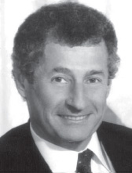

采访：伦纳德·克莱因洛克
===================================

Interview: Leonard Kleinrock 

Leonard Kleinrock is a professor of computer science at the University of California, Los
Angeles. In 1969, his computer at UCLA became the first node of the Internet. His creation of
packet-switching principles in 1961 became the technology behind the Internet. He received his
B.E.E. from the City College of New York (CCNY) and his masters and PhD in electrical
engineering from MIT.

What made you decide to specialize in networking/Internet technology?
--------------------------------------------------------------------------

As a PhD student at MIT in 1959, I looked around and found that most of my classmates were
doing research in the area of information theory and coding theory. At MIT, there was the great
researcher, Claude Shannon, who had launched these fields and had solved most of the
important problems already. The research problems that were left were hard and of lesser
consequence. So I decided to launch out in a new area that no one else had yet conceived of.
Remember that at MIT I was surrounded by lots of computers, and it was clear to me that soon
these machines would need to communicate with each other. At the time, there was no effective
way for them to do so, so I decided to develop the technology that would permit efficient and
reliable data networks to be created.

What was your first job in the computer industry? What did it entail?
---------------------------------------------------------------------------

I went to the evening session at CCNY from 1951 to 1957 for my bachelor’s degree in electrical
engineering. During the day, I worked first as a technician and then as an engineer at a small,
industrial electronics firm called Photobell. While there, I introduced digital technology to their
product line. Essentially, we were using photoelectric devices to detect the presence of certain
items (boxes, people, etc.) and the use of a circuit known then as a bistable multivibrator was
just the kind of technology we needed to bring digital processing into this field of detection.
These circuits happen to be the building blocks for computers, and have come to be known as
flip-flops or switches in today’s vernacular.

What was going through your mind when you sent the first host-to-host message (from UCLA to the Stanford Research Institute)?
-------------------------------------------------------------------------------------------------------------------------------------------

Frankly, we had no idea of the importance of that event. We had not prepared a special
message of historic significance, as did so many inventors of the past (Samuel Morse with “What
hath God wrought.” or Alexander Graham Bell with “Watson, come here! I want you.” or Neal
Amstrong with “That’s one small step for a man, one giant leap for mankind.”) Those guys were
smart! They understood media and public relations. All we wanted to do was to login to the SRI
computer. So we typed the “L”, which was correctly received, we typed the “o” which was
received, and then we typed the “g” which caused the SRI host computer to crash! So, it turned
out that our message was the shortest and perhaps the most prophetic message ever, namely
“Lo!” as in “Lo and behold!”

Earlier that year, I was quoted in a UCLA press release saying that once the network was up
and running, it would be possible to gain access to computer utilities from our homes and offices
as easily as we gain access to electricity and telephone connectivity. So my vision at that time
was that the Internet would be ubiquitous, always on, always available, anyone with any device
could connect from any location, and it would be invisible. However, I never anticipated that my
99-year-old mother would use the Internet—and indeed she did!

What is your vision for the future of networking?
------------------------------------------------------

The easy part of the vision is to predict the infrastructure itself. I anticipate that we see
considerable deployment of nomadic computing, mobile devices, and smart spaces. Indeed, the
availability of lightweight, inexpensive, high-performance, portable computing, and
communication devices (plus the ubiquity of the Internet) has enabled us to become nomads.
Nomadic computing refers to the technology that enables end users who travel from place to
place to gain access to Internet services in a transparent fashion, no matter where they travel
and no matter what device they carry or gain access to. The harder part of the vision is to predict
the applications and services, which have consistently surprised us in dramatic ways (e-mail,
search technologies, the World Wide Web, blogs, social networks, user generation, and sharing
of music, photos, and videos, etc.). We are on the verge of a new class of surprising and
innovative mobile applications delivered to our hand-held devices.

The next step will enable us to move out from the netherworld of cyberspace to the physical
world of smart spaces. Our environments (desks, walls, vehicles, watches, belts, and so on) will
come alive with technology, through actuators, sensors, logic, processing, storage, cameras,
microphones, speakers, displays, and communication. This embedded technology will allow our
environment to provide the IP services we want. When I walk into a room, the room will know I
entered. I will be able to communicate with my environment naturally, as in spoken English; my
requests will generate replies that present Web pages to me from wall displays, through my
eyeglasses, as speech, holograms, and so forth.

Looking a bit further out, I see a networking future that includes the following additional key
components. I see intelligent software agents deployed across the network whose function it is
to mine data, act on that data, observe trends, and carry out tasks dynamically and adaptively. I
see considerably more network traffic generated not so much by humans, but by these
embedded devices and these intelligent software agents. I see large collections of self-
organizing systems controlling this vast, fast network. I see huge amounts of information flashing
across this network instantaneously with this information undergoing enormous processing and
filtering. The Internet will essentially be a pervasive global nervous system. I see all these things
and more as we move headlong through the twenty-first century.

What people have inspired you professionally?
-----------------------------------------------------------------------------------

By far, it was Claude Shannon from MIT, a brilliant researcher who had the ability to relate his
mathematical ideas to the physical world in highly intuitive ways. He was on my PhD thesis
committee.

Do you have any advice for students entering the networking/Internet field?
-----------------------------------------------------------------------------------

The Internet and all that it enables is a vast new frontier, full of amazing challenges. There is
room for great innovation. Don’t be constrained by today’s technology. Reach out and imagine
what could be and then make it happen.