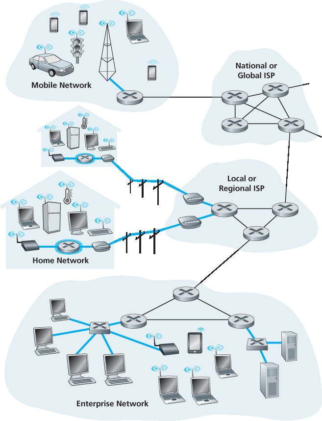
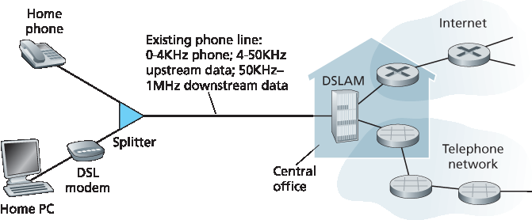
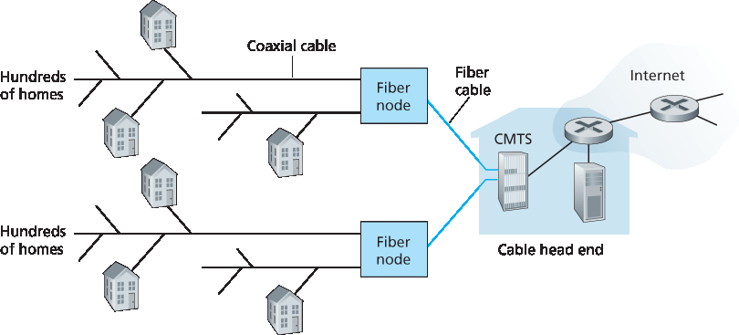
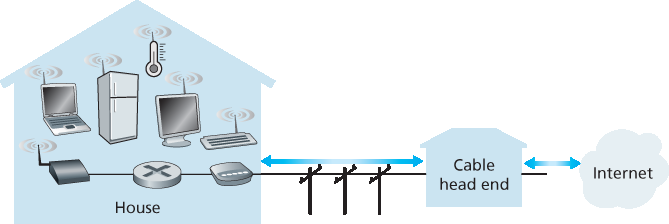

.. _c1.2:

1.2 网络边缘
=================

.. tab:: 中文

.. tab:: 英文

In the previous section we presented a high-level overview of the Internet and networking protocols. We
are now going to delve a bit more deeply into the components of a computer network (and the Internet,
in particular). We begin in this section at the edge of a network and look at the components with which
we are most ­familiar—namely, the computers, smartphones and other devices that we use on a daily
basis. In the next section we’ll move from the network edge to the network core and examine switching
and routing in computer networks.

Recall from the previous section that in computer networking jargon, the computers and other devices
connected to the Internet are often referred to as end systems. They are referred to as end systems
because they sit at the edge of the Internet, as shown in :ref:`Figure 1.3 <End-system interaction>` . The Internet’s end systems include
desktop computers (e.g., desktop PCs, Macs, and Linux boxes), servers (e.g., Web and e-mail servers),
and mobile devices (e.g., laptops, smartphones, and tablets). Furthermore, an increasing number of
non-traditional “things” are being attached to the Internet as end ­systems (see the Case History
feature).

End systems are also referred to as *hosts* because they host (that is, run) application programs such as
a Web browser program, a Web server program, an e-mail client program, or an e-mail server program.
Throughout this book we will use the terms hosts and end systems interchangeably; that is, *host = end system*. Hosts are sometimes further
divided into two categories: **clients** and **servers**. Informally, clients tend to be desktop and mobile PCs,
smartphones, and so on, whereas servers tend to be more powerful machines that store and distribute
Web pages, stream video, relay e-mail, and so on. Today, most of the servers from which we receive
search results, e-mail, Web pages, and videos reside in large **data centers**. For example, Google has
50-100 data centers, including about 15 large centers, each with more than 100,000 servers.

.. _Figure 1.3:

.. figure:: ../img/37-0.png
   :align: center
   :name: End-system interaction

**Figure 1.3 End-system interaction**

.. _Internet of Things:

.. topic:: CASE HISTORY
   
    *THE INTERNET OF THINGS*

    Can you imagine a world in which just about everything is wirelessly connected to the Internet?
    A world in which most people, cars, bicycles, eye glasses, watches, toys, hospital equipment,
    home sensors, classrooms, video surveillance systems, atmospheric sensors, store-shelf
    products, and pets are connected? This world of the Internet of Things (IoT) may actually be just
    around the corner.

    By some estimates, as of 2015 there are already 5 billion things connected to the Internet, and
    the number could reach 25 billion by 2020 :ref:`[Gartner 2014] <Gartner 2014>`. These things include our
    smartphones, which already follow us around in our homes, offices, and cars, reporting our geo-
    locations and usage data to our ISPs and Internet applications. But in addition to our
    smartphones, a wide-variety of non-traditional “things” are already available as products. For
    example, there are Internet-connected wearables, including watches (from Apple and many
    others) and eye glasses. Internet-connected glasses can, for example, upload everything we see
    to the cloud, allowing us to share our visual experiences with people around the world in real-
    time. There are Internet-connected things already available for the smart home, including
    Internet-connected thermostats that can be controlled remotely from our smartphones, and
    Internet-connected body scales, enabling us to graphically review the progress of our diets from
    our smartphones. There are Internet-connected toys, including dolls that recognize and interpret
    a child’s speech and respond appropriately.

    The IoT offers potentially revolutionary benefits to users. But at the same time there are also
    huge security and privacy risks. For example, attackers, via the Internet, might be able to hack
    into IoT devices or into the servers collecting data from IoT devices. For example, an attacker
    could hijack an Internet-connected doll and talk directly with a child; or an attacker could hack
    into a database that stores ­personal health and activity information collected from wearable
    devices. These security and privacy concerns could undermine the consumer confidence
    necessary for the ­technologies to meet their full potential and may result in less widespread
    adoption :ref:`[FTC 2015] <FTC 2015>`.

.. _c1.2.1:

1.2.1 接入网络
-----------------------

1.2.1 Access Networks 

.. tab:: 中文

.. tab:: 英文

Having considered the applications and end systems at the “edge of the network,” let’s next consider the
access network—the network that physically connects an end system to the first router (also known as
the “edge router”) on a path from the end system to any other distant end system. :ref:`Figure 1.4 <Access networks>` shows
several types of access networks with thick, shaded lines and the settings (home, enterprise, and wide-area mobile wireless) in which they are used.

.. _Figure 1.4:

**Figure 1.4 Access networks**

Home Access: DSL, Cable, FTTH, Dial-Up, and Satellite
~~~~~~~~~~~~~~~~~~~~~~~~~~~~~~~~~~~~~~~~~~~~~~~~~~~~~~~~~~

Home Access: DSL, Cable, FTTH, Dial-Up, and Satellite

.. tab:: 中文

.. tab:: 英文

In developed countries as of 2014, more than 78 percent of the households have Internet access, with
Korea, Netherlands, Finland, and Sweden leading the way with more than 80 percent of households
having Internet access, almost all via a high-speed broadband connection :ref:`[ITU 2015] <ITU 2015>`. Given this
widespread use of home access networks let’s begin our overview of access networks by considering
how homes connect to the Internet.

Today, the two most prevalent types of broadband residential access are **digital subscriber line (DSL)**
and cable. A residence typically obtains DSL Internet access from the same local telephone company
(telco) that provides its wired local phone access. Thus, when DSL is used, a customer’s telco is also its
ISP. As shown in :ref:`Figure 1.5 <DSL Internet access>`, each customer’s DSL modem uses the existing telephone line (twisted-
pair copper wire, which we’ll discuss in :ref:`Section 1.2.2 <c1.2.2>` ) to exchange data with a digital subscriber line
access multiplexer (DSLAM) located in the telco’s local central office (CO). The home’s DSL modem
takes digital data and translates it to high-­frequency tones for transmission over telephone wires to the
CO; the analog signals from many such houses are translated back into digital format at the DSLAM.

The residential telephone line carries both data and traditional telephone signals simultaneously, which
are encoded at different frequencies:

- A high-speed downstream channel, in the 50 kHz to 1 MHz band
- A medium-speed upstream channel, in the 4 kHz to 50 kHz band
- An ordinary two-way telephone channel, in the 0 to 4 kHz band

This approach makes the single DSL link appear as if there were three separate links, so that a
telephone call and an Internet connection can share the DSL link at the same time.

.. _Figure 1.5:

**Figure 1.5 DSL Internet access**

(We’ll describe this technique of frequency-division multiplexing in :ref:`Section 1.3.1 <c1.3.1>`.) On the customer side,
a splitter separates the data and telephone signals arriving to the home and forwards the data signal to
the DSL modem. On the telco side, in the CO, the DSLAM separates the data and phone signals and
sends the data into the Internet. Hundreds or even thousands of households connect to a single DSLAM
:ref:`[Dischinger 2007] <Dischinger 2007>`.

The DSL standards define multiple transmission rates, including 12 Mbps downstream and 1.8 Mbps
upstream :ref:`[ITU 1999] <ITU 1999>`, and 55 Mbps downstream and 15 Mbps upstream :ref:`[ITU 2006] <ITU 2006>`. Because the
downstream and upstream rates are different, the access is said to be asymmetric. The actual
downstream and upstream transmission rates achieved may be less than the rates noted above, as the
DSL provider may purposefully limit a residential rate when tiered service (different rates, available at
different prices) are offered. The maximum rate is also limited by the distance between the home and
the CO, the gauge of the twisted-pair line and the degree of electrical interference. Engineers have
expressly designed DSL for short distances between the home and the CO; generally, if the residence is
not located within 5 to 10 miles of the CO, the residence must resort to an alternative form of Internet
access.

While DSL makes use of the telco’s existing local telephone infrastructure, **cable Internet access**
makes use of the cable television company’s existing cable television infrastructure. A residence obtains
cable Internet access from the same company that provides its cable television. As illustrated in :ref:`Figure 1.6 <A hybrid fiber-coaxial access network>`
, fiber optics connect the cable head end to neighborhood-level junctions, from which traditional
coaxial cable is then used to reach individual houses and apartments. Each neighborhood junction
typically supports 500 to 5,000 homes. Because both fiber and coaxial cable are employed in this
system, it is often referred to as hybrid fiber coax (HFC).

.. _Figure 1.6:

**Figure 1.6 A hybrid fiber-coaxial access network**

Cable internet access requires special modems, called cable modems. As with a DSL modem, the cable
modem is typically an external device and connects to the home PC through an Ethernet port. (We will
discuss Ethernet in great detail in :ref:`Chapter 6 <c6>`.) At the cable head end, the cable modem termination
system (CMTS) serves a similar function as the DSL network’s DSLAM—turning the analog signal sent
from the cable modems in many downstream homes back into digital format. Cable modems divide the
HFC network into two channels, a downstream and an upstream channel. As with DSL, access is
typically asymmetric, with the downstream channel typically allocated a higher transmission rate than
the upstream channel. The ­DOCSIS 2.0 standard defines downstream rates up to 42.8 Mbps and
upstream rates of up to 30.7 Mbps. As in the case of DSL networks, the maximum achievable rate may
not be realized due to lower contracted data rates or media impairments.

One important characteristic of cable Internet access is that it is a shared broadcast medium. In
particular, every packet sent by the head end travels downstream on every link to every home and every
packet sent by a home travels on the upstream channel to the head end. For this reason, if several
users are simultaneously downloading a video file on the downstream channel, the actual rate at which
each user receives its video file will be significantly lower than the aggregate cable downstream rate. On
the other hand, if there are only a few active users and they are all Web surfing, then each of the users
may actually receive Web pages at the full cable downstream rate, because the users will rarely request
a Web page at exactly the same time. Because the upstream channel is also shared, a distributed
multiple access protocol is needed to coordinate transmissions and avoid collisions. (We’ll discuss this
collision issue in some detail in :ref:`Chapter 6 <c6>`.)

Although DSL and cable networks currently represent more than 85 percent of residential broadband
access in the United States, an up-and-coming technology that provides even higher speeds is **fiber to
the home (FTTH)** :ref:`[FTTH Council 2016] <FTTH Council 2016>`. As the name suggests, the FTTH concept is simple—provide
an optical fiber path from the CO directly to the home. Many countries today—including the UAE, South
Korea, Hong Kong, Japan, Singapore, Taiwan, Lithuania, and Sweden—now have household
penetration rates exceeding 30% :ref:`[FTTH Council 2016] <FTTH Council 2016>` .

There are several competing technologies for optical distribution from the CO to the homes. The
simplest optical distribution network is called direct fiber, with one fiber leaving the CO for each home.
More commonly, each fiber leaving the central office is actually shared by many homes; it is not until the
fiber gets relatively close to the homes that it is split into individual customer-specific fibers. There are
two competing optical-distribution network architectures that perform this splitting: active optical
networks (AONs) and passive optical networks (PONs). AON is essentially switched Ethernet, which is
discussed in :ref:`Chapter 6 <c6>` .

Here, we briefly discuss PON, which is used in Verizon’s FIOS service. :ref:`Fig­ure 1.7 <FTTH Internet access>` shows FTTH using
the PON distribution architecture. Each home has an optical network terminator (ONT), which is
connected by dedicated optical fiber to a neighborhood splitter. The splitter combines a number of
homes (typically less than 100) onto a single, shared optical fiber, which connects to an optical line ­terminator (OLT) in the
telco’s CO. The OLT, providing conversion between optical and electrical signals, connects to the
Internet via a telco router. In the home, users connect a home router (typically a wireless router) to the
ONT and access the ­Internet via this home router. In the PON architecture, all packets sent from OLT
to the splitter are replicated at the splitter (similar to a cable head end).

.. _Figure 1.7:

.. figure:: ../img/43-0.png
   :align: center 
   :name: FTTH Internet access

**Figure 1.7 FTTH Internet access**

FTTH can potentially provide Internet access rates in the gigabits per second range. However, most
FTTH ISPs provide different rate offerings, with the higher rates naturally costing more money. The
average downstream speed of US FTTH customers was approximately 20 Mbps in 2011 (compared
with 13 Mbps for cable access networks and less than 5 Mbps for DSL) :ref:`[FTTH Council 2011b] <FTTH Council 2011b>`.

Two other access network technologies are also used to provide Internet access to the home. In
locations where DSL, cable, and FTTH are not available (e.g., in some rural settings), a satellite link can
be used to connect a residence to the Internet at speeds of more than 1 Mbps; StarBand and
HughesNet are two such satellite access providers. Dial-up access over traditional phone lines is based
on the same model as DSL—a home modem connects over a phone line to a modem in the ISP.
Compared with DSL and other broadband access networks, dial-up access is excruciatingly slow at 56
kbps.

Access in the Enterprise (and the Home): Ethernet and WiFi
~~~~~~~~~~~~~~~~~~~~~~~~~~~~~~~~~~~~~~~~~~~~~~~~~~~~~~~~~~~~~

Access in the Enterprise (and the Home): Ethernet and WiFi

.. tab:: 中文

.. tab:: 英文

On corporate and university campuses, and increasingly in home settings, a local area network (LAN) is
used to connect an end system to the edge router. Although there are many types of LAN technologies,
Ethernet is by far the most prevalent access technology in corporate, university, and home networks. As
shown in :ref:`Figure 1.8 <Ethernet Internet access>`, Ethernet users use twisted-pair copper wire to connect to an Ethernet switch, a
technology discussed in detail in :ref:`Chapter 6 <c6>`. The Ethernet switch, or a network of such
interconnected switches, is then in turn connected into the larger Internet. With Ethernet access, users
typically have 100 Mbps or 1 Gbps access to the Ethernet switch, whereas servers may have 1 Gbps or
even 10 Gbps access.

.. _Figure 1.8:

.. figure:: ../img/44-0.png
   :align: center 
   :name: Ethernet Internet access

**Figure 1.8 Ethernet Internet access**

Increasingly, however, people are accessing the Internet wirelessly from laptops, smartphones, tablets,
and other “things” (see earlier sidebar on “:ref:`Internet of Things <Internet of Things>`”). In a wireless LAN setting, wireless
users transmit/receive packets to/from an access point that is connected into the enterprise’s network
(most likely using wired Ethernet), which in turn is connected to the wired Internet. A wireless LAN user
must typically be within a few tens of meters of the access point. Wireless LAN access based on IEEE
802.11 technology, more colloquially known as WiFi, is now just about everywhere—universities,
business offices, cafes, airports, homes, and even in airplanes. In many cities, one can stand on a street
corner and be within range of ten or twenty base stations (for a browseable global map of 802.11 base
stations that have been discovered and logged on a Web site by people who take great enjoyment in
doing such things, see :ref:`[wigle.net 2016] <wigle.net 2016>`). As discussed in detail in :ref:`Chapter 7 <c7>`, 802.11 today provides a
shared transmission rate of up to more than 100 Mbps.

Even though Ethernet and WiFi access networks were initially deployed in enterprise (corporate,
university) settings, they have recently become relatively common components of home networks. Many
homes combine broadband residential access (that is, cable modems or DSL) with these inexpensive
wireless LAN technologies to create powerful home networks :ref:`[Edwards 2011] <Edwards 2011>`. :ref:`Figure 1.9 <A typical home network>` shows a
typical home network. This home network consists of a roaming laptop as well as a wired PC; a base
station (the wireless access point), which communicates with the wireless PC and other wireless
devices in the home; a cable modem, providing broadband access to the Internet; and a router, which
interconnects the base station and the stationary PC with the cable modem. This network allows
household members to have broadband access to the Internet with one member roaming from the
kitchen to the backyard to the bedrooms.

.. _Figure 1.9:

**Figure 1.9 A typical home network**

Wide-Area Wireless Access: 3G and LTE
~~~~~~~~~~~~~~~~~~~~~~~~~~~~~~~~~~~~~~~~~

Wide-Area Wireless Access: 3G and LTE

.. tab:: 中文

.. tab:: 英文

Increasingly, devices such as iPhones and Android devices are being used to message, share photos in
social networks, watch movies, and stream music while on the run. These devices employ the same
wireless infrastructure used for cellular telephony to send/receive packets through a base station that is
operated by the cellular network provider. Unlike WiFi, a user need only be within a few tens of
kilometers (as opposed to a few tens of meters) of the base station.

Telecommunications companies have made enormous investments in so-called third-generation (3G)
wireless, which provides packet-switched wide-area wireless Internet access at speeds in excess of 1
Mbps. But even higher-speed wide-area access technologies—a fourth-generation (4G) of wide-area
wireless networks—are already being deployed. LTE (for “Long-Term Evolution”—a candidate for Bad
Acronym of the Year Award) has its roots in 3G technology, and can achieve rates in excess of 10
Mbps. LTE downstream rates of many tens of Mbps have been reported in commercial deployments.
We’ll cover the basic principles of wireless networks and mobility, as well as WiFi, 3G, and LTE
technologies (and more!) in :ref:`Chapter 7 <c7>`.

.. _c1.2.2:

1.2.2 物理介质
-----------------------

1.2.2 Physical Media 

.. tab:: 中文

.. tab:: 英文

In the previous subsection, we gave an overview of some of the most important network access
technologies in the Internet. As we described these technologies, we also indicated the physical media
used. For example, we said that HFC uses a combination of fiber cable and coaxial cable. We said that
DSL and Ethernet use copper wire. And we said that mobile access networks use the radio spectrum. In
this subsection we provide a brief overview of these and other transmission media that are commonly
used in the Internet.

In order to define what is meant by a physical medium, let us reflect on the brief life of a bit. Consider a
bit traveling from one end system, through a series of links and routers, to another end system. This
poor bit gets kicked around and transmitted many, many times! The source end system first transmits
the bit, and shortly thereafter the first router in the series receives the bit; the first router then transmits
the bit, and shortly thereafter the second router receives the bit; and so on. Thus our bit, when traveling
from source to destination, passes through a series of transmitter-receiver pairs. For each transmitter-
receiver pair, the bit is sent by propagating electromagnetic waves or optical pulses across a **physical
medium**. The physical medium can take many shapes and forms and does not have to be of the same
type for each transmitter-receiver pair along the path. Examples of physical media include twisted-pair
copper wire, coaxial cable, multimode fiber-optic cable, terrestrial radio spectrum, and satellite radio
spectrum. Physical media fall into two categories: **guided media** and **unguided media**. With guided
media, the waves are guided along a solid medium, such as a fiber-optic cable, a twisted-pair copper
wire, or a coaxial cable. With unguided media, the waves propagate in the atmosphere and in outer
space, such as in a wireless LAN or a digital satellite channel.

But before we get into the characteristics of the various media types, let us say a few words about their
costs. The actual cost of the physical link (copper wire, fiber-optic cable, and so on) is often relatively
minor compared with other networking costs. In particular, the labor cost associated with the installation
of the physical link can be orders of magnitude higher than the cost of the material. For this reason,
many builders install twisted pair, optical fiber, and coaxial cable in every room in a building. Even if only
one medium is initially used, there is a good chance that another medium could be used in the near
future, and so money is saved by not having to lay additional wires in the future.

Twisted-Pair Copper Wire
~~~~~~~~~~~~~~~~~~~~~~~~~

Twisted-Pair Copper Wire

.. tab:: 中文

.. tab:: 英文

The least expensive and most commonly used guided transmission medium is twisted-pair copper wire.
For over a hundred years it has been used by telephone networks. In fact, more than 99 percent of the
wired connections from the telephone handset to the local telephone switch use twisted-pair copper
wire. Most of us have seen twisted pair in our homes (or those of our parents or grandparents!) and
work environments. Twisted pair consists of two insulated copper wires, each about 1 mm thick,
arranged in a regular spiral pattern. The wires are twisted together to reduce the electrical interference
from similar pairs close by. Typically, a number of pairs are bundled together in a cable by wrapping the
pairs in a protective shield. A wire pair constitutes a single communication link. **Unshielded twisted
pair (UTP)** is commonly used for computer networks within a building, that is, for LANs. Data rates for
LANs using twisted pair today range from 10 Mbps to 10 Gbps. The data rates that can be achieved
depend on the thickness of the wire and the distance between transmitter and receiver.

When fiber-optic technology emerged in the 1980s, many people disparaged twisted pair because of its
relatively low bit rates. Some people even felt that fiber-optic technology would completely replace
twisted pair. But twisted pair did not give up so easily. Modern twisted-pair technology, such as category
6a cable, can achieve data rates of 10 Gbps for distances up to a hundred meters. In the end, twisted
pair has emerged as the dominant solution for high-speed LAN networking.

As discussed earlier, twisted pair is also commonly used for residential Internet access. We saw that
dial-up modem technology enables access at rates of up to 56 kbps over twisted pair. We also saw that
DSL (digital subscriber line) technology has enabled residential users to access the Internet at tens of
Mbps over twisted pair (when users live close to the ISP’s central office).

Coaxial Cable
~~~~~~~~~~~~~~~~~~~~
Coaxial Cable

.. tab:: 中文

.. tab:: 英文

Like twisted pair, coaxial cable consists of two copper conductors, but the two conductors are concentric
rather than parallel. With this construction and special insulation and shielding, coaxial cable can
achieve high data transmission rates. Coaxial cable is quite common in cable television systems. As we
saw earlier, cable television systems have recently been coupled with cable modems to provide
residential users with Internet access at rates of tens of Mbps. In cable television and cable Internet
access, the transmitter shifts the digital signal to a specific frequency band, and the resulting analog
signal is sent from the transmitter to one or more receivers. Coaxial cable can be used as a guided
**shared medium**. Specifically, a number of end systems can be connected directly to the cable, with
each of the end systems receiving whatever is sent by the other end systems.

Fiber Optics
~~~~~~~~~~~~~
Fiber Optics

.. tab:: 中文

.. tab:: 英文

An optical fiber is a thin, flexible medium that conducts pulses of light, with each pulse representing a
bit. A single optical fiber can support tremendous bit rates, up to tens or even hundreds of gigabits per
second. They are immune to electromagnetic interference, have very low signal attenuation up to 100
kilometers, and are very hard to tap. These characteristics have made fiber optics the preferred long-
haul guided transmission media, particularly for overseas links. Many of the long-distance telephone
networks in the United States and elsewhere now use fiber optics exclusively. Fiber optics is also
prevalent in the backbone of the Internet. However, the high cost of optical devices—such as
transmitters, receivers, and switches—has hindered their deployment for short-haul transport, such as in
a LAN or into the home in a residential access network. The Optical Carrier (OC) standard link speeds
range from 51.8 Mbps to 39.8 Gbps; these specifications are often referred to as OC-n, where the link
speed equals n ∞ 51.8 Mbps. Standards in use today include OC-1, OC-3, OC-12, OC-24, OC-48, OC-
96, OC-192, OC-768. [:ref:`Mukherjee 2006 <Mukherjee 2006>`, :ref:`Ramaswami 2010 <Ramaswami 2010>`] provide coverage of various aspects of
optical networking.

Terrestrial Radio Channels
~~~~~~~~~~~~~~~~~~~~~~~~~~~~~~

Terrestrial Radio Channels

.. tab:: 中文

.. tab:: 英文

Radio channels carry signals in the electromagnetic spectrum. They are an attractive medium because
they require no physical wire to be installed, can penetrate walls, provide connectivity to a mobile user,
and can potentially carry a signal for long distances. The characteristics of a radio channel depend
significantly on the propagation environment and the distance over which a signal is to be carried.
Environmental considerations determine path loss and shadow fading (which decrease the signal
strength as the signal travels over a distance and around/through obstructing objects), multipath fading
(due to signal reflection off of interfering objects), and interference (due to other transmissions and
electromagnetic signals).

Terrestrial radio channels can be broadly classified into three groups: those that operate over very short
distance (e.g., with one or two meters); those that operate in local areas, typically spanning from ten to a
few hundred meters; and those that operate in the wide area, spanning tens of kilometers. Personal
devices such as wireless headsets, keyboards, and medical devices operate over short distances; the
wireless LAN technologies described in :ref:`Section 1.2.1 <c1.2.1>` use local-area radio channels; the cellular access
technologies use wide-area radio channels. We’ll discuss radio channels in detail in :ref:`Chapter 7 <c7>`.

Satellite Radio Channels
~~~~~~~~~~~~~~~~~~~~~~~~~~
Satellite Radio Channels

.. tab:: 中文

.. tab:: 英文

A communication satellite links two or more Earth-based microwave transmitter/ receivers, known as
ground stations. The satellite receives transmissions on one frequency band, regenerates the signal
using a repeater (discussed below), and transmits the signal on another frequency. Two types of
satellites are used in communications: **geostationary satellites** and **low-earth orbiting (LEO)
satellites** :ref:`[Wiki Satellite 2016] <Wiki Satellite 2016>`.

Geostationary satellites permanently remain above the same spot on Earth. This stationary presence is
achieved by placing the satellite in orbit at 36,000 kilometers above Earth’s surface. This huge distance
from ground station through satellite back to ground station introduces a substantial signal propagation
delay of 280 milliseconds. Nevertheless, satellite links, which can operate at speeds of hundreds of
Mbps, are often used in areas without access to DSL or cable-based Internet access.

LEO satellites are placed much closer to Earth and do not remain permanently above one spot on Earth.
They rotate around Earth (just as the Moon does) and may communicate with each other, as well as
with ground stations. To provide continuous coverage to an area, many satellites need to be placed in
orbit. There are currently many low-altitude communication systems in development. LEO satellite
technology may be used for Internet access sometime in the future.