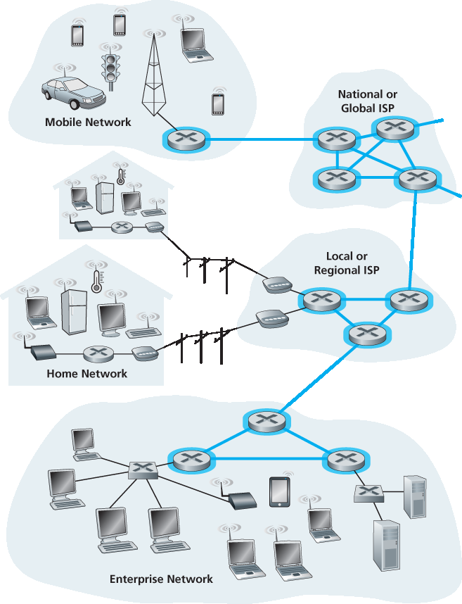
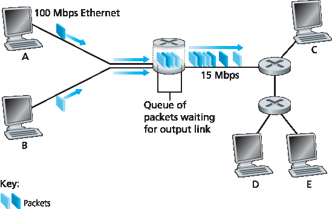
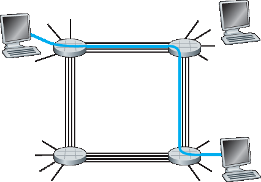
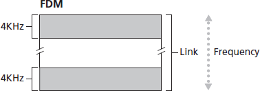
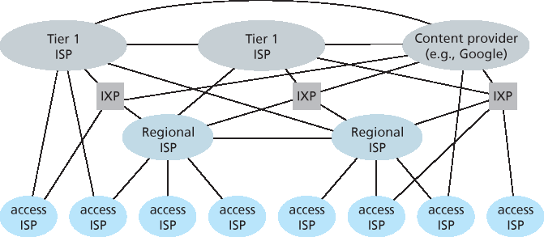

.. _c1.3:

1.3 网络核心
====================

1.3 The Network Core

.. tab:: 中文

.. tab:: 英文

Having examined the Internet’s edge, let us now delve more deeply inside the network core—the mesh of packet switches and links that interconnects the Internet’s end systems. :ref:`Figure 1.10 <The network core>` highlights the network core with thick, shaded lines.

.. _Figure 1.10:

**Figure 1.10 The network core**

.. _c1.3.1:

1.3.1 分组交换
------------------------------

1.3.1 Packet Switching

.. tab:: 中文

.. tab:: 英文

In a network application, end systems exchange **messages** with each other. Messages can contain
anything the application designer wants. Messages may perform a control function (for example, the “Hi”
messages in our handshaking example in :ref:`Figure 1.2 <Figure 1.2>` ) or can contain data, such as an e-mail message,
a JPEG image, or an MP3 audio file. To send a message from a source end system to a destination end
system, the source breaks long messages into smaller chunks of data known as **packets**. Between
source and destination, each packet travels through communication links and **packet switches** (for
which there are two predominant types, **routers** and **link-layer switches**). Packets are transmitted over
each communication link at a rate equal to the *full* transmission rate of the link. So, if a source end
system or a packet switch is sending a packet of *L* bits over a link with transmission rate *R* bits/sec, then
the time to transmit the packet is *L / R* seconds.

Store-and-Forward Transmission
~~~~~~~~~~~~~~~~~~~~~~~~~~~~~~~~~

Most packet switches use **store-and-forward transmission** at the inputs to the links. Store-and-forward
transmission means that the packet switch must receive the entire packet before it can begin to transmit
the first bit of the packet onto the outbound link. To explore store-and-forward transmission in more
detail, consider a simple network consisting of two end systems connected by a single router, as shown
in :ref:`Figure 1.11 <Figure 1.11>`. A router will typically have many incident links, since its job is to switch an incoming
packet onto an outgoing link; in this simple example, the router has the rather simple task of transferring
a packet from one (input) link to the only other attached link. In this example, the source has three
packets, each consisting of L bits, to send to the destination. At the snapshot of time shown in :ref:`Figure 1.11 <Figure 1.11>`, the source has transmitted some of packet 1, and the front of packet 1 has already arrived at the
router. Because the router employs store-and-forwarding, at this instant of time, the router cannot
transmit the bits it has received; instead it must first buffer (i.e., “store”) the packet’s bits. Only after the
router has received *all* of the packet’s bits can it begin to transmit (i.e., “forward”) the packet onto the
outbound link. To gain some insight into store-and-forward transmission, let’s now calculate the amount
of time that elapses from when the source begins to send the packet until the destination has received
the entire packet. (Here we will ignore propagation delay—the time it takes for the bits to travel across
the wire at near the speed of light—which will be discussed in :ref:`Section 1.4 <c1.4>` .) The source begins to
transmit at time 0; at time *L/R* seconds, the source has transmitted the entire packet, and the entire
packet has been received and stored at the router (since there is no propagation delay). At time L/R
seconds, since the router has just received the entire packet, it can begin to transmit the packet onto the
outbound link towards the destination; at time *2L/R*, the router has transmitted the entire packet, and the
entire packet has been received by the destination. Thus, the total delay is *2L/R*. If the
switch instead forwarded bits as soon as they arrive (without first receiving the entire packet), then the
total delay would be *L/R* since bits are not held up at the router. But, as we will discuss in :ref:`Section 1.4 <c1.4>`,
routers need to receive, store, and *process* the entire packet before forwarding.

.. _Figure 1.11:

**Figure 1.11 Store-and-forward packet switching**

Now let’s calculate the amount of time that elapses from when the source begins to send the first packet
until the destination has received all three packets. As before, at time *L/R*, the router begins to forward
the first packet. But also at time *L/R* the source will begin to send the second packet, since it has just
finished sending the entire first packet. Thus, at time *2L/R*, the destination has received the first packet
and the router has received the second packet. Similarly, at time *3L/R*, the destination has received the
first two packets and the router has received the third packet. Finally, at time *4L/R* the destination has
received all three packets!

Let’s now consider the general case of sending one packet from source to destination over a path
consisting of *N* links each of rate R (thus, there are N-1 routers between source and destination).
Applying the same logic as above, we see that the end-to-end delay is:

.. _code 1.1:

.. code-block:: text

    dend-to-end=NLR                                                                  (1.1)

You may now want to try to determine what the delay would be for *P* packets sent over a series of *N* links.

Queuing Delays and Packet Loss
~~~~~~~~~~~~~~~~~~~~~~~~~~~~~~~~~

Each packet switch has multiple links attached to it. For each attached link, the packet switch has an
**output buffer** (also called an **output queue**), which stores packets that the router is about to send into
that link. The output buffers play a key role in packet switching. If an arriving packet needs to be
transmitted onto a link but finds the link busy with the transmission of another packet, the arriving packet
must wait in the output buffer. Thus, in addition to the store-and-forward delays, packets suffer output
buffer **queuing delays**. These delays are variable and depend on the level of congestion in the network.

.. _Figure 1.12:

**Figure 1.12 Packet switching**

Since the amount of buffer space is finite, an arriving packet may find that the buffer is completely full with other packets waiting for transmission. In this case, **packet loss** will occur—either the arriving packet or one of the already-queued packets will be dropped.

:ref:`Figure 1.12 <Figure 1.12>` illustrates a simple packet-switched network. As in :ref:`Figure 1.11 <Figure 1.11>`, packets are represented by
three-dimensional slabs. The width of a slab represents the number of bits in the packet. In this figure,
all packets have the same width and hence the same length. Suppose Hosts A and B are sending
packets to Host E. Hosts A and B first send their packets along 100 Mbps Ethernet links to the first
router. The router then directs these packets to the 15 Mbps link. If, during a short interval of time, the
arrival rate of packets to the router (when converted to bits per second) exceeds 15 Mbps, congestion
will occur at the router as packets queue in the link’s output buffer before being transmitted onto the link.
For example, if Host A and B each send a burst of five packets back-to-back at the same time, then
most of these packets will spend some time waiting in the queue. The situation is, in fact, entirely
analogous to many common-day situations—for example, when we wait in line for a bank teller or wait in
front of a tollbooth. We’ll examine this queuing delay in more detail in :ref:`Section 1.4 <c1.4>`.

Forwarding Tables and Routing Protocols
~~~~~~~~~~~~~~~~~~~~~~~~~~~~~~~~~~~~~~~~~~~

Earlier, we said that a router takes a packet arriving on one of its attached communication links and
forwards that packet onto another one of its attached communication links. But how does the router
determine which link it should forward the packet onto? Packet forwarding is actually done in different
ways in different types of computer networks. Here, we briefly describe how it is done in the Internet.

In the Internet, every end system has an address called an IP address. When a source end system
wants to send a packet to a destination end system, the source includes the destination’s IP address in
the packet’s header. As with postal addresses, this address has a hierarchical structure. When a packet
arrives at a router in the network, the router examines a portion of the packet’s destination address and
forwards the packet to an adjacent router. More specifically, each router has a **forwarding table** that
maps destination addresses (or portions of the destination addresses) to that router’s outbound links.
When a packet arrives at a router, the router examines the address and searches its forwarding table,
using this destination address, to find the appropriate outbound link. The router then directs the packet
to this outbound link.

The end-to-end routing process is analogous to a car driver who does not use maps but instead prefers
to ask for directions. For example, suppose Joe is driving from Philadelphia to 156 Lakeside Drive in
Orlando, Florida. Joe first drives to his neighborhood gas station and asks how to get to 156 Lakeside
Drive in Orlando, Florida. The gas station attendant extracts the Florida portion of the address and tells
Joe that he needs to get onto the interstate highway I-95 South, which has an entrance just next to the
gas station. He also tells Joe that once he enters Florida, he should ask someone else there. Joe then
takes I-95 South until he gets to Jacksonville, Florida, at which point he asks another gas station
attendant for directions. The attendant extracts the Orlando portion of the address and tells Joe that he
should continue on I-95 to Daytona Beach and then ask someone else. In Daytona Beach, another gas
station attendant also extracts the Orlando portion of the address and tells Joe that he should take I-4
directly to Orlando. Joe takes I-4 and gets off at the Orlando exit. Joe goes to another gas station
attendant, and this time the attendant extracts the Lakeside Drive portion of the address and tells Joe
the road he must follow to get to Lakeside Drive. Once Joe reaches Lakeside Drive, he asks a kid on a
bicycle how to get to his destination. The kid extracts the 156 portion of the address and points to the
house. Joe finally reaches his ultimate destination. In the above analogy, the gas station attendants and
kids on bicycles are analogous to routers.

We just learned that a router uses a packet’s destination address to index a forwarding table and
determine the appropriate outbound link. But this statement begs yet another question: How do
forwarding tables get set? Are they configured by hand in each and every router, or does the Internet
use a more automated procedure? This issue will be studied in depth in :ref:`Chapter 5 <c5>`. But to whet your
appetite here, we’ll note now that the Internet has a number of special **routing protocols** that are used
to automatically set the forwarding tables. A routing protocol may, for example, determine the shortest
path from each router to each destination and use the shortest path results to configure the forwarding
tables in the routers.

How would you actually like to see the end-to-end route that packets take in the Internet? We now invite
you to get your hands dirty by interacting with the Trace-route program. Simply visit the site
`www.traceroute.org <http://www.traceroute.org/>`_ , choose a source in a particular country, and trace the route from that source to
your computer. (For a discussion of Traceroute, see :ref:`Section 1.4 <c1.4>`.)

.. _c1.3.2:

1.3.2 电路切换
------------------------------

1.3.2 Circuit Switching

.. tab:: 中文

.. tab:: 英文

There are two fundamental approaches to moving data through a network of links and switches: **circuit
switching** and **packet switching**. Having covered packet-switched networks in the previous
subsection, we now turn our attention to circuit-switched networks.

In circuit-switched networks, the resources needed along a path (buffers, link transmission rate) to
provide for communication between the end systems are *reserved* for the duration of the communication
session between the end systems. In packet-switched networks, these resources are *not* reserved; a
session’s messages use the resources on demand and, as a consequence, may have to wait (that is,
queue) for access to a communication link. As a simple analogy, consider two restaurants, one that
requires reservations and another that neither requires reservations nor accepts them. For the
restaurant that requires reservations, we have to go through the hassle of calling before we leave home.
But when we arrive at the restaurant we can, in principle, immediately be seated and order our meal.
For the restaurant that does not require reservations, we don’t need to bother to reserve a table. But
when we arrive at the restaurant, we may have to wait for a table before we can be seated.

Traditional telephone networks are examples of circuit-switched networks. ­Consider what happens
when one person wants to send information (voice or facsimile) to another over a telephone network.
Before the sender can send the information, the network must establish a connection between the
sender and the receiver. This is a bona fide connection for which the switches on the path between the
sender and receiver maintain connection state for that connection. In the jargon of telephony, this
connection is called a **circuit**. When the network establishes the circuit, it also reserves a constant
transmission rate in the network’s links (representing a fraction of each link’s transmission capacity) for
the duration of the connection. Since a given transmission rate has been reserved for this sender-to-
receiver connection, the sender can transfer the data to the receiver at the guaranteed constant rate.

:ref:`Figure 1.13 <Figure 1.13>` illustrates a circuit-switched network. In this network, the four circuit switches are
interconnected by four links. Each of these links has four circuits, so that each link can support four
simultaneous connections. The hosts (for example, PCs and workstations) are each directly connected
to one of the switches. When two hosts want to communicate, the network establishes a dedicated **end-
to-end connection** between the two hosts. Thus, in order for Host A to communicate with Host B, the
network must first reserve one circuit on each of two links. In this example, the dedicated end-to-end
connection uses the second circuit in the first link and the fourth circuit in the second link. Because each
link has four circuits, for each link used by the end-to-end connection, the connection gets one fourth of
the link’s total transmission capacity for the duration of the connection. Thus, for example, if each link
between adjacent switches has a transmission rate of 1 Mbps, then each end-to-end circuit-switch
connection gets 250 kbps of dedicated transmission rate.

.. _Figure 1.13:

**Figure 1.13 A simple circuit-switched network consisting of four switches and four links**

In contrast, consider what happens when one host wants to send a packet to another host over a
packet-switched network, such as the Internet. As with circuit switching, the packet is transmitted over a
series of communication links. But different from circuit switching, the packet is sent into the network
without reserving any link resources whatsoever. If one of the links is congested because other packets
need to be transmitted over the link at the same time, then the packet will have to wait in a buffer at the
sending side of the transmission link and suffer a delay. The Internet makes its best effort to deliver
packets in a timely manner, but it does not make any guarantees.

Multiplexing in Circuit-Switched Networks
~~~~~~~~~~~~~~~~~~~~~~~~~~~~~~~~~~~~~~~~~~~~~~

A circuit in a link is implemented with either **frequency-division multiplexing (FDM)** or **time-division
multiplexing (TDM)**. With FDM, the frequency spectrum of a link is divided up among the connections
established across the link. Specifically, the link dedicates a frequency band to each connection for the
duration of the connection. In telephone networks, this frequency band typically has a width of 4 kHz
(that is, 4,000 hertz or 4,000 cycles per second). The width of the band is called, not surprisingly, the
**bandwidth**. FM radio stations also use FDM to share the frequency spectrum between 88 MHz and 108
MHz, with each station being allocated a specific frequency band.

For a TDM link, time is divided into frames of fixed duration, and each frame is divided into a fixed
number of time slots. When the network establishes a connection across a link, the network dedicates
one time slot in every frame to this connection. These slots are dedicated for the sole use of that
connection, with one time slot available for use (in every frame) to transmit the connection’s data.

.. _Figure 1.14:

**Figure 1.14 With FDM, each circuit continuously gets a fraction of the bandwidth. With TDM, each circuit gets all of the bandwidth periodically during brief intervals of time (that is, during slots)**

:ref:`Figure 1.14 <Figure 1.14>` illustrates FDM and TDM for a specific network link supporting up to four circuits. For FDM,
the frequency domain is segmented into four bands, each of bandwidth 4 kHz. For TDM, the time
domain is segmented into frames, with four time slots in each frame; each circuit is assigned the same
dedicated slot in the revolving TDM frames. For TDM, the transmission rate of a circuit is equal to the
frame rate multiplied by the number of bits in a slot. For example, if the link transmits 8,000 frames per
second and each slot consists of 8 bits, then the transmission rate of each circuit is 64 kbps.

Proponents of packet switching have always argued that circuit switching is wasteful because the
dedicated circuits are idle during **silent periods**. For example, when one person in a telephone call
stops talking, the idle network resources (frequency bands or time slots in the links along the
connection’s route) cannot be used by other ongoing connections. As another example of how these
resources can be underutilized, consider a radiologist who uses a circuit-switched network to remotely
access a series of x-rays. The radiologist sets up a connection, requests an image, contemplates the
image, and then requests a new image. Network resources are allocated to the connection but are not
used (i.e., are wasted) during the radiologist’s contemplation periods. Proponents of packet switching
also enjoy pointing out that establishing end-to-end circuits and reserving end-to-end transmission
capacity is complicated and requires complex signaling software to coordinate the operation of the
switches along the end-to-end path.

Before we finish our discussion of circuit switching, let’s work through a numerical example that should
shed further insight on the topic. Let us consider how long it takes to send a file of 640,000 bits from
Host A to Host B over a circuit-switched network. Suppose that all links in the network use TDM with 24
slots and have a bit rate of 1.536 Mbps. Also suppose that it takes 500 msec to establish an end-to-end
circuit before Host A can begin to transmit the file. How long does it take to send the file? Each circuit
has a transmission rate of (1.536 Mbps)/24=64 kbps, so it takes (640,000 bits)/(64 kbps)=10 seconds to
transmit the file. To this 10 seconds we add the circuit establishment time, giving 10.5 seconds to send
the file. Note that the transmission time is independent of the number of links: The transmission time
would be 10 seconds if the end-to-end circuit passed through one link or a hundred links. (The actual
end-to-end delay also includes a propagation delay; see :ref:`Section 1.4 <c1.4>` .)

Packet Switching Versus Circuit Switching
~~~~~~~~~~~~~~~~~~~~~~~~~~~~~~~~~~~~~~~~~~~~~~

Having described circuit switching and packet switching, let us compare the two. Critics of packet
switching have often argued that packet switching is not suitable for real-time services (for example,
telephone calls and video conference calls) because of its variable and unpredictable end-to-end delays
(due primarily to variable and unpredictable queuing delays). Proponents of packet switching argue that
(1) it offers better sharing of transmission capacity than circuit switching and (2) it is simpler, more
efficient, and less costly to implement than circuit switching. An interesting discussion of packet
switching versus circuit switching is :ref:`[Molinero-Fernandez 2002] <Molinero-Fernandez 2002>`. Generally speaking, people who do
not like to hassle with ­restaurant reservations prefer packet switching to circuit switching.

Why is packet switching more efficient? Let’s look at a simple example. Suppose users share a 1 Mbps
link. Also suppose that each user alternates between periods of activity, when a user generates data at
a constant rate of 100 kbps, and periods of inactivity, when a user generates no data. Suppose further
that a user is active only 10 percent of the time (and is idly drinking coffee during the remaining 90
percent of the time). With circuit switching, 100 kbps must be reserved for each user at all times. For
example, with circuit-switched TDM, if a one-second frame is divided into 10 time slots of 100 ms each,
then each user would be allocated one time slot per frame.

Thus, the circuit-switched link can support only 10(=1 Mbps/100 kbps) simultaneous users. With packet
switching, the probability that a specific user is active is 0.1 (that is, 10 percent). If there are 35 users,
the probability that there are 11 or more simultaneously active users is approximately 0.0004.
(:ref:`Homework Problem P8 <Homework Problem P8>` outlines how this probability is obtained.) When there are 10 or fewer
simultaneously active users (which happens with probability 0.9996), the aggregate arrival rate of data is
less than or equal to 1 Mbps, the output rate of the link. Thus, when there are 10 or fewer active users,
users’ packets flow through the link essentially without delay, as is the case with circuit switching. When
there are more than 10 simultaneously active users, then the aggregate arrival rate of packets exceeds
the output capacity of the link, and the output queue will begin to grow. (It continues to grow until the
aggregate input rate falls back below 1 Mbps, at which point the queue will begin to diminish in length.)
Because the probability of having more than 10 simultaneously active users is minuscule in this
example, packet switching provides essentially the same performance as circuit switching, *but does so
while allowing for more than three times the number of users.*

Let’s now consider a second simple example. Suppose there are 10 users and that one user suddenly
generates one thousand 1,000-bit packets, while other users remain quiescent and do not generate
packets. Under TDM circuit switching with 10 slots per frame and each slot consisting of 1,000 bits, the
active user can only use its one time slot per frame to transmit data, while the remaining nine time slots
in each frame remain idle. It will be 10 seconds before all of the active user’s one million bits of data has
been transmitted. In the case of packet switching, the active user can continuously send its packets at
the full link rate of 1 Mbps, since there are no other users generating packets that need to be
multiplexed with the active user’s packets. In this case, all of the active user’s data will be transmitted
within 1 second.

The above examples illustrate two ways in which the performance of packet switching can be superior to
that of circuit switching. They also highlight the crucial difference between the two forms of sharing a
link’s transmission rate among multiple data streams. Circuit switching pre-allocates use of the
transmission link regardless of demand, with allocated but unneeded link time going unused. Packet
switching on the other hand allocates link use *on demand*. Link transmission capacity will be shared on
a packet-by-packet basis only among those users who have packets that need to be transmitted over
the link.

Although packet switching and circuit switching are both prevalent in today’s telecommunication
networks, the trend has certainly been in the direction of packet switching. Even many of today’s circuit-
switched telephone networks are slowly migrating toward packet switching. In particular, telephone
networks often use packet switching for the expensive overseas portion of a telephone call.

.. _c1.3.3:

1.3.3 网络之网
------------------------------

1.3.3 A Network of Networks

.. tab:: 中文

.. tab:: 英文

We saw earlier that end systems (PCs, smartphones, Web servers, mail servers, and so on) connect
into the Internet via an access ISP. The access ISP can provide either wired or wireless connectivity,
using an array of access technologies including DSL, cable, FTTH, Wi-Fi, and cellular. Note that the
access ISP does not have to be a telco or a cable company; instead it can be, for example, a university
(providing Internet access to students, staff, and faculty), or a company (providing access for its
employees). But connecting end users and content providers into an access ISP is only a small piece of
solving the puzzle of connecting the billions of end systems that make up the Internet. To complete this
puzzle, the access ISPs themselves must be interconnected. This is done by creating a *network of
networks*—understanding this phrase is the key to understanding the Internet.

Over the years, the network of networks that forms the Internet has evolved into a very complex
structure. Much of this evolution is driven by economics and national policy, rather than by performance
considerations. In order to understand today’s Internet network structure, let’s incrementally build a
series of network structures, with each new structure being a better approximation of the complex
Internet that we have today. Recall that the overarching goal is to interconnect the access ISPs so that
all end systems can send packets to each other. One naive approach would be to have each access
ISP directly connect with every other access ISP. Such a mesh design is, of course, much too costly for
the access ISPs, as it would require each access ISP to have a separate communication link to each of
the hundreds of thousands of other access ISPs all over the world.

Our first network structure, *Network Structure 1*, interconnects all of the access ISPs with a *single global
transit ISP*. Our (imaginary) global transit ISP is a network of routers and communication links that not
only spans the globe, but also has at least one router near each of the hundreds of thousands of access
ISPs. Of course, it would be very costly for the global ISP to build such an extensive network. To be
profitable, it would naturally charge each of the access ISPs for connectivity, with the pricing reflecting
(but not necessarily directly proportional to) the amount of traffic an access ISP exchanges with the
global ISP. Since the access ISP pays the global transit ISP, the access ISP is said to be a **customer**
and the global transit ISP is said to be a **provider**.

Now if some company builds and operates a global transit ISP that is profitable, then it is natural for
other companies to build their own global transit ISPs and compete with the original global transit ISP.
This leads to *Network Structure 2*, which consists of the hundreds of thousands of access ISPs and
*multiple* global ­transit ISPs. The access ISPs certainly prefer Network Structure 2 over Network
Structure 1 since they can now choose among the competing global transit providers as a function of
their pricing and services. Note, however, that the global transit ISPs themselves must interconnect:
Otherwise access ISPs connected to one of the global transit providers would not be able to
communicate with access ISPs connected to the other global transit providers.

Network Structure 2, just described, is a two-tier hierarchy with global transit providers residing at the
top tier and access ISPs at the bottom tier. This assumes that global transit ISPs are not only capable of
getting close to each and every access ISP, but also find it economically desirable to do so. In reality,
although some ISPs do have impressive global coverage and do directly connect with many access
ISPs, no ISP has presence in each and every city in the world. Instead, in any given region, there may
be a **regional ISP** to which the access ISPs in the region connect. Each regional ISP then connects to
**tier-1 ISPs**. Tier-1 ISPs are similar to our (imaginary) global transit ISP; but tier-1 ISPs, which actually
do exist, do not have a presence in every city in the world. There are approximately a dozen tier-1 ISPs,
including Level 3 Communications, AT&T, Sprint, and NTT. Interestingly, no group officially sanctions
tier-1 status; as the saying goes—if you have to ask if you’re a member of a group, you’re probably not.

Returning to this network of networks, not only are there multiple competing tier-1 ISPs, there may be
multiple competing regional ISPs in a region. In such a hierarchy, each access ISP pays the regional
ISP to which it connects, and each regional ISP pays the tier-1 ISP to which it connects. (An access ISP
can also connect directly to a tier-1 ISP, in which case it pays the tier-1 ISP). Thus, there is customer-
provider relationship at each level of the hierarchy. Note that the tier-1 ISPs do not pay anyone as they
are at the top of the hierarchy. To further complicate matters, in some regions, there may be a larger
regional ISP (possibly spanning an entire country) to which the smaller regional ISPs in that region
connect; the larger regional ISP then connects to a tier-1 ISP. For example, in China, there are access
ISPs in each city, which connect to provincial ISPs, which in turn connect to national ISPs, which finally
connect to tier-1 ISPs :ref:`[Tian 2012] <Tian 2012>`. We refer to this multi-tier hierarchy, which is still only a crude
approximation of today’s Internet, as *Network Structure 3*.

To build a network that more closely resembles today’s Internet, we must add points of presence
(PoPs), multi-homing, peering, and Internet exchange points (IXPs) to the hierarchical Network
Structure 3. PoPs exist in all levels of the hierarchy, except for the bottom (access ISP) level. A **PoP** is
simply a group of one or more routers (at the same location) in the provider’s network where customer
ISPs can connect into the provider ISP. For a customer network to connect to a provider’s PoP, it can
lease a high-speed link from a third-party telecommunications provider to directly connect one of its
routers to a router at the PoP. Any ISP (except for tier-1 ISPs) may choose to **multi-home**, that is, to
connect to two or more provider ISPs. So, for example, an access ISP may multi-home with two regional
ISPs, or it may multi-home with two regional ISPs and also with a tier-1 ISP. Similarly, a regional ISP
may multi-home with multiple tier-1 ISPs. When an ISP multi-homes, it can continue to send and receive
packets into the Internet even if one of its providers has a failure.

As we just learned, customer ISPs pay their provider ISPs to obtain global Internet interconnectivity. The
amount that a customer ISP pays a provider ISP reflects the amount of traffic it exchanges with the
provider. To reduce these costs, a pair of nearby ISPs at the same level of the hierarchy can **peer**, that
is, they can directly connect their networks together so that all the traffic between them passes over the
direct connection rather than through upstream intermediaries. When two ISPs peer, it is typically
settlement-free, that is, neither ISP pays the other. As noted earlier, tier-1 ISPs also peer with one
another, settlement-free. For a readable discussion of peering and customer-provider relationships, see
:ref:`[Van der Berg 2008] <Van der Berg 2008>`. Along these same lines, a third-party company can create an **Internet Exchange Point (IXP)**, which is a meeting point where multiple ISPs can peer together. An IXP is typically in a
stand-alone building with its own switches :ref:`[Ager 2012] <Ager 2012>`. There are over 400 IXPs in the Internet today
:ref:`[IXP List 2016] <IXP List 2016>`. We refer to this ecosystem—consisting of access ISPs, regional ISPs, tier-1 ISPs,
PoPs, multi-homing, peering, and IXPs—as *Network Structure 4*.

We now finally arrive at Network Structure 5, which describes today’s Internet. Network Structure 5,
illustrated in :ref:`Figure 1.15 <Figure 1.15>`, builds on top of Network Structure 4 by adding **content-provider networks**.
Google is currently one of the leading examples of such a content-provider network. As of this writing, it
is estimated that Google has 50–100 data centers distributed across North America, Europe, Asia,
South America, and Australia. Some of these data centers house over one hundred thousand servers,
while other data centers are smaller, housing only hundreds of servers. The Google data centers are all
interconnected via Google’s private TCP/IP network, which spans the entire globe but is nevertheless
separate from the public Internet. Importantly, the Google private network only carries traffic to/from
Google servers. As shown in :ref:`Figure 1.15 <Figure 1.15>`, the Google private network attempts to “bypass” the upper
tiers of the Internet by peering (settlement free) with lower-tier ISPs, either by directly connecting with
them or by connecting with them at IXPs :ref:`[Labovitz 2010] <Labovitz 2010>`. However, because many access ISPs can
still only be reached by transiting through tier-1 networks, the Google network also connects to tier-1
ISPs, and pays those ISPs for the traffic it exchanges with them. By creating its own network, a content
provider not only reduces its payments to upper-tier ISPs, but also has greater control of how its
services are ultimately delivered to end users. Google’s network infrastructure is described in greater
detail in :ref:`Section 2.6 <c2.6>`.

In summary, today’s Internet—a network of networks—is complex, consisting of a dozen or so tier-1
ISPs and hundreds of thousands of lower-tier ISPs. The ISPs are diverse in their coverage, with some
spanning multiple continents and oceans, and others limited to narrow geographic regions. The lower-
tier ISPs connect to the higher-tier ISPs, and the higher-tier ISPs interconnect with one another. Users
and content providers are customers of lower-tier ISPs, and lower-tier ISPs are customers of higher-tier
ISPs. In recent years, major content providers have also created their own networks and connect
directly into lower-tier ISPs where possible.

.. _Figure 1.15:

   
:i: **Figure 1.15 Interconnection of ISPs**