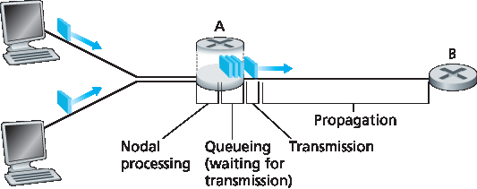
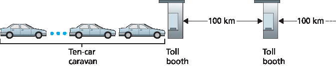
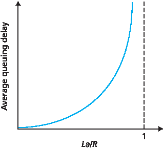
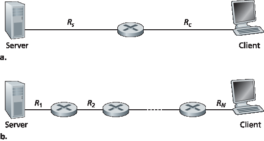
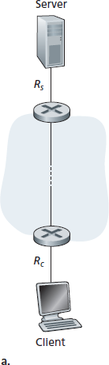
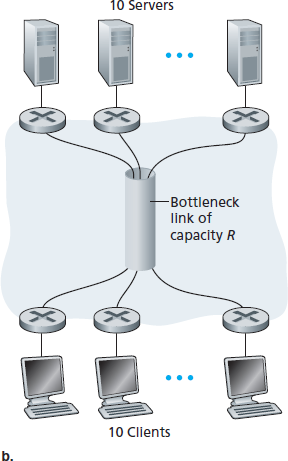

.. _c1.4:

1.4 分组交换网络中的时延、丢包与吞吐量
=================================================================

1.4 Delay, Loss, and Throughput in Packet-Switched Networks

我们在 :ref:`第 1.1 节 <c1.1>` 中曾提到，互联网可以被看作是一个为运行在端系统上的分布式应用提供服务的基础设施。理想情况下，我们希望互联网服务能够在任意两个端系统之间瞬间传输任意多的数据，且数据不丢失。遗憾的是，这是一个难以实现的目标。实际上，计算机网络不可避免地会限制端系统之间的 **吞吐量** （即每秒传输的数据量），引入 **时延** ，甚至会造成 **分组丢失** 。

一方面，物理规律引入时延、丢包以及吞吐量约束似乎令人沮丧；但另一方面，正因为这些问题的存在，计算机网络才充满了各种复杂问题，足以撑起一门课程，甚至催生数千篇博士论文！在本节中，我们将开始分析并量化计算机网络中的时延、丢包与吞吐量。

.. toggle::

   Back in :ref:`Section 1.1 <c1.1>` we said that the Internet can be viewed as an infrastructure that provides services
   to distributed applications running on end systems. Ideally, we would like Internet services to be able to
   move as much data as we want between any two end systems, instantaneously, without any loss of
   data. Alas, this is a lofty goal, one that is unachievable in reality. Instead, computer networks necessarily
   constrain throughput (the amount of data per second that can be transferred) between end systems,
   introduce delays between end systems, and can actually lose packets. On one hand, it is unfortunate
   that the physical laws of reality introduce delay and loss as well as constrain throughput. On the other
   hand, because computer networks have these problems, there are many fascinating issues surrounding
   how to deal with the problems—more than enough issues to fill a course on computer networking and to
   motivate thousands of PhD theses! In this section, we’ll begin to examine and quantify delay, loss, and
   throughput in computer networks.

.. _c1.4.1:

1.4.1 分组交换网络中的时延概述
-------------------------------------------------------
1.4.1 Overview of Delay in Packet-Switched Networks

回忆一下，一个分组从主机（源）出发，经过一系列路由器，最终到达另一个主机（目的地）。当分组沿路径从一个节点（主机或路由器）传输到下一个节点时，在每个节点都会经历若干类型的时延。最重要的几种包括： **结点处理时延（nodal processing delay）**、 **排队时延（queuing delay）**、 **传输时延（transmission delay）** 和 **传播时延（propagation delay）**。这些时延加总即为 **总结点时延（total nodal delay）**。

许多互联网应用的性能（如搜索、网页浏览、电子邮件、地图、即时通信和语音 IP 电话）都严重依赖于网络时延。若要深入理解分组交换和计算机网络，就必须理解这些时延的性质与重要性。

.. toggle::

   Recall that a packet starts in a host (the source), passes through a series of routers, and ends its
   journey in another host (the destination). As a packet travels from one node (host or router) to the
   subsequent node (host or router) along this path, the packet suffers from several types of delays at each
   node along the path. The most important of these delays are the **nodal processing delay**, **queuing
   delay**, **transmission delay**, and **propagation delay**; together, these delays accumulate to give a **total
   nodal delay**. The performance of many Internet applications—such as search, Web browsing, e-mail,
   maps, instant messaging, and voice-over-IP—are greatly affected by network delays. In order to acquire
   a deep understanding of packet switching and computer networks, we must understand the nature and
   importance of these delays.

时延类型
~~~~~~~~~~~~~~~~~~~~~~
Types of Delay

让我们结合 :ref:`图 1.16 <Figure 1.16>` 来探讨这些时延。在从源到目的地的端到端路径中，假设分组从上游节点经过路由器 A 发送到路由器 B。我们希望分析路由器 A 处的总结点时延。

请注意，路由器 A 有一条指向路由器 B 的出链路，在此链路之前还有一个 **队列（queue）** 或称 **缓冲区（buffer）** 。当分组从上游节点到达路由器 A 时，路由器 A 会检查分组头部以确定其应该转发到哪个出链路，并将其导向该链路。在本例中，分组应发往指向路由器 B 的链路。只有在该链路当前没有其他分组正在传输，且队列中无等待分组时，该分组才能立即传输；否则将进入队列排队。

.. _Figure 1.16:

**图 1.16 路由器 A 处的结点时延**

.. toggle::

   Let’s explore these delays in the context of :ref:`Figure 1.16 <Figure 1.16>`. As part of its end-to-end route between source
   and destination, a packet is sent from the upstream node through router A to router B. Our goal is to
   characterize the nodal delay at router A. Note that router A has an outbound link leading to router B.
   This link is preceded by a queue (also known as a buffer). When the packet arrives at router A from the
   upstream node, router A examines the packet’s header to determine the appropriate outbound link for
   the packet and then directs the packet to this link. In this example, the outbound link for the packet is the
   one that leads to router B. A packet can be transmitted on a link only if there is no other packet currently
   being transmitted on the link and if there are no other packets preceding it in the queue; if the link is
   currently busy or if there are other packets already queued for the link, the newly arriving packet will
   then join the queue.

   .. figure:: ../img/63-0.png
      :align: center
      :name: The nodal delay at router A

   **Figure 1.16 The nodal delay at router A**

处理时延
~~~~~~~~~~~~~~~~~~
Processing Delay

检查分组头部并确定其转发方向所需的时间称为 **处理时延（processing delay）**。处理时延还包括其他因素，如检测分组比特错误所需时间。高速路由器中的处理时延通常在微秒或更短时间内。处理完成后，路由器会将分组送入指向路由器 B 的出链路的队列。（在 :ref:`第 4 章 <c4>` 中我们将详细研究路由器的工作原理。）

.. toggle::

   The time required to examine the packet’s header and determine where to direct the packet is part of
   the **processing delay**. The processing delay can also include other factors, such as the time needed to
   check for bit-level errors in the packet that occurred in transmitting the packet’s bits from the upstream
   node to router A. Processing delays in high-speed routers are typically on the order of microseconds or
   less. After this nodal processing, the router directs the packet to the queue that precedes the link to
   router B. (In :ref:`Chapter 4 <c4>` we’ll study the details of how a router operates.)

排队时延
~~~~~~~~~~~~~~~~~~
Queuing Delay

在队列中，分组会经历 **排队时延（queuing delay）**，即等待被传输到链路上的时间。该时延取决于该分组之前已有多少分组在等待传输。如果队列为空，且没有其他分组正在传输，则排队时延为零。反之，若流量繁忙且队列中已有多个分组，排队时延则会增加。我们将看到，到达队列的分组数量与流量强度和特性密切相关。排队时延通常在微秒到毫秒之间。

.. toggle::

   At the queue, the packet experiences a **queuing delay** as it waits to be transmitted onto the link. The
   length of the queuing delay of a specific packet will depend on the number of earlier-arriving packets
   that are queued and waiting for transmission onto the link. If the queue is empty and no other packet is
   currently being transmitted, then our packet’s queuing delay will be zero. On the other hand, if the traffic
   is heavy and many other packets are also waiting to be transmitted, the queuing delay will be long. We
   will see shortly that the number of packets that an arriving packet might expect to find is a function of the
   intensity and nature of the traffic arriving at the queue. ­Queuing delays can be on the order of
   microseconds to milliseconds in practice.

传输时延
~~~~~~~~~~~~~~~~~~~~~~
Transmission Delay

假设采用先进先出（FIFO）方式传输分组，分组必须等前面的所有分组传输完后才能传输。设分组长度为 L 位，链路传输速率为 R 比特/秒，则 **传输时延（transmission delay）** 为 L/R，即将所有比特“推出”链路所需时间。比如，对于 10 Mbps 的以太网链路，R = 10 Mbps；对于 100 Mbps 的以太网，R = 100 Mbps。实际中的传输时延范围也是微秒到毫秒级。

.. toggle::

   Assuming that packets are transmitted in a first-come-first-served manner, as is common in packet-
   switched networks, our packet can be transmitted only after all the packets that have arrived before it
   have been transmitted. Denote the length of the packet by L bits, and denote the transmission rate of
   the link from router A to router B by R bits/sec. For example, for a 10 Mbps Ethernet link, the rate is
   R=10 Mbps; for a 100 Mbps Ethernet link, the rate is R=100 Mbps. The transmission delay is L/R. This
   is the amount of time required to push (that is, transmit) all of the packet’s bits into the link.
   Transmission delays are typically on the order of microseconds to milliseconds in practice.

传播时延
~~~~~~~~~~~~~~~~~~~~~~
Propagation Delay

当比特被推出链路后，需经过一段时间传播到下一个节点。 **传播时延（propagation delay）** 是比特从链路起点传播到下一个节点所需时间。传播速率取决于链路介质（如光纤、双绞线等），通常在：

   2x10⁸ 米/秒 到 3x10⁸ 米/秒

之间，约等于或略低于光速。

传播时延等于节点间距离 d 与传播速率 s 的比值，即 d/s。当最后一个比特到达节点 B 时，该分组已完整抵达，并由路由器 B 执行转发。广域网中的传播时延通常为毫秒级。

.. toggle::

   Once a bit is pushed into the link, it needs to propagate to router B. The time required to propagate from
   the beginning of the link to router B is the **propagation delay**. The bit propagates at the propagation
   speed of the link. The propagation speed depends on the physical medium of the link (that is, fiber
   optics, twisted-pair copper wire, and so on) and is in the range of

      2⋅108 meters/sec to 3⋅108 meters/sec

   which is equal to, or a little less than, the speed of light. The propagation delay is the distance between
   two routers divided by the propagation speed. That is, the propagation delay is d/s, where d is the
   distance between router A and router B and s is the propagation speed of the link. Once the last bit of
   the packet propagates to node B, it and all the preceding bits of the packet are stored in router B. The
   whole process then continues with router B now performing the forwarding. In wide-area networks,
   propagation delays are on the order of milliseconds.

比较传输时延与传播时延
~~~~~~~~~~~~~~~~~~~~~~~~~~~~~~~~~~~~~~~~~~~~~~
Comparing Transmission and Propagation Delay

.. youtube:: hm1y4LsphQQ
   :align: center

.. image:: ../img/videonote.png
   :align: center
   :target: https://www.youtube.com/watch?v=hm1y4LsphQQ
   
初学者常常难以理解传输时延与传播时延的区别。其实二者差别虽小但至关重要。传输时延取决于分组长度和链路带宽，与两个节点间距离无关；而传播时延则取决于两个节点的距离，与分组大小和带宽无关。

我们来看一个类比帮助理解：

设一条高速公路每隔 100 公里设一收费站，如 :ref:`图 1.17 <Figure 1.17>` 所示。公路区段类比链路，收费站类比路由器。假设汽车在收费站之间以恒定 100 km/h 速度行驶。若有 10 辆车组成车队，类比一个分组中的 10 个比特；每辆车代表一个比特。每个收费站以每 12 秒一辆车的速率放行车辆，车队在到达收费站时需等待所有车辆集合完毕才能开始依次通过。

推送整支车队所需时间为 10 车 / (5 车/分钟) = 2 分钟，即类比传输时延。

车从一个收费站行驶到下一个所需时间为 100 公里 / 100 km/h = 1 小时，即类比传播时延。

因此，从车队在第一个收费站排队开始，到其全部到达下一个收费站，需时 62 分钟。

.. _Figure 1.17:

**图 1.17 车队类比**

我们稍作扩展。若收费站处理速度慢于汽车行驶速度会怎样？例如车速为 1000 km/h，收费站每分钟通过 1 车，则两个收费站间行驶时间为 6 分钟，而整个车队通过收费站需 10 分钟。这时，前几辆车在第一个收费站尚未离开，最后几辆车就已到达下一个收费站。这种情况也会出现在分组网络中：一个分组的前几个比特已到达路由器，而剩余比特仍在前一个路由器等待发送。

如果“一图胜千言”，那么动画应能胜过百万字。本文教材网站提供了演示传播与传输时延差异的交互式 Java 小程序，读者可自行访问学习。另见 :ref:`[Smith 2009] <Smith 2009>`，其中也有通俗的时延讨论。

若用 :math:`d_{proc}` 、:math:`d_{queue}` 、:math:`d_{trans}` 、:math:`d_{prop}` 分别表示处理、排队、传输、传播时延，则结点总时延为：

.. math::

   d_{nodal} = d_{proc} + d_{queue} + d_{trans} + d_{prop}

这些时延在实际中可能差异很大。例如，在同一校园内两路由器之间，:math:`d_{proc}` 可忽略不计（仅几个微秒）；但若是通过地球同步卫星连接的路由器，:math:`d_{prop}` 可能高达数百毫秒，成为主导因素。

同样，:math:`d_{trans}` 也可能从极小到显著不等。在 10 Mbps 或更高速率链路中（如局域网），:math:`d_{trans}` 通常可忽略；但在拨号调制解调器等低速链路中，发送大包可能产生数百毫秒时延。

传播时延 :math:`d_{prop}` 通常也很小，但却决定了路由器最大吞吐率，即其转发分组的最大速率。

.. toggle::

   .. image:: ../img/videonote
      :align: center 
      :target: https://www.youtube.com/watch?v=hm1y4LsphQQ

   Exploring propagation delay and transmission delay

   Newcomers to the field of computer networking sometimes have difficulty understanding the difference
   between transmission delay and propagation delay. The difference is subtle but important. The
   transmission delay is the amount of time required for the router to push out the packet; it is a function of
   the packet’s length and the transmission rate of the link, but has nothing to do with the distance between
   the two routers. The propagation delay, on the other hand, is the time it takes a bit to propagate from
   one router to the next; it is a function of the distance between the two routers, but has nothing to do with
   the packet’s length or the transmission rate of the link.

   An analogy might clarify the notions of transmission and propagation delay. Consider a highway that has
   a tollbooth every 100 kilometers, as shown in :ref:`Figure 1.17 <Figure 1.17>`. You can think of the highway segments
   between tollbooths as links and the tollbooths as routers. Suppose that cars travel (that is, propagate)
   on the highway at a rate of 100 km/hour (that is, when a car leaves a tollbooth, it instantaneously
   accelerates to 100 km/hour and maintains that speed between tollbooths). Suppose next that 10 cars,
   traveling together as a caravan, follow each other in a fixed order. You can think of each car as a bit and
   the caravan as a packet. Also suppose that each tollbooth services (that is, transmits) a car at a rate of one car per 12 seconds, and that it is late at night
   so that the caravan’s cars are the only cars on the highway. Finally, suppose that whenever the first car
   of the caravan arrives at a tollbooth, it waits at the entrance until the other nine cars have arrived and
   lined up behind it. (Thus the entire caravan must be stored at the tollbooth before it can begin to be
   forwarded.) The time required for the tollbooth to push the entire caravan onto the highway is
   (10 cars)/(5 cars/minute)=2 minutes. This time is analogous to the transmission delay in a router. The
   time required for a car to travel from the exit of one tollbooth to the next tollbooth is
   100 km/(100 km/hour)=1 hour. This time is analogous to propagation delay. Therefore, the time from
   when the caravan is stored in front of a tollbooth until the caravan is stored in front of the next tollbooth
   is the sum of transmission delay and propagation delay—in this example, 62 minutes.

   .. figure:: ../img/65-0.png
      :align: center
      :name: Caravan analogy

   **Figure 1.17 Caravan analogy**

   Let’s explore this analogy a bit more. What would happen if the tollbooth service time for a caravan were
   greater than the time for a car to travel between tollbooths? For example, suppose now that the cars
   travel at the rate of 1,000 km/hour and the tollbooth services cars at the rate of one car per minute. Then
   the traveling delay between two tollbooths is 6 minutes and the time to serve a caravan is 10 minutes. In
   this case, the first few cars in the caravan will arrive at the second tollbooth before the last cars in the
   caravan leave the first tollbooth. This situation also arises in packet-switched networks—the first bits in a
   packet can arrive at a router while many of the remaining bits in the packet are still waiting to be
   transmitted by the preceding router.

   If a picture speaks a thousand words, then an animation must speak a million words. The Web site for
   this textbook provides an interactive Java applet that nicely illustrates and contrasts transmission delay
   and propagation delay. The reader is highly encouraged to visit that applet. :ref:`[Smith 2009] <Smith 2009>` also provides
   a very readable discussion of propagation, queueing, and transmission delays.

   If we let :math:`d_{proc}`, :math:`d_{queue}`, :math:`d_{trans}`, and :math:`d_{prop}` denote the processing, queuing, transmission, and propagation delays, then the total nodal delay is given by

   .. math::

      d_{nodal} = d_{proc} + d_{queue} + d_{trans} + d_{prop}

   The contribution of these delay components can vary significantly. For example, :math:`d_{proc}` can be negligible
   (for example, a couple of microseconds) for a link connecting two routers on the same university
   campus; however, :math:`d_{proc}` is hundreds of milliseconds for two routers interconnected by a geostationary
   satellite link, and can be the dominant term in :math:`d_{nodal}`. Similarly,  :math:`d_{trans}` can range from negligible to
   significant. Its contribution is typically negligible for transmission rates of 10 Mbps and higher (for
   example, for LANs); however, it can be hundreds of milliseconds for large Internet packets sent over
   low-speed dial-up modem links. The processing delay, :math:`d_{prop}`, is often negligible; however, it strongly
   influences a router’s maximum throughput, which is the maximum rate at which a router can forward
   packets.

.. _c1.4.2:

1.4.2 排队时延与分组丢失
-------------------------------------------------------
1.4.2 Queuing Delay and Packet Loss

在所有结点时延中，最复杂且最有趣的部分是 **排队时延（queuing delay）**，记作 :math:`d_{queue}`。事实上，排队时延在计算机网络中的重要性极高，以至于已有数千篇论文和众多专著专门研究它 [:ref:`Bertsekas 1991 <Bertsekas 1991>`; :ref:`Daigle 1991 <Daigle 1991>`; :ref:`Kleinrock 1975 <Kleinrock 1975>`, :ref:`Kleinrock 1976 <Kleinrock 1976>`; :ref:`Ross 1995 <Ross 1995>`]。本节仅对排队时延做高层次的直观讨论，若读者兴趣更浓厚，不妨进一步阅读这些著作，甚至撰写博士论文！

与其他三种时延（:math:`d_{proc}`、 :math:`d_{trans}`、 :math:`d_{prop}`）不同，排队时延在不同分组之间可能变化极大。例如，若 10 个分组同时到达一个空队列，第一个被发送的分组将无排队时延，而最后一个则需等待前面 9 个分组传输完，排队时延较大。因此，分析排队时延时通常使用统计指标，如平均排队时延、时延方差、排队时延超过某个阈值的概率等。

排队时延何时会很大？何时又可以忽略？这取决于到达队列的 **流量速率** 、链路的 **传输速率** ，以及流量的特性（例如是否周期性到达或以突发方式到达）。为便于理解，设 a 为平均到达分组速率（单位为分组/秒），设 R 为链路传输速率（单位为比特/秒），每个分组长度为 L 比特，则平均到达比特速率为 La（单位为比特/秒）。

再假设队列足够大，可容纳无限个分组。 **流量强度（traffic intensity）** 定义为 La/R。若 La/R > 1，即分组到达速率超过链路的传输能力，队列将无限增长，排队时延趋于无穷。因此，流量工程的黄金法则是： **设计系统时应确保 La/R ≤ 1**。

若 La/R ≤ 1，则排队时延与到达流量的具体模式有关。例如，若分组周期性到达，且间隔刚好为 L/R 秒，则每次分组都遇到空队列，排队时延为零。反之，若分组周期性突发到达，如每隔 (L/R)N 秒有 N 个分组同时到达，则第一个分组无排队时延，第二个排队 L/R 秒，第 n 个排队 (n-1)L/R 秒。这个例子中的 **平均排队时延** 可留作练习。

上述周期性模型有些理想化。现实中，分组到达通常是随机的，即分组间间隔呈随机分布。在这种更贴近实际的情况下，仅靠 La/R 并不能完全描述排队时延的统计特性。但 La/R 仍有助于形成直觉。例如，若 La/R 接近 0，表示分组稀疏，基本不会遇到队列，平均排队时延近似为 0。而当 La/R 接近 1 时，会出现某些时段分组速率超过链路容量，导致队列堆积；虽然后续可能清空，但平均排队长度将不断增加。

:ref:`图 1.18 <Figure 1.18>` 直观展示了平均排队时延与流量强度的关系。

.. _Figure 1.18:

**图 1.18 平均排队时延对流量强度的依赖性**

图中一个重要特性是：**当流量强度接近 1 时，平均排队时延迅速上升**。也就是说，流量强度每增加一个百分点，时延可能指数级增加。你或许在高速公路上体验过类似现象——当道路本就拥堵时，哪怕交通量略微增加，延迟也可能变得难以忍受。

若想更好地感受排队时延，建议访问教材网站的交互式 Java 小程序。当设置到达速率超过链路容量（La/R > 1）时，可观察到队列逐渐增长。

.. toggle::

   The most complicated and interesting component of nodal delay is the queuing delay, dqueue. In fact,
   queuing delay is so important and interesting in computer networking that thousands of papers and
   numerous books have been written about it [ :ref:`Bertsekas 1991 <Bertsekas 1991>`; :ref:`Daigle 1991 <Daigle 1991>`; :ref:`Kleinrock 1975 <Kleinrock 1975>`, :ref:`Kleinrock 1976 <Kleinrock 1976>`; :ref:`Ross 1995 <Ross 1995>`]. We give only a high-level, intuitive discussion of queuing delay here; the more
   curious reader may want to browse through some of the books (or even eventually write a PhD thesis on
   the subject!). Unlike the other three delays (namely, :math:`d_{proc}`, :math:`d_{trans}`, and :math:`d_{prop}`), the queuing delay can vary
   from packet to packet. For example, if 10 packets arrive at an empty queue at the same time, the first
   packet transmitted will suffer no queuing delay, while the last packet transmitted will suffer a relatively
   large queuing delay (while it waits for the other nine packets to be transmitted). Therefore, when
   characterizing queuing delay, one typically uses statistical measures, such as average queuing delay,
   variance of queuing delay, and the probability that the queuing delay exceeds some specified value.

   When is the queuing delay large and when is it insignificant? The answer to this question depends on
   the rate at which traffic arrives at the queue, the transmission rate of the link, and the nature of the
   arriving traffic, that is, whether the traffic arrives periodically or arrives in bursts. To gain some insight
   here, let a denote the average rate at which packets arrive at the queue (a is in units of packets/sec).
   Recall that R is the transmission rate; that is, it is the rate (in bits/sec) at which bits are pushed out of the
   queue. Also suppose, for simplicity, that all packets consist of *L* bits. Then the average rate at which bits
   arrive at the queue is *La* bits/sec. Finally, assume that the queue is very big, so that it can hold
   essentially an infinite number of bits. The ratio *La/R*, called the traffic intensity, often plays an
   important role in estimating the extent of the queuing delay. If *La/R* > 1, then the average rate at which
   bits arrive at the queue exceeds the rate at which the bits can be transmitted from the queue. In this
   unfortunate situation, the queue will tend to increase without bound and the queuing delay will approach
   infinity! Therefore, one of the golden rules in traffic engineering is: *Design your system so that the traffic
   intensity is no greater than 1.*

   Now consider the case *La/R* ≤ 1. Here, the nature of the arriving traffic impacts the queuing delay. For
   example, if packets arrive periodically—that is, one packet arrives every *L/R* seconds—then every
   packet will arrive at an empty queue and there will be no queuing delay. On the other hand, if packets
   arrive in bursts but periodically, there can be a significant average queuing delay. For example, suppose
   N packets arrive simultaneously every (*L/R*)N seconds. Then the first packet transmitted has no queuing
   delay; the second packet transmitted has a queuing delay of *L/R* seconds; and more generally, the nth
   packet transmitted has a queuing delay of *(n−1)L/R* seconds. We leave it as an exercise for you to
   calculate the average queuing delay in this example.

   The two examples of periodic arrivals described above are a bit academic. ­Typically, the arrival
   process to a queue is random; that is, the arrivals do not follow any pattern and the packets are spaced
   apart by random amounts of time. In this more realistic case, the quantity La/R is not usually sufficient to
   fully characterize the queuing delay statistics. Nonetheless, it is useful in gaining an intuitive
   understanding of the extent of the queuing delay. In particular, if the traffic intensity is close to zero, then
   packet arrivals are few and far between and it is unlikely that an arriving packet will find another packet
   in the queue. Hence, the average queuing delay will be close to zero. On the other hand, when the
   traffic intensity is close to 1, there will be intervals of time when the arrival rate exceeds the transmission
   capacity (due to variations in packet arrival rate), and a queue will form during these periods of time;
   when the arrival rate is less than the transmission capacity, the length of the queue will shrink.
   Nonetheless, as the traffic intensity approaches 1, the average queue length gets larger and larger. The
   qualitative dependence of average queuing delay on the traffic intensity is shown in :ref:`Figure 1.18 <Figure 1.18>`.

   One important aspect of :ref:`Figure 1.18 <Figure 1.18>` is the fact that as the traffic intensity approaches 1, the average
   queuing delay increases rapidly. A small percentage increase in the intensity will result in a much larger
   percentage-wise increase in delay. Perhaps you have experienced this phenomenon on the highway. If
   you regularly drive on a road that is typically congested, the fact that the road is typically
   congested means that its traffic intensity is close to 1. If some event causes an even slightly larger-than-
   usual amount of traffic, the delays you experience can be huge.

   .. figure:: ../img/68-0.png
      :align: center

   **Figure 1.18 Dependence of average queuing delay on traffic intensity**

   To really get a good feel for what queuing delays are about, you are encouraged once again to visit the
   textbook Web site, which provides an interactive Java applet for a queue. If you set the packet arrival
   rate high enough so that the traffic intensity exceeds 1, you will see the queue slowly build up over time.

分组丢失
~~~~~~~~~~~~~~~~
Packet Loss

前文中我们假设队列容量无限，但现实中路由器前的队列容量是有限的，且由路由器设计与成本决定。

因此， **当流量强度接近 1 时，分组不会经历无限排队，而是可能直接被丢弃** 。也就是说，当队列已满，新到达的分组将被路由器 **丢弃（drop）** ，即发生 **分组丢失（packet loss）** 。在教材网站提供的队列演示中也可观察到该现象。

从端系统角度看，分组丢失表现为“分组已发出却永远未到达目的地”。丢包率随着流量强度增加而上升。因此，结点性能不仅用时延衡量，也常用 **分组丢失概率** 衡量。在后续章节中我们将看到，为了确保数据完整传输，端系统会尝试对丢失分组进行端到端的 **重传（retransmission）**。

.. toggle::

   In our discussions above, we have assumed that the queue is capable of holding an infinite number of
   packets. In reality a queue preceding a link has finite capacity, although the queuing capacity greatly
   depends on the router design and cost. Because the queue capacity is finite, packet delays do not really
   approach infinity as the traffic intensity approaches 1. Instead, a packet can arrive to find a full queue.
   With no place to store such a packet, a router will **drop** that packet; that is, the packet will be **lost**. This
   overflow at a queue can again be seen in the Java applet for a queue when the traffic intensity is greater
   than 1.

   From an end-system viewpoint, a packet loss will look like a packet having been transmitted into the
   network core but never emerging from the network at the destination. The fraction of lost packets
   increases as the traffic intensity increases. Therefore, performance at a node is often measured not only
   in terms of delay, but also in terms of the probability of packet loss. As we’ll discuss in the subsequent
   chapters, a lost packet may be retransmitted on an end-to-end basis in order to ensure that all data are
   eventually transferred from source to destination.

.. _c1.4.3:

1.4.3 端到端时延
-------------------------------------------------------
1.4.3 End-to-End Delay

前文讨论集中在结点时延，即在单个路由器上的时延。现在我们考虑从源主机到目的主机的 **总时延（end-to-end delay）**。

为便于理解，假设源与目的主机之间有 :math:`N - 1` 个路由器。假设当前网络不拥塞（可忽略排队时延），每个路由器及源主机的处理时延为 :math:`d_{proc}`，每条链路的传输速率为 R（单位为比特/秒），传播时延为 :math:`d_{prop}`，则端到端总时延为：

.. _equation 1.2:

.. math::

   d_{end-to-end} = N(d_{proc} + d_{trans} + d_{prop}) \qquad (1.2)

其中 :math:`d_{trans} = L/R`，L 为分组大小。

注意，:ref:`公式 1.2 <Equation 1.2>` 是 :ref:`公式 1.1 <Equation 1.1>` 的推广，后者未考虑处理与传播时延。留作练习：进一步推广该公式以支持结点具有异构时延及平均排队时延的情况。

.. toggle::

   Our discussion up to this point has focused on the nodal delay, that is, the delay at a single router. Let’s
   now consider the total delay from source to destination. To get a handle on this concept, suppose there
   are N-1 routers between the source host and the destination host. Let’s also suppose for the moment
   that the network is uncongested (so that queuing delays are negligible), the processing delay at each
   router and at the source host is :math:`d_{proc}`, the transmission rate out of each router and out of the source host
   is *R* bits/sec, and the propagation on each link is :math:`d_{prop}`. The nodal delays accumulate and give an end-to-
   end delay,

   .. math::

      d_{end} − end = N(d_{proc}+d_{trans}+d_{prop}) \space\space\space\space\space\space\space\space\space\space (1.2)

   where, once again, :math:`d_{trans}` =L/R , where L is the packet size. Note that :ref:`Equation 1.2 <Equation 1.2>` is a generalization of
   :ref:`Equation 1.1 <Equation 1.1>`, which did not take into account processing and propagation delays. We leave it to you to
   generalize :ref:`Equation 1.2 <Equation 1.2>` to the case of ­heterogeneous delays at the nodes and to the presence of an
   average queuing delay at each node.

Traceroute 路由跟踪
~~~~~~~~~~~~~~~~~

Traceroute

.. image:: ../img/69-0.png
   :align: center

**使用 Traceroute 发现网络路径与测量网络时延**

为了亲身体验计算机网络中的端到端时延，我们可以使用 `Traceroute` 工具。该工具可在任意互联网主机运行。

当用户指定目标主机名后，源主机会向该目的地主机发送多个特殊分组。这些分组在前往目的地的过程中，会经过一系列路由器。当某个路由器收到其中之一，它会向源主机返回一条包含其名称与地址的简短信息。

更具体地说，若源与目的地主机间有 :math:`N - 1` 个路由器，则源主机会向网络发送 N 个特殊分组，每个分组的目的地址为目标主机。这 N 个分组编号从 1 到 N。当第 n 个路由器收到编号为 n 的分组时，不再转发，而是直接向源主机发送响应信息。当第 N 个分组抵达目标主机时，它也会回复源主机。

源主机记录从发送每个分组到接收到返回信息之间的往返时间（RTT），同时记录返回信息中提供的路由器或目的主机的名称与地址。通过这种方式，源主机可重建分组从源到目的地所经历的路径，并获取沿途每个结点的往返时延。

Traceroute 实际上会对每个结点重复上述操作三次，即总共发送 :math:`3N` 个分组。RFC 1393 对 Traceroute 的细节进行了说明。

下面是一个 Traceroute 输出示例，源主机为马萨诸塞大学的 :ref:`gaia.cs.umass.edu <http://gaia.cs.umass.edu/>`，目标主机为布鲁克林理工大学的 :ref:`cis.poly.edu <http://cis.poly.edu/>`：

.. code-block:: text

   1  cs-gw (128.119.240.254) 1.009 ms 0.899 ms 0.993 ms
   2  128.119.3.154 (128.119.3.154) 0.931 ms 0.441 ms 0.651 ms
   3  border4-rt-gi-1-3.gw.umass.edu (128.119.2.194) 1.032 ms 0.484 ms 0.451 ms
   4  acr1-ge-2-1-0.Boston.cw.net (208.172.51.129) 10.006 ms 8.150 ms 8.460 ms
   5  agr4-loopback.NewYork.cw.net (206.24.194.104) 12.272 ms 14.344 ms 13.267 ms
   6  acr2-loopback.NewYork.cw.net (206.24.194.62) 13.225 ms 12.292 ms 12.148 ms
   7  pos10-2.core2.NewYork1.Level3.net (209.244.160.133) 12.218 ms 11.823 ms 11.793 ms
   8  gige9-1-52.hsipaccess1.NewYork1.Level3.net (64.159.17.39) 13.081 ms 11.556 ms 13.297 ms
   9  p0-0.polyu.bbnplanet.net (4.25.109.122) 12.716 ms 13.052 ms 12.786 ms
   10 cis.poly.edu (128.238.32.126) 14.080 ms 13.035 ms 12.802 ms

输出共有六列：第一列为路径中第 n 个路由器编号；第二列为路由器主机名；第三列为其 IP 地址；后三列为三次实验中测得的往返时延（毫秒）。若某个结点返回信息少于三次（例如发生分组丢失），Traceroute 会在该行末尾标记星号，且仅显示实际测得的时延数值。

从结果可见，源与目的主机之间有 9 个路由器。其中每个路由器均有 IP 地址，部分具有主机名。例如第 3 个路由器为 `border4-rt-gi-1-3.gw.umass.edu`，其地址为 `128.119.2.194`。在三次实验中，该路由器的往返时延分别为 1.03 ms、0.48 ms 和 0.45 ms。注意，这些时延包含了之前讨论的所有组成部分，包括传输时延、传播时延、处理时延和排队时延。

由于排队时延随时间波动，编号为 n 的分组的 RTT 可能大于 n+1 的 RTT。例如上述输出中，第 6 个路由器的 RTT 明显大于第 7 个！

想亲自尝试 Traceroute？强烈建议访问 http://www.traceroute.org，它提供丰富的 Web 接口供用户选择源主机并追踪任意目标主机路径。

此外，也有一些图形化的 Traceroute 工具，例如我们推荐的 PingPlotter [ :ref:`PingPlotter 2016 <PingPlotter 2016>` ]。

.. toggle::

   .. image:: ../img/69-0.png
      :align: center

   **Using Traceroute to discover network paths and measure network delay**

   To get a hands-on feel for end-to-end delay in a computer network, we can make use of the Traceroute
   program. Traceroute is a simple program that can run in any Internet host. When the user specifies a
   destination hostname, the program in the source host sends multiple, special packets toward that
   destination. As these packets work their way toward the destination, they pass through a series of
   routers. When a router receives one of these special packets, it sends back to the source a short
   message that contains the name and address of the router.

   More specifically, suppose there are *N−1* routers between the source and the destination. Then the
   source will send *N* special packets into the network, with each packet addressed to the ultimate
   destination. These *N* special packets are marked *1* through *N*, with the first packet marked 1 and the last
   packet marked *N*. When the nth router receives the nth packet marked n, the router does not forward
   the packet toward its destination, but instead sends a message back to the source. When the
   destination host receives the Nth packet, it too returns a message back to the source. The source
   records the time that elapses between when it sends a packet and when it receives the corresponding
   return message; it also records the name and address of the router (or the destination host) that returns
   the message. In this manner, the source can reconstruct the route taken by packets flowing from source
   to destination, and the source can determine the round-trip delays to all the intervening routers.
   Traceroute actually repeats the experiment just described three times, so the source actually sends *3 •
   N* packets to the destination. RFC 1393 describes Traceroute in detail.

   Here is an example of the output of the Traceroute program, where the route was being traced from the
   source host `gaia.cs.umass.edu <http://gaia.cs.umass.edu/>`_ (at the University of ­Massachusetts) to the host `cis.poly.edu <http://cis.poly.edu/>`_ (at Polytechnic University in Brooklyn). The output has six columns: the first column is the n value
   described above, that is, the number of the router along the route; the second column is the name of the
   router; the third column is the address of the router (of the form xxx.xxx.xxx.xxx); the last three columns
   are the round-trip delays for three experiments. If the source receives fewer than three messages from
   any given router (due to packet loss in the network), Traceroute places an asterisk just after the router
   number and reports fewer than three round-trip times for that router.

   .. code-block:: text

      1  cs-gw (128.119.240.254) 1.009 ms 0.899 ms 0.993 ms
      2  128.119.3.154 (128.119.3.154) 0.931 ms 0.441 ms 0.651 ms
      3  -border4-rt-gi-1-3.gw.umass.edu (128.119.2.194) 1.032 ms 0.484 ms 0.451 ms
      4  -acr1-ge-2-1-0.Boston.cw.net (208.172.51.129) 10.006 ms 8.150 ms 8.460 ms
      5  -agr4-loopback.NewYork.cw.net (206.24.194.104) 12.272 ms 14.344 ms 13.267 ms
      6  -acr2-loopback.NewYork.cw.net (206.24.194.62) 13.225 ms 12.292 ms 12.148 ms
      7  -pos10-2.core2.NewYork1.Level3.net (209.244.160.133) 12.218 ms 11.823 ms 11.793 ms
      8  -gige9-1-52.hsipaccess1.NewYork1.Level3.net (64.159.17.39) 13.081 ms 11.556 ms 13.297 ms
      9  -p0-0.polyu.bbnplanet.net (4.25.109.122) 12.716 ms 13.052 ms 12.786 ms
      10 cis.poly.edu (128.238.32.126) 14.080 ms 13.035 ms 12.802 ms

   In the trace above there are nine routers between the source and the destination. Most of these routers
   have a name, and all of them have addresses. For example, the name of Router 3 is `border4-rt-gi-1-3.gw.umass.edu` and its address is `128.119.2.194` . Looking at the data provided for this same
   router, we see that in the first of the three trials the round-trip delay between the source and the router
   was 1.03 msec. The round-trip delays for the subsequent two trials were 0.48 and 0.45 msec. These
   round-trip delays include all of the delays just discussed, including transmission delays, propagation
   delays, router processing delays, and queuing delays. Because the queuing delay is varying with time,
   the round-trip delay of packet *n* sent to a router n can sometimes be longer than the round-trip delay of
   packet *n+1* sent to router *n+1*. Indeed, we observe this phenomenon in the above example: the delays
   to Router 6 are larger than the delays to Router 7!

   Want to try out Traceroute for yourself? We highly recommended that you visit http://www.traceroute.org, which provides a Web interface to an extensive list of sources for route tracing.
   You choose a source and supply the hostname for any destination. The Traceroute program then does
   all the work. There are a number of free software programs that provide a graphical interface to
   Traceroute; one of our favorites is PingPlotter [ :ref:`PingPlotter 2016 <PingPlotter 2016>` ].

端系统、应用程序及其他时延
~~~~~~~~~~~~~~~~~~~~~~~~~~~~~~~~~~~~~~~~~~~~~~~~
End System, Application, and Other Delays

除处理、传输和传播时延外，端系统还可能存在一些显著时延。例如，在共享介质（如 WiFi 或有线调制解调器）环境中，端系统可能会为协调介质接入而 **故意延迟** 发送分组。我们将在:ref:`第 6 章 <c6>`详细讨论这类协议。

另一个重要因素是 **媒体打包时延（packetization delay）** ，在语音传输（VoIP）应用中尤为显著。VoIP 发送端在发送前需先填满一个分组的音频数据，此过程耗时即为打包时延。该时延会影响用户对通话质量的主观体验。

本章的作业题中将进一步探讨这一问题。

.. toggle::

   In addition to processing, transmission, and propagation delays, there can be additional significant
   delays in the end systems. For example, an end system wanting to transmit a packet into a shared
   medium (e.g., as in a WiFi or cable modem scenario) may purposefully delay its transmission as part of
   its protocol for sharing the medium with other end systems; we’ll consider such protocols in detail in
   :ref:`Chapter 6 <c6>`. Another important delay is media packetization delay, which is present in Voice-over-IP
   (VoIP) applications. In VoIP, the sending side must first fill a packet with encoded digitized speech
   before passing the packet to the Internet. This time to fill a packet—called the packetization delay—can
   be significant and can impact the user-perceived quality of a VoIP call. This issue will be further
   explored in a homework problem at the end of this chapter.

.. _c1.4.4:

1.4.4 计算机网络中的吞吐量
-------------------------------------------------------
1.4.4 Throughput in Computer Networks

除了时延和分组丢失，另一个衡量计算机网络性能的重要指标是端到端吞吐量。为了定义吞吐量，考虑通过计算机网络从主机 A 向主机 B 传输一个大文件。例如，这可能是一个点对点（P2P）文件共享系统中，从一个对等方向另一个对等方传输的大型视频片段。

某一时刻的 **瞬时吞吐量** 是主机 B 接收该文件的速率（单位为比特/秒）。（许多应用程序，包括许多 P2P 文件共享系统，会在用户界面中显示下载过程中的瞬时吞吐量 —— 你也许曾注意到过！）如果文件大小为 F 比特，主机 B 用 T 秒接收完所有 F 比特，那么该文件传输的 **平均吞吐量** 为 F/T 比特/秒。

对于某些应用程序（如互联网语音通信），理想情况是时延较低，且瞬时吞吐量始终高于某个阈值（例如某些互联网语音应用需大于 24 kbps，某些实时视频应用需大于 256 kbps）。而对另一些应用（如文件传输），时延并不关键，而是希望吞吐量越高越好。

为了进一步理解吞吐量这个重要概念，我们来看一些示例。

:ref:`图 1.19(a) <Figure 1.19>` 显示两个终端系统 —— 一个服务器和一个客户端 —— 通过两个通信链路和一个路由器连接。考虑从服务器向客户端传输文件的吞吐量。令 :math:`R_s` 表示服务器与路由器之间链路的速率，:math:`R_c` 表示路由器与客户端之间链路的速率。假设整个网络中只有来自服务器向客户端发送的比特。

在这种理想情况下，服务器到客户端的吞吐量是多少？为回答这个问题，我们可以将比特想象成“流体”，将通信链路想象成“管道”。显然，服务器通过其链路发送比特的速率不能超过 :math:`R_s` bps；路由器转发比特的速率也不能超过 :math:`R_c` bps。如果 :math:`R_s < R_c`，则服务器发送的比特会直接“流经”路由器，以 :math:`R_s` bps 到达客户端，吞吐量为 :math:`R_s` bps。反之，如果 :math:`R_c < R_s`，路由器将无法以接收的速度转发比特。此时比特将以 :math:`R_c` 的速率离开路由器，端到端吞吐量为 :math:`R_c`。

（另外请注意，如果比特继续以 :math:`R_s` 的速率到达路由器，并以 :math:`R_c` 的速率离开路由器，则路由器中等待传输到客户端的比特将持续堆积 —— 这是非常不理想的情况！）因此，对于这个简单的两链路网络，吞吐量为 :math:`min\{R_c, R_s\}`，即 **瓶颈链路** 的传输速率。

确定了吞吐量之后，我们可以近似估算将 F 比特的大文件从服务器传输到客户端所需的时间为 :math:`F/min\{R_c, R_s\}`。例如，假设你正在下载一个大小为 F=3200 万比特的 MP3 文件，服务器的传输速率 :math:`R_s = 2 Mbps`，你的接入链路速率 :math:`R_c = 1 Mbps`，则传输该文件所需时间为 32 秒。

当然，上述吞吐量与传输时间公式只是近似估算，未考虑存储转发时延、处理时延以及协议相关问题。

.. _Figure 1.19:

**图 1.19 从服务器到客户端的文件传输吞吐量**

:ref:`图 1.19(b) <Figure 1.19>` 显示服务器和客户端之间有 N 条链路的网络，这些链路的传输速率为 :math:`R_1, R_2, ..., R_N`。使用与两链路网络相同的分析方法可得，从服务器到客户端的文件传输吞吐量为 :math:`min\{R_1, R_2, ..., R_N\}`，即路径中瓶颈链路的传输速率。

接下来考虑一个基于现代互联网的示例。

:ref:`图 1.20(a) <Figure 1.20>` 显示两个终端系统 —— 一个服务器和一个客户端 —— 连接到计算机网络。考虑从服务器到客户端的文件传输吞吐量。服务器通过一个速率为 :math:`R_s` 的接入链路接入网络，客户端通过速率为 :math:`R_c` 的接入链路接入网络。假设通信网络核心中的所有链路速率都非常高，远高于 :math:`R_s` 和 :math:`R_c`。

事实上，如今的互联网核心已经过度配置，使用高速链路，几乎不会发生拥塞。还假设整个网络中唯一传输的比特是服务器发往客户端的。由于计算机网络核心在本示例中就像一根宽管道，数据从源到目的地的传输速率仍为 :math:`min\{R_s, R_c\}`。因此，在当今互联网中，吞吐量的限制因素通常是接入网络。

最后一个示例见 :ref:`图 1.20(b) <Figure 1.20>`，其中有 10 个服务器和 10 个客户端连接到计算机网络核心。本例中，10 对客户端与服务器正在同时进行文件下载。

假设此时网络中的唯一流量就是这 10 个下载操作。如图所示，核心中有一条链路被所有这 10 个下载操作共享。用 R 表示这条链路的传输速率。

假设所有服务器接入链路的速率均为 :math:`R_s`，所有客户端接入链路的速率均为 :math:`R_c`，核心中除这条共享链路 R 外，其他链路速率都远大于 :math:`R_s`、:math:`R_c` 和 R。那么此时每个下载操作的吞吐量是多少？

显然，如果共享链路的速率 R 很大（比如比 :math:`R_s` 和 :math:`R_c` 都大一百倍），则每个下载的吞吐量仍为 :math:`min\{R_s, R_c\}`。

但如果该链路的速率与 :math:`R_s` 和 :math:`R_c` 在同一个数量级呢？我们来看一个具体示例。假设 :math:`R_s = 2 Mbps`，:math:`R_c = 1 Mbps`，:math:`R = 5 Mbps`，并且这条共享链路将传输速率平均分配给这 10 个下载任务。

则瓶颈不再是接入网络，而是核心中的共享链路，该链路只为每个下载任务提供 500 kbps 的吞吐量。因此每个下载任务的端到端吞吐量降低至 500 kbps。

.. _Figure 1.20:

|

**图 1.20 端到端吞吐量：(a) 客户端从服务器下载文件；(b) 10 个客户端从 10 个服务器同时下载**

:ref:`图 1.19 <Figure 1.19>` 和 :ref:`图 1.20(a) <Figure 1.20>` 中的示例表明，吞吐量依赖于数据传输路径上链路的传输速率。当没有其他竞争流量时，吞吐量可近似为源到目的路径上最小链路速率。

:ref:`图 1.20(b) <Figure 1.20>` 中的示例进一步表明，吞吐量不仅取决于路径上的链路速率，还受路径中其他流量的影响。特别地，即使某条链路具有较高的传输速率，如果有大量其他数据流同时经过，它仍可能成为瓶颈链路。

我们将在本章的作业和后续章节中更深入地探讨计算机网络中的吞吐量。

.. toggle::

   In addition to delay and packet loss, another critical performance measure in computer networks is end-
   to-end throughput. To define throughput, consider transferring a large file from Host A to Host B across
   a computer network. This transfer might be, for example, a large video clip from one peer to another in a
   P2P file sharing system. The **instantaneous throughput** at any instant of time is the rate (in bits/sec) at
   which Host B is receiving the file. (Many applications, including many P2P file sharing ­systems, display
   the instantaneous throughput during downloads in the user interface—perhaps you have observed this
   before!) If the file consists of F bits and the transfer takes T seconds for Host B to receive all F bits, then
   the **average throughput** of the file transfer is F/T bits/sec. For some applications, such as Internet
   telephony, it is desirable to have a low delay and an instantaneous throughput consistently above some
   threshold (for example, over 24 kbps for some Internet telephony applications and over 256 kbps for
   some real-time video applications). For other applications, including those involving file transfers, delay
   is not critical, but it is desirable to have the highest possible throughput.

   To gain further insight into the important concept of throughput, let’s consider a few examples. :ref:`Figure 1.19(a) <Figure 1.19>` shows two end systems, a server and a client, connected by two communication links and a
   router. Consider the throughput for a file transfer from the server to the client. Let :math:`R_s` denote the rate of
   the link between the server and the router; and :math:`R_c` denote the rate of the link between the router and the
   client. Suppose that the only bits being sent in the entire network are those from the server to the client.
   We now ask, in this ideal scenario, what is the server-to-client throughput? To answer this question, we
   may think of bits as *fluid* and communication links as *pipes*. Clearly, the server cannot pump bits through
   its link at a rate faster than :math:`R_s` bps; and the router cannot forward bits at a rate faster than :math:`R_c` bps. If
   Rs<Rc, then the bits pumped by the server will “flow” right through the router and arrive at the client at a
   rate of :math:`R_s` bps, giving a throughput of :math:`R_s` bps. If, on the other hand, Rc<Rs, then the router will not be
   able to forward bits as quickly as it receives them. In this case, bits will only leave the router at rate :math:`R_c`,
   giving an end-to-end throughput of :math:`R_c`. (Note also that if bits continue to arrive at the router at rate :math:`R_s`,
   and continue to leave the router at :math:`R_c`, the backlog of bits at the router waiting
   for transmission to the client will grow and grow—a most undesirable situation!) Thus, for this simple
   two-link network, the throughput is :math:`min\{R_c, R_s\}`, that is, it is the transmission rate of the **bottleneck link**.
   Having determined the throughput, we can now approximate the time it takes to transfer a large file of F
   bits from server to client as :math:`F/min\{R_c, R_s\}`. For a specific example, suppose you are downloading an MP3
   file of F=32 million bits, the server has a transmission rate of Rs=2 Mbps, and you have an access link
   of Rc=1 Mbps. The time needed to transfer the file is then 32 seconds. Of course, these expressions for
   throughput and transfer time are only approximations, as they do not account for store-and-forward and
   processing delays as well as protocol issues.

   .. figure:: ../img/72-0.png
      :align: center
      :name: Throughput for a file transfer from server to client

   **Figure 1.19 Throughput for a file transfer from server to client**

   :ref:`Figure 1.19(b) <Figure 1.19>` now shows a network with N links between the server and the client, with the
   transmission rates of the *N* links being :math:`R1,R2,…, RN`. Applying the same analysis as for the two-link
   network, we find that the throughput for a file transfer from server to client is :math:`min\{R1,R2,…, RN\}`, which
   is once again the transmission rate of the bottleneck link along the path between server and client.

   Now consider another example motivated by today’s Internet. :ref:`Figure 1.20(a) <Figure 1.20>` shows two end systems, a
   server and a client, connected to a computer network. Consider the throughput for a file transfer from
   the server to the client. The server is connected to the network with an access link of rate :math:`R_s` and the
   client is connected to the network with an access link of rate :math:`R_c`. Now suppose that all the links in the
   core of the communication network have very high transmission rates, much higher than :math:`R_s` and :math:`R_c`.
   Indeed, today, the core of the Internet is over-provisioned with high speed links that experience little
   congestion. Also suppose that the only bits being sent in the entire network are those from the server to
   the client. Because the core of the computer network is like a wide pipe in this example, the rate at
   which bits can flow from source to destination is again the minimum of :math:`R_s` and :math:`R_c`, that is, throughput =
   :math:`min\{R_s, R_c\}`. Therefore, the constraining factor for throughput in today’s Internet is typically the access
   network.

   For a final example, consider :ref:`Figure 1.20(b) <Figure 1.20>` in which there are 10 servers and 10 clients connected to
   the core of the computer network. In this example, there are 10 simultaneous downloads taking place,
   involving 10 client-server pairs. Suppose that these 10 downloads are the only traffic in the network at
   the current time. As shown in the figure, there is a link in the core that is traversed by all 10 downloads.
   Denote R for the transmission rate of this link R. Let’s suppose that all server access links have the
   same rate :math:`R_s`, all client access links have the same rate :math:`R_c`, and the transmission rates of all the links in
   the core—except the one common link of rate R—are much larger than :math:`R_s`, :math:`R_c`, and R. Now we ask, what
   are the throughputs of the downloads? Clearly, if the rate of the common link, R, is large—say a
   hundred times larger than both :math:`R_s` and Rc—then the throughput for each download will once again be
   :math:`min\{R_s, R_c\}`. But what if the rate of the common link is of the same order as :math:`R_s` and :math:`R_c`? What will the
   throughput be in this case? Let’s take a look at a specific example. Suppose Rs=2 Mbps, Rc=1 Mbps,
   R=5 Mbps, and the common link divides its transmission rate equally among the 10 downloads. Then the bottleneck for
   each download is no longer in the access network, but is now instead the shared link in the core, which
   only provides each download with 500 kbps of throughput. Thus the end-to-end throughput for each
   download is now reduced to 500 kbps.

   .. figure:: ../img/74-0.png
      :align: left
      :name: Throughput for a file transfer from server to client

   .. figure:: ../img/74-1.png
      :align: center
      :name: Throughput for a file transfer from server to client2

   |

   **Figure 1.20 End-to-end throughput: (a) Client downloads a file from ­server; (b) 10 clients downloading with 10 servers**

   The examples in :ref:`Figure 1.19 <Figure 1.19>` and :ref:`Figure 1.20(a) <Figure 1.20>` show that throughput depends on the transmission
   rates of the links over which the data flows. We saw that when there is no other intervening traffic, the
   throughput can simply be approximated as the minimum transmission rate along the path between
   source and destination. The example in :ref:`Figure 1.20(b) <Figure 1.20>` shows that more generally the throughput
   depends not only on the transmission rates of the links along the path, but also on the intervening traffic.
   In particular, a link with a high transmission rate may nonetheless be the bottleneck link for a file transfer
   if many other data flows are also passing through that link. We will examine throughput in computer
   networks more closely in the homework problems and in the subsequent chapters.