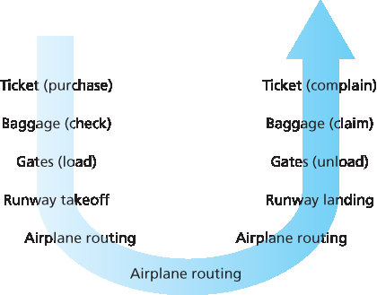
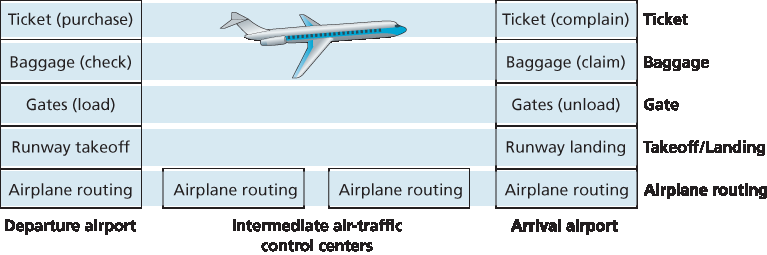
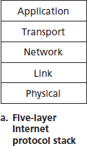
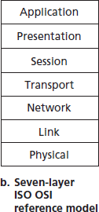
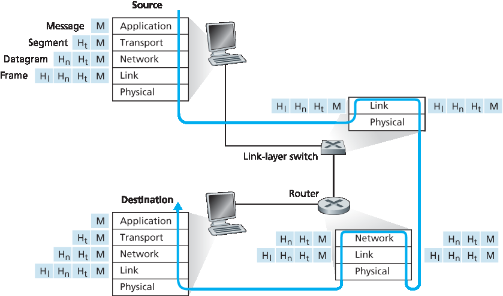

.. _c1.5:

1.5 协议层与其服务模型
===============================================

1.5 Protocol Layers and Their Service Models 

从我们目前的讨论可以看出，互联网是一个 *极其* 复杂的系统。我们已经看到，互联网包含许多组成部分：众多的应用和协议、各种类型的端系统、分组交换设备以及各种类型的链路层介质。鉴于其巨大的复杂性，是否有可能组织一个网络体系结构，或至少组织我们关于网络体系结构的讨论？幸运的是，这两个问题的答案都是肯定的。

.. toggle::

   From our discussion thus far, it is apparent that the Internet is an *extremely* complicated system. We
   have seen that there are many pieces to the Internet: numerous applications and protocols, various
   types of end systems, packet switches, and various types of link-level media. Given this enormous
   complexity, is there any hope of organizing a network architecture, or at least our discussion of network
   architecture? Fortunately, the answer to both questions is yes.

.. _c1.5.1:

1.5.1 分层体系结构
-------------------------

1.5.1 Layered Architecture 

在尝试组织我们对互联网体系结构的思考之前，让我们先找一个人类生活中的类比。事实上，我们在日常生活中经常处理复杂的系统。想象一下如果有人让你描述航空系统。你会如何找到一种结构来描述这个包含售票员、行李检查员、登机口人员、飞行员、飞机、空中交通控制以及一个全球性的飞机航线系统的复杂系统？一种描述这个系统的方法可能是描述你在乘坐飞机时经历的一系列操作（或他人为你完成的操作）。你购买机票、托运行李、前往登机口，最终登上飞机。飞机起飞并被引导至目的地。飞机降落后，你在登机口下机并提取行李。如果这次旅程不愉快，你会向售票员抱怨这趟航班（尽管不会得到任何补偿）。该场景如 :ref:`图 1.21 <Figure 1.21>` 所示。

.. _Figure 1.21:

**图 1.21 乘坐飞机旅行：所执行的操作**

.. _Figure 1.22:

**图 1.22 航空功能的水平分层**

在这里我们已经可以看到与计算机网络的一些类比：你被航空公司从源地运送到目的地；在互联网中，一个分组从源主机被传输到目标主机。但这还不是我们要找的类比。我们正在寻找 :ref:`图 1.21 <Figure 1.21>` 中的一种 *结构*。

观察 :ref:`图 1.21 <Figure 1.21>`，我们注意到两端都有售票功能；已经持票的乘客还有行李托运功能；已经持票并完成行李托运的乘客还有登机口功能。对于那些已通过登机口的乘客（也就是说，已持票、已托运行李并已通过登机口的乘客），存在起飞与降落功能，而在飞行途中，则有飞机航线引导功能。这表明我们可以以 *水平* 的方式来看待 :ref:`图 1.21 <Figure 1.21>` 中的各项功能，如 :ref:`图 1.22 <Figure 1.22>` 所示。

:ref:`图 1.22 <Figure 1.22>` 将航空功能划分为多个层，提供了一个用于讨论航空旅行的框架。请注意，每一层与其下方的层组合实现某种功能、某种服务。在售票层及以下，实现了从一个航空柜台到另一个航空柜台的人员转运。在行李层及以下，实现了从托运行李点到提取行李点的人员及其行李的转运。请注意，行李层只为已持票的乘客提供该服务。在登机口层，实现了从出发登机口到到达登机口的人员和行李的转运。在起飞/降落层，实现了从跑道到跑道的人员和行李的转运。每一层通过以下方式提供其服务：（1）在该层中执行特定操作（例如，在登机口层，将人员装载到飞机上或从飞机上卸下）；（2）使用其下一层的服务（例如，在登机口层，使用起飞/降落层提供的跑道到跑道的人员转运服务）。

分层体系结构使我们可以讨论一个庞大复杂系统中定义良好且特定的部分。通过提供模块化，这种简化本身具有相当大的价值，使得更改该层所提供服务的实现变得容易得多。只要该层向上层提供相同的服务，并从下层使用相同的服务，那么当该层的实现发生变化时，系统的其余部分将保持不变。（请注意，更改服务的 *实现* 与更改服务本身是非常不同的！）例如，如果登机口的功能发生变化（比如根据乘客身高登机和下机），航空系统的其余部分将保持不变，因为登机口层仍然提供相同的功能（装载和卸载乘客）；它只是以不同的方式来实现该功能。对于一个不断更新的庞大复杂系统而言，能够更改服务实现而不影响系统其他部分，是分层结构的另一个重要优势。

.. toggle::

   Before attempting to organize our thoughts on Internet architecture, let’s look for a human analogy.
   Actually, we deal with complex systems all the time in our everyday life. Imagine if someone asked you
   to describe, for example, the airline system. How would you find the structure to describe this complex
   system that has ticketing agents, baggage checkers, gate personnel, pilots, airplanes, air traffic control,
   and a worldwide system for routing airplanes? One way to describe this system might be to describe the
   series of actions you take (or others take for you) when you fly on an airline. You purchase your ticket,
   check your bags, go to the gate, and eventually get loaded onto the plane. The plane takes off and is
   routed to its destination. After your plane lands, you deplane at the gate and claim your bags. If the trip
   was bad, you complain about the flight to the ticket agent (getting nothing for your effort). This scenario
   is shown in :ref:`Figure 1.21 <Figure 1.21>`.

   .. figure:: ../img/75-0.png
      :align: center

   **Figure 1.21 Taking an airplane trip: actions**

   .. figure:: ../img/76-0.png
      :align: center

   **Figure 1.22 Horizontal layering of airline functionality**

   Already, we can see some analogies here with computer networking: You are being shipped from
   source to destination by the airline; a packet is shipped from source host to destination host in the
   Internet. But this is not quite the analogy we are after. We are looking for some *structure* in :ref:`Figure 1.21 <Figure 1.21>`.
   Looking at :ref:`Figure 1.21 <Figure 1.21>`, we note that there is a ticketing function at each end; there is also a baggage
   function for already-ticketed passengers, and a gate function for already-ticketed and already-baggage-
   checked passengers. For passengers who have made it through the gate (that is, passengers who are
   already ticketed, baggage-checked, and through the gate), there is a takeoff and landing function, and
   while in flight, there is an airplane-routing function. This suggests that we can look at the functionality in
   :ref:`Figure 1.21 <Figure 1.21>` in a *horizontal* manner, as shown in :ref:`Figure 1.22 <Figure 1.22>`.

   :ref:`Figure 1.22 <Figure 1.22>` has divided the airline functionality into layers, providing a framework in which we can
   discuss airline travel. Note that each layer, combined with the layers below it, implements some
   functionality, some service. At the ticketing layer and below, airline-counter-to-airline-counter transfer of
   a person is accomplished. At the baggage layer and below, baggage-check-to-baggage-claim transfer of
   a person and bags is accomplished. Note that the baggage layer provides this service only to an
   already-ticketed person. At the gate layer, departure-gate-to-arrival-gate transfer of a person and bags
   is accomplished. At the takeoff/landing layer, runway-to-runway transfer of people and their bags is
   accomplished. Each layer provides its service by (1) performing certain actions within that layer (for
   example, at the gate layer, loading and unloading people from an airplane) and by (2) using the services
   of the layer directly below it (for example, in the gate layer, using the runway-to-runway passenger
   transfer service of the takeoff/landing layer).

   A layered architecture allows us to discuss a well-defined, specific part of a large and complex system.
   This simplification itself is of considerable value by providing modularity, making it much easier to
   change the implementation of the service provided by the layer. As long as the layer provides the same
   service to the layer above it, and uses the same services from the layer below it, the remainder of the
   system remains unchanged when a layer’s implementation is changed. (Note that changing the 
   implementation of a service is very different from changing the service itself!) For example, if the gate
   functions were changed (for instance, to have people board and disembark by height), the remainder of
   the airline system would remain unchanged since the gate layer still provides the same function (loading
   and unloading people); it simply implements that function in a different manner after the change. For
   large and complex systems that are constantly being updated, the ability to change the implementation
   of a service without affecting other components of the system is another important advantage of layering.

协议分层
~~~~~~~~~~~~~~~~~~~~
Protocol Layering

关于航空的内容说得够多了。现在让我们将注意力转向网络协议。为了使网络协议的设计更有结构，网络设计者将协议——以及实现这些协议的网络硬件和软件——组织成 **层**。每个协议都属于某一层，就像 :ref:`图 1.22 <Figure 1.22>` 中航空体系结构的每个功能都属于一个层一样。我们再次关注每一层为其上层提供的 **服务**——即所谓的该层的 **服务模型**。就像在航空示例中一样，每一层通过以下方式提供其服务：（1）在该层内执行某些操作；（2）使用其下方一层的服务。例如，第 n 层提供的服务可能包括从网络的一端到另一端可靠传递消息。这可能通过使用第 n−1 层的不可靠端到端消息传递服务并添加第 n 层的功能（用于检测和重传丢失的消息）来实现。

一个协议层可以通过软件、硬件或二者结合来实现。应用层协议（如 HTTP 和 SMTP）几乎总是在端系统中以软件方式实现；传输层协议也是如此。由于物理层和数据链路层负责处理特定链路上的通信，因此它们通常在与给定链路相关的网络接口卡中实现（例如以太网或 WiFi 接口卡）。网络层通常是硬件和软件的混合实现。还要注意的是，就像分层航空体系结构中的功能分布在构成系统的不同机场和飞行控制中心一样，第 n 层协议也分布在构成网络的端系统、分组交换机和其他组件中。也就是说，每个网络组件中通常都包含某个协议层的一部分。

协议分层具有概念性和结构性优势 :ref:`[RFC 3439] <RFC 3439>`。正如我们所看到的，分层为系统组件的讨论提供了一种结构化方式。模块化使得系统组件的更新更加容易。但我们也提到，一些研究人员和网络工程师强烈反对分层 :ref:`[Wakeman 1992] <Wakeman 1992>`。分层的一个潜在缺点是某一层可能会重复低层的功能。例如，许多协议栈在链路级别和端到端级别都提供错误恢复。第二个潜在缺点是某一层的功能可能需要来自另一层的信息（例如时间戳值）；这违反了层之间分离的目标。

.. _Figure 1.23:

**图 1.23 互联网协议栈 (a) 与 OSI 参考模型 (b)**

将各层的协议合在一起时，我们称之为 **协议栈**。互联网协议栈由五层组成：物理层、链路层、网络层、传输层和应用层，如 :ref:`图 1.23(a) <Figure 1.23>` 所示。如果你查看目录，你会发现我们大致是按照互联网协议栈的层来组织本书内容的。我们采用 **自顶向下的方法**，首先介绍应用层，然后逐层向下讲解。

.. toggle::

   But enough about airlines. Let’s now turn our attention to network protocols. To provide structure to the
   design of network protocols, network designers organize protocols—and the network hardware and
   software that implement the protocols—in **layers**. Each protocol belongs to one of the layers, just as
   each function in the airline architecture in :ref:`Figure 1.22 <Figure 1.22>` belonged to a layer. We are again interested in
   the **services** that a layer offers to the layer above—the so-called **service model** of a layer. Just as in
   the case of our airline example, each layer provides its service by (1) performing certain actions within
   that layer and by (2) using the services of the layer directly below it. For example, the services provided
   by layer n may include reliable delivery of messages from one edge of the network to the other. This
   might be implemented by using an unreliable edge-to-edge message delivery service of layer n−1, and
   adding layer n functionality to detect and retransmit lost messages.

   A protocol layer can be implemented in software, in hardware, or in a combination of the two.
   Application-layer protocols—such as HTTP and SMTP—are almost always implemented in software in
   the end systems; so are transport-layer protocols. Because the physical layer and data link layers are
   responsible for handling communication over a specific link, they are typically implemented in a network
   interface card (for example, Ethernet or WiFi interface cards) associated with a given link. The network
   layer is often a mixed implementation of hardware and software. Also note that just as the functions in
   the layered airline architecture were *distributed* among the various airports and flight control centers that
   make up the system, so too is a layer *n* protocol distributed among the end systems, packet switches,
   and other components that make up the network. That is, there’s often a piece of a layer n protocol in
   each of these network components.

   Protocol layering has conceptual and structural advantages :ref:`[RFC 3439] <RFC 3439>`. As we have seen, layering
   provides a structured way to discuss system components. Modularity makes it easier to update system
   components. We mention, however, that some researchers and networking engineers are vehemently
   opposed to layering :ref:`[Wakeman 1992] <Wakeman 1992>`. One potential drawback of layering is that one layer may
   duplicate lower-layer functionality. For example, many protocol stacks provide error recovery
   on both a per-link basis and an end-to-end basis. A second potential drawback is that functionality at
   one layer may need information (for example, a timestamp value) that is present only in another layer;
   this violates the goal of separation of layers.

   .. figure:: ../img/78-0.png
      :align: left

   .. figure:: ../img/78-1.png
      :align: center

   **Figure 1.23 The Internet protocol stack (a) and OSI reference model (b)**

   When taken together, the protocols of the various layers are called the **protocol stack**. The Internet
   protocol stack consists of five layers: the physical, link, network, transport, and application layers, as
   shown in :ref:`Figure 1.23(a) <Figure 1.23>`. If you examine the Table of Contents, you will see that we have roughly
   organized this book using the layers of the Internet protocol stack. We take a **top-down approach**, first
   covering the application layer and then proceeding downward.

应用层
~~~~~~~~~~~~~~~~~~~~~
Application Layer

应用层是网络应用及其应用层协议所在的位置。互联网的应用层包括许多协议，例如 HTTP 协议（用于网页文档的请求和传输）、SMTP（用于电子邮件的传输）以及 FTP（用于两个端系统之间的文件传输）。我们将看到，某些网络功能，如将人类可读的互联网端系统名称（例如 `www.ietf.org <http://www.ietf.org/>`_）转换为 32 位网络地址，也是在一个特定的应用层协议——即域名系统（DNS）的帮助下完成的。我们将在 :ref:`第 2 章 <c2>` 中看到，创建和部署我们自己的新应用层协议是非常容易的。

应用层协议分布在多个端系统之间，一个端系统中的应用使用协议与另一个端系统中的应用交换信息分组。我们将在应用层将这些信息分组称为 **消息**。

.. toggle::

   The application layer is where network applications and their application-layer protocols reside. The
   Internet’s application layer includes many protocols, such as the HTTP protocol (which provides for Web
   document request and transfer), SMTP (which provides for the transfer of e-mail messages), and FTP
   (which provides for the transfer of files between two end systems). We’ll see that certain network
   functions, such as the translation of human-friendly names for Internet end systems like `www.ietf.org <http://www.ietf.org/>`_ to
   a 32-bit network address, are also done with the help of a specific application-layer protocol, namely, the
   domain name system (DNS). We’ll see in :ref:`Chapter 2 <c2>` that it is very easy to create and deploy our own
   new application-layer protocols.

   An application-layer protocol is distributed over multiple end systems, with the application in one end
   system using the protocol to exchange packets of information with the application in another end
   system. We’ll refer to this packet of information at the application layer as a **message**.

传输层
~~~~~~~~~~~~~~~~~~
Transport Layer

互联网的传输层在应用端点之间传送应用层的消息。在互联网中，有两个传输协议：TCP 和 UDP，它们都可以传送应用层的消息。TCP 为其应用提供面向连接的服务。此服务包括向目标端系统保证交付应用层消息，以及流量控制（即发送方/接收方的速度匹配）。TCP 还将长消息分段为更短的段，并提供拥塞控制机制，使源在网络拥塞时降低其发送速率。UDP 协议为其应用提供无连接服务。这是一种不带任何附加功能的服务，不提供可靠性、流控制或拥塞控制。在本书中，我们将传输层的数据包称为 **段（segment）**。

.. toggle::

   The Internet’s transport layer transports application-layer messages between application endpoints. In
   the Internet there are two transport protocols, TCP and UDP, either of which can transport application-
   layer messages. TCP provides a ­connection-oriented service to its applications. This service includes
   guaranteed delivery of application-layer messages to the destination and flow control (that is,
   sender/receiver speed matching). TCP also breaks long messages into shorter ­segments and provides
   a congestion-control mechanism, so that a source throttles its transmission rate when the network is
   congested. The UDP protocol provides a connectionless service to its applications. This is a no-frills
   service that provides no reliability, no flow control, and no congestion control. In this book, we’ll refer to
   a transport-layer packet as a **segment**.

网络层
~~~~~~~~~~~~~~~
Network Layer

互联网的网络层负责将被称为 **数据报（datagram）** 的网络层数据包从一个主机传输到另一个主机。源主机中的互联网传输层协议（TCP 或 UDP）将一个传输层段和目标地址传递给网络层，就像你将写好地址的信件交给邮政服务一样。然后网络层提供将该段交付到目标主机的传输层的服务。

互联网的网络层包括著名的 IP 协议，它定义了数据报中的字段以及终端系统和路由器如何处理这些字段。IP 协议是唯一的，所有具有网络层的互联网组件都必须运行 IP 协议。互联网的网络层还包含决定数据报在源和目标之间路径的路由协议。互联网拥有许多路由协议。正如我们在 :ref:`第 1.3 节 <c1.3>` 中所看到的，互联网是网络的网络，在一个网络内部，网络管理员可以运行任何想要的路由协议。尽管网络层包含 IP 协议和许多路由协议，但通常仅被称为 IP 层，反映了 IP 是连接互联网的“粘合剂”这一事实。

.. toggle::

   The Internet’s network layer is responsible for moving network-layer packets known as **datagrams** from
   one host to another. The Internet transport-layer protocol (TCP or UDP) in a source host passes a
   transport-layer segment and a destination address to the network layer, just as you would give the
   postal service a letter with a destination address. The network layer then provides the service of
   delivering the segment to the transport layer in the destination host.

   The Internet’s network layer includes the celebrated IP protocol, which defines the fields in the datagram
   as well as how the end systems and routers act on these fields. There is only one IP protocol, and all
   Internet components that have a network layer must run the IP protocol. The Internet’s network layer
   also contains routing protocols that determine the routes that datagrams take between sources and
   destinations. The Internet has many routing protocols. As we saw in :ref:`Section 1.3 <c1.3>`, the Internet is a
   network of networks, and within a network, the network administrator can run any routing protocol
   desired. Although the network layer contains both the IP protocol and numerous routing protocols, it is
   often simply referred to as the IP layer, reflecting the fact that IP is the glue that binds the Internet
   together.

链路层
~~~~~~~~~~~~~
Link Layer

互联网的网络层将数据报通过一系列路由器从源传送到目标。为了将数据包从路由路径上的一个节点（主机或路由器）移动到下一个节点，网络层依赖于链路层提供的服务。具体地说，在每个节点上，网络层将数据报下交给链路层，链路层将数据报传送到路径上的下一个节点。在下一个节点，链路层将数据报上传至网络层。

链路层提供的服务取决于该链路上采用的具体链路层协议。例如，一些链路层协议提供可靠的传输服务，从发送节点通过一条链路传送到接收节点。请注意，这种可靠传输服务不同于 TCP 提供的端到端可靠传输服务。链路层协议的示例包括以太网、WiFi 以及有线接入网络的 DOCSIS 协议。由于数据报通常需要跨越多条链路从源传送到目标，因此在其路径上的不同链路上，数据报可能由不同的链路层协议处理。例如，一个数据报可能在一条链路上由以太网处理，在下一条链路上由 PPP 处理。网络层将从每种不同的链路层协议中接收不同的服务。在本书中，我们将链路层的数据包称为 **帧（frame）**。

.. toggle::

   The Internet’s network layer routes a datagram through a series of routers between the source and
   destination. To move a packet from one node (host or router) to the next node in the route, the network
   layer relies on the services of the link layer. In particular, at each node, the network layer passes the
   datagram down to the link layer, which delivers the datagram to the next node along the route. At this
   next node, the link layer passes the datagram up to the network layer.

   The services provided by the link layer depend on the specific link-layer protocol that is employed over
   the link. For example, some link-layer protocols provide reliable delivery, from transmitting node, over
   one link, to receiving node. Note that this reliable delivery service is different from the reliable delivery
   service of TCP, which provides reliable delivery from one end system to another. Examples of link-layerprotocols include Ethernet, WiFi, and the cable access network’s DOCSIS protocol. As datagrams
   typically need to traverse several links to travel from source to destination, a datagram may be handled
   by different link-layer protocols at different links along its route. For example, a datagram may be
   handled by Ethernet on one link and by PPP on the next link. The network layer will receive a different
   service from each of the different link-layer protocols. In this book, we’ll refer to the link-layer packets as
   **frames**.

物理层
~~~~~~~~~~~~~~~~
Physical Layer

链路层的工作是将整个帧从一个网络元素移动到相邻的网络元素，而物理层的工作是将帧中的 *各个位* 从一个节点移动到下一个节点。该层的协议同样依赖于链路，并且还取决于链路的实际传输介质（例如，双绞铜线、单模光纤）。例如，以太网有多种物理层协议：一种用于双绞铜线，另一种用于同轴电缆，还有一种用于光纤，等等。在每种情况下，位在链路上传输的方式都不同。

.. toggle::

   While the job of the link layer is to move entire frames from one network element to an adjacent network
   element, the job of the physical layer is to move the *individual bits* within the frame from one node to the
   next. The protocols in this layer are again link dependent and further depend on the actual transmission
   medium of the link (for example, twisted-pair copper wire, single-mode fiber optics). For example,
   Ethernet has many physical-layer protocols: one for twisted-pair copper wire, another for coaxial cable,
   another for fiber, and so on. In each case, a bit is moved across the link in a different way.

OSI 模型
~~~~~~~~~~~~~~~~~~~
The OSI Model

在详细讨论了互联网协议栈之后，我们应当指出，它并不是唯一存在的协议栈。特别是在 20 世纪 70 年代后期，国际标准化组织（ISO）提议将计算机网络组织为七层，称为开放系统互联（OSI）模型 :ref:`[ISO 2016] <ISO 2016>`。OSI 模型的成形时期正值后来的互联网协议仍处于初期阶段，当时还有许多不同的协议族在开发中；事实上，OSI 模型的最初设计者可能并未考虑到互联网。尽管如此，从 70 年代末期开始，许多培训课程和大学课程采纳了 ISO 的标准，并围绕七层模型组织课程。由于其对早期网络教育的影响，七层模型至今仍存在于一些网络教材和培训课程中。

如 :ref:`图 1.23(b) <Figure 1.23>` 所示，OSI 参考模型的七层分别是：应用层、表示层、会话层、传输层、网络层、数据链路层和物理层。其中五层的功能与互联网中名称类似的对应层大致相同。因此，我们将重点关注 OSI 模型中额外的两层——表示层和会话层。表示层的作用是提供服务，使通信应用可以解释所交换数据的含义。这些服务包括数据压缩和数据加密（其含义不言自明），以及数据描述（这使应用无需关心数据在内部的表示/存储格式——这些格式可能在不同计算机之间有所不同）。会话层提供数据交换的边界划分与同步服务，包括构建检查点与恢复机制的能力。

互联网缺少 OSI 模型中存在的两层，这引出了几个有趣的问题：这些层所提供的服务是否不重要？如果某个应用需要这些服务该怎么办？互联网对这两个问题的回答是一样的——由应用开发者决定。是否需要某项服务由应用开发者决定；如果该服务很重要，那么开发者需要在应用中构建相应的功能。

.. toggle::

   Having discussed the Internet protocol stack in detail, we should mention that it is not the only protocol
   stack around. In particular, back in the late 1970s, the International Organization for Standardization
   (ISO) proposed that computer networks be organized around seven layers, called the Open Systems
   Interconnection (OSI) model :ref:`[ISO 2016] <ISO 2016>`. The OSI model took shape when the protocols that were to
   become the Internet protocols were in their infancy, and were but one of many different protocol suites
   under development; in fact, the inventors of the original OSI model probably did not have the Internet in
   mind when creating it. Nevertheless, beginning in the late 1970s, many training and university courses
   picked up on the ISO mandate and organized courses around the seven-layer model. Because of its
   early impact on networking education, the seven-layer model continues to linger on in some networking
   textbooks and training courses.

   The seven layers of the OSI reference model, shown in :ref:`Figure 1.23(b) <Figure 1.23>`, are: application layer,
   presentation layer, session layer, transport layer, network layer, data link layer, and physical layer. The
   functionality of five of these layers is roughly the same as their similarly named Internet counterparts.
   Thus, let’s consider the two additional layers present in the OSI reference model—the presentation layer
   and the session layer. The role of the presentation layer is to provide services that allow communicating
   applications to interpret the meaning of data exchanged. These services include data compression and
   data encryption (which are self-explanatory) as well as data description (which frees the applications
   from having to worry about the internal format in which data are represented/stored—formats that may
   differ from one computer to another). The session layer provides for delimiting and synchronization of
   data exchange, including the means to build a checkpointing and recovery scheme.

   The fact that the Internet lacks two layers found in the OSI reference model poses a couple of
   interesting questions: Are the services provided by these layers unimportant? What if an application
   needs one of these services? The Internet’s answer to both of these questions is the same—it’s up to
   the application developer. It’s up to the application developer to decide if a service is important, and if
   the service is important, it’s up to the application developer to build that functionality into the application.

.. _c1.5.2:

1.5.2 封装（Encapsulation）
-------------------------
1.5.2 Encapsulation 

:ref:`图 1.24 <Figure 1.24>` 展示了数据在发送端系统的协议栈中向下传递、在中间链路层交换机和路由器的协议栈中上下传递、以及在接收端系统协议栈中向上传递的物理路径。正如我们在本书后面将讨论的，路由器和链路层交换机都是分组交换设备。与端系统类似，路由器和链路层交换机也将其网络硬件和软件组织为多个层。但路由器和链路层交换机并不会实现协议栈中的 *所有* 层；它们通常只实现底层。如 :ref:`图 1.24 <Figure 1.24>` 所示，链路层交换机实现第 1 层和第 2 层；路由器实现第 1 层到第 3 层。这意味着，例如，互联网路由器能够实现 IP 协议（第 3 层协议），而链路层交换机则不能。我们将在后文看到，链路层交换机虽然无法识别 IP 地址，但它们能够识别第 2 层地址，例如以太网地址。请注意，主机实现所有五层；这与互联网体系结构将大部分复杂性置于网络边缘的观点是一致的。

.. _Figure 1.24:

**图 1.24 主机、路由器和链路层交换机；每个包含一组不同的层，反映它们在功能上的差异**

:ref:`图 1.24 <Figure 1.24>` 同时也说明了一个重要的概念： **封装（encapsulation）** 。在发送主机中，一个 **应用层消息** （图中 M）被传递给传输层。在最简单的情况下，传输层将该消息与附加信息（即所谓的传输层头部信息，图中 Ht）一起组成一个传输层段（ **transport-layer segment** ）。该头部信息将在接收端的传输层中被使用。应用层消息和传输层头部信息共同组成了 **传输层段** ，因此该段封装了应用层消息。附加信息可能包括：用于使接收端传输层将消息交付给正确应用的标识信息，以及用于检测传输过程中文本是否被篡改的错误检测位。随后，传输层将该段传递给网络层，网络层添加网络层头部信息（图中 :math:`H_n`），如源地址和目标端系统地址，从而生成一个 **网络层数据报（datagram）** 。数据报再被传递给链路层，链路层（当然！）会添加自己的链路层头部信息，生成一个 **链路层帧（frame）** 。因此，我们看到，在每一层中，数据包都包含两类字段：头字段（header fields）和 **有效载荷字段（payload field）** 。有效载荷通常是上一层的一个数据包。

这里有一个有用的类比：假设某公司一个分支办公室要向另一个分支办公室发送一份内部备忘录，通过公共邮政系统传递。假设 Alice 位于某分支机构，想把备忘录发给 Bob（他在另一分支机构）。这个 *备忘录* 就类似于应用层消息。Alice 将备忘录装入一封写有 Bob 姓名和部门的内部邮件信封中。这个 *内部邮件信封* 就类似于 *传输层段* ——它包含了头部信息（Bob 的姓名和部门编号），并封装了应用层消息（备忘录）。当发送办公室的邮件室收到内部信封后，它将其放入适合通过公共邮政系统寄送的另一个信封中。发送方邮件室还在这个邮政信封上写上发送与接收办公室的地址。在此，邮政 *信封* 类比于 *数据报* ——它封装了传输层段（内部邮件信封），而传输层段又封装了原始消息（备忘录）。邮政系统将邮政信封送达接收方办公室的邮件室。在那里，开始执行解封装（de-encapsulation）过程。邮件室取出内部备忘录并将其转交给 Bob。最后，Bob 拆开信封并取出备忘录。

封装过程可能比上述描述更加复杂。例如，一个大型消息可能会被分割为多个传输层段（每个段还可能被进一步分割为多个网络层数据报）。在接收端，这样的段必须从其组成数据报中重新构建出来。

.. toggle::

   :ref:`Figure 1.24 <Figure 1.24>` shows the physical path that data takes down a sending end system’s protocol stack, up
   and down the protocol stacks of an intervening link-layer switch and router, and then up the protocol stack at the receiving end system. As we discuss later in this book,
   routers and link-layer switches are both packet switches. Similar to end systems, routers and link-layer
   switches organize their networking hardware and software into layers. But routers and link-layer
   switches do not implement *all* of the layers in the protocol stack; they typically implement only the
   bottom layers. As shown in :ref:`Figure 1.24 <Figure 1.24>` , link-layer switches implement layers 1 and 2; routers
   implement layers 1 through 3. This means, for example, that Internet routers are capable of
   implementing the IP protocol (a layer 3 protocol), while link-layer switches are not. We’ll see later that
   while link-layer switches do not recognize IP addresses, they are capable of recognizing layer 2
   addresses, such as Ethernet addresses. Note that hosts implement all five layers; this is consistent with
   the view that the Internet architecture puts much of its complexity at the edges of the network.

   .. figure:: ../img/81-0.png
      :align: center
      :name: Hosts, routers, and link-layer switches; each contains a ­different set of layers, reflecting their differences in ­functionality

   **Figure 1.24 Hosts, routers, and link-layer switches; each contains a ­different set of layers, reflecting their differences in ­functionality**

   :ref:`Figure 1.24 <Figure 1.24>` also illustrates the important concept of **encapsulation**. At the sending host, an
   **application-layer message** (M in :ref:`Figure 1.24 <Figure 1.24>`) is passed to the transport layer. In the simplest case,
   the transport layer takes the message and appends additional information (so-called transport-layer
   header information, Ht in :ref:`Figure 1.24 <Figure 1.24>`) that will be used by the receiver-side transport layer. The
   application-layer message and the transport-layer header information together constitute the **transport-layer segment**. The transport-layer segment thus encapsulates the application-layer message. The
   added information might include information allowing the receiver-side transport layer to deliver the
   message up to the appropriate application, and error-detection bits that allow the receiver to determine
   whether bits in the message have been changed in route. The transport layer then passes the segment
   to the network layer, which adds network-layer header information (:math:`H_n` in :ref:`Figure 1.24 <Figure 1.24>`) such as source
   and destination end system addresses, creating a **network-layer datagram**. The datagram is then
   passed to the link layer, which (of course!) will add its own link-layer header information and create a
   **link-layer frame**. Thus, we see that at each layer, a packet has two types of fields: header fields and a
   **payload field**. The payload is typically a packet from the layer above.

   A useful analogy here is the sending of an interoffice memo from one corporate branch office to another
   via the public postal service. Suppose Alice, who is in one branch office, wants to send a memo to Bob,
   who is in another branch office. The *memo* is analogous to the application-layer message. Alice puts the
   memo in an interoffice envelope with Bob’s name and department written on the front of the envelope.
   The *interoffice* envelope is analogous to a *transport-layer segment*—it contains header information
   (Bob’s name and department number) and it encapsulates the application-layer message (the memo).
   When the sending branch-office mailroom receives the interoffice envelope, it puts the interoffice
   envelope inside yet another envelope, which is suitable for sending through the public postal service.
   The sending mailroom also writes the postal address of the sending and receiving branch offices on the
   postal envelope. Here, the postal *envelope* is analogous to the *datagram*—it encapsulates the transport-
   layer segment (the interoffice envelope), which encapsulates the original message (the memo). The
   postal service delivers the postal envelope to the receiving branch-office mailroom. There, the process
   of de-encapsulation is begun. The mailroom extracts the interoffice memo and forwards it to Bob.
   Finally, Bob opens the envelope and removes the memo.

   The process of encapsulation can be more complex than that described above. For example, a large
   message may be divided into multiple transport-layer segments (which might themselves each be
   divided into multiple network-layer datagrams). At the receiving end, such a segment must then be
   reconstructed from its constituent datagrams.