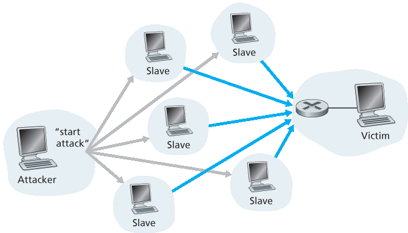

.. _c1.6:

1.6 网络攻击
=================

1.6 Networks Under Attack

.. tab:: 中文

.. tab:: 英文

The Internet has become mission critical for many institutions today, including large and small
companies, universities, and government agencies. Many individuals also rely on the Internet for many
of their professional, social, and personal activities. Billions of “things,” including wearables and home
devices, are currently being connected to the Internet. But behind all this utility and excitement, there is
a dark side, a side where “bad guys” attempt to wreak havoc in our daily lives by damaging our Internet-
connected computers, violating our privacy, and rendering inoperable the Internet services on which we
depend.

The field of network security is about how the bad guys can attack computer networks and about how
we, soon-to-be experts in computer networking, can defend networks against those attacks, or better
yet, design new architectures that are immune to such attacks in the first place. Given the frequency and
variety of existing attacks as well as the threat of new and more destructive future attacks, network
security has become a central topic in the field of computer networking. One of the features of this
textbook is that it brings network security issues to the forefront.

Since we don’t yet have expertise in computer networking and Internet protocols, we’ll begin here by
surveying some of today’s more prevalent security-related problems. This will whet our appetite for more
substantial discussions in the upcoming chapters. So we begin here by simply asking, what can go
wrong? How are computer networks vulnerable? What are some of the more prevalent types of attacks
today?

The Bad Guys Can Put Malware into Your Host Via the Internet
-----------------------------------------------------------------

We attach devices to the Internet because we want to receive/send data from/to the Internet. This
includes all kinds of good stuff, including Instagram posts, Internet search results, streaming music,
video conference calls, streaming movies, and so on. But, unfortunately, along with all that good stuff
comes malicious stuff—­collectively known as **malware**—that can also enter and infect our devices.
Once malware infects our device it can do all kinds of devious things, including deleting our files and
installing spyware that collects our private information, such as social security numbers, passwords, and
keystrokes, and then sends this (over the Internet, of course!) back to the bad guys. Our compromised
host may also be enrolled in a network of thousands of similarly compromised devices, collectively
known as a **botnet**, which the bad guys control and leverage for spam e-mail distribution or distributed
denial-of-service attacks (soon to be discussed) against targeted hosts.

Much of the malware out there today is **self-replicating**: once it infects one host, from that host it seeks
entry into other hosts over the Internet, and from ­the newly infected hosts, it seeks entry into yet more
hosts. In this manner, self-­replicating malware can spread exponentially fast. Malware can spread in
the form of a virus or a worm. **Viruses** are malware that require some form of user interaction to infect
the user’s device. The classic example is an e-mail attachment containing malicious executable code. If
a user receives and opens such an attachment, the user inadvertently runs the malware on the device.
Typically, such e-mail viruses are self-replicating: once executed, the virus may send an identical
message with an identical malicious attachment to, for example, every recipient in the user’s address
book. **Worms** are malware that can enter a device without any explicit user interaction. For example, a
user may be running a vulnerable network application to which an attacker can send malware. In some
cases, without any user intervention, the application may accept the malware from the Internet and run
it, creating a worm. The worm in the newly infected device then scans the Internet, searching for other
hosts running the same vulnerable network application. When it finds other vulnerable hosts, it sends a
copy of itself to those hosts. Today, malware, is pervasive and costly to defend against. As you work
through this textbook, we encourage you to think about the following question: What can computer
network designers do to defend Internet-attached devices from malware attacks?

The Bad Guys Can Attack Servers and Network Infrastructure
-----------------------------------------------------------------

Another broad class of security threats are known as **denial-of-service (DoS) attacks**. As the name
suggests, a DoS attack renders a network, host, or other piece of infrastructure unusable by legitimate
users. Web servers, e-mail servers, DNS servers (discussed in :ref:`Chapter 2 <c2>`), and institutional networks
can all be subject to DoS attacks. Internet DoS attacks are extremely common, with thousands of DoS
attacks occurring every year :ref:`[Moore 2001] <Moore 2001>`. The site Digital Attack Map allows use to visualize the top
daily DoS attacks worldwide :ref:`[DAM 2016] <DAM 2016>`. Most Internet DoS attacks fall into one of three categories:

- **Vulnerability attack**. This involves sending a few well-crafted messages to a vulnerable application or operating system running on a targeted host. If the right sequence of packets is sent to a vulnerable application or operating system, the service can stop or, worse, the host can crash.
- **Bandwidth flooding**. The attacker sends a deluge of packets to the targeted host—so many packets that the target’s access link becomes clogged, preventing legitimate packets from reaching the server.
- **Connection flooding**. The attacker establishes a large number of half-open or fully open TCP connections (TCP connections are discussed in :ref:`Chapter 3 <c3>`) at the target host. The host can become so bogged down with these bogus connections that it stops accepting legitimate connections.

Let’s now explore the bandwidth-flooding attack in more detail. Recalling our delay and loss analysis
discussion in :ref:`Section 1.4.2 <c1.4.2>`, it’s evident that if the server has an access rate of R bps, then the attacker
will need to send traffic at a rate of approximately R bps to cause damage. If R is very large, a single
attack source may not be able to generate enough traffic to harm the server. Furthermore, if all the
traffic emanates from a single source, an upstream router may be able to detect the attack and block all
traffic from that source before the traffic gets near the server. In a **distributed DoS (DDoS)** attack,
illustrated in :ref:`Figure 1.25 <Figure 1.25>`, the attacker controls multiple sources and has each source blast traffic at the
target. With this approach, the aggregate traffic rate across all the controlled sources needs to be
approximately R to cripple the ­service. DDoS attacks leveraging botnets with thousands of comprised
hosts are a common occurrence today :ref:`[DAM 2016] <DAM 2016>`. DDos attacks are much harder to detect and
defend against than a DoS attack from a single host.

We encourage you to consider the following question as you work your way through this book: What can
computer network designers do to defend against DoS attacks? We will see that different defenses are
needed for the three types of DoS attacks.

.. _Figure 1.25:

**Figure 1.25 A distributed denial-of-service attack**

The Bad Guys Can Sniff Packets
-----------------------------------

Many users today access the Internet via wireless devices, such as WiFi-connected laptops or handheld
devices with cellular Internet connections (covered in :ref:`Chapter 7 <c7>`). While ubiquitous Internet access is
extremely convenient and enables marvelous new applications for mobile users, it also creates a major
security vulnerability—by placing a passive receiver in the vicinity of the wireless transmitter, that
receiver can obtain a copy of every packet that is transmitted! These packets can contain all kinds of
sensitive information, including passwords, social security numbers, trade secrets, and private personal
messages. A passive receiver that records a copy of every packet that flies by is called a **packet
sniffer**.

Sniffers can be deployed in wired environments as well. In wired broadcast environments, as in many
Ethernet LANs, a packet sniffer can obtain copies of broadcast packets sent over the LAN. As described
in :ref:`Section 1.2 <c1.2>`, cable access technologies also broadcast packets and are thus vulnerable to sniffing.
Furthermore, a bad guy who gains access to an institution’s access router or access link to the Internet
may be able to plant a sniffer that makes a copy of every packet going to/from the organization. Sniffed
packets can then be analyzed offline for sensitive information.

Packet-sniffing software is freely available at various Web sites and as commercial products. Professors
teaching a networking course have been known to assign lab exercises that involve writing a packet-
sniffing and application-layer data reconstruction program. Indeed, the Wireshark :ref:`[Wireshark 2016] <Wireshark 2016>`
labs associated with this text (see the introductory :ref:`Wireshark lab <c1.lab>` at the end of this chapter) use exactly
such a packet sniffer!

Because packet sniffers are passive—that is, they do not inject packets into the channel—they are
difficult to detect. So, when we send packets into a wireless channel, we must accept the possibility that
some bad guy may be recording copies of our packets. As you may have guessed, some of the best
defenses against packet sniffing involve cryptography. We will examine cryptography as it applies to
network security in :ref:`Chapter 8 <c8>`.

The Bad Guys Can Masquerade as Someone You Trust
------------------------------------------------------

It is surprisingly easy (you will have the knowledge to do so shortly as you proceed through this text!) to
create a packet with an arbitrary source address, packet content, and destination address and then
transmit this hand-crafted packet into the Internet, which will dutifully forward the packet to its
destination. Imagine the unsuspecting receiver (say an Internet router) who receives such a packet,
takes the (false) source address as being truthful, and then performs some command embedded in the
packet’s contents (say modifies its forwarding table). The ability to inject packets into the Internet with a
false source address is known as **IP spoofing**, and is but one of many ways in which one user can
masquerade as another user.

To solve this problem, we will need end-point authentication, that is, a mechanism that will allow us to
determine with certainty if a message originates from where we think it does. Once again, we encourage
you to think about how this can be done for network applications and protocols as you progress through
the chapters of this book. We will explore mechanisms for end-point authentication in :ref:`Chapter 8 <c8>`.

In closing this section, it’s worth considering how the Internet got to be such an insecure place in the first
place. The answer, in essence, is that the Internet was originally designed to be that way, based on the
model of “a group of mutually trusting users attached to a transparent network” :ref:`[Blumenthal 2001] <Blumenthal 2001>`—a
model in which (by definition) there is no need for security. Many aspects of the original Internet
architecture deeply reflect this notion of mutual trust. For example, the ability for one user to send a
packet to any other user is the default rather than a requested/granted capability, and user identity is
taken at declared face value, rather than being authenticated by default.

But today’s Internet certainly does not involve “mutually trusting users.” Nonetheless, today’s users still
need to communicate when they don’t necessarily trust each other, may wish to communicate
anonymously, may communicate indirectly through third parties (e.g., Web caches, which we’ll study in
:ref:`Chapter 2 <c2>`, or mobility-assisting agents, which we’ll study in :ref:`Chapter 7 <c7>`), and may distrust the hardware,
software, and even the air through which they communicate. We now have many security-related
challenges before us as we progress through this book: We should seek defenses against sniffing, end-
point masquerading, man-in-the-middle attacks, DDoS attacks, malware, and more. We should keep in
mind that communication among mutually trusted users is the exception rather than the rule. Welcome
to the world of modern computer networking!