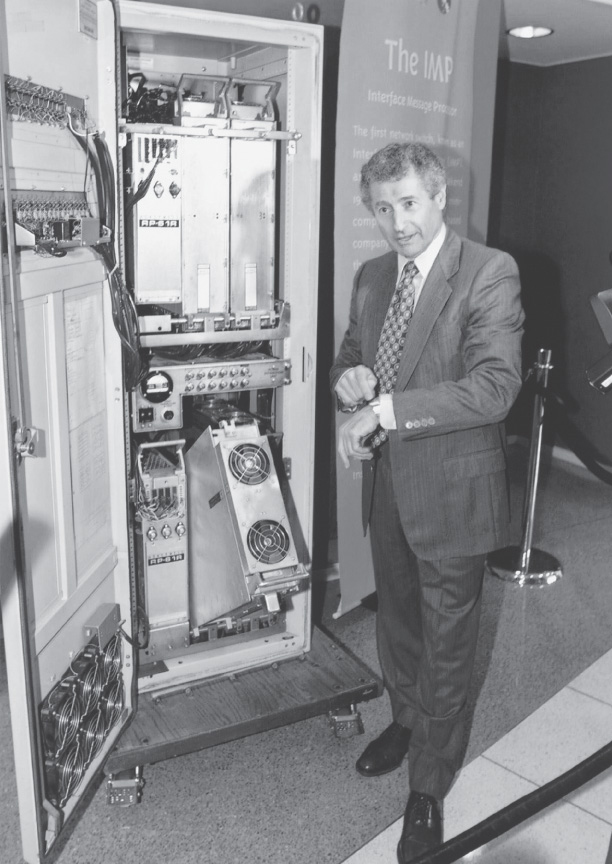

.. _c1.7:

1.7 计算机网络与互联网的发展历史
====================================================================

1.7 History of Computer Networking and the Internet 

:ref:`第 1.1 节 <c1.1>` 至 :ref:`1.6 节 <c1.6>` 概述了计算机网络和互联网的相关技术。现在你应该掌握了足够的知识，可以向家人朋友炫耀一番了！不过，如果你真的想在下次鸡尾酒会上大放异彩，就应当在交流中穿插一些有关互联网迷人历史的趣闻 :ref:`[Segaller 1998] <Segaller 1998>`。

.. toggle::

   :ref:`Sections 1.1 <c1.1>` through :ref:`1.6 <c1.6>` presented an overview of the technology of computer networking and the
   Internet. You should know enough now to impress your family and friends! However, if you really want to
   be a big hit at the next cocktail party, you should sprinkle your discourse with tidbits about the
   fascinating history of the Internet :ref:`[Segaller 1998] <Segaller 1998>`.

.. _c1.7.1:

1.7.1 分组交换的发展：1961–1972
--------------------------------------------------------------
1.7.1 The Development of Packet Switching: 1961-1972 

计算机网络领域以及今天的互联网可以追溯到 1960 年代初，当时电话网络是世界上主导的通信网络。回顾 :ref:`第 1.3 节 <c1.3>` 可知，电话网络使用电路交换方式来传输信息——考虑到语音在发送端与接收端之间是以恒定速率传输的，这是一种合理的选择。随着计算机在 1960 年代初变得日益重要以及分时计算机的出现，人们自然开始思考如何将计算机连接起来，使其可以在地理分布的用户之间共享。这类用户产生的通信流量很可能是突发型的——例如，先向远程计算机发送指令，随后等待回复或思考响应内容的过程中会有一段空闲期。

世界上三个研究小组在彼此不知情的情况下 :ref:`[Leiner 1998] <Leiner 1998>`，各自开始发明分组交换，作为一种高效且稳健的电路交换替代方案。第一篇关于分组交换技术的发表文章来自 MIT 的研究生 Leonard Kleinrock [:ref:`Kleinrock 1961 <Kleinrock 1961>`；:ref:`Kleinrock 1964 <Kleinrock 1964>`]。Kleinrock 使用排队论优雅地论证了分组交换方法在应对突发流量源方面的有效性。1964 年，Rand 研究所的 Paul Baran :ref:`[Baran 1964] <Baran 1964>` 开始研究在军事网络中使用分组交换来传输安全语音，英国国家物理实验室（NPL）的 Donald Davies 和 Roger Scantlebury 也在开展关于分组交换的研究。

MIT、Rand 和 NPL 的研究工作为今天的互联网奠定了基础。但互联网同样有着从 1960 年代就延续下来的“动手构建并展示”的传统精神。J. C. R. Licklider :ref:`[DEC 1990] <DEC 1990>` 和 Lawrence Roberts，Kleinrock 在 MIT 的同事，后来都领导了美国高级研究计划署（ARPA）的计算机科学项目。Roberts 提出了 ARPAnet 的整体规划 :ref:`[Roberts 1967] <Roberts 1967>`，它是第一个分组交换计算机网络，也是今天公共互联网的直接祖先。1969 年的劳动节，在 Kleinrock 的监督下，第一个分组交换机安装在加州大学洛杉矶分校（UCLA），随后又在斯坦福研究院（SRI）、加州大学圣塔芭芭拉分校（UCSB）和犹他大学安装了另外三个分组交换机（:ref:`图 1.26 <Figure 1.26>`）。1969 年底，这个互联网的雏形已经发展到四个节点。Kleinrock 回忆了使用该网络进行首次远程登录（从 UCLA 到 SRI）时导致系统崩溃的情景 :ref:`[Kleinrock 2004] <Kleinrock 2004>`。

到 1972 年，ARPAnet 已扩展到大约 15 个节点，并由 Robert Kahn 进行了首次公开演示。ARPAnet 端系统之间的第一个主机对主机协议，即网络控制协议（NCP）完成了定义 :ref:`RFC 001 <RFC 001>`。有了端到端协议，应用程序便可以开发。Ray Tomlinson 于 1972 年编写了第一个电子邮件程序。

.. toggle::

   The field of computer networking and today’s Internet trace their beginnings back to the early 1960s,
   when the telephone network was the world’s dominant communication network. Recall from :ref:`Section 1.3 <c1.3>`
   that the telephone network uses circuit switching to transmit information from a sender to a receiver—an
   appropriate choice given that voice is transmitted at a constant rate between sender and receiver. Given
   the increasing importance of computers in the early 1960s and the advent of timeshared computers, it
   was perhaps natural to consider how to hook computers together so that they could be shared among
   geographically distributed users. The traffic generated by such users was likely to be bursty—intervals
   of activity, such as the sending of a command to a remote computer, followed by periods of inactivity
   while waiting for a reply or while contemplating the received response.

   Three research groups around the world, each unaware of the others’ work :ref:`[Leiner 1998] <Leiner 1998>`, began
   inventing packet switching as an efficient and robust alternative to circuit switching. The first published
   work on packet-switching techniques was that of Leonard Kleinrock [ :ref:`Kleinrock 1961 <Kleinrock 1961>`; :ref:`Kleinrock 1964 <Kleinrock 1964>` ],
   then a graduate student at MIT. Using queuing theory, Kleinrock’s work elegantly demonstrated the
   effectiveness of the packet-switching approach for bursty traffic sources. In 1964, Paul Baran :ref:`[Baran 1964] <Baran 1964>` at the Rand Institute had begun investigating the use of packet switching for secure voice over
   military networks, and at the National Physical Laboratory in England, Donald Davies and Roger
   Scantlebury were also developing their ideas on packet switching.

   The work at MIT, Rand, and the NPL laid the foundations for today’s Internet. But the Internet also has a
   long history of a let’s-build-it-and-demonstrate-it attitude that also dates back to the 1960s. J. C. R.
   Licklider :ref:`[DEC 1990] <DEC 1990>` and Lawrence Roberts, both colleagues of Kleinrock’s at MIT, went on to lead the
   computer science program at the Advanced Research Projects Agency (ARPA) in the United States.
   Roberts published an overall plan for the ARPAnet :ref:`[Roberts 1967] <Roberts 1967>` , the first packet-switched computer
   network and a direct ancestor of today’s public Internet. On Labor Day in 1969, the first packet switch
   was installed at UCLA under Kleinrock’s supervision, and three additional packet switches were installed
   shortly thereafter at the Stanford Research Institute (SRI), UC Santa Barbara, and the University of Utah
   (:ref:`Figure 1.26 <Figure 1.26>`). The fledgling precursor to the Internet was four nodes large by the end of 1969. Kleinrock
   recalls the very first use of the network to perform a remote login from UCLA to SRI, crashing the
   system :ref:`[Kleinrock 2004] <Kleinrock 2004>`.

   By 1972, ARPAnet had grown to approximately 15 nodes and was given its first public demonstration by
   Robert Kahn. The first host-to-host protocol between ARPAnet end systems, known as the network-
   control protocol (NCP), was completed :ref:`RFC 001 <RFC 001>`. With an end-to-end protocol available, applications
   could now be written. Ray Tomlinson wrote the first e-mail program in 1972.

.. _c1.7.2:

1.7.2 专有网络与互联网络：1972–1980
--------------------------------------------------------------
1.7.2 Proprietary Networks and Internetworking: 1972-1980 

最初的 ARPAnet 是一个封闭的单一网络。若要与 ARPAnet 主机通信，必须物理连接到另一个 ARPAnet IMP（接口消息处理机）。在 1970 年代初至中期，除 ARPAnet 之外出现了一些独立的分组交换网络：ALOHANet 是一套连接夏威夷各岛大学的微波网络 :ref:`[Abramson 1970] <Abramson 1970>`，DARPA 还研发了分组卫星网络 :ref:`[RFC 829] <RFC 829>` 和分组无线网络 :ref:`[Kahn 1978] <Kahn 1978>`；Telenet 是基于 ARPAnet 技术的 BBN 商业分组交换网络；Cyclades 是法国 Louis Pouzin 主导的分组交换网络 :ref:`[Think 2012] <Think 2012>`；还有 Tymnet、GE 信息服务网络等分时网络出现在 1960 年代末和 1970 年代初 :ref:`[Schwartz 1977] <Schwartz 1977>`；IBM 的 SNA（1969–1974）与 ARPAnet 的研究工作并行开展 :ref:`[Schwartz 1977] <Schwartz 1977>`。

.. _Figure 1.26:

**图 1.26 早期分组交换设备**

网络数量不断增长。从后见之明来看，是时候开发一种用于连接多个网络的通用体系结构了。Vinton Cerf 和 Robert Kahn 在美国国防高级研究计划局（DARPA）的资助下进行了开创性的互联网络研究，实质上创建了一个 *网络的网络* :ref:`[Cerf 1974] <Cerf 1974>`；“互联（internetting）”这个术语就是为此发明的。

这些体系结构原则被体现在 TCP 协议中。不过早期版本的 TCP 与今天的 TCP 有很大不同。早期 TCP 同时包含了通过终端系统重传实现的数据可靠顺序传输（今天的 TCP 仍然保留）以及转发功能（今天由 IP 实现）。对 TCP 的早期实验以及对某些应用（如分组语音）中不可靠、无流控端到端传输服务重要性的认识，促使人们将 IP 从 TCP 中剥离出来，并开发了 UDP 协议。我们今天看到的三个核心互联网协议——TCP、UDP 和 IP——在 1970 年代末已概念成型。

除了 DARPA 的互联网研究，还有许多重要的网络活动也在进行中。在夏威夷，Norman Abramson 正在开发 ALOHAnet，一种分组无线网络，它允许夏威夷群岛上的多个远程站点相互通信。ALOHA 协议 :ref:`[Abramson 1970] <Abramson 1970>` 是第一个多址协议，允许地理分布的用户共享一个广播通信介质（即射频）。Metcalfe 和 Boggs 基于 Abramson 的多址协议研究，开发了以太网协议 :ref:`[Metcalfe 1976] <Metcalfe 1976>`，用于基于电缆的共享广播网络。有趣的是，Metcalfe 和 Boggs 开发以太网协议的动机是为了连接多台个人计算机、打印机和共享磁盘 :ref:`[Perkins 1994] <Perkins 1994>`。在个人电脑革命和网络爆炸前的二十五年，他们就已经为今天的 PC 局域网打下了基础。

.. toggle::

   The initial ARPAnet was a single, closed network. In order to communicate with an ARPAnet host, one
   had to be actually attached to another ARPAnet IMP. In the early to mid-1970s, additional stand-alone
   packet-switching networks besides ARPAnet came into being: ALOHANet, a microwave network linking
   universities on the Hawaiian islands :ref:`[Abramson 1970] <Abramson 1970>`, as well as DARPA’s packet-satellite :ref:`[RFC 829] <RFC 829>` and packet-radio networks :ref:`[Kahn 1978] <Kahn 1978>`; Telenet, a BBN commercial packet-­switching network based
   on ARPAnet technology; Cyclades, a French packet-switching network pioneered by Louis Pouzin
   :ref:`[Think 2012] <Think 2012>` ; Time-sharing networks such as Tymnet and the GE Information Services network, among
   others, in the late 1960s and early 1970s :ref:`[Schwartz 1977] <Schwartz 1977>` ; IBM’s SNA (1969–1974), which paralleled
   the ARPAnet work :ref:`[Schwartz 1977] <Schwartz 1977>`.

   .. figure:: ../img/90-0.png
      :align: center
      :name: An early packet switch

   **Figure 1.26 An early packet switch**

   The number of networks was growing. With perfect hindsight we can see that the time was ripe for
   developing an encompassing architecture for connecting networks together. Pioneering work on
   interconnecting networks (under the sponsorship of the Defense Advanced Research Projects Agency
   (DARPA)), in essence creating a *network of networks*, was done by Vinton Cerf and Robert Kahn :ref:`[Cerf 1974] <Cerf 1974>` ; the term internetting was coined to describe this work.

   These architectural principles were embodied in TCP. The early versions of TCP, however, were quite
   different from today’s TCP. The early versions of TCP combined a reliable in-sequence delivery of data
   via end-system retransmission (still part of today’s TCP) with forwarding functions (which today are
   performed by IP). Early experimentation with TCP, combined with the recognition of the importance of
   an unreliable, non-flow-controlled, end-to-end transport service for applications such as packetized
   voice, led to the separation of IP out of TCP and the development of the UDP protocol. The three key
   Internet protocols that we see today—TCP, UDP, and IP—were conceptually in place by the end of the
   1970s.

   In addition to the DARPA Internet-related research, many other important networking activities were
   underway. In Hawaii, Norman Abramson was developing ALOHAnet, a packet-based radio network that
   allowed multiple remote sites on the Hawaiian Islands to communicate with each other. The ALOHA
   protocol :ref:`[Abramson 1970] <Abramson 1970>` was the first multiple-access protocol, allowing geographically distributed
   users to share a single broadcast communication medium (a radio ­frequency). Metcalfe and Boggs
   built on Abramson’s multiple-access protocol work when they developed the Ethernet protocol :ref:`[Metcalfe 1976] <Metcalfe 1976>` for wire-based shared broadcast networks. Interestingly, Metcalfe and Boggs’ Ethernet protocol
   was motivated by the need to connect multiple PCs, printers, and shared disks :ref:`[Perkins 1994] <Perkins 1994>` . Twenty-
   five years ago, well before the PC revolution and the explosion of networks, Metcalfe and Boggs were
   laying the foundation for today’s PC LANs.

.. _c1.7.3:

1.7.3 网络的激增：1980–1990
--------------------------------------------------------------
1.7.3 A Proliferation of Networks: 1980-1990

到 1970 年代末，已有大约 200 台主机连接到 ARPAnet。到 1980 年代末，连接到公共互联网（一个网络联合体，形态上已类似今天的互联网）的主机数量将达到十万台。1980 年代是互联网飞速发展的时期。

这种增长很大程度上得益于多个旨在连接大学计算机网络的独立项目。BITNET 为美国东北部数所大学提供电子邮件与文件传输服务。CSNET（计算机科学网络）旨在连接未能接入 ARPAnet 的大学研究者。1986 年，NSFNET 建立，为国家科学基金会资助的超级计算中心提供接入服务。NSFNET 主干网起初的速率为 56 kbps，到了 1980 年代末其速率已达到 1.5 Mbps，并成为连接地区网络的主干骨架。

在 ARPAnet 社区中，今天互联网体系结构的许多关键组件逐渐到位。1983 年 1 月 1 日，ARPAnet 官方采用 TCP/IP 作为新的主机协议标准（取代 NCP 协议）。从 NCP 过渡到 TCP/IP 是一个“一夜切换”事件——所有主机必须在当日转用 TCP/IP。1980 年代末，TCP 被扩展以支持基于主机的拥塞控制 :ref:`[Jacobson 1988] <Jacobson 1988>`。用于将人类可读的互联网名称（如 gaia.cs.umass.edu）映射为 32 位 IP 地址的 DNS 系统也在这一时期开发出来 :ref:`[RFC 1034] <RFC 1034>`。

与 ARPAnet 的发展（基本上是美国主导）相并行的是法国在 1980 年代初启动的 Minitel 项目，这是一项将数据网络引入家庭的雄心计划。该项目由法国政府发起，Minitel 系统由基于 X.25 协议族的公共分组交换网络、Minitel 服务器和内置低速调制解调器的廉价终端组成。1984 年，法国政府向愿意接收的每户家庭免费赠送 Minitel 终端，使该系统取得巨大成功。Minitel 包括一些免费站点（如电话黄页）以及一些根据使用量向用户收费的私人站点。在 1990 年代中期的鼎盛时期，Minitel 提供了超过 20,000 项服务，从家庭银行业务到专业研究数据库应有尽有。在大多数美国人还未听说“互联网”的 10 年前，Minitel 就已进入了大量法国家庭。

.. toggle::

   By the end of the 1970s, approximately two hundred hosts were connected to the ARPAnet. By the end
   of the 1980s the number of hosts connected to the public ­Internet, a confederation of networks looking
   much like today’s Internet, would reach a hundred thousand. The 1980s would be a time of tremendous
   growth.

   Much of that growth resulted from several distinct efforts to create computer networks linking universities
   together. BITNET provided e-mail and file transfers among several universities in the Northeast. CSNET
   (computer science network) was formed to link university researchers who did not have access to
   ARPAnet. In 1986, NSFNET was created to provide access to NSF-sponsored supercomputing centers.
   Starting with an initial backbone speed of 56 kbps, NSFNET’s backbone would be running at 1.5 Mbps
   by the end of the decade and would serve as a primary backbone linking regional networks.

   In the ARPAnet community, many of the final pieces of today’s Internet architecture were falling into
   place. January 1, 1983 saw the official deployment of TCP/IP as the new standard host protocol for
   ARPAnet (replacing the NCP protocol). The transition :ref:`[RFC 801] <RFC 801>` from NCP to TCP/IP was a flag day
   event—all hosts were required to transfer over to TCP/IP as of that day. In the late 1980s, important
   extensions were made to TCP to implement host-based congestion control :ref:`[Jacobson 1988] <Jacobson 1988>` . The DNS,
   used to map between a human-readable Internet name (for example, gaia.cs.umass.edu) and its 32-bit
   IP address, was also developed :ref:`[RFC 1034] <RFC 1034>` .

   Paralleling this development of the ARPAnet (which was for the most part a US effort), in the early
   1980s the French launched the Minitel project, an ambitious plan to bring data networking into
   everyone’s home. Sponsored by the French government, the Minitel system consisted of a public
   packet-switched network (based on the X.25 protocol suite), Minitel servers, and inexpensive terminals
   with built-in low-speed modems. The Minitel became a huge success in 1984 when the French
   government gave away a free Minitel terminal to each French household that wanted one. Minitel sites
   included free sites—such as a telephone directory site—as well as private sites, which collected a
   usage-based fee from each user. At its peak in the mid 1990s, it offered more than 20,000 services,
   ranging from home banking to specialized research databases. The Minitel was in a large proportion of
   French homes 10 years before most Americans had ever heard of the Internet.

.. _c1.7.4:

1.7.4 互联网爆发：1990 年代
--------------------------------------------------------------
1.7.4 The Internet Explosion: The 1990s

1990 年代以一系列事件揭开序幕，象征着互联网的持续演进以及即将到来的商业化。互联网的前身 ARPAnet 宣告终结。1991 年，NSFNET 取消了对其用于商业目的的限制。NSFNET 本身在 1995 年退役，互联网主干流量由商业互联网服务提供商承担。

1990 年代的主要事件是万维网（World Wide Web）应用的出现，它将互联网带入全球数百万人的家庭和企业。Web 成为一个平台，推动并部署了数百种我们今天习以为常的新应用，包括搜索（如 Google 和 Bing）、互联网商务（如 Amazon 和 eBay）以及社交网络（如 Facebook）。

Web 由 Tim Berners-Lee 于 1989 至 1991 年间在 CERN 发明 :ref:`[Berners-Lee 1989] <Berners-Lee 1989>`，其思想源自 1940 年代 Vannevar Bush 关于超文本的早期研究 :ref:`[Bush 1945] <Bush 1945>`，以及 1960 年代以来 Ted Nelson 的相关工作 :ref:`[Xanadu 2012] <Xanadu 2012>`。Berners-Lee 及其同事开发了 HTML、HTTP、Web 服务器和浏览器的初始版本——Web 的四个关键组成部分。到 1993 年底，大约有两百个 Web 服务器在运行，这一集合只是即将到来的浪潮的预兆。就在这时，几位研究人员开发了图形用户界面（GUI）浏览器，其中 Marc Andreessen 与 Jim Clark 一起创建了 Mosaic Communications，该公司后来成为 Netscape Communications Corporation [:ref:`[Cusumano 1998] <Cusumano 1998>`；:ref:`[Quittner 1998] <Quittner 1998>`]。到了 1995 年，大学生们已在日常使用 Netscape 浏览器浏览网页。与此同时，各类公司——无论大小——开始运营 Web 服务器并通过 Web 进行商业交易。1996 年，微软开始开发浏览器，引发了与 Netscape 的浏览器大战，几年后微软胜出 :ref:`[Cusumano 1998] <Cusumano 1998>`。

1990 年代后半期是互联网飞速发展和创新的时期，大公司和成千上万的初创企业纷纷推出互联网产品和服务。到千年之交，互联网已支持数百个热门应用，其中包括四个“杀手级”应用：

- 电子邮件，包括附件和可通过 Web 访问的电子邮件
- Web，包括网页浏览和互联网商务
- 即时消息，带有联系人列表
- MP3 的点对点文件共享，由 Napster 首创

有趣的是，前两个杀手级应用源于学术研究界，而后两个则由年轻的创业者创造。

1995 年至 2001 年期间，互联网在金融市场经历了一段过山车般的历程。在尚未盈利的情况下，数百家互联网初创企业就进行了首次公开募股并开始在股市交易。许多公司在没有显著收入来源的情况下，估值达数十亿美元。2000 至 2001 年，互联网股票崩盘，许多初创公司倒闭。然而，一些公司在互联网领域脱颖而出，成为大赢家，包括 Microsoft、Cisco、Yahoo、e-Bay、Google 和 Amazon。

.. toggle::

   The 1990s were ushered in with a number of events that symbolized the continued evolution and the
   soon-to-arrive commercialization of the Internet. ARPAnet, the progenitor of the Internet, ceased to
   exist. In 1991, NSFNET lifted its restrictions on the use of NSFNET for commercial purposes. NSFNET
   itself would be decommissioned in 1995, with Internet backbone traffic being carried by commercial
   Internet Service Providers.

   The main event of the 1990s was to be the emergence of the World Wide Web application, which
   brought the Internet into the homes and businesses of millions of people worldwide. The Web served as
   a platform for enabling and deploying hundreds of new applications that we take for granted today,
   including search (e.g., Google and Bing) Internet commerce (e.g., Amazon and eBay) and social
   networks (e.g., Facebook).

   The Web was invented at CERN by Tim Berners-Lee between 1989 and 1991 :ref:`[Berners-Lee 1989] <Berners-Lee 1989>` ,
   based on ideas originating in earlier work on hypertext from the 1940s by Vannevar Bush :ref:`[Bush 1945] <Bush 1945>`
   and since the 1960s by Ted Nelson :ref:`[Xanadu 2012] <Xanadu 2012>` . Berners-Lee and his associates developed initial
   versions of HTML, HTTP, a Web server, and a browser—the four key components of the Web. Around
   the end of 1993 there were about two hundred Web servers in operation, this collection of servers being
   just a harbinger of what was about to come. At about this time several researchers were developing
   Web browsers with GUI interfaces, including Marc Andreessen, who along with Jim Clark, formed
   Mosaic Communications, which later became Netscape Communications Corporation [ :ref:`[Cusumano 1998] <Cusumano 1998>` ; :ref:`[Quittner 1998] <Quittner 1998>` ]. By 1995, university students were using Netscape browsers to surf the Web on a
   daily basis. At about this time companies—big and small—began to operate Web servers and transact
   commerce over the Web. In 1996, Microsoft started to make browsers, which started the browser war
   between Netscape and Microsoft, which Microsoft won a few years later :ref:`[Cusumano 1998] <Cusumano 1998>` .

   The second half of the 1990s was a period of tremendous growth and innovation for the Internet, with
   major corporations and thousands of startups creating Internet products and services. By the end of the
   millennium the Internet was supporting hundreds of popular applications, including four killer
   applications:

   - E-mail, including attachments and Web-accessible e-mail
   - The Web, including Web browsing and Internet commerce
   - Instant messaging, with contact lists
   - Peer-to-peer file sharing of MP3s, pioneered by Napster

   Interestingly, the first two killer applications came from the research community, whereas the last two
   were created by a few young entrepreneurs.

   The period from 1995 to 2001 was a roller-coaster ride for the Internet in the financial markets. Before
   they were even profitable, hundreds of Internet startups made initial public offerings and started to be
   traded in a stock market. Many companies were valued in the billions of dollars without having any
   significant revenue streams. The Internet stocks collapsed in 2000–2001, and many startups shut down.
   Nevertheless, a number of companies emerged as big winners in the Internet space, including
   Microsoft, Cisco, Yahoo, e-Bay, Google, and Amazon.

.. _c1.7.5:

1.7.5 新千年
--------------------------------------------------------------
1.7.5 The New Millennium 

计算机网络技术的创新仍在迅速进行。在接入网络与网络主干中，更快的路由器和更高的传输速率正在不断部署。但以下几个发展尤为值得关注：

- 自千禧年伊始，我们目睹了宽带互联网接入在家庭中的快速普及——不仅有线调制解调器和 DSL，还有光纤入户，如 :ref:`第 1.2 节 <c1.2>` 所述。这种高速互联网接入为丰富的视频应用奠定了基础，包括用户生成视频的分发（如 YouTube）、点播电影和电视节目（如 Netflix）以及多人视频会议（如 Skype、Facetime 和 Google Hangouts）。
- 公共 WiFi 网络的高速化（54 Mbps 及以上）与 4G 蜂窝网络的中速互联网接入（几十 Mbps）日益普及，不仅使人们在移动中能持续联网，还推动了基于地理位置的新型应用的出现，如 Yelp、Tinder、Yik Yak 和 Waz。2011 年，接入互联网的无线设备数量首次超过有线设备。高速无线接入推动了手持计算设备（iPhone、Android、iPad 等）的迅速崛起，它们能够不受束缚地持续访问互联网。
- 在线社交网络——如 Facebook、Instagram、Twitter 和中国极为流行的微信（WeChat）——在互联网之上构建了庞大的“人际网络”。这些社交网络被广泛用于消息发送和照片分享。如今，许多互联网用户“生活”在一个或多个社交网络中。通过其 API，在线社交网络为新的网络应用和分布式游戏提供了平台。
- 如 :ref:`第 1.3.3 节 <c1.3.3>` 所述，在线服务提供商（如 Google 和 Microsoft）部署了自己的广域专用网络，这些网络不仅连接其全球分布的数据中心，还通过直接对等连接低层 ISP 来尽可能绕开传统互联网。结果，Google 能几乎瞬时地提供搜索结果和邮件访问，就像其数据中心运行在用户本地计算机上一样。
- 许多互联网商务公司现在将其应用部署在“云”中——如 Amazon 的 EC2、Google 的 Application Engine 或 Microsoft 的 Azure。许多公司和大学也已将其互联网应用（如电子邮件和 Web 托管）迁移至云端。云服务公司不仅提供可扩展的计算和存储环境，还使应用能隐式访问其高性能的专用网络。

.. toggle::

   Innovation in computer networking continues at a rapid pace. Advances are being made on all fronts,
   including deployments of faster routers and higher transmission speeds in both access networks and in
   network backbones. But the following developments merit special attention:

   - Since the beginning of the millennium, we have been seeing aggressive deployment of broadband Internet access to homes—not only cable modems and DSL but also fiber to the home, as discussed in :ref:`Section 1.2 <c1.2>` . This high-speed Internet access has set the stage for a wealth of video applications, including the distribution of user-generated video (for example, YouTube), on-demand streaming of movies and television shows (e.g., Netflix), and multi-person video conference (e.g., Skype, Facetime, and Google Hangouts).
   - The increasing ubiquity of high-speed (54 Mbps and higher) public WiFi networks and medium- speed (tens of Mbps) Internet access via 4G cellular telephony networks is not only making it possible to remain constantly connected while on the move, but also enabling new location-specific applications such as Yelp, Tinder, Yik Yak, and Waz. The number of wireless devices connecting to the Internet surpassed the number of wired devices in 2011. This high-speed wireless access has set the stage for the rapid emergence of hand-held computers (iPhones, Androids, iPads, and so on), which enjoy constant and untethered access to the Internet.
   - Online social networks—such as Facebook, Instagram, Twitter, and WeChat (hugely popular in China)—have created massive people networks on top of the Internet. Many of these social networks are extensively used for messaging as well as photo sharing. Many Internet users today “live” primarily within one or more social networks. Through their APIs, the online social networks create platforms for new networked applications and distributed games.
   - As discussed in :ref:`Section 1.3.3 <c1.3.3>`, online service providers, such as Google and Microsoft, have deployed their own extensive private networks, which not only connect together their globally distributed data centers, but are used to bypass the Internet as much as possible by peering directly with lower-tier ISPs. As a result, Google provides search results and e-mail access almost instantaneously, as if their data centers were running within one’s own computer.
   - Many Internet commerce companies are now running their applications in the “cloud”—such as in Amazon’s EC2, in Google’s Application Engine, or in Microsoft’s Azure. Many companies and universities have also migrated their Internet applications (e.g., e-mail and Web hosting) to the cloud. Cloud companies not only provide applications scalable computing and storage environments, but also provide the applications implicit access to their high-performance private networks.