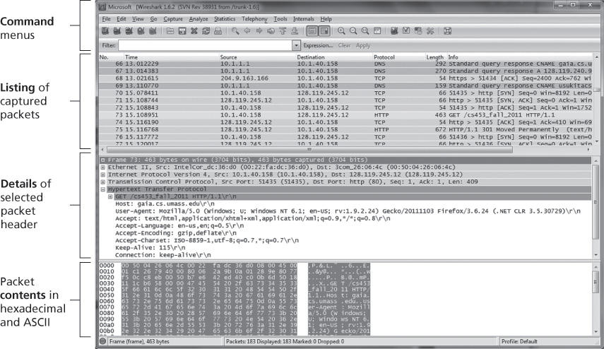

.. _c1.lab:

Wireshark 实验室
=================

Wireshark Lab

    “Tell me and I forget. Show me and I remember. Involve me and I understand.”

    Chinese proverb

One’s understanding of network protocols can often be greatly deepened by seeing them
in action and by playing around with them—observing the sequence of messages
exchanged between two protocol entities, delving into the details of protocol operation,
causing protocols to perform certain actions, and observing these actions and their
consequences. This can be done in simulated scenarios or in a real network
environment such as the Internet. The Java applets at the textbook Web site take the
first approach. In the Wireshark labs, we’ll take the latter approach. You’ll run network
applications in various scenarios using a computer on your desk, at home, or in a lab.
You’ll observe the network protocols in your computer, interacting and exchanging
messages with protocol entities executing elsewhere in the Internet. Thus, you and your
computer will be an integral part of these live labs. You’ll observe—and you’ll learn—by
doing.

The basic tool for observing the messages exchanged between executing protocol
entities is called a **packet sniffer**. As the name suggests, a packet sniffer passively
copies (sniffs) messages being sent from and received by your computer; it also displays
the contents of the various protocol fields of these captured messages. A screenshot of
the Wireshark packet sniffer is shown in :ref:`Figure 1.28 <Figure 1.28>`. Wireshark is a free packet sniffer
that runs on Windows, Linux/Unix, and Mac computers.

.. _Figure 1.28:

**Figure 1.28 A Wireshark screenshot (Wireshark screenshot reprinted by permission of the Wireshark Foundation.)**

Throughout the textbook, you will find Wireshark labs that allow you to explore a number
of the protocols studied in the chapter. In this first Wireshark lab, you’ll obtain and install
a copy of Wireshark, access a Web site, and capture and examine the protocol
messages being exchanged between your Web browser and the Web server.

You can find full details about this first Wireshark lab (including instructions about how to
obtain and install Wireshark) at the Web site http://www.pearsonhighered.com/cs-resources/.