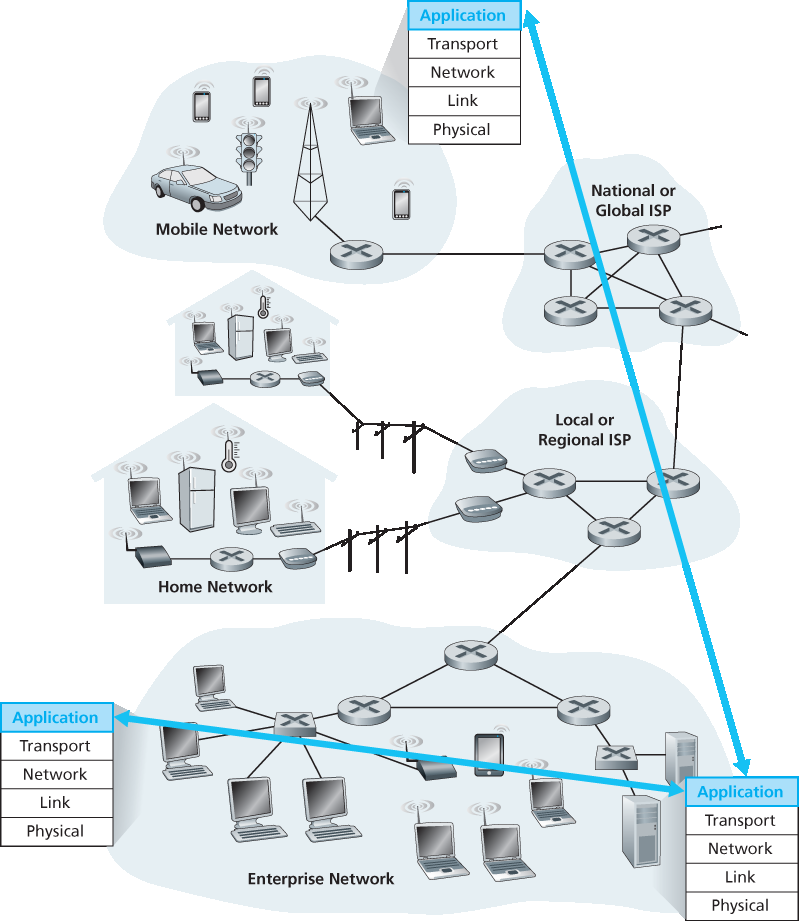
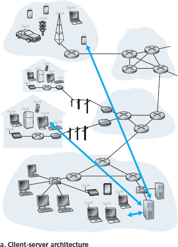
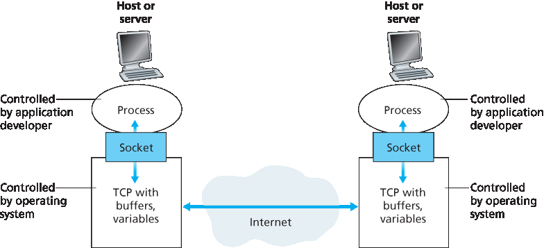
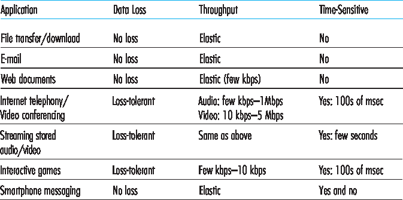
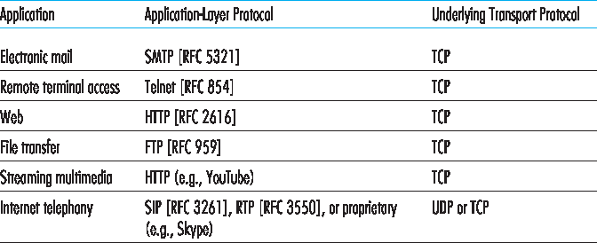

.. _c2.1:

2.1 网络应用原理
=======================================
2.1 Principles of Network Applications

.. tab:: 中文

.. tab:: 英文

Suppose you have an idea for a new network application. Perhaps this application will be a great service
to humanity, or will please your professor, or will bring you great wealth, or will simply be fun to develop.
Whatever the motivation may be, let’s now examine how you transform the idea into a real-world
network application.

At the core of network application development is writing programs that run on different end systems
and communicate with each other over the network. For example, in the Web application there are two
distinct programs that communicate with each other: the browser program running in the user’s host
(desktop, laptop, tablet, smartphone, and so on); and the Web server program running in the Web
server host. As another example, in a P2P file-sharing system there is a program in each host that
participates in the file-sharing community. In this case, the programs in the various hosts may be similar
or identical.

Thus, when developing your new application, you need to write software that will run on multiple end
systems. This software could be written, for example, in C, Java, or Python. Importantly, you do not
need to write software that runs on network-core devices, such as routers or link-layer switches. Even if
you wanted to write application software for these network-core devices, you wouldn’t be able to do so.
As we learned in :ref:`Chapter 1 <c1>`, and as shown earlier in :ref:`Figure 1.24 <Figure 1.24>`, network-core devices do not function
at the application layer but instead function at lower layers—specifically at the network layer and below.
This basic design—namely, confining application software to the end systems—as shown in :ref:`Figure 2.1 <Figure 2.1>`,
has facilitated the rapid development and deployment of a vast array of network applications.

.. _Figure 2.1:

**Figure 2.1 Communication for a network application takes place between end systems at the application layer**

.. _c2.1.1:

2.1.1 网络应用程序体系结构
-------------------------------------------------------
2.1.1 Network Application Architectures

.. tab:: 中文

.. tab:: 英文

Before diving into software coding, you should have a broad architectural plan for your application. Keep
in mind that an application’s architecture is distinctly different from the network architecture (e.g., the
five-layer Internet architecture discussed in :ref:`Chapter 1 <c1>` ). From the application developer’s perspective,
the network architecture is fixed and provides a specific set of services to applications. The **application
architecture**, on the other hand, is designed by the application developer and dictates how the
application is structured over the various end systems. In choosing the application architecture, an
application developer will likely draw on one of the two predominant architectural paradigms used in
modern network applications: the client-server architecture or the peer-to-peer (P2P) architecture.

In a **client-server architecture**, there is an always-on host, called the server, which services requests
from many other hosts, called *clients*. A classic example is the Web application for which an always-on
Web server services requests from browsers running on client hosts. When a Web server receives a
request for an object from a client host, it responds by sending the requested object to the client host.
Note that with the client-server architecture, clients do not directly communicate with each other; for
example, in the Web application, two browsers do not directly communicate. Another characteristic of
the client-server architecture is that the server has a fixed, well-known address, called an IP address
(which we’ll discuss soon). Because the server has a fixed, well-known address, and because the server
is always on, a client can always contact the server by sending a packet to the server’s IP address.
Some of the better-known applications with a client-server architecture include the Web, FTP, Telnet,
and e-mail. The client-server architecture is shown in :ref:`Figure 2.2(a) <Figure 2.2>` .

Often in a client-server application, a single-server host is incapable of keeping up with all the requests
from clients. For example, a popular social-networking site can quickly become overwhelmed if it has
only one server handling all of its requests. For this reason, a **data center**, housing a large number of
hosts, is often used to create a powerful virtual server. The most popular Internet services—such as
search engines (e.g., Google, Bing, Baidu), Internet commerce (e.g., Amazon, eBay, Alibaba), Web-
based e-mail (e.g., Gmail and Yahoo Mail), social networking (e.g., Facebook, Instagram, Twitter, and
WeChat)—employ one or more data centers. As discussed in :ref:`Section 1.3.3 <c1.3.3>` , Google has 30 to 50 data
centers distributed around the world, which collectively handle search, YouTube, Gmail, and other
services. A data center can have hundreds of thousands of servers, which must be powered and
maintained. Additionally, the service providers must pay recurring interconnection and bandwidth costs
for sending data from their data centers.

In a **P2P architecture**, there is minimal (or no) reliance on dedicated servers in data centers. Instead
the application exploits direct communication between pairs of intermittently connected hosts, called
peers. The peers are not owned by the service provider, but are instead desktops and laptops controlled
by users, with most of the peers residing in homes, universities, and offices. Because the peers communicate without passing
through a dedicated server, the architecture is called peer-to-peer. Many of today’s most popular and
traffic-intensive applications are based on P2P architectures. These applications include file sharing
(e.g., BitTorrent), peer-assisted download acceleration (e.g., Xunlei), and Internet telephony and video
conference (e.g., Skype). The P2P architecture is illustrated in :ref:`Figure 2.2(b) <Figure 2.2>` . We mention that some
applications have hybrid architectures, combining both client-server and P2P elements. For example, for
many instant messaging applications, servers are used to track the IP addresses of users, but user-to-
user messages are sent directly between user hosts (without passing through intermediate servers).

.. _Figure 2.2:

.. figure:: ../img/117-1.png
   :align: center
   :name:  (b) P2P architecture

|

**Figure 2.2 (a) Client-server architecture; (b) P2P architecture**

One of the most compelling features of P2P architectures is their **self-scalability**. For example, in a
P2P file-sharing application, although each peer generates workload by requesting files, each peer also
adds service capacity to the system by distributing files to other peers. P2P architectures are also cost
effective, since they normally don’t require significant server infrastructure and server bandwidth (in
contrast with clients-server designs with datacenters). However, P2P applications face challenges of
security, performance, and reliability due to their highly decentralized structure.

.. _c2.1.2:

2.1.2 通信进程
-------------------------------------------------------
2.1.2 Processes Communicating

.. tab:: 中文

.. tab:: 英文

Before building your network application, you also need a basic understanding of how the programs,
running in multiple end systems, communicate with each other. In the jargon of operating systems, it is
not actually programs but **processes** that communicate. A process can be thought of as a program that
is running within an end system. When processes are running on the same end system, they can
communicate with each other with interprocess communication, using rules that are governed by the
end system’s operating system. But in this book we are not particularly interested in how processes in
the same host communicate, but instead in how processes running on *different* hosts (with potentially
different operating systems) communicate.

Processes on two different end systems communicate with each other by exchanging **messages** across
the computer network. A sending process creates and sends messages into the network; a receiving
process receives these messages and possibly responds by sending messages back. :ref:`Figure 2.1 <Figure 2.1>`
illustrates that processes communicating with each other reside in the application layer of the five-layer
protocol stack.

Client and Server Processes
~~~~~~~~~~~~~~~~~~~~~~~~~~~~~~~~~

A network application consists of pairs of processes that send messages to each other over a network.
For example, in the Web application a client browser process exchanges messages with a Web server
process. In a P2P file-sharing system, a file is transferred from a process in one peer to a process in
another peer. For each pair of communicating processes, we typically label one of the two processes as
the client and the other process as the **server**. With the Web, a browser is a client process and a Web
server is a server process. With P2P file sharing, the peer that is downloading the file is labeled as the
client, and the peer that is uploading the file is labeled as the server.

You may have observed that in some applications, such as in P2P file sharing, a process can be both a
client and a server. Indeed, a process in a P2P file-sharing system can both upload and download files.
Nevertheless, in the context of any given communication session between a pair of processes, we can
still label one process as the client and the other process as the server. We define the client and server
processes as follows:

    In the context of a communication session between a pair of processes, the process that initiates the
    communication (that is, initially contacts the other process at the beginning of the session) is labeled
    as the client. The process that waits to be contacted to begin the session is the server.

In the Web, a browser process initializes contact with a Web server process; hence the browser process
is the client and the Web server process is the server. In P2P file sharing, when Peer A asks Peer B to
send a specific file, Peer A is the client and Peer B is the server in the context of this specific
communication session. When there’s no confusion, we’ll sometimes also use the terminology “client
side and server side of an application.” At the end of this chapter, we’ll step through simple code for both
the client and server sides of network applications.

The Interface Between the Process and the Computer Network
~~~~~~~~~~~~~~~~~~~~~~~~~~~~~~~~~~~~~~~~~~~~~~~~~~~~~~~~~~~~~

As noted above, most applications consist of pairs of communicating processes, with the two processes
in each pair sending messages to each other. Any message sent from one process to another must go
through the underlying network. A process sends messages into, and receives messages from, the
network through a software interface called a **socket**. Let’s consider an analogy to help us understand
processes and sockets. A process is analogous to a house and its socket is analogous to its door. When
a process wants to send a message to another process on another host, it shoves the message out its
door (socket). This sending process assumes that there is a transportation infrastructure on the other
side of its door that will transport the message to the door of the destination process. Once the message
arrives at the destination host, the message passes through the receiving process’s door (socket), and
the receiving process then acts on the message.

:ref:`Figure 2.3 <Figure 2.3>` illustrates socket communication between two processes that communicate over the Internet.
(:ref:`Figure 2.3 <Figure 2.3>` assumes that the underlying transport protocol used by the processes is the Internet’s TCP
protocol.) As shown in this figure, a socket is the interface between the application layer and the
transport layer within a host. It is also referred to as the **Application Programming Interface (API)**
between the application and the network, since the socket is the programming interface with which
network applications are built. The application developer has control of everything on the application-
layer side of the socket but has little control of the transport-layer side of the socket. The only control
that the application developer has on the transport-layer side is (1) the choice of transport protocol and
(2) perhaps the ability to fix a few transport-layer parameters such as maximum buffer and maximum
segment sizes (to be covered in **Chapter 3**). Once the application developer chooses a transport
protocol (if a choice is available), the application is built using the transport-layer services provided by
that protocol. We’ll explore sockets in some detail in :ref:`Section 2.7 <Section 2.7>`.

Addressing Processes
~~~~~~~~~~~~~~~~~~~~~~

In order to send postal mail to a particular destination, the destination needs to have an address.
Similarly, in order for a process running on one host to send packets to a process running on another
host, the receiving process needs to have an address.

.. _Figure 2.3:

**Figure 2.3 Application processes, sockets, and underlying transport protocol**

To identify the receiving process, two pieces of information need to be specified: (1) the address of the
host and (2) an identifier that specifies the receiving process in the destination host.

In the Internet, the host is identified by its **IP address**. We’ll discuss IP addresses in great detail in
**Chapter 4**. For now, all we need to know is that an IP address is a 32-bit quantity that we can think of as
uniquely identifying the host. In addition to knowing the address of the host to which a message is
destined, the sending process must also identify the receiving process (more specifically, the receiving
socket) running in the host. This information is needed because in general a host could be running many
network applications. A destination **port number** serves this purpose. Popular applications have been
assigned specific port numbers. For example, a Web server is identified by port number 80. A mail
server process (using the SMTP protocol) is identified by port number 25. A list of well-known port
numbers for all Internet standard protocols can be found at `www.iana.org <http://www.iana.org/>`_ . We’ll examine port numbers in detail in :ref:`Chapter 3 <c3>`.

.. _c2.1.3:

2.1.3 应用程序可用的传输服务
-------------------------------------------------------
2.1.3 Transport Services Available to Applications

.. tab:: 中文

.. tab:: 英文

Recall that a socket is the interface between the application process and the transport-layer protocol.
The application at the sending side pushes messages through the socket. At the other side of the
socket, the transport-layer protocol has the responsibility of getting the messages to the socket of the
receiving process.

Many networks, including the Internet, provide more than one transport-layer protocol. When you
develop an application, you must choose one of the available transport-layer protocols. How do you
make this choice? Most likely, you would study the services provided by the available transport-layer
protocols, and then pick the protocol with the services that best match your application’s needs. The
situation is similar to choosing either train or airplane transport for travel between two cities. You have to
choose one or the other, and each transportation mode offers different services. (For example, the train
offers downtown pickup and drop-off, whereas the plane offers shorter travel time.)

What are the services that a transport-layer protocol can offer to applications invoking it? We can
broadly classify the possible services along four dimensions: reliable data transfer, throughput, timing,
and security.

Reliable Data Transfer
~~~~~~~~~~~~~~~~~~~~~~~~~~~~

As discussed in :ref:`Chapter 1 <c1>`, packets can get lost within a computer network. For example, a packet can
overflow a buffer in a router, or can be discarded by a host or router after having some of its bits
corrupted. For many applications—such as electronic mail, file transfer, remote host access, Web
document transfers, and financial applications—data loss can have devastating consequences (in the
latter case, for either the bank or the customer!). Thus, to support these applications, something has to
be done to guarantee that the data sent by one end of the application is delivered correctly and
completely to the other end of the application. If a protocol provides such a guaranteed data delivery
service, it is said to provide **reliable data transfer**. One important service that a transport-layer protocol
can potentially provide to an application is process-to-process reliable data transfer. When a transport
protocol provides this service, the sending process can just pass its data into the socket and know with
complete confidence that the data will arrive without errors at the receiving process.

When a transport-layer protocol doesn’t provide reliable data transfer, some of the data sent by thesending process may never arrive at the receiving process. This may be acceptable for **loss-tolerant
applications**, most notably multimedia applications such as conversational audio/video that can tolerate
some amount of data loss. In these multimedia applications, lost data might result in a small glitch in the
audio/video—not a crucial impairment.

Throughput
~~~~~~~~~~~~~~

In :ref:`Chapter 1 <c1>` we introduced the concept of available throughput, which, in the context of a
communication session between two processes along a network path, is the rate at which the sending
process can deliver bits to the receiving process. Because other sessions will be sharing the bandwidth
along the network path, and because these other sessions will be coming and going, the available
throughput can fluctuate with time. These observations lead to another natural service that a transport-
layer protocol could provide, namely, guaranteed available throughput at some specified rate. With such
a service, the application could request a guaranteed throughput of r bits/sec, and the transport protocol
would then ensure that the available throughput is always at least r bits/sec. Such a guaranteed
throughput service would appeal to many applications. For example, if an Internet telephony application
encodes voice at 32 kbps, it needs to send data into the network and have data delivered to the
receiving application at this rate. If the transport protocol cannot provide this throughput, the application
would need to encode at a lower rate (and receive enough throughput to sustain this lower coding rate)
or may have to give up, since receiving, say, half of the needed throughput is of little or no use to this
Internet telephony application. Applications that have throughput requirements are said to be
**bandwidth-sensitive applications**. Many current multimedia applications are bandwidth sensitive,
although some multimedia applications may use adaptive coding techniques to encode digitized voice or
video at a rate that matches the currently available throughput.

While bandwidth-sensitive applications have specific throughput requirements, **elastic applications** can
make use of as much, or as little, throughput as happens to be available. Electronic mail, file transfer,
and Web transfers are all elastic applications. Of course, the more throughput, the better. There’san
adage that says that one cannot be too rich, too thin, or have too much throughput!

Timing
~~~~~~~~~~~

A transport-layer protocol can also provide timing guarantees. As with throughput guarantees, timing
guarantees can come in many shapes and forms. An example guarantee might be that every bit that the
sender pumps into the socket arrives at the receiver’s socket no more than 100 msec later. Such a
service would be appealing to interactive real-time applications, such as Internet telephony, virtual
environments, teleconferencing, and multiplayer games, all of which require tight timing constraints on
data delivery in order to be effective. (See :ref:`Chapter 9 <c9>`, [ :ref:`Gauthier 1999 <Gauthier 1999>`; :ref:`Ramjee 1994 <Ramjee 1994>`].) Long delays in
Internet telephony, for example, tend to result in unnatural pauses in the conversation; in a multiplayer
game or virtual interactive environment, a long delay between taking an action and seeing the responsefrom the environment (for example, from another player at the end of an end-to-end connection) makes
the application feel less realistic. For non-real-time applications, lower delay is always preferable to
higher delay, but no tight constraint is placed on the end-to-end delays.

Security
~~~~~~~~~~~~~

Finally, a transport protocol can provide an application with one or more security services. For example,
in the sending host, a transport protocol can encrypt all data transmitted by the sending process, and in
the receiving host, the transport-layer protocol can decrypt the data before delivering the data to the
receiving process. Such a service would provide confidentiality between the two processes, even if the
data is somehow observed between sending and receiving processes. A transport protocol can also
provide other security services in addition to confidentiality, including data integrity and end-point
authentication, topics that we’ll cover in detail in :ref:`Chapter 8 <c8>`.

.. _c2.1.4:

2.1.4 互联网提供的传输服务
-------------------------------------------------------
2.1.4 Transport Services Provided by the Internet

.. tab:: 中文

.. tab:: 英文

Up until this point, we have been considering transport services that a computer network could provide
in general. Let’s now get more specific and examine the type of transport services provided by the
Internet. The Internet (and, more generally, TCP/IP networks) makes two transport protocols available to
applications, UDP and TCP. When you (as an application developer) create a new network application
for the Internet, one of the first decisions you have to make is whether to use UDP or TCP. Each of
these protocols offers a different set of services to the invoking applications. :ref:`Figure 2.4 <Figure 2.4>` shows the
service requirements for some selected applications.

TCP Services
~~~~~~~~~~~~~~~~

The TCP service model includes a connection-oriented service and a reliable data transfer service.
When an application invokes TCP as its transport protocol, the application receives both of these
services from TCP.

- **Connection-oriented service**. TCP has the client and server exchange transport-layer control information with each other before the application-level messages begin to flow. This so-called handshaking procedure alerts the client and server, allowing them to prepare for an onslaught of packets. After the handshaking phase, a **TCP connection** is said to exist between the sockets of the two processes. The connection is a full-duplex connection in that the two processes can send messages to each other over the connection at the same time. When the application finishes sending messages, it must tear down the connection. In :ref:`Chapter 3 <Chapter 3>` we’ll discuss connection-oriented service in detail and examine how it is implemented.

.. _Figure 2.4:

**Figure 2.4 Requirements of selected network applications**

- **Reliable data transfer service**. The communicating processes can rely on TCP to deliver all data sent without error and in the proper order. When one side of the application passes a stream of bytes into a socket, it can count on TCP to deliver the same stream of bytes to the receiving socket, with no missing or duplicate bytes.

TCP also includes a congestion-control mechanism, a service for the general welfare of the Internet
rather than for the direct benefit of the communicating processes. The TCP congestion-control
mechanism throttles a sending process (client or server) when the network is congested between
sender and receiver. As we will see in :ref:`Chapter 3 <c3>`, TCP congestion control also attempts to limit each TCP connection to its fair share of network bandwidth.

.. topic:: FOCUS ON SECURITY

    SECURING TCP

    Neither TCP nor UDP provides any encryption—the data that the sending process passes into
    its socket is the same data that travels over the network to the destination process. So, for
    example, if the sending process sends a password in cleartext (i.e., unencrypted) into its socket,
    the cleartext password will travel over all the links between sender and receiver, potentially
    getting sniffed and discovered at any of the intervening links. Because privacy and other security
    issues have become critical for many applications, the Internet community has developed an
    enhancement for TCP, called **Secure Sockets Layer (SSL)**. TCP-enhanced-with-SSL not only 
    does everything that traditional TCP does but also provides critical process-to-process security
    services, including encryption, data integrity, and end-point authentication. We emphasize that
    SSL is not a third Internet transport protocol, on the same level as TCP and UDP, but instead is
    an enhancement of TCP, with the enhancements being implemented in the application layer. In
    particular, if an application wants to use the services of SSL, it needs to include SSL code
    (existing, highly optimized libraries and classes) in both the client and server sides of the
    application. SSL has its own socket API that is similar to the traditional TCP socket API. When
    an application uses SSL, the sending process passes cleartext data to the SSL socket; SSL in
    the sending host then encrypts the data and passes the encrypted data to the TCP socket. The
    encrypted data travels over the Internet to the TCP socket in the receiving process. The
    receiving socket passes the encrypted data to SSL, which decrypts the data. Finally, SSL
    passes the cleartext data through its SSL socket to the receiving process. We’ll cover SSL in
    some detail in :ref:`Chapter 8 <c8>`.

UDP Services
~~~~~~~~~~~~~~~~~

UDP is a no-frills, lightweight transport protocol, providing minimal services. UDP is connectionless, so
there is no handshaking before the two processes start to communicate. UDP provides an unreliable
data transfer service—that is, when a process sends a message into a UDP socket, UDP provides no
guarantee that the message will ever reach the receiving process. Furthermore, messages that do arrive
at the receiving process may arrive out of order.

UDP does not include a congestion-control mechanism, so the sending side of UDP can pump data into
the layer below (the network layer) at any rate it pleases. (Note, however, that the actual end-to-end
throughput may be less than this rate due to the limited transmission capacity of intervening links or due
to congestion).

Services Not Provided by Internet Transport Protocols
~~~~~~~~~~~~~~~~~~~~~~~~~~~~~~~~~~~~~~~~~~~~~~~~~~~~~

We have organized transport protocol services along four dimensions: reliable data transfer, throughput,
timing, and security. Which of these services are provided by TCP and UDP? We have already noted
that TCP provides reliable end-to-end data transfer. And we also know that TCP can be easily enhanced
at the application layer with SSL to provide security services. But in our brief description of TCP and
UDP, conspicuously missing was any mention of throughput or timing guarantees— services not
provided by today’s Internet transport protocols. Does this mean that time-sensitive applications such as
Internet telephony cannot run in today’s Internet? The answer is clearly no—the Internet has been
hosting time-sensitive applications for many years. These applications often work fairly well because 
they have been designed to cope, to the greatest extent possible, with this lack of guarantee. We’ll
investigate several of these design tricks in :ref:`Chapter 9 <c9>`. Nevertheless, clever design has its limitations
when delay is excessive, or the end-to-end throughput is limited. In summary, today’s Internet can often
provide satisfactory service to time-sensitive applications, but it cannot provide any timing or throughput
guarantees.

:ref:`Figure 2.5 <Figure 2.5>` indicates the transport protocols used by some popular Internet applications. We see that e-
mail, remote terminal access, the Web, and file transfer all use TCP. These applications have chosen
TCP primarily because TCP provides reliable data transfer, guaranteeing that all data will eventually get
to its destination. Because Internet telephony applications (such as Skype) can often tolerate some loss
but require a minimal rate to be effective, developers of Internet telephony applications usually prefer to
run their applications over UDP, thereby circumventing TCP’s congestion control mechanism and packet
overheads. But because many firewalls are configured to block (most types of) UDP traffic, Internet
telephony applications often are designed to use TCP as a backup if UDP communication fails.

.. _Figure 2.5:

**Figure 2.5 Popular Internet applications, their application-layer protocols, and their underlying transport protocols**

.. _c2.1.5:

2.1.5 应用层协议
-------------------------------------------------------
2.1.5 Application-Layer Protocols

.. tab:: 中文

.. tab:: 英文

We have just learned that network processes communicate with each other by sending messages into
sockets. But how are these messages structured? What are the meanings of the various fields in the
messages? When do the processes send the messages? These questions bring us into the realm of
application-layer protocols. An **application-layer protocol** defines how an application’s processes,
running on different end systems, pass messages to each other. In particular, an application-layer
protocol defines:

- The types of messages exchanged, for example, request messages and response messages
- The syntax of the various message types, such as the fields in the message and how the fields are delineated
- The semantics of the fields, that is, the meaning of the information in the fields
- Rules for determining when and how a process sends messages and responds to messages

Some application-layer protocols are specified in RFCs and are therefore in the public domain. For
example, the Web’s application-layer protocol, HTTP (the HyperText Transfer Protocol :ref:`[RFC 2616] <RFC 2616>`), is
available as an RFC. If a browser developer follows the rules of the HTTP RFC, the browser will be able
to retrieve Web pages from any Web server that has also followed the rules of the HTTP RFC. Many
other application-layer protocols are proprietary and intentionally not available in the public domain. For
example, Skype uses proprietary application-layer protocols.

It is important to distinguish between network applications and application-layer protocols. An
application-layer protocol is only one piece of a network application (albeit, a very important piece of the
application from our point of view!). Let’s look at a couple of examples. The Web is a client-server
application that allows users to obtain documents from Web servers on demand. The Web application
consists of many components, including a standard for document formats (that is, HTML), Web
browsers (for example, Firefox and Microsoft Internet Explorer), Web servers (for example, Apache and
Microsoft servers), and an application-layer protocol. The Web’s application-layer protocol, HTTP,
defines the format and sequence of messages exchanged between browser and Web server. Thus,
HTTP is only one piece (albeit, an important piece) of the Web application. As another example, an
Internet e-mail application also has many components, including mail servers that house user
mailboxes; mail clients (such as Microsoft Outlook) that allow users to read and create messages; a
standard for defining the structure of an e-mail message; and application-layer protocols that define how
messages are passed between servers, how messages are passed between servers and mail clients,
and how the contents of message headers are to be interpreted. The principal application-layer protocol
for electronic mail is SMTP (Simple Mail Transfer Protocol) :ref:`[RFC 5321] <RFC 5321>` . Thus, e-mail’s principal
application-layer protocol, SMTP, is only one piece (albeit an important piece) of the e-mail application.

.. _c2.1.6:

2.1.6 本书涵盖的网络应用
-------------------------------------------------------
2.1.6 Network Applications Covered in This Book

.. tab:: 中文

.. tab:: 英文

New public domain and proprietary Internet applications are being developed every day. Rather than
covering a large number of Internet applications in an encyclopedic manner, we have chosen to focus
on a small number of applications that are both pervasive and important. In this chapter we discuss five
important applications: the Web, electronic mail, directory service video streaming, and P2P
applications. We first discuss the Web, not only because it is an enormously popular application, but
also because its application-layer protocol, HTTP, is straightforward and easy to understand. We then
discuss electronic mail, the Internet’s first killer application. E-mail is more complex than the Web in the 
sense that it makes use of not one but several application-layer protocols. After e-mail, we cover DNS,
which provides a directory service for the Internet. Most users do not interact with DNS directly; instead,
users invoke DNS indirectly through other applications (including the Web, file transfer, and electronic
mail). DNS illustrates nicely how a piece of core network functionality (network-name to network-
address translation) can be implemented at the application layer in the Internet. We then discuss P2P
file sharing applications, and complete our application study by discussing video streaming on demand,
including distributing stored video over content distribution networks. In :ref:`Chapter 9 <c9>`, we’ll cover
multimedia applications in more depth, including voice over IP and video conferencing.