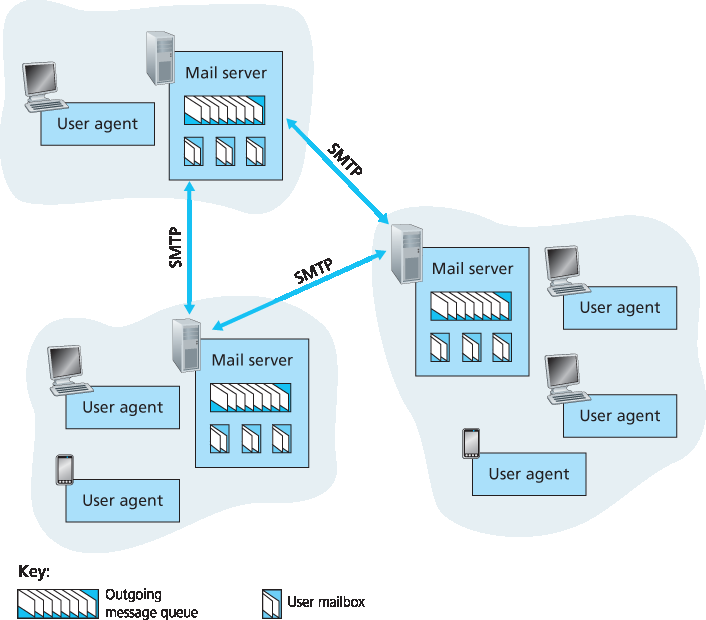
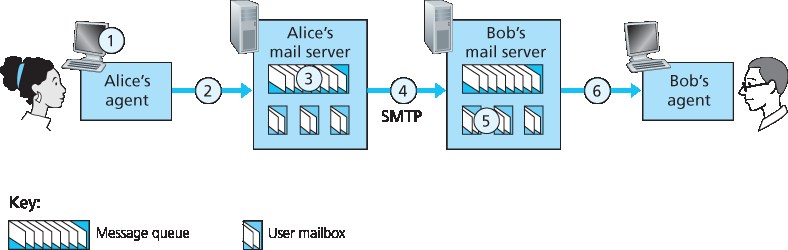
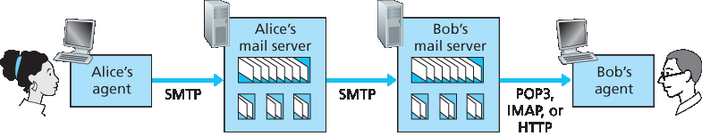

.. _2.3:

2.3 Internet 上的电子邮件
=======================================
2.3 Electronic Mail in the Internet

.. tab:: 中文

.. tab:: 英文

Electronic mail has been around since the beginning of the Internet. It was the most popular application
when the Internet was in its infancy :ref:`[Segaller 1998] <Segaller 1998>` , and has become more elaborate and powerful over the years. It remains one of the Internet’s most important and utilized applications.

As with ordinary postal mail, e-mail is an asynchronous communication medium—people send and read messages when it is convenient for them, without having to coordinate with other people’s schedules. In contrast with postal mail, electronic mail is fast, easy to distribute, and inexpensive. Modern e-mail has many powerful features, including messages with attachments, hyperlinks, HTML-formatted text, and embedded photos.

In this section, we examine the application-layer protocols that are at the heart of Internet e-mail. But before we jump into an in-depth discussion of these protocols, let’s take a high-level view of the Internet mail system and its key components.

:ref:`Figure 2.14 <Figure 2.14>` presents a high-level view of the Internet mail system. We see from this diagram that it has three major components: **user agents**, **mail servers**, and the **Simple Mail Transfer Protocol (SMTP)**.
We now describe each of these components in the context of a sender, Alice, sending an e-mail message to a recipient, Bob. User agents allow users to read, reply to, forward, save, and compose messages. Microsoft Outlook and Apple Mail are examples of user agents for e-mail. When Alice is finished composing her message, her user agent sends the message to her mail server, where the message is placed in the mail server’s outgoing message queue. When Bob wants to read a message, his user agent retrieves the message from his mailbox in his mail server.

Mail servers form the core of the e-mail infrastructure. Each recipient, such as Bob, has a **mailbox** located in one of the mail servers. Bob’s mailbox manages and maintains the messages that have been sent to him. A typical message starts its journey in the sender’s user agent, travels to the sender’s mail server, and travels to the recipient’s mail server, where it is deposited in the recipient’s mailbox. When Bob wants to access the messages in his mailbox, the mail server containing his mailbox authenticates Bob (with usernames and passwords). Alice’s mail server must also deal with failures in Bob’s mail server. If Alice’s server cannot deliver mail to Bob’s server, Alice’s server holds the message in a **message queue** and attempts to transfer the message later. Reattempts are often done every 30 minutes or so; if there is no success after several days, the server removes the message and notifies the sender (Alice) with an e-mail message.

.. _Figure 2.14:

**Figure 2.14 A high-level view of the Internet e-mail system**

SMTP is the principal application-layer protocol for Internet electronic mail. It uses the reliable data transfer service of TCP to transfer mail from the sender’s mail server to the recipient’s mail server. As with most application-layer protocols, SMTP has two sides: a client side, which executes on the sender’s mail server, and a server side, which executes on the recipient’s mail server. Both the client and server sides of SMTP run on every mail server. When a mail server sends mail to other mail servers, it acts as an SMTP client. When a mail server receives mail from other mail servers, it acts as an SMTP server.

.. _c2.3.1:

2.3.1 SMTP
-------------------------------------------------------
2.3.1 SMTP

.. tab:: 中文

.. tab:: 英文

SMTP, defined in RFC 5321, is at the heart of Internet electronic mail. As mentioned above, SMTP transfers messages from senders’ mail servers to the recipients’ mail servers. SMTP is much older than HTTP. (The original SMTP RFC dates back to 1982, and SMTP was around long before that.) Although SMTP has numerous wonderful qualities, as evidenced by its ubiquity in the Internet, it is nevertheless a legacy technology that possesses certain archaic characteristics. For example, it restricts the body (not just the headers) of all mail messages to simple 7-bit ASCII. This restriction made sense in the early 1980s when transmission capacity was scarce and no one was e-mailing large attachments or large image, audio, or video files. But today, in the multimedia era, the 7-bit ASCII restriction is a bit of a pain —it requires binary multimedia data to be encoded to ASCII before being sent over SMTP; and it requires the corresponding ASCII message to be decoded back to binary after SMTP transport. Recall from :ref:`Section 2.2 <c2.2>` that HTTP does not require multimedia data to be ASCII encoded before transfer. 

To illustrate the basic operation of SMTP, let’s walk through a common scenario. Suppose Alice wants to send Bob a simple ASCII message.

1. Alice invokes her user agent for e-mail, provides Bob’s e-mail address (for example, bob@someschool.edu), composes a message, and instructs the user agent to send the message.
2. Alice’s user agent sends the message to her mail server, where it is placed in a message queue.
3. The client side of SMTP, running on Alice’s mail server, sees the message in the message queue. It opens a TCP connection to an SMTP server, running on Bob’s mail server.
4. After some initial SMTP handshaking, the SMTP client sends Alice’s message into the TCP connection.
5. At Bob’s mail server, the server side of SMTP receives the message. Bob’s mail server then places the message in Bob’s mailbox.
6. Bob invokes his user agent to read the message at his convenience.

The scenario is summarized in :ref:`Figure 2.15 <Figure 2.15>`.

It is important to observe that SMTP does not normally use intermediate mail servers for sending mail, even when the two mail servers are located at opposite ends of the world. If Alice’s server is in Hong Kong and Bob’s server is in St. Louis, the TCP connection is a direct connection between the Hong Kong and St. Louis servers. In particular, if Bob’s mail server is down, the message remains in Alice’s mail server and waits for a new attempt—the message does not get placed in some intermediate mail server.

.. _Figure 2.15:

**Figure 2.15 Alice sends a message to Bob**

Let’s now take a closer look at how SMTP transfers a message from a sending mail server to a receiving mail server. We will see that the SMTP protocol has many similarities with protocols that are used for face-to-face human interaction. First, the client SMTP (running on the sending mail server host) has TCP establish a connection to port 25 at the server SMTP (running on the receiving mail server host). If the server is down, the client tries again later. Once this connection is established, the server and client perform some application-layer handshaking—just as humans often introduce themselves before transferring information from one to another, SMTP clients and servers introduce themselves before transferring information. During this SMTP handshaking phase, the SMTP client indicates the e- mail address of the sender (the person who generated the message) and the e-mail address of the recipient. Once the SMTP client and server have introduced themselves to each other, the client sends the message. SMTP can count on the reliable data transfer service of TCP to get the message to the server without errors. The client then repeats this process over the same TCP connection if it has other messages to send to the server; otherwise, it instructs TCP to close the connection.

Let’s next take a look at an example transcript of messages exchanged between an SMTP client (C) and an SMTP server (S). The hostname of the client is `crepes.fr <http://crepes.fr/>`_ and the hostname of the server is `hamburger.edu <http://hamburger.edu/>`_. The ASCII text lines prefaced with ``C:`` are exactly the lines the client sends into its TCP socket, and the ASCII text lines prefaced with ``S:`` are exactly the lines the server sends into its TCP socket. The following transcript begins as soon as the TCP connection is established.

.. code:: smtp 

    S:  220 hamburger.edu
    C:  HELO crepes.fr
    S:  250 Hello crepes.fr, pleased to meet you
    C:  MAIL FROM: <alice@crepes.fr>
    S:  250 alice@crepes.fr ... Sender ok
    C:  RCPT TO: <bob@hamburger.edu>
    S:  250 bob@hamburger.edu ... Recipient ok
    C:  DATA
    S:  354 Enter mail, end with ”.” on a line by itself
    C:  Do you like ketchup?
    C:  How about pickles?
    C:  .
    S:  250 Message accepted for delivery
    C:  QUIT
    S:  221 hamburger.edu closing connection

In the example above, the client sends a message (“Do you like ketchup? How about pickles?”) from mail server `crepes.fr` to mail server `hamburger.edu`. As part of the dialogue, the client issued five commands: `HELO` (an abbreviation for HELLO), `MAIL FROM`, `RCPT TO`, `DATA`,
and `QUIT`. These commands are self-explanatory. The client also sends a line consisting of a single period, which indicates the end of the message to the server. (In ASCII jargon, each message ends with `CRLF.CRLF`, where `CR` and `LF` stand for carriage return and line feed, respectively.) The server issues replies to each command, with each reply having a reply code and some (optional) English- language explanation. We mention here that SMTP uses persistent connections: If the sending mail server has several messages to send to the same receiving mail server, it can send all of the messages over the same TCP connection. For each message, the client begins the process with a new ``MAIL FROM: crepes.fr``, designates the end of message with an isolated period, and issues QUIT only after all messages have been sent.

It is highly recommended that you use Telnet to carry out a direct dialogue with an SMTP server. To do this, issue

.. code:: shell

    telnet serverName 25

where ``serverName`` is the name of a local mail server. When you do this, you are simply establishing a TCP connection between your local host and the mail server. After typing this line, you should immediately receive the ``220`` reply from the server. Then issue the SMTP commands ``HELO``, ``MAIL FROM``, ``RCPT TO``, ``DATA``, ``CRLF.CRLF``, and ``QUIT`` at the appropriate times. It is also highly recommended that you do Programming Assignment 3 at the end of this chapter. In that assignment, you’ll build a simple user agent that implements the client side of SMTP. It will allow you to send an e-mail message to an arbitrary recipient via a local mail server.

.. _c2.3.2:

2.3.2 与 HTTP 的比较
-------------------------------------------------------
2.3.2 Comparison with HTTP

.. tab:: 中文

.. tab:: 英文

Let’s now briefly compare SMTP with HTTP. Both protocols are used to transfer files from one host to another: HTTP transfers files (also called objects) from a Web server to a Web client (typically a browser); SMTP transfers files (that is, e-mail messages) from one mail server to another mail server. When transferring the files, both persistent HTTP and SMTP use persistent connections. Thus, the two protocols have common characteristics. However, there are important differences. First, HTTP is mainly a ``pull protocol`` — someone loads information on a Web server and users use HTTP to pull the information from the server at their convenience. In particular, the TCP connection is initiated by the machine that wants to receive the file. On the other hand, SMTP is primarily a ``push protocol`` —the sending mail server pushes the file to the receiving mail server. In particular, the TCP connection is initiated by the machine that wants to send the file.

A second difference, which we alluded to earlier, is that SMTP requires each message, including the body of each message, to be in 7-bit ASCII format. If the message contains characters that are not 7-bit ASCII (for example, French characters with accents) or contains binary data (such as an image file), then the message has to be encoded into 7-bit ASCII. HTTP data does not impose this restriction.

A third important difference concerns how a document consisting of text and images (along with possibly
other media types) is handled. As we learned in :ref:`Section 2.2 <c2.2>`, HTTP encapsulates each object in its own HTTP response message. SMTP places all of the message’s objects into one message.

.. _c2.3.3:

2.3.3 邮件消息格式
-------------------------------------------------------
2.3.3 Mail Message Formats

.. tab:: 中文

.. tab:: 英文

When Alice writes an ordinary snail-mail letter to Bob, she may include all kinds of peripheral header information at the top of the letter, such as Bob’s address, her own return address, and the date. Similarly, when an e-mail message is sent from one person to another, a header containing peripheral information precedes the body of the message itself. This peripheral information is contained in a series of header lines, which are defined in RFC 5322. The header lines and the body of the message are separated by a blank line (that is, by ``CRLF``). RFC 5322 specifies the exact format for mail header lines as well as their semantic interpretations. As with HTTP, each header line contains readable text, consisting of a keyword followed by a colon followed by a value. Some of the keywords are required and others are optional. Every header must have a ``From:`` header line and a ``To:`` header line; a header may include a ``Subject:`` header line as well as other optional header lines. It is important to note that these header lines are different from the SMTP commands we studied in :ref:`Section 2.4.1 <c2.4.1>` (even though they contain some common words such as “from” and “to”). The commands in that section were part of the SMTP handshaking protocol; the header lines examined in this section are part of the mail message itself.

A typical message header looks like this:

.. code:: SMTP 

    From: alice@crepes.fr
    To: bob@hamburger.edu
    Subject: Searching for the meaning of life.

After the message header, a blank line follows; then the message body (in ASCII) follows. You should use Telnet to send a message to a mail server that contains some header lines, including the ``Subject:`` header line. To do this, issue ``telnet serverName 25``, as discussed in :ref:`Section 2.4.1 <c2.4.1>`.

.. _c2.3.4:

2.3.4 邮件访问协议
-------------------------------------------------------
2.3.4 Mail Access Protocols

.. tab:: 中文

.. tab:: 英文

Once SMTP delivers the message from Alice’s mail server to Bob’s mail server, the message is placed in Bob’s mailbox. Throughout this discussion we have tacitly assumed that Bob reads his mail by logging onto the server host and then executing a mail reader that runs on that host. Up until the early 1990s this was the standard way of doing things. But today, mail access uses a client-server architecture—the typical user reads e-mail with a client that executes on the user’s end system, for example, on an office PC, a laptop, or a smartphone. By executing a mail client on a local PC, users enjoy a rich set of features, including the ability to view multimedia messages and attachments.

Given that Bob (the recipient) executes his user agent on his local PC, it is natural to consider placing a mail server on his local PC as well. With this approach, Alice’s mail server would dialogue directly with Bob’s PC. There is a problem with this approach, however. Recall that a mail server manages mailboxes and runs the client and server sides of SMTP. If Bob’s mail server were to reside on his local PC, then Bob’s PC would have to remain always on, and connected to the Internet, in order to receive new mail, which can arrive at any time. This is impractical for many Internet users. Instead, a typical user runs a user agent on the local PC but accesses its mailbox stored on an always-on shared mail server. This mail server is shared with other users and is typically maintained by the user’s ISP (for example, university or company).

Now let’s consider the path an e-mail message takes when it is sent from Alice to Bob. We just learned that at some point along the path the e-mail message needs to be deposited in Bob’s mail server. This could be done simply by having Alice’s user agent send the message directly to Bob’s mail server. and this could be done with SMTP—indeed, SMTP has been designed for pushing e-mail from one host to another. However, typically the sender’s user agent does not dialogue directly with the recipient’s mail server. Instead, as shown in :ref:`Figure 2.16 <Figure 2.16>`, Alice’s user agent uses SMTP to push the e-mail message into her mail server, then Alice’s mail server uses SMTP (as an SMTP client) to relay the e-mail message to Bob’s mail server. Why the two-step procedure? Primarily because without relaying through Alice’s mail server, Alice’s user agent doesn’t have any recourse to an unreachable destination mail server. By having Alice first deposit the e-mail in her own mail server, Alice’s mail server can repeatedly try to send the message to Bob’s mail server, say every 30 minutes, until Bob’s mail server becomes operational. (And if Alice’s mail server is down, then she has the recourse of complaining to her system administrator!) The SMTP RFC defines how the SMTP commands can be used to relay a message across multiple SMTP servers.

.. _Figure 2.16:

**Figure 2.16 E-mail protocols and their communicating entities**

But there is still one missing piece to the puzzle! How does a recipient like Bob, running a user agent on his local PC, obtain his messages, which are sitting in a mail server within Bob’s ISP? Note that Bob’s user agent can’t use SMTP to obtain the messages because obtaining the messages is a pull operation, whereas SMTP is a push protocol. The puzzle is completed by introducing a special mail access protocol that transfers messages from Bob’s mail server to his local PC. There are currently a number of popular mail access protocols, including Post **Office Protocol—Version 3 (POP3)**, **Internet Mail Access Protocol (IMAP)**, and HTTP.

:ref:`Figure 2.16 <Figure 2.16>` provides a summary of the protocols that are used for Internet mail: SMTP is used to transfer mail from the sender’s mail server to the recipient’s mail server; SMTP is also used to transfer mail from the sender’s user agent to the sender’s mail server. A mail access protocol, such as POP3, is used to transfer mail from the recipient’s mail server to the recipient’s user agent.

POP3
~~~~~

POP3 is an extremely simple mail access protocol. It is defined in :ref:`[RFC 1939] <RFC 1939>` , which is short and quite readable. Because the protocol is so simple, its functionality is rather limited. POP3 begins when the user agent (the client) opens a TCP connection to the mail server (the server) on port 110. With the TCP connection established, POP3 progresses through three phases: authorization, transaction, and update. During the first phase, authorization, the user agent sends a username and a password (in the clear) to authenticate the user. During the second phase, transaction, the user agent retrieves messages; also during this phase, the user agent can mark messages for deletion, remove deletion marks, and obtain mail statistics. The third phase, update, occurs after the client has issued the ``quit`` command, ending the POP3 session; at this time, the mail server deletes the messages that were marked for deletion.

In a POP3 transaction, the user agent issues commands, and the server responds to each command with a reply. There are two possible responses: ``+OK`` (sometimes followed by server-to-client data), used by the server to indicate that the previous command was fine; and ``-ERR``, used by the server to indicate that something was wrong with the previous command.

The authorization phase has two principal commands: ``user <username>`` and ``pass <password>``. To illustrate these two commands, we suggest that you Telnet directly into a POP3 server, using port 110, and issue these commands. Suppose that ``mailServer`` is the name of your mail server. You will see something like:

.. code::

    telnet mailServer 110
    +OK POP3 server ready
    user bob
    +OK
    pass hungry
    +OK user successfully logged on

If you misspell a command, the POP3 server will reply with an ``-ERR`` message.

Now let’s take a look at the transaction phase. A user agent using POP3 can often be configured (by the user) to “download and delete” or to “download and keep.” The sequence of commands issued by a POP3 user agent depends on which of these two modes the user agent is operating in. In the download-and-delete mode, the user agent will issue the ``list``, ``retr``, and ``dele`` commands. As an example, suppose the user has two messages in his or her mailbox. In the dialogue below, ``C:`` (standing for client) is the user agent and ``S:`` (standing for server) is the mail server. The transaction will look something like:

.. code::

    C: list
    S: 1 498
    S: 2 912
    S: .
    C: retr 1
    S: (blah blah ...
    S: .................
    S: ..........blah)
    S: .
    C: dele 1
    C: retr 2
    S: (blah blah ...
    S: .................
    S: ..........blah)
    S: .
    C: dele 2
    C: quit
    S: +OK POP3 server signing off

The user agent first asks the mail server to list the size of each of the stored messages. The user agent then retrieves and deletes each message from the server. Note that after the authorization phase, the
user agent employed only four commands: ``list``, ``retr``, ``dele``, and ``quit``. The syntax for these commands is defined in RFC 1939. After processing the quit command, the POP3 server enters the
update phase and removes messages 1 and 2 from the mailbox.

A problem with this download-and-delete mode is that the recipient, Bob, may be nomadic and may want to access his mail messages from multiple machines, for example, his office PC, his home PC, and his portable computer. The download-and-delete mode partitions Bob’s mail messages over these three machines; in particular, if Bob first reads a message on his office PC, he will not be able to reread the message from his portable at home later in the evening. In the download-and-keep mode, the user agent leaves the messages on the mail server after downloading them. In this case, Bob can reread messages from different machines; he can access a message from work and access it again later in the week from home.

During a POP3 session between a user agent and the mail server, the POP3 server maintains some state information; in particular, it keeps track of which user messages have been marked deleted. However, the POP3 server does not carry state information across POP3 sessions. This lack of state information across sessions greatly simplifies the implementation of a POP3 server.

IMAP
~~~~~

With POP3 access, once Bob has downloaded his messages to the local machine, he can create mail folders and move the downloaded messages into the folders. Bob can then delete messages, move messages across folders, and search for messages (by sender name or subject). But this paradigm— namely, folders and messages in the local machine—poses a problem for the nomadic user, who would prefer to maintain a folder hierarchy on a remote server that can be accessed from any computer. This is not possible with POP3—the POP3 protocol does not provide any means for a user to create remote folders and assign messages to folders.
To solve this and other problems, the IMAP protocol, defined in :ref:`[RFC 3501] <RFC 3501>`, was invented. Like POP3, IMAP is a mail access protocol. It has many more features than POP3, but it is also significantly more complex. (And thus the client and server side implementations are significantly more complex.)

An IMAP server will associate each message with a folder; when a message first arrives at the server, it is associated with the recipient’s INBOX folder. The recipient can then move the message into a new, user-created folder, read the message, delete the message, and so on. The IMAP protocol provides commands to allow users to create folders and move messages from one folder to another. IMAP also provides commands that allow users to search remote folders for messages matching specific criteria. Note that, unlike POP3, an IMAP server maintains user state information across IMAP sessions—for example, the names of the folders and which messages are associated with which folders.

Another important feature of IMAP is that it has commands that permit a user agent to obtain components of messages. For example, a user agent can obtain just the message header of a message or just one part of a multipart MIME message. This feature is useful when there is a low-bandwidth connection (for example, a slow-speed modem link) between the user agent and its mail server. With a low-bandwidth connection, the user may not want to download all of the messages in its mailbox, particularly avoiding long messages that might contain, for example, an audio or video clip.

Web-Based E-Mail
~~~~~~~~~~~~~~~~~~~~

More and more users today are sending and accessing their e-mail through their Web browsers. Hotmail introduced Web-based access in the mid 1990s. Now Web-based e-mail is also provided by Google, Yahoo!, as well as just about every major university and corporation. With this service, the user agent is an ordinary Web browser, and the user communicates with its remote mailbox via HTTP. When a recipient, such as Bob, wants to access a message in his mailbox, the e-mail message is sent from Bob’s mail server to Bob’s browser using the HTTP protocol rather than the POP3 or IMAP protocol. When a sender, such as Alice, wants to send an e-mail message, the e-mail message is sent from her browser to her mail server over HTTP rather than over SMTP. Alice’s mail server, however, still sends messages to, and receives messages from, other mail servers using SMTP.