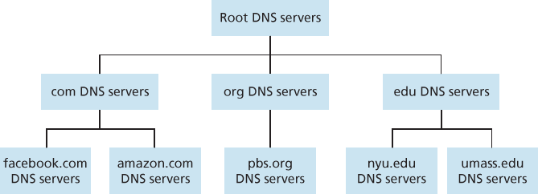
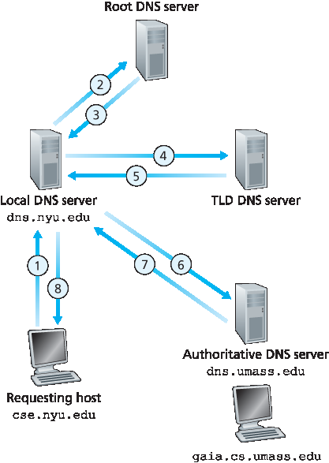
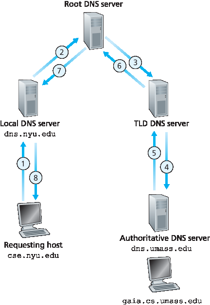
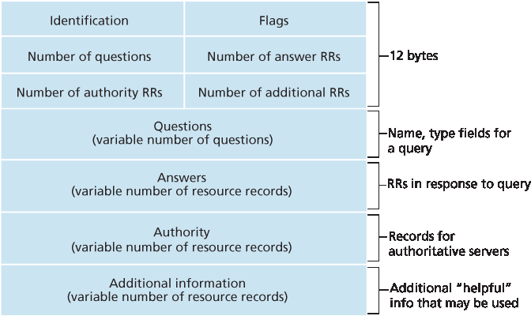

.. _2.4:

2.4 DNS - Internet 的目录服务
=======================================
2.4 DNS—The Internet's Directory Service

.. tab:: 中文

.. tab:: 英文

We human beings can be identified in many ways. For example, we can be identified by the names that appear on our birth certificates. We can be identified by our social security numbers. We can be identified by our driver’s license numbers. Although each of these identifiers can be used to identify people, within a given context one identifier may be more appropriate than another. For example, the computers at the IRS (the infamous tax-collecting agency in the United States) prefer to use fixed-length social security numbers rather than birth certificate names. On the other hand, ordinary people prefer the more mnemonic birth certificate names rather than social security numbers. (Indeed, can you imagine saying, “Hi. My name is 132-67-9875. Please meet my husband, 178-87-1146.”)

Just as humans can be identified in many ways, so too can Internet hosts. One identifier for a host is its **hostname**. Hostnames—such as `www.facebook.com <http://www.facebook.com>`_ , `www.google.com <http://www.google.com>`_ , `gaia.cs.umass.edu <http://gaia.cs.umass.edu>`_ —are mnemonic and are therefore appreciated by humans. However, hostnames provide little, if any, information about the location within the Internet of the host. (A hostname such as `www.eurecom.fr <http://www.eurecom.fr>`_ , which ends with the country code ``.fr``, tells us that the host is probably in France, but doesn’t say much more.) Furthermore, because hostnames can consist of variable-length alphanumeric characters, they would be difficult to process by routers. For these reasons, hosts are also identified by so-called **IP addresses**.

We discuss IP addresses in some detail in :ref:`Chapter 4 <c4>` , but it is useful to say a few brief words about them now. An IP address consists of four bytes and has a rigid hierarchical structure. An IP address looks like ``121.7.106.83``, where each period separates one of the bytes expressed in decimal notation from 0 to 255. An IP address is hierarchical because as we scan the address from left to right, we obtain more and more specific information about where the host is located in the Internet (that is, within which network, in the network of networks). Similarly, when we scan a postal address from bottom to top, we obtain more and more specific information about where the addressee is located.

.. _c2.4.1:

2.4.1 DNS 提供的服务
-------------------------------------------------------
2.4.1 Services Provided by DNS

.. tab:: 中文

.. tab:: 英文

We have just seen that there are two ways to identify a host—by a hostname and by an IP address. People prefer the more mnemonic hostname identifier, while routers prefer fixed-length, hierarchically structured IP addresses. In order to reconcile these preferences, we need a directory service that
translates hostnames to IP addresses. This is the main task of the Internet’s **domain name system (DNS)**. The DNS is (1) a distributed database implemented in a hierarchy of **DNS servers**, and (2) an application-layer protocol that allows hosts to query the distributed database. The DNS servers are often
UNIX machines running the Berkeley Internet Name Domain (BIND) software :ref:`[BIND 2016] <BIND 2016>` . The DNS protocol runs over UDP and uses port 53.

DNS is commonly employed by other application-layer protocols—including HTTP and SMTP to translate user-supplied hostnames to IP addresses. As an example, consider what happens when a browser (that is, an HTTP client), running on some user’s host, requests the URL `www.someschool.edu/index.html`. In order for the user’s host to be able to send an HTTP request message to the Web server www.someschool.edu, the user’s host must first obtain the IP address of `www.someschool.edu`. This is done as follows.

1. The same user machine runs the client side of the DNS application.
2. The browser extracts the hostname, *www.someschool.edu*, from the URL and passes the hostname to the client side of the DNS application.
3. The DNS client sends a query containing the hostname to a DNS server.
4. The DNS client eventually receives a reply, which includes the IP address for the hostname.
5. Once the browser receives the IP address from DNS, it can initiate a TCP connection to the HTTP server process located at port 80 at that IP address.

We see from this example that DNS adds an additional delay—sometimes substantial—to the Internet applications that use it. Fortunately, as we discuss below, the desired IP address is often cached in a “nearby” DNS server, which helps to reduce DNS network traffic as well as the average DNS delay.

DNS provides a few other important services in addition to translating hostnames to IP addresses:

- **Host aliasing**. A host with a complicated hostname can have one or more alias names. For example, a hostname such as relay1.west-coast.enterprise.com could have, say, two aliases such as **enterprise.com** and **www.enterprise.com**. In this case, the hostname *relay1.west-coast.enterprise.com* is said to be a **canonical hostname**. Alias hostnames, when present, are typically more mnemonic than canonical hostnames. DNS can be invoked by an application to obtain the canonical hostname for a supplied alias hostname as well as the IP address of the host.
- **Mail server aliasing**. For obvious reasons, it is highly desirable that e-mail addresses be mnemonic. For example, if Bob has an account with Yahoo Mail, Bob’s e-mail address might be as simple as bob@yahoo.mail. However, the hostname of the Yahoo mail server is more complicated and much less mnemonic than simply **yahoo.com** (for example, the canonical hostname might be something like *relay1.west-coast.yahoo.com* ). DNS can be invoked by a mail application to obtain the canonical hostname for a supplied alias hostname as well as the IP address of the host. In fact, the MX record (see below) permits a company’s mail server and Web server to have identical (aliased) hostnames; for example, a company’s Web server and mail server can both be called **enterprise.com** .
- **Load distribution**. DNS is also used to perform load distribution among replicated servers, such as replicated Web servers. Busy sites, such as **cnn.com**, are replicated over multiple servers, with each server running on a different end system and each having a different IP address. For replicated Web servers, a set of IP addresses is thus associated with one canonical hostname. The DNS database contains this set of IP addresses. When clients make a DNS query for a name mapped to a set of addresses, the server responds with the entire set of IP addresses, but rotates the ordering of the addresses within each reply. Because a client typically sends its HTTP request message to the IP address that is listed first in the set, DNS rotation distributes the traffic among the replicated servers. DNS rotation is also used for e-mail so that multiple mail servers can have the same alias name. Also, content distribution companies such as Akamai have used DNS in more sophisticated ways :ref:`[Dilley 2002] <Dilley 2002>` to provide Web content distribution (see :ref:`Section 2.6.3 <c2.6.3>` ).

The DNS is specified in RFC 1034 and RFC 1035, and updated in several additional RFCs. It is a complex system, and we only touch upon key aspects of its operation here. The interested reader is referred to these RFCs and the book by Albitz and Liu :ref:`[Albitz 1993] <Albitz 1993>` ; see also the retrospective paper :ref:`[Mockapetris 1988] <Mockapetris 1988>`, which provides a nice description of the what and why of DNS, and :ref:`[Mockapetris 2005] <Mockapetris 2005>`.

.. tip:: PRINCIPLES IN PRACTICE

    DNS: CRITICAL NETWORK FUNCTIONS VIA THE CLIENT-SERVER PARADIGM

    Like HTTP, FTP, and SMTP, the DNS protocol is an application-layer protocol since it (1) runs between communicating end systems using the client-server paradigm and (2) relies on an underlying end-to-end transport protocol to transfer DNS messages between communicating end systems. In another sense, however, the role of the DNS is quite different from Web, file transfer, and e-mail applications. Unlike these applications, the DNS is not an application with which a user directly interacts. Instead, the DNS provides a core Internet function—namely, translating hostnames to their underlying IP addresses, for user applications and other software in the Internet. We noted in :ref:`Section 1.2 <c1.2>` that much of the complexity in the Internet architecture is located at the “edges” of the network. The DNS, which implements the critical name-to- address translation process using clients and servers located at the edge of the network, is yet another example of that design philosophy.

.. _c2.4.2:

2.4.2 DNS 工作原理概述
-------------------------------------------------------
2.4.2 Overview of How DNS Works

.. tab:: 中文

.. tab:: 英文

We now present a high-level overview of how DNS works. Our discussion will focus on the hostname-to-IP-address translation service.

Suppose that some application (such as a Web browser or a mail reader) running in a user’s host needs to translate a hostname to an IP address. The application will invoke the client side of DNS, specifying the hostname that needs to be translated. (On many UNIX-based machines, ``gethostbyname()`` is the function call that an application calls in order to perform the translation.) DNS in the user’s host then takes over, sending a query message into the network. All DNS query and reply messages are sent within UDP datagrams to port 53. After a delay, ranging from milliseconds to seconds, DNS in the user’s host receives a DNS reply message that provides the desired mapping. This mapping is then passed to the invoking application. Thus, from the perspective of the invoking application in the user’s host, DNS is a black box providing a simple, straightforward translation service. But in fact, the black box that implements the service is complex, consisting of a large number of DNS servers distributed around the globe, as well as an application-layer protocol that specifies how the DNS servers and querying hosts communicate.

A simple design for DNS would have one DNS server that contains all the mappings. In this centralized design, clients simply direct all queries to the single DNS server, and the DNS server responds directly to the querying clients. Although the simplicity of this design is attractive, it is inappropriate for today’s Internet, with its vast (and growing) number of hosts. The problems with a centralized design include:

- **A single point of failure**. If the DNS server crashes, so does the entire Internet!
- **Traffic volume**. A single DNS server would have to handle all DNS queries (for all the HTTP requests and e-mail messages generated from hundreds of millions of hosts).
- **Distant centralized database**. A single DNS server cannot be “close to” all the querying clients. If we put the single DNS server in New York City, then all queries from Australia must travel to the other side of the globe, perhaps over slow and congested links. This can lead to significant delays.
- **Maintenance**. The single DNS server would have to keep records for all Internet hosts. Not only would this centralized database be huge, but it would have to be updated frequently to account for every new host.

In summary, a centralized database in a single DNS server simply doesn’t scale. Consequently, the DNS is distributed by design. In fact, the DNS is a wonderful example of how a distributed database can be implemented in the Internet.

A Distributed, Hierarchical Database
~~~~~~~~~~~~~~~~~~~~~~~~~~~~~~~~~~~~

In order to deal with the issue of scale, the DNS uses a large number of servers, organized in a hierarchical fashion and distributed around the world. No single DNS server has all of the mappings for all of the hosts in the Internet. Instead, the mappings are distributed across the DNS servers. To a first approximation, there are three classes of DNS servers—root DNS servers, top-level domain (TLD) DNS servers, and authoritative DNS servers—organized in a hierarchy as shown in :ref:`Figure 2.17 <Figure 2.17>`. To understand how these three classes of servers interact, suppose a DNS client wants to determine the IP address for the hostname **www.amazon.com**. To a first approximation, the following events will take place. The client first contacts one of the root servers, which returns IP addresses for TLD servers for the top-level domain **com**. The client then contacts one of these TLD servers, which returns the IP address of an authoritative server for amazon.com. Finally, the client contacts one of the authoritative servers for amazon.com, which returns the IP address for the hostname www.amazon.com. We’ll soon examine this DNS lookup process in more detail. But let’s first take a closer look at these three classes of DNS servers:

.. _Figure 2.17:

**Figure 2.17 Portion of the hierarchy of DNS servers**

- **Root DNS servers**. There are over 400 root name servers scattered all over the world. :ref:`Figure 2.18 <Figure 2.18>` shows the countries that have root names servers, with countries having more than ten darkly shaded. These root name servers are managed by 13 different organizations. The full list of root name servers, along with the organizations that manage them and their IP addresses can be found at :ref:`[Root Servers 2016] <Root Servers 2016>` . Root name servers provide the IP addresses of the TLD servers. 
- **Top-level domain (TLD) servers**. For each of the top-level domains — top-level domains such as com, org, net, edu, and gov, and all of the country top-level domains such as uk, fr, ca, and jp — there is TLD server (or server cluster). The company Verisign Global Registry Services maintains the TLD servers for the **com** top-level domain, and the company Educause maintains the TLD servers for the **edu** top-level domain. The network infrastructure supporting a TLD can be large and complex; see :ref:`[Osterweil 2012] <Osterweil 2012>` for a nice overview of the Verisign network. See :ref:`[TLD list 2016] <TLD list 2016>` for a list of all top-level domains. TLD servers provide the IP addresses for authoritative DNS servers.
  
  .. _Figure 2.18:

  .. figure:: ../img/165-0.png 
     :align: center

  **Figure 2.18 DNS root servers in 2016**

- **Authoritative DNS servers**. Every organization with publicly accessible hosts (such as Web servers and mail servers) on the Internet must provide publicly accessible DNS records that map the names of those hosts to IP addresses. An organization’s authoritative DNS server houses these DNS records. An organization can choose to implement its own authoritative DNS server to hold these records; alternatively, the organization can pay to have these records stored in an authoritative DNS server of some service provider. Most universities and large companies implement and maintain their own primary and secondary (backup) authoritative DNS server.
 
The root, TLD, and authoritative DNS servers all belong to the hierarchy of DNS servers, as shown in :ref:`Figure 2.17 <Figure 2.17>` . There is another important type of DNS server called the **local DNS server**. A local DNS server does not strictly belong to the hierarchy of servers but is nevertheless central to the DNS architecture. Each ISP—such as a residential ISP or an institutional ISP—has a local DNS server (also called a default name server). When a host connects to an ISP, the ISP provides the host with the IP addresses of one or more of its local DNS servers (typically through DHCP, which is discussed in :ref:`Chapter 4 <c4>`). You can easily determine the IP address of your local DNS server by accessing network status windows in Windows or UNIX. A host’s local DNS server is typically “close to” the host. For an institutional ISP, the local DNS server may be on the same LAN as the host; for a residential ISP, it is typically separated from the host by no more than a few routers. When a host makes a DNS query, the query is sent to the local DNS server, which acts a proxy, forwarding the query into the DNS server hierarchy, as we’ll discuss in more detail below.

Let’s take a look at a simple example. Suppose the host *cse.nyu.edu* desires the IP address of *gaia.cs.umass.edu*. Also suppose that NYU’s ocal DNS server for *cse.nyu.edu* is called *dns.nyu.edu* and that an authoritative DNS server for *gaia.cs.umass.edu* is called *dns.umass.edu*. As shown in :ref:`Figure 2.19 <Figure 2.19>` , the host *cse.nyu.edu* first sends a DNS query message to its local DNS server, *dns.nyu.edu*. The query message contains the hostname to be translated, namely, **gaia.cs.umass.edu**. The local DNS server forwards the query message to a root DNS server. The root DNS server takes note of the edu suffix and returns to the local DNS server a list of IP addresses for TLD servers responsible for **edu**. The local DNS server then resends the query message to one of these TLD servers. The TLD server takes note of the *umass.edu* suffix and responds with the IP address of the authoritative DNS server for the University of Massachusetts, namely, *dns.umass.edu*. Finally, the local DNS server resends the query message directly to *dns.umass.edu*, which responds with the IP address of *gaia.cs.umass.edu*. Note that in this example, in order to obtain the mapping for one hostname, eight DNS messages were sent: four query messages and four reply messages! We’ll soon see how DNS caching reduces this query traffic.

Our previous example assumed that the TLD server knows the authoritative DNS server for the hostname. In general this not always true. Instead, the TLD server may know only of an intermediate DNS server, which in turn knows the authoritative DNS server for the hostname. For example, suppose again that the University of Massachusetts has a DNS server for the university, called *dns.umass.edu*. Also suppose that each of the departments at the University of Massachusetts has its own DNS server, and that each departmental DNS server is authoritative for all hosts in the department. In this case, when the intermediate DNS server, *dns.umass.edu*, receives a query for a host with a hostname ending with cs.umass.edu, it returns to dns.nyu.edu the IP address of dns.cs.umass.edu, which is authoritative for all hostnames ending with *cs.umass.edu*. The local DNS server dns.nyu.edu then sends the query to the authoritative DNS server, which returns the desired mapping to the local DNS server, which in turn returns the mapping to the requesting host. In this case, a total of 10 DNS messages are sent!

.. _Figure 2.19:

**Figure 2.19 Interaction of the various DNS servers**

The example shown in :ref:`Figure 2.19 <Figure 2.19>` makes use of both **recursive queries** and **iterative queries**. The query sent from *cse.nyu.edu* to *dns.nyu.edu* is a recursive query, since the query asks ``dns.nyu.edu`` to obtain the mapping on its behalf. But the subsequent three queries are iterative since all of the replies are directly returned to dns.nyu.edu. In theory, any DNS query can be iterative or recursive. For example, :ref:`Figure 2.20 <Figure 2.20>` shows a DNS query chain for which all of the queries are recursive. In practice, the queries typically follow the pattern in :ref:`Figure 2.19 <Figure 2.19>`: The query from the requesting host to the local DNS server is recursive, and the remaining queries are iterative.

DNS Caching
~~~~~~~~~~~~~~~

Our discussion thus far has ignored **DNS caching**, a critically important feature of the DNS system. In truth, DNS extensively exploits DNS caching in order to improve the delay performance and to reduce the number of DNS messages ricocheting around the Internet. The idea behind DNS caching is very simple. In a query chain, when a DNS server receives a DNS reply (containing, for example, a mapping from a hostname to an IP
address), it can cache the mapping in its local memory. For example, in :ref:`Figure 2.19 <Figure 2.19>`, each time the local DNS server ``dns.nyu.edu`` receives a reply from some DNS server, it can cache any of the information contained in the reply. If a hostname/IP address pair is cached in a DNS server and another query arrives to the DNS server for the same hostname, the DNS server can provide the desired IP address, even if it is not authoritative for the hostname. Because hosts and mappings between hostnames and IP addresses are by no means permanent, DNS servers discard cached information after a period of time (often set to two days).

.. _Figure 2.20:

**Figure 2.20 Recursive queries in DNS**

As an example, suppose that a host *apricot.nyu.edu* queries *dns.nyu.edu* for the IP address for the hostname *cnn.com*. Furthermore, ­suppose that a few hours later, another NYU host, say, **kiwi.nyu.edu**, also queries *dns.nyu.edu* with the same hostname. Because of caching, the local DNS server will be able to immediately return the IP address of **cnn.com** to this second requesting host without having to query any other DNS servers. A local DNS server can also cache the IP addresses of TLD servers, thereby allowing the local DNS server to bypass the root DNS servers in a query chain. In fact, because of caching, root servers are bypassed for all but a very small fraction of DNS queries.

.. _c2.4.3:

2.4.3 DNS 记录和消息
-------------------------------------------------------
2.4.3 DNS Records and Messages

.. tab:: 中文

.. tab:: 英文

The DNS servers that together implement the DNS distributed database store **resource records (RRs)**, including RRs that provide hostname-to-IP address mappings. Each DNS reply message carries one or more resource records. In this and the following subsection, we provide a brief overview of DNS
resource records and messages; more details can be found in :ref:`[Albitz 1993] <Albitz 1993>` or in the DNS RFCs [ :ref:`RFC 1034 <RFC 1034>` ; :ref:`[RFC 1035] <RFC 1035>`].

A resource record is a four-tuple that contains the following fields:

.. code:: text

    (Name, Value, Type, TTL)

**TTL** is the time to live of the resource record; it determines when a resource should be removed from a cache. In the example records given below, we ignore the **TTL** field. The meaning of **Name** and **Value** depend on **Type**:

- If ``Type=A``, then **Name** is a hostname and **Value** is the IP address for the hostname. Thus, a Type A record provides the standard hostname-to-IP address mapping. As an example, ``(relay1.bar.foo.com, 145.37.93.126, A)`` is a Type A record.
- If ``Type=NS``, then **Name** is a domain (such as *foo.com*) and **Value** is the hostname of an authoritative DNS server that knows how to obtain the IP addresses for hosts in the domain. This record is used to route DNS queries further along in the query chain. As an example, ``(foo.com, dns.foo.com, NS)`` is a Type NS record.
- If ``Type=CNAME``, then **Value** is a canonical hostname for the alias hostname **Name**. This record can provide querying hosts the canonical name for a hostname. As an example, ``(foo.com, relay1.bar.foo.com, CNAME)`` is a CNAME record.
- If ``Type=MX``, then **Value** is the canonical name of a mail server that has an alias hostname **Name**. As an example, ``(foo.com, mail.bar.foo.com, MX)`` is an MX record. MX records allow the hostnames of mail servers to have simple aliases. Note that by using the MX record, a company can have the same aliased name for its mail server and for one of its other servers (such as its Web server). To obtain the canonical name for the mail server, a DNS client would query for an MX record; to obtain the canonical name for the other server, the DNS client would query for the CNAME record.

If a DNS server is authoritative for a particular hostname, then the DNS server will contain a Type A record for the hostname. (Even if the DNS server is not authoritative, it may contain a Type A record in its cache.) If a server is not authoritative for a hostname, then the server will contain a Type NS record for the domain that includes the hostname; it will also contain a Type A record that provides the IP
address of the DNS server in the **Value** field of the NS record. As an example, suppose an edu TLD server is not authoritative for the host gaia.cs.umass.edu. Then this server will contain a record for a domain that includes the host *gaia.cs.umass.edu*, for example, ``(umass.edu, dns.umass.edu, NS)``. The edu TLD server would also contain a Type A record, which maps the DNS server *dns.umass.edu* to an IP address, for example, ``(dns.umass.edu, 128.119.40.111, A)``.

DNS Messages
~~~~~~~~~~~~~~

Earlier in this section, we referred to DNS query and reply messages. These are the only two kinds of DNS messages. Furthermore, both query and reply messages have the same format, as shown in :ref:`Figure 2.21 <Figure 2.21>`. The semantics of the various fields in a DNS message are as follows:

- The first 12 bytes is the header section, which has a number of fields. The first field is a 16-bit
number that identifies the query. This identifier is copied into the reply message to a query, allowing the client to match received replies with sent queries. There are a number of flags in the flag field. A 1-bit query/reply flag indicates whether the message is a query (0) or a reply (1). A 1-bit authoritative flag is set in a reply message when a DNS server is an authoritative server for a queried name. A 1-bit recursion-desired flag is set when a client (host or DNS server) desires that the DNS server perform recursion when it doesn’t have the record. A 1-bit recursion-available field is set in a reply if the DNS server supports recursion. In the header, there are also four number-of fields. These fields indicate the number of occurrences of the four types of data sections that follow the header.

.. _Figure 2.21:

**Figure 2.21 DNS message format**

- The question section contains information about the query that is being made. This section includes (1) a name field that contains the name that is being queried, and (2) a type field that indicates the type of question being asked about the name—for example, a host address associated with a name (Type A) or the mail server for a name (Type MX).
- In a reply from a DNS server, the answer section contains the resource records for the name that was originally queried. Recall that in each resource record there is the **Type** (for example, A, NS, CNAME, and MX), the **Value**, and the **TTL**. A reply can return multiple RRs in the answer, since a hostname can have multiple IP addresses (for example, for replicated Web servers, as discussed earlier in this section).
- The authority section contains records of other authoritative servers.
- The additional section contains other helpful records. For example, the answer field in a reply to an MX query contains a resource record providing the canonical hostname of a mail server. The additional section contains a Type A record providing the IP address for the canonical hostname of the mail server.

How would you like to send a DNS query message directly from the host you’re working on to some DNS server? This can easily be done with the **nslookup program**, which is available from most Windows and UNIX platforms. For example, from a Windows host, open the Command Prompt and invoke the nslookup program by simply typing “nslookup.” After invoking nslookup, you can send a DNS query to any DNS server (root, TLD, or authoritative). After receiving the reply message from the DNS server, nslookup will display the records included in the reply (in a human-readable format). As an alternative to running nslookup from your own host, you can visit one of many Web sites that allow you to remotely employ nslookup. (Just type “nslookup” into a search engine and you’ll be brought to one of these sites.) The DNS Wireshark lab at the end of this chapter will allow you to explore the DNS in much more detail.

Inserting Records into the DNS Database
~~~~~~~~~~~~~~~~~~~~~~~~~~~~~~~~~~~~~~~~~~~~~~~~~~~~

The discussion above focused on how records are retrieved from the DNS database. You might be wondering how records get into the database in the first place. Let’s look at how this is done in the context of a specific example. Suppose you have just created an exciting new startup company called Network Utopia. The first thing you’ll surely want to do is register the domain name **networkutopia.com** at a registrar. A **registrar** is a commercial entity that verifies the uniqueness of the domain name, enters the domain name into the DNS database (as discussed below), and collects a small fee from you for its services. Prior to 1999, a single registrar, Network Solutions, had a monopoly on domain name registration for **com**, **net**, and **org** domains. But now there are many registrars competing for customers, and the Internet Corporation for Assigned Names and Numbers (ICANN) accredits the various registrars. A complete list of accredited registrars is available at http://www.internic.net .

When you register the domain name `networkutopia.com <http://networkutopia.com/>`_  with some registrar, you also need to provide the registrar with the names and IP addresses of your primary and secondary authoritative DNS servers. Suppose the names and IP addresses are **dns1.networkutopia.com**, **dns2.networkutopia.com**, ``212.2.212.1``, and ``212.212.212.2``. For each of these two authoritative DNS servers, the registrar would then make sure that a Type NS and a Type A record are entered into the TLD com servers. Specifically, for the primary authoritative server for **networkutopia.com** , the registrar would insert the following two resource records into the DNS system:

.. code:: text

    (networkutopia.com, dns1.networkutopia.com, NS)
    (dns1.networkutopia.com, 212.212.212.1, A)

You’ll also have to make sure that the Type A resource record for your Web server www.networkutopia.com and the Type MX resource record for your mail server mail.networkutopia.com are entered into your authoritative DNS servers. (Until recently, the contents of each DNS server were configured statically, for example, from a configuration file created by a system manager. More recently, an UPDATE option has been added to the DNS protocol to allow data to be dynamically added or deleted from the database via DNS messages. :ref:`[RFC 2136] <RFC 2136>` and :ref:`[RFC 3007] <RFC 3007>` specify DNS dynamic updates.)

.. admonition:: FOCUS ON SECURITY

    DNS VULNERABILITIES

    We have seen that DNS is a critical component of the Internet infrastructure, with many important services—including the Web and e-mail—simply incapable of functioning without it. We therefore naturally ask, how can DNS be attacked? Is DNS a sitting duck, waiting to be knocked out of service, while taking most Internet applications down with it?

    The first type of attack that comes to mind is a DDoS bandwidth-flooding attack (see :ref:`Section 1.6 <c1.6>` ) against DNS servers. For example, an attacker could attempt to send to each DNS root server a deluge of packets, so many that the majority of legitimate DNS queries never get answered. Such a large-scale DDoS attack against DNS root servers actually took place on October 21, 2002. In this attack, the attackers leveraged a botnet to send truck loads of ICMP ping messages to each of the 13 DNS root IP addresses. (ICMP messages are discussed in :ref:`Section 5.6 <c5.6>`. For now, it suffices to know that ICMP packets are special types of IP datagrams.) Fortunately, this large-scale attack caused minimal damage, having little or no impact on users’ Internet experience. The attackers did succeed at directing a deluge of packets at the root servers. But many of the DNS root servers were protected by packet filters, configured to always block all ICMP ping messages directed at the root servers. These protected servers were thus spared and functioned as normal. Furthermore, most local DNS servers cache the IP addresses of top-level-domain servers, allowing the query process to often bypass the DNS root servers.

    A potentially more effective DDoS attack against DNS would be send a deluge of DNS queries to top-level-domain servers, for example, to all the top-level-domain servers that handle the .com domain. It would be harder to filter DNS queries directed to DNS servers; and top-level-domain servers are not as easily bypassed as are root servers. But the severity of such an attack would be partially mitigated by caching in local DNS servers.

    DNS could potentially be attacked in other ways. In a man-in-the-middle attack, the attacker intercepts queries from hosts and returns bogus replies. In the DNS poisoning attack, the attacker sends bogus replies to a DNS server, tricking the server into accepting bogus records into its cache. Either of these attacks could be used, for example, to redirect an unsuspecting Web user to the attacker’s Web site. These attacks, however, are difficult to implement, as they require intercepting packets or throttling servers :ref:`[Skoudis 2006] <Skoudis 2006>` .

    In summary, DNS has demonstrated itself to be surprisingly robust against attacks. To date, there hasn’t been an attack that has successfully impeded the DNS service.

Once all of these steps are completed, people will be able to visit your Web site and send e-mail to the employees at your company. Let’s conclude our discussion of DNS by verifying that this statement is true. This verification also helps to solidify what we have learned about DNS. Suppose Alice in Australia
wants to view the Web page **www.networkutopia.com**. As discussed earlier, her host will first send a DNS query to her local DNS server. The local DNS server will then contact a TLD com server. (The local DNS server will also have to contact a root DNS server if the address of a TLD **com** server is not cached.) This TLD server contains the Type NS and Type A resource records listed above, because the registrar had these resource records inserted into all of the TLD **com** servers. The TLD com server sends a reply to Alice’s local DNS server, with the reply containing the two resource records. The local DNS server then sends a DNS query to ``212.212.212.1``, asking for the Type A record corresponding to **www.networkutopia.com**. This record provides the IP address of the desired Web server, say, ``212.212.71.4``, which the local DNS server passes back to Alice’s host. Alice’s browser can now initiate a TCP connection to the host ``212.212.71.4`` and send an HTTP request over the connection. Whew! There’s a lot more going on than what meets the eye when one surfs the Web!