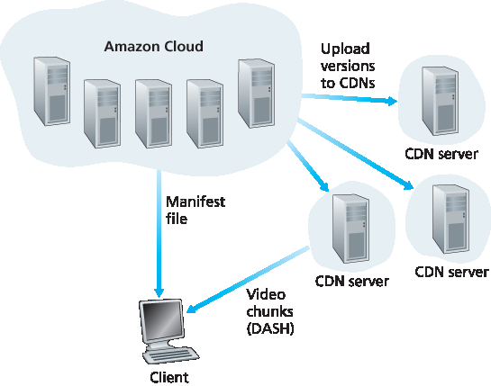

.. _c2.6:

2.6 视频流和内容分发
=======================================
2.6 Video Streaming and Content Distribu

.. tab:: 中文

.. tab:: 英文

.. _c2.6.1:

2.6.1 Internet 视频
-------------------------------------------------------
2.6.1 Internet Video

.. tab:: 中文

.. tab:: 英文

Streaming prerecorded video now accounts for the majority of the traffic in residential ISPs in North America. In particular, the Netflix and YouTube services alone consumed a whopping 37% and 16%, respectively, of residential ISP traffic in 2015 :ref:`[Sandvine 2015] <Sandvine 2015>`. In this section we will provide an overview of how popular video streaming services are implemented in today’s Internet. We will see they are implemented using application-level protocols and servers that function in some ways like a cache. In :ref:`Chapter 9 <c9>`, devoted to multimedia networking, we will further examine Internet video as well as other Internet multimedia services.

In streaming stored video applications, the underlying medium is prerecorded video, such as a movie, a television show, a prerecorded sporting event, or a prerecorded user-generated video (such as those commonly seen on YouTube). These prerecorded videos are placed on servers, and users send
requests to the servers to view the videos on demand. Many Internet companies today provide streaming video, including, Netflix, YouTube (Google), Amazon, and Youku.
But before launching into a discussion of video streaming, we should first get a quick feel for the video medium itself. A video is a sequence of images, typically being displayed at a constant rate, for example, at 24 or 30 images per second. An uncompressed, digitally encoded image consists of an array of pixels, with each pixel encoded into a number of bits to represent luminance and color. An important characteristic of video is that it can be compressed, thereby trading off video quality with bit rate. Today’s off-the-shelf compression algorithms can compress a video to essentially any bit rate desired. Of course, the higher the bit rate, the better the image quality and the better the overall user viewing experience.

From a networking perspective, perhaps the most salient characteristic of video is its high bit rate. Compressed Internet video typically ranges from 100 kbps for low-quality video to over 3 Mbps for streaming high-definition movies; 4K streaming envisions a bitrate of more than 10 Mbps. This can translate to huge amount of traffic and storage, particularly for high-end video. For example, a single 2 Mbps video with a duration of 67 minutes will consume 1 gigabyte of storage and traffic. By far, the most important performance measure for streaming video is average end-to-end throughput. In order to provide continuous playout, the network must provide an average throughput to the streaming application that is at least as large as the bit rate of the compressed video.

We can also use compression to create multiple versions of the same video, each at a different quality level. For example, we can use compression to create, say, three versions of the same video, at rates of 300 kbps, 1 Mbps, and 3 Mbps. Users can then decide which version they want to watch as a function of their current available bandwidth. Users with high-speed Internet connections might choose the 3 Mbps version; users watching the video over 3G with a smartphone might choose the 300 kbps version.

.. _c2.6.2:

2.6.2 HTTP 流 和 DASH
-------------------------------------------------------
2.6.2 HTTP Streaming and DASH

.. tab:: 中文

.. tab:: 英文

In HTTP streaming, the video is simply stored at an HTTP server as an ordinary file with a specific URL. When a user wants to see the video, the client establishes a TCP connection with the server and issues an HTTP ``GET`` request for that URL. The server then sends the video file, within an HTTP response message, as quickly as the underlying network protocols and traffic conditions will allow. On the client side, the bytes are collected in a client application buffer. Once the number of bytes in this buffer exceeds a predetermined threshold, the client application begins playback—specifically, the streaming video application periodically grabs video frames from the client application buffer, decompresses the frames, and displays them on the user’s screen. Thus, the video streaming application is displaying video as it is receiving and buffering frames corresponding to latter parts of the video.

Although HTTP streaming, as described in the previous paragraph, has been extensively deployed in practice (for example, by YouTube since its inception), it has a major shortcoming: All clients receive the same encoding of the video, despite the large variations in the amount of bandwidth available to a client, both across different clients and also over time for the same client. This has led to the development of a new type of HTTP-based streaming, often referred to as **Dynamic Adaptive Streaming over HTTP (DASH)**. In DASH, the video is encoded into several different versions, with each version having a different bit rate and, correspondingly, a different quality level. The client dynamically requests chunks of video segments of a few seconds in length. When the amount of available bandwidth is high, the client naturally selects chunks from a high-rate version; and when the available bandwidth is low, it naturally selects from a low-rate version. The client selects different chunks one at a time with HTTP GET request messages :ref:`[Akhshabi 2011] <Akhshabi 2011>`.

DASH allows clients with different Internet access rates to stream in video at different encoding rates. Clients with low-speed 3G connections can receive a low bit-rate (and low-quality) version, and clients with fiber connections can receive a high-quality version. DASH also allows a client to adapt to the available bandwidth if the available end-to-end bandwidth changes during the session. This feature is particularly important for mobile users, who typically see their bandwidth availability fluctuate as they move with respect to the base stations.

With DASH, each video version is stored in the HTTP server, each with a different URL. The HTTP server also has a **manifest file**, which provides a URL for each version along with its bit rate. The client first requests the manifest file and learns about the various versions. The client then selects one chunk at a time by specifying a URL and a byte range in an HTTP GET request message for each chunk. While downloading chunks, the client also measures the received bandwidth and runs a rate determination algorithm to select the chunk to request next. Naturally, if the client has a lot of video buffered and if the measured receive bandwidth is high, it will choose a chunk from a high-bitrate version. And naturally if the client has little video buffered and the measured received bandwidth is low, it will choose a chunk from a low-bitrate version. DASH therefore allows the client to freely switch among different quality levels.

.. _c2.6.3:

2.6.3 内容分发网络
-------------------------------------------------------
2.6.3 Content Distribution Networks

.. tab:: 中文

.. tab:: 英文

Today, many Internet video companies are distributing on-demand multi-Mbps streams to millions of users on a daily basis. YouTube, for example, with a library of hundreds of millions of videos, distributes hundreds of millions of video streams to users around the world every day. Streaming all this traffic to locations all over the world while providing continuous playout and high interactivity is clearly a challenging task.

For an Internet video company, perhaps the most straightforward approach to providing streaming video service is to build a single massive data center, store all of its videos in the data center, and stream the videos directly from the data center to clients worldwide. But there are three major problems with this approach. First, if the client is far from the data center, server-to-client packets will cross many communication links and likely pass through many ISPs, with some of the ISPs possibly located on different continents. If one of these links provides a throughput that is less than the video consumption rate, the end-to-end throughput will also be below the consumption rate, resulting in annoying freezing delays for the user. (Recall from :ref:`Chapter 1 <c1>` that the end-to-end throughput of a stream is governed by the throughput at the bottleneck link.) The likelihood of this happening increases as the number of links in the end-to-end path increases. A second drawback is that a popular video will likely be sent many times over the same communication links. Not only does this waste network bandwidth, but the Internet video company itself will be paying its provider ISP (connected to the data center) for sending the same bytes into the Internet over and over again. A third problem with this solution is that a single data center represents a single point of failure—if the data center or its links to the Internet goes down, it would not be able to distribute any video streams.

In order to meet the challenge of distributing massive amounts of video data to users distributed around the world, almost all major video-streaming companies make use of **Content Distribution Networks (CDNs)**. A CDN manages servers in multiple geographically distributed locations, stores copies of the videos (and other types of Web content, including documents, images, and audio) in its servers, and attempts to direct each user request to a CDN location that will provide the best user experience. The CDN may be a **private CDN**, that is, owned by the content provider itself; for example, Google’s CDN distributes YouTube videos and other types of content. The CDN may alternatively be a **third-party CDN** that distributes content on behalf of multiple content providers; Akamai, Limelight and Level-3 all operate third-party CDNs. A very readable overview of modern CDNs is [ :ref:`Leighton 2009 <Leighton 2009>`; :ref:`Nygren 2010 <Nygren 2010>`]. 

CDNs typically adopt one of two different server placement philosophies :ref:`[Huang 2008] <Huang 2008>`:

- **Enter Deep**. One philosophy, pioneered by Akamai, is to enter deep into the access networks of Internet Service Providers, by deploying server clusters in access ISPs all over the world. (Access networks are described in :ref:`Section 1.3 <c1.3>`.) Akamai takes this approach with clusters in approximately 1,700 locations. The goal is to get close to end users, thereby improving user-perceived delay and throughput by decreasing the number of links and routers between the end user and the CDN server from which it receives content. Because of this highly distributed design, the task of maintaining and managing the clusters becomes challenging.
- **Bring Home**. A second design philosophy, taken by Limelight and many other CDN companies, is to bring the ISPs home by building large clusters at a smaller number (for example, tens) of sites. Instead of getting inside the access ISPs, these CDNs typically place their clusters in Internet Exchange Points (IXPs) (see :ref:`Section 1.3 <c1.3>`). Compared with the enter-deep design philosophy, the bring-home design typically results in lower maintenance and management overhead, possibly at the expense of higher delay and lower throughput to end users. 

Once its clusters are in place, the CDN replicates content across its clusters. The CDN may not want to place a copy of every video in each cluster, since some videos are rarely viewed or are only popular in some countries. In fact, many CDNs do not push videos to their clusters but instead use a simple pull strategy: If a client requests a video from a cluster that is not storing the video, then the cluster retrieves the video (from a central repository or from another cluster) and stores a copy locally while streaming the video to the client at the same time. Similar Web caching (see :ref:`Section 2.2.5 <c2.2.5>`), when a cluster’s storage becomes full, it removes videos that are not frequently requested.

CDN Operation
~~~~~~~~~~~~~

Having identified the two major approaches toward deploying a CDN, let’s now dive down into the nuts and bolts of how a CDN operates. When a browser in a user’s host is instructed to retrieve a specific video (identified by a URL), the CDN must intercept the request so that it can (1) determine a suitable CDN server cluster for that client at that time, and (2) redirect the client’s request to a server in that cluster. We’ll shortly discuss how a CDN can determine a suitable cluster. But first let’s examine the mechanics behind intercepting and redirecting a request.

.. admonition:: CASE STUDY

    GOOGLE’S NETWORK INFRASTRUCTURE

    To support its vast array of cloud services—including search, Gmail, calendar, YouTube video, maps, documents, and social networks—Google has deployed an extensive private network and CDN infrastructure. Google’s CDN infrastructure has three tiers of server clusters:

    - Fourteen “mega data centers,” with eight in North America, four in Europe, and two in Asia :ref:`[Google Locations 2016] <Google Locations 2016>`, with each data center having on the order of 100,000 servers. These mega data centers are responsible for serving dynamic (and often personalized) content, including search results and Gmail messages.
    - An estimated 50 clusters in IXPs scattered throughout the world, with each cluster consisting on the order of 100–500 servers :ref:`[Adhikari 2011a] <Adhikari 2011a>`. These clusters are responsible for serving static content, including YouTube videos :ref:`[Adhikari 2011a] <Adhikari 2011a>`.
    - Many hundreds of “enter-deep” clusters located within an access ISP. Here a cluster typically consists of tens of servers within a single rack. These enter-deep ­servers perform TCP splitting (see :ref:`Section 3.7 <c3.7>`) and serve static content :ref:`[Chen 2011] <Chen 2011>`, including the static portions of Web pages that embody search results.
  
    All of these data centers and cluster locations are networked together with Google’s own private network. When a user makes a search query, often the query is first sent over the local ISP to a nearby enter-deep cache, from where the static content is retrieved; while providing the static content to the client, the nearby cache also forwards the query over Google’s private network to one of the mega data centers, from where the personalized search results are retrieved. For a YouTube video, the video itself may come from one of the bring-home caches, whereas portions of the Web page surrounding the video may come from the nearby enter-deep cache, and the advertisements surrounding the video come from the data centers. In summary, except for the local ISPs, the Google cloud services are largely provided by a network infrastructure that is independent of the public Internet.

Most CDNs take advantage of DNS to intercept and redirect requests; an interesting discussion of such
a use of the DNS is :ref:`[Vixie 2009] <Vixie 2009>`. Let’s consider a simple example to illustrate how the DNS is typically involved. Suppose a content provider, NetCinema, employs the third-party CDN company, KingCDN, to distribute its videos to its customers. On the NetCinema Web pages, each of its videos is assigned a URL that includes the string “video” and a unique identifier for the video itself; for example, Transformers 7 might be assigned http://video.netcinema.com/6Y7B23V. Six steps then occur, as shown in :ref:`Figure 2.25 <Figure 2.25>`:

1. The user visits the Web page at NetCinema.
2. When the user clicks on the link http://video.netcinema.com/6Y7B23V, the user’s host sends a DNS query for `video.netcinema.com`.
3. The user’s Local DNS Server (LDNS) relays the DNS query to an authoritative DNS server for NetCinema, which observes the string “video” in the hostname video.netcinema.com. To “hand over” the DNS query to KingCDN, instead of returning an IP address, the NetCinema authoritative DNS server returns to the LDNS a hostname in the KingCDN’s domain, for example, a1105.kingcdn.com.
4. From this point on, the DNS query enters into KingCDN’s private DNS infrastructure. The user’s LDNS then sends a second query, now for a1105.kingcdn.com, and KingCDN’s DNS system eventually returns the IP addresses of a KingCDN content server to the LDNS. It is thus here, within the KingCDN’s DNS system, that the CDN server from which the client will receive its content is specified.
 
   .. _Figure 2.25:
   
   .. figure:: ../img/187-0.png 
      :align: center
   
   **Figure 2.25 DNS redirects a user’s request to a CDN server**

5. The LDNS forwards the IP address of the content-serving CDN node to the user’s host.
6. Once the client receives the IP address for a KingCDN content server, it establishes a direct TCP connection with the server at that IP address and issues an HTTP GET request for the video. If DASH is used, the server will first send to the client a manifest file with a list of URLs, one for each version of the video, and the client will dynamically select chunks from the different versions.

Cluster Selection Strategies
~~~~~~~~~~~~~~~~~~~~~~~~~~~~~~~

At the core of any CDN deployment is a **cluster selection strategy**, that is, a mechanism for dynamically directing clients to a server cluster or a data center within the CDN. As we just saw, the CDN learns the IP address of the client’s LDNS server via the client’s DNS lookup. After learning this IP address, the CDN needs to select an appropriate cluster based on this IP address. CDNs generally employ proprietary cluster selection strategies. We now briefly survey a few approaches, each of which has its own advantages and disadvantages.

One simple strategy is to assign the client to the cluster that is **geographically closest**. Using commercial geo-location databases (such as Quova :ref:`[Quova 2016] <Quova 2016>` and Max-Mind :ref:`[MaxMind 2016] <MaxMind 2016>`), each LDNS IP address is mapped to a geographic location. When a DNS request is received from a particular LDNS, the CDN chooses the geographically closest cluster, that is, the cluster that is the fewest kilometers from the LDNS “as the bird flies.” Such a solution can work reasonably well for a large fraction of the clients :ref:`[Agarwal 2009] <Agarwal 2009>`. However, for some clients, the solution may perform poorly, since the geographically closest cluster may not be the closest cluster in terms of the length or number of hops of the network path. Furthermore, a problem inherent with all DNS-based approaches is that some end-users are configured to use remotely located LDNSs [ :ref:`Shaikh 2001 <Shaikh 2001>`; :ref:`Mao 2002 <Mao 2002>`], in which case the LDNS location may be far from the client’s location. Moreover, this simple strategy ignores the variation in delay and available bandwidth over time of Internet paths, always assigning the same cluster to a particular client.

In order to determine the best cluster for a client based on the current traffic conditions, CDNs can instead perform periodic **real-time measurements** of delay and loss performance between their clusters and clients. For instance, a CDN can have each of its clusters periodically send probes (for example, ping messages or DNS queries) to all of the LDNSs around the world. One drawback of this approach is that many LDNSs are configured to not respond to such probes.

.. _c2.6.4:

2.6.4 案例研究：Netflix、YouTube 和 Kankan
-------------------------------------------------------
2.6.4 Case Studies: Netflix, YouTube, and Kankan

.. tab:: 中文

.. tab:: 英文

We conclude our discussion of streaming stored video by taking a look at three highly successful large- scale deployments: Netflix, YouTube, and Kankan. We’ll see that each of these systems take a very different approach, yet employ many of the underlying principles discussed in this section.

Netflix
~~~~~~~~~

Generating 37% of the downstream traffic in residential ISPs in North America in 2015, Netflix has become the leading service provider for online movies and TV series in the United States :ref:`Sandvine 2015 <Sandvine 2015>`. As we discuss below, Netflix video distribution has two major components: the Amazon cloud and its own private CDN infrastructure. Netflix has a Web site that handles numerous functions, including user registration and login, billing, movie catalogue for browsing and searching, and a movie recommendation system. As shown in :ref:`Figure 2.26 <Figure 2.26>`, this Web site (and its associated backend databases) run entirely on Amazon servers in the Amazon cloud. Additionally, the Amazon cloud handles the following critical functions:

- **Content ingestion**. Before Netflix can distribute a movie to its customers, it must first ingest and process the movie. Netflix receives studio master versions of movies and uploads them to hosts in the Amazon cloud.
- **Content processing**. The machines in the Amazon cloud create many different formats for each movie, suitable for a diverse array of client video players running on desktop computers, smartphones, and game consoles connected to televisions. A different version is created for each of these formats and at multiple bit rates, allowing for adaptive streaming over HTTP using DASH.
- **Uploading versions to its CDN**. Once all of the versions of a movie have been created, the hosts in the Amazon cloud upload the versions to its CDN.

.. _Figure 2.26:

**Figure 2.26 Netflix video streaming platform**

When Netflix first rolled out its video streaming service in 2007, it employed three third-party CDN companies to distribute its video content. Netflix has since created its own private CDN, from which it now streams all of its videos. (Netflix still uses Akamai to distribute its Web pages, however.) To create its own CDN, Netflix has installed server racks both in IXPs and within residential ISPs themselves. Netflix currently has server racks in over 50 IXP locations; see :ref:`Netflix Open Connect 2016 <Netflix Open Connect 2016>` for a current list of IXPs housing Netflix racks. There are also hundreds of ISP locations housing Netflix racks; also see :ref:`[Netflix Open Connect 2016] <Netflix Open Connect 2016>`, where Netflix provides to potential ISP partners instructions about installing a (free) Netflix rack for their networks. Each server in the rack has several 10 Gbps Ethernet ports and over 100 terabytes of storage. The number of servers in a rack varies: IXP installations often have tens of servers and contain the entire Netflix streaming video library, including multiple versions of the videos to support DASH; local IXPs may only have one server and contain only the most popular videos. Netflix does not use pull-caching (:ref:`Section 2.2.5 <c2.2.5>`) to populate its CDN servers in the IXPs and ISPs. Instead, Netflix distributes by pushing the videos to its CDN servers during off- peak hours. For those locations that cannot hold the entire library, Netflix pushes only the most popular videos, which are determined on a day-to-day basis. The Netflix CDN design is described in some detail in the YouTube videos :ref:`[Netflix Video 1] <Netflix Video 1>` and :ref:`[Netflix Video 2] <Netflix Video 2>`.

Having described the components of the Netflix architecture, let’s take a closer look at the interaction between the client and the various servers that are involved in movie delivery. As indicated earlier, the Web pages for browsing the Netflix video library are served from servers in the Amazon cloud. When a user selects a movie to play, the Netflix software, running in the Amazon cloud, first determines which of its CDN servers have copies of the movie. Among the servers that have the movie, the software then determines the “best” server for that client request. If the client is using a residential ISP that has a Netflix CDN server rack installed in that ISP, and this rack has a copy of the requested movie, then a server in this rack is typically selected. If not, a server at a nearby IXP is typically selected.

Once Netflix determines the CDN server that is to deliver the content, it sends the client the IP address of the specific server as well as a manifest file, which has the URLs for the different versions of the requested movie. The client and that CDN server then directly interact using a proprietary version of
DASH. Specifically, as described in :ref:`Section 2.6.2 <c2.6.2>`, the client uses the byte-range header in HTTP GET request messages, to request chunks from the different versions of the movie. Netflix uses chunks that
are approximately four-seconds long :ref:`[Adhikari 2012] <Adhikari 2012>`. While the chunks are being downloaded, the client measures the received throughput and runs a rate-determination algorithm to determine the
quality of the next chunk to request.

Netflix embodies many of the key principles discussed earlier in this section, including adaptive streaming and CDN distribution. However, because Netflix uses its own private CDN, which distributes only video (and not Web pages), Netflix has been able to simplify and tailor its CDN design. In particular,
Netflix does not need to employ DNS redirect, as discussed in :ref:`Section 2.6.3 <c2.6.3>`, to connect a particular client to a CDN server; instead, the Netflix software (running in the Amazon cloud) directly tells the client
to use a particular CDN server. Furthermore, the Netflix CDN uses push caching rather than pull caching (:ref:`Section 2.2.5 <c2.2.5>`): content is pushed into the servers at scheduled times at off-peak hours, rather than dynamically during cache misses.

YouTube
~~~~~~~~

With 300 hours of video uploaded to YouTube every minute and several billion video views per day :ref:`[YouTube 2016] <YouTube 2016>`, YouTube is indisputably the world’s largest video-sharing site. YouTube began its service in April 2005 and was acquired by Google in November 2006. Although the Google/YouTube design and protocols are proprietary, through several independent measurement efforts we can gain a basic understanding about how YouTube operates [:ref:`Zink 2009 <Zink 2009>`; :ref:`Torres 2011 <Torres 2011>`; :ref:`Adhikari 2011a <Adhikari 2011a>`]. As with Netflix, YouTube makes extensive use of CDN technology to distribute its videos :ref:`[Torres 2011] <Torres 2011>`. Similar to Netflix, Google uses its own private CDN to distribute YouTube videos, and has installed server clusters in many hundreds of different IXP and ISP locations. From these locations and directly from its huge data centers, Google distributes YouTube videos :ref:`[Adhikari 2011a] <Adhikari 2011a>`. Unlike Netflix, however, Google uses pull caching, as described in :ref:`Section 2.2.5 <c2.2.5>`, and DNS redirect, as described in :ref:`Section 2.6.3 <c2.6.3>`. Most of the time, Google’s cluster-selection strategy directs the client to the cluster for which the RTT between client and cluster is the lowest; however, in order to balance the load across clusters, sometimes the client is directed (via DNS) to a more distant cluster :ref:`[Torres 2011] <Torres 2011>`.

YouTube employs HTTP streaming, often making a small number of different versions available for a video, each with a different bit rate and corresponding quality level. YouTube does not employ adaptive streaming (such as DASH), but instead requires the user to manually select a version. In order to save bandwidth and server resources that would be wasted by repositioning or early termination, YouTube uses the HTTP byte range request to limit the flow of transmitted data after a target amount of video is prefetched.

Several million videos are uploaded to YouTube every day. Not only are YouTube videos streamed from server to client over HTTP, but YouTube uploaders also upload their videos from client to server over HTTP. YouTube processes each video it receives, converting it to a YouTube video format and creating multiple versions at different bit rates. This processing takes place entirely within Google data centers.
(See the case study on Google’s network infrastructure in :ref:`[Section 2.6.3] <c2.6.3>`.)

Kankan
~~~~~~~~

We just saw that dedicated servers, operated by private CDNs, stream Netflix and YouTube videos to clients. Netflix and YouTube have to pay not only for the server hardware but also for the bandwidth the servers use to distribute the videos. Given the scale of these services and the amount of bandwidth they are consuming, such a CDN deployment can be costly.

We conclude this section by describing an entirely different approach for providing video on demand over the Internet at a large scale—one that allows the service provider to significantly reduce its infrastructure and bandwidth costs. As you might suspect, this approach uses P2P delivery instead of (or along with) client-server delivery. Since 2011, Kankan (owned and operated by Xunlei) has been deploying P2P video delivery with great success, with tens of millions of users every month :ref:`[Zhang 2015] <Zhang 2015>`.

At a high level, P2P video streaming is very similar to BitTorrent file downloading. When a peer wants to see a video, it contacts a tracker to discover other peers in the system that have a copy of that video. This requesting peer then requests chunks of the video in parallel from the other peers that have the video. Different from downloading with BitTorrent, however, requests are preferentially made for chunks that are to be played back in the near future in order to ensure continuous playback :ref:`[Dhungel 2012] <Dhungel 2012>`. 

Recently, Kankan has migrated to a hybrid CDN-P2P streaming system :ref:`[Zhang 2015] <Zhang 2015>`. Specifically, Kankan now deploys a few hundred servers within China and pushes video content to these servers. This Kankan CDN plays a major role in the start-up stage of video streaming. In most cases, the client requests the beginning of the content from CDN servers, and in parallel requests content from peers. When the total P2P traffic is sufficient for video playback, the client will cease streaming from the CDN and only stream from peers. But if the P2P streaming traffic becomes insufficient, the client will restart CDN connections and return to the mode of hybrid CDN-P2P streaming. In this manner, Kankan can ensure short initial start-up delays while minimally relying on costly infrastructure servers and bandwidth.