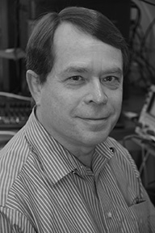

采访: Van Jacobson
===================================

Interview: Van Jacobson

.. tab:: 中文

.. tab:: 英文

Van Jacobson works at Google and was previously a Research Fellow at PARC. Prior to that, he was co-founder and Chief Scientist of Packet Design. Before that, he was Chief Scientist at Cisco. Before joining Cisco, he was head of the Network Research Group at Lawrence Berkeley National Laboratory and taught at UC Berkeley and Stanford. Van received the ACM SIGCOMM Award in 2001 for outstanding lifetime contribution to the field of communication networks and the IEEE Kobayashi Award in 2002 for “contributing to the understanding of network congestion and developing congestion control mechanisms that enabled the successful scaling of the Internet”. He was elected to the U.S. National Academy of Engineering in 2004.

Please describe one or two of the most exciting projects you have worked on during your career. What were the biggest challenges?
----------------------------------------------------------------------------------------------------------------------------------

School teaches us lots of ways to find answers. In every interesting problem I’ve worked on, the challenge has been finding the right question. When Mike Karels and I started looking at TCP congestion, we spent months staring at protocol and packet traces asking “Why is it failing?”. One day in Mike’s office, one of us said “The reason I can’t figure out why it fails is because I don’t understand how it ever worked to begin with.” That turned out to be the right question and it forced us to figure out the “ack clocking” that makes TCP work. After that, the rest was easy.

More generally, where do you see the future of networking and the Internet?
-----------------------------------------------------------------------------

For most people, the Web is the Internet. Networking geeks smile politely since we know the Web is an application running over the Internet but what if they’re right? The Internet is about enabling conversations between pairs of hosts. The Web is about distributed information production and consumption. “Information propagation” is a very general view of communication of which “pairwise conversation” is a tiny subset. We need to move into the larger tent. Networking today deals with broadcast media (radios, PONs, etc.) by pretending it’s a point-to- point wire. That’s massively inefficient. Terabits-per-second of data are being exchanged all over the World via thumb drives or smart phones but we don’t know how to treat that as “networking”. ISPs are busily setting up caches and CDNs to scalably distribute video and audio. Caching is a necessary part of the solution but there’s no part of today’s networking—from Information, Queuing or Traffic Theory down to the Internet protocol specs—that tells us how to engineer and deploy it. I think and hope that over the next few years, networking will evolve to embrace the much larger vision of communication that underlies the Web.

What people inspired you professionally?
------------------------------------------

When I was in grad school, Richard Feynman visited and gave a colloquium. He talked about a piece of Quantum theory that I’d been struggling with all semester and his explanation was so simple and lucid that what had been incomprehensible gibberish to me became obvious and inevitable. That ability to see and convey the simplicity that underlies our complex world seems to me a rare and wonderful gift.

What are your recommendations for students who want careers in computer science and networking?
------------------------------------------------------------------------------------------------

It’s a wonderful field—computers and networking have probably had more impact on society than any invention since the book. Networking is fundamentally about connecting stuff, and studying it helps you make intellectual connections: Ant foraging & Bee dances demonstrate protocol design better than RFCs, traffic jams or people leaving a packed stadium are the essence of congestion, and students finding flights back to school in a post-Thanksgiving blizzard are the core of dynamic routing. If you’re interested in lots of stuff and want to have an impact, it’s hard to imagine a better field.