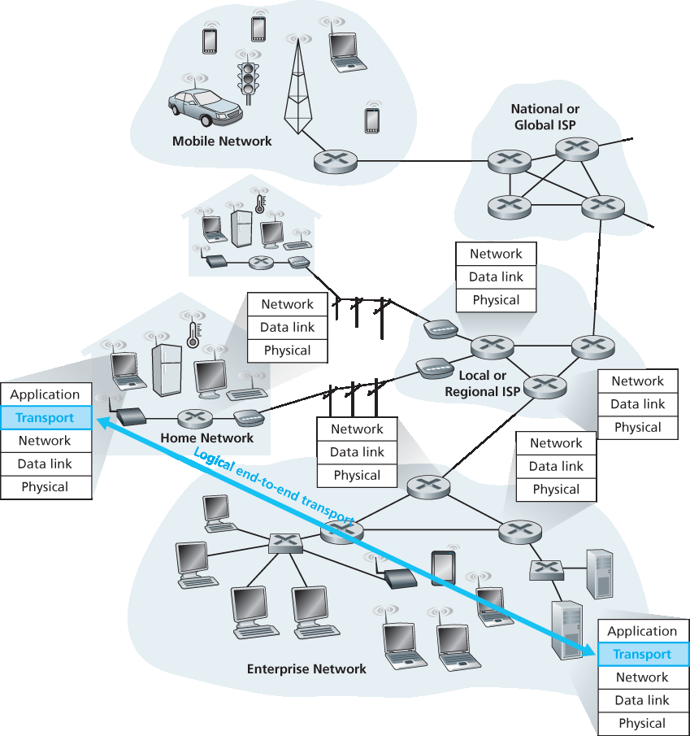

.. _c3.1:

3.1 引言与传输层服务
==================================================
3.1 Introduction and Transport-Layer Services

在前两章中，我们已经接触了传输层的作用及其提供的服务。现在让我们快速回顾一下我们已经学到的关于传输层的内容。

传输层协议为运行在不同主机上的应用进程之间提供 **逻辑通信** 。所谓 *逻辑通信* ，是指从应用的角度来看，就好像运行进程的主机是直接连接的一样；而在现实中，这些主机可能位于地球的两端，通过众多路由器和各种链路类型相互连接。应用进程利用传输层提供的逻辑通信机制彼此发送消息，而无需关注传送这些消息所依赖的物理基础设施的具体细节。:ref:`图 3.1 <Figure 3.1>` 展示了逻辑通信的概念。

如 :ref:`图 3.1 <Figure 3.1>` 所示，传输层协议在端系统中实现，但不在网络路由器中实现。在发送方，传输层将它从发送应用进程收到的应用层消息转换为传输层数据包，在互联网术语中称为传输层 **报文段（segment）** 。这个过程可能会将应用层消息划分为更小的块，并为每个块添加传输层头部，从而生成传输层报文段。传输层随后将报文段传递给发送端系统的网络层，在那里报文段被封装进一个网络层数据包（数据报）并发送至目的地。需要注意的是，网络路由器只对数据报中的网络层字段进行处理；也就是说，它们不会检查封装在数据报中的传输层报文段的字段。在接收方，网络层从数据报中提取传输层报文段，并将其向上传递给传输层。传输层随后处理接收到的报文段，并将其中的数据提供给接收应用进程使用。

网络应用可能可以使用多种传输层协议。例如，互联网提供了两种协议 —— TCP 和 UDP。这两种协议为调用它们的应用提供了不同的传输层服务集。

.. toggle::

    In the previous two chapters we touched on the role of the transport layer and the services that it provides. Let’s quickly review what we have already learned about the transport layer.

    A transport-layer protocol provides for **logical communication** between application processes running on different hosts. By *logical communication*, we mean that from an application’s perspective, it is as if the hosts running the processes were directly connected; in reality, the hosts may be on opposite sides of the planet, connected via numerous routers and a wide range of link types. Application processes use the logical communication provided by the transport layer to send messages to each other, free from the worry of the details of the physical infrastructure used to carry these messages. :ref:`Figure 3.1 <Figure 3.1>` illustrates the notion of logical communication.

    As shown in :ref:`Figure 3.1 <Figure 3.1>`, transport-layer protocols are implemented in the end systems but not in network routers. On the sending side, the transport layer converts the application-layer messages it receives from a sending application process into transport-layer packets, known as transport-layer **segments** in Internet terminology. This is done by (possibly) breaking the application messages into smaller chunks and adding a transport-layer header to each chunk to create the transport-layer segment. The transport layer then passes the segment to the network layer at the sending end system, where the segment is encapsulated within a network-layer packet (a datagram) and sent to the destination. It’s important to note that network routers act only on the network-layer fields of the datagram; that is, they do not examine the fields of the transport-layer segment encapsulated with the datagram. On the receiving side, the network layer extracts the transport-layer segment from the datagram and passes the segment up to the transport layer. The transport layer then processes the received segment, making the data in the segment available to the receiving application.

    More than one transport-layer protocol may be available to network applications. For example, the Internet has two protocols—TCP and UDP. Each of these protocols provides a different set of transport- layer services to the invoking application.

.. _c3.1.1:

3.1.1 传输层与网络层之间的关系
----------------------------------------------------------
3.1.1 Relationship Between Transport and Network Layers

请回忆，传输层在协议栈中位于网络层之上。传输层协议在不同主机上运行的 *进程* 之间提供逻辑通信，而网络层协议在主机之间提供逻辑通信。这个区别虽然微妙，但很重要。让我们用一个家庭类比来说明这个区别。

.. _Figure 3.1:

**图 3.1 传输层在应用进程之间提供逻辑通信而非物理通信**

设想两个房子，一个在东海岸，一个在西海岸，每个房子里都住着一打孩子。东海岸家的孩子是西海岸家孩子的堂兄妹。这些孩子非常喜欢互相写信 —— 每个孩子每周都给每个堂兄妹写信，每封信通过传统邮政服务以单独的信封发送。因此，每周每户都会向另一户发送 144 封信。（如果他们用电子邮件，可以省很多钱！）每户都有一个孩子负责收发邮件 —— 西海岸的 Ann 和东海岸的 Bill。每周，Ann 会拜访她所有的兄弟姐妹，收集信件，并将信交给每天来访的邮差。当信件抵达西海岸的房子时，Ann 也负责将信件分发给她的兄弟姐妹。Bill 在东海岸也有相同的职责。

在这个例子中，邮政服务在两个家庭之间提供逻辑通信 —— 邮政服务将信件从一个房子送到另一个房子，而不是从一个人送到另一个人。而 Ann 和 Bill 在堂兄妹之间提供逻辑通信 —— 他们从兄弟姐妹那里收取信件，并将信件交给兄弟姐妹。从堂兄妹的角度看，Ann 和 Bill 就是邮件服务，尽管他们只是端到端传递过程中的一部分（即端系统部分）。这个家庭类比很好地说明了传输层与网络层之间的关系：

.. code:: text

    应用消息 = 信封中的信件
    进程 = 堂兄妹
    主机（也称为端系统）= 房子
    传输层协议 = Ann 和 Bill
    网络层协议 = 邮政服务（包括邮差）

继续这个类比，注意到 Ann 和 Bill 的所有工作都在各自的家中完成；他们不会参与中间邮件中心的邮件分拣或邮件从一个中心转送到另一个中心。同样，传输层协议存在于端系统中。在端系统中，传输协议将消息从应用进程传送到网络边缘（即网络层），反之亦然，但它不涉及这些消息在网络核心中如何传送。实际上，正如 :ref:`图 3.1 <Figure 3.1>` 所示，中间路由器既不处理也不识别传输层可能添加到应用消息中的任何信息。

继续我们家庭的故事，现在设想当 Ann 和 Bill 去度假时，另一个堂兄妹对 —— 比如 Susan 和 Harvey —— 替代他们来负责家庭内部的邮件收发。不幸的是，Susan 和 Harvey 的收发方式与 Ann 和 Bill 并不完全一样。由于 Susan 和 Harvey 年纪更小，他们收发邮件的频率更低，偶尔还会丢信（有时信件会被家里的狗咬坏）。因此，这对堂兄妹 Susan 和 Harvey 提供的服务（即服务模型）与 Ann 和 Bill 并不相同。类似地，计算机网络可能提供多种传输协议，每种协议为应用提供不同的服务模型。

Ann 和 Bill 所能提供的服务显然受限于邮政服务所能提供的服务。例如，如果邮政服务不能保证两户之间信件投递时间的最大上限（比如三天），那么 Ann 和 Bill 也不可能对堂兄妹之间的邮件投递时间做出任何最大延迟保证。同样地，传输协议所能提供的服务通常受到其下方网络层协议服务模型的约束。如果网络层协议无法对主机之间传输层报文段的延迟或带宽提供保证，那么传输层协议也就无法对进程之间传输的应用消息提供延迟或带宽保证。

尽管如此，即使底层网络协议在网络层不提供相应服务，传输协议仍可以提供某些服务。例如，正如我们将在本章中看到的，即使底层网络协议是不可靠的（即可能丢包、损坏包或重复包），传输协议仍可以为应用提供可靠数据传输服务。再举一个例子（我们将在 :ref:`第 8 章 <c8>` 中讨论网络安全时探讨），传输协议可以使用加密来保证应用消息不被窃听，即使网络层无法保证传输层报文段的保密性。

.. toggle::

    Recall that the transport layer lies just above the network layer in the protocol stack. Whereas a transport-layer protocol provides logical communication between *processes* running on different hosts, a network-layer protocol provides logical-communication between hosts. This distinction is subtle but important. Let’s examine this distinction with the aid of a household analogy.

    .. figure:: ../img/225-0.png 
       :align: center

    **Figure 3.1 The transport layer provides logical rather than physical communication between application processes**

    Consider two houses, one on the East Coast and the other on the West Coast, with each house being home to a dozen kids. The kids in the East Coast household are cousins of the kids in the West Coast household. The kids in the two households love to write to each other—each kid writes each cousin every week, with each letter delivered by the traditional postal service in a separate envelope. Thus, each household sends 144 letters to the other household every week. (These kids would save a lot of money if they had e-mail!) In each of the households there is one kid—Ann in the West Coast house and Bill in the East Coast house—responsible for mail collection and mail distribution. Each week Ann visits all her brothers and sisters, collects the mail, and gives the mail to a postal-service mail carrier, who makes daily visits to the house. When letters arrive at the West Coast house, Ann also has the job of distributing the mail to her brothers and sisters. Bill has a similar job on the East Coast.

    In this example, the postal service provides logical communication between the two houses—the postal service moves mail from house to house, not from person to person. On the other hand, Ann and Bill provide logical communication among the cousins—Ann and Bill pick up mail from, and deliver mail to,
    their brothers and sisters. Note that from the cousins’ perspective, Ann and Bill are the mail service, even though Ann and Bill are only a part (the end-system part) of the end-to-end delivery process. This household example serves as a nice analogy for explaining how the transport layer relates to the network layer:

    .. code:: text 

        application messages = letters in envelopes
        processes = cousins
        hosts (also called end systems) = houses
        transport-layer protocol = Ann and Bill
        network-layer protocol = postal service (including mail carriers)

    Continuing with this analogy, note that Ann and Bill do all their work within their respective homes; they are not involved, for example, in sorting mail in any intermediate mail center or in moving mail from one mail center to another. Similarly, transport-layer protocols live in the end systems. Within an end system, a transport protocol moves messages from application processes to the network edge (that is, the network layer) and vice versa, but it doesn’t have any say about how the messages are moved within the network core. In fact, as illustrated in :ref:`Figure 3.1 <Figure 3.1>`, intermediate routers neither act on, nor recognize, any information that the transport layer may have added to the application messages.

    Continuing with our family saga, suppose now that when Ann and Bill go on vacation, another cousin pair—say, Susan and Harvey—substitute for them and provide the household-internal collection and delivery of mail. Unfortunately for the two families, Susan and Harvey do not do the collection and delivery in exactly the same way as Ann and Bill. Being younger kids, Susan and Harvey pick up and drop off the mail less frequently and occasionally lose letters (which are sometimes chewed up by the family dog). Thus, the cousin-pair Susan and Harvey do not provide the same set of services (that is, the same service model) as Ann and Bill. In an analogous manner, a computer network may make available multiple transport protocols, with each protocol offering a different service model to applications.

    The possible services that Ann and Bill can provide are clearly constrained by the possible services that the postal service provides. For example, if the postal service doesn’t provide a maximum bound on how long it can take to deliver mail between the two houses (for example, three days), then there is no way that Ann and Bill can guarantee a maximum delay for mail delivery between any of the cousin pairs. In a similar manner, the services that a transport protocol can provide are often constrained by the service model of the underlying network-layer protocol. If the network-layer protocol cannot provide delay or bandwidth guarantees for transport-layer segments sent between hosts, then the transport-layer protocol cannot provide delay or bandwidth guarantees for application messages sent between processes.

    Nevertheless, certain services can be offered by a transport protocol even when the underlying network protocol doesn’t offer the corresponding service at the network layer. For example, as we’ll see in this chapter, a transport protocol can offer reliable data transfer service to an application even when the underlying network protocol is unreliable, that is, even when the network protocol loses, garbles, or duplicates packets. As another example (which we’ll explore in :ref:`Chapter 8 <c8>` when we discuss network security), a transport protocol can use encryption to guarantee that application messages are not read by intruders, even when the network layer cannot guarantee the confidentiality of transport-layer segments.

.. _c3.1.2:

3.1.2 互联网中传输层概述
------------------------------------------------------------------------------------
3.1.2 Overview of the Transport Layer in the Internet

回顾一下，互联网向应用层提供了两种不同的传输层协议。其中之一是 **UDP** （用户数据报协议），它为调用的应用程序提供不可靠的、无连接的服务。第二种协议是 **TCP** （传输控制协议），它为调用的应用程序提供可靠的、面向连接的服务。在设计网络应用程序时，应用开发者必须指定其中一个传输协议。正如我们在 :ref:`第 2.7 节 <c2.7>` 中看到的，应用开发者在创建套接字时选择使用 UDP 还是 TCP。

为简化术语，我们将传输层数据包称为报文段（segment）。但需要提及的是，互联网文献（例如 RFC）中通常也将 TCP 的传输层数据包称为 segment，而 UDP 的数据包则常被称为 datagram。不过这些互联网文献同样使用 *datagram* 一词来指代网络层的数据包！对于像本书这样面向初学者的计算机网络教材，我们认为将 TCP 和 UDP 的数据包都称为 segment 更不易引起混淆，并将 *datagram* 一词保留用于表示网络层的数据包。

在继续简要介绍 UDP 和 TCP 之前，我们有必要先简要了解一下互联网的网络层。（我们将在 :ref:`第 4 章 <c4>` 和 :ref:`第 5 章 <c5>` 中详细学习网络层。）互联网的网络层协议有一个名字 —— IP，即 Internet Protocol（互联网协议）。IP 提供主机之间的逻辑通信。IP 的服务模型是一种 **尽力而为的传输服务**。这意味着 IP 尽最大努力在通信主机之间传送报文段，但不做任何保证。特别地，它不保证报文段的投递，不保证报文段的有序投递，也不保证报文段中数据的完整性。因此，IP 被称为一种 **不可靠的服务**。我们还需要指出，每台主机至少拥有一个网络层地址，即所谓的 IP 地址。我们将在 :ref:`第 4 章 <c4>` 中详细研究 IP 地址；在本章中，只需记住 *每台主机都有一个 IP 地址* 即可。

在了解了 IP 的服务模型后，现在让我们总结一下 UDP 和 TCP 提供的服务模型。UDP 和 TCP 最基本的职责是将 IP 在两个端系统之间的传输服务扩展为在端系统上运行的两个进程之间的传输服务。将主机到主机的传输扩展为进程到进程的传输称为 **传输层复用** 与 **解复用**。我们将在下一节中讨论传输层的复用与解复用机制。UDP 和 TCP 还通过在其报文段的首部中包含错误检测字段来提供完整性校验服务。这两项最基本的传输层服务 —— 进程到进程的数据传输和错误检测 —— 是 UDP 提供的唯一服务！特别地，像 IP 一样，UDP 是一种不可靠的服务 —— 它不保证某个进程发送的数据会完整（或一定）到达目标进程。我们将在 :ref:`第 3.3 节 <c3.3>` 中详细讨论 UDP。

另一方面，TCP 向应用提供了几种额外的服务。首先也是最重要的，它提供 **可靠数据传输**。通过使用流量控制、序列号、确认和定时器（这些机制将在本章详细讨论），TCP 确保数据能够从发送进程正确且有序地传递到接收进程。这样，TCP 将 IP 在端系统之间的不可靠服务转换为进程之间的可靠数据传输服务。TCP 还提供 **拥塞控制**。拥塞控制不是为调用应用程序提供的服务，而是为整个互联网提供的服务，是一种“公共利益”服务。粗略地说，TCP 拥塞控制防止某个 TCP 连接用过量的流量淹没通信主机之间的链路和路由器。TCP 力求为穿越拥塞链路的每个连接分配相等的链路带宽。这是通过调控 TCP 连接发送端发送数据进入网络的速率来实现的。而 UDP 流量则是不受控制的。使用 UDP 传输的应用程序可以随意、任意时间以任意速率发送数据。

一个提供可靠数据传输和拥塞控制的协议必然会比较复杂。我们需要多个小节来介绍可靠数据传输和拥塞控制的原理，还需额外的小节专门介绍 TCP 协议本身。这些内容将在 :ref:`第 3.4 节 <c3.4>` 至 :ref:`第 3.8 节 <c3.8>` 中讨论。本章的安排方式是交替讲解基本原理和 TCP 协议。例如，我们会先讨论一般场景下的可靠数据传输，然后再讲解 TCP 是如何实现可靠数据传输的。类似地，我们也会先讨论一般场景下的拥塞控制，然后再讲解 TCP 如何执行拥塞控制。但在进入这些精彩内容之前，我们将首先了解传输层的复用与解复用机制。

.. toggle::

    Recall that the Internet makes two distinct transport-layer protocols available to the application layer. One of these protocols is **UDP** (User Datagram Protocol), which provides an unreliable, connectionless service to the invoking application. The second of these protocols is **TCP** (Transmission Control Protocol), which provides a reliable, connection-oriented service to the invoking application. When designing a network application, the application developer must specify one of these two transport protocols. As we saw in :ref:`Section 2.7 <c2.7>`, the application developer selects between UDP and TCP when creating sockets.

    To simplify terminology, we refer to the transport-layer packet as a segment. We mention, however, that the Internet literature (for example, the RFCs) also refers to the transport-layer packet for TCP as a segment but often refers to the packet for UDP as a datagram. But this same Internet literature also uses the term *datagram* for the network-layer packet! For an introductory book on computer networking such as this, we believe that it is less confusing to refer to both TCP and UDP packets as segments, and reserve the term *datagram* for the network-layer packet.

    Before proceeding with our brief introduction of UDP and TCP, it will be useful to say a few words about the Internet’s network layer. (We’ll learn about the network layer in detail in :ref:`Chapters 4 <c4>` and :ref:`5 <c5>`.) The Internet’s network-layer protocol has a name—IP, for Internet Protocol. IP provides logical communication between hosts. The IP service model is a **best-effort delivery service**. This means that IP makes its “best effort” to deliver segments between communicating hosts, but it makes no guarantees. In particular, it does not guarantee segment delivery, it does not guarantee orderly delivery of segments, and it does not guarantee the integrity of the data in the segments. For these reasons, IP is said to be an **unreliable service**. We also mention here that every host has at least one network- layer address, a so-called IP address. We’ll examine IP addressing in detail in :ref:`Chapter 4 <c4>`; for this chapter we need only keep in mind that *each host has an IP address*.

    Having taken a glimpse at the IP service model, let’s now summarize the service models provided by UDP and TCP. The most fundamental responsibility of UDP and TCP is to extend IP’s delivery service between two end systems to a delivery service between two processes running on the end systems. Extending host-to-host delivery to process-to-process delivery is called **transport-layer multiplexing** and **demultiplexing**. We’ll discuss transport-layer multiplexing and demultiplexing in the next section. UDP and TCP also provide integrity checking by including error-detection fields in their segments’ headers. These two minimal transport-layer services—process-to-process data delivery and error checking—are the only two services that UDP provides! In particular, like IP, UDP is an unreliable service—it does not guarantee that data sent by one process will arrive intact (or at all!) to the destination process. UDP is discussed in detail in :ref:`Section 3.3 <c3.3>`.

    TCP, on the other hand, offers several additional services to applications. First and foremost, it provides **reliable data transfer**. Using flow control, sequence numbers, acknowledgments, and timers (techniques we’ll explore in detail in this chapter), TCP ensures that data is delivered from sending process to receiving process, correctly and in order. TCP thus converts IP’s unreliable service between end systems into a reliable data transport service between processes. TCP also provides **congestion control**. Congestion control is not so much a service provided to the invoking application as it is a service for the Internet as a whole, a service for the general good. Loosely speaking, TCP congestion control prevents any one TCP connection from swamping the links and routers between communicating hosts with an excessive amount of traffic. TCP strives to give each connection traversing a congested link an equal share of the link bandwidth. This is done by regulating the rate at which the sending sides of TCP connections can send traffic into the network. UDP traffic, on the other hand, is unregulated. An application using UDP transport can send at any rate it pleases, for as long as it pleases.

    A protocol that provides reliable data transfer and congestion control is necessarily complex. We’ll need several sections to cover the principles of reliable data transfer and congestion control, and additional sections to cover the TCP protocol itself. These topics are investigated in :ref:`Sections 3.4 <c3.4>` through :ref:`3.8 <c3.8>`. The approach taken in this chapter is to alternate between basic principles and the TCP protocol. For example, we’ll first discuss reliable data transfer in a general setting and then discuss how TCP specifically provides reliable data transfer. Similarly, we’ll first discuss congestion control in a general setting and then discuss how TCP performs congestion control. But before getting into all this good stuff, let’s first look at transport-layer multiplexing and demultiplexing.