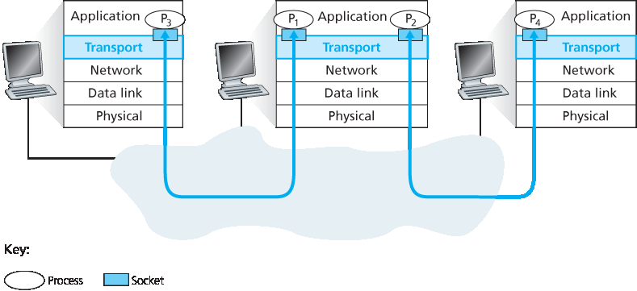
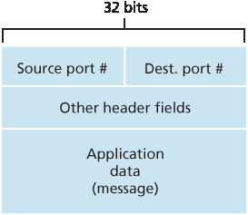
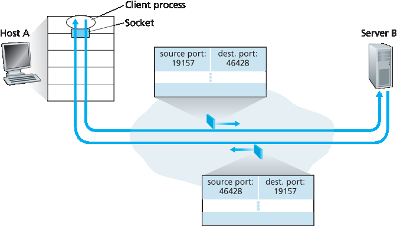
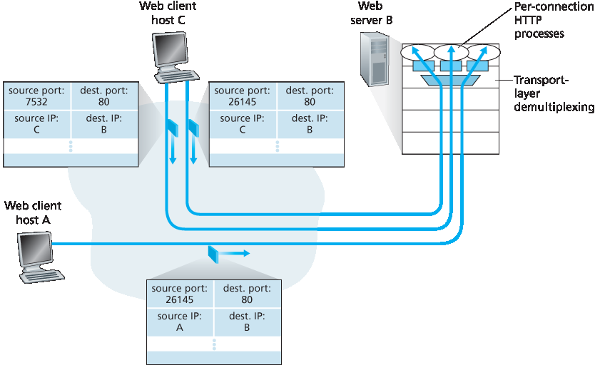

.. _c3.2:

3.2 多路复用和解复用
==================================================
3.2 Multiplexing and Demultiplexing

.. tab:: 中文

.. tab:: 英文

In this section, we discuss transport-layer multiplexing and demultiplexing, that is, extending the host-to- host delivery service provided by the network layer to a process-to-process delivery service for applications running on the hosts. In order to keep the discussion concrete, we’ll discuss this basic transport-layer service in the context of the Internet. We emphasize, however, that a multiplexing/demultiplexing service is needed for all computer networks.

At the destination host, the transport layer receives segments from the network layer just below. The transport layer has the responsibility of delivering the data in these segments to the appropriate application process running in the host. Let’s take a look at an example. Suppose you are sitting in front of your computer, and you are downloading Web pages while running one FTP session and two Telnet sessions. You therefore have four network application processes running—two Telnet processes, one FTP process, and one HTTP process. When the transport layer in your computer receives data from the network layer below, it needs to direct the received data to one of these four processes. Let’s now examine how this is done.

First recall from :ref:`Section 2.7 <c2.7>` that a process (as part of a network application) can have one or more **sockets**, doors through which data passes from the network to the process and through which data
passes from the process to the network. Thus, as shown in :ref:`Figure 3.2 <Figure 3.2>`, the transport layer in the receiving host does not actually deliver data directly to a process, but instead to an intermediary socket.
Because at any given time there can be more than one socket in the receiving host, each socket has a unique identifier. The format of the identifier depends on whether the socket is a UDP or a TCP socket, as we’ll discuss shortly.

Now let’s consider how a receiving host directs an incoming transport-layer segment to the appropriate socket. Each transport-layer segment has a set of fields in the segment for this purpose. At the receiving end, the transport layer examines these fields to identify the receiving socket and then directs the segment to that socket. This job of delivering the data in a transport-layer segment to the correct socket is called **demultiplexing**. The job of gathering data chunks at the source host from different sockets, encapsulating each data chunk with header information (that will later be used in demultiplexing) to create segments, and passing the segments to the network layer is called **multiplexing**. Note that the transport layer in the middle host in :ref:`Figure 3.2 <Figure 3.2>` must demultiplex segments arriving from the network layer below to either process :math:`P_1` or :math:`P_2` above; this is done by directing the arriving segment’s data to the corresponding process’s socket. The transport layer in the middle host must also gather outgoing data from these sockets, form transport- layer segments, and pass these segments down to the network layer. Although we have introduced multiplexing and demultiplexing in the context of the Internet transport protocols, it’s important to realize that they are concerns whenever a single protocol at one layer (at the transport layer or elsewhere) is used by multiple protocols at the next higher layer.

.. _Figure 3.2:

**Figure 3.2 Transport-layer multiplexing and demultiplexing**

To illustrate the demultiplexing job, recall the household analogy in the previous section. Each of the kids is identified by his or her name. When Bill receives a batch of mail from the mail carrier, he performs a demultiplexing operation by observing to whom the letters are addressed and then hand delivering the mail to his brothers and sisters. Ann performs a multiplexing operation when she collects letters from her brothers and sisters and gives the collected mail to the mail person.

Now that we understand the roles of transport-layer multiplexing and demultiplexing, let us examine how it is actually done in a host. From the discussion above, we know that transport-layer multiplexing requires (1) that sockets have unique identifiers, and (2) that each segment have special fields that indicate the socket to which the segment is to be delivered. These special fields, illustrated in :ref:`Figure 3.3 <Figure 3.3>`, are the **source port number field** and the **destination port number field**. (The UDP and TCP segments have other fields as well, as discussed in the subsequent sections of this chapter.) Each port number is a 16-bit number, ranging from 0 to 65535. The port numbers ranging from 0 to 1023 are called **well-known port numbers** and are restricted, which means that they are reserved for use by well-known application protocols such as HTTP (which uses port number 80) and FTP (which uses port number 21). The list of well-known port numbers is given in RFC 1700 and is updated at http://www.iana.org :ref:`[RFC 3232] <RFC 3232>`. When we develop a new application (such as the simple application developed in :ref:`Section 2.7 <c2.7>`), we must assign the application a port number.

.. _Figure 3.3:

**Figure 3.3 Source and destination port-number fields in a transport-layer segment**

It should now be clear how the transport layer *could* implement the demultiplexing service: Each socket in the host could be assigned a port number, and when a segment arrives at the host, the transport layer
examines the destination port number in the segment and directs the segment to the corresponding socket. The segment’s data then passes through the socket into the attached process. As we’ll see, this is basically how UDP does it. However, we’ll also see that multiplexing/demultiplexing in TCP is yet more subtle.

Connectionless Multiplexing and Demultiplexing
~~~~~~~~~~~~~~~~~~~~~~~~~~~~~~~~~~~~~~~~~~~~~~~~

Recall from :ref:`Section 2.7.1 <c2.7.1>` that the Python program running in a host can create a UDP socket with the line

.. code:: 

    clientSocket = socket(AF_INET, SOCK_DGRAM)

When a UDP socket is created in this manner, the transport layer automatically assigns a port number to the socket. In particular, the transport layer assigns a port number in the range 1024 to 65535 that is currently not being used by any other UDP port in the host. Alternatively, we can add a line into our Python program after we create the socket to associate a specific port number (say, 19157) to this UDP socket via the socket **bind()** method:

.. code::

    clientSocket.bind(('', 19157))

If the application developer writing the code were implementing the server side of a “well-known protocol,” then the developer would have to assign the corresponding well-known port number. Typically, the client side of the application lets the transport layer automatically (and transparently) assign the port number, whereas the server side of the application assigns a specific port number.

With port numbers assigned to UDP sockets, we can now precisely describe UDP multiplexing/demultiplexing. Suppose a process in Host A, with UDP port 19157, wants to send a chunk of application data to a process with UDP port 46428 in Host B. The transport layer in Host A creates a transport-layer segment that includes the application data, the source port number (19157), the destination port number (46428), and two other values (which will be discussed later, but are unimportant for the current discussion). The transport layer then passes the resulting segment to the network layer. The network layer encapsulates the segment in an IP datagram and makes a best-effort attempt to deliver the segment to the receiving host. If the segment arrives at the receiving Host B, the transport layer at the receiving host examines the destination port number in the segment (46428) and delivers the segment to its socket identified by port 46428. Note that Host B could be running multiple processes, each with its own UDP socket and associated port number. As UDP segments arrive from the network, Host B directs (demultiplexes) each segment to the appropriate socket by examining the segment’s destination port number.

It is important to note that a UDP socket is fully identified by a two-tuple consisting of a destination IP address and a destination port number. As a consequence, if two UDP segments have different source IP addresses and/or source port numbers, but have the same destination IP address and destination port number, then the two segments will be directed to the same destination process via the same destination socket.

You may be wondering now, what is the purpose of the source port number? As shown in :ref:`Figure 3.4 <Figure 3.4>`, in the A-to-B segment the source port number serves as part of a “return address”—when B wants to send a segment back to A, the destination port in the B-to-A segment will take its value from the source port value of the A-to-B segment. (The complete return address is A’s IP address and the source port number.) As an example, recall the UDP server program studied in :ref:`Section 2.7 <c2.7>`. In **UDPServer.py**, the server uses the **recvfrom()** method to extract the client-side (source) port number from the segment it receives from the client; it then sends a new segment to the client, with the extracted source port number serving as the destination port number in this new segment.

Connection-Oriented Multiplexing and Demultiplexing
~~~~~~~~~~~~~~~~~~~~~~~~~~~~~~~~~~~~~~~~~~~~~~~~~~~~~~~~

In order to understand TCP demultiplexing, we have to take a close look at TCP sockets and TCP connection establishment. One subtle difference between a TCP socket and a UDP socket is that a TCP socket is identified by a four-tuple: (source IP address, source port number, destination IP address, destination port number). Thus, when a TCP segment arrives from the network to a host, the host uses all four values to direct (demultiplex) the segment to the appropriate socket.

.. _Figure 3.4:

**Figure 3.4 The inversion of source and destination port numbers**

In particular, and in contrast with UDP, two arriving TCP segments with different source IP addresses or source port numbers will (with the exception of a TCP segment carrying the original connection- establishment request) be directed to two different sockets. To gain further insight, let’s reconsider the
TCP client-server programming example in :ref:`Section 2.7.2 <c2.7.2>`:

- The TCP server application has a “welcoming socket,” that waits for connection-establishment requests from TCP clients (see :ref:`Figure 2.29 <Figure 2.29>`) on port number 12000.
- The TCP client creates a socket and sends a connection establishment request segment with the lines:

  .. code::

    clientSocket = socket(AF_INET, SOCK_STREAM)
    clientSocket.connect((serverName,12000))

- A connection-establishment request is nothing more than a TCP segment with destination port number 12000 and a special connection-establishment bit set in the TCP header (discussed in :ref:`Section 3.5 <c3.5>`). The segment also includes a source port number that was chosen by the client. 
- When the host operating system of the computer running the server process receives the incoming connection-request segment with destination port 12000, it locates the server process that is waiting to accept a connection on port number 12000. The server process then creates a new socket:

  .. code::

    connectionSocket, addr = serverSocket.accept()

- Also, the transport layer at the server notes the following four values in the connection-request segment: (1) the source port number in the segment, (2) the IP address of the source host, (3) the destination port number in the segment, and (4) its own IP address. The newly created connection socket is identified by these four values; all subsequently arriving segments whose source port, source IP address, destination port, and destination IP address match these four values will be demultiplexed to this socket. With the TCP connection now in place, the client and server can now send data to each other.

The server host may support many simultaneous TCP connection sockets, with each socket attached to a process, and with each socket identified by its own four-tuple. When a TCP segment arrives at the host, all four fields (source IP address, source port, destination IP address, destination port) are used to direct (demultiplex) the segment to the appropriate socket.

.. admonition:: FOCUS ON SECURITY

    Port Scanning

    We’ve seen that a server process waits patiently on an open port for contact by a remote client. Some ports are reserved for well-known applications (e.g., Web, FTP, DNS, and SMTP servers); other ports are used by convention by popular applications (e.g., the Microsoft 2000 SQL server listens for requests on UDP port 1434). Thus, if we determine that a port is open on a host, we may be able to map that port to a specific application running on the host. This is very useful for system administrators, who are often interested in knowing which network applications are running on the hosts in their networks. But attackers, in order to “case the joint,” also want to know which ports are open on target hosts. If a host is found to be running an application with a known security flaw (e.g., a SQL server listening on port 1434 was subject to a buffer overflow, allowing a remote user to execute arbitrary code on the vulnerable host, a flaw exploited by the Slammer worm :ref:`[CERT 2003–04] <CERT 2003–04>`), then that host is ripe for attack.
    
    Determining which applications are listening on which ports is a relatively easy task. Indeed there are a number of public domain programs, called port scanners, that do just that. Perhaps the most widely used of these is nmap, freely available at http://nmap.org and included in most Linux distributions. For TCP, nmap sequentially scans ports, looking for ports that are accepting TCP connections. For UDP, nmap again sequentially scans ports, looking for UDP ports that respond to transmitted UDP segments. In both cases, nmap returns a list of open, closed, or unreachable ports. A host running nmap can attempt to scan any target host *anywhere* in the Internet. We’ll revisit nmap in :ref:`Section 3.5.6 <c3.5.6>`, when we discuss TCP connection management.

.. _Figure 3.5:

**Figure 3.5 Two clients, using the same destination port number (80) to communicate with the same Web server application**

The situation is illustrated in :ref:`Figure 3.5 <Figure 3.5>`, in which Host C initiates two HTTP sessions to server B, and Host A initiates one HTTP session to B. Hosts A and C and server B each have their own unique IP address—A, C, and B, respectively. Host C assigns two different source port numbers (26145 and 7532) to its two HTTP connections. Because Host A is choosing source port numbers independently of C, it might also assign a source port of 26145 to its HTTP connection. But this is not a problem—server B will still be able to correctly demultiplex the two connections having the same source port number, since the two connections have different source IP addresses.

Web Servers and TCP
~~~~~~~~~~~~~~~~~~~~~

Before closing this discussion, it’s instructive to say a few additional words about Web servers and how they use port numbers. Consider a host running a Web server, such as an Apache Web server, on port 80. When clients (for example, browsers) send segments to the server, all segments will have destination port 80. In particular, both the initial connection-establishment segments and the segments carrying HTTP request messages will have destination port 80. As we have just described, the server distinguishes the segments from the different clients using source IP addresses and source port numbers.

:ref:`Figure 3.5 <Figure 3.5>` shows a Web server that spawns a new process for each connection. As shown in :ref:`Figure 3.5 <Figure 3.5>`, each of these processes has its own connection socket through which HTTP requests arrive and HTTP responses are sent. We mention, however, that there is not always a one-to-one correspondence between connection sockets and processes. In fact, today’s high-performing Web servers often use only one process, and create a new thread with a new connection socket for each new client connection. (A thread can be viewed as a lightweight subprocess.) If you did the first programming assignment in :ref:`Chapter 2 <c2>`, you built a Web server that does just this. For such a server, at any given time there may be many connection sockets (with different identifiers) attached to the same process.

If the client and server are using persistent HTTP, then throughout the duration of the persistent connection the client and server exchange HTTP messages via the same server socket. However, if the client and server use non-persistent HTTP, then a new TCP connection is created and closed for every request/response, and hence a new socket is created and later closed for every request/response. This frequent creating and closing of sockets can severely impact the performance of a busy Web server (although a number of operating system tricks can be used to mitigate the problem). Readers interested in the operating system issues surrounding persistent and non-persistent HTTP are encouraged to see [ :ref:`Nielsen 1997 <Nielsen 1997>`; :ref:`Nahum 2002 <Nahum 2002>`].

Now that we’ve discussed transport-layer multiplexing and demultiplexing, let’s move on and discuss one of the Internet’s transport protocols, UDP. In the next section we’ll see that UDP adds little more to the network-layer protocol than a multiplexing/demultiplexing service.