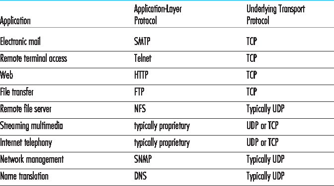
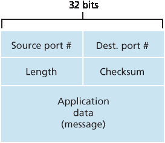

.. _c3.3:

3.3 无连接传输：UDP
==================================================
3.3 Connectionless Transport: UDP

在本节中，我们将深入了解 UDP 的工作方式及其功能。我们鼓励你回顾 :ref:`第 2.1 节 <c2.1>`，其中概述了 UDP 服务模型；还可参考 :ref:`第 2.7.1 节 <c2.7.1>`，其中讨论了使用 UDP 的套接字编程。

为了激发我们对 UDP 的讨论，假设你希望设计一个不加修饰、极简的传输协议。你会如何着手？你可能首先会考虑使用一个空洞的传输协议。特别地，在发送端，你可能会考虑将来自应用进程的消息直接传递给网络层；在接收端，你可能会考虑将从网络层接收到的消息直接传递给应用进程。但正如我们在前一节中了解到的，我们必须比什么都不做稍微做得多一些！至少，传输层必须提供一个复用/解复用服务，以便在网络层和正确的应用层进程之间传递数据。

UDP（定义见 :ref:`[RFC 768] <RFC 768>`）正是一个传输协议所能做的最少功能之一。除了复用/解复用功能和一些简单的错误检查外，它没有对 IP 增加任何内容。事实上，如果应用程序开发者选择使用 UDP 而非 TCP，那么该应用程序几乎是直接与 IP 通信的。UDP 从应用进程获取消息，附加用于复用/解复用的源端口号和目的端口号字段，增加另外两个小字段，然后将所得报文段传递给网络层。网络层将该传输层报文段封装成一个 IP 数据报，并尽最大努力将其传递给接收主机。如果该报文段成功到达接收主机，UDP 使用目的端口号将该报文段中的数据传递给正确的应用进程。注意，使用 UDP 时，在发送和接收方的传输层实体之间并不存在握手过程。因此，UDP 被称为 *无连接*（connectionless）的。

DNS 是一个通常使用 UDP 的应用层协议的例子。当主机中的 DNS 应用希望发起一个查询时，它构造一个 DNS 查询消息并将其传递给 UDP。无需与目标端系统上的 UDP 实体进行任何握手，主机端的 UDP 为该消息添加首部字段，然后将所得报文段传递给网络层。网络层将该 UDP 报文段封装到一个数据报中，并将其发送到一个名称服务器。发起查询的主机上的 DNS 应用随后等待查询的应答。如果没有收到应答（可能是因为底层网络丢失了查询或应答），它可能会尝试重新发送查询、尝试向另一个名称服务器发送查询，或通知调用该应用的进程无法获得应答。

你可能会好奇，为什么应用程序开发者会选择基于 UDP 构建应用程序，而不是使用 TCP。TCP 提供可靠的数据传输服务，而 UDP 不提供，那为什么不是总是更倾向于 TCP 呢？答案是否定的，某些应用程序更适合使用 UDP，原因如下：

- **更精细地控制何时以及发送什么数据（由应用层决定）**。在 UDP 中，一旦应用进程将数据传递给 UDP，UDP 就会立即将数据打包到 UDP 报文段中，并立即将其传递给网络层。而 TCP 则具有拥塞控制机制，当源和目的主机之间的一条或多条链路过度拥塞时，它会限制传输层 TCP 发送方的发送速率。TCP 还会不断地重新发送某个报文段，直到接收到来自目的端的确认，无论可靠传输需要多长时间。由于实时应用程序通常需要一个最小的发送速率，不希望因传输延迟过高而延误报文段的发送，并且能够容忍一定的数据丢失，因此 TCP 的服务模型并不特别适合这些应用的需求。正如下文所述，这些应用可以使用 UDP，并在应用程序中实现所需的额外功能，以补足 UDP 简单的数据段传输服务。
- **无需连接建立**。正如我们稍后会讨论的，TCP 在开始传输数据之前需要进行三次握手。UDP 则可以在无需任何形式准备的情况下直接发送。因此，UDP 不会引入任何连接建立延迟。这可能是 DNS 使用 UDP 而不是 TCP 的主要原因——如果 DNS 运行在 TCP 上，速度将会变得很慢。HTTP 使用 TCP 而不是 UDP，因为对 Web 页面中的文本来说，可靠性至关重要。但正如我们在 :ref:`第 2.2 节 <c2.2>` 中简要讨论的，HTTP 中的 TCP 连接建立延迟是造成下载 Web 文档总延迟的重要因素。事实上，QUIC 协议（Quick UDP Internet Connection，:ref:`[Iyengar 2015] <Iyengar 2015>`），在 Google 的 Chrome 浏览器中使用，以 UDP 作为其底层传输协议，并在其上层的应用协议中实现可靠性。
- **无需连接状态**。TCP 在端系统中维护连接状态。这些连接状态包括接收和发送缓冲区、拥塞控制参数，以及序列号与确认号参数。我们将在 :ref:`第 3.5 节 <c3.5>` 中看到，这些状态信息对于实现 TCP 的可靠数据传输服务和提供拥塞控制是必要的。而 UDP 不维护连接状态，也不跟踪任何这些参数。因此，对于一个特定应用的服务器来说，当该应用基于 UDP 而非 TCP 运行时，通常可以支持更多的活跃客户端。
- **更小的分组首部开销**。TCP 报文段的首部开销为 20 字节，而 UDP 的仅为 8 字节。

:ref:`图 3.6 <Figure 3.6>` 列出了流行的 Internet 应用程序及其使用的传输协议。如我们所预期的那样，电子邮件、远程终端访问、Web 和文件传输运行在 TCP 之上——这些应用都需要 TCP 所提供的可靠数据传输服务。然而，许多重要应用程序则运行在 UDP 之上。例如，UDP 被用于传输网络管理（SNMP，详见 :ref:`第 5.7 节 <c5.7>`）数据。在这种情形下更倾向于使用 UDP 而不是 TCP，因为网络管理应用程序通常必须在网络处于高负荷状态下运行——恰恰是此时可靠的、受拥塞控制的数据传输最难实现。此外，如前所述，DNS 运行于 UDP 之上，从而避免了 TCP 的连接建立延迟。

如 :ref:`图 3.6 <Figure 3.6>` 所示，今天的多媒体应用（如互联网电话、实时视频会议和存储音视频的流式传输）有时也使用 UDP，有时使用 TCP。我们将在 :ref:`第 9 章 <c9>` 中对这些应用进行深入探讨。我们在此仅提及，这些应用都可以容忍少量的数据包丢失，因此可靠数据传输对应用程序的成功并非绝对关键。此外，实时应用（如互联网电话和视频会议）对 TCP 的拥塞控制机制反应非常差。因此，多媒体应用的开发者可能选择基于 UDP 而非 TCP 来运行他们的应用程序。当丢包率较低时，再加上一些组织出于安全考虑屏蔽 UDP 流量（见 :ref:`第 8 章 <c8>`），TCP 就越来越成为流媒体传输的有吸引力的协议。

.. _Figure 3.6:

**图 3.6 流行的 Internet 应用程序及其所使用的传输协议**

尽管今天这种做法很常见，将多媒体应用程序运行在 UDP 上仍然存在争议。如前所述，UDP 不具有拥塞控制机制。但拥塞控制对于防止网络进入拥塞状态至关重要——在那种状态下，几乎没有任何有效工作能够完成。如果所有人都开始不加控制地使用 UDP 传输高比特率视频，路由器将出现大量数据包溢出，几乎没有 UDP 数据包能成功穿越源到目的主机的路径。此外，UDP 发送方的不受控制的高丢包率将导致 TCP 发送方（如我们将看到的，在出现拥塞时它们会降低发送速率）大幅降低发送速率。因此，UDP 缺乏拥塞控制可能会导致 UDP 发送方与接收方之间的高丢包率，并排挤 TCP 会话——这可能是一个严重问题 :ref:`[Floyd 1999] <Floyd 1999>`。许多研究人员提出了新机制来强制所有源（包括 UDP 源）执行自适应拥塞控制 [ :ref:`Mahdavi 1997 <Mahdavi 1997>` ; :ref:`Floyd 2000 <Floyd 2000>`; :ref:`Kohler 2006 <Kohler 2006>` : :rfc:`4340`]。

在讨论 UDP 报文段结构之前，我们需要指出，应用程序在使用 UDP 时也可以实现可靠的数据传输。如果可靠性内建于应用程序中（例如，通过添加确认和重传机制，类似于我们将在下一节中研究的机制），这就可以实现。我们之前提到，QUIC 协议 :ref:`[Iyengar 2015] <Iyengar 2015>` （用于 Google Chrome 浏览器）在 UDP 之上的应用层协议中实现了可靠性。但这不是一项简单任务，可能会让应用开发者长时间忙于调试。尽管如此，直接在应用程序中实现可靠性，使得应用程序可以“既吃蛋糕又保留蛋糕”。也就是说，应用进程可以可靠通信，同时不受 TCP 拥塞控制机制所带来的传输速率限制。

.. toggle::

    In this section, we’ll take a close look at UDP, how it works, and what it does. We encourage you to refer back to :ref:`Section 2.1 <c2.1>`, which includes an overview of the UDP service model, and to :ref:`Section 2.7.1 <c2.7.1>`, which discusses socket programming using UDP.

    To motivate our discussion about UDP, suppose you were interested in designing a no-frills, bare-bones transport protocol. How might you go about doing this? You might first consider using a vacuous transport protocol. In particular, on the sending side, you might consider taking the messages from the application process and passing them directly to the network layer; and on the receiving side, you might consider taking the messages arriving from the network layer and passing them directly to the application process. But as we learned in the previous section, we have to do a little more than nothing! At the very least, the transport layer has to provide a multiplexing/demultiplexing service in order to pass data between the network layer and the correct application-level process.

    UDP, defined in :ref:`[RFC 768] <RFC 768>`, does just about as little as a transport protocol can do. Aside from the multiplexing/demultiplexing function and some light error checking, it adds nothing to IP. In fact, if the application developer chooses UDP instead of TCP, then the application is almost directly talking with IP. UDP takes messages from the application process, attaches source and destination port number fields for the multiplexing/demultiplexing service, adds two other small fields, and passes the resulting segment to the network layer. The network layer encapsulates the transport-layer segment into an IP datagram and then makes a best-effort attempt to deliver the segment to the receiving host. If the segment arrives at the receiving host, UDP uses the destination port number to deliver the segment’s data to the correct application process. Note that with UDP there is no handshaking between sending and receiving transport-layer entities before sending a segment. For this reason, UDP is said to be *connectionless*.

    DNS is an example of an application-layer protocol that typically uses UDP. When the DNS application in a host wants to make a query, it constructs a DNS query message and passes the message to UDP. Without performing any handshaking with the UDP entity running on the destination end system, the host-side UDP adds header fields to the message and passes the resulting segment to the network layer. The network layer encapsulates the UDP segment into a datagram and sends the datagram to a name server. The DNS application at the querying host then waits for a reply to its query. If it doesn’t receive a reply (possibly because the underlying network lost the query or the reply), it might try resending the query, try sending the query to another name server, or inform the invoking application that it can’t get a reply.

    Now you might be wondering why an application developer would ever choose to build an application over UDP rather than over TCP. Isn’t TCP always preferable, since TCP provides a reliable data transfer service, while UDP does not? The answer is no, as some applications are better suited for UDP for the following reasons:

    - **Finer application-level control over what data is sent, and when**. Under UDP, as soon as an application process passes data to UDP, UDP will package the data inside a UDP segment and immediately pass the segment to the network layer. TCP, on the other hand, has a congestion- control mechanism that throttles the transport-layer TCP sender when one or more links between the source and destination hosts become excessively congested. TCP will also continue to resend a segment until the receipt of the segment has been acknowledged by the destination, regardless of how long reliable delivery takes. Since real-time applications often require a minimum sending rate, do not want to overly delay segment transmission, and can tolerate some data loss, TCP’s service model is not particularly well matched to these applications’ needs. As discussed below, these applications can use UDP and implement, as part of the application, any additional functionality that is needed beyond UDP’s no-frills segment-delivery service.
    - **No connection establishment**. As we’ll discuss later, TCP uses a three-way handshake before it starts to transfer data. UDP just blasts away without any formal preliminaries. Thus UDP does not introduce any delay to establish a connection. This is probably the principal reason why DNS runs over UDP rather than TCP—DNS would be much slower if it ran over TCP. HTTP uses TCP rather than UDP, since reliability is critical for Web pages with text. But, as we briefly discussed in :ref:`Section 2.2 <c2.2>`, the TCP connection-establishment delay in HTTP is an important contributor to the delays associated with downloading Web documents. Indeed, the QUIC protocol (Quick UDP Internet Connection, :ref:`[Iyengar 2015] <Iyengar 2015>`), used in Google’s Chrome browser, uses UDP as its underlying transport protocol and implements reliability in an application-layer protocol on top of UDP.
    - **No connection state**. TCP maintains connection state in the end systems. This connection state includes receive and send buffers, congestion-control parameters, and sequence and acknowledgment number parameters. We will see in :ref:`Section 3.5 <c3.5>` that this state information is needed to implement TCP’s reliable data transfer service and to provide congestion control. UDP, on the other hand, does not maintain connection state and does not track any of these parameters. For this reason, a server devoted to a particular application can typically support many more active clients when the application runs over UDP rather than TCP.
    - **Small packet header overhead**. The TCP segment has 20 bytes of header overhead in every segment, whereas UDP has only 8 bytes of overhead.

    :ref:`Figure 3.6 <Figure 3.6>` lists popular Internet applications and the transport protocols that they use. As we expect, e- mail, remote terminal access, the Web, and file transfer run over TCP—all these applications need the reliable data transfer service of TCP. Nevertheless, many important applications run over UDP rather than TCP. For example, UDP is used to carry network management (SNMP; see :ref:`Section 5.7 <c5.7>`) data. UDP is preferred to TCP in this case, since network management applications must often run when the network is in a stressed state—precisely when reliable, congestion-controlled data transfer is difficult to achieve. Also, as we mentioned earlier, DNS runs over UDP, thereby avoiding TCP’s connection- establishment delays.

    As shown in :ref:`Figure 3.6 <Figure 3.6>`, both UDP and TCP are somtimes used today with multimedia applications, such as Internet phone, real-time video conferencing, and streaming of stored audio and video. We’ll take a close look at these applications in :ref:`Chapter 9 <c9>`. We just mention now that all of these applications can tolerate a small amount of packet loss, so that reliable data transfer is not absolutely critical for the application’s success. Furthermore, real-time applications, like Internet phone and video conferencing, react very poorly to TCP’s congestion control. For these reasons, developers of multimedia applications may choose to run their applications over UDP instead of TCP. When packet loss rates are low, and with some organizations blocking UDP traffic for security reasons (see :ref:`Chapter 8 <c8>`), TCP becomes an increasingly attractive protocol for streaming media transport.

    .. figure:: ../img/240-0.png 
       :align: center

    **Figure 3.6 Popular Internet applications and their underlying transport protocols**

    Although commonly done today, running multimedia applications over UDP is controversial. As we mentioned above, UDP has no congestion control. But congestion control is needed to prevent the network from entering a congested state in which very little useful work is done. If everyone were to start streaming high-bit-rate video without using any congestion control, there would be so much packet overflow at routers that very few UDP packets would successfully traverse the source-to-destination path. Moreover, the high loss rates induced by the uncontrolled UDP senders would cause the TCP senders (which, as we’ll see, do decrease their sending rates in the face of congestion) to dramatically decrease their rates. Thus, the lack of congestion control in UDP can result in high loss rates between a UDP sender and receiver, and the crowding out of TCP sessions—a potentially serious problem :ref:`[Floyd 1999] <Floyd 1999>`. Many researchers have proposed new mechanisms to force all sources, including UDP sources, to perform adaptive congestion control [ :ref:`Mahdavi 1997 <Mahdavi 1997>` ; :ref:`Floyd 2000 <Floyd 2000>`; :ref:`Kohler 2006 <Kohler 2006>`; :rfc:`4340`].

    Before discussing the UDP segment structure, we mention that it is possible for an application to have reliable data transfer when using UDP. This can be done if reliability is built into the application itself (for example, by adding acknowledgment and retransmission mechanisms, such as those we’ll study in the next section). We mentioned earlier that the QUIC protocol :ref:`[Iyengar 2015] <Iyengar 2015>` used in Google’s Chrome browser implements reliability in an application-layer protocol on top of UDP. But this is a nontrivial task that would keep an application developer busy debugging for a long time. Nevertheless, building reliability directly into the application allows the application to “have its cake and eat it too. That is, application processes can communicate reliably without being subjected to the transmission-rate constraints imposed by TCP’s congestion-control mechanism.

.. _c3.3.1:

3.3.1 UDP 报文段结构
------------------------------------------------------------------------------------
3.3.1 UDP Segment Structure

如 :ref:`图 3.7 <Figure 3.7>` 所示，UDP 报文段结构在 :rfc:`768` 中有定义。应用数据占据 UDP 报文段的数据字段。例如，对于 DNS，数据字段包含查询消息或响应消息。对于流式音频应用，音频样本填充数据字段。UDP 首部仅包含四个字段，每个字段占用两个字节。如前一节所述，端口号允许目标主机将应用数据传递给目标端系统上运行的正确进程（即执行解复用功能）。长度字段指定 UDP 报文段的字节数（包括首部和数据）。由于每个 UDP 报文段中的数据字段长度可能不同，因此需要一个显式的长度值。校验和由接收主机使用，用于检查该报文段是否引入了错误。实际上，校验和也包含对 IP 首部中若干字段的计算，但为了看清整体结构，我们在此忽略这一细节。我们将在下文讨论校验和的计算。错误检测的基本原理将在 :ref:`第 6.2 节 <c6.2>` 中介绍。长度字段以字节为单位指定整个 UDP 报文段的长度，包括首部。

.. toggle::

    The UDP segment structure, shown in :ref:`Figure 3.7 <Figure 3.7>`, is defined in :rfc:`768` . The application data occupies the data field of the UDP segment. For example, for DNS, the data field contains either a query message or a response message. For a streaming audio application, audio samples fill the data field. The UDP header has only four fields, each consisting of two bytes. As discussed in the previous section, the port numbers allow the destination host to pass the application data to the correct process running on the destination end system (that is, to perform the demultiplexing function). The length field specifies the number of bytes in the UDP segment (header plus data). An explicit length value is needed since the size of the data field may differ from one UDP segment to the next. The checksum is used by the receiving host to check whether errors have been introduced into the segment. In truth, the checksum is also calculated over a few of the fields in the IP header in addition to the UDP segment. But we ignore this detail in order to see the forest through the trees. We’ll discuss the checksum calculation below. Basic principles of error detection are described in :ref:`Section 6.2 <c6.2>`. The length field specifies the length of the UDP segment, including the header, in bytes.

.. _c3.3.2:

3.3.2 UDP 校验和
------------------------------------------------------------------------------------
3.3.2 UDP Checksum

UDP 校验和用于错误检测。也就是说，校验和用于判断在从源到目的的传输过程中，UDP 报文段中的位是否发生了改变（例如，由于链路中的噪声或在路由器中存储时发生了错误）。

.. _Figure 3.7:

**图 3.7 UDP 报文段结构**

发送端的 UDP 对报文段中所有 16 位字的和取 1 的补数，并在计算过程中将所有溢出部分回绕。计算结果填入 UDP 报文段的校验和字段。下面我们给出一个简单的校验和计算示例。关于如何高效实现该计算的细节可参考 RFC 1071，以及真实数据下的性能表现可参考 [ :ref:`Stone 1998 <Stone 1998>` ; :ref:`Stone 2000 <Stone 2000>`]。假设有以下三个 16 位字：

.. code:: text

    0110011001100000
    0101010101010101
    1000111100001100

前两个 16 位字的和为：

.. code:: text

    0110011001100000
    0101010101010101
    1011101110110101

将第三个 16 位字加入上述和中，得：

.. code:: text

    1011101110110101
    1000111100001100
    0100101011000010

注意最后一次加法中发生了溢出，并已回绕。对和 0100101011000010 取 1 的补数，即将所有 0 变为 1，所有 1 变为 0，得到 1011010100111101，这就是校验和。在接收端，对所有四个 16 位字（包括校验和）进行加法。如果报文未被引入任何错误，则接收端的总和应为 1111111111111111。如果某一位是 0，则说明报文已被引入错误。

你可能会疑惑，既然许多链路层协议（包括流行的以太网协议）也提供错误检测，那为什么 UDP 还要提供校验和？原因在于无法保证从源到目的的所有链路都提供错误检测；也就是说，某些链路可能使用不带错误检测的链路层协议。此外，即使在链路上传输正确，也可能在路由器内存中存储时引入位错误。由于不能保证逐跳可靠性或内存中的错误检测，因此若要在端到端数据传输服务中提供错误检测，UDP 必须在传输层提供端到端的错误检测。这正是系统设计中著名的 **端到端原则** （end-end principle）的一个例子 :ref:`[Saltzer 1984] <Saltzer 1984>` ，该原则指出，既然某些功能（例如本例中的错误检测）必须在端到端层面实现，那么“将这些功能放在较低层次的实现，可能是冗余的或与在高层实现相比意义不大”。

由于 IP 被设计为可以运行在几乎任何二层协议之上，因此由传输层提供错误检测是一种有用的安全措施。虽然 UDP 提供错误检测，但它并不做任何错误恢复。一些 UDP 实现会直接丢弃损坏的报文段，其他实现则会将损坏的报文段传递给应用并附带警告。

关于 UDP 的讨论到此结束。我们很快将看到，TCP 向其应用程序提供可靠数据传输服务及其他 UDP 不具备的功能。当然，TCP 也比 UDP 更复杂。在讨论 TCP 之前，我们首先将回顾一下可靠数据传输的基本原理。

.. toggle::

    The UDP checksum provides for error detection. That is, the checksum is used to determine whether bits within the UDP segment have been altered (for example, by noise in the links or while stored in a router) as it moved from source to destination.

    .. figure:: ../img/242-0.png
       :align: center 

    **Figure 3.7 UDP segment structure**

    UDP at the sender side performs the 1s complement of the sum of all the 16-bit words in the segment, with any overflow encountered during the sum being wrapped around. This result is put in the checksum field of the UDP segment. Here we give a simple example of the checksum calculation. You can find details about efficient implementation of the calculation in RFC 1071 and performance over real data in [ :ref:`Stone 1998 <Stone 1998>` ; :ref:`Stone 2000 <Stone 2000>`]. As an example, suppose that we have the following three 16-bit words:

    .. code:: text

        0110011001100000
        0101010101010101
        1000111100001100

    The sum of first two of these 16-bit words is

    .. code:: text

        0110011001100000
        0101010101010101
        1011101110110101

    Adding the third word to the above sum gives

    .. code:: text

        1011101110110101
        1000111100001100
        0100101011000010

    Note that this last addition had overflow, which was wrapped around. The 1s complement is obtained by converting all the 0s to 1s and converting all the 1s to 0s. Thus the 1s complement of the sum 0100101011000010 is 1011010100111101, which becomes the checksum. At the receiver, all four 16-bit words are added, including the checksum. If no errors are introduced into the packet, then clearly the sum at the receiver will be 1111111111111111. If one of the bits is a 0, then we know that errors have been introduced into the packet.

    You may wonder why UDP provides a checksum in the first place, as many link-layer protocols (including the popular Ethernet protocol) also provide error checking. The reason is that there is no guarantee that all the links between source and destination provide error checking; that is, one of the links may use a link-layer protocol that does not provide error checking. Furthermore, even if segments are correctly transferred across a link, it’s possible that bit errors could be introduced when a segment is stored in a router’s memory. Given that neither link-by-link reliability nor in-memory error detection is
    guaranteed, UDP must provide error detection at the transport layer, on an end-end basis, if the end- end data transfer service is to provide error detection. This is an example of the celebrated **end-end principle** in system design :ref:`[Saltzer 1984] <Saltzer 1984>`, which states that since certain functionality (error detection, in this case) must be implemented on an end-end basis: “functions placed at the lower levels may be
    redundant or of little value when compared to the cost of providing them at the higher level.”

    Because IP is supposed to run over just about any layer-2 protocol, it is useful for the transport layer to provide error checking as a safety measure. Although UDP provides error checking, it does not do anything to recover from an error. Some implementations of UDP simply discard the damaged segment; others pass the damaged segment to the application with a warning.

    That wraps up our discussion of UDP. We will soon see that TCP offers reliable data transfer to its applications as well as other services that UDP doesn’t offer. Naturally, TCP is also more complex than UDP. Before discussing TCP, however, it will be useful to step back and first discuss the underlying principles of reliable data transfer.