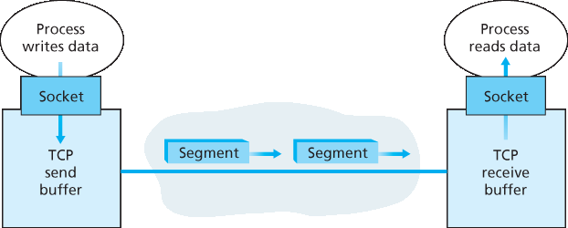
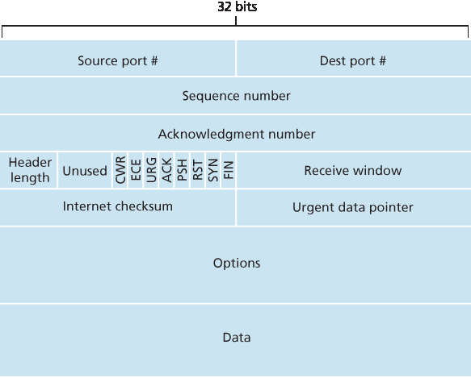
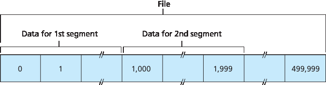
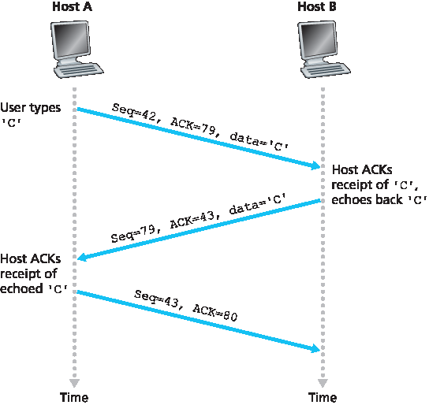
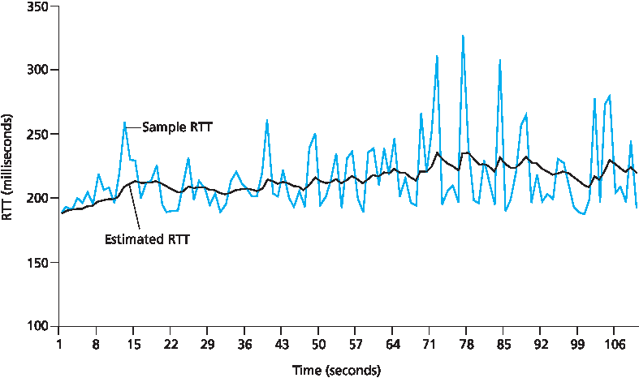
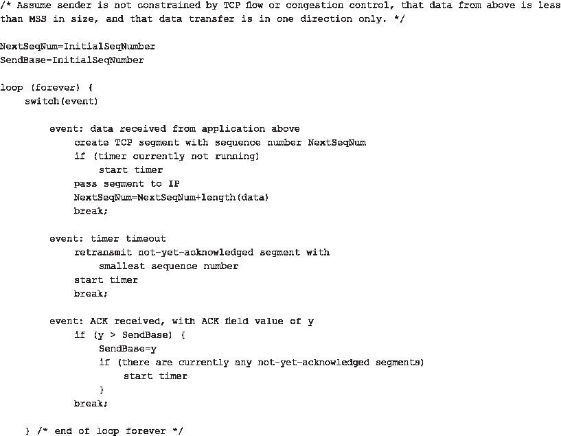
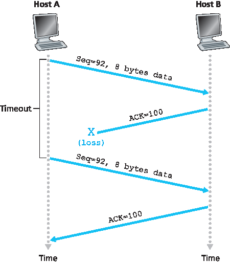
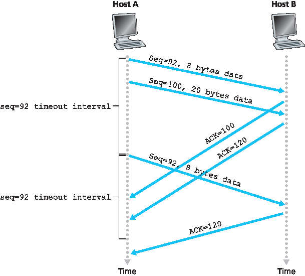
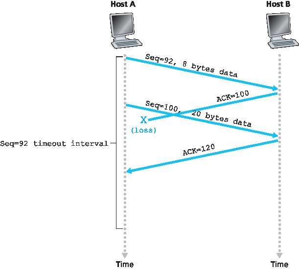
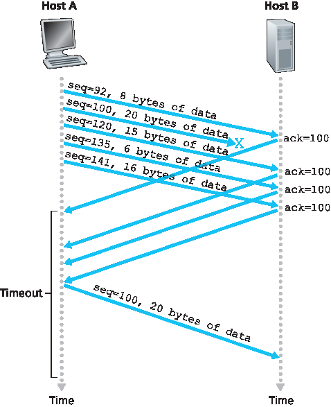

.. _c3.5:

3.5 面向连接的传输: TCP
==================================================
3.5 Connection-Oriented Transport: TCP

.. tab:: 中文

.. tab:: 英文

Now that we have covered the underlying principles of reliable data transfer, let’s turn to TCP—the
Internet’s transport-layer, connection-oriented, reliable transport protocol. In this section, we’ll see that in
order to provide reliable data transfer, TCP relies on many of the underlying principles discussed in the
previous section, including error detection, retransmissions, cumulative acknowledgments, timers, and
header fields for sequence and acknowledgment numbers. TCP is defined in :rfc:`793`, :rfc:`1122`, :rfc:`1323`, :rfc:`2018`, and :rfc:`2581`.

.. _c3.5.1:

3.5.1 TCP 连接
------------------------------------------------------------------------------------
3.5.1 The TCP Connection

.. tab:: 中文

.. tab:: 英文

TCP is said to be **connection-oriented** because before one application process can begin to send data
to another, the two processes must first “handshake” with each other—that is, they must send some
preliminary segments to each other to establish the parameters of the ensuing data transfer. As part of
TCP connection establishment, both sides of the connection will initialize many TCP state variables
(many of which will be discussed in this section and in :ref:`Section 3.7 <c3.7>`) associated with the TCP
connection.

The TCP “connection” is not an end-to-end TDM or FDM circuit as in a circuit-switched network. Instead,
the “connection” is a logical one, with common state residing only in the TCPs in the two communicating
end systems. Recall that because the TCP protocol runs only in the end systems and not in the
intermediate network elements (routers and link-layer switches), the intermediate network elements do
not maintain TCP connection state. In fact, the intermediate routers are completely oblivious to TCP
connections; they see datagrams, not connections.

A TCP connection provides a **full-duplex service**: If there is a TCP connection between Process A on
one host and Process B on another host, then application-layer data can flow from Process A to
Process B at the same time as application-layer data flows from Process B to Process A. A TCP
connection is also always **point-to-point**, that is, between a single sender and a single receiver. So-
called “multicasting” (see the online supplementary materials for this text)—the transfer of data from one
sender to many receivers in a single send operation—is not possible with TCP. With TCP, two hosts are
company and three are a crowd!

Let’s now take a look at how a TCP connection is established. Suppose a process running in one host
wants to initiate a connection with another process in another host. Recall that the process that is
initiating the connection is called the client process, while the other process is called the server process.
The client application process first informs the client transport layer that it wants to establish a
connection to a process in the server. Recall from Section 2.7.2, a Python client program does this by issuing the
command

.. code:: 

    clientSocket.connect((serverName, serverPort))

where **serverName** is the name of the server and **serverPort** identifies the process on the server.
TCP in the client then proceeds to establish a TCP connection with TCP in the server. At the end of this
section we discuss in some detail the connection-establishment procedure. For now it suffices to know
that the client first sends a special TCP segment; the server responds with a second special TCP
segment; and finally the client responds again with a third special segment. The first two segments carry
no payload, that is, no application-layer data; the third of these segments may carry a payload. Becausethree segments are sent between the two hosts, this connection-establishment procedure is often
referred to as a **three-way handshake**.

.. admonition:: CASE HISTORY

    Vinton Cerf, Robert Kahn, and TCP/IP

    In the early 1970s, packet-switched networks began to proliferate, with the ARPAnet—the
    precursor of the Internet—being just one of many networks. Each of these networks had its own
    protocol. Two researchers, Vinton Cerf and Robert Kahn, recognized the importance of
    interconnecting these networks and invented a cross-network protocol called TCP/IP, which
    stands for Transmission Control Protocol/Internet Protocol. Although Cerf and Kahn began by
    seeing the protocol as a single entity, it was later split into its two parts, TCP and IP, which
    operated separately. Cerf and Kahn published a paper on TCP/IP in May 1974 in *IEEE
    Transactions on Communications Technology* :ref:`[Cerf 1974] <Cerf 1974>`.

    The TCP/IP protocol, which is the bread and butter of today’s Internet, was devised before PCs,
    workstations, smartphones, and tablets, before the proliferation of Ethernet, cable, and DSL,
    WiFi, and other access network technologies, and before the Web, social media, and streaming
    video. Cerf and Kahn saw the need for a networking protocol that, on the one hand, provides
    broad support for yet-to-be-defined applications and, on the other hand, allows arbitrary hosts
    and link-layer protocols to interoperate.

    In 2004, Cerf and Kahn received the ACM’s Turing Award, considered the “Nobel Prize of
    Computing” for “pioneering work on internetworking, including the design and implementation of
    the Internet’s basic communications protocols, TCP/IP, and for inspired leadership in
    networking.”

Once a TCP connection is established, the two application processes can send data to each other. Let’s
consider the sending of data from the client process to the server process. The client process passes a
stream of data through the socket (the door of the process), as described in :ref:`Section 2.7 <c2.7>`. Once the data
passes through the door, the data is in the hands of TCP running in the client. As shown in :ref:`Figure 3.28 <Figure 3.28>`,
TCP directs this data to the connection’s **send buffer**, which is one of the buffers that is set aside during
the initial three-way handshake. From time to time, TCP will grab chunks of data from the send buffer
and pass the data to the network layer. Interestingly, the TCP specification :ref:`[RFC 793] <RFC 793>` is very laid back
about specifying when TCP should actually send buffered data, stating that TCP should “send that data
in segments at its own convenience.” The maximum amount of data that can be grabbed and placed in
a segment is limited by the **maximum segment size (MSS)**. The MSS is typically set by first
determining the length of the largest link-layer frame that can be sent by the local sending host (the so-
called **maximum transmission unit, MTU)**, and then setting the MSS to ensure that a TCP segment
(when encapsulated in an IP datagram) plus the TCP/IP header length (typically 40 bytes) will fit into a
single link-layer frame. Both Ethernet and PPP link-layer protocols have an MTU of 1,500 bytes. Thus a
typical value of MSS is 1460 bytes. Approaches have also been proposed for discovering the path MTU
—the largest link-layer frame that can be sent on all links from source to destination :ref:`[RFC 1191] <RFC 1191>` —and
setting the MSS based on the path MTU value. Note that the MSS is the maximum amount of
application-layer data in the segment, not the maximum size of the TCP segment including headers.
(This terminology is confusing, but we have to live with it, as it is well entrenched.)

TCP pairs each chunk of client data with a TCP header, thereby forming **TCP segments**. The segments
are passed down to the network layer, where they are separately encapsulated within network-layer IP
datagrams. The IP datagrams are then sent into the network. When TCP receives a segment at the
other end, the segment’s data is placed in the TCP connection’s receive buffer, as shown in :ref:`Figure 3.28 <Figure 3.28>`. The application reads the stream of data from this buffer. Each side of the connection has
its own send buffer and its own receive buffer. (You can see the online flow-control applet at
http://www.awl.com/kurose-ross, which provides an animation of the send and receive buffers.)

.. _Figure 3.28:

**Figure 3.28 TCP send and receive buffers**

We see from this discussion that a TCP connection consists of buffers, variables, and a socket
connection to a process in one host, and another set of buffers, variables, and a socket connection to a
process in another host. As mentioned earlier, no buffers or variables are allocated to the connection in
the network elements (routers, switches, and repeaters) between the hosts.

.. _c3.5.2:

3.5.2 TCP 段结构
------------------------------------------------------------------------------------
3.5.2 TCP Segment Structure

.. tab:: 中文

.. tab:: 英文

Having taken a brief look at the TCP connection, let’s examine the TCP segment structure. The TCP segment consists of header fields and a data field. The data field contains a chunk of application data. As mentioned above, the MSS limits the maximum size of a segment’s data field. When TCP sends a large file, such as an image as part of a Web page, it typically breaks the file into chunks of size MSS (except for the last chunk, which will often be less than the MSS). Interactive applications, however, often transmit data chunks that are smaller than the MSS; for example, with remote login applications like Telnet, the data field in the TCP segment is often only one byte. Because the TCP header is typically 20 bytes (12 bytes more than the UDP header), segments sent by Telnet may be only 21 bytes in length.

:ref:`Figure 3.29 <Figure 3.29>` shows the structure of the TCP segment. As with UDP, the header includes **source and destination port numbers**, which are used for multiplexing/demultiplexing data from/to upper-layer applications. Also, as with UDP, the header includes a **checksum field**. A TCP segment header also contains the following fields:

- The 32-bit **sequence number field** and the 32-bit **acknowledgment number field** are used by the TCP sender and receiver in implementing a reliable data transfer service, as discussed below.
- The 16-bit **receive window** field is used for flow control. We will see shortly that it is used to indicate the number of bytes that a receiver is willing to accept.
- The 4-bit **header length field** specifies the length of the TCP header in 32-bit words. The TCP header can be of variable length due to the TCP options field. (Typically, the options field is empty, so that the length of the typical TCP header is 20 bytes.) - The optional and variable-length **options field** is used when a sender and receiver negotiate the
maximum segment size (MSS) or as a window scaling factor for use in high-speed networks. A time- stamping option is also defined. See RFC 854 and RFC 1323 for additional details.
- The **flag field** contains 6 bits. The **ACK bit** is used to indicate that the value carried in the acknowledgment field is valid; that is, the segment contains an acknowledgment for a segment that has been successfully received. The **RST**, **SYN**, and **FIN** bits are used for connection setup and teardown, as we will discuss at the end of this section. The CWR and ECE bits are used in explicit congestion notification, as discussed in :ref:`Section 3.7.2 <c3.7.2>`. Setting the **PSH** bit indicates that the receiver should pass the data to the upper layer immediately. Finally, the **URG** bit is used to indicate that there is data in this segment that the sending-side upper-layer entity has marked as “urgent.” The location of the last byte of this urgent data is indicated by the 16-bit **urgent data pointer field**. TCP must inform the receiving-side upper- layer entity when urgent data exists and pass it a pointer to the end of the urgent data. (In practice, the PSH, URG, and the urgent data pointer are not used. However, we mention these fields for completeness.)

.. _Figure 3.29:

**Figure 3.29 TCP segment structure**

Our experience as teachers is that our students sometimes find discussion of packet formats rather dry
and perhaps a bit boring. For a fun and fanciful look at TCP header fields, particularly if you love
Legos™ as we do, see :ref:`[Pomeranz 2010] <Pomeranz 2010>`.

Sequence Numbers and Acknowledgment Numbers
~~~~~~~~~~~~~~~~~~~~~~~~~~~~~~~~~~~~~~~~~~~~~~~~~~~~~~~~~~~~~~~~~~~~

Two of the most important fields in the TCP segment header are the sequence number field and the
acknowledgment number field. These fields are a critical part of TCP’s reliable data transfer service. But
before discussing how these fields are used to provide reliable data transfer, let us first explain what
exactly TCP puts in these fields.

.. _Figure 3.30:

**Figure 3.30 Dividing file data into TCP segments**

TCP views data as an unstructured, but ordered, stream of bytes. TCP’s use of sequence numbers
reflects this view in that sequence numbers are over the stream of transmitted bytes and not over the
series of transmitted segments. The **sequence number for a segment** is therefore the byte-stream
number of the first byte in the segment. Let’s look at an example. Suppose that a process in Host A
wants to send a stream of data to a process in Host B over a TCP connection. The TCP in Host A will
implicitly number each byte in the data stream. Suppose that the data stream consists of a file consisting
of 500,000 bytes, that the MSS is 1,000 bytes, and that the first byte of the data stream is numbered 0.
As shown in :ref:`Figure 3.30 <Figure 3.30>`, TCP constructs 500 segments out of the data stream. The first segment gets
assigned sequence number 0, the second segment gets assigned sequence number 1,000, the third
segment gets assigned sequence number 2,000, and so on. Each sequence number is inserted in the
sequence number field in the header of the appropriate TCP segment.

Now let’s consider acknowledgment numbers. These are a little trickier than sequence numbers. Recall
that TCP is full-duplex, so that Host A may be receiving data from Host B while it sends data to Host B
(as part of the same TCP connection). Each of the segments that arrive from Host B has a sequence
number for the data flowing from B to A. *The acknowledgment number that Host A puts in its segment is
the sequence number of the next byte Host A is expecting from Host B*. It is good to look at a few
examples to understand what is going on here. Suppose that Host A has received all bytes numbered 0
through 535 from B and suppose that it is about to send a segment to Host B. Host A is waiting for byte
536 and all the subsequent bytes in Host B’s data stream. So Host A puts 536 in the acknowledgment
number field of the segment it sends to B.

As another example, suppose that Host A has received one segment from Host B containing bytes 0
through 535 and another segment containing bytes 900 through 1,000. For some reason Host A has not
yet received bytes 536 through 899. In this example, Host A is still waiting for byte 536 (and beyond) in
order to re-create B’s data stream. Thus, A’s next segment to B will contain 536 in the acknowledgment
number field. Because TCP only acknowledges bytes up to the first missing byte in the stream, TCP is
said to provide **cumulative acknowledgments**.

This last example also brings up an important but subtle issue. Host A received the third segment (bytes
900 through 1,000) before receiving the second segment (bytes 536 through 899). Thus, the third
segment arrived out of order. The subtle issue is: What does a host do when it receives out-of-order
segments in a TCP connection? Interestingly, the TCP RFCs do not impose any rules here and leave
the decision up to the programmers implementing a TCP implementation. There are basically two
choices: either (1) the receiver immediately discards out-of-order segments (which, as we discussed
earlier, can simplify receiver design), or (2) the receiver keeps the out-of-order bytes and waits for the
missing bytes to fill in the gaps. Clearly, the latter choice is more efficient in terms of network bandwidth,
and is the approach taken in practice.

In :ref:`Figure 3.30 <Figure 3.30>`, we assumed that the initial sequence number was zero. In truth, both sides of a TCP
connection randomly choose an initial sequence number. This is done to minimize the possibility that a
segment that is still present in the network from an earlier, already-terminated connection between two
hosts is mistaken for a valid segment in a later connection between these same two hosts (which also
happen to be using the same port numbers as the old connection) :ref:`[Sunshine 1978] <Sunshine 1978>`.

Telnet: A Case Study for Sequence and Acknowledgment Numbers
~~~~~~~~~~~~~~~~~~~~~~~~~~~~~~~~~~~~~~~~~~~~~~~~~~~~~~~~~~~~~~~~~~~~

Telnet, defined in RFC 854, is a popular application-layer protocol used for remote login. It runs over
TCP and is designed to work between any pair of hosts. Unlike the bulk data transfer applications
discussed in :ref:`Chapter 2 <c2>`, Telnet is an interactive application. We discuss a Telnet example here, as it
nicely illustrates TCP sequence and acknowledgment numbers. We note that many users now prefer to
use the SSH protocol rather than Telnet, since data sent in a Telnet connection (including passwords!)
are not encrypted, making Telnet vulnerable to eavesdropping attacks (as discussed in :ref:`Section 8.7 <c8.7>`).

Suppose Host A initiates a Telnet session with Host B. Because Host A initiates the session, it is labeled
the client, and Host B is labeled the server. Each character typed by the user (at the client) will be sent
to the remote host; the remote host will send back a copy of each character, which will be displayed on
the Telnet user’s screen. This “echo back” is used to ensure that characters seen by the Telnet user
have already been received and processed at the remote site. Each character thus traverses the
network twice between the time the user hits the key and the time the character is displayed on the
user’s monitor.

Now suppose the user types a single letter, ‘C,’ and then grabs a coffee. Let’s examine the TCP
segments that are sent between the client and server. As shown in :ref:`Figure 3.31 <Figure 3.31>`, we suppose the starting
sequence numbers are 42 and 79 for the client and server, respectively. Recall that the sequence
number of a segment is the sequence number of the first byte in the data field. Thus, the first segment
sent from the client will have sequence number 42; the first segment sent from the server will have
sequence number 79. Recall that the acknowledgment number is the sequence number of the next byte of data that the host is waiting for. After the TCP connection is established but
before any data is sent, the client is waiting for byte 79 and the server is waiting for byte 42.

.. _Figure 3.31:

**Figure 3.31 Sequence and acknowledgment numbers for a simple Telnet application over TCP**

As shown in :ref:`Figure 3.31 <Figure 3.31>`, three segments are sent. The first segment is sent from the client to the
server, containing the 1-byte ASCII representation of the letter ‘C’ in its data field. This first segment also
has 42 in its sequence number field, as we just described. Also, because the client has not yet received
any data from the server, this first segment will have 79 in its acknowledgment number field.

The second segment is sent from the server to the client. It serves a dual purpose. First it provides an
acknowledgment of the data the server has received. By putting 43 in the acknowledgment field, the
server is telling the client that it has successfully received everything up through byte 42 and is now
waiting for bytes 43 onward. The second purpose of this segment is to echo back the letter ‘C.’ Thus,
the second segment has the ASCII representation of ‘C’ in its data field. This second segment has the
sequence number 79, the initial sequence number of the server-to-client data flow of this TCP
connection, as this is the very first byte of data that the server is sending. Note that the acknowledgment
for client-to-server data is carried in a segment carrying server-to-client data; this acknowledgment is
said to be **piggybacked** on the server-to-client data segment.

The third segment is sent from the client to the server. Its sole purpose is to acknowledge the data it has
received from the server. (Recall that the second segment contained data—the letter ‘C’—from the
server to the client.) This segment has an empty data field (that is, the acknowledgment is not being
piggybacked with any client-to-server data). The segment has 80 in the acknowledgment number field
because the client has received the stream of bytes up through byte sequence number 79 and it is now
waiting for bytes 80 onward. You might think it odd that this segment also has a sequence number since
the segment contains no data. But because TCP has a sequence number field, the segment needs to
have some sequence number.

.. _c3.5.3:

3.5.3 往返时间估计和超时
------------------------------------------------------------------------------------
3.5.3 Round-Trip Time Estimation and Timeout

.. tab:: 中文

.. tab:: 英文

TCP, like our ``rdt`` protocol in :ref:`Section 3.4 <c3.4>`, uses a timeout/retransmit mechanism to recover from lost
segments. Although this is conceptually simple, many subtle issues arise when we implement a
timeout/retransmit mechanism in an actual protocol such as TCP. Perhaps the most obvious question is
the length of the timeout intervals. Clearly, the timeout should be larger than the connection’s round-trip
time (RTT), that is, the time from when a segment is sent until it is acknowledged. Otherwise,
unnecessary retransmissions would be sent. But how much larger? How should the RTT be estimated in
the first place? Should a timer be associated with each and every unacknowledged segment? So many
questions! Our discussion in this section is based on the TCP work in :ref:`[Jacobson 1988] <Jacobson 1988>` and the current
IETF recommendations for managing TCP timers :ref:`[RFC 6298] <RFC 6298>`.

Estimating the Round-Trip Time
~~~~~~~~~~~~~~~~~~~~~~~~~~~~~~~~~~

Let’s begin our study of TCP timer management by considering how TCP estimates the round-trip time
between sender and receiver. This is accomplished as follows. The sample RTT, denoted ``SampleRTT`` ,
for a segment is the amount of time between when the segment is sent (that is, passed to IP) and when
an acknowledgment for the segment is received. Instead of measuring a ``SampleRTT`` for every
transmitted segment, most TCP implementations take only one ``SampleRTT`` measurement at a time.
That is, at any point in time, the ``SampleRTT`` is being estimated for only one of the transmitted but
currently unacknowledged segments, leading to a new value of ``SampleRTT`` approximately once every
RTT. Also, TCP never computes a ``SampleRTT`` for a segment that has been retransmitted; it only
measures ``SampleRTT`` for segments that have been transmitted once :ref:`[Karn 1987] <Karn 1987>`. (A problem at the
end of the chapter asks you to consider why.)

Obviously, the ``SampleRTT`` values will fluctuate from segment to segment due to congestion in the
routers and to the varying load on the end systems. Because of this fluctuation, any given ``SampleRTT``
value may be atypical. In order to estimate a typical RTT, it is therefore natural to take some sort of
average of the ``SampleRTT`` values. TCP maintains an average, called ``EstimatedRTT`` , of the
``SampleRTT`` values. Upon obtaining a new ``SampleRTT`` , TCP updates ``EstimatedRTT`` according to
the following formula:

.. code::

    EstimatedRTT=(1−α)⋅EstimatedRTT+α⋅SampleRTT

The formula above is written in the form of a programming-language statement—the new value of
**EstimatedRTT** is a weighted combination of the previous value of **EstimatedRTT** and the new value for
**SampleRTT**. The recommended value of α is α = 0.125 (that is, 1/8) :ref:`[RFC 6298] <RFC 6298>`, in which case the
formula above becomes:

.. code::

    EstimatedRTT=0.875⋅EstimatedRTT+0.125⋅SampleRTT

Note that **EstimatedRTT** is a weighted average of the **SampleRTT** values. As discussed in a homework
problem at the end of this chapter, this weighted average puts more weight on recent samples than on
old samples. This is natural, as the more recent samples better reflect the current congestion in the
network. In statistics, such an average is called an **exponential weighted moving average (EWMA)**.
The word “exponential” appears in EWMA because the weight of a given ``SampleRTT`` decays
exponentially fast as the updates proceed. In the homework problems you will be asked to derive the
exponential term in ``EstimatedRTT`` .

Figure 3.32 shows the ``SampleRTT`` values and ``EstimatedRTT`` for a value of α = 1/8 for a TCP
connection between `gaia.cs.umass.edu` (in Amherst, Massachusetts) to `fantasia.eurecom.fr`
(in the south of France). Clearly, the variations in the ``SampleRTT`` are smoothed out in the computation
of the ``EstimatedRTT`` .

In addition to having an estimate of the RTT, it is also valuable to have a measure of the variability of the
RTT. :ref:`[RFC 6298] <RFC 6298>` defines the RTT variation, ``DevRTT`` , as an estimate of how much ``SampleRTT``
typically deviates from ``EstimatedRTT`` :

.. code::

    DevRTT=(1−β)⋅DevRTT+β⋅|SampleRTT−EstimatedRTT|

Note that ``DevRTT`` is an EWMA of the difference between ``SampleRTT`` and ``EstimatedRTT`` . If the
``SampleRTT`` values have little fluctuation, then ``DevRTT`` will be small; on the other hand, if there is a lot
of fluctuation, ``DevRTT`` will be large. The recommended value of β is 0.25.

Setting and Managing the Retransmission Timeout Interval
~~~~~~~~~~~~~~~~~~~~~~~~~~~~~~~~~~~~~~~~~~~~~~~~~~~~~~~~~~~~~~

Given values of ``EstimatedRTT`` and ``DevRTT`` , what value should be used for TCP’s timeout interval?
Clearly, the interval should be greater than or equal to ``EstimatedRTT`` , or unnecessary retransmissions would be sent. But the timeout interval should not be
too much larger than EstimatedRTT ; otherwise, when a segment is lost, TCP would not quickly
retransmit the segment, leading to large data transfer delays. It is therefore desirable to set the timeout
equal to the ``EstimatedRTT`` plus some margin. The margin should be large when there is a lot of
fluctuation in the ``SampleRTT`` values; it should be small when there is little fluctuation. The value of
``DevRTT`` should thus come into play here. All of these considerations are taken into account in TCP’s
method for determining the retransmission timeout interval:

.. code:: 

    TimeoutInterval=EstimatedRTT+4⋅DevRTT

.. admonition:: PRINCIPLES IN PRACTICE

    TCP provides reliable data transfer by using positive acknowledgments and timers in much the
    same way that we studied in :ref:`Section 3.4 <c3.4>`. TCP acknowledges data that has been received
    correctly, and it then retransmits segments when segments or their corresponding
    acknowledgments are thought to be lost or corrupted. Certain versions of TCP also have an
    implicit NAK mechanism—with TCP’s fast retransmit mechanism, the receipt of three duplicate
    ACKs for a given segment serves as an implicit NAK for the following segment, triggering
    retransmission of that segment before timeout. TCP uses sequences of numbers to allow the
    receiver to identify lost or duplicate segments. Just as in the case of our reliable data transfer
    protocol, rdt3.0 , TCP cannot itself tell for certain if a segment, or its ACK, is lost, corrupted, or
    overly delayed. At the sender, TCP’s response will be the same: retransmit the segment in
    question.

    TCP also uses pipelining, allowing the sender to have multiple transmitted but yet-to-be-
    acknowledged segments outstanding at any given time. We saw earlier that pipelining can
    greatly improve a session’s throughput when the ratio of the segment size to round-trip delay is
    small. The specific number of outstanding, unacknowledged segments that a sender can have is
    determined by TCP’s flow-control and congestion-control mechanisms. TCP flow control is
    discussed at the end of this section; TCP congestion control is discussed in :ref:`Section 3.7 <c3.7>`. For the
    time being, we must simply be aware that the TCP sender uses pipelining.

An initial ``TimeoutInterval`` value of 1 second is recommended :ref:`[RFC 6298] <RFC 6298>`. Also, when a timeout
occurs, the value of ``TimeoutInterval`` is doubled to avoid a premature timeout occurring for a
subsequent segment that will soon be acknowledged. However, as soon as a segment is received and
``EstimatedRTT`` is updated, the ``TimeoutInterval`` is again computed using the formula above.

.. _Figure 3.32:

**Figure 3.32 RTT samples and RTT estimates**

.. _c3.5.4:

3.5.4 可靠的数据传输
------------------------------------------------------------------------------------
3.5.4 Reliable Data Transfer

.. tab:: 中文

.. tab:: 英文

Recall that the Internet’s network-layer service (IP service) is unreliable. IP does not guarantee
datagram delivery, does not guarantee in-order delivery of datagrams, and does not guarantee the
integrity of the data in the datagrams. With IP service, datagrams can overflow router buffers and never
reach their destination, datagrams can arrive out of order, and bits in the datagram can get corrupted
(flipped from 0 to 1 and vice versa). Because transport-layer segments are carried across the network
by IP datagrams, transport-layer segments can suffer from these problems as well.

TCP creates a **reliable data transfer service** on top of IP’s unreliable best-effort service. TCP’s reliable
data transfer service ensures that the data stream that a process reads out of its TCP receive buffer is
uncorrupted, without gaps, without duplication, and in sequence; that is, the byte stream is exactly the
same byte stream that was sent by the end system on the other side of the connection. How TCP
provides a reliable data transfer involves many of the principles that we studied in :ref:`Section 3.4 <c3.4>`.

In our earlier development of reliable data transfer techniques, it was conceptually easiest to assumethat an individual timer is associated with each transmitted but not yet acknowledged segment. While
this is great in theory, timer management can require considerable overhead. Thus, the recommended
TCP timer management procedures :ref:`[RFC 6298] <RFC 6298>` use only a single retransmission timer, even if there
are multiple transmitted but not yet acknowledged segments. The TCP protocol described in this section
follows this single-timer recommendation.

We will discuss how TCP provides reliable data transfer in two incremental steps. We first present a
highly simplified description of a TCP sender that uses only timeouts to recover from lost segments; we
then present a more complete description that uses duplicate acknowledgments in addition to timeouts.
In the ensuing discussion, we suppose that data is being sent in only one direction, from Host A to Host
B, and that Host A is sending a large file.

:ref:`Figure 3.33 <Figure 3.33>` presents a highly simplified description of a TCP sender. We see that there are three major
events related to data transmission and retransmission in the TCP sender: data received from
application above; timer timeout; and ACK receipt. Upon the occurrence of the first major event, TCP receives data from the application,
encapsulates the data in a segment, and passes the segment to IP. Note that each segment includes a
sequence number that is the byte-stream number of the first data byte in the segment, as described in
:ref:`Section 3.5.2 <c3.5.2>`. Also note that if the timer is already not running for some other segment, TCP starts the
timer when the segment is passed to IP. (It is helpful to think of the timer as being associated with the
oldest unacknowledged segment.) The expiration interval for this timer is the ``TimeoutInterval`` ,
which is calculated from ``EstimatedRTT`` and ``DevRTT`` , as described in :ref:`Section 3.5.3 <c3.5.3>`.

.. _Figure 3.33:

**Figure 3.33 Simplified TCP sender**

The second major event is the timeout. TCP responds to the timeout event by retransmitting the
segment that caused the timeout. TCP then restarts the timer.

The third major event that must be handled by the TCP sender is the arrival of an acknowledgment
segment (ACK) from the receiver (more specifically, a segment containing a valid ACK field value). On
the occurrence of this event, TCP compares the ACK value y with its variable ``SendBase`` . The TCP
state variable ``SendBase`` is the sequence number of the oldest unacknowledged byte. (Thus
``SendBase-1`` is the sequence number of the last byte that is known to have been received correctly
and in order at the receiver.) As indicated earlier, TCP uses cumulative acknowledgments, so that y
acknowledges the receipt of all bytes before byte number ``y`` . If ``y > SendBase`` , then the ACK is
acknowledging one or more previously unacknowledged segments. Thus the sender updates its
``SendBase`` variable; it also restarts the timer if there currently are any not-yet-acknowledged segments.

A Few Interesting Scenarios
~~~~~~~~~~~~~~~~~~~~~~~~~~~~~~~~

We have just described a highly simplified version of how TCP provides reliable data transfer. But even
this highly simplified version has many subtleties. To get a good feeling for how this protocol works, let’s
now walk through a few simple scenarios. :ref:`Figure 3.34 <Figure 3.34>` depicts the first scenario, in which Host A sends
one segment to Host B. Suppose that this segment has sequence number 92 and contains 8 bytes of
data. After sending this segment, Host A waits for a segment from B with acknowledgment number 100.
Although the segment from A is received at B, the acknowledgment from B to A gets lost. In this case,
the timeout event occurs, and Host A retransmits the same segment. Of course, when Host B receives
the retransmission, it observes from the sequence number that the segment contains data that has
already been received. Thus, TCP in Host B will discard the bytes in the retransmitted segment.

In a second scenario, shown in :ref:`Figure 3.35 <Figure 3.35>`, Host A sends two segments back to back. The first
segment has sequence number 92 and 8 bytes of data, and the second segment has sequence number
100 and 20 bytes of data. Suppose that both segments arrive intact at B, and B sends two separate
acknowledgments for each of these segments. The first of these acknowledgments has
acknowledgment number 100; the second has acknowledgment number 120. Suppose now that neither
of the acknowledgments arrives at Host A before the timeout. When the timeout event occurs, Host A resends the first segment with sequence number 92 and restarts the timer. As long as the ACK for the
second segment arrives before the new timeout, the second segment will not be retransmitted.

.. _Figure 3.34:

**Figure 3.34 Retransmission due to a lost acknowledgment**

In a third and final scenario, suppose Host A sends the two segments, exactly as in the second
example. The acknowledgment of the first segment is lost in the network, but just before the timeout
event, Host A receives an acknowledgment with acknowledgment number 120. Host A therefore knows
that Host B has received *everything* up through byte 119; so Host A does not resend either of the two
segments. This scenario is illustrated in :ref:`Figure 3.36 <Figure 3.36>`.

Doubling the Timeout Interval
~~~~~~~~~~~~~~~~~~~~~~~~~~~~~~~~~~~

We now discuss a few modifications that most TCP implementations employ. The first concerns the
length of the timeout interval after a timer expiration. In this modification, whenever the timeout event
occurs, TCP retransmits the not-yet-acknowledged segment with the smallest sequence number, as
described above. But each time TCP retransmits, it sets the next timeout interval to twice the previous
value, rather than deriving it from the last ``EstimatedRTT`` and ``DevRTT`` (as described in :ref:`Section 3.5.3 <c3.5.3>`). For
example, suppose ``TimeoutInterval`` associated with the oldest not yet acknowledged segment is
.75 sec when the timer first expires. TCP will then retransmit this segment and set the new expiration
time to 1.5 sec. If the timer expires again 1.5 sec later, TCP will again retransmit this segment, now
setting the expiration time to 3.0 sec. Thus the intervals grow exponentially after each retransmission.
However, whenever the timer is started after either of the two other events (that is, data received from
application above, and ACK received), the ``TimeoutInterval`` is derived from the most recent values
of ``EstimatedRTT`` and ``DevRTT`` .

.. _Figure 3.35:

**Figure 3.35 Segment 100 not retransmitted**

This modification provides a limited form of congestion control. (More comprehensive forms of TCP
congestion control will be studied in :ref:`Section 3.7 <c3.7>`.) The timer expiration is most likely caused by
congestion in the network, that is, too many packets arriving at one (or more) router queues in the path
between the source and destination, causing packets to be dropped and/or long queuing delays. In
times of congestion, if the sources continue to retransmit packets persistently, the congestion 
may get worse. Instead, TCP acts more politely, with each sender retransmitting after longer and longer
intervals. We will see that a similar idea is used by Ethernet when we study CSMA/CD in :ref:`Chapter 6 <c6>`.

.. _Figure 3.36:

**Figure 3.36 A cumulative acknowledgment avoids retransmission of the first segment**

Fast Retransmit
~~~~~~~~~~~~~~~~~~~~

One of the problems with timeout-triggered retransmissions is that the timeout period can be relatively
long. When a segment is lost, this long timeout period forces the sender to delay resending the lost
packet, thereby increasing the end-to-end delay. Fortunately, the sender can often detect packet loss
well before the timeout event occurs by noting so-called **duplicate ACKs**. A duplicate ACK is an ACK
that reacknowledges a segment for which the sender has already received an earlier acknowledgment.
To understand the sender’s response to a duplicate ACK, we must look at why the receiver sends a
duplicate ACK in the first place. :ref:`Table 3.2 <Table 3.2>` summarizes the TCP receiver’s ACK generation policy :ref:`[RFC 5681] <RFC 5681>`. When a TCP receiver receives a segment with a sequence number that is larger than the next, expected, in-order sequence number, it
detects a gap in the data stream—that is, a missing segment. This gap could be the result of lost or
reordered segments within the network. Since TCP does not use negative acknowledgments, the
receiver cannot send an explicit negative acknowledgment back to the sender. Instead, it simply
reacknowledges (that is, generates a duplicate ACK for) the last in-order byte of data it has received.
(Note that :ref:`Table 3.2 <Table 3.2>` allows for the case that the receiver does not discard out-of-order segments.)

.. _Table 3.2:

**Table 3.2 TCP ACK Generation Recommendation** :ref:`[RFC 5681] <RFC 5681>`

.. list-table::
   :header-rows: 1

   * - Event
     - TCP Receiver Action
   * - Arrival of in-order segment with expected sequence number. All data up to expected sequence number already acknowledged.
     - Delayed ACK. Wait up to 500 msec for arrival of another in-order segment. If next in-order segment does not arrive in this interval, send an ACK.
   * - Arrival of in-order segment with expected  sequence number. One other in-order segment waiting for ACK transmission.
     - One Immediately send single cumulative ACK, ACKing both in-order segments.
   * - Arrival of out-of-order segment with higher-than-expected sequence number. Gap  detected.
     - Immediately send duplicate ACK, indicating sequence number of next expected byte (which is the lower end of the gap).
   * - Arrival of segment that partially or completely fills in gap in received data.
     - Immediately send ACK, provided that segment starts at the lower end of gap.

Because a sender often sends a large number of segments back to back, if one segment is lost, there
will likely be many back-to-back duplicate ACKs. If the TCP sender receives three duplicate ACKs for
the same data, it takes this as an indication that the segment following the segment that has been
ACKed three times has been lost. (In the homework problems, we consider the question of why the
sender waits for three duplicate ACKs, rather than just a single duplicate ACK.) In the case that three
duplicate ACKs are received, the TCP sender performs a **fast retransmit** :ref:`[RFC 5681] <RFC 5681>`, retransmitting
the missing segment before that segment’s timer expires. This is shown in :ref:`Figure 3.37 <Figure 3.37>`, where the
second segment is lost, then retransmitted before its timer expires. For TCP with fast retransmit, the
following code snippet replaces the ACK received event in :ref:`Figure 3.33 <Figure 3.33>`:

.. code:: text

    event: ACK received, with ACK field value of y

    if (y > SendBase) {

        SendBase=y
    
        if (there are currently any not yet
                  acknowledged segments)
            start timer
        
        else {  /* a duplicate ACK for already ACKed segment */
            
            increment number of duplicate ACKs received for y
            
            if (number of duplicate ACKS received for y==3)
            
                /* TCP fast retransmit */
                resend segment with sequence number y
        }
        break;
    }

.. _Figure 3.37:

**Figure 3.37 Fast retransmit: retransmitting the missing segment before the segment’s timer expires**

We noted earlier that many subtle issues arise when a timeout/retransmit mechanism is implemented in
an actual protocol such as TCP. The procedures above, which have evolved as a result of more than 20
years of experience with TCP timers, should convince you that this is indeed the case!

Go-Back-N or Selective Repeat?
~~~~~~~~~~~~~~~~~~~~~~~~~~~~~~~~~~~

Let us close our study of TCP’s error-recovery mechanism by considering the following question: Is TCP
a GBN or an SR protocol? Recall that TCP acknowledgments are cumulative and correctly received but
out-of-order segments are not individually ACKed by the receiver. Consequently, as shown in :ref:`Figure 3.33 <Figure 3.33>` (see also :ref:`Figure 3.19 <Figure 3.19>`), the TCP sender need only maintain the smallest sequence number of a
transmitted but unacknowledged byte ( ``SendBase`` ) and the sequence number of the next byte to be
sent ( ``NextSeqNum`` ). In this sense, TCP looks a lot like a GBN-style protocol. But there are some
striking differences between TCP and Go-Back-N. Many TCP implementations will buffer correctly
received but out-of-order segments :ref:`[Stevens 1994] <Stevens 1994>`. Consider also what happens when the sender
sends a sequence of segments 1, 2, . . ., N, and all of the segments arrive in order without error at the
receiver. Further suppose that the acknowledgment for packet n<N gets lost, but the remaining N−1
acknowledgments arrive at the sender before their respective timeouts. In this example, GBN would
retransmit not only packet n, but also all of the subsequent packets n+1,n+2,…,N. TCP, on the other
hand, would retransmit at most one segment, namely, segment n. Moreover, TCP would not even
retransmit segment n if the acknowledgment for segment n+1 arrived before the timeout for segment n.

A proposed modification to TCP, the so-called **selective acknowledgment** :ref:`[RFC 2018] <RFC 2018>`, allows a TCP
receiver to acknowledge out-of-order segments selectively rather than just cumulatively acknowledging
the last correctly received, in-order segment. When combined with selective retransmission—skipping
the retransmission of segments that have already been selectively acknowledged by the receiver—TCP
looks a lot like our generic SR protocol. Thus, TCP’s error-recovery mechanism is probably best
categorized as a hybrid of GBN and SR protocols.

.. _c3.5.5:

3.5.5 流控
------------------------------------------------------------------------------------
3.5.5 Flow Control

.. tab:: 中文

.. tab:: 英文

.. _c3.5.6:

3.5.6 TCP 连接管理
------------------------------------------------------------------------------------
3.5.6 TCP Connection Management

.. tab:: 中文

.. tab:: 英文

