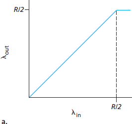
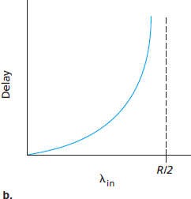
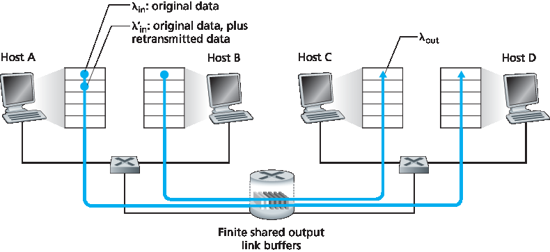
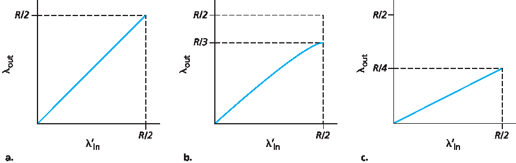
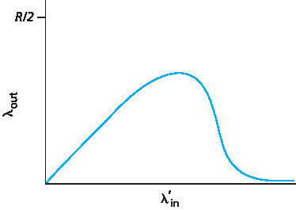

.. _c3.6:

3.6 拥塞控制原则
==================================================
3.6 Principles of Congestion Control

.. tab:: 中文

.. tab:: 英文

In the previous sections, we examined both the general principles and specific TCP mechanisms used to provide for a reliable data transfer service in the face of packet loss. We mentioned earlier that, in practice, such loss typically results from the overflowing of router buffers as the network becomes congested. Packet retransmission thus treats a symptom of network congestion (the loss of a specific transport-layer segment) but does not treat the cause of network congestion—too many sources attempting to send data at too high a rate. To treat the cause of network congestion, mechanisms are needed to throttle senders in the face of network congestion.

In this section, we consider the problem of congestion control in a general context, seeking to understand why congestion is a bad thing, how network congestion is manifested in the performance received by upper-layer applications, and various approaches that can be taken to avoid, or react to, network congestion. This more general study of congestion control is appropriate since, as with reliable data transfer, it is high on our “top-ten” list of fundamentally important problems in networking. The following section contains a detailed study of TCP’s congestion-control algorithm.

.. _c3.6.1:

3.6.1 拥堵的原因和成本
------------------------------------------------------------------------------------
3.6.1 The Causes and the Costs of Congestion

.. tab:: 中文

.. tab:: 英文

Let’s begin our general study of congestion control by examining three increasingly complex scenarios in which congestion occurs. In each case, we’ll look at why congestion occurs in the first place and at the cost of congestion (in terms of resources not fully utilized and poor performance received by the end systems). We’ll not (yet) focus on how to react to, or avoid, congestion but rather focus on the simpler issue of understanding what happens as hosts increase their transmission rate and the network becomes congested.

Scenario 1: Two Senders, a Router with Infinite Buffers
~~~~~~~~~~~~~~~~~~~~~~~~~~~~~~~~~~~~~~~~~~~~~~~~~~~~~~~~~

We begin by considering perhaps the simplest congestion scenario possible: Two hosts (A and B) each have a connection that shares a single hop between source and destination, as shown in :ref:`Figure 3.43 <Figure 3.43>`.

Let’s assume that the application in Host A is sending data into the connection (for example, passing data to the transport-level protocol via a socket) at an average rate of λin bytes/sec. These data are original in the sense that each unit of data is sent into the socket only once. The underlying transport- level protocol is a simple one. Data is encapsulated and sent; no error recovery (for example, retransmission), flow control, or congestion control is performed. Ignoring the additional overhead due to adding transport- and lower-layer header information, the rate at which Host A offers traffic to the router
in this first scenario is thus λin bytes/sec. Host B operates in a similar manner, and we assume for simplicity that it too is sending at a rate of λin bytes/sec. Packets from Hosts A and B pass through a
router and over a shared outgoing link of capacity R. The router has buffers that allow it to store incoming packets when the packet-arrival rate exceeds the outgoing link’s capacity. In this first scenario,
we assume that the router has an infinite amount of buffer space.

:ref:`Figure 3.44 <Figure 3.44>` plots the performance of Host A’s connection under this first scenario. The left graph plots the **per-connection throughput** (number of bytes per second at the receiver) as a function of the connection-sending rate. For a sending rate between 0 and R/2, the throughput at the receiver equals the sender’s sending rate—everything sent by the sender is received at the receiver with a finite delay. When the sending rate is above R/2, however, the throughput is only R/2. This upper limit on throughput is a consequence of the sharing of link capacity between two connections. The link simply cannot deliver packets to a receiver at a steady-state rate that exceeds R/2. No matter how high Hosts A and B set their sending rates, they will each never see a throughput higher than R/2.

.. figure:: ../img/303-0.png
   :align: center

.. _Figure 3.43:

**Figure 3.43 Congestion scenario 1: Two connections sharing a single hop with infinite buffers**

|

.. _Figure 3.44:

**Figure 3.44 Congestion scenario 1: Throughput and delay as a function of host sending rate**

Achieving a per-connection throughput of R/2 might actually appear to be a good thing, because the link is fully utilized in delivering packets to their destinations. The right-hand graph in :ref:`Figure 3.44 <Figure 3.44>`, however, shows the consequence of operating near link capacity. As the sending rate approaches R/2 (from the left), the average delay becomes larger and larger. When the sending rate exceeds R/2, the average number of queued packets in the router is unbounded, and the average delay between source and destination becomes infinite (assuming that the connections operate at these sending rates for an infinite period of time and there is an infinite amount of buffering available). Thus, while operating at an aggregate throughput of near R may be ideal from a throughput standpoint, it is far from ideal from a delay standpoint. Even in this (extremely) idealized scenario, we’ve already found one cost of a congested network—large queuing delays are experienced as the packet-arrival rate nears the link capacity.

Scenario 2: Two Senders and a Router with Finite Buffers
~~~~~~~~~~~~~~~~~~~~~~~~~~~~~~~~~~~~~~~~~~~~~~~~~~~~~~~~~

Let’s now slightly modify scenario 1 in the following two ways (see :ref:`Figure 3.45 <Figure 3.45>`). First, the amount of router buffering is assumed to be finite. A consequence of this real-world assumption is that packets will be dropped when arriving to an already-full buffer. Second, we assume that each connection is reliable. If a packet containing a transport-level segment is dropped at the router, the sender will eventually retransmit it. Because packets can be retransmitted, we must now be more careful with our use of the term sending rate. Specifically, let us again denote the rate at which the application sends original data into the socket by λin bytes/sec. The rate at which the transport layer sends segments (containing original data and retransmitted data) into the network will be denoted λ‘in bytes/sec. λ’in is sometimes referred to as the **offered load** to the network.

.. _Figure 3.45:

**Figure 3.45 Scenario 2: Two hosts (with retransmissions) and a router with finite buffers**

The performance realized under scenario 2 will now depend strongly on how retransmission is performed. First, consider the unrealistic case that Host A is able to somehow (magically!) determine whether or not a buffer is free in the router and thus sends a packet only when a buffer is free. In this
case, no loss would occur, λin would be equal to λ′in, and the throughput of the connection would be equal to λin. This case is shown in :ref:`Figure 3.46(a) <Figure 3.46>`. From a throughput standpoint, performance is ideal—everything that is sent is received. Note that the average host sending rate cannot exceed R/2 under this scenario, since packet loss is assumed never to occur.

Consider next the slightly more realistic case that the sender retransmits only when a packet is known for certain to be lost. (Again, this assumption is a bit of a stretch. However, it is possible that the sending host might set its timeout large enough to be virtually assured that a packet that has not been acknowledged has been lost.) In this case, the performance might look something like that shown in :ref:`Figure 3.46(b) <Figure 3.46>`. To appreciate what is happening here, consider the case that the offered load, λ′in (the rate of original data transmission plus retransmissions), equals R/2. According to :ref:`Figure 3.46(b) <Figure 3.46>`, at this value of the offered load, the rate at which data are delivered to the receiver application is R/3. Thus, out of the 0.5R units of data transmitted, 0.333R bytes/sec (on average) are original data and 0.166R bytes/sec (on average) are retransmitted data. *We see here another cost of a congested network—the sender must perform retransmissions in order to compensate for dropped (lost) packets due to buffer overflow.*

.. _Figure 3.46:

**Figure 3.46 Scenario 2 performance with finite buffers**

Finally, let us consider the case that the sender may time out prematurely and retransmit a packet that has been delayed in the queue but not yet lost. In this case, both the original data packet and the retransmission may reach the receiver. Of course, the receiver needs but one copy of this packet and will discard the retransmission. In this case, the work done by the router in forwarding the retransmitted copy of the original packet was wasted, as the receiver will have already received the original copy of this packet. The router would have better used the link transmission capacity to send a different packet instead. Here then is yet another cost of a congested network—unneeded retransmissions by the sender in the face of large delays may cause a router to use its link bandwidth to forward unneeded copies of a packet. :ref:`Figure 3.46 (c) <Figure 3.46>` shows the throughput versus offered load when each packet is assumed to be forwarded (on average) twice by the router. Since each packet is forwarded twice, the throughput will have an asymptotic value of R/4 as the offered load approaches R/2.

Scenario 3: Four Senders, Routers with Finite Buffers, and Multihop Paths
~~~~~~~~~~~~~~~~~~~~~~~~~~~~~~~~~~~~~~~~~~~~~~~~~~~~~~~~~~~~~~~~~~~~~~~~~~~~~

In our final congestion scenario, four hosts transmit packets, each over overlapping two-hop paths, as
shown in :ref:`Figure 3.47 <Figure 3.47>`. We again assume that each host uses a timeout/retransmission mechanism to implement a reliable data transfer service, that all hosts have the same value of λin, and that all router links have capacity R bytes/sec.

.. figure:: ../img/307-0.png
   :align: center

.. _Figure 3.47:

**Figure 3.47 Four senders, routers with finite buffers, and multihop paths**

Let’s consider the connection from Host A to Host C, passing through routers R1 and R2. The A–C connection shares router R1 with the D–B connection and shares router R2 with the B–D connection. For extremely small values of :math:`λ_{in}`, buffer overflows are rare (as in congestion scenarios 1 and 2), and the throughput approximately equals the offered load. For slightly larger values of :math:`λ_{in}`, the corresponding throughput is also larger, since more original data is being transmitted into the network and delivered to the destination, and overflows are still rare. Thus, for small values of :math:`λ_{in}`, an increase in :math:`λ_{in}` results in an increase in :math:`λ_{out}`.

Having considered the case of extremely low traffic, let’s next examine the case that λin (and hence λ'in) is extremely large. Consider router R2. The A–C traffic arriving to router R2 (which arrives at R2 after being forwarded from R1) can have an arrival rate at R2 that is at most R, the capacity of the link from R1 to R2, regardless of the value of :math:`λ_{in}`. If λ′in is extremely large for all connections (including the B–D connection), then the arrival rate of B–D traffic at R2 can be much larger than that of the A–C traffic. Because the A–C and B–D traffic must compete at router R2 for the limited amount of buffer space, the amount of A–C traffic that successfully gets through R2 (that is, is not lost due to buffer overflow) becomes smaller and smaller as the offered load from B–D gets larger and larger. In the limit, as the offered load approaches infinity, an empty buffer at R2 is immediately filled by a B–D packet, and the throughput of the A–C connection at R2 goes to zero. This, in turn, implies that the A–C end-to-end throughput goes to zero in the limit of heavy traffic. These considerations give rise to the offered load versus throughput tradeoff shown in :ref:`Figure 3.48 <Figure 3.48>`.

.. _Figure 3.48:

**Figure 3.48 Scenario 3 performance with finite buffers and multihop paths**

The reason for the eventual decrease in throughput with increasing offered load is evident when one considers the amount of wasted work done by the network. In the high-traffic scenario outlined above, whenever a packet is dropped at a second-hop router, the work done by the first-hop router in forwarding a packet to the second-hop router ends up being “wasted.” The network would have been equally well off (more accurately, equally bad off) if the first router had simply discarded that packet and remained idle. More to the point, the transmission capacity used at the first router to forward the packet to the second router could have been much more profitably used to transmit a different packet. (For example, when selecting a packet for transmission, it might be better for a router to give priority to
packets that have already traversed some number of upstream routers.) So here we see yet another cost of dropping a packet due to congestion—when a packet is dropped along a path, the transmission capacity that was used at each of the upstream links to forward that packet to the point at which it is dropped ends up having been wasted.

.. _c3.6.2:

3.6.2 拥塞控制方法
------------------------------------------------------------------------------------
3.6.2 Approaches to Congestion Control

.. tab:: 中文

.. tab:: 英文

In :ref:`Section 3.7 <Section 3.7>`, we’ll examine TCP’s specific approach to congestion control in great detail. Here, we identify the two broad approaches to congestion control that are taken in practice and discuss specific network architectures and congestion-control protocols embodying these approaches.

At the highest level, we can distinguish among congestion-control approaches by whether the network layer provides explicit assistance to the transport layer for congestion-control purposes:

- **End-to-end congestion control**. In an end-to-end approach to congestion control, the network layer provides no explicit support to the transport layer for congestion-control purposes. Even the presence of network congestion must be inferred by the end systems based only on observed network behavior (for example, packet loss and delay). We’ll see shortly in :ref:`Section 3.7.1 <c3.7.1>` that TCP takes this end-to-end approach toward congestion control, since the IP layer is not required to provide feedback to hosts regarding network congestion. TCP segment loss (as indicated by a timeout or the receipt of three duplicate acknowledgments) is taken as an indication of network congestion, and TCP decreases its window size accordingly. We’ll also see a more recent proposal for TCP congestion control that uses increasing round-trip segment delay as an indicator of increased network congestion
- **Network-assisted congestion control**. With network-assisted congestion control, routers provide explicit feedback to the sender and/or receiver regarding the congestion state of the network. This feedback may be as simple as a single bit indicating congestion at a link – an approach taken in the early IBM SNA :ref:`[Schwartz 1982] <Schwartz 1982>`, DEC DECnet [ :ref:`Jain 1989 <Jain 1989>` ; :ref:`Ramakrishnan 1990 <Ramakrishnan 1990>`] architectures, and ATM :ref:`[Black 1995] <Black 1995>` network architectures. More sophisticated feedback is also possible. For example, in **ATM Available Bite Rate (ABR)** congestion control, a router informs the sender of the maximum host sending rate it (the router) can support on an outgoing link. As noted above, the Internet-default versions of IP and TCP adopt an end-to-end approach towards congestion control. We’ll see, however, in :ref:`Section 3.7.2 <c3.7.2>` that, more recently, IP and TCP may also optionally implement network-assisted congestion control.

For network-assisted congestion control, congestion information is typically fed back from the network to the sender in one of two ways, as shown in :ref:`Figure 3.49 <Figure 3.49>`. Direct feedback may be sent from a network router to the sender. This form of notification typically takes the form of a choke packet (essentially saying, “I’m congested!”). The second and more common form of notification occurs when a router marks/updates a field in a packet flowing from sender to receiver to indicate congestion. Upon receipt of a marked packet, the receiver then notifies the sender of the congestion indication. This latter form of notification takes a full round-trip time.

.. figure:: ../img/310-0.png 
   :align: center

.. _Figure 3.49:

**Figure 3.49 Two feedback pathways for network-indicated congestion information**