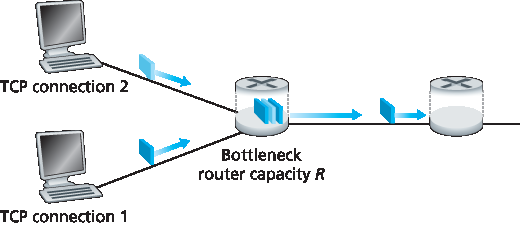
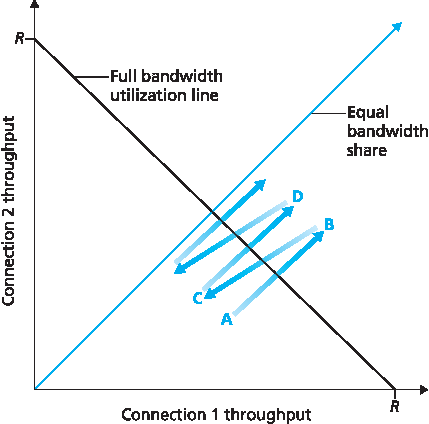
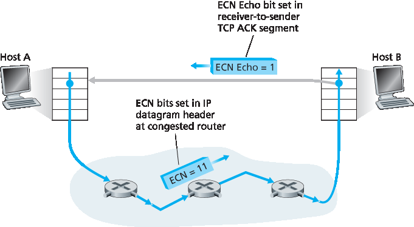

.. _c3.7:

3.7 TCP 拥塞控制
==================================================

3.7 TCP Congestion Control

.. tab:: 中文

.. tab:: 英文

&nbsp;
------------

In this section we return to our study of TCP. As we learned in :ref:`Section 3.5 <c3.5>`, TCP provides a reliable transport service between two processes running on different hosts. Another key component of TCP is its congestion-control mechanism. As indicated in the previous section, TCP must use end-to-end congestion control rather than network-assisted congestion control, since the IP layer provides no explicit feedback to the end systems regarding network congestion.

The approach taken by TCP is to have each sender limit the rate at which it sends traffic into its connection as a function of perceived network congestion. If a TCP sender perceives that there is little congestion on the path between itself and the destination, then the TCP sender increases its send rate; if the sender perceives that there is congestion along the path, then the sender reduces its send rate. But this approach raises three questions. First, how does a TCP sender limit the rate at which it sends traffic into its connection? Second, how does a TCP sender perceive that there is congestion on the path between itself and the destination? And third, what algorithm should the sender use to change its send rate as a function of perceived end-to-end congestion?

Let’s first examine how a TCP sender limits the rate at which it sends traffic into its connection. In :ref:`Section 3.5 <c3.5>` we saw that each side of a TCP connection consists of a receive buffer, a send buffer, and several variables ``(LastByteRead, rwnd, and so on)``. The TCP congestion-control mechanism operating at the sender keeps track of an additional variable, the **congestion window**. The congestion window, denoted ``cwnd``, imposes a constraint on the rate at which a TCP sender can send traffic into the network. Specifically, the amount of unacknowledged data at a sender may not exceed the minimum of ``cwnd`` and ``rwnd``, that is:

    LastByteSent−LastByteAcked≤min{cwnd, rwnd}

In order to focus on congestion control (as opposed to flow control), let us henceforth assume that the TCP receive buffer is so large that the receive-window constraint can be ignored; thus, the amount of unacknowledged data at the sender is solely limited by ``cwnd``. We will also assume that the sender always has data to send, i.e., that all segments in the congestion window are sent.

The constraint above limits the amount of unacknowledged data at the sender and therefore indirectly limits the sender’s send rate. To see this, consider a connection for which loss and packet transmission delays are negligible. Then, roughly, at the beginning of every RTT, the constraint permits the sender to send ``cwnd`` bytes of data into the connection; at the end of the RTT the sender receives acknowledgments for the data. Thus the sender’s send rate is roughly cwnd/RTT bytes/sec. By adjusting the value of ``cwnd``, the sender can therefore adjust the rate at which it sends data into its connection.

Let’s next consider how a TCP sender perceives that there is congestion on the path between itself and the destination. Let us define a “loss event” at a TCP sender as the occurrence of either a timeout or the receipt of three duplicate ACKs from the receiver. (Recall our discussion in :ref:`Section 3.5.4 <c3.5.4>` of the timeout event in :ref:`Figure 3.33 <Figure 3.33>` and the subsequent modification to include fast retransmit on receipt of three duplicate ACKs.) When there is excessive congestion, then one (or more) router buffers along the path overflows, causing a datagram (containing a TCP segment) to be dropped. The dropped datagram, in turn, results in a loss event at the sender—either a timeout or the receipt of three duplicate ACKs— which is taken by the sender to be an indication of congestion on the sender-to-receiver path.

Having considered how congestion is detected, let’s next consider the more optimistic case when the network is congestion-free, that is, when a loss event doesn’t occur. In this case, acknowledgments for previously unacknowledged segments will be received at the TCP sender. As we’ll see, TCP will take the arrival of these acknowledgments as an indication that all is well—that segments being transmitted into the network are being successfully delivered to the destination—and will use acknowledgments to increase its congestion window size (and hence its transmission rate). Note that if acknowledgments arrive at a relatively slow rate (e.g., if the end-end path has high delay or contains a low-bandwidth link), then the congestion window will be increased at a relatively slow rate. On the other hand, if acknowledgments arrive at a high rate, then the congestion window will be increased more quickly. Because TCP uses acknowledgments to trigger (or clock) its increase in congestion window size, TCP is said to be **self-clocking**.

Given the mechanism of adjusting the value of cwnd to control the sending rate, the critical question remains: How should a TCP sender determine the rate at which it should send? If TCP senders collectively send too fast, they can congest the network, leading to the type of congestion collapse that we saw in :ref:`Figure 3.48 <Figure 3.48>`. Indeed, the version of TCP that we’ll study shortly was developed in response to observed Internet congestion collapse :ref:`[Jacobson 1988] <Jacobson 1988>` under earlier versions of TCP. However, if TCP senders are too cautious and send too slowly, they could under utilize the bandwidth in the network; that is, the TCP senders could send at a higher rate without congesting the network. How then do the TCP senders determine their sending rates such that they don’t congest the network but at the same time make use of all the available bandwidth? Are TCP senders explicitly coordinated, or is there a distributed approach in which the TCP senders can set their sending rates based only on local information? TCP answers these questions using the following guiding principles:

- **A lost segment implies congestion, and hence, the TCP sender’s rate should be decreased when a segment is lost**. Recall from our discussion in :ref:`Section 3.5.4 <c3.5.4>`, that a timeout event or the receipt of four acknowledgments for a given segment (one original ACK and then three duplicate ACKs) is interpreted as an implicit “loss event” indication of the segment following the quadruply ACKed segment, triggering a retransmission of the lost segment. From a congestion-control standpoint, the question is how the TCP sender should decrease its congestion window size, and hence its sending rate, in response to this inferred loss event.
- **An acknowledged segment indicates that the network is delivering the sender’s segments to the receiver, and hence, the sender’s rate can be increased when an ACK arrives for a previously unacknowledged segment**. The arrival of acknowledgments is taken as an implicit indication that all is well—segments are being successfully delivered from sender to receiver, and the network is thus not congested. The congestion window size can thus be increased.
- **Bandwidth probing**. Given ACKs indicating a congestion-free source-to-destination path and loss events indicating a congested path, TCP’s strategy for adjusting its transmission rate is to increase its rate in response to arriving ACKs until a loss event occurs, at which point, the transmission rate is decreased. The TCP sender thus increases its transmission rate to probe for the rate that at which congestion onset begins, backs off from that rate, and then to begins probing again to see if the congestion onset rate has changed. The TCP sender’s behavior is perhaps analogous to the child who requests (and gets) more and more goodies until finally he/she is finally told “No!”, backs off a bit, but then begins making requests again shortly afterwards. Note that there is no explicit signaling of congestion state by the network—ACKs and loss events serve as implicit signals—and that each TCP sender acts on local information asynchronously from other TCP senders.

Given this overview of TCP congestion control, we’re now in a position to consider the details of the celebrated **TCP congestion-control algorithm**, which was first described in :ref:`[Jacobson 1988] <Jacobson 1988>` and is standardized in :ref:`[RFC 5681] <RFC 5681>`. The algorithm has three major components: (1) slow start, (2) congestion avoidance, and (3) fast recovery. Slow start and congestion avoidance are mandatory components of TCP, differing in how they increase the size of ``cwnd`` in response to received ACKs. We’ll see shortly that slow start increases the size of ``cwnd`` more rapidly (despite its name!) than congestion avoidance. Fast recovery is recommended, but not required, for TCP senders.

Slow Start
~~~~~~~~~~~~~

When a TCP connection begins, the value of ``cwnd`` is typically initialized to a small value of 1 MSS :ref:`[RFC 3390] <RFC 3390>`, resulting in an initial sending rate of roughly MSS/RTT. For example, if MSS = 500 bytes and RTT = 200 msec, the resulting initial sending rate is only about 20 kbps. Since the available bandwidth to the TCP sender may be much larger than MSS/RTT, the TCP sender would like to find the amount of available bandwidth quickly. Thus, in the **slow-start** state, the value of ``cwnd`` begins at 1 MSS and increases by 1 MSS every time a transmitted segment is first acknowledged. In the example of :ref:`Figure 3.50 <Figure 3.50>`, TCP sends the first segment into the network and waits for an acknowledgment. When this acknowledgment arrives, the TCP sender increases the congestion window by one MSS and sends out two maximum-sized segments. These segments are then acknowledged, with the sender increasing the congestion window by 1 MSS for each of the acknowledged segments, giving a congestion window of 4 MSS, and so on. This process results in a doubling of the sending rate every RTT. Thus, the TCP send rate starts slow but grows exponentially during the slow start phase.

.. figure:: ../img/314-0.png

.. _Figure 3.50:

**Figure 3.50 TCP slow start**

But when should this exponential growth end? Slow start provides several answers to this question. First, if there is a loss event (i.e., congestion) indicated by a timeout, the TCP sender sets the value of ``cwnd`` to 1 and begins the slow start process anew. It also sets the value of a second state variable, ``ssthresh`` (shorthand for “slow start threshold”) to ``cwnd/2``—half of the value of the congestion window value when congestion was detected. The second way in which slow start may end is directly tied to the value of ``ssthresh``. Since ``ssthresh`` is half the value of ``cwnd`` when congestion was last detected, it might be a bit reckless to keep doubling ``cwnd`` when it reaches or surpasses the value of ``ssthresh``. Thus, when the value of ``cwnd`` equals ``ssthresh``, slow start ends and TCP transitions into congestion avoidance mode. As we’ll see, TCP increases ``cwnd`` more cautiously when in congestion-avoidance mode. The final way in which slow start can end is if three duplicate ACKs are detected, in which case TCP performs a fast retransmit (see :ref:`Section 3.5.4 <c3.5.4>`) and enters the fast recovery state, as discussed below. TCP’s behavior in slow start is summarized in the FSM description of TCP congestion control in :ref:`Figure 3.51 <Figure 3.51>`. The slow-start algorithm traces it roots to :ref:`[Jacobson 1988] <Jacobson 1988>`; an approach similar to slow start was also proposed independently in :ref:`[Jain 1986] <Jain 1986>`.

Congestion Avoidance
~~~~~~~~~~~~~~~~~~~~~~

On entry to the congestion-avoidance state, the value of ``cwnd`` is approximately half its value when congestion was last encountered—congestion could be just around the corner! Thus, rather than
doubling the value of ``cwnd`` every RTT, TCP adopts a more conservative approach and increases the value of ``cwnd`` by just a single MSS every RTT :ref:`[RFC 5681] <RFC 5681>`. This can be accomplished in several ways. A common approach is for the TCP sender to increase ``cwnd`` by MSS bytes (MSS/``cwnd``) whenever a
new acknowledgment arrives. For example, if MSS is 1,460 bytes and ``cwnd`` is 14,600 bytes, then 10 segments are being sent within an RTT. Each arriving ACK (assuming one ACK per segment) increases the congestion window size by 1/10 MSS, and thus, the value of the congestion window will have increased by one MSS after ACKs when all 10 segments have been received.

But when should congestion avoidance’s linear increase (of 1 MSS per RTT) end? TCP’s congestion- avoidance algorithm behaves the same when a timeout occurs. As in the case of slow start: The value of ``cwnd`` is set to 1 MSS, and the value of ``ssthresh`` is updated to half the value of ``cwnd`` when the loss event occurred. Recall, however, that a loss event also can be triggered by a triple duplicate ACK event.

.. figure:: ../img/316-0.png 
   :align: center

.. _Figure 3.51:

**Figure 3.51 FSM description of TCP congestion control**

In this case, the network is continuing to deliver segments from sender to receiver (as indicated by the receipt of duplicate ACKs). So TCP’s behavior to this type of loss event should be less drastic than with a timeout-indicated loss: TCP halves the value of ``cwnd`` (adding in 3 MSS for good measure to account for the triple duplicate ACKs received) and records the value of ``ssthresh`` to be half the value of ``cwnd`` when the triple duplicate ACKs were received. The fast-recovery state is then entered.

Fast Recovery
~~~~~~~~~~~~~~~~~

In fast recovery, the value of ``cwnd`` is increased by 1 MSS for every duplicate ACK received for the missing segment that caused TCP to enter the fast-recovery state. Eventually, when an ACK arrives for the missing segment, TCP enters the congestion-avoidance state after deflating ``cwnd``. If a timeout event occurs, fast recovery transitions to the slow-start state after performing the same actions as in slow start and congestion avoidance: The value of ``cwnd`` is set to 1 MSS, and the value of ``ssthresh`` is set to half the value of ``cwnd`` when the loss event occurred.

.. figure:: ../img/videonote.png
   :align: center 

**Examining the behavior of TCP**

.. admonition:: PRINCIPLES IN PRACTICE

    TCP SPLITTING: OPTIMIZING THE PERFORMANCE OF CLOUD SERVICES

    For cloud services such as search, e-mail, and social networks, it is desirable to provide a high- level of responsiveness, ideally giving users the illusion that the services are running within their own end systems (including their smartphones). This can be a major challenge, as users are often located far away from the data centers responsible for serving the dynamic content associated with the cloud services. Indeed, if the end system is far from a data center, then the RTT will be large, potentially leading to poor response time performance due to TCP slow start.

    As a case study, consider the delay in receiving a response for a search query. Typically, the server requires three TCP windows during slow start to deliver the response :ref:`[Pathak 2010] <Pathak 2010>`. Thus the time from when an end system initiates a TCP connection until the time when it receives the last packet of the response is roughly 4⋅RTT (one RTT to set up the TCP connection plus three RTTs for the three windows of data) plus the processing time in the data center. These RTT delays can lead to a noticeable delay in returning search results for a significant fraction of queries. Moreover, there can be significant packet loss in access networks, leading to TCP retransmissions and even larger delays.

    One way to mitigate this problem and improve user-perceived performance is to (1) deploy front- end servers closer to the users, and (2) utilize TCP splitting by breaking the TCP connection at the front-end server. With **TCP splitting**, the client establishes a TCP connection to the nearby front-end, and the front-end maintains a persistent TCP connection to the data center with a very large TCP congestion window [:ref:`Tariq 2008 <Tariq 2008>`, :ref:`Pathak 2010 <Pathak 2010>`, :ref:`Chen 2011 <Chen 2011>`]. With this approach, the response time roughly becomes 4⋅RTTFE+RTTBE+ processing time, where RTTFE is the round- trip time between client and front-end server, and RTTBE is the round-trip time between the front- end server and the data center (back-end server). If the front-end server is close to client, then this response time approximately becomes RTT plus processing time, since RTTFE is negligibly small and RTTBE is approximately RTT. In summary, TCP splitting can reduce the networking delay roughly from 4⋅RTT to RTT, significantly improving user-perceived performance, particularly for users who are far from the nearest data center. TCP splitting also helps reduce TCP retransmission delays caused by losses in access networks. Google and Akamai have made extensive use of their CDN servers in access networks (recall our discussion in :ref:`Section 2.6 <c2.6>`) to perform TCP splitting for the cloud services they support :ref:`[Chen 2011] <Chen 2011>`.

Fast recovery is a recommended, but not required, component of TCP :ref:`RFC 5681 <RFC 5681>`. It is interesting that an early version of TCP, known as **TCP Tahoe**, unconditionally cut its congestion window to 1 MSS and entered the slow-start phase after either a timeout-indicated or triple-duplicate-ACK-indicated loss event. The newer version of TCP, **TCP Reno**, incorporated fast recovery.

:ref:`Figure 3.52 <Figure 3.52>` illustrates the evolution of TCP’s congestion window for both Reno and Tahoe. In this figure, the threshold is initially equal to 8 MSS. For the first eight transmission rounds, Tahoe and Reno take identical actions. The congestion window climbs exponentially fast during slow start and hits the threshold at the fourth round of transmission. The congestion window then climbs linearly until a triple duplicate- ACK event occurs, just after transmission round 8. Note that the congestion window is 12⋅MSS when this loss event occurs. The value of ``ssthresh`` is then set to 0.5⋅ ``cwnd`` =6⋅MSS. Under TCP Reno, the congestion window is set to ``cwnd`` = 9⋅MSS and then grows linearly. Under TCP Tahoe, the congestion window is set to 1 MSS and grows exponentially until it reaches the value of ``ssthresh``, at which point it grows linearly.

:ref:`Figure 3.51 <Figure 3.51>` presents the complete FSM description of TCP’s congestion-control algorithms—slow start, congestion avoidance, and fast recovery. The figure also indicates where transmission of new segments
or retransmitted segments can occur. Although it is important to distinguish between TCP error control/retransmission and TCP congestion control, it’s also important to appreciate how these two aspects of TCP are inextricably linked.

TCP Congestion Control: Retrospective
~~~~~~~~~~~~~~~~~~~~~~~~~~~~~~~~~~~~~~~~~~~~~~~~

Having delved into the details of slow start, congestion avoidance, and fast recovery, it’s worthwhile to now step back and view the forest from the trees. Ignoring the initial slow-start period when a connection begins and assuming that losses are indicated by triple duplicate ACKs rather than timeouts, TCP’s congestion control consists of linear (additive) increase in ``cwnd`` of 1 MSS per RTT and then a halving (multiplicative decrease) of ``cwnd`` on a triple duplicate-ACK event. For this reason, TCP congestion control is often referred to as an **additive-increase, multiplicative-decrease (AIMD)** form of congestion control. AIMD congestion control gives rise to the “saw tooth” behavior shown in :ref:`Figure 3.53 <Figure 3.53>`, which also nicely illustrates our earlier intuition of TCP “probing” for bandwidth—TCP linearly increases its congestion window size (and hence its transmission rate) until a triple duplicate-ACK event occurs. It then decreases its congestion window size by a factor of two but then again begins increasing it linearly, probing to see if there is additional available bandwidth.

.. figure:: ../img/319-0.png
   :align: center

.. _Figure 3.52:

**Figure 3.52 Evolution of TCP’s congestion window (Tahoe and Reno)**

.. figure:: ../img/319-1.png
   :align: center

.. _Figure 3.53:

**Figure 3.53 Additive-increase, multiplicative-decrease congestion control**

As noted previously, many TCP implementations use the Reno algorithm :ref:`[Padhye 2001] <Padhye 2001>`. Many variations of the Reno algorithm have been proposed [:ref:`RFC 3782 <RFC 3782>`; :ref:`RFC 2018 <RFC 2018>`]. The TCP Vegas algorithm [:ref:`Brakmo 1995 <Brakmo 1995>`; :ref:`Ahn 1995 <Ahn 1995>`] attempts to avoid congestion while maintaining good throughput. The basic idea of Vegas is to (1) detect congestion in the routers between source and destination before packet loss occurs, and (2) lower the rate linearly when this imminent packet loss is detected. Imminent packet loss is predicted by observing the RTT. The longer the RTT of the packets, the greater the congestion in the routers. As of late 2015, the Ubuntu Linux implementation of TCP provided slowstart, congestion avoidance, fast recovery, fast retransmit, and SACK, by default; alternative congestion control algorithms, such as TCP Vegas and BIC :ref:`[Xu 2004] <Xu 2004>`, are also provided. For a survey of the many flavors of TCP, see :ref:`[Afanasyev 2010] <Afanasyev 2010>`.

TCP’s AIMD algorithm was developed based on a tremendous amount of engineering insight and experimentation with congestion control in operational networks. Ten years after TCP’s development, theoretical analyses showed that TCP’s congestion-control algorithm serves as a distributed asynchronous-optimization algorithm that results in several important aspects of user and network performance being simultaneously optimized :ref:`[Kelly 1998] <Kelly 1998>`. A rich theory of congestion control has since been developed :ref:`[Srikant 2004] <Srikant 2004>`.

Macroscopic Description of TCP Throughput
~~~~~~~~~~~~~~~~~~~~~~~~~~~~~~~~~~~~~~~~~~

Given the saw-toothed behavior of TCP, it’s natural to consider what the average throughput (that is, the average rate) of a long-lived TCP connection might be. In this analysis we’ll ignore the slow-start phases that occur after timeout events. (These phases are typically very short, since the sender grows out of the phase exponentially fast.) During a particular round-trip interval, the rate at which TCP sends data is a function of the congestion window and the current RTT. When the window size is w bytes and the current round-trip time is RTT seconds, then TCP’s transmission rate is roughly w/RTT. TCP then probes for additional bandwidth by increasing w by 1 MSS each RTT until a loss event occurs. Denote by W the value of w when a loss event occurs. Assuming that RTT and W are approximately constant over the duration of the connection, the TCP transmission rate ranges from W/(2 · RTT) to W/RTT. These assumptions lead to a highly simplified macroscopic model for the steady-state behavior of TCP. The network drops a packet from the connection when the rate increases to W/RTT; the rate is then cut in half and then increases by MSS/RTT every RTT until it again reaches W/RTT. This process repeats itself over and over again. Because TCP’s throughput (that is, rate) increases linearly between the two extreme values, we have

    average throughput of a connection=0.75⋅WRTT

Using this highly idealized model for the steady-state dynamics of TCP, we can also derive an interesting expression that relates a connection’s loss rate to its available bandwidth :ref:`[Mahdavi 1997] <Mahdavi 1997>`. This derivation is outlined in the homework problems. A more sophisticated model that has been found empirically to agree with measured data is :ref:`[Padhye 2000] <Padhye 2000>`.

TCP Over High-Bandwidth Paths
~~~~~~~~~~~~~~~~~~~~~~~~~~~~~~

It is important to realize that TCP congestion control has evolved over the years and indeed continues to evolve. For a summary of current TCP variants and discussion of TCP evolution, see [ :ref:`Floyd 2001 <Floyd 2001>`, :ref:`RFC 5681 <RFC 5681>`, :ref:`Afanasyev 2010 <Afanasyev 2010>`]. What was good for the Internet when the bulk of the TCP connections carried SMTP, FTP, and Telnet traffic is not necessarily good for today’s HTTP-dominated Internet or for a future Internet with services that are still undreamed of.

The need for continued evolution of TCP can be illustrated by considering the high-speed TCP connections that are needed for grid- and cloud-computing applications. For example, consider a TCP connection with 1,500-byte segments and a 100 ms RTT, and suppose we want to send data through this connection at 10 Gbps. Following :ref:`[RFC 3649] <RFC 3649>`, we note that using the TCP throughput formula above, in order to achieve a 10 Gbps throughput, the average congestion window size would need to be 83,333 segments. That’s a lot of segments, leading us to be rather concerned that one of these 83,333 in-flight segments might be lost. What would happen in the case of a loss? Or, put another way, what fraction of the transmitted segments could be lost that would allow the TCP congestion-control algorithm specified in :ref:`Figure 3.51 <Figure 3.51>` still to achieve the desired 10 Gbps rate? In the homework questions for this chapter, you are led through the derivation of a formula relating the throughput of a TCP connection as a function of the loss rate (L), the round-trip time (RTT), and the maximum segment size (MSS): 

    average throughput of a connection=1.22⋅MSSRTTL

Using this formula, we can see that in order to achieve a throughput of 10 Gbps, today’s TCP congestion-control algorithm can only tolerate a segment loss probability of :math:`2 · 10^{–10}` (or equivalently, one loss event for every 5,000,000,000 segments)—a very low rate. This observation has led a number of researchers to investigate new versions of TCP that are specifically designed for such high-speed environments; see [ :ref:`Jin 2004 <Jin 2004>`; :ref:`Kelly 2003 <Kelly 2003>`; :ref:`Ha 2008 <Ha 2008>`; :ref:`RFC 7323 <RFC 7323>`] for discussions of these efforts.

.. _c3.7.1:

3.7.1 公平性
------------------------------------------------------------------------------------
3.7.1 Fairness

.. tab:: 中文

.. tab:: 英文

Consider K TCP connections, each with a different end-to-end path, but all passing through a bottleneck link with transmission rate R bps. (By *bottleneck link*, we mean that for each connection, all the other links along the connection’s path are not congested and have abundant transmission capacity as compared with the transmission capacity of the bottleneck link.) Suppose each connection is transferring a large file and there is no UDP traffic passing through the bottleneck link. A congestion-control mechanism is said to be fair if the average transmission rate of each connection is approximately R/K; that is, each connection gets an equal share of the link bandwidth.

Is TCP’s AIMD algorithm fair, particularly given that different TCP connections may start at different times and thus may have different window sizes at a given point in time? :ref:`[Chiu 1989] <Chiu 1989>` provides an elegant and intuitive explanation of why TCP congestion control converges to provide an equal share of a bottleneck link’s bandwidth among competing TCP connections.

Let’s consider the simple case of two TCP connections sharing a single link with transmission rate R, as shown in :ref:`Figure 3.54 <Figure 3.54>`. Assume that the two connections have the same MSS and RTT (so that if they have the same congestion window size, then they have the same throughput), that they have a large amount of data to send, and that no other TCP connections or UDP datagrams traverse this shared link. Also, ignore the slow-start phase of TCP and assume the TCP connections are operating in CA mode (AIMD) at all times.

.. _Figure 3.54:

**Figure 3.54 Two TCP connections sharing a single bottleneck link**

:ref:`Figure 3.55 <Figure 3.55>` plots the throughput realized by the two TCP connections. If TCP is to share the link bandwidth equally between the two connections, then the realized throughput should fall along the 45-degree arrow (equal bandwidth share) emanating from the origin. Ideally, the sum of the two throughputs should equal R. (Certainly, each connection receiving an equal, but zero, share of the link capacity is not a desirable situation!) So the goal should be to have the achieved throughputs fall somewhere near the intersection of the equal bandwidth share line and the full bandwidth utilization line in :ref:`Figure 3.55 <Figure 3.55>`.

Suppose that the TCP window sizes are such that at a given point in time, connections 1 and 2 realize throughputs indicated by point A in :ref:`Figure 3.55 <Figure 3.55>`. Because the amount of link bandwidth jointly consumed by the two connections is less than R, no loss will occur, and both connections will increase their window by 1 MSS per RTT as a result of TCP’s congestion-avoidance algorithm. Thus, the joint throughput of the two connections proceeds along a 45-degree line (equal increase for both connections) starting from point A. Eventually, the link bandwidth jointly consumed by the two connections will be greater than R, and eventually packet loss will occur. Suppose that connections 1 and 2 experience packet loss when they realize throughputs indicated by point B. Connections 1 and 2 then decrease their windows by a factor of two. The resulting throughputs realized are thus at point C, halfway along a vector starting at B and ending at the origin. Because the joint bandwidth use is less than R at point C, the two connections again increase their throughputs along a 45-degree line starting from C. Eventually, loss will again occur, for example, at point D, and the two connections again decrease their window sizes by a factor of two, and so on. You should convince yourself that the bandwidth realized by the two connections eventually fluctuates along the equal bandwidth share line. You should also convince yourself that the two connections will converge to this behavior regardless of where they are in the two- dimensional space! Although a number of idealized assumptions lie behind this scenario, it still provides an intuitive feel for why TCP results in an equal sharing of bandwidth among connections.

.. _Figure 3.55:

**Figure 3.55 Throughput realized by TCP connections 1 and 2**

In our idealized scenario, we assumed that only TCP connections traverse the bottleneck link, that the connections have the same RTT value, and that only a single TCP connection is associated with a host- destination pair. In practice, these conditions are typically not met, and client-server applications can thus obtain very unequal portions of link bandwidth. In particular, it has been shown that when multiple connections share a common bottleneck, those sessions with a smaller RTT are able to grab the available bandwidth at that link more quickly as it becomes free (that is, open their congestion windows
faster) and thus will enjoy higher throughput than those connections with larger RTTs :ref:`[Lakshman 1997] <Lakshman 1997>`.

Fairness and UDP
~~~~~~~~~~~~~~~~~~~~~~~~

We have just seen how TCP congestion control regulates an application’s transmission rate via the congestion window mechanism. Many multimedia applications, such as Internet phone and video conferencing, often do not run over TCP for this very reason—they do not want their transmission rate throttled, even if the network is very congested. Instead, these applications prefer to run over UDP, which does not have built-in congestion control. When running over UDP, applications can pump their audio and video into the network at a constant rate and occasionally lose packets, rather than reduce their rates to “fair” levels at times of congestion and not lose any packets. From the perspective of TCP, the multimedia applications running over UDP are not being fair—they do not cooperate with the other connections nor adjust their transmission rates appropriately. Because TCP congestion control will decrease its transmission rate in the face of increasing congestion (loss), while UDP sources need not, it is possible for UDP sources to crowd out TCP traffic. An area of research today is thus the development of congestion-control mechanisms for the Internet that prevent UDP traffic from bringing the Internet’s throughput to a grinding halt [:ref:`Floyd 1999 <Floyd 1999>`; :ref:`Floyd 2000 <Floyd 2000>`; :ref:`Kohler 2006 <Kohler 2006>`; :ref:`RFC 4340 <RFC 4340>`].

Fairness and Parallel TCP Connections
~~~~~~~~~~~~~~~~~~~~~~~~~~~~~~~~~~~~~~~~~~

But even if we could force UDP traffic to behave fairly, the fairness problem would still not be completely solved. This is because there is nothing to stop a TCP-based application from using multiple parallel connections. For example, Web browsers often use multiple parallel TCP connections to transfer the multiple objects within a Web page. (The exact number of multiple connections is configurable in most browsers.) When an application uses multiple parallel connections, it gets a larger fraction of the
bandwidth in a congested link. As an example, consider a link of rate R supporting nine ongoing client- server applications, with each of the applications using one TCP connection. If a new application comes
along and also uses one TCP connection, then each application gets approximately the same transmission rate of R/10. But if this new application instead uses 11 parallel TCP connections, then the
new application gets an unfair allocation of more than R/2. Because Web traffic is so pervasive in the Internet, multiple parallel connections are not uncommon.

.. _c3.7.2:

3.7.2 显式拥塞通知 (ECN): 网络辅助拥塞控制
------------------------------------------------------------------------------------
3.7.2 Explicit Congestion Notification (ECN): Network-assisted Congestion Control

.. tab:: 中文

.. tab:: 英文

Since the initial standardization of slow start and congestion avoidance in the late 1980’s :ref:`RFC 1122 <RFC 1122>`, TCP has implemented the form of end-end congestion control that we studied in :ref:`Section 3.7.1 <c3.7.1>`: a TCP sender receives no explicit congestion indications from the network layer, and instead infers congestion through observed packet loss. More recently, extensions to both IP and TCP :ref:`[RFC 3168] <RFC 3168>` have been proposed, implemented, and deployed that allow the network to explicitly signal congestion to a TCP sender and receiver. This form of network-assisted congestion control is known as **Explicit Congestion Notification**. As shown in :ref:`Figure 3.56 <Figure 3.56>`, the TCP and IP protocols are involved.

At the network layer, two bits (with four possible values, overall) in the Type of Service field of the IP datagram header (which we’ll discuss in :ref:`Section 4.3 <c4.3>`) are used for ECN. One setting of the ECN bits is used by a router to indicate that it (the router) is experiencing congestion. This congestion indication is then carried in the marked IP datagram to the destination host, which then informs the sending host, as shown in :ref:`Figure 3.56 <Figure 3.56>`. RFC 3168 does not provide a definition of when a router is congested; that decision is a configuration choice made possible by the router vendor, and decided by the network operator. However, RFC 3168 does recommend that an ECN congestion indication be set only in the face of persistent congestion. A second setting of the ECN bits is used by the sending host to inform routers that the sender and receiver are ECN-capable, and thus capable of taking action in response to ECN-indicated network congestion.

.. _Figure 3.56:

**Figure 3.56 Explicit Congestion Notification: network-assisted congestion control**

As shown in :ref:`Figure 3.56 <Figure 3.56>`, when the TCP in the receiving host receives an ECN congestion indication via a received datagram, the TCP in the receiving host informs the TCP in the sending host of the congestion indication by setting the ECE (Explicit Congestion Notification Echo) bit (see :ref:`Figure 3.29 <Figure 3.29>`) in a receiver-to-sender TCP ACK segment. The TCP sender, in turn, reacts to an ACK with an ECE congestion indication by halving the congestion window, as it would react to a lost segment using fast retransmit, and sets the CWR (Congestion Window Reduced) bit in the header of the next transmitted TCP sender-to-receiver segment. 

Other transport-layer protocols besides TCP may also make use of network-layer-signaled ECN. The Datagram Congestion Control Protocol (DCCP) :ref:`[RFC 4340] <RFC 4340>` provides a low-overhead, congestion-controlled UDP-like unreliable service that utilizes ECN. DCTCP (Data Center TCP) :ref:`[Alizadeh 2010] <Alizadeh 2010>`, a version of TCP designed specifically for data center networks, also makes use of ECN.

