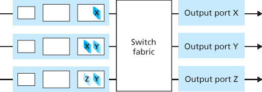

家庭作业问题和疑问
========================================

Homework Problems and Questions

SECTION 4.1
--------------

R1. 让我们回顾一下本教材中使用的一些术语。请回忆一下，传输层分组被称为 segment，链路层分组被称为 frame。那么网络层分组的名称是什么？还要记住，路由器和链路层交换机都被称为分组交换机。路由器和链路层交换机之间的根本区别是什么？

R2. 我们指出网络层的功能可以大致划分为数据平面功能和控制平面功能。数据平面的主要功能是什么？控制平面的主要功能又是什么？

R3. 我们区分了网络层中执行的转发功能与路由功能。路由与转发之间的关键区别是什么？

R4. 转发表在路由器中起什么作用？

R5. 我们说网络层的服务模型“定义了发送方和接收方主机之间端到端分组传输的特性”。互联网网络层的服务模型是什么？互联网的服务模型对主机到主机数据报传递做出了哪些保证？

.. toggle::

   R1. Let’s review some of the terminology used in this textbook. Recall that the name of a transport-layer packet is segment and that the name of a link-layer packet is frame. What is the name of a network-layer packet? Recall that both routers and link-layer switches are called packet switches. What is the fundamental difference between a router and link-layer switch?

   R2. We noted that network layer functionality can be broadly divided into data plane functionality and control plane functionality. What are the main functions of the data plane? Of the control plane?

   R3. We made a distinction between the forwarding function and the routing function performed in the network layer. What are the key differences between routing and forwarding?

   R4. What is the role of the forwarding table within a router?

   R5. We said that a network layer’s service model “defines the characteristics of end-to-end transport of packets between sending and receiving hosts.” What is the service model of the Internet’s network layer? What guarantees are made by the Internet’s service model regarding the host-to-host delivery of datagrams?

SECTION 4.2
-------------

R6. 在 :ref:`第 4.2 节 <c4.2>` 中，我们看到一个路由器通常由输入端口、输出端口、交换结构和路由处理器组成。其中哪些部分是硬件实现的，哪些是软件实现的？为什么？回到网络层数据平面和控制平面的概念，哪些由硬件实现，哪些由软件实现？为什么？

R7. 讨论一下为什么高速路由器的每个输入端口都会存储一份转发表的影子副本。

R8. 什么是基于目的地址的转发？它与通用转发有何不同（假设你已经阅读了 :ref:`第 4.4 节 <c4.4>`，这两种方式中哪一种被软件定义网络采用）？

R9. 假设到达的一个分组在路由器的转发表中匹配到两个或多个条目。使用传统的基于目的地址的转发时，路由器使用什么规则来决定应使用哪条规则将该分组切换到哪个输出端口？

R10. 在 :ref:`第 4.2 节 <c4.2>` 中讨论了三种类型的交换结构。列举并简要描述每种类型。是否有一种可以并行发送多个分组？

R11. 描述分组在输入端口处如何发生丢失。描述如何在不使用无限缓冲区的情况下消除输入端口处的分组丢失。

R12. 描述分组在输出端口处如何发生丢失。是否可以通过提高交换结构的速度来防止这种丢失？

R13. 什么是 HOL（Head-of-Line）阻塞？它发生在输入端口还是输出端口？

R14. 在 :ref:`第 4.2 节 <c4.2>` 中，我们学习了 FIFO、优先级、轮询（RR）和加权公平队列（WFQ）分组调度策略？这些队列策略中，哪些能保证所有分组按到达顺序离开？

R15. 给出一个示例说明为什么网络运营商可能希望某一类分组相对于另一类分组具有更高优先级。

R16. RR 与 WFQ 分组调度之间有一个本质的区别是什么？是否存在某种情况（提示：考虑 WFQ 的权重）使得 RR 和 WFQ 表现得完全一样？

.. toggle::

   R6. In :ref:`Section 4.2 <c4.2>` , we saw that a router typically consists of input ports, output ports, a switching fabric and a routing processor. Which of these are implemented in hardware and which are implemented in software? Why? Returning to the notion of the network layer’s data plane and control plane, which are implemented in hardware and which are implemented in software? Why?

   R7. Discuss why each input port in a high-speed router stores a shadow copy of the forwarding table.

   R8. What is meant by destination-based forwarding? How does this differ from generalized forwarding (assuming you’ve read :ref:`Section 4.4 <c4.4>` , which of the two approaches are adopted by Software-Defined Networking)?

   R9. Suppose that an arriving packet matches two or more entries in a router’s forwarding table. With traditional destination-based forwarding, what rule does a router apply to determine which of these rules should be applied to determine the output port to which the arriving packet should be switched?

   R10. Three types of switching fabrics are discussed in :ref:`Section 4.2 <c4.2>` . List and briefly describe each type. Which, if any, can send multiple packets across the fabric in parallel?

   R11. Describe how packet loss can occur at input ports. Describe how packet loss at input ports can be eliminated (without using infinite buffers).

   R12. Describe how packet loss can occur at output ports. Can this loss be prevented by increasing the switch fabric speed?

   R13. What is HOL blocking? Does it occur in input ports or output ports?

   R14. In :ref:`Section 4.2 <c4.2>` , we studied FIFO, Priority, Round Robin (RR), and Weighted Fair Queueing (WFQ) packet scheduling disciplines? Which of these queueing disciplines ensure that all packets depart in the order in which they arrived?

   R15. Give an example showing why a network operator might want one class of packets to be given priority over another class of packets.

   R16. What is an essential different between RR and WFQ packet scheduling? Is there a case (Hint: Consider the WFQ weights) where RR and WFQ will behave exactly the same?

SECTION 4.3
-------------

R17. 假设主机 A 发送给主机 B 一个封装在 IP 数据报中的 TCP 段。当主机 B 接收到该数据报时，其网络层是如何知道应将该段（即数据报的有效载荷）交给 TCP 而不是 UDP 或其他上层协议的？

R18. IP 首部中的哪个字段可用于确保一个分组最多只能经过 N 个路由器？

R19. 回忆我们在传输层段（在 UDP 和 TCP 首部中，参见 :ref:`图 3.7 <Figure 3.7>` 和 :ref:`图 3.29 <Figure 3.29>`）和网络层数据报（IP 首部，参见 :ref:`图 4.16 <Figure 4.16>`）中都见到了互联网校验和。现在考虑一个封装在 IP 数据报中的传输层段。段首部中的校验和和数据报首部中的校验和是否是针对 IP 数据报中任何公共字节计算的？请解释你的答案。

R20. 当一个大的数据报被分片成多个小的数据报时，这些小数据报在何处重新组装为一个大的数据报？

R21. 路由器是否有 IP 地址？如果有，有几个？

R22. IP 地址 223.1.3.27 的 32 位二进制等价形式是什么？

R23. 访问一个使用 DHCP 获取其 IP 地址、网络掩码、默认路由器和本地 DNS 服务器 IP 地址的主机。列出这些值。

R24. 假设在源主机和目的主机之间有三个路由器。忽略分片，一个从源主机发送到目的主机的 IP 数据报将经过多少个接口？该数据报将索引多少个转发表以从源到达目的地？

R25. 假设一个应用每 20 毫秒生成一块 40 字节的数据，每块数据被封装为一个 TCP 段，然后是 IP 数据报。每个数据报中有百分之多少是开销，有百分之多少是应用数据？

R26. 假设你购买了一个无线路由器并将其连接到你的有线调制解调器。还假设你的 ISP 动态分配给你连接的设备（即你的无线路由器）一个 IP 地址。再假设你家有五台 PC 使用 802.11 无线连接到该无线路由器。这五台 PC 的 IP 地址是如何分配的？无线路由器是否使用 NAT？为什么或为什么不？

R27. “路由聚合”这一术语是什么意思？为什么路由器执行路由聚合是有用的？

R28. 什么是“即插即用”或“零配置（zeroconf）”协议？

R29. 什么是私有网络地址？带有私有网络地址的数据报是否应该出现在更大的公共互联网上？请解释。

R30. 比较和对比 IPv4 和 IPv6 的首部字段。它们有任何共同字段吗？

R31. 有人说当 IPv6 通过 IPv4 路由器进行隧道传输时，IPv6 将 IPv4 隧道视为链路层协议。你是否同意这种说法？为什么或为什么不？

.. toggle::

   R17. Suppose Host A sends Host B a TCP segment encapsulated in an IP datagram. When Host B receives the datagram, how does the network layer in Host B know it should pass the segment (that is, the payload of the datagram) to TCP rather than to UDP or to some other upper-layer protocol?

   R18. What field in the IP header can be used to ensure that a packet is forwarded through no more than N routers?

   R19. Recall that we saw the Internet checksum being used in both transport-layer segment (in UDP and TCP headers, :ref:`Figures 3.7 <Figure 3.7>` and :ref:`3.29 <Figure 3.29>` respectively) and in network-layer datagrams (IP header, :ref:`Figure 4.16 <Figure 4.16>` ). Now consider a transport layer segment encapsulated in an IP datagram. Are the checksums in the segment header and datagram header computed over any common bytes in the IP datagram? Explain your answer.

   R20. When a large datagram is fragmented into multiple smaller datagrams, where are these smaller datagrams reassembled into a single larger datagram?

   R21. Do routers have IP addresses? If so, how many?

   R22. What is the 32-bit binary equivalent of the IP address 223.1.3.27?

   R23. Visit a host that uses DHCP to obtain its IP address, network mask, default router, and IP address of its local DNS server. List these values.

   R24. Suppose there are three routers between a source host and a destination host. Ignoring fragmentation, an IP datagram sent from the source host to the destination host will travel over how many interfaces? How many forwarding tables will be indexed to move the datagram from the source to the ­destination?
   
   R25. Suppose an application generates chunks of 40 bytes of data every 20 msec, and each chunk gets encapsulated in a TCP segment and then an IP datagram. What percentage of each datagram will be overhead, and what percentage will be application data?

   R26. Suppose you purchase a wireless router and connect it to your cable modem. Also suppose that your ISP dynamically assigns your connected device (that is, your wireless router) one IP address. Also suppose that you have five PCs at home that use 802.11 to wirelessly connect to your wireless router. How are IP addresses assigned to the five PCs? Does the wireless router use NAT? Why or why not?

   R27. What is meant by the term “route aggregation”? Why is it useful for a router to perform route aggregation?

   R28. What is meant by a “plug-and-play” or “zeroconf” protocol?

   R29. What is a private network address? Should a datagram with a private network address ever be present in the larger public Internet? Explain.

   R30. Compare and contrast the IPv4 and the IPv6 header fields. Do they have any fields in common?

   R31. It has been said that when IPv6 tunnels through IPv4 routers, IPv6 treats the IPv4 tunnels as link-layer protocols. Do you agree with this statement? Why or why not?

SECTION 4.4
-------------

R32. 通用转发与基于目的地址的转发有何不同？

R33. 我们在 :ref:`第 4.1 节 <c4.1>` 中遇到的基于目的地址的转发中使用的转发表与我们在 :ref:`第 4.4 节 <c4.4>` 中遇到的 OpenFlow 流表之间有何区别？

R34. 路由器或交换机的“匹配加动作（match plus action）”操作是什么意思？在基于目的地址的转发分组交换机中，匹配的内容是什么，采取的动作是什么？在 SDN 的场景中，请列举三个可以匹配的字段，以及三个可以采取的动作。

R35. 在 IP 数据报中，列举三个可以在 OpenFlow 1.0 通用转发中“匹配”的首部字段。再列举三个 *不能* 被 OpenFlow 匹配的 IP 数据报首部字段。

.. toggle::

   R32. How does generalized forwarding differ from destination-based ­forwarding?

   R33. What is the difference between a forwarding table that we encountered in destination-based forwarding in :ref:`Section 4.1 <c4.1>` and OpenFlow’s flow table that we encountered in :ref:`Section 4.4 <c4.4>` ?

   R34. What is meant by the “match plus action” operation of a router or switch? In the case of destination-based forwarding packet switch, what is matched and what is the action taken? In the case of an SDN, name three fields that can be matched, and three actions that can be taken. 
   
   R35. Name three header fields in an IP datagram that can be “matched” in OpenFlow 1.0 generalized forwarding. What are three IP datagram header fields that *cannot* be “matched” in OpenFlow?

Problems
----------

P1. 考虑下图所示的网络。

a. 给出路由器 A 的转发表，使得所有发往主机 H3 的流量都通过接口 3 转发。  
b. 你能否写出路由器 A 的转发表，使得来自 H1 的所有发往 H3 的流量都通过接口 3 转发，而来自 H2 的所有发往 H3 的流量都通过接口 4 转发？（提示：这是一个陷阱问题。）

   .. image:: ../img/414-0.png

.. toggle::

   P1. Consider the network below.

   a. Show the forwarding table in router A, such that all traffic destined to host H3 is forwarded through interface 3.
   b. Can you write down a forwarding table in router A, such that all traffic from H1 destined to host H3 is forwarded through interface 3, while all traffic from H2 destined to host H3 is forwarded through interface 4? (Hint: This is a trick question.)

      .. image:: ../img/414-0.png

P2. 假设有两个分组恰好同时到达路由器的两个不同输入端口。还假设路由器中没有其他分组存在。

a. 假设这两个分组将被转发到两个不同的输出端口。如果交换结构使用共享总线，是否有可能同时通过交换结构转发这两个分组？  
b. 假设这两个分组将被转发到两个不同的输出端口。如果交换结构使用内存交换，是否有可能同时通过交换结构转发这两个分组？  
c. 假设这两个分组将被转发到同一个输出端口。如果交换结构使用交叉开关，是否有可能同时通过交换结构转发这两个分组？

.. toggle::

   P2. Suppose two packets arrive to two different input ports of a router at exactly the same time. Also suppose there are no other packets anywhere in the router.

   a. Suppose the two packets are to be forwarded to two different output ports. Is it possible to forward the two packets through the switch fabric at the same time when the fabric uses a shared bus?
   b. Suppose the two packets are to be forwarded to two different output ports. Is it possible to forward the two packets through the switch fabric at the same time when the fabric uses switching via memory?
   c. Suppose the two packets are to be forwarded to the same output port. Is it possible to forward the two packets through the switch fabric at the same time when the fabric uses a crossbar?

P3. 在 :ref:`第 4.2 节 <c4.2>` 中，我们指出如果交换结构的速度是输入链路速率的 n 倍，则最大排队延迟为 (n–1)D。假设所有分组长度相同，n 个分组同时到达 n 个输入端口，且这 n 个分组希望被转发到不同的输出端口。那么，在 (a) 内存、(b) 总线 和 (c) 交叉开关 这三种交换结构中，一个分组的最大延迟是多少？

.. toggle::

   P3. In :ref:`Section 4.2 <c4.2>` , we noted that the maximum queuing delay is (n–1)D if the switching fabric is n times faster than the input line rates. Suppose that all packets are of the same length, n packets arrive at the same time to the n input ports, and all n packets want to be forwarded to different output ports. What is the maximum delay for a packet for the (a) memory, (b) bus, and (c) crossbar switching fabrics?

P4. 考虑下图所示的交换结构。假设所有数据报长度相同，交换结构以分时同步方式工作，一个时间槽中可以将一个数据报从输入端口传送到输出端口。该交换结构是交叉开关，因此在一个时间槽中，一个输出端口最多接收一个数据报，但不同的输出端口可以从不同的输入端口接收数据报。在你可以选择任意输入队列调度顺序（即不需要 HOL 阻塞）的前提下，从输入端口将图中数据报传送到其目标输出端口所需的最少时间槽数是多少？在你能设计出的最坏调度顺序下（假设非空输入队列从不闲置），所需的最多时间槽数是多少？

.. toggle::

   P4. Consider the switch shown below. Suppose that all datagrams have the same fixed length, that the switch operates in a slotted, synchronous manner, and that in one time slot a datagram can be transferred from an input port to an output port. The switch fabric is a crossbar so that at most one datagram can be transferred to a given output port in a time slot, but different output ports can receive datagrams from different input ports in a single time slot. What is the minimal number of time slots needed to transfer the packets shown from input ports to their output ports, assuming any input queue scheduling order you want (i.e., it need not have HOL blocking)? What is the largest number of slots needed, assuming the worst-case scheduling order you can devise, assuming that a non-empty input queue is never idle?

   .. image:: ../img/415-0.png

P5. 考虑一个使用 32 位主机地址的数据报网络。假设某路由器有四个链路，编号为 0 至 3，数据报将被转发到如下链路接口：

+-----------------------------------------------------------+------------------+
| 目的地址范围                                              | 链路接口         |
+===========================================================+==================+
| 11100000 00000000 00000000 00000000                       |                  |
+-----------------------------------------------------------+                  +
| 到                                                        | 0                |
+-----------------------------------------------------------+                  +
| 11100000 00111111 11111111 11111111                       |                  |
+-----------------------------------------------------------+------------------+
| 11100000 01000000 00000000 00000000                       |                  |
+-----------------------------------------------------------+                  +
| 到                                                        | 1                |
+-----------------------------------------------------------+                  +
| 11100000 01000000 11111111 11111111                       |                  |
+-----------------------------------------------------------+------------------+
| 11100000 01000001 00000000 00000000                       |                  |
+-----------------------------------------------------------+                  +
| 到                                                        | 2                |
+-----------------------------------------------------------+                  +
| 11100001 01111111 11111111 11111111                       |                  |
+-----------------------------------------------------------+------------------+
| 其他                                                      | 3                |
+-----------------------------------------------------------+------------------+

a. 提供一个包含五条项的转发表，使用最长前缀匹配，将数据报正确转发到相应链路接口。  
b. 描述你的转发表如何确定以下三个目的地址的数据报所对应的链路接口：

   .. code:: text

      11001000 10010001 01010001 01010101 
      11100001 01000000 11000011 00111100 
      11100001 10000000 00010001 01110111

.. toggle::

   P5. Consider a datagram network using 32-bit host addresses. Suppose a router has four links, numbered 0 through 3, and packets are to be forwarded to the link interfaces as follows:
   
   +-----------------------------------------------------------+------------------+
   | Destination Address Range                                 | Link Interface   |
   +===========================================================+==================+
   | 11100000 00000000 00000000 00000000                       |                  |
   +-----------------------------------------------------------+                  +
   | through                                                   | 0                |
   +-----------------------------------------------------------+                  +
   | 11100000 00111111 11111111 11111111                       |                  |
   +-----------------------------------------------------------+------------------+
   | 11100000 01000000 00000000 00000000                       |                  |
   +-----------------------------------------------------------+                  +
   | through                                                   | 1                |
   +-----------------------------------------------------------+                  +
   | 11100000 01000000 11111111 11111111                       |                  |
   +-----------------------------------------------------------+------------------+
   | 11100000 01000001 00000000 00000000                       |                  |
   +-----------------------------------------------------------+                  +
   | through                                                   | 2                |
   +-----------------------------------------------------------+                  +
   | 11100001 01111111 11111111 11111111                       |                  |
   +-----------------------------------------------------------+------------------+
   | otherwise                                                 | 3                |
   +-----------------------------------------------------------+------------------+
   
   a. Provide a forwarding table that has five entries, uses longest prefix matching, and forwards packets to the correct link interfaces.
   b. Describe how your forwarding table determines the appropriate link interface for datagrams with destination addresses:
      
      .. code:: text
   
         11001000 10010001 01010001 01010101 
         11100001 01000000 11000011 00111100 
         11100001 10000000 00010001 01110111

P6. 考虑一个使用 8 位主机地址的数据报网络。假设路由器使用最长前缀匹配，转发表如下：

+-----------------------------------+-------------+
| 前缀匹配                          | 接口        |
+===================================+=============+
| 00                                | 0           | 
+-----------------------------------+-------------+
| 010                               | 1           | 
+-----------------------------------+-------------+
| 011                               | 2           | 
+-----------------------------------+-------------+
| 10                                | 2           | 
+-----------------------------------+-------------+
| 11                                | 3           | 
+-----------------------------------+-------------+

对于每个接口，给出其对应的目的主机地址范围和该范围内地址的数量。

.. toggle::

   P6. Consider a datagram network using 8-bit host addresses. Suppose a router uses longest prefix matching and has the following forwarding table:
   
   +-----------------------------------+-------------+
   | Prefix Match                      | Interface   |
   +===================================+=============+
   | 00                                | 0           | 
   +-----------------------------------+-------------+
   | 010                               | 1           | 
   +-----------------------------------+-------------+
   | 011                               | 2           | 
   +-----------------------------------+-------------+
   | 10                                | 2           | 
   +-----------------------------------+-------------+
   | 11                                | 3           | 
   +-----------------------------------+-------------+
   
   For each of the four interfaces, give the associated range of destination host addresses and the number of addresses in the range.

P7. 考虑一个使用 8 位主机地址的数据报网络。假设路由器使用最长前缀匹配，转发表如下：

+-----------------------------------+-------------+
| 前缀匹配                          | 接口        |
+===================================+=============+
| 1                                 | 0           | 
+-----------------------------------+-------------+
| 10                                | 1           | 
+-----------------------------------+-------------+
| 111                               | 2           | 
+-----------------------------------+-------------+
| 其他                              | 3           | 
+-----------------------------------+-------------+

对于每个接口，给出其对应的目的主机地址范围和该范围内地址的数量。

.. toggle::

   P7. Consider a datagram network using 8-bit host addresses. Suppose a router uses longest prefix matching and has the following forwarding table:
   
   +-----------------------------------+-------------+
   | Prefix Match                      | Interface   |
   +===================================+=============+
   | 1                                 | 0           | 
   +-----------------------------------+-------------+
   | 10                                | 1           | 
   +-----------------------------------+-------------+
   | 111                               | 2           | 
   +-----------------------------------+-------------+
   | otherwise                         | 3           | 
   +-----------------------------------+-------------+
   
   For each of the four interfaces, give the associated range of destination host addresses and the number of addresses in the range.

P8. 考虑一个连接三个子网的路由器：子网 1、子网 2 和子网 3。假设这三个子网中的所有接口都必须使用前缀 223.1.17/24。还假设子网 1 需要支持至少 60 个接口，子网 2 至少支持 90 个接口，子网 3 至少支持 12 个接口。请给出满足这些约束条件的三个网络地址（形式为 a.b.c.d/x）。

.. toggle::

   P8. Consider a router that interconnects three subnets: Subnet 1, Subnet 2, and Subnet 3. Suppose all of the interfaces in each of these three subnets are required to have the prefix 223.1.17/24. Also suppose that Subnet 1 is required to support at least 60 interfaces, Subnet 2 is to support at least 90 interfaces, and Subnet 3 is to support at least 12 interfaces. Provide three network addresses (of the form a.b.c.d/x) that satisfy these constraints.

P9. 在 :ref:`第 4.2.2 节 <c4.2.2>` 中，给出了一个使用最长前缀匹配的转发表示例。请将该转发表从二进制字符串表示法改写为 a.b.c.d/x 表示法。

.. toggle::

   P9. In :ref:`Section 4.2.2 <c4.2.2>` an example forwarding table (using longest prefix matching) is given. Rewrite this forwarding table using the a.b.c.d/x notation instead of the binary string notation.

P10. 在题目 P5 中你被要求提供一个转发表（使用最长前缀匹配）。请将该转发表从二进制字符串表示法改写为 a.b.c.d/x 表示法。

.. toggle::

   P10. In Problem P5 you are asked to provide a forwarding table (using longest prefix matching). Rewrite this forwarding table using the a.b.c.d/x notation instead of the binary string notation.

P11. 考虑一个具有前缀 128.119.40.128/26 的子网。给出一个可以分配给该网络的 IP 地址示例（形式为 xxx.xxx.xxx.xxx）。假设某 ISP 拥有地址块 128.119.40.64/26。若其想从该地址块划分出四个子网，且每个子网地址数量相同，则这四个子网的前缀（形式为 a.b.c.d/x）是什么？

.. toggle::

   P11. Consider a subnet with prefix 128.119.40.128/26. Give an example of one IP address (of form xxx.xxx.xxx.xxx) that can be assigned to this network. Suppose an ISP owns the block of addresses of the form 128.119.40.64/26. Suppose it wants to create four subnets from this block, with each block having the same number of IP addresses. What are the prefixes (of form a.b.c.d/x) for the four subnets?

P12. 考虑 :ref:`图 4.20 <c4.20>` 所示的拓扑。将有主机的三个子网（从 12 点方向顺时针开始）记为网络 A、B 和 C。将无主机的子网记为网络 D、E 和 F。

a. 为这六个子网分配网络地址，满足以下约束：所有地址必须从 214.97.254/23 中分配；子网 A 需要支持 250 个接口；子网 B 和子网 C 各支持 120 个接口；子网 D、E 和 F 各支持两个接口。每个子网的地址分配格式应为 a.b.c.d/x 或 a.b.c.d/x – e.f.g.h/y。  
b. 基于你在 (a) 中的答案，为三个路由器提供转发表（使用最长前缀匹配）。

.. toggle::

   P12. Consider the topology shown in :ref:`Figure 4.20 <c4.20>` . Denote the three subnets with hosts (starting clockwise at 12:00) as Networks A, B, and C. Denote the subnets without hosts as Networks D, E, and F.

   a. Assign network addresses to each of these six subnets, with the following constraints: All addresses must be allocated from 214.97.254/23; Subnet A should have enough addresses to support 250 interfaces; Subnet B should have enough addresses to support 120 interfaces; and Subnet C should have enough addresses to support 120 interfaces. Of course, subnets D, E and F should each be able to support two interfaces. For each subnet, the assignment should take the form a.b.c.d/x or a.b.c.d/x – e.f.g.h/y.
   b. Using your answer to part (a), provide the forwarding tables (using longest prefix matching) for each of the three routers.

P13. 使用美国互联网号码注册管理局的 whois 服务（http://www.arin.net/whois）查找三所大学的 IP 地址块。whois 服务是否能确定某个特定 IP 地址的地理位置？使用 `www.maxmind.com <https://www.maxmind.com>`_ 查找这些大学的 Web 服务器位置。

.. toggle::

   P13. Use the whois service at the American Registry for Internet Numbers (http://www.arin.net/whois) to determine the IP address blocks for three universities. Can the whois services be used to determine with certainty the geographical location of a specific IP address? Use `www.maxmind.com <https://www.maxmind.com>`_ to determine the locations of the Web servers at each of these universities. 

P14. 考虑一个 2400 字节的数据报要发送到一个 MTU 为 700 字节的链路上。假设原始数据报的标识字段为 422。将会生成多少个分片？生成的数据报在与分片相关的各字段中应有哪些取值？

.. toggle::

   P14. Consider sending a 2400-byte datagram into a link that has an MTU of 700 bytes. Suppose the original datagram is stamped with the identification number 422. How many fragments are generated? What are the values in the various fields in the IP datagram(s) generated related to fragmentation?

P15. 假设从源主机 A 到目的主机 B 的数据报大小限制为 1500 字节（包含首部）。若 IP 首部为 20 字节，要发送一个大小为 500 万字节的 MP3 文件需要多少个数据报？解释你的计算方法。

.. toggle::

   P15. Suppose datagrams are limited to 1,500 bytes (including header) between source Host A and destination Host B. Assuming a 20-byte IP header, how many datagrams would be required to send an MP3 consisting of 5 million bytes? Explain how you computed your answer.

P16. 考虑 :ref:`图 4.25 <c4.25>` 中的网络设置。假设 ISP 分配给路由器的地址是 24.34.112.235，家庭网络的网络地址是 192.168.1/24。

a. 给家庭网络中的所有接口分配地址。  
b. 假设每台主机都有两个到主机 128.119.40.86 的 TCP 连接（均使用端口 80）。列出 NAT 转换表中对应的六个条目。

.. toggle::

   P16. Consider the network setup in :ref:`Figure 4.25 <c4.25>` . Suppose that the ISP instead assigns the router the address 24.34.112.235 and that the network address of the home network is 192.168.1/24.

   a. Assign addresses to all interfaces in the home network.
   b. Suppose each host has two ongoing TCP connections, all to port 80 at host 128.119.40.86. Provide the six corresponding entries in the NAT translation table.

P17. 假设你想探测 NAT 背后的主机数量。你观察到 IP 层为每个 IP 分组分配一个递增的标识号。某主机生成的第一个分组标识号是随机的，后续分组则递增分配。假设 NAT 背后的所有 IP 分组都发往外部网络。

a. 基于此观察，且假设你能监听 NAT 向外发送的所有分组，你能否设计出一个简单方法来检测 NAT 背后的唯一主机数？请说明理由。  
b. 如果标识号不是递增分配而是随机的，你的方法还能奏效吗？说明理由。

.. toggle::

   P17. Suppose you are interested in detecting the number of hosts behind a NAT. You observe that the IP layer stamps an identification number sequentially on each IP packet. The identification number of the first IP packet generated by a host is a random number, and the identification numbers of the subsequent IP packets are sequentially assigned. Assume all IP packets generated by hosts behind the NAT are sent to the outside world.

   a. Based on this observation, and assuming you can sniff all packets sent by the NAT to the outside, can you outline a simple technique that detects the number of unique hosts behind a NAT? Justify your answer.
   b. If the identification numbers are not sequentially assigned but randomly assigned, would your technique work? Justify your answer.

P18. 本题探讨 NAT 对 P2P 应用的影响。假设用户 Arnold 通过查询发现用户 Bernard 有其想下载的文件。假设 Bernard 和 Arnold 都在 NAT 背后。请尝试设计一种方法，使 Arnold 可以在不进行特定应用配置的情况下与 Bernard 建立 TCP 连接。如果无法设计，请说明原因。

.. toggle::

   P18. In this problem we’ll explore the impact of NATs on P2P applications. Suppose a peer with username Arnold discovers through querying that a peer with username Bernard has a file it wants to download. Also suppose that Bernard and Arnold are both behind a NAT. Try to devise a technique that will allow Arnold to establish a TCP connection with Bernard without application- specific NAT configuration. If you have difficulty devising such a technique, discuss why.

P19. 考虑 :ref:`图 4.30 <Figure 4.30>` 所示的 SDN OpenFlow 网络。假设数据报到达 s2 时期望的转发行为如下：

- 所有从主机 h5 或 h6 到达输入端口 1，目的地为主机 h1 或 h2 的数据报应通过输出端口 2 转发；
- 所有从主机 h1 或 h2 到达输入端口 2，目的地为主机 h5 或 h6 的数据报应通过输出端口 1 转发；
- 所有从端口 1 或 2 到达，目的地为主机 h3 或 h4 的数据报应直接交付给对应主机；
- 主机 h3 和 h4 之间应能互相发送数据报。

请给出在 s2 中实现该转发行为的流表条目。

.. toggle::

   P19. Consider the SDN OpenFlow network shown in :ref:`Figure 4.30 <Figure 4.30>` . Suppose that the desired forwarding behavior for datagrams arriving at s2 is as follows:

   - any datagrams arriving on input port 1 from hosts h5 or h6 that are destined to hosts h1 or h2 should be forwarded over output port 2;
   - any datagrams arriving on input port 2 from hosts h1 or h2 that are destined to hosts h5 or h6 should be forwarded over output port 1;
   - any arriving datagrams on input ports 1 or 2 and destined to hosts h3 or h4 should be delivered to the host specified;
   - hosts h3 and h4 should be able to send datagrams to each other. 

   Specify the flow table entries in s2 that implement this forwarding behavior.

P20. 再次考虑 :ref:`图 4.30 <Figure 4.30>` 中的 SDN OpenFlow 网络。假设对于从主机 h3 或 h4 到达 s2 的数据报，期望的转发行为如下：

- 从主机 h3 到达且目的地为 h1、h2、h5 或 h6 的数据报应沿顺时针方向转发；
- 从主机 h4 到达且目的地为 h1、h2、h5 或 h6 的数据报应沿逆时针方向转发。

请给出在 s2 中实现该转发行为的流表条目。

.. toggle::

   P20. Consider again the SDN OpenFlow network shown in :ref:`Figure 4.30 <Figure 4.30>` . Suppose that the desired forwarding behavior for datagrams arriving from hosts h3 or h4 at s2 is as follows:

   - any datagrams arriving from host h3 and destined for h1, h2, h5 or h6 should be forwarded in a clockwise direction in the network;
   - any datagrams arriving from host h4 and destined for h1, h2, h5 or h6 should be forwarded in a counter-clockwise direction in the network.

   Specify the flow table entries in s2 that implement this forwarding behavior.

P21. 继续 P19 的场景。请给出数据分组交换机 s1 和 s3 中的流表条目，以便将源地址为 h3 或 h4 的数据报转发到 IP 数据报中指定的目标主机。（提示：你的转发表规则应包括直接连接的主机目的地以及需通过相邻路由器最终送达的情形。）

.. toggle::

   P21. Consider again the scenario from P19 above. Give the flow tables entries at packet switches s1 and s3, such that any arriving datagrams with a source address of h3 or h4 are routed to the destination hosts specified in the destination address field in the IP datagram. (Hint: Your forwarding table rules should include the cases that an arriving datagram is destined for a directly attached host or should be forwarded to a neighboring router for eventual host delivery there.)

P22. 再次考虑 :ref:`图 4.30 <Figure 4.30>` 所示的 SDN OpenFlow 网络。假设我们希望交换机 s2 起到防火墙作用。请分别给出以下四种防火墙行为下 s2 的流表（每种行为一种流表），用于控制发往主机 h3 和 h4 的数据报的传输。你无需指定 s2 中用于将流量转发到其他路由器的规则。

- 只有来自主机 h1 和 h6 的流量可以传输到主机 h3 或 h4（即来自主机 h2 和 h5 的流量被阻止）；
- 只有 TCP 流量可以传输到主机 h3 或 h4（即 UDP 流量被阻止）；
- 只有目的地为 h3 的流量可以传输（即所有发往 h4 的流量被阻止）；
- 只有来自 h1 且目的地为 h3 的 UDP 流量可以传输，其他所有流量均被阻止。

.. toggle::

   P22. Consider again the SDN OpenFlow network shown in :ref:`Figure 4.30 <Figure 4.30>` . Suppose we want switch s2 to function as a firewall. Specify the flow table in s2 that implements the following firewall behaviors (specify a different flow table for each of the four firewalling behaviors below) for delivery of datagrams destined to h3 and h4. You do not need to specify the forwarding behavior in s2 that forwards traffic to other routers.

   - Only traffic arriving from hosts h1 and h6 should be delivered to hosts h3 or h4 (i.e., that arriving traffic from hosts h2 and h5 is blocked).
   - Only TCP traffic is allowed to be delivered to hosts h3 or h4 (i.e., that UDP traffic is blocked).
   - Only traffic destined to h3 is to be delivered (i.e., all traffic to h4 is blocked).
   - Only UDP traffic from h1 and destined to h3 is to be delivered. All other traffic is blocked.