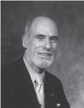

采访: Vinton G. Cerf
===================================

Interview: Vinton G. Cerf

.. tab:: 中文

.. tab:: 英文

Vinton G. Cerf is Vice President and Chief Internet Evangelist for Google. He served for over 16 years at MCI in various positions, ending up his tenure there as Senior Vice President for Technology Strategy. He is widely known as the co-designer of the TCP/IP protocols and the architecture of the Internet. During his time from 1976 to 1982 at the US Department of Defense Advanced Research Projects Agency (DARPA), he played a key role leading the development of Internet and Internet-related data packet and security techniques. He received the US Presidential Medal of Freedom in 2005 and the US National Medal of Technology in 1997. He holds a BS in Mathematics from Stanford University and an MS and PhD in computer science from UCLA.

What brought you to specialize in networking?
------------------------------------------------

I was working as a programmer at UCLA in the late 1960s. My job was supported by the US Defense Advanced Research Projects Agency (called ARPA then, called DARPA now). I was working in the laboratory of Professor Leonard Kleinrock on the Network Measurement Center of the newly created ARPAnet. The first node of the ARPAnet was installed at UCLA on September 1, 1969. I was responsible for programming a computer that was used to capture performance information about the ARPAnet and to report this information back for comparison with mathematical models and predictions of the performance of the network.
Several of the other graduate students and I were made responsible for working on the so-called
  
host-level protocols of the ARPAnet—the procedures and formats that would allow many different kinds of computers on the network to interact with each other. It was a fascinating exploration into a new world (for me) of distributed computing and communication.

Did you imagine that IP would become as pervasive as it is today when you first designed the protocol?
---------------------------------------------------------------------------------------------------------

When Bob Kahn and I first worked on this in 1973, I think we were mostly very focused on the central question: How can we make heterogeneous packet networks interoperate with one another, assuming we cannot actually change the networks themselves? We hoped that we could find a way to permit an arbitrary collection of packet-switched networks to be interconnected in a transparent fashion, so that host computers could communicate end-to-end without having to do any translations in between. I think we knew that we were dealing with powerful and expandable technology, but I doubt we had a clear image of what the world would be like with hundreds of millions of computers all interlinked on the Internet.

What do you now envision for the future of networking and the Internet? What major challenges/obstacles do you think lie ahead in their development?
-------------------------------------------------------------------------------------------------------------------------------------------------------

I believe the Internet itself and networks in general will continue to proliferate. Already there is convincing evidence that there will be billions of Internet-enabled devices on the Internet, including appliances like cell phones, refrigerators, personal digital assistants, home servers, televisions, as well as the usual array of laptops, servers, and so on. Big challenges include support for mobility, battery life, capacity of the access links to the network, and ability to scale the optical core of the network up in an unlimited fashion. Designing an interplanetary extension of the Internet is a project in which I am deeply engaged at the Jet Propulsion Laboratory. We will need to cut over from IPv4 [32-bit addresses] to IPv6 [128 bits]. The list is long!

Who has inspired you professionally?
------------------------------------------------

My colleague Bob Kahn; my thesis advisor, Gerald Estrin; my best friend, Steve Crocker (we met in high school and he introduced me to computers in 1960!); and the thousands of engineers who continue to evolve the Internet today.

Do you have any advice for students entering the networking/Internet field?
-------------------------------------------------------------------------------

Think outside the limitations of existing systems—imagine what might be possible; but then do the hard work of figuring out how to get there from the current state of affairs. Dare to dream: A half dozen colleagues and I at the Jet Propulsion Laboratory have been working on the design of an interplanetary extension of the terrestrial Internet. It may take decades to implement this, mission by mission, but to paraphrase: “A man’s reach should exceed his grasp, or what are the heavens for?”