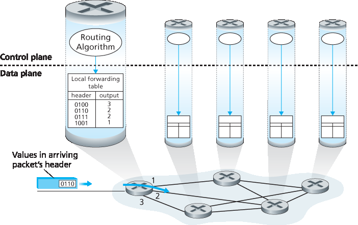
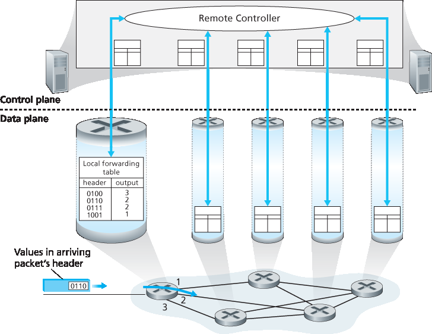

.. _c4.1:

4.1 网络层概述
====================================
4.1 Overview of Network Layer

:ref:`图 4.1 <Figure 4.1>` 展示了一个包含两台主机 H1 和 H2 以及若干路由器的简单网络。假设 H1 正在向 H2 发送信息，我们来看网络层在这两台主机及其间路由器中的作用。H1 中的网络层从其传输层获取报文段，将每个报文段封装进数据报中，然后将这些数据报发送到其附近的路由器 R1。在接收端 H2，网络层从其附近的路由器 R2 接收数据报，提取出传输层的报文段，并将这些报文段上交至 H2 的传输层。每台路由器在数据平面中的主要角色是将数据报从其输入链路转发到相应的输出链路；而网络控制平面的主要角色是协调这些每个路由器本地的转发行为，以便数据报最终能在源主机和目的主机之间通过路由器路径端到端传输。请注意，:ref:`图 4.1 <Figure 4.1>` 中的路由器仅展示了截断的协议栈，也就是说，其网络层之上没有应用层或传输层协议，因为路由器不运行我们在 :ref:`第 2 章 <c2>` 和 :ref:`第 3 章 <c3>` 中讨论的应用层和传输层协议。

.. toggle::

    :ref:`Figure 4.1 <Figure 4.1>` shows a simple network with two hosts, H1 and H2, and several routers on the path between
    H1 and H2. Let’s suppose that H1 is sending information to H2, and consider the role of the network
    layer in these hosts and in the intervening routers. The network layer in H1 takes segments from the
    transport layer in H1, encapsulates each segment into a datagram, and then sends the datagrams to its
    nearby router, R1. At the receiving host, H2, the network layer receives the datagrams from its nearby
    router R2, extracts the transport-layer segments, and delivers the segments up to the transport layer at
    H2. The primary data-plane role of each router is to forward datagrams from its input links to its output
    links; the primary role of the network control plane is to coordinate these local, per-router forwarding
    actions so that datagrams are ultimately transferred end-to-end, along paths of routers between source
    and destination hosts. Note that the routers in :ref:`Figure 4.1` are shown with a truncated protocol stack, that
    is, with no upper layers above the network layer, because routers do not run application- and transport-
    layer protocols such as those we examined in :ref:`Chapters 2 <c2>` and :ref:`3 <c3>`.

.. _c4.1.1:

4.1.1 转发与路由：网络数据与控制平面
------------------------------------------------------------------
4.1.1 Forwarding and Routing: The Network Data and Control Planes

网络层的主要角色看似简单——将分组从发送主机传送至接收主机。为了实现这一目标，可以识别出两个重要的网络层功能：

- **转发**。当一个分组到达路由器的输入链路时，路由器必须将该分组移交至合适的输出链路。例如，:ref:`图 4.1 <Figure 4.1>` 中从主机 H1 到达路由器 R1 的分组必须被转发至通往 H2 的下一跳路由器。正如我们将看到的，转发只是数据平面中实现的一个功能（虽然是最常见、最重要的一个功能！）。在更一般的情况下（我们将在 :ref:`第 4.4 节 <c4.4>` 中讨论），分组也可能被阻止从路由器中输出（例如，若该分组来自一个已知的恶意主机，或其目标地址为被禁止的目的主机），或者被复制并通过多个输出链路发送。

  .. _Figure 4.1:
  
  .. figure:: ../img/351-0.png
     :align: center 

  **图 4.1 网络层**

- **路由**。网络层必须确定分组从发送方到接收方所经过的路径。用于计算这些路径的算法称为 **路由算法**。例如，路由算法将确定 :ref:`图 4.1 <Figure 4.1>` 中从 H1 到 H2 的分组所经过的路径。路由功能在网络层的控制平面中实现。

在许多讨论网络层的文献中，“转发”和“路由”两个术语经常被互换使用。但在本书中我们会更为精确地使用这些术语。 **转发** 是指路由器本地的动作，即将一个分组从输入链路接口转交至相应的输出链路接口。转发发生在非常短的时间尺度（通常为数纳秒），因此通常通过硬件实现。 **路由** 是指一个网络范围内的过程，用于决定分组从源主机到目的主机所经过的端到端路径。路由发生在较长的时间尺度（通常为数秒），并且通常通过软件实现。借用我们在 :ref:`第 1.3.1 节 <c1.3.1>` 中的驾驶类比，考虑一位旅行者从宾夕法尼亚州出发开车前往佛罗里达州。在旅途中，驾驶者会经过多个高速公路交汇点。我们可以将“转发”类比为通过一个单独交汇点的过程：汽车从一条道路驶入交汇点，并决定从哪条路驶出。而“路由”则相当于从宾夕法尼亚到佛罗里达的行程规划：出发前驾驶者查阅地图，从多个可能路径中选择一条，其中每条路径由一系列通过交汇点相连的路段组成。

每台网络路由器中的关键组成部分是其 **转发表**。路由器通过检查到达分组首部中的一个或多个字段，并使用这些字段的值在其转发表中索引，从而完成分组转发。该转发表项中存储的值指示该分组应被转发到哪个输出链路接口。例如，:ref:`图 4.2 <Figure 4.2>` 中，一个首部字段值为 ``0110`` 的分组到达路由器，路由器使用该值索引其转发表，得出该分组应转发到接口 2。路由器随后将分组在内部转发到接口 2。我们将在 :ref:`第 4.2 节 <c4.2>` 中深入探讨路由器内部的转发功能。转发是网络层数据平面执行的核心功能。

.. toggle::

    The primary role of the network layer is deceptively simple—to move packets from a sending host to a receiving host. To do so, two important network-layer functions can be identified:

    - **Forwarding**. When a packet arrives at a router’s input link, the router must move the packet to the appropriate output link. For example, a packet arriving from Host H1 to Router R1 in :ref:`Figure 4.1 <Figure 4.1>` must be forwarded to the next router on a path to H2. As we will see, forwarding is but one function (albeit the most common and important one!) implemented in the data plane. In the more general case, which we’ll cover in :ref:`Section 4.4 <c4.4>`, a packet might also be blocked from exiting a router (e.g., if the packet originated at a known malicious sending host, or if the packet were destined to a forbidden destination host), or might be duplicated and sent over multiple outgoing links.
      
      .. figure:: ../img/351-0.png
        :align: center 

      **Figure 4.1 The network layer**

    - **Routing**. The network layer must determine the route or path taken by packets as they flow from a sender to a receiver. The algorithms that calculate these paths are referred to as **routing algorithms**. A routing algorithm would determine, for example, the path along which packets flowfrom H1 to H2 in :ref:`Figure 4.1 <Figure 4.1>`. Routing is implemented in the control plane of the network layer.

    The terms forwarding and routing are often used interchangeably by authors discussing the network
    layer. We’ll use these terms much more precisely in this book. **Forwarding** refers to the router-local
    action of transferring a packet from an input link interface to the appropriate output link interface.
    Forwarding takes place at very short timescales (typically a few nanoseconds), and thus is typically
    implemented in hardware. **Routing** refers to the network-wide process that determines the end-to-end
    paths that packets take from source to destination. Routing takes place on much longer timescales
    (typically seconds), and as we will see is often implemented in software. Using our driving analogy,
    consider the trip from Pennsylvania to Florida undertaken by our traveler back in :ref:`Section 1.3.1 <c1.3.1>`. During
    this trip, our driver passes through many interchanges en route to Florida. We can think of forwarding as
    the process of getting through a single interchange: A car enters the interchange from one road and
    determines which road it should take to leave the interchange. We can think of routing as the process of
    planning the trip from Pennsylvania to Florida: Before embarking on the trip, the driver has consulted a
    map and chosen one of many paths possible, with each path consisting of a series of road segments
    connected at interchanges.

    A key element in every network router is its **forwarding table**. A router forwards a packet by examining
    the value of one or more fields in the arriving packet’s header, and then using these header values to
    index into its forwarding table. The value stored in the forwarding table entry for those values indicates
    the outgoing link interface at that router to which that packet is to be forwarded. For example, in :ref:`Figure 4.2 <Figure 4.2>`, a packet with header field value of ``0110`` arrives to a router. The router indexes into its forwarding
    table and determines that the output link interface for this packet is interface 2. The router then internally
    forwards the packet to interface 2. In :ref:`Section 4.2 <c4.2>`, we’ll look inside a router and examine the forwarding
    function in much greater detail. Forwarding is the key function performed by the data-plane functionality
    of the network layer.

控制平面：传统方法
~~~~~~~~~~~~~~~~~~~~~~~~~~~~~~~~~~~~~~~~~~~~~~
Control Plane: The Traditional Approach

你可能会好奇：一台路由器的转发表最初是如何配置的？这是一个关键问题，涉及到数据平面中的转发功能与控制平面中的路由功能之间的重要关系。如 :ref:`图 4.2 <Figure 4.2>` 所示，路由算法决定了路由器转发表的内容。在这个例子中，每台路由器上都运行一个路由算法，转发和路由功能都包含在路由器内部。正如我们将在 :ref:`第 5.3 节 <c5.3>` 和 :ref:`第 5.4 节 <c5.4>` 中看到的，一台路由器中的路由算法会与其它路由器中的路由算法通信，以计算其转发表的值。这种通信是如何完成的呢？通过按照某种路由协议交换包含路由信息的路由消息！我们将在 :ref:`第 5.2 节 <c5.2>` 至 :ref:`第 5.4 节 <c5.4>` 中介绍路由算法与协议。

.. _Figure 4.2:

**图 4.2 路由算法决定转发表中的值**

通过考虑一种假设性的（虽然不现实但在技术上可行的）网络情景，我们可以进一步说明转发与路由功能在目的上的区别：在这个网络中，所有转发表都由物理存在于路由器旁的人类网络操作员直接配置。在这种情况下，不需要任何路由协议！当然，人类操作员之间需要互相沟通，以确保他们配置的转发表能够使分组被正确传送到目的地。但这种手动配置方式更容易出错，且对网络拓扑变化的响应速度远不如路由协议。因此，我们应庆幸所有网络都具备转发和路由这两个功能！

.. toggle::

    But now you are undoubtedly wondering how a router’s forwarding tables are configured in the first
    place. This is a crucial issue, one that exposes the important interplay between forwarding (in data
    plane) and routing (in control plane). As shown in :ref:`Figure 4.2 <Figure 4.2>`, the routing algorithm determines the contents of the routers’ forwarding tables. In this
    example, a routing algorithm runs in each and every router and both forwarding and routing functions
    are contained within a router. As we’ll see in :ref:`Sections 5.3 <c5.3>` and :ref:`5.4 <c5.4>`, the routing algorithm function in one
    router communicates with the routing algorithm function in other routers to compute the values for its
    forwarding table. How is this communication performed? By exchanging routing messages containing
    routing information according to a routing protocol! We’ll cover routing algorithms and protocols in
    :ref:`Sections 5.2 <c5.2>` through :ref:`5.4 <c5.4>`.

    .. figure:: ../img/353-0.png
       :align: center

    **Figure 4.2 Routing algorithms determine values in forward tables**

    The distinct and different purposes of the forwarding and routing functions can be further illustrated by
    considering the hypothetical (and unrealistic, but technically feasible) case of a network in which all
    forwarding tables are configured directly by human network operators physically present at the routers.
    In this case, no routing protocols would be required! Of course, the human operators would need to
    interact with each other to ensure that the forwarding tables were configured in such a way that packets
    reached their intended destinations. It’s also likely that human configuration would be more error-prone
    and much slower to respond to changes in the network topology than a routing protocol. We’re thus
    fortunate that all networks have both a forwarding and a routing function!

控制平面：SDN 方法
~~~~~~~~~~~~~~~~~~~~~~~~~~~~~~~~~~
Control Plane: The SDN Approach

:ref:`图 4.2 <Figure 4.2>` 所示的路由实现方式——每个路由器包含一个可与其他路由器中的路由组件通信的路由组件——是长期以来路由设备供应商产品中采用的传统方法。然而，我们前面关于人类可以手动配置转发表的观察，也暗示控制平面可能还有其他方式决定数据平面中转发表的内容。

:ref:`图 4.3 <Figure 4.3>` 展示了另一种方法：一个物理上独立（与路由器分离）的远程控制器计算并下发每个路由器所使用的转发表。请注意，:ref:`图 4.2 <Figure 4.2>` 和 :ref:`图 4.3 <Figure 4.3>` 中的数据平面组件是相同的。然而在 :ref:`图 4.3 <Figure 4.3>` 中，控制平面路由功能被从物理路由器中分离出来——路由设备只负责转发，而远程控制器负责计算并分发转发表。该远程控制器可能部署于一个高可靠性、具备冗余机制的远程数据中心，并由 ISP 或第三方管理。路由器与远程控制器之间如何通信？通过交换包含转发表和其他路由信息的消息。:ref:`图 4.3 <Figure 4.3>` 所示的控制平面方法正是 **软件定义网络（SDN）** 的核心，其“软件定义”体现在用于计算转发表并与路由器交互的控制器是由软件实现的。这些软件实现正越来越开放，即代码公开，类似于 Linux 操作系统代码，使 ISP（以及网络研究人员和学生！）能够进行创新并提出对控制网络层功能的软件的改进建议。我们将在 :ref:`第 5.5 节 <c5.5>` 中介绍 SDN 控制平面。

.. _Figure 4.3:

**图 4.3 远程控制器决定并下发转发表中的值**

.. toggle::

    The approach to implementing routing functionality shown in :ref:`Figure 4.2 <Figure 4.2>`—with each router having a
    routing component that communicates with the routing component of other routers—has been thetraditional approach adopted by routing vendors in their products, at least until recently. Our observation
    that humans could manually configure forwarding tables does suggest, however, that there may be
    other ways for control-plane functionality to determine the contents of the data-plane forwarding tables.

    :ref:`Figure 4.3 <Figure 4.3>` shows an alternate approach in which a physically separate (from the routers), remote
    controller computes and distributes the forwarding tables to be used by each and every router. Note that
    the data plane components of :ref:`Figures 4.2 <Figure 4.2>` and :ref:`4.3 <Figure 4.3>` are identical. In :ref:`Figure 4.3 <Figure 4.3>`, however, control-plane routing functionality is separated from the physical router—the routing device performs forwarding only, while the remote controller
    computes and distributes forwarding tables. The remote controller might be implemented in a remote
    data center with high reliability and redundancy, and might be managed by the ISP or some third party.
    How might the routers and the remote controller communicate? By exchanging messages containing
    forwarding tables and other pieces of routing information. The control-plane approach shown in :ref:`Figure 4.3 <Figure 4.3>` is at the heart of **software-defined networking (SDN)**, where the network is “software-defined”
    because the controller that computes forwarding tables and interacts with routers is implemented in
    software. Increasingly, these software implementations are also open, i.e., similar to Linux OS code, thecode is publically available, allowing ISPs (and networking researchers and students!) to innovate and
    propose changes to the software that controls network-layer functionality. We will cover the SDN control
    plane in :ref:`Section 5.5 <c5.5>`.

    .. figure:: ../img/354-0.png
       :align: center

    **Figure 4.3 A remote controller determines and distributes values in ­forwarding tables**

.. _c4.1.2:

4.1.2 网络服务模型
----------------------------------------------------------
4.1.2 Network Service Models

在深入探讨网络层的数据平面之前，让我们从更广的视角结束这一部分的介绍，考虑网络层可能提供的不同类型的服务。当发送主机的传输层将一个分组发送进网络（也就是将其传递给发送主机的网络层）时，传输层能否依赖网络层将该分组送达目的地？当发送多个分组时，它们是否会按照发送顺序在接收主机的传输层被接收？两个连续分组的发送时间间隔是否等于它们的接收时间间隔？网络是否会提供任何关于网络中拥塞的反馈？这些问题的答案（以及其它问题）都由网络层所提供的服务模型决定。 **网络服务模型** 定义了发送主机与接收主机之间分组端到端传送的特性。

现在让我们来考虑网络层可能提供的一些服务。这些服务可能包括：

- **保证交付**。该服务保证源主机发送的分组最终将抵达目的主机。
- **带有时延界限的保证交付**。该服务不仅保证分组交付，而且保证在主机到主机之间指定的时延上限内完成交付（例如，100 毫秒以内）。
- **顺序分组交付**。该服务保证分组按发送顺序到达目的地。
- **保证最小带宽**。该网络层服务模拟一个具有指定比特率（例如 1 Mbps）的传输链路的行为，在发送主机和接收主机之间。如果发送主机以低于该指定比特率的速率发送比特（作为分组的一部分），那么所有分组最终都将送达目的主机。
- **安全性**。网络层可以在源端对所有数据报进行加密，在目的端进行解密，从而为所有传输层报文段提供保密性。

这只是网络层可能提供的服务的一部分——还有无数种可能的变体。

互联网的网络层只提供一种服务，称为 **尽力而为服务**。在尽力而为服务中，分组既不能保证按发送顺序被接收，也不能保证最终一定会被送达。它不对端到端时延做出任何保证，也不保证最小带宽。乍看之下，尽力而为服务似乎就是“根本没有服务”的委婉说法——一个将所有分组都丢弃、不送达目的主机的网络也能满足尽力而为服务的定义！其它网络体系结构定义并实现了超越互联网尽力而为服务的服务模型。例如，ATM 网络体系结构 [:ref:`MFA Forum 2016 <MFA Forum 2016>`，:ref:`Black 1995 <Black 1995>`] 提供顺序交付、带界限的时延、以及保证的最小带宽。也有一些对互联网架构的服务模型扩展方案，例如 Intserv 架构 :ref:`[RFC 1633] <RFC 1633>`，旨在提供端到端的时延保证和无拥塞通信。有趣的是，尽管有这些成熟的替代方案，互联网基础的尽力而为服务模型结合充分的带宽配置，已经被证明足以支持丰富多样的应用，包括 Netflix 这类流媒体视频服务、VoIP 语音和视频通信，以及如 Skype 和 Facetime 的实时会议应用。

.. toggle::

    Before delving into the network layer’s data plane, let’s wrap up our introduction by taking the broader
    view and consider the different types of service that might be offered by the network layer. When the
    transport layer at a sending host transmits a packet into the network (that is, passes it down to the
    network layer at the sending host), can the transport layer rely on the network layer to deliver the packet
    to the destination? When multiple packets are sent, will they be delivered to the transport layer in the
    receiving host in the order in which they were sent? Will the amount of time between the sending of two
    sequential packet transmissions be the same as the amount of time between their reception? Will the
    network provide any feedback about congestion in the network? The answers to these questions and
    others are determined by the service model provided by the network layer. The **network service model**
    defines the characteristics of end-to-end delivery of packets between sending and receiving hosts.

    Let’s now consider some possible services that the network layer could provide. These services could include:

    - **Guaranteed delivery**. This service guarantees that a packet sent by a source host will eventually arrive at the destination host.
    - **Guaranteed delivery with bounded delay**. This service not only guarantees delivery of the packet, but delivery within a specified host-to-host delay bound (for example, within 100 msec).
    - **In-order packet delivery**. This service guarantees that packets arrive at the destination in the order
    that they were sent.
    - **Guaranteed minimal bandwidth**. This network-layer service emulates the behavior of a
    transmission link of a specified bit rate (for example, 1 Mbps) between sending and receiving hosts.
    As long as the sending host transmits bits (as part of packets) at a rate below the specified bit rate,
    then all packets are eventually delivered to the destination host.
    - **Security**. The network layer could encrypt all datagrams at the source and decrypt them at the
    destination, thereby providing confidentiality to all transport-layer segments.

    This is only a partial list of services that a network layer could provide—there are countless variations
    possible.

    The Internet’s network layer provides a single service, known as **best-effort service**. With best-effort
    service, packets are neither guaranteed to be received in the order in which they were sent, nor is their
    eventual delivery even guaranteed. There is no guarantee on the end-to-end delay nor is there aminimal bandwidth guarantee. It might appear that best-effort service is a euphemism for no service at
    all—a network that delivered no packets to the destination would satisfy the definition of best-effort
    delivery service! Other network architectures have defined and implemented service models that go
    beyond the Internet’s best-effort service. For example, the ATM network architecture [:ref:`MFA Forum 2016 <MFA Forum 2016>`, :ref:`Black 1995 <Black 1995>`] provides for guaranteed in-order delay, bounded delay, and guaranteed minimal
    bandwidth. There have also been proposed service model extensions to the Internet architecture; for
    example, the Intserv architecture :ref:`[RFC 1633] <RFC 1633>` aims to provide end-end delay guarantees and
    congestion-free communication. Interestingly, in spite of these well-developed alternatives, the Internet’s
    basic best-effort service model combined with adequate bandwidth provisioning have arguably proven to
    be more than “good enough” to enable an amazing range of applications, including streaming video
    services such as Netflix and voice-and-video-over-IP, real-time conferencing applications such as Skype
    and Facetime.

第 4 章概览
~~~~~~~~~~~~~~~~~~~~~~~~~~~~~~~~
An Overview of Chapter 4

我们已经概述了网络层的总体情况，接下来我们将在本章的后续部分中介绍网络层的数据平面组件。在 :ref:`第 4.2 节 <c4.2>` 中，我们将深入探讨路由器的内部硬件操作，包括输入和输出分组处理、路由器的内部交换机制，以及分组排队与调度机制。在 :ref:`第 4.3 节 <c4.3>` 中，我们将介绍传统的 IP 转发机制，即根据分组的目的 IP 地址将其转发到输出端口。我们还将讨论 IP 地址、广为人知的 IPv4 和 IPv6 协议等内容。在 :ref:`第 4.4 节 <c4.4>` 中，我们将介绍更通用的转发机制，其中分组可以基于大量首部字段的值（而不仅仅是目的 IP 地址）被转发至输出端口。分组还可能在路由器处被阻止或复制，或具有某些首部字段被改写——所有这些都由软件控制。这种更通用的分组转发形式是现代网络数据平面的关键组成部分，包括软件定义网络（SDN）中的数据平面。

顺便提一句，“转发”（ *forwarding* ）和“交换”（ *switching* ）这两个术语在计算机网络研究者和工程师中经常可以互换使用；在本书中我们也将这两个术语视为同义词。同时在术语方面还值得一提的是另两个经常被互换使用，但我们将在本书中更加严格区分的术语。我们将“分组交换机”（*packet switch*）一词专指一种通用的分组交换设备，它根据分组首部字段中的值，将分组从输入链路接口转发至输出链路接口。有些分组交换设备被称为 **链路层交换机** （在 :ref:`第 6 章 <c6>` 中讨论），它们基于链路层帧字段的值做出转发决策，因此被称为链路层（第 2 层）设备。而其他分组交换设备称为 **路由器**，它们根据网络层数据报首部字段的值进行转发决策，因此是网络层（第 3 层）设备。（为了更好地理解这一重要区别，读者可以回顾 :ref:`第 1.5.2 节 <c1.5.2>`，其中我们讨论了网络层数据报与链路层帧及其关系。）由于本章的重点是网络层，我们将主要使用“路由器”这一术语来代替“分组交换机”。

.. toggle::

    Having now provided an overview of the network layer, we’ll cover the data-plane component of the
    network layer in the following sections in this chapter. In :ref:`Section 4.2 <c4.2>`, we’ll dive down into the internal
    hardware operations of a router, including input and output packet processing, the router’s internal
    switching mechanism, and packet queueing and scheduling. In :ref:`Section 4.3 <c4.3>`, we’ll take a look at
    traditional IP forwarding, in which packets are forwarded to output ports based on their destination IP
    addresses. We’ll encounter IP addressing, the celebrated IPv4 and IPv6 protocols and more. In :ref:`Section 4.4 <c4.4>`, we’ll cover more generalized forwarding, where packets may be forwarded to output ports based on
    a large number of header values (i.e., not only based on destination IP address). Packets may be
    blocked or duplicated at the router, or may have certain header field values rewritten—all under software
    control. This more generalized form of packet forwarding is a key component of a modern network data
    plane, including the data plane in software-defined networks (SDN).

    We mention here in passing that the terms *forwarding* and *switching* are often used interchangeably by
    computer-networking researchers and practitioners; we’ll use both terms interchangeably in this
    textbook as well. While we’re on the topic of terminology, it’s also worth mentioning two other terms that
    are often used interchangeably, but that we will use more carefully. We’ll reserve the term packet switch
    to mean a general packet-switching device that transfers a packet from input link interface to output link
    interface, according to values in a packet’s header fields. Some packet switches, called **link-layer switches** (examined in :ref:`Chapter 6 <c6>`), base their forwarding decision on values in the fields of the link-layer frame; switches are thus referred to as link-layer (layer 2) devices. Other packet switches, called
    **routers**, base their forwarding decision on header field values in the network-layer datagram. Routers
    are thus network-layer (layer 3) devices. (To fully appreciate this important distinction, you might want to
    review :ref:`Section 1.5.2 <c1.5.2>`, where we discuss network-layer datagrams and link-layer frames and their
    relationship.) Since our focus in this chapter is on the network layer, we’ll mostly use the term *router* in
    place of *packet switch*.