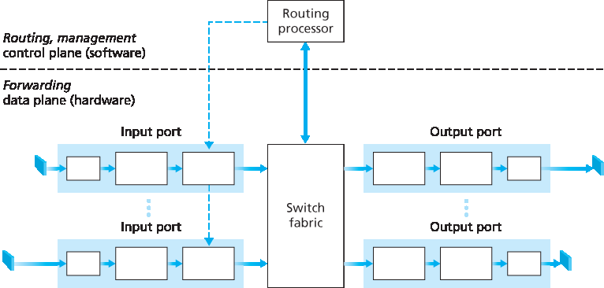
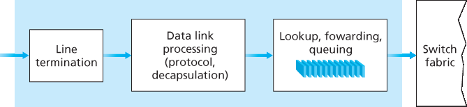
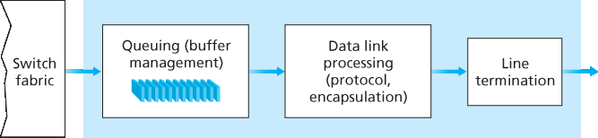
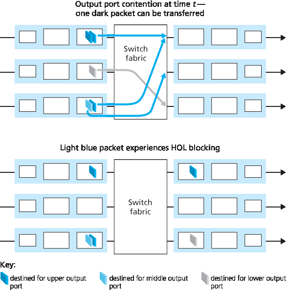
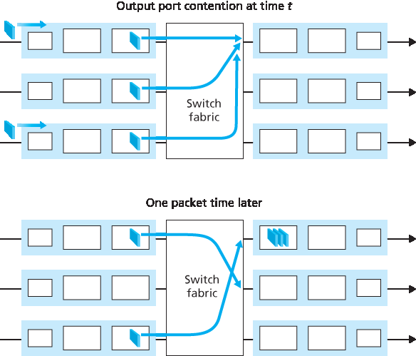
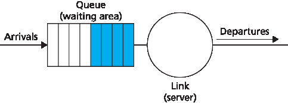
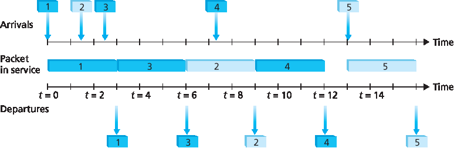
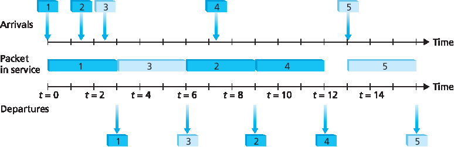
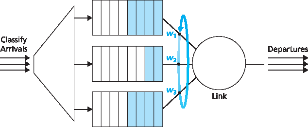

.. _c4.2:

4.2 路由器里面有什么？
====================================
4.2 What's Inside a Router?

.. tab:: 中文

.. tab:: 英文

Now that we’ve overviewed the data and control planes within the network layer, the important
distinction between forwarding and routing, and the services and functions of the network layer, let’s turn
our attention to its forwarding function—the actual transfer of packets from a router’s incoming links to
the appropriate outgoing links at that router.

A high-level view of a generic router architecture is shown in :ref:`Figure 4.4 <Figure 4.4>`. Four router components can be
identified:

.. _Figure 4.4:

**Figure 4.4 Router architecture**

- **Input ports**. An **input port** performs several key functions. It performs the physical layer function of terminating an incoming physical link at a router; this is shown in the leftmost box of an input port and the rightmost box of an output port in :ref:`Figure 4.4 <Figure 4.4>`. An input port also performs link-layer functions needed to interoperate with the link layer at the other side of the incoming link; this is represented by the middle boxes in the input and output ports. Perhaps most crucially, a lookup function is also performed at the input port; this will occur in the rightmost box of the input port. It is here that the forwarding table is consulted to determine the router output port to which an arriving packet will be forwarded via the switching fabric. Control packets (for example, packets carrying routing protocol information) are forwarded from an input port to the routing processor. Note that the term “port” here —referring to the physical input and output router interfaces—is distinctly different from the softwareports associated with network applications and sockets discussed in :ref:`Chapters 2 <c2>` and :ref:`3 <c3>`. In practice, the number of ports supported by a router can range from a relatively small number in enterprise routers, to hundreds of 10 Gbps ports in a router at an ISP’s edge, where the number of incoming lines tends to be the greatest. The Juniper MX2020, edge router, for example, supports up to 960 10 Gbps Ethernet ports, with an overall router system capacity of 80 Tbps :ref:`[Juniper MX 2020 2016] <Juniper MX 2020 2016>`.
- **Switching fabric**. The switching fabric connects the router’s input ports to its output ports. This switching fabric is completely contained within the router—a network inside of a network router!
- **Output ports**. An **output port** stores packets received from the switching fabric and transmits these packets on the outgoing link by performing the necessary link-layer and physical-layer functions. When a link is bidirectional (that is, carries traffic in both directions), an output port will typically be paired with the input port for that link on the same line card.
- **Routing processor**. The routing processor performs control-plane functions. In traditional routers, it executes the routing protocols (which we’ll study in :ref:`Sections 5.3 <c5.3>` and :ref:`5.4 <c5.4>`), maintains routing tables and attached link state information, and computes the forwarding table for the router. In SDN routers, the routing processor is responsible for communicating with the remote controller in order to (among other activities) receive forwarding table entries computed by the remote controller, and install these entries in the router’s input ports. The routing processor also performs the network management functions that we’ll study in :ref:`Section 5.7 <c5.7>`.

A router’s input ports, output ports, and switching fabric are almost always implemented in hardware, as
shown in :ref:`Figure 4.4 <Figure 4.4>`. To appreciate why a hardware implementation is needed, consider that with a 10
Gbps input link and a 64-byte IP datagram, the input port has only 51.2 ns to process the datagram
before another datagram may arrive. If N ports are combined on a line card (as is often done in
practice), the datagram-processing pipeline must operate N times faster—far too fast for software
implementation. Forwarding hardware can be implemented either using a router vendor’s own hardware
designs, or constructed using purchased merchant-silicon chips (e.g., as sold by companies such as
Intel and Broadcom).

While the data plane operates at the nanosecond time scale, a router’s control functions—executing the
routing protocols, responding to attached links that go up or down, communicating with the remote
controller (in the SDN case) and performing management functions—operate at the millisecond or
second timescale. These **control plane** functions are thus usually implemented in software and execute
on the routing processor (typically a traditional CPU).

Before delving into the details of router internals, let’s return to our analogy from the beginning of this
chapter, where packet forwarding was compared to cars entering and leaving an interchange. Let’s
suppose that the interchange is a roundabout, and that as a car enters the roundabout, a bit of
processing is required. Let’s consider what information is required for this processing:

- **Destination-based forwarding**. Suppose the car stops at an entry station and indicates its finaldestination (not at the local roundabout, but the ultimate destination of its journey). An attendant at the entry station looks up the final destination, determines the roundabout exit that leads to that final destination, and tells the driver which roundabout exit to take.
- **Generalized forwarding**. The attendant could also determine the car’s exit ramp on the basis of many other factors besides the destination. For example, the selected exit ramp might depend on the car’s origin, for example the state that issued the car’s license plate. Cars from a certain set of states might be directed to use one exit ramp (that leads to the destination via a slow road), while cars from other states might be directed to use a different exit ramp (that leads to the destination via superhighway). The same decision might be made based on the model, make and year of the car. Or a car not deemed roadworthy might be blocked and not be allowed to pass through the roundabout. In the case of generalized forwarding, any number of factors may contribute to the attendant’s choice of the exit ramp for a given car.

Once the car enters the roundabout (which may be filled with other cars entering from other input roads
and heading to other roundabout exits), it eventually leaves at the prescribed roundabout exit ramp,
where it may encounter other cars leaving the roundabout at that exit.

We can easily recognize the principal router components in :ref:`Figure 4.4 <Figure 4.4>` in this analogy—the entry road
and entry station correspond to the input port (with a lookup function to determine to local outgoing port);
the roundabout corresponds to the switch fabric; and the roundabout exit road corresponds to the output
port. With this analogy, it’s instructive to consider where bottlenecks might occur. What happens if cars
arrive blazingly fast (for example, the roundabout is in Germany or Italy!) but the station attendant is
slow? How fast must the attendant work to ensure there’s no backup on an entry road? Even with a
blazingly fast attendant, what happens if cars traverse the roundabout slowly—can backups still occur?
And what happens if most of the cars entering at all of the roundabout’s entrance ramps all want to
leave the roundabout at the same exit ramp—can backups occur at the exit ramp or elsewhere? How
should the roundabout operate if we want to assign priorities to different cars, or block certain cars from
entering the roundabout in the first place? These are all analogous to critical questions faced by router
and switch designers.

In the following subsections, we’ll look at router functions in more detail. [:ref:`Iyer 2008 <Iyer 2008>`, :ref:`Chao 2001 <Chao 2001>`;
:ref:`Chuang 2005 <Chuang 2005>`; :ref:`Turner 1988 <Turner 1988>`; :ref:`McKeown 1997a <McKeown 1997a>`; :ref:`Partridge 1998 <Partridge 1998>`; :ref:`Sopranos 2011 <Sopranos 2011>`] provide a discussion
of specific router architectures. For concreteness and simplicity, we’ll initially assume in this section that
forwarding decisions are based only on the packet’s destination address, rather than on a generalized
set of packet header fields. We will cover the case of more generalized packet forwarding in :ref:`Section 4.4 <c4.4>`.

.. _c4.2.1:

4.2.1 输入端口处理和基于目标的转发
----------------------------------------------------------
4.2.1 Input Port Processing and Destination-Based Forwarding

.. tab:: 中文

.. tab:: 英文

A more detailed view of input processing is shown in :ref:`Figure 4.5 <Figure 4.5>`. As just discussed, the input port’s line-
termination function and link-layer processing implement the physical and link layers for that individual
input link. The lookup performed in the input port is central to the router’s operation—it is here that the
router uses the forwarding table to look up the output port to which an arriving packet will be forwarded
via the switching fabric. The forwarding table is either computed and updated by the routing processor
(using a routing protocol to interact with the routing processors in other network routers) or is received
from a remote SDN controller. The forwarding table is copied from the routing processor to the line
cards over a separate bus (e.g., a PCI bus) indicated by the dashed line from the routing processor to
the input line cards in :ref:`Figure 4.4 <Figure 4.4>`. With such a shadow copy at each line card, forwarding decisions can
be made locally, at each input port, without invoking the centralized routing processor on a per-packet
basis and thus avoiding a centralized processing bottleneck.

Let’s now consider the “simplest” case that the output port to which an incoming packet is to be switched
is based on the packet’s destination address. In the case of 32-bit IP addresses, a brute-force
implementation of the forwarding table would have one entry for every possible destination address.
Since there are more than 4 billion possible addresses, this option is totally out of the question.

.. _Figure 4.5:

**Figure 4.5 Input port processing**

As an example of how this issue of scale can be handled, let’s suppose that our router has four links, numbered 0 through 3, and that packets are to be forwarded to the link interfaces as follows:

+-----------------------------------------+--------------------+
|   Destination Address Range             |   Link Interface   |
+=========================================+====================+
| 11001000 00010111 00010000 00000000     |                    |
+-----------------------------------------+                    +
| through                                 |       0            |
+-----------------------------------------+                    +
| 11001000 00010111 00010111 11111111     |                    |
+-----------------------------------------+--------------------+
| 11001000 00010111 00011000 00000000     |                    |
+-----------------------------------------+                    +
| through                                 |       1            |
+-----------------------------------------+                    +
| 11001000 00010111 00011000 11111111     |                    |
+-----------------------------------------+--------------------+
| 11001000 00010111 00011001 00000000     |                    |
+-----------------------------------------+                    +
| through                                 |       2            |
+-----------------------------------------+                    +
| 11001000 00010111 00011111 11111111     |                    |
+-----------------------------------------+--------------------+
| Otherwise                               |      3             |
+-----------------------------------------+--------------------+

Clearly, for this example, it is not necessary to have 4 billion entries in the router’s forwarding table. We could, for example, have the following forwarding table with just four entries:

+-----------------------------------------+--------------------+
|   Prefix                                |   Link Interface   |
+=========================================+====================+
| 11001000 00010111 00010                 |       0            |
+-----------------------------------------+--------------------+
| 11001000 00010111 00011000              |      1             |
+-----------------------------------------+--------------------+
| 11001000 00010111 00011                 |      2             |
+-----------------------------------------+--------------------+
| Otherwise                               |      3             |
+-----------------------------------------+--------------------+

With this style of forwarding table, the router matches a **prefix** of the packet’s destination address with
the entries in the table; if there’s a match, the router forwards the packet to a link associated with the
match. For example, suppose the packet’s destination address is ``11001000 00010111 00010110 10100001`` ; because the 21-bit prefix of this address matches the first entry in the table, the router
forwards the packet to link interface 0. If a prefix doesn’t match any of the first three entries, then the
router forwards the packet to the default interface 3. Although this sounds simple enough, there’s a very
important subtlety here. You may have noticed that it is possible for a destination address to match
more than one entry. For example, the first 24 bits of the address ``11001000 00010111 00011000 10101010`` match the second entry in the table, and the first 21 bits of the address match the third entry
in the table. When there are multiple matches, the router uses the **longest prefix matching rule**; that
is, it finds the longest matching entry in the table and forwards the packet to the link interface associated
with the longest prefix match. We’ll see exactly why this longest prefix-matching rule is used when we
study Internet addressing in more detail in :ref:`Section 4.3 <c4.3>`.

Given the existence of a forwarding table, lookup is conceptually simple—­hardware logic just searches
through the forwarding table looking for the longest prefix match. But at Gigabit transmission rates, this
lookup must be performed in nanoseconds (recall our earlier example of a 10 Gbps link and a 64-byte IP
datagram). Thus, not only must lookup be performed in hardware, but techniques beyond a simple linear
search through a large table are needed; surveys of fast lookup algorithms can be found in [:ref:`Gupta 2001 <Gupta 2001>`, :ref:`Ruiz-Sanchez 2001 <Ruiz-Sanchez 2001>`]. Special attention must also be paid to memory access times, resulting in
designs with embedded on-chip DRAM and faster SRAM (used as a DRAM cache) memories. In
practice, Ternary Content Addressable Memories (TCAMs) are also often used for lookup :ref:`[Yu 2004] <Yu 2004>`.
With a TCAM, a 32-bit IP address is presented to the memory, which returns the content of the
forwarding table entry for that address in essentially constant time. The Cisco Catalyst 6500 and 7600
Series routers and switches can hold upwards of a million TCAM forwarding table entries :ref:`[Cisco TCAM 2014] <Cisco TCAM 2014>`.

Once a packet’s output port has been determined via the lookup, the packet can be sent into the
switching fabric. In some designs, a packet may be temporarily blocked from entering the switching
fabric if packets from other input ports are currently using the fabric. A blocked packet will be queued at
the input port and then scheduled to cross the fabric at a later point in time. We’ll take a closer look at
the blocking, queuing, and scheduling of packets (at both input ports and output ports) shortly. Although
“lookup” is arguably the most important action in input port processing, many other actions must be
taken: (1) physical- and link-layer processing must occur, as discussed previously; (2) the packet’s
version number, checksum and time-to-live field—all of which we’ll study in :ref:`Section 4.3 <c4.3>`—must be
checked and the latter two fields rewritten; and (3) counters used for network management (such as the
number of IP datagrams received) must be updated.

Let’s close our discussion of input port processing by noting that the input port steps of looking up a
destination IP address (“match”) and then sending the packet into the switching fabric to the specified
output port (“action”) is a specific case of a more general “match plus action” abstraction that is
performed in many networked devices, not just routers. In link-layer switches (covered in :ref:`Chapter 6 <c6>`),
link-layer destination addresses are looked up and several actions may be taken in addition to sending
the frame into the switching fabric towards the output port. In firewalls (covered in :ref:`Chapter 8 <c8>`)—devices
that filter out selected incoming packets—an incoming packet whose header matches a given criteria
(e.g., a combination of source/destination IP addresses and transport-layer port numbers) may be
dropped (action). In a network address translator (NAT, covered in :ref:`Section 4.3 <c4.3>`), an incoming packet
whose transport-layer port number matches a given value will have its port number rewritten before
forwarding (action). Indeed, the “match plus action” abstraction is both powerful and prevalent in
network devices today, and is central to the notion of generalized forwarding that we’ll study in :ref:`Section 4.4 <c4.3>`.

.. _c4.2.2:

4.2.2 切换
----------------------------------------------------------
4.2.2 Switching

.. tab:: 中文

.. tab:: 英文

The switching fabric is at the very heart of a router, as it is through this fabric that the packets are
actually switched (that is, forwarded) from an input port to an output port. Switching can be
accomplished in a number of ways, as shown in :ref:`Figure 4.6 <Figure 4.6>`:

- **Switching via memory**. The simplest, earliest routers were traditional computers, with switching between input and output ports being done under direct control of the CPU (routing processor). Input and output ports functioned as traditional I/O devices in a traditional operating system. An input port with an arriving packet first signaled the routing processor via an interrupt. The packet was then copied from the input port into processor memory. The routing processor then extracted the destination address from the header, looked up the appropriate output port in the forwarding table, and copied the packet to the output port’s buffers. In this scenario, if the memory bandwidth is such that a maximum of B packets per second can be written into, or read from, memory, then the overall forwarding throughput (the total rate at which packets are transferred from input ports to output ports) must be less than B/2. Note also that two packets cannot be forwarded at the same time, even if they have different destination ports, since only one memory read/write can be done at a time over the shared system bus.
  
  .. figure:: ../img/364-0.png 
     :align: left
  
  .. figure:: ../img/364-1.png 
     :align: center
  
  .. figure:: ../img/365-0.png 
     :align: center
  
  .. _Figure 4.6:

  **Figure 4.6 Three switching techniques**

  Some modern routers switch via memory. A major difference from early routers, however, is that the lookup of the destination address and the storing of the packet into the appropriate memory location are performed by processing on the input line cards. In some ways, routers that switch via memory look very much like shared-memory multiprocessors, with the processing on a line card switching (writing) packets into the memory of the appropriate output port. Cisco’s Catalyst 8500 series switches :ref:`[Cisco 8500 2016] <Cisco 8500 2016>` internally switches packets via a shared memory.

- **Switching via a bus**. In this approach, an input port transfers a packet directly to the output port over a shared bus, without intervention by the routing processor. This is typically done by having the input port pre-pend a switch-internal label (header) to the packet indicating the local output port to which this packet is being transferred and transmitting the packet onto the bus. All output ports receive the packet, but only the port that matches the label will keep the packet. The label is then removed at the output port, as this label is only used within the switch to cross the bus. If multiple packets arrive to the router at the same time, each at a different input port, all but one must wait since only one packet can cross the bus at a time. Because every packet must cross the single bus, the switching speed of the router is limited to the bus speed; in our roundabout analogy, this is as if the roundabout could only contain one car at a time. Nonetheless, switching via a bus is often sufficient for routers that operate in small local area and enterprise networks. The Cisco 6500 router :ref:`[Cisco 6500 2016] <Cisco 6500 2016>` internally switches packets over a 32-Gbps-backplane bus.
- **Switching via an interconnection network**. One way to overcome the bandwidth limitation of a single, shared bus is to use a more sophisticated interconnection network, such as those that have been used in the past to interconnect processors in a multiprocessor computer architecture. A crossbar switch is an interconnection network consisting of 2N buses that connect N input ports to N output ports, as shown in :ref:`Figure 4.6 <Figure 4.6>`. Each vertical bus intersects each horizontal bus at a crosspoint, which can be opened or closed at any time by the switch fabric controller (whose logic ispart of the switching fabric itself). When a packet arrives from port A and needs to be forwarded to port Y, the switch controller closes the crosspoint at the intersection of busses A and Y, and port A then sends the packet onto its bus, which is picked up (only) by bus Y. Note that a packet from port B can be forwarded to port X at the same time, since the A-to-Y and B-to-X packets use different input and output busses. Thus, unlike the previous two switching approaches, crossbar switches are capable of forwarding multiple packets in parallel. A crossbar switch is **non-blocking**—a packet being forwarded to an output port will not be blocked from reaching that output port as long as no other packet is currently being forwarded to that output port. However, if two packets from two different input ports are destined to that same output port, then one will have to wait at the input, since only one packet can be sent over any given bus at a time. Cisco 12000 series switches :ref:`[Cisco 12000 2016] <Cisco 12000 2016>` use a crossbar switching network; the Cisco 7600 series can be configured to use either a bus or crossbar switch :ref:`[Cisco 7600 2016] <Cisco 7600 2016>`.

  More sophisticated interconnection networks use multiple stages of switching elements to allow packets from different input ports to proceed towards the same output port at the same time through the multi-stage switching fabric. See :ref:`[Tobagi 1990] <Tobagi 1990>` for a survey of switch architectures. The Cisco CRS employs a three-stage non-blocking switching strategy. A router’s switching capacity can also be scaled by running multiple switching fabrics in parallel. In this approach, input ports and output ports are connected to N switching fabrics that operate in parallel. An input port breaks a packet into K smaller chunks, and sends (“sprays”) the chunks through K of these N switching fabrics to the selected output port, which reassembles the K chunks back into the original packet.

.. _c4.2.3:

4.2.3 输出端口处理
----------------------------------------------------------
4.2.3 Output Port Processing

.. tab:: 中文

.. tab:: 英文

Output port processing, shown in :ref:`Figure 4.7 <Figure 4.7>`, takes packets that have been stored in the output port’s
memory and transmits them over the output link. This includes selecting and de-queueing packets for
transmission, and performing the needed link-layer and physical-layer transmission functions.

.. _c4.2.4:

4.2.4 排队发生在何处？
----------------------------------------------------------
4.2.4 Where Does Queuing Occur?

.. tab:: 中文

.. tab:: 英文

If we consider input and output port functionality and the configurations shown in :ref:`Figure 4.6 <Figure 4.6>`, it’s clear
that packet queues may form at both the input ports and the output ports, just as we identified cases
where cars may wait at the inputs and outputs of the traffic intersection in our roundabout analogy. The
location and extent of queueing (either at the input port queues or the output port queues) will depend
on the traffic load, the relative speed of the switching fabric, and the line speed. Let’s now consider
these queues in a bit more detail, since as these queues grow large, the router’s memory can eventually
be exhausted and **packet loss** will occur when no memory is available to store arriving packets. Recall
that in our earlier ­discussions, we said that packets were “lost within the network” or “dropped at a router.” *It is here, at these queues within a router, where such packets are actually dropped and lost*.
  

.. _Figure 4.7:

**Figure 4.7 Output port processing**

Suppose that the input and output line speeds (transmission rates) all have an identical transmission
rate of :math:`R_{line}` packets per second, and that there are N input ports and N output ports. To further simplify
the discussion, let’s assume that all packets have the same fixed length, and that packets arrive to input
ports in a synchronous manner. That is, the time to send a packet on any link is equal to the time to
receive a packet on any link, and during such an interval of time, either zero or one packets can arrive
on an input link. Define the switching fabric transfer rate :math:`R_{switch}` as the rate at which packets can be
moved from input port to output port. If :math:`R_{switch}` is N times faster than :math:`R_{line}`, then only negligible queuing will
occur at the input ports. This is because even in the worst case, where all N input lines are receiving
packets, and all packets are to be forwarded to the same output port, each batch of N packets (one
packet per input port) can be cleared through the switch fabric before the next batch arrives.

Input Queueing
~~~~~~~~~~~~~~~~~~~

But what happens if the switch fabric is not fast enough (relative to the input line speeds) to transfer all
arriving packets through the fabric without delay? In this case, packet queuing can also occur at the
input ports, as packets must join input port queues to wait their turn to be transferred through the
switching fabric to the output port. To illustrate an important consequence of this queuing, consider a
crossbar switching fabric and suppose that (1) all link speeds are identical, (2) that one packet can be
transferred from any one input port to a given output port in the same amount of time it takes for a
packet to be received on an input link, and (3) packets are moved from a given input queue to their
desired output queue in an FCFS manner. Multiple packets can be transferred in parallel, as long as
their output ports are different. However, if two packets at the front of two input queues are destined for
the same output queue, then one of the packets will be blocked and must wait at the input queue—the
switching fabric can transfer only one packet to a given output port at a time.

:ref:`Figure 4.8 <Figure 4.8>` shows an example in which two packets (darkly shaded) at the front of their input queues are
destined for the same upper-right output port. Suppose that the switch fabric chooses to transfer the
packet from the front of the upper-left queue. In this case, the darkly shaded packet in the lower-left
queue must wait. But not only must this darkly shaded packet wait, so too must the lightly shadedpacket that is queued behind that packet in the lower-left queue, even though there is no contention for
the middle-right output port (the destination for the lightly shaded packet). This phenomenon is known
as **head-of-the-line (HOL) blocking** in an input-queued switch—a queued packet in an input queue
must wait for transfer through the fabric (even though its output port is free) because it is blocked by
another packet at the head of the line. :ref:`[Karol 1987] <Karol 1987>` shows that due to HOL blocking, the input queue
will grow to unbounded length (informally, this is equivalent to saying that significant packet loss will
occur) under certain assumptions as soon as the packet arrival rate on the input links reaches only 58
percent of their capacity. A number of solutions to HOL blocking are discussed in :ref:`[McKeown 1997] <McKeown 1997>`.
  

.. _Figure 4.8:

**Figure 4.8 HOL blocking at and input-queued switch**

Output Queueing
~~~~~~~~~~~~~~~~~~~

Let’s next consider whether queueing can occur at a switch’s output ports. Suppose that :math:`R_{switch}` is again
N times faster than :math:`R_{line}` and that packets arriving at each of the N input ports are destined to the same
output port. In this case, in the time it takes to send a single packet onto the outgoing link, N new
packets will arrive at this output port (one from each of the N input ports). Since the output port cantransmit only a single packet in a unit of time (the packet transmission time), the N arriving packets will
have to queue (wait) for transmission over the outgoing link. Then N more packets can possibly arrive in
the time it takes to transmit just one of the N packets that had just previously been queued. And so on.
Thus, packet queues can form at the output ports even when the switching fabric is N times faster than
the port line speeds. Eventually, the number of queued packets can grow large enough to exhaust
available memory at the output port.
  

.. _Figure 4.9:

**Figure 4.9 Output port queueing**

When there is not enough memory to buffer an incoming packet, a decision must be made to either drop
the arriving packet (a policy known as **drop-tail**) or remove one or more already-queued packets to
make room for the newly arrived packet. In some cases, it may be advantageous to drop (or mark the
header of) a packet before the buffer is full in order to provide a congestion signal to the sender. A
number of proactive packet-dropping and -marking policies (which collectively have become known as
**active queue management (AQM)** algorithms) have been proposed and analyzed [:ref:`Labrador 1999 <Labrador 1999>`,
:ref:`Hollot 2002 <Hollot 2002>`]. One of the most widely studied and implemented AQM algorithms is the **Random Early
Detection (RED)** algorithm [:ref:`Christiansen 2001 <Christiansen 2001>`; :ref:`Floyd 2016 <Floyd 2016>`].

Output port queuing is illustrated in :ref:`Figure 4.9 <Figure 4.9>`. At time t, a packet has arrived at each of the incoming
input ports, each destined for the uppermost outgoing port. Assuming identical line speeds and a switch
operating at three times the line speed, one time unit later (that is, in the time needed to receive or senda packet), all three original packets have been transferred to the outgoing port and are queued awaiting
transmission. In the next time unit, one of these three packets will have been transmitted over the
outgoing link. In our example, two new packets have arrived at the incoming side of the switch; one of
these packets is destined for this uppermost output port. A consequence of such queuing is that a
**packet scheduler** at the output port must choose one packet, among those queued, for transmission—
a topic we’ll cover in the following section.

Given that router buffers are needed to absorb the fluctuations in traffic load, a natural question to ask is
how much buffering is required. For many years, the rule of thumb :ref:`[RFC 3439] <RFC 3439>` for buffer sizing was that
the amount of buffering (B) should be equal to an average round-trip time (RTT, say 250 msec) times
the link capacity (C). This result is based on an analysis of the queueing dynamics of a relatively small
number of TCP flows :ref:`[Villamizar 1994] <Villamizar 1994>`. Thus, a 10 Gbps link with an RTT of 250 msec would need an
amount of buffering equal to B 5 RTT · C 5 2.5 Gbits of buffers. More recent theoretical and
experimental efforts [Appenzeller 2004], however, suggest that when there are a large number of TCP
flows (N) passing through a link, the amount of buffering needed is B=RTI⋅C/N. With a large number of
flows typically passing through large backbone router links (see, e.g., :ref:`[Fraleigh 2003] <Fraleigh 2003>`), the value of N
can be large, with the decrease in needed buffer size becoming quite significant. [:ref:`[Appenzeller 2004] <Appenzeller 2004>`;
:ref:`Wischik 2005 <Wischik 2005>`; :ref:`Beheshti 2008 <Beheshti 2008>`] provide very readable discussions of the buffer-sizing problem from a
theoretical, implementation, and operational standpoint.

.. _c4.2.5:

4.2.5 数据包调度
----------------------------------------------------------
4.2.5 Packet Scheduling

.. tab:: 中文

.. tab:: 英文

Let’s now return to the question of determining the order in which queued packets are transmitted over
an outgoing link. Since you yourself have undoubtedly had to wait in long lines on many occasions and
observed how waiting customers are served, you’re no doubt familiar with many of the queueing
disciplines commonly used in routers. There is first-come-first-served (FCFS, also known as first-in-first-
out, FIFO). The British are famous for patient and orderly FCFS queueing at bus stops and in the
marketplace (“Oh, are you queueing?”). Other countries operate on a priority basis, with one class of
waiting customers given priority service over other waiting customers. There is also round-robin
queueing, where customers are again divided into classes (as in priority queueing) but each class of
customer is given service in turn.

First-in-First-Out (FIFO)
~~~~~~~~~~~~~~~~~~~~~~~~~~~~~~

Figure 4.10 shows the queuing model abstraction for the FIFO link-scheduling discipline. Packets
arriving at the link output queue wait for transmission if the link is currently busy transmitting another
packet. If there is not sufficient buffering space to hold the arriving packet, the queue’s packet-
discarding policy then determines whether the packet will be dropped (lost) or whether other packets will
be removed from the queue to make space for the arriving packet, as discussed above. In ourdiscussion below, we’ll ignore packet discard. When a packet is completely transmitted over the
outgoing link (that is, receives service) it is removed from the queue.

The FIFO (also known as first-come-first-served, or FCFS) scheduling discipline selects packets for link
transmission in the same order in which they arrived at the output link queue. We’re all familiar with
FIFO queuing from service centers, where arriving customers join the back of the single waiting line, remain in order, and are then served when
they reach the front of the line. :ref:`Figure 4.11 <Figure 4.11>` shows the FIFO queue in operation. Packet arrivals are
indicated by numbered arrows above the upper timeline, with the number indicating the order in which
the packet arrived. Individual packet departures are shown below the lower timeline. The time that a
packet spends in service (being transmitted) is indicated by the shaded rectangle between the two
timelines. In our examples here, let’s assume that each packet takes three units of time to be
transmitted. Under the FIFO discipline, packets leave in the same order in which they arrived. Note that
after the departure of packet 4, the link remains idle (since packets 1 through 4 have been transmitted
and removed from the queue) until the arrival of packet 5.
  

.. _Figure 4.10:

**Figure 4.10 FIFO queueing abstraction**

Priority Queuing
~~~~~~~~~~~~~~~~~~~~~~

Under priority queuing, packets arriving at the output link are classified into priority classes upon arrival
at the queue, as shown in :ref:`Figure 4.12 <Figure 4.12>`. In practice, a network operator may configure a queue so that
packets carrying network management information (e.g., as indicated by the source or destination
TCP/UDP port number) receive priority over user traffic; additionally, real-time voice-over-IP packets
might receive priority over non-real traffic such as SMTP or IMAP e-mail packets. Each priority class typically has its own queue. When choosing a packet to transmit, the priority queuing
discipline will transmit a packet from the highest priority class that has a nonempty queue (that is, has
packets waiting for transmission). The choice among packets in the same priority class is typically done
in a FIFO manner.
  

.. _Figure 4.13:

**Figure 4.13 The priority queue in operation**
  

.. _Figure 4.14:

**Figure 4.14 The two-class robin queue in operation**

:ref:`Figure 4.13 <Figure 4.13>` illustrates the operation of a priority queue with two priority classes. Packets 1, 3, and 4
belong to the high-priority class, and packets 2 and 5 belong to the low-priority class. Packet 1 arrives
and, finding the link idle, begins transmission. During the transmission of packet 1, packets 2 and 3
arrive and are queued in the low- and high-priority queues, respectively. After the transmission of packet
1, packet 3 (a high-priority packet) is selected for transmission over packet 2 (which, even though it
arrived earlier, is a low-priority packet). At the end of the transmission of packet 3, packet 2 then begins
transmission. Packet 4 (a high-priority packet) arrives during the transmission of packet 2 (a low-priority
packet). Under a **non-preemptive priority queuing** discipline, the transmission of a packet is not
interrupted once it has begun. In this case, packet 4 queues for transmission and begins being transmitted after the
transmission of packet 2 is completed.

Round Robin and Weighted Fair Queuing (WFQ)
~~~~~~~~~~~~~~~~~~~~~~~~~~~~~~~~~~~~~~~~~~~~~~~~~~

Under the round robin queuing discipline, packets are sorted into classes as with priority queuing.
However, rather than there being a strict service priority among classes, a round robin scheduler
alternates service among the classes. In the simplest form of round robin scheduling, a class 1 packet is
transmitted, followed by a class 2 packet, followed by a class 1 packet, followed by a class 2 packet,
and so on. A so-called **work-conserving queuing** discipline will never allow the link to remain idle
whenever there are packets (of any class) queued for transmission. A work-conserving round robin
discipline that looks for a packet of a given class but finds none will immediately check the next class in
the round robin sequence.

:ref:`Figure 4.14` illustrates the operation of a two-class round robin queue. In this example, packets 1, 2, and4 belong to class 1, and packets 3 and 5 belong to the second class. Packet 1 begins transmission
immediately upon arrival at the output queue. Packets 2 and 3 arrive during the transmission of packet 1
and thus queue for transmission. After the transmission of packet 1, the link scheduler looks for a class
2 packet and thus transmits packet 3. After the transmission of packet 3, the scheduler looks for a class
1 packet and thus transmits packet 2. After the transmission of packet 2, packet 4 is the only queued
packet; it is thus transmitted immediately after packet 2.

A generalized form of round robin queuing that has been widely implemented in routers is the so-called
**weighted fair queuing (WFQ) discipline** [:ref:`Demers 1990 <Demers 1990>`; :ref:`Parekh 1993 <Parekh 1993>`; :ref:`Cisco QoS 2016 <Cisco QoS 2016>`]. WFQ is
illustrated in :ref:`Figure 4.15 <Figure 4.15>`. Here, arriving packets are classified and queued in the appropriate per-class
waiting area. As in round robin scheduling, a WFQ scheduler will serve classes in a circular manner—
first serving class 1, then serving class 2, then serving class 3, and then (assuming there are three
classes) repeating the service pattern. WFQ is also a work-conserving queuing discipline and thus will immediately move on to the next class in the service sequence when it
finds an empty class queue.
  

.. _Figure 4.15:

**Figure 4.15 Weighted fair queueing**

WFQ differs from round robin in that each class may receive a differential amount of service in any
interval of time. Specifically, each class, i, is assigned a weight, wi. Under WFQ, during any interval of
time during which there are class i packets to send, class i will then be guaranteed to receive a fraction
of service equal to wi/(∑wj), where the sum in the denominator is taken over all classes that also have
packets queued for transmission. In the worst case, even if all classes have queued packets, class i will
still be guaranteed to receive a fraction wi/(∑wj) of the bandwidth, where in this worst case the sum in
the denominator is over all classes. Thus, for a link with transmission rate R, class i will always achieve
a throughput of at least R⋅wi/(∑wj). Our description of WFQ has been idealized, as we have not
considered the fact that packets are discrete and a packet’s transmission will not be interrupted to begin
transmission of another packet; [:ref:`Demers 1990 <Demers 1990>`; :ref:`Parekh 1993 <Parekh 1993>`] discuss this packetization issue.