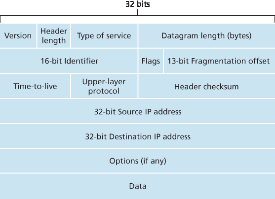

.. _c4.3:

4.3 互联网协议 (IP): IPv4、寻址、IPv6 等
=====================================================================
4.3 The Internet Protocol (IP): IPv4, Addressing, IPv6, and More

.. tab:: 中文

.. tab:: 英文

Our study of the network layer thus far in :ref:`Chapter 4 <c4>`—the notion of the data and control plane
component of the network layer, our distinction between forwarding and routing, the identification of
various network service models, and our look inside a router—have often been without reference to any
specific computer network architecture or protocol. In this section we’ll focus on key aspects of the
network layer on today’s Internet and the celebrated Internet Protocol (IP).

There are two versions of IP in use today. We’ll first examine the widely deployed IP protocol version 4,
which is usually referred to simply as IPv4 :ref:`[RFC 791] <RFC 791>` in :ref:`Section 4.3.1 <c4.3.1>`. We’ll examine IP version 6 [:ref:`RFC 2460 <RFC 2460>`; :ref:`RFC 4291 <RFC 4291>`], which has been proposed to
replace IPv4, in :ref:`Section 4.3.5 <c4.3.5>`. In between, we’ll primarily cover Internet addressing—a topic that might
seem rather dry and detail-oriented but we’ll see is crucial to understanding how the Internet’s network
layer works. To master IP addressing is to master the Internet’s network layer itself!

.. _Figure 4.16:

**Figure 4.16 IPv4 datagram format**

.. _c4.3.1:

4.3.1 IPv4 数据报格式
----------------------------------------------------------
4.3.1 IPv4 Datagram Format

.. tab:: 中文

.. tab:: 英文

Recall that the Internet’s network-layer packet is referred to as a datagram. We begin our study of IP
with an overview of the syntax and semantics of the IPv4 datagram. You might be thinking that nothing
could be drier than the syntax and semantics of a packet’s bits. Nevertheless, the datagram plays a
central role in the Internet—every networking student and professional needs to see it, absorb it, and
master it. (And just to see that protocol headers can indeed be fun to study, check out :ref:`[Pomeranz 2010] <Pomeranz 2010>`). The IPv4 datagram format is shown in :ref:`Figure 4.16 <Figure 4.16>`. The key fields in the IPv4 datagram are the
following:

- **Version number**. These 4 bits specify the IP protocol version of the datagram. By looking at the version number, the router can determine how to interpret the remainder of the IP datagram. Different versions of IP use different datagram formats. The datagram format for IPv4 is shown in :ref:`Figure 4.16 <Figure 4.16>`. The datagram format for the new version of IP (IPv6) is discussed in :ref:`Section 4.3.5 <c4.3.5>`.
- **Header length**. Because an IPv4 datagram can contain a variable number of options (which are included in the IPv4 datagram header), these 4 bits are needed to determine where in the IP datagram the payload (e.g., the transport-layer segment being encapsulated in this datagram) actually begins. Most IP datagrams do not contain options, so the typical IP datagram has a 20-byte header.
- **Type of service**. The type of service (TOS) bits were included in the IPv4 header to allow different types of IP datagrams to be distinguished from each other. For example, it might be useful to distinguish real-time datagrams (such as those used by an IP telephony application) from non-real- time traffic (for example, FTP). The specific level of service to be provided is a policy issue determined and configured by the network administrator for that router. We also learned in :ref:`Section 3.7.2 <c3.7.2>` that two of the TOS bits are used for Explicit Congestion ­Notification.
- **Datagram length**. This is the total length of the IP datagram (header plus data), measured in bytes. Since this field is 16 bits long, the theoretical maximum size of the IP datagram is 65,535 bytes. However, datagrams are rarely larger than 1,500 bytes, which allows an IP datagram to fit in the payload field of a maximally sized Ethernet frame.
- **Identifier, flags, fragmentation offset**. These three fields have to do with so-called IP fragmentation, a topic we will consider shortly. Interestingly, the new version of IP, IPv6, does not allow for fragmentation.
- **Time-to-live**. The time-to-live (TTL) field is included to ensure that datagrams do not circulate forever (due to, for example, a long-lived routing loop) in the network. This field is decremented by one each time the datagram is processed by a router. If the TTL field reaches 0, a router must drop that datagram.
- **Protocol**. This field is typically used only when an IP datagram reaches its final destination. The value of this field indicates the specific transport-layer protocol to which the data portion of this IP datagram should be passed. For example, a value of 6 indicates that the data portion is passed to TCP, while a value of 17 indicates that the data is passed to UDP. For a list of all possible values,see :ref:`[IANA Protocol Numbers 2016] <IANA Protocol Numbers 2016>`. Note that the protocol number in the IP datagram has a role that is analogous to the role of the port number field in the transport-layer segment. The protocol number is the glue that binds the network and transport layers together, whereas the port number is the glue that binds the transport and application layers together. We’ll see in :ref:`Chapter 6 <c6>` that the link- layer frame also has a special field that binds the link layer to the network layer.
- **Header checksum**. The header checksum aids a router in detecting bit errors in a received IP datagram. The header checksum is computed by treating each 2 bytes in the header as a number and summing these numbers using 1s complement arithmetic. As discussed in :ref:`Section 3.3 <c3.3>`, the 1s complement of this sum, known as the Internet checksum, is stored in the checksum field. A router computes the header checksum for each received IP datagram and detects an error condition if the checksum carried in the datagram header does not equal the computed checksum. Routers typically discard datagrams for which an error has been detected. Note that the checksum must be recomputed and stored again at each router, since the TTL field, and possibly the options field as well, will change. An interesting discussion of fast algorithms for computing the Internet checksum is :ref:`[RFC 1071] <RFC 1071>`. A question often asked at this point is, why does TCP/IP perform error checking at both the transport and network layers? There are several reasons for this repetition. First, note that only the IP header is checksummed at the IP layer, while the TCP/UDP checksum is computed over the entire TCP/UDP segment. Second, TCP/UDP and IP do not necessarily both have to belong to the same protocol stack. TCP can, in principle, run over a different network-layer protocol (for example, ATM) :ref:`[Black 1995] <Black 1995>`) and IP can carry data that will not be passed to TCP/UDP.
- **Source and destination IP addresses**. When a source creates a datagram, it inserts its IP address into the source IP address field and inserts the address of the ultimate destination into the destination IP address field. Often the source host determines the destination address via a DNS lookup, as discussed in :ref:`Chapter 2 <c2>`. We’ll discuss IP addressing in detail in :ref:`Section 4.3.3 <c4.3.3>`.
- **Options**. The options fields allow an IP header to be extended. Header options were meant to be used rarely—hence the decision to save overhead by not including the information in options fields in every datagram header. However, the mere existence of options does complicate matters—since datagram headers can be of variable length, one cannot determine a priori where the data field will start. Also, since some datagrams may require options processing and others may not, the amount of time needed to process an IP datagram at a router can vary greatly. These considerations become particularly important for IP processing in high-performance routers and hosts. For these reasons and others, IP options were not included in the IPv6 header, as discussed in :ref:`Section 4.3.5 <c4.3.5>`.
- **Data (payload)**. Finally, we come to the last and most important field—the raison d’etre for the datagram in the first place! In most circumstances, the data field of the IP datagram contains the transport-layer segment (TCP or UDP) to be delivered to the destination. However, the data field can carry other types of data, such as ICMP messages (discussed in :ref:`Section 5.6 <c5.6>`).

Note that an IP datagram has a total of 20 bytes of header (assuming no options). If the datagram
carries a TCP segment, then each (non-fragmented) datagram carries a total of 40 bytes of header (20
bytes of IP header plus 20 bytes of TCP header) along with the application-layer message.

.. _c4.3.2:

4.3.2 IPv4 数据报碎片
----------------------------------------------------------
4.3.2 IPv4 Datagram Fragmentation

.. tab:: 中文

.. tab:: 英文

.. _c4.3.3:

4.3.3 IPv4 寻址
----------------------------------------------------------
4.3.3 IPv4 Addressing

.. tab:: 中文

.. tab:: 英文

.. _c4.3.4:

4.3.4 网络地址转换 （NAT）
----------------------------------------------------------
4.3.4 Network Address Translation (NAT)

.. tab:: 中文

.. tab:: 英文

.. _c4.3.5:

4.3.5 IPv6 端口
----------------------------------------------------------
4.3.5 IPv6

.. tab:: 中文

.. tab:: 英文

