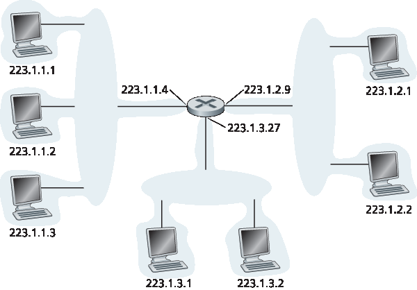
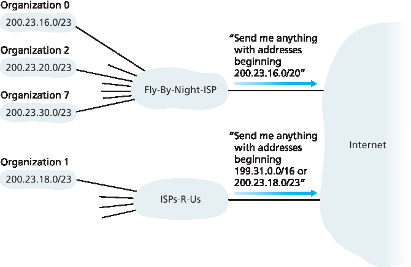
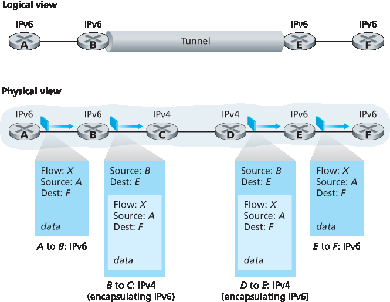

.. _c4.3:

4.3 互联网协议 (IP): IPv4、寻址、IPv6 等
=====================================================================
4.3 The Internet Protocol (IP): IPv4, Addressing, IPv6, and More

.. tab:: 中文

.. tab:: 英文

Our study of the network layer thus far in :ref:`Chapter 4 <c4>`—the notion of the data and control plane
component of the network layer, our distinction between forwarding and routing, the identification of
various network service models, and our look inside a router—have often been without reference to any
specific computer network architecture or protocol. In this section we’ll focus on key aspects of the
network layer on today’s Internet and the celebrated Internet Protocol (IP).

There are two versions of IP in use today. We’ll first examine the widely deployed IP protocol version 4,
which is usually referred to simply as IPv4 :ref:`[RFC 791] <RFC 791>` in :ref:`Section 4.3.1 <c4.3.1>`. We’ll examine IP version 6 [:ref:`RFC 2460 <RFC 2460>`; :ref:`RFC 4291 <RFC 4291>`], which has been proposed to
replace IPv4, in :ref:`Section 4.3.5 <c4.3.5>`. In between, we’ll primarily cover Internet addressing—a topic that might
seem rather dry and detail-oriented but we’ll see is crucial to understanding how the Internet’s network
layer works. To master IP addressing is to master the Internet’s network layer itself!

.. figure:: ../img/376-0.png 
    :align: center

.. _Figure 4.16:

**Figure 4.16 IPv4 datagram format**

.. _c4.3.1:

4.3.1 IPv4 数据报格式
----------------------------------------------------------
4.3.1 IPv4 Datagram Format

.. tab:: 中文

.. tab:: 英文

Recall that the Internet’s network-layer packet is referred to as a datagram. We begin our study of IP
with an overview of the syntax and semantics of the IPv4 datagram. You might be thinking that nothing
could be drier than the syntax and semantics of a packet’s bits. Nevertheless, the datagram plays a
central role in the Internet—every networking student and professional needs to see it, absorb it, and
master it. (And just to see that protocol headers can indeed be fun to study, check out :ref:`[Pomeranz 2010] <Pomeranz 2010>`). The IPv4 datagram format is shown in :ref:`Figure 4.16 <Figure 4.16>`. The key fields in the IPv4 datagram are the
following:

- **Version number**. These 4 bits specify the IP protocol version of the datagram. By looking at the version number, the router can determine how to interpret the remainder of the IP datagram. Different versions of IP use different datagram formats. The datagram format for IPv4 is shown in :ref:`Figure 4.16 <Figure 4.16>`. The datagram format for the new version of IP (IPv6) is discussed in :ref:`Section 4.3.5 <c4.3.5>`.
- **Header length**. Because an IPv4 datagram can contain a variable number of options (which are included in the IPv4 datagram header), these 4 bits are needed to determine where in the IP datagram the payload (e.g., the transport-layer segment being encapsulated in this datagram) actually begins. Most IP datagrams do not contain options, so the typical IP datagram has a 20-byte header.
- **Type of service**. The type of service (TOS) bits were included in the IPv4 header to allow different types of IP datagrams to be distinguished from each other. For example, it might be useful to distinguish real-time datagrams (such as those used by an IP telephony application) from non-real- time traffic (for example, FTP). The specific level of service to be provided is a policy issue determined and configured by the network administrator for that router. We also learned in :ref:`Section 3.7.2 <c3.7.2>` that two of the TOS bits are used for Explicit Congestion ­Notification.
- **Datagram length**. This is the total length of the IP datagram (header plus data), measured in bytes. Since this field is 16 bits long, the theoretical maximum size of the IP datagram is 65,535 bytes. However, datagrams are rarely larger than 1,500 bytes, which allows an IP datagram to fit in the payload field of a maximally sized Ethernet frame.
- **Identifier, flags, fragmentation offset**. These three fields have to do with so-called IP fragmentation, a topic we will consider shortly. Interestingly, the new version of IP, IPv6, does not allow for fragmentation.
- **Time-to-live**. The time-to-live (TTL) field is included to ensure that datagrams do not circulate forever (due to, for example, a long-lived routing loop) in the network. This field is decremented by one each time the datagram is processed by a router. If the TTL field reaches 0, a router must drop that datagram.
- **Protocol**. This field is typically used only when an IP datagram reaches its final destination. The value of this field indicates the specific transport-layer protocol to which the data portion of this IP datagram should be passed. For example, a value of 6 indicates that the data portion is passed to TCP, while a value of 17 indicates that the data is passed to UDP. For a list of all possible values,see :ref:`[IANA Protocol Numbers 2016] <IANA Protocol Numbers 2016>`. Note that the protocol number in the IP datagram has a role that is analogous to the role of the port number field in the transport-layer segment. The protocol number is the glue that binds the network and transport layers together, whereas the port number is the glue that binds the transport and application layers together. We’ll see in :ref:`Chapter 6 <c6>` that the link- layer frame also has a special field that binds the link layer to the network layer.
- **Header checksum**. The header checksum aids a router in detecting bit errors in a received IP datagram. The header checksum is computed by treating each 2 bytes in the header as a number and summing these numbers using 1s complement arithmetic. As discussed in :ref:`Section 3.3 <c3.3>`, the 1s complement of this sum, known as the Internet checksum, is stored in the checksum field. A router computes the header checksum for each received IP datagram and detects an error condition if the checksum carried in the datagram header does not equal the computed checksum. Routers typically discard datagrams for which an error has been detected. Note that the checksum must be recomputed and stored again at each router, since the TTL field, and possibly the options field as well, will change. An interesting discussion of fast algorithms for computing the Internet checksum is :ref:`[RFC 1071] <RFC 1071>`. A question often asked at this point is, why does TCP/IP perform error checking at both the transport and network layers? There are several reasons for this repetition. First, note that only the IP header is checksummed at the IP layer, while the TCP/UDP checksum is computed over the entire TCP/UDP segment. Second, TCP/UDP and IP do not necessarily both have to belong to the same protocol stack. TCP can, in principle, run over a different network-layer protocol (for example, ATM) :ref:`[Black 1995] <Black 1995>`) and IP can carry data that will not be passed to TCP/UDP.
- **Source and destination IP addresses**. When a source creates a datagram, it inserts its IP address into the source IP address field and inserts the address of the ultimate destination into the destination IP address field. Often the source host determines the destination address via a DNS lookup, as discussed in :ref:`Chapter 2 <c2>`. We’ll discuss IP addressing in detail in :ref:`Section 4.3.3 <c4.3.3>`.
- **Options**. The options fields allow an IP header to be extended. Header options were meant to be used rarely—hence the decision to save overhead by not including the information in options fields in every datagram header. However, the mere existence of options does complicate matters—since datagram headers can be of variable length, one cannot determine a priori where the data field will start. Also, since some datagrams may require options processing and others may not, the amount of time needed to process an IP datagram at a router can vary greatly. These considerations become particularly important for IP processing in high-performance routers and hosts. For these reasons and others, IP options were not included in the IPv6 header, as discussed in :ref:`Section 4.3.5 <c4.3.5>`.
- **Data (payload)**. Finally, we come to the last and most important field—the raison d’etre for the datagram in the first place! In most circumstances, the data field of the IP datagram contains the transport-layer segment (TCP or UDP) to be delivered to the destination. However, the data field can carry other types of data, such as ICMP messages (discussed in :ref:`Section 5.6 <c5.6>`).

Note that an IP datagram has a total of 20 bytes of header (assuming no options). If the datagram
carries a TCP segment, then each (non-fragmented) datagram carries a total of 40 bytes of header (20
bytes of IP header plus 20 bytes of TCP header) along with the application-layer message.

.. _c4.3.2:

4.3.2 IPv4 数据报碎片
----------------------------------------------------------
4.3.2 IPv4 Datagram Fragmentation

.. tab:: 中文

.. tab:: 英文

We’ll see in :ref:`Chapter 6 <c6>` that not all link-layer protocols can carry network-layer packets of the same size. Some protocols can carry big datagrams, whereas other protocols can carry only little datagrams. For example, Ethernet frames can carry up to 1,500 bytes of data, whereas frames for some wide-area links can carry no more than 576 bytes. The maximum amount of data that a link-layer frame can carry is called the **maximum transmission unit (MTU)**. Because each IP datagram is encapsulated within the link-layer frame for transport from one router to the next router, the MTU of the link-layer protocol places a hard limit on the length of an IP datagram. Having a hard limit on the size of an IP datagram is not much of a problem. What is a problem is that each of the links along the route between sender and destination can use different link-layer protocols, and each of these protocols can have different MTUs.

To understand the forwarding issue better, imagine that you are a router that interconnects several links, each running different link-layer protocols with different MTUs. Suppose you receive an IP datagram from one link. You check your forwarding table to determine the outgoing link, and this outgoing link has an MTU that is smaller than the length of the IP datagram. Time to panic—how are you going to squeeze this oversized IP datagram into the payload field of the link-layer frame? The solution is to fragment the payload in the IP datagram into two or more smaller IP datagrams, encapsulate each of these smaller IP datagrams in a separate link-layer frame; and send these frames over the outgoing link. Each of these smaller datagrams is referred to as a **fragment**.

Fragments need to be reassembled before they reach the transport layer at the destination. Indeed, both TCP and UDP are expecting to receive complete, unfragmented segments from the network layer. The designers of IPv4 felt that reassembling datagrams in the routers would introduce significant complication into the protocol and put a damper on router performance. (If you were a router, would you want to be reassembling fragments on top of everything else you had to do?) Sticking to the principle of keeping the network core simple, the designers of IPv4 decided to put the job of datagram reassembly in the end systems rather than in network routers.

When a destination host receives a series of datagrams from the same source, it needs to determine whether any of these datagrams are fragments of some original, larger datagram. If some datagrams are fragments, it must further determine when it has received the last fragment and how the fragments it has received should be pieced back together to form the original datagram. To allow the destination host to perform these reassembly tasks, the designers of IP (version 4) put *identification*, flag, and fragmentation offset fields in the IP datagram header. When a datagram is created, the sending host stamps the datagram with an identification number as well as source and destination addresses. Typically, the sending host increments the identification number for each datagram it sends. When a router needs to fragment a datagram, each resulting datagram (that is, fragment) is stamped with the source address, destination address, and identification number of the original datagram. When the destination receives a series of datagrams from the same sending host, it can examine the identification numbers of the datagrams to determine which of the datagrams are actually fragments of the same larger datagram. Because IP is an unreliable service, one or more of the fragments may never arrive at the destination. For this reason, in order for the destination host to be absolutely sure it has received the last fragment of the original datagram, the last fragment has a flag bit set to 0, whereas all the other fragments have this flag bit set to 1. Also, in order for the destination host to determine whether a fragment is missing (and also to be able to reassemble the fragments in their proper order), the offset field is used to specify where the fragment fits within the original IP datagram.

.. figure:: ../img/380-0.png
    :align: center

.. _Figure 4.17:

**Figure 4.17 IP fragmentation and reassembly**

:ref:`Figure 4.17 <Figure 4.17>` illustrates an example. A datagram of 4,000 bytes (20 bytes of IP header plus 3,980 bytes of IP payload) arrives at a router and must be forwarded to a link with an MTU of 1,500 bytes. This implies that the 3,980 data bytes in the original datagram must be allocated to three separate fragments (each of which is also an IP datagram).

The online material for this book, and the problems at the end of this chapter will allow you to explore fragmentation in more detail. Also, on this book’s Web site, we provide a Java applet that generates fragments. You provide the incoming datagram size, the MTU, and the incoming datagram identification.
 
The applet automatically generates the fragments for you. See http://www.pearsonhighered.com/cs-resources/.

.. _c4.3.3:

4.3.3 IPv4 寻址
----------------------------------------------------------
4.3.3 IPv4 Addressing

.. tab:: 中文

.. tab:: 英文

We now turn our attention to IPv4 addressing. Although you may be thinking that addressing must be a straightforward topic, hopefully by the end of this section you’ll be convinced that Internet addressing is not only a juicy, subtle, and interesting topic but also one that is of central importance to the Internet. An
excellent treatment of IPv4 addressing can be found in the first chapter in :ref:`[Stewart 1999] <Stewart 1999>`.

Before discussing IP addressing, however, we’ll need to say a few words about how hosts and routers are connected into the Internet. A host typically has only a single link into the network; when IP in the host wants to send a datagram, it does so over this link. The boundary between the host and the physical link is called an interface. Now consider a router and its **interfaces**. Because a router’s job is to receive a datagram on one link and forward the datagram on some other link, a router necessarily has two or more links to which it is connected. The boundary between the router and any one of its links is also called an interface. A router thus has multiple interfaces, one for each of its links. Because every host and router is capable of sending and receiving IP datagrams, IP requires each host and router interface to have its own IP address. *Thus, an IP address is technically associated with an interface, rather than with the host or router containing that interface*.

Each IP address is 32 bits long (equivalently, 4 bytes), and there are thus a total of :math:`2^{32}` (or approximately 4 billion) possible IP addresses. These addresses are typically written in so-called **dotted-decimal notation**, in which each byte of the address is written in its decimal form and is separated by a period (dot) from other bytes in the address. For example, consider the IP address 193.32.216.9. The 193 is the decimal equivalent of the first 8 bits of the address; the 32 is the decimal equivalent of the second 8 bits of the address, and so on. Thus, the address 193.32.216.9 in binary notation is

    11000001 00100000 11011000 00001001

Each interface on every host and router in the global Internet must have an IP address that is globally
unique (except for interfaces behind NATs, as discussed in :ref:`Section 4.3.4 <c4.3.4>`). These addresses cannot be chosen in a willy-nilly manner, however. A portion of an interface’s IP address will be determined by the subnet to which it is connected.

:ref:`Figure 4.18 <Figure 4.18>` provides an example of IP addressing and interfaces. In this figure, one router (with three interfaces) is used to interconnect seven hosts. Take a close look at the IP addresses assigned to the host and router interfaces, as there are several things to notice. The three hosts in the upper-left portion of :ref:`Figure 4.18 <Figure 4.18>`, and the router interface to which they are connected, all have an IP address of the form 223.1.1.xxx. That is, they all have the same leftmost 24 bits in their IP address. These four interfaces are also interconnected to each other by a network that contains no routers. This network could be interconnected by an Ethernet LAN, in which case the interfaces would be interconnected by an Ethernet switch (as we’ll discuss in :ref:`Chapter 6 <c6>`), or by a wireless access point (as we’ll discuss in :ref:`Chapter 7 <c7>`). We’ll represent this routerless network connecting these hosts as a cloud for now, and dive into the internals of such networks in :ref:`Chapters 6 <c6>` and :ref:`7 <c7>`.

.. _Figure 4.18:

**Figure 4.18 Interface addresses and subnets**

In IP terms, this network interconnecting three host interfaces and one router interface forms a subnet :ref:`[RFC 950] <RFC 950>`. (A subnet is also called an IP network or simply a *network* in the Internet literature.) IP addressing assigns an address to this subnet: 223.1.1.0/24, where the /24 (“slash-24”) notation, sometimes known as a **subnet mask**, indicates that the leftmost 24 bits of the 32-bit quantity define the subnet address. The 223.1.1.0/24 subnet thus consists of the three host interfaces (223.1.1.1, 223.1.1.2, and 223.1.1.3) and one router interface (223.1.1.4). Any additional hosts attached to the 223.1.1.0/24 subnet would be required to have an address of the form 223.1.1.xxx. There are two additional subnets shown in :ref:`Figure 4.18 <Figure 4.18>`: the 223.1.2.0/24 network and the 223.1.3.0/24 subnet. :ref:`Figure 4.19 <Figure 4.19>` illustrates the three IP subnets present in :ref:`Figure 4.18 <Figure 4.18>`.

The IP definition of a subnet is not restricted to Ethernet segments that connect multiple hosts to a router interface. To get some insight here, consider :ref:`Figure 4.20 <Figure 4.20>`, which shows three routers that are interconnected with each other by point-to-point links. Each router has three interfaces, one for each point-to-point link and one for the broadcast link that directly connects the router to a pair of hosts. What
 
subnets are present here? Three subnets, 223.1.1.0/24, 223.1.2.0/24, and 223.1.3.0/24, are similar to the subnets we encountered in :ref:`Figure 4.18 <Figure 4.18>`. But note that there are three additional subnets in this example as well: one subnet, 223.1.9.0/24, for the interfaces that connect routers R1 and R2; another subnet, 223.1.8.0/24, for the interfaces that connect routers R2 and R3; and a third subnet, 223.1.7.0/24, for the interfaces that connect routers R3 and R1. For a general interconnected system of routers and hosts, we can use the following recipe to define the subnets in the system:

.. figure:: ../img/383-0.png
    :align: center

.. _Figure 4.19:

**Figure 4.19 Subnet addresses**

    To determine the subnets, detach each interface from its host or router, creating islands of isolated networks, with interfaces terminating the end points of the isolated networks. Each of these isolated networks is called a **subnet**.

If we apply this procedure to the interconnected system in :ref:`Figure 4.20 <Figure 4.20>`, we get six islands or subnets.

From the discussion above, it’s clear that an organization (such as a company or academic institution) with multiple Ethernet segments and point-to-point links will have multiple subnets, with all of the devices on a given subnet having the same subnet address. In principle, the different subnets could have quite different subnet addresses. In practice, however, their subnet addresses often have much in common. To understand why, let’s next turn our attention to how addressing is handled in the global Internet.

The Internet’s address assignment strategy is known as **Classless Interdomain Routing (CIDR— pronounced cider)** :ref:`[RFC 4632] <RFC 4632>`. CIDR generalizes the notion of subnet addressing. As with subnet addressing, the 32-bit IP address is divided into two parts and again has the dotted-decimal form a.b.c.d/x, where x indicates the number of bits in the first part of the address.

The x most significant bits of an address of the form a.b.c.d/x constitute the network portion of the IP address, and are often referred to as the **prefix** (or *network prefix*) of the address. An organization is typically assigned a block of contiguous addresses, that is, a range of addresses with a common prefix (see the :ref:`Principles in Practice <Principles in Practice>` feature). In this case, the IP addresses of devices within the organization will share the common prefix. When we cover the Internet’s BGP routing protocol in Section 5.4, we’ll see that only these x leading prefix bits are considered by routers outside the organization’s network. That is, when a router outside the organization forwards a datagram whose destination address is inside the organization, only the leading x bits of the address need be considered. This considerably reduces the size of the forwarding table in these routers, since a single entry of the form a.b.c.d/x will be sufficient to forward packets to any destination within the organization.

.. figure:: ../img/384-0.png
    :align: center

.. _Figure 4.20:

**Figure 4.20 Three routers interconnecting six subnets**

The remaining 32-x bits of an address can be thought of as distinguishing among the devices within the organization, all of which have the same network prefix. These are the bits that will be considered when forwarding packets at routers within the organization. These lower-order bits may (or may not) have an additional subnetting structure, such as that discussed above. For example, suppose the first 21 bits of the CIDRized address a.b.c.d/21 specify the organization’s network prefix and are common to the IP addresses of all devices in that organization. The remaining 11 bits then identify the specific hosts in the organization. The organization’s internal structure might be such that these 11 rightmost bits are used for subnetting within the organization, as discussed above. For example, a.b.c.d/24 might refer to a specific subnet within the organization.

Before CIDR was adopted, the network portions of an IP address were constrained to be 8, 16, or 24 bits in length, an addressing scheme known as **classful addressing**, since subnets with 8-, 16-, and 24-bit subnet addresses were known as class A, B, and C networks, respectively. The requirement that the subnet portion of an IP address be exactly 1, 2, or 3 bytes long turned out to be problematic for supporting the rapidly growing number of organizations with small and medium-sized subnets. A class C (/24) subnet could accommodate only up to 28 − 2 = 254 hosts (two of the 28 = 256 addresses are reserved for special use)—too small for many organizations. However, a class B (/16) subnet, which supports up to 65,634 hosts, was too large. Under classful addressing, an organization with, say, 2,000 hosts was typically allocated a class B (/16) subnet address. This led to a rapid depletion of the class B address space and poor utilization of the assigned address space. For example, the organization that used a class B address for its 2,000 hosts was allocated enough of the address space for up to 65,534 interfaces—leaving more than 63,000 addresses that could not be used by other organizations.

.. _PRINCIPLES IN PRACTICE:

.. admonition:: PRINCIPLES IN PRACTICE

    This example of an ISP that connects eight organizations to the Internet nicely illustrates how carefully allocated CIDRized addresses facilitate routing. Suppose, as shown in :ref:`Figure 4.21 <Figure 4.21>`, that the ISP (which we’ll call Fly-By-Night-ISP) advertises to the outside world that it should be sent any datagrams whose first 20 address bits match 200.23.16.0/20. The rest of the world need not know that within the address block 200.23.16.0/20 there are in fact eight other organizations, each with its own subnets. This ability to use a single prefix to advertise multiple networks is often referred to as **address aggregation** (also **route aggregation** or **route summarization**).

    Address aggregation works extremely well when addresses are allocated in blocks to ISPs and then from ISPs to client organizations. But what happens when addresses are not allocated in such a hierarchical manner? What would happen, for example, if Fly-By-Night-ISP acquires ISPs-R-Us and then has Organization 1 connect to the Internet through its subsidiary ISPs-R-Us? As shown in :ref:`Figure 4.21 <Figure 4.21>`, the subsidiary ISPs-R-Us owns the address block 199.31.0.0/16, but Organization 1’s IP addresses are unfortunately outside of this address block. What should be done here? Certainly, Organization 1 could renumber all of its routers and hosts to have addresses within the ISPs-R-Us address block. But this is a costly solution, and Organization 1 might well be reassigned to another subsidiary in the future. The solution typically adopted is for Organization 1 to keep its IP addresses in 200.23.18.0/23. In this case, as shown in :ref:`Figure 4.22 <Figure 4.22>`, Fly-By-Night-ISP continues to advertise the address block 200.23.16.0/20 and ISPs-R-Us continues to advertise 199.31.0.0/16. However, ISPs-R-Us now also advertises the block of addresses for Organization 1, 200.23.18.0/23. When other routers in the larger Internet see the address blocks 200.23.16.0/20 (from Fly-By-Night-ISP) and 200.23.18.0/23 (from ISPs-R-Us) and want to route to an address in the block 200.23.18.0/23, they will use longest prefix matching (see :ref:`Section 4.2.1 <c4.2.1>`), and route toward ISPs-R-Us, as it advertises the longest (i.e., most-specific) address prefix that matches the destination address.

.. figure:: ../img/386-0.png
    :align: center

.. _Figure 4.21:

**Figure 4.21 Hierarchical addressing and route aggregation**

.. _Figure 4.22:

**Figure 4.22 ISPs-R-Us has a more specific route to Organization 1**

We would be remiss if we did not mention yet another type of IP address, the IP broadcast address 255.255.255.255. When a host sends a datagram with destination address 255.255.255.255, the message is delivered to all hosts on the same subnet. Routers optionally forward the message into neighboring subnets as well (although they usually don’t).

Having now studied IP addressing in detail, we need to know how hosts and subnets get their addresses in the first place. Let’s begin by looking at how an organization gets a block of addresses for its devices, and then look at how a device (such as a host) is assigned an address from within the organization’s block of addresses.

Obtaining a Block of Addresses
~~~~~~~~~~~~~~~~~~~~~~~~~~~~~~~~

In order to obtain a block of IP addresses for use within an organization’s subnet, a network administrator might first contact its ISP, which would provide addresses from a larger block of addresses that had already been allocated to the ISP. For example, the ISP may itself have been allocated the address block 200.23.16.0/20. The ISP, in turn, could divide its address block into eight equal-sized contiguous address blocks and give one of these address blocks out to each of up to eight organizations that are supported by this ISP, as shown below. (We have underlined the subnet part of these addresses for your convenience.)

.. code:: text 

    ISP’s block:     200.23.16.0/20     11001000 00010111 00010000 00000000

    Organization 0   200.23.16.0/23     11001000 00010111 00010000 00000000

    Organization 1   200.23.18.0/23     11001000 00010111 00010010 00000000

    Organization 2   200.23.20.0/23     11001000 00010111 00010100 00000000

    ... ... 

    Organization 7   200.23.30.0/23     11001000 00010111 00011110 00000000

While obtaining a set of addresses from an ISP is one way to get a block of addresses, it is not the only way. Clearly, there must also be a way for the ISP itself to get a block of addresses. Is there a global authority that has ultimate responsibility for managing the IP address space and allocating address blocks to ISPs and other organizations? Indeed there is! IP addresses are managed under the authority of the Internet Corporation for Assigned Names and Numbers (ICANN) :ref:`[ICANN 2016] <ICANN 2016>`, based on guidelines set forth in :ref:`[RFC 7020] <RFC 7020>`. The role of the nonprofit ICANN organization :ref:`[NTIA 1998] <NTIA 1998>` is not only to allocate IP addresses, but also to manage the DNS root servers. It also has the very contentious job of assigning domain names and resolving domain name disputes. The ICANN allocates addresses to regional Internet registries (for example, ARIN, RIPE, APNIC, and LACNIC, which together form the Address Supporting Organization of ICANN :ref:`[ASO-ICANN 2016] <ASO-ICANN 2016>`), and handle the allocation/management of addresses within their regions.

Obtaining a Host Address: The Dynamic Host Configuration Protocol
~~~~~~~~~~~~~~~~~~~~~~~~~~~~~~~~~~~~~~~~~~~~~~~~~~~~~~~~~~~~~~~~~~~~

Once an organization has obtained a block of addresses, it can assign individual IP addresses to the host and router interfaces in its organization. A system administrator will typically manually configure the IP addresses into the router (often remotely, with a network management tool). Host addresses can also be configured manually, but typically this is done using the **Dynamic Host Configuration Protocol (DHCP)** :ref:`[RFC 2131] <RFC 2131>`. DHCP allows a host to obtain (be allocated) an IP address automatically. A network administrator can configure DHCP so that a given host receives the same IP address each time it connects to the network, or a host may be assigned a **temporary IP address** that will be different each time the host connects to the network. In addition to host IP address assignment, DHCP also allows a host to learn additional information, such as its subnet mask, the address of its first-hop router (often called the default gateway), and the address of its local DNS server.

Because of DHCP’s ability to automate the network-related aspects of connecting a host into a network, it is often referred to as a **plug-and-play** or **zeroconf** (zero-configuration) protocol. This capability
makes it very attractive to the network administrator who would otherwise have to perform these tasks manually! DHCP is also enjoying widespread use in residential Internet access networks, enterprise
   
networks, and in wireless LANs, where hosts join and leave the network frequently. Consider, for example, the student who carries a laptop from a dormitory room to a library to a classroom. It is likely that in each location, the student will be connecting into a new subnet and hence will need a new IP address at each location. DHCP is ideally suited to this situation, as there are many users coming and going, and addresses are needed for only a limited amount of time. The value of DHCP’s plug-and-play capability is clear, since it’s unimaginable that a system administrator would be able to reconfigure laptops at each location, and few students (except those taking a computer networking class!) would have the expertise to configure their laptops manually. DHCP is a client-server protocol. A client is typically a newly arriving host wanting to obtain network configuration information, including an IP address for itself. In the simplest case, each subnet (in the addressing sense of :ref:`Figure 4.20 <Figure 4.20>`) will have a DHCP server. If no server is present on the subnet, a DHCP relay agent (typically a router) that knows the address of a DHCP server for that network is needed. :ref:`Figure 4.23 <Figure 4.23>` shows a DHCP server attached to subnet 223.1.2/24, with the router serving as the relay agent for arriving clients attached to subnets 223.1.1/24 and 223.1.3/24. In our discussion below, we’ll assume that a DHCP server is available on the subnet.

For a newly arriving host, the DHCP protocol is a four-step process, as shown in :ref:`Figure 4.24 <Figure 4.24>` for the network setting shown in :ref:`Figure 4.23 <Figure 4.23>`. In this figure, ``yiaddr`` (as in “your Internet address”) indicates the address being allocated to the newly arriving client. The four steps are:

.. figure:: ../img/389-0.png
    :align: center

.. _Figure 4.23:

**Figure 4.23 DHCP client and server**

- **DHCP server discovery**. The first task of a newly arriving host is to find a DHCP server with which to interact. This is done using a **DHCP discover message**, which a client sends within a UDP packet to port 67. The UDP packet is encapsulated in an IP datagram. But to whom should this datagram be sent? The host doesn’t even know the IP address of the network to which it is attaching, much less the address of a DHCP server for this network. Given this, the DHCP client creates an IP datagram containing its DHCP discover message along with the broadcast destination IP address of 255.255.255.255 and a “this host” source IP address of 0.0.0.0. The DHCP client passes the IP datagram to the link layer, which then broadcasts this frame to all nodes attached to the subnet (we will cover the details of link-layer broadcasting in :ref:`Section 6.4 <c6.4>`).
- **DHCP server offer(s)**. A DHCP server receiving a DHCP discover message responds to the client with a **DHCP offer message** that is broadcast to all nodes on the subnet, again using the IP broadcast address of 255.255.255.255. (You might want to think about why this server reply must also be broadcast). Since several DHCP servers can be present on the subnet, the client may find itself in the enviable position of being able to choose from among several offers. Each server offer message contains the transaction ID of the received discover message, the proposed IP address for the client, the network mask, and an IP **address lease time**—the amount of time for which the IP address will be valid. It is common for the server to set the lease time to several hours or days :ref:`[Droms 2002] <Droms 2002>`.
  
  .. figure:: ../img/391-0.png
      :align: center
  
  .. _Figure 4.24:
  
  **Figure 4.24 DHCP client-server interaction**

- **DHCP request**. The newly arriving client will choose from among one or more server offers and respond to its selected offer with a **DHCP request message**, echoing back the configuration parameters.
- **DHCP ACK**. The server responds to the DHCP request message with a **DHCP ACK message**, confirming the requested parameters.

Once the client receives the DHCP ACK, the interaction is complete and the client can use the DHCP- allocated IP address for the lease duration. Since a client may want to use its address beyond the lease’s expiration, DHCP also provides a mechanism that allows a client to renew its lease on an IP address.

From a mobility aspect, DHCP does have one very significant shortcoming. Since a new IP address is obtained from DHCP each time a node connects to a new subnet, a TCP connection to a remote application cannot be maintained as a mobile node moves between subnets. In :ref:`Chapter 6 <c6>`, we will examine mobile IP—an extension to the IP infrastructure that allows a mobile node to use a single permanent address as it moves between subnets. Additional details about DHCP can be found in :ref:`[Droms 2002] <Droms 2002>` and :ref:`[dhc 2016] <dhc 2016>`. An open source reference implementation of DHCP is available from the Internet Systems Consortium :ref:`[ISC 2016] <ISC 2016>`.

.. _c4.3.4:

4.3.4 网络地址转换 （NAT）
----------------------------------------------------------
4.3.4 Network Address Translation (NAT)

.. tab:: 中文

.. tab:: 英文

Given our discussion about Internet addresses and the IPv4 datagram format, we’re now well aware that every IP-capable device needs an IP address. With the proliferation of small office, home office (SOHO) subnets, this would seem to imply that whenever a SOHO wants to install a LAN to connect multiple machines, a range of addresses would need to be allocated by the ISP to cover all of the SOHO’s IP devices (including phones, tablets, gaming devices, IP TVs, printers and more). If the subnet grew bigger, a larger block of addresses would have to be allocated. But what if the ISP had already allocated the contiguous portions of the SOHO network’s current address range? And what typical homeowner wants (or should need) to know how to manage IP addresses in the first place? Fortunately, there is a simpler approach to address allocation that has found increasingly widespread use in such scenarios: **network address translation (NAT)** [:ref:`RFC 2663 <RFC 2663>`; :ref:`RFC 3022 <RFC 3022>`; :ref:`Huston 2004 <Huston 2004>`, :ref:`Zhang 2007 <Zhang 2007>`; :ref:`Cisco NAT 2016 <Cisco NAT 2016>`].

:ref:`Figure 4.25 <Figure 4.25>` shows the operation of a NAT-enabled router. The NAT-enabled router, residing in the home, has an interface that is part of the home network on the right of :ref:`Figure 4.25 <Figure 4.25>`. Addressing within the home network is exactly as we have seen above—all four interfaces in the home network have the same subnet address of 10.0.0/24. The address space 10.0.0.0/8 is one of three portions of the IP address space that is reserved in :ref:`[RFC 1918] <RFC 1918>` for a **private network** or a **realm with private addresses**, such as the home network in :ref:`Figure 4.25 <Figure 4.25>`. A realm with private addresses refers to a network whose addresses only have meaning to devices within that network. To see why this is important, consider the fact that there are hundreds of thousands of home networks, many using the same address space, 10.0.0.0/24. Devices within a given home network can send packets to each other using 10.0.0.0/24 addressing. However, packets forwarded beyond the home network into the larger global Internet clearly cannot use these addresses (as either a source or a destination address) because there are hundreds of thousands of networks using this block of addresses. That is, the 10.0.0.0/24 addresses can only have meaning within the given home network. But if private addresses only have meaning within a given network, how is addressing handled when packets are sent to or received from the global Internet, where addresses are necessarily unique? The answer lies in understanding NAT. 

.. figure:: ../img/393-0.png
    :align: center

.. _Figure 4.25:

**Figure 4.25 Network address translation**

The NAT-enabled router does not look like a router to the outside world. Instead the NAT router behaves to the outside world as a single device with a single IP address. In :ref:`Figure 4.25 <Figure 4.25>`, all traffic
leaving the home router for the larger Internet has a source IP address of 138.76.29.7, and all traffic entering the home router must have a destination address of 138.76.29.7. In essence, the NAT-enabled router is hiding the details of the home network from the outside world. (As an aside, you might wonder where the home network computers get their addresses and where the router gets its single IP address. Often, the answer is the same—DHCP! The router gets its address from the ISP’s DHCP server, and the router runs a DHCP server to provide addresses to computers within the NAT-DHCP-router- controlled home network’s address space.)

If all datagrams arriving at the NAT router from the WAN have the same destination IP address (specifically, that of the WAN-side interface of the NAT router), then how does the router know the internal host to which it should forward a given datagram? The trick is to use a **NAT translation table** at the NAT router, and to include port numbers as well as IP addresses in the table entries.

Consider the example in :ref:`Figure 4.25 <Figure 4.25>`. Suppose a user sitting in a home network behind host 10.0.0.1 requests a Web page on some Web server (port 80) with IP address 128.119.40.186. The host 10.0.0.1 assigns the (arbitrary) source port number 3345 and sends the datagram into the LAN. The NAT router receives the datagram, generates a new source port number 5001 for the datagram, replaces the source IP address with its WAN-side IP address 138.76.29.7, and replaces the original source port number 3345 with the new source port number 5001. When generating a new source port number, the NAT router can select any source port number that is not currently in the NAT translation table. (Note that because a port number field is 16 bits long, the NAT protocol can support over 60,000 simultaneous connections with a single WAN-side IP address for the router!) NAT in the router also adds an entry to its NAT translation table. The Web server, blissfully unaware that the arriving datagram containing the HTTP request has been manipulated by the NAT router, responds with a datagram whose destination address is the IP address of the NAT router, and whose destination port number is 5001. When this datagram arrives at the NAT router, the router indexes the NAT translation table using the destination IP address and destination port number to obtain the appropriate IP address (10.0.0.1) and destination port number (3345) for the browser in the home network. The router then rewrites the datagram’s destination address and destination port number, and forwards the datagram into the home network.

NAT has enjoyed widespread deployment in recent years. But NAT is not without detractors. First, one might argue that, port numbers are meant to be used for addressing processes, not for addressing hosts. This violation can indeed cause problems for servers running on the home network, since, as we have seen in :ref:`Chapter 2 <c2>`, server processes wait for incoming requests at well-known port numbers and peers in a P2P protocol need to accept incoming connections when acting as servers. Technical solutions to these problems include **NAT traversal** tools :ref:`[RFC 5389] <RFC 5389>` and Universal Plug and Play (UPnP), a protocol that allows a host to discover and configure a nearby NAT :ref:`[UPnP Forum 2016] <UPnP Forum 2016>`.

More “philosophical” arguments have also been raised against NAT by architectural purists. Here, the concern is that routers are meant to be layer 3 (i.e., network-layer) devices, and should process packets only up to the network layer. NAT violates this principle that hosts should be talking directly with each other, without interfering nodes modifying IP addresses, much less port numbers. But like it or not, NAT has not become an important component of the Internet, as have other so-called **middleboxes** :ref:`[Sekar 2011] <Sekar 2011>` that operate at the network layer but have functions that are quite different from routers. Middleboxes do not perform traditional datagram forwarding, but instead perform functions such as NAT, load balancing of traffic flows, traffic firewalling (see accompanying sidebar), and more. The generalized forwarding paradigm that we’ll study shortly in :ref:`Section 4.4 <c4.4>` allows a number of these middlebox functions, as well as traditional router forwarding, to be accomplished in a common, integrated manner.

.. admonition:: FOCUS ON SECURITY

    INSPECTING DATAGRAMS: FIREWALLS AND INTRUSION DETECTION SYSTEMS

    Suppose you are assigned the task of administering a home, departmental, university, or corporate network. Attackers, knowing the IP address range of your network, can easily send IP datagrams to addresses in your range. These datagrams can do all kinds of devious things, including mapping your network with ping sweeps and port scans, crashing vulnerable hosts with malformed packets, scanning for open TCP/UDP ports on servers in your network, and infecting hosts by including malware in the packets. As the network administrator, what are you going to do about all those bad guys out there, each capable of sending malicious packets into your network? Two popular defense mechanisms to malicious packet attacks are firewalls and intrusion detection systems (IDSs).

    As a network administrator, you may first try installing a firewall between your network and the Internet. (Most access routers today have firewall capability.) Firewalls inspect the datagram and segment header fields, denying suspicious datagrams entry into the internal network. For example, a firewall may be configured to block all ICMP echo request packets (see :ref:`Section 5.6 <c5.6>`), thereby preventing an attacker from doing a traditional port scan across your IP address range. Firewalls can also block packets based on source and destination IP addresses and port numbers. Additionally, firewalls can be configured to track TCP connections, granting entry only to datagrams that belong to approved connections.

    Additional protection can be provided with an IDS. An IDS, typically situated at the network boundary, performs “deep packet inspection,” examining not only header fields but also the payloads in the datagram (including application-layer data). An IDS has a database of packet signatures that are known to be part of attacks. This database is automatically updated as new attacks are discovered. As packets pass through the IDS, the IDS attempts to match header fields and payloads to the signatures in its signature database. If such a match is found, an alert is created. An intrusion prevention system (IPS) is similar to an IDS, except that it actually blocks packets in addition to creating alerts. In :ref:`Chapter 8 <c8>`, we’ll explore firewalls and IDSs in more detail.

    Can firewalls and IDSs fully shield your network from all attacks? The answer is clearly no, as attackers continually find new attacks for which signatures are not yet available. But firewalls and traditional signature-based IDSs are useful in protecting your network from known attacks.

.. _c4.3.5:

4.3.5 IPv6 端口
----------------------------------------------------------
4.3.5 IPv6

.. tab:: 中文

.. tab:: 英文

In the early 1990s, the Internet Engineering Task Force began an effort to develop a successor to the IPv4 protocol. A prime motivation for this effort was the realization that the 32-bit IPv4 address space was beginning to be used up, with new subnets and IP nodes being attached to the Internet (and being allocated unique IP addresses) at a breathtaking rate. To respond to this need for a large IP address space, a new IP protocol, IPv6, was developed. The designers of IPv6 also took this opportunity to tweak and augment other aspects of IPv4, based on the accumulated operational experience with IPv4.

The point in time when IPv4 addresses would be completely allocated (and hence no new networks could attach to the Internet) was the subject of considerable debate. The estimates of the two leaders of the IETF’s Address Lifetime Expectations working group were that addresses would become exhausted in 2008 and 2018, respectively :ref:`[Solensky 1996] <Solensky 1996>`. In February 2011, IANA allocated out the last remaining pool of unassigned IPv4 addresses to a regional registry. While these registries still have available IPv4 addresses within their pool, once these addresses are exhausted, there are no more available address blocks that can be allocated from a central pool :ref:`[Huston 2011a] <Huston 2011a>`. A recent survey of IPv4 address-space exhaustion, and the steps taken to prolong the life of the address space is :ref:`[Richter 2015] <Richter 2015>`.

Although the mid-1990s estimates of IPv4 address depletion suggested that a considerable amount of time might be left until the IPv4 address space was exhausted, it was realized that considerable time would be needed to deploy a new technology on such an extensive scale, and so the process to develop IP version 6 (IPv6) :ref:`[RFC 2460] <RFC 2460>` was begun :ref:`[RFC 1752] <RFC 1752>`. (An often-asked question is what happened to IPv5? It was initially envisioned that the ST-2 protocol would become IPv5, but ST-2 was later dropped.) An excellent source of information about IPv6 is :ref:`[Huitema 1998] <Huitema 1998>`.

IPv6 Datagram Format
~~~~~~~~~~~~~~~~~~~~~~~

The format of the IPv6 datagram is shown in Figure 4.26. The most important changes introduced in IPv6 are evident in the datagram format:

- **Expanded addressing capabilities**. IPv6 increases the size of the IP address from 32 to 128 bits. This ensures that the world won’t run out of IP addresses. Now, every grain of sand on the planet can be IP-addressable. In addition to unicast and multicast addresses, IPv6 has introduced a new type of address, called an **anycast address**, that allows a datagram to be delivered to any one of a group of hosts. (This feature could be used, for example, to send an HTTP GET to the nearest of a number of mirror sites that contain a given document.)
- **A streamlined 40-byte header**. As discussed below, a number of IPv4 fields have been dropped or made optional. The resulting 40-byte fixed-length header allows for faster processing of the IP datagram by a router. A new encoding of options allows for more flexible options processing.
- **Flow labeling**. IPv6 has an elusive definition of a **flow**. :ref:`RFC 2460 <RFC 2460>` states that this allows “labeling of packets belonging to particular flows for which the sender requests special handling, such as a non-default quality of service or real-time service.” For example, audio and video transmission might likely be treated as a flow. On the other hand, the more traditional applications, such as file transfer and e-mail, might not be treated as flows. It is possible that the traffic carried by a high-priority user (for example, someone paying for better service for their traffic) might also be treated as a flow. What is clear, however, is that the designers of IPv6 foresaw the eventual need to be able to differentiate among the flows, even if the exact meaning of a flow had yet to be determined.

  .. figure:: ../img/397-0.png
      :align: center
  
  .. _Figure 4.26:
  
  **Figure 4.26 IPv6 datagram format**

As noted above, a comparison of :ref:`Figure 4.26 <Figure 4.26>` with :ref:`Figure 4.16 <Figure 4.16>` reveals the simpler, more streamlined structure of the IPv6 datagram. The following fields are defined in IPv6:

- **Version**. This 4-bit field identifies the IP version number. Not surprisingly, IPv6 carries a value of 6 in this field. Note that putting a 4 in this field does not create a valid IPv4 datagram. (If it did, life would be a lot simpler—see the discussion below regarding the transition from IPv4 to IPv6.)
- **Traffic class**. The 8-bit traffic class field, like the TOS field in IPv4, can be used to give priority to certain datagrams within a flow, or it can be used to give priority to datagrams from certain applications (for example, voice-over-IP) over datagrams from other applications (for example, SMTP e-mail).
- **Flow label**. As discussed above, this 20-bit field is used to identify a flow of datagrams.
- **Payload length**. This 16-bit value is treated as an unsigned integer giving the number of bytes in the IPv6 datagram following the fixed-length, 40-byte datagram header.
- **Next header**. This field identifies the protocol to which the contents (data field) of this datagram will be delivered (for example, to TCP or UDP). The field uses the same values as the protocol field in the IPv4 header.
- **Hop limit**. The contents of this field are decremented by one by each router that forwards the datagram. If the hop limit count reaches zero, the datagram is ­discarded.
- **Source and destination addresses**. The various formats of the IPv6 128-bit address are described in RFC 4291.
- **Data**. This is the payload portion of the IPv6 datagram. When the datagram reaches its destination, the payload will be removed from the IP datagram and passed on to the protocol specified in the next header field.

The discussion above identified the purpose of the fields that are included in the IPv6 datagram. Comparing the IPv6 datagram format in :ref:`Figure 4.26 <Figure 4.26>` with the IPv4 datagram format that we saw in :ref:`Figure 4.16 <Figure 4.16>`, we notice that several fields appearing in the IPv4 datagram are no longer present in the IPv6 datagram:

- **Fragmentation/reassembly**. IPv6 does not allow for fragmentation and reassembly at intermediate routers; these operations can be performed only by the source and destination. If an IPv6 datagram received by a router is too large to be forwarded over the outgoing link, the router simply drops the datagram and sends a “Packet Too Big” ICMP error message (see :ref:`Section 5.6 <c5.6>`) back to the sender. The sender can then resend the data, using a smaller IP datagram size. Fragmentation and reassembly is a time-consuming operation; removing this functionality from the routers and placing it squarely in the end systems considerably speeds up IP forwarding within the network.
- **Header checksum**. Because the transport-layer (for example, TCP and UDP) and link-layer (for example, Ethernet) protocols in the Internet layers perform checksumming, the designers of IP probably felt that this functionality was sufficiently redundant in the network layer that it could be removed. Once again, fast processing of IP packets was a central concern. Recall from our discussion of IPv4 in :ref:`Section 4.3.1 <c4.3.1>` that since the IPv4 header contains a TTL field (similar to the hop limit field in IPv6), the IPv4 header checksum needed to be recomputed at every router. As with fragmentation and reassembly, this too was a costly operation in IPv4.
- **Options**. An options field is no longer a part of the standard IP header. However, it has not gone away. Instead, the options field is one of the possible next headers pointed to from within the IPv6 header. That is, just as TCP or UDP protocol headers can be the next header within an IP packet, so too can an options field. The removal of the options field results in a fixed-length, 40-byte IP header.

Transitioning from IPv4 to IPv6
~~~~~~~~~~~~~~~~~~~~~~~~~~~~~~~~~~

Now that we have seen the technical details of IPv6, let us consider a very practical matter: How will the public Internet, which is based on IPv4, be transitioned to IPv6? The problem is that while new IPv6- capable systems can be made backward-compatible, that is, can send, route, and receive IPv4 datagrams, already deployed IPv4-capable systems are not capable of handling IPv6 datagrams. Several options are possible [:ref:`Huston 2011b <Huston 2011b>`, :ref:`RFC 4213 <RFC 4213>`].

One option would be to declare a flag day—a given time and date when all Internet machines would be turned off and upgraded from IPv4 to IPv6. The last major technology transition (from using NCP to
using TCP for reliable transport service) occurred almost 35 years ago. Even back then :ref:`[RFC 801] <RFC 801>`, when the Internet was tiny and still being administered by a small number of “wizards,” it was realized
that such a flag day was not possible. A flag day involving billions of devices is even more unthinkable today.

The approach to IPv4-to-IPv6 transition that has been most widely adopted in practice involves **tunneling** :ref:`[RFC 4213] <RFC 4213>`. The basic idea behind tunneling—a key concept with applications in many other scenarios beyond IPv4-to-IPv6 transition, including wide use in the all-IP cellular networks that we’ll cover in Chapter 7—is the following. Suppose two IPv6 nodes (in this example, B and E in :ref:`Figure 4.27 <Figure 4.27>`) want to interoperate using IPv6 datagrams but are connected to each other by intervening IPv4 routers. We refer to the intervening set of IPv4 routers between two IPv6 routers as a **tunnel**, as illustrated in :ref:`Figure 4.27 <Figure 4.27>`. With tunneling, the IPv6 node on the sending side of the tunnel (in this example, B) takes the entire IPv6 datagram and puts it in the data (payload) field of an IPv4 datagram. This IPv4 datagram is then addressed to the IPv6 node on the receiving side of the tunnel (in this example, E) and sent to the first node in the tunnel (in this example, C). The intervening IPv4 routers in the tunnel route this IPv4 datagram among themselves, just as they would any other datagram, blissfully unaware that the IPv4 datagram itself contains a complete IPv6 datagram. The IPv6 node on the receiving side of the tunnel eventually receives the IPv4 datagram (it is the destination of the IPv4 datagram!), determines that the IPv4 datagram contains an IPv6 datagram (by observing that the protocol number field in the IPv4 datagram is 41 :ref:`[RFC 4213] <RFC 4213>`, indicating that the IPv4 payload is a IPv6 datagram), extracts the IPv6 datagram, and then routes the IPv6 datagram exactly as it would if it had received the IPv6 datagram from a directly connected IPv6 neighbor.

We end this section by noting that while the adoption of IPv6 was initially slow to take off [:ref:`Lawton 2001 <Lawton 2001>`; :ref:`Huston 2008b <Huston 2008b>`], momentum has been building. NIST :ref:`[NIST IPv6 2015] <NIST IPv6 2015>` reports that more than a third of US government second-level domains are IPv6-enabled. On the client side, Google reports that only about 8 percent of the clients accessing Google services do so via IPv6 :ref:`[Google IPv6 2015] <Google IPv6 2015>`. But other recent measurements :ref:`[Czyz 2014] <Czyz 2014>` indicate that IPv6 adoption is accelerating. The proliferation of devices such as IP-enabled phones and other portable devices provides an additional push for more widespread deployment of IPv6. Europe’s Third Generation Partnership Program :ref:`[3GPP 2016] <3GPP 2016>` has specified IPv6 as the standard addressing scheme for mobile multimedia.

.. _Figure 4.27:

**Figure 4.27 Tunneling**

One important lesson that we can learn from the IPv6 experience is that it is enormously difficult to change network-layer protocols. Since the early 1990s, numerous new network-layer protocols have been trumpeted as the next major revolution for the Internet, but most of these protocols have had limited penetration to date. These protocols include IPv6, multicast protocols, and resource reservation protocols; a discussion of these latter two protocols can be found in the online supplement to this text. Indeed, introducing new protocols into the network layer is like replacing the foundation of a house—it is difficult to do without tearing the whole house down or at least temporarily relocating the house’s residents. On the other hand, the Internet has witnessed rapid deployment of new protocols at the application layer. The classic examples, of course, are the Web, instant messaging, streaming media, distributed games, and various forms of social media. Introducing new application-layer protocols is like adding a new layer of paint to a house—it is relatively easy to do, and if you choose an attractive color, others in the neighborhood will copy you. In summary, in the future we can certainly expect to see changes in the Internet’s network layer, but these changes will likely occur on a time scale that is much slower than the changes that will occur at the application layer.
