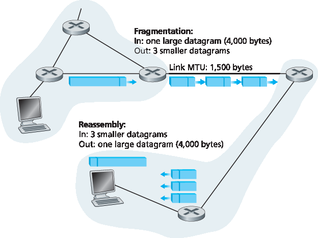
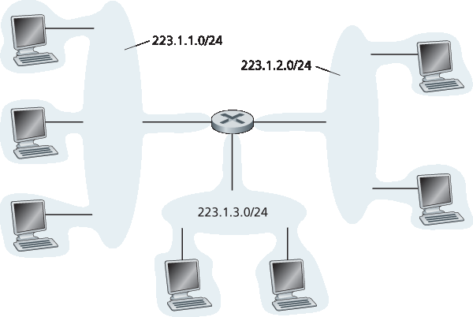
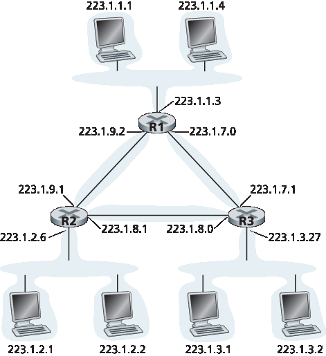
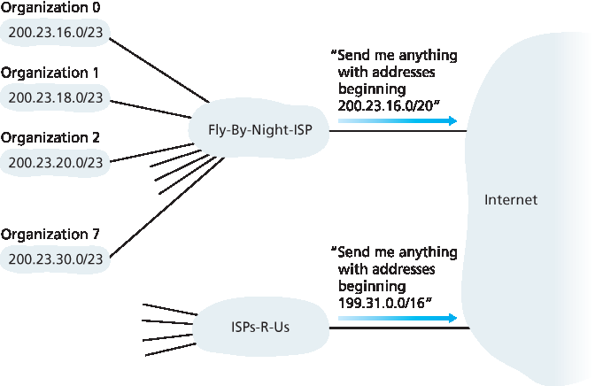
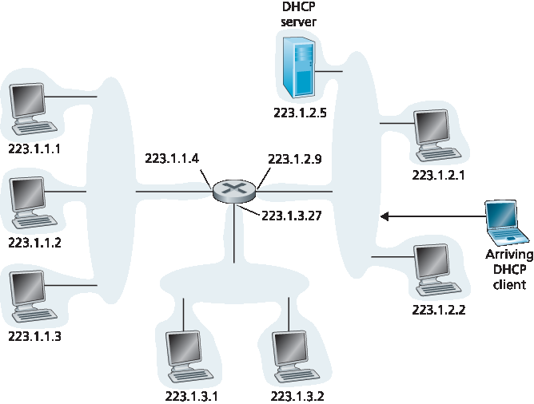
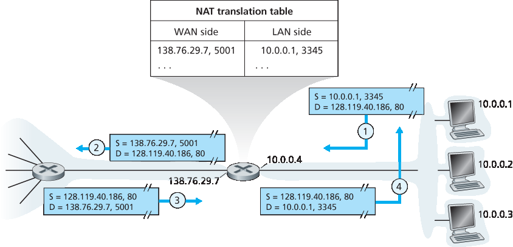

.. _c4.3:

4.3 Internet 协议（IP）：IPv4、地址、IPv6 等
=====================================================================
4.3 The Internet Protocol (IP): IPv4, Addressing, IPv6, and More

到目前为止，我们在 :ref:`第 4 章 <c4>` 中对网络层的学习——包括数据面与控制面组件的概念、转发与路由的区别、各种网络服务模型的识别，以及对路由器内部的探究——通常都未具体涉及任何特定的计算机网络架构或协议。在本节中，我们将聚焦于当今 Internet 网络层的一些关键方面，特别是广为人知的 Internet 协议（IP）。

目前有两个版本的 IP 被使用。我们首先在 :ref:`第 4.3.1 节 <c4.3.1>` 中考察被广泛部署的 IP 协议版本 4，通常简称为 IPv4 [:rfc:`791`]。我们将在 :ref:`第 4.3.5 节 <c4.3.5>` 中考察 IPv6 [:ref:`RFC 2460 <RFC 2460>`; :ref:`RFC 4291 <RFC 4291>`]，它被提议用来取代 IPv4。在这两者之间，我们主要将讨论 Internet 地址机制——这个主题可能看起来相当枯燥且偏重细节，但实际上它对理解 Internet 网络层的工作机制至关重要。掌握了 IP 地址机制，也就掌握了 Internet 的网络层！

.. _Figure 4.16:

.. figure:: ../img/376-0.png 
    :align: center

**图 4.16 IPv4 数据报格式**

.. toggle::

   Our study of the network layer thus far in :ref:`Chapter 4 <c4>`—the notion of the data and control plane
   component of the network layer, our distinction between forwarding and routing, the identification of
   various network service models, and our look inside a router—have often been without reference to any
   specific computer network architecture or protocol. In this section we’ll focus on key aspects of the
   network layer on today’s Internet and the celebrated Internet Protocol (IP).
   
   There are two versions of IP in use today. We’ll first examine the widely deployed IP protocol version 4,
   which is usually referred to simply as IPv4 :ref:`[RFC 791] <RFC 791>` in :ref:`Section 4.3.1 <c4.3.1>`. We’ll examine IP version 6 [:ref:`RFC 2460 <RFC 2460>`; :ref:`RFC 4291 <RFC 4291>`], which has been proposed to
   replace IPv4, in :ref:`Section 4.3.5 <c4.3.5>`. In between, we’ll primarily cover Internet addressing—a topic that might
   seem rather dry and detail-oriented but we’ll see is crucial to understanding how the Internet’s network
   layer works. To master IP addressing is to master the Internet’s network layer itself!
   
   .. figure:: ../img/376-0.png 
      :align: center
   
   **Figure 4.16 IPv4 datagram format**

.. _c4.3.1:

4.3.1 IPv4 数据报格式
----------------------------------------------------------
4.3.1 IPv4 Datagram Format

回顾一下，Internet 的网络层分组被称为“数据报”。我们从 IPv4 数据报的语法和语义概述开始对 IP 的学习。你可能会认为，分析一个分组比特位的语法和语义是最无聊的事情。然而，数据报在 Internet 中扮演着核心角色——每一个网络专业学生和从业者都必须理解、吸收并掌握它。（为了展示协议头部的学习也可以很有趣，请参阅 :ref:`[Pomeranz 2010] <Pomeranz 2010>`。）IPv4 数据报格式如 :ref:`图 4.16 <Figure 4.16>` 所示。IPv4 数据报中的关键字段如下：

- **版本号**。这 4 个比特指明了数据报所使用的 IP 协议版本。通过查看该版本号，路由器可以判断如何解释 IP 数据报的其余部分。不同版本的 IP 使用不同格式的数据报。IPv4 的数据报格式如 :ref:`图 4.16 <Figure 4.16>` 所示。新版本的 IP（即 IPv6）的数据报格式将在 :ref:`第 4.3.5 节 <c4.3.5>` 中讨论。
- **首部长度**。由于 IPv4 数据报可以包含可变数量的选项（这些选项被包含在 IPv4 数据报头部中），这 4 个比特用于指明 IP 数据报中有效负载（例如，封装在数据报中的传输层报文段）从何处开始。大多数 IP 数据报不包含选项，因此典型 IP 数据报的头部为 20 字节。
- **服务类型**。服务类型（TOS）字段被包含在 IPv4 头部中，用以区分不同类型的 IP 数据报。例如，可能需要区分实时数据报（如 IP 语音应用使用的数据报）与非实时流量（如 FTP）。所提供的具体服务等级是由该路由器的网络管理员根据策略配置的。我们也在 :ref:`第 3.7.2 节 <c3.7.2>` 中了解到，TOS 字段中的两个比特被用于显式拥塞通知（ECN）。
- **数据报总长度**。这是 IP 数据报（头部加数据部分）的总长度，以字节为单位。由于此字段为 16 位，因此 IP 数据报的理论最大长度为 65535 字节。然而，数据报通常不会超过 1500 字节，这样可以使 IP 数据报适配于最大长度的以太网帧的有效负载中。
- **标识符、标志位、分片偏移**。这三个字段与所谓的 IP 分片有关，我们稍后将对此进行讨论。有趣的是，新的 IP 版本（IPv6）不允许进行分片。
- **生存时间（TTL）**。TTL 字段用于确保数据报不会永远在网络中循环（例如，由于持久的路由环路）。每当数据报被一个路由器处理时，此字段减 1。如果 TTL 减至 0，路由器必须丢弃该数据报。
- **协议字段**。该字段通常只在 IP 数据报到达最终目的地时才会使用。该字段的值指示此 IP 数据报中的数据部分应交由哪个特定的传输层协议处理。例如，值为 6 表示数据部分交由 TCP，值为 17 表示交由 UDP。所有可能值的列表见 :ref:`[IANA Protocol Numbers 2016] <IANA Protocol Numbers 2016>`。注意，IP 数据报中的协议号在网络层与传输层之间起到类似于传输层中端口号在传输层与应用层之间的“胶合”作用。我们将在 :ref:`第 6 章 <c6>` 中看到，链路层帧也有一个特殊字段用于将链路层绑定到网络层。
- **首部校验和**。首部校验和帮助路由器检测收到的 IP 数据报中是否有比特错误。首部校验和是通过将头部中每两个字节作为一个数字、并用一补码加法求和计算的。如 :ref:`第 3.3 节 <c3.3>` 中所述，该求和值的一补码（即 Internet 校验和）被存储在校验和字段中。路由器对每个收到的数据报计算其首部校验和，并检测该数据报头部中的校验和是否与计算结果一致，若不一致则说明有错误。一般来说，路由器会丢弃检测出错误的数据报。注意，由于 TTL 字段以及可能的选项字段会改变，校验和必须在每一个路由器处重新计算并存储。有关快速计算 Internet 校验和的算法，参见 :ref:`[RFC 1071] <RFC 1071>`。人们常常会问一个问题：为什么 TCP/IP 在传输层和网络层都进行错误检测？这有多种原因。首先，IP 层只对 IP 头部进行校验，而 TCP/UDP 校验和是对整个报文段进行计算的。其次，TCP/UDP 和 IP 不一定属于同一个协议栈。原则上，TCP 可以运行在其他网络层协议（如 ATM）之上 :ref:`[Black 1995] <Black 1995>`，而 IP 也可以携带并不传递给 TCP/UDP 的数据。
- **源和目的 IP 地址**。当源主机创建数据报时，它会在源地址字段中填入自己的 IP 地址，在目的地址字段中填入最终接收方的地址。通常源主机会通过 DNS 查询确定目的地址，如 :ref:`第 2 章 <c2>` 中所述。我们将在 :ref:`第 4.3.3 节 <c4.3.3>` 中详细讨论 IP 地址机制。
- **选项字段**。选项字段允许扩展 IP 头部。选项原本被设计为很少使用，因此为了节省开销，并未在每个数据报头部中都强制包含选项信息。然而，选项的存在确实带来了一些复杂性——由于数据报头部长度可变，因此无法预先确定数据字段的起始位置。此外，由于某些数据报可能需要处理选项而其他则不需要，因此在路由器处处理 IP 数据报所需的时间可能变化较大。这些因素在高性能路由器和主机的 IP 处理中特别重要。出于这些原因以及其他一些考虑，IPv6 的头部中不再包含选项字段，如 :ref:`第 4.3.5 节 <c4.3.5>` 所述。
- **数据（有效负载）**。最后我们来到最重要的字段 —— 数据字段，正是数据报存在的根本理由！在大多数情况下，IP 数据报的数据字段中包含的是传输层报文段（TCP 或 UDP），以便传送至目标主机。然而，数据字段也可以承载其他类型的数据，例如 ICMP 报文（将在 :ref:`第 5.6 节 <c5.6>` 中讨论）。

请注意，一个 IP 数据报在不包含选项的情况下其头部总共为 20 字节。如果数据报承载一个 TCP 报文段，那么每个（未分片的）数据报将携带 40 字节的头部（20 字节 IP 头部加上 20 字节 TCP 头部）以及应用层报文。

.. toggle::

   Recall that the Internet’s network-layer packet is referred to as a datagram. We begin our study of IP
   with an overview of the syntax and semantics of the IPv4 datagram. You might be thinking that nothing
   could be drier than the syntax and semantics of a packet’s bits. Nevertheless, the datagram plays a
   central role in the Internet—every networking student and professional needs to see it, absorb it, and
   master it. (And just to see that protocol headers can indeed be fun to study, check out :ref:`[Pomeranz 2010] <Pomeranz 2010>`). The IPv4 datagram format is shown in :ref:`Figure 4.16 <Figure 4.16>`. The key fields in the IPv4 datagram are the
   following:
   
   - **Version number**. These 4 bits specify the IP protocol version of the datagram. By looking at the version number, the router can determine how to interpret the remainder of the IP datagram. Different versions of IP use different datagram formats. The datagram format for IPv4 is shown in :ref:`Figure 4.16 <Figure 4.16>`. The datagram format for the new version of IP (IPv6) is discussed in :ref:`Section 4.3.5 <c4.3.5>`.
   - **Header length**. Because an IPv4 datagram can contain a variable number of options (which are included in the IPv4 datagram header), these 4 bits are needed to determine where in the IP datagram the payload (e.g., the transport-layer segment being encapsulated in this datagram) actually begins. Most IP datagrams do not contain options, so the typical IP datagram has a 20-byte header.
   - **Type of service**. The type of service (TOS) bits were included in the IPv4 header to allow different types of IP datagrams to be distinguished from each other. For example, it might be useful to distinguish real-time datagrams (such as those used by an IP telephony application) from non-real- time traffic (for example, FTP). The specific level of service to be provided is a policy issue determined and configured by the network administrator for that router. We also learned in :ref:`Section 3.7.2 <c3.7.2>` that two of the TOS bits are used for Explicit Congestion ­Notification.
   - **Datagram length**. This is the total length of the IP datagram (header plus data), measured in bytes. Since this field is 16 bits long, the theoretical maximum size of the IP datagram is 65,535 bytes. However, datagrams are rarely larger than 1,500 bytes, which allows an IP datagram to fit in the payload field of a maximally sized Ethernet frame.
   - **Identifier, flags, fragmentation offset**. These three fields have to do with so-called IP fragmentation, a topic we will consider shortly. Interestingly, the new version of IP, IPv6, does not allow for fragmentation.
   - **Time-to-live**. The time-to-live (TTL) field is included to ensure that datagrams do not circulate forever (due to, for example, a long-lived routing loop) in the network. This field is decremented by one each time the datagram is processed by a router. If the TTL field reaches 0, a router must drop that datagram.
   - **Protocol**. This field is typically used only when an IP datagram reaches its final destination. The value of this field indicates the specific transport-layer protocol to which the data portion of this IP datagram should be passed. For example, a value of 6 indicates that the data portion is passed to TCP, while a value of 17 indicates that the data is passed to UDP. For a list of all possible values,see :ref:`[IANA Protocol Numbers 2016] <IANA Protocol Numbers 2016>`. Note that the protocol number in the IP datagram has a role that is analogous to the role of the port number field in the transport-layer segment. The protocol number is the glue that binds the network and transport layers together, whereas the port number is the glue that binds the transport and application layers together. We’ll see in :ref:`Chapter 6 <c6>` that the link- layer frame also has a special field that binds the link layer to the network layer.
   - **Header checksum**. The header checksum aids a router in detecting bit errors in a received IP datagram. The header checksum is computed by treating each 2 bytes in the header as a number and summing these numbers using 1s complement arithmetic. As discussed in :ref:`Section 3.3 <c3.3>`, the 1s complement of this sum, known as the Internet checksum, is stored in the checksum field. A router computes the header checksum for each received IP datagram and detects an error condition if the checksum carried in the datagram header does not equal the computed checksum. Routers typically discard datagrams for which an error has been detected. Note that the checksum must be recomputed and stored again at each router, since the TTL field, and possibly the options field as well, will change. An interesting discussion of fast algorithms for computing the Internet checksum is :ref:`[RFC 1071] <RFC 1071>`. A question often asked at this point is, why does TCP/IP perform error checking at both the transport and network layers? There are several reasons for this repetition. First, note that only the IP header is checksummed at the IP layer, while the TCP/UDP checksum is computed over the entire TCP/UDP segment. Second, TCP/UDP and IP do not necessarily both have to belong to the same protocol stack. TCP can, in principle, run over a different network-layer protocol (for example, ATM) :ref:`[Black 1995] <Black 1995>`) and IP can carry data that will not be passed to TCP/UDP.
   - **Source and destination IP addresses**. When a source creates a datagram, it inserts its IP address into the source IP address field and inserts the address of the ultimate destination into the destination IP address field. Often the source host determines the destination address via a DNS lookup, as discussed in :ref:`Chapter 2 <c2>`. We’ll discuss IP addressing in detail in :ref:`Section 4.3.3 <c4.3.3>`.
   - **Options**. The options fields allow an IP header to be extended. Header options were meant to be used rarely—hence the decision to save overhead by not including the information in options fields in every datagram header. However, the mere existence of options does complicate matters—since datagram headers can be of variable length, one cannot determine a priori where the data field will start. Also, since some datagrams may require options processing and others may not, the amount of time needed to process an IP datagram at a router can vary greatly. These considerations become particularly important for IP processing in high-performance routers and hosts. For these reasons and others, IP options were not included in the IPv6 header, as discussed in :ref:`Section 4.3.5 <c4.3.5>`.
   - **Data (payload)**. Finally, we come to the last and most important field—the raison d’etre for the datagram in the first place! In most circumstances, the data field of the IP datagram contains the transport-layer segment (TCP or UDP) to be delivered to the destination. However, the data field can carry other types of data, such as ICMP messages (discussed in :ref:`Section 5.6 <c5.6>`).
   
   Note that an IP datagram has a total of 20 bytes of header (assuming no options). If the datagram
   carries a TCP segment, then each (non-fragmented) datagram carries a total of 40 bytes of header (20
   bytes of IP header plus 20 bytes of TCP header) along with the application-layer message.

.. _c4.3.2:

4.3.2 IPv4 数据报分片
----------------------------------------------------------
4.3.2 IPv4 Datagram Fragmentation

我们将在 :ref:`第 6 章 <c6>` 中看到，并非所有链路层协议都能承载相同大小的网络层分组。有些协议可以承载较大的数据报，而其他协议只能承载较小的数据报。例如，以太网帧最多可以承载 1500 字节的数据，而某些广域链路的帧最多只能承载 576 字节。链路层帧所能承载的最大数据量称为 **最大传输单元（MTU）**。由于每个 IP 数据报都被封装在链路层帧中以从一个路由器传送到下一个路由器，因此链路层协议的 MTU 对 IP 数据报的长度设置了硬性限制。IP 数据报大小存在硬性上限并不是什么大问题。问题在于，发送方和目的地之间路径上的每一条链路都可能使用不同的链路层协议，而每种协议都有不同的 MTU。

为了更好地理解转发问题，假设你是一个连接了多个链路的路由器，每条链路都运行不同的链路层协议且具有不同的 MTU。假设你从某条链路收到一个 IP 数据报。你查看转发表确定下一跳的出链路，而该出链路的 MTU 小于 IP 数据报的长度。此时你该如何将这个超长的数据报“塞”进链路层帧的有效载荷字段中？解决方案是将 IP 数据报中的有效负载拆分成两个或更多较小的 IP 数据报，并将这些较小的数据报分别封装进各自的链路层帧中，然后将这些帧发送至出链路。这些较小的数据报称为 **分片（fragment）**。

在到达目的地的传输层之前，分片需要重新组装。实际上，TCP 和 UDP 都希望从网络层接收到完整的、未分片的报文段。IPv4 的设计者认为在路由器中重组数据报会显著增加协议的复杂性，并影响路由器的性能。（如果你是路由器，愿意在处理转发任务之外还进行分片重组吗？）秉持“让网络核心保持简单”的原则，IPv4 的设计者决定将数据报重组的工作交由端系统完成，而不是网络中的路由器。

当目的主机从同一源主机接收到一系列数据报时，它需要判断这些数据报中是否有属于某个原始大数据报的分片。如果有，它还需要进一步判断是否已接收到最后一个分片，以及如何将收到的分片拼接成原始数据报。为了让目的主机能够完成这些重组任务，IPv4 的设计者在 IP 数据报头中设置了 *标识符（identification）*、标志位（flag）和分片偏移量（fragmentation offset）字段。当创建数据报时，发送主机会将标识符（以及源和目的地址）写入该数据报中。通常，发送主机会为每个发送的数据报递增标识符。当路由器需要对数据报进行分片时，每个生成的分片（也是 IP 数据报）都会被加上原始数据报的源地址、目的地址和标识符。当目的主机接收到来自同一发送主机的一系列数据报时，它可以通过检查标识符字段判断哪些数据报实际上是同一原始数据报的分片。由于 IP 是一种不可靠服务，一个或多个分片可能永远不会到达目的地。因此，为了让目的主机确信它已经收到了最后一个分片，最后一个分片的标志位将设置为 0，而所有其他分片该标志位设置为 1。此外，为了让目的主机判断是否缺少某个分片（以及按正确顺序重组各分片），分片偏移字段用于指示该分片在原始 IP 数据报中的位置。

.. _Figure 4.17:

**图 4.17 IP 分片与重组**

:ref:`图 4.17 <Figure 4.17>` 展示了一个示例。一个长度为 4000 字节的数据报（20 字节的 IP 头部加 3980 字节的有效负载）到达某个路由器，而此路由器需要将其转发到一个 MTU 为 1500 字节的链路。这意味着原始数据报中的 3980 个数据字节必须被分配到三个独立的分片中（每个分片本身也是一个 IP 数据报）。

本书的在线资料以及本章结尾的习题将帮助你更深入地探索分片机制。此外，在本书的网站上，我们提供了一个 Java 小程序，可以用于生成分片。你只需提供原始数据报大小、MTU 以及原始数据报的标识符即可。

该小程序会自动为你生成分片。参见：http://www.pearsonhighered.com/cs-resources/

.. toggle::

   We’ll see in :ref:`Chapter 6 <c6>` that not all link-layer protocols can carry network-layer packets of the same size. Some protocols can carry big datagrams, whereas other protocols can carry only little datagrams. For example, Ethernet frames can carry up to 1,500 bytes of data, whereas frames for some wide-area links can carry no more than 576 bytes. The maximum amount of data that a link-layer frame can carry is called the **maximum transmission unit (MTU)**. Because each IP datagram is encapsulated within the link-layer frame for transport from one router to the next router, the MTU of the link-layer protocol places a hard limit on the length of an IP datagram. Having a hard limit on the size of an IP datagram is not much of a problem. What is a problem is that each of the links along the route between sender and destination can use different link-layer protocols, and each of these protocols can have different MTUs.
   
   To understand the forwarding issue better, imagine that you are a router that interconnects several links, each running different link-layer protocols with different MTUs. Suppose you receive an IP datagram from one link. You check your forwarding table to determine the outgoing link, and this outgoing link has an MTU that is smaller than the length of the IP datagram. Time to panic—how are you going to squeeze this oversized IP datagram into the payload field of the link-layer frame? The solution is to fragment the payload in the IP datagram into two or more smaller IP datagrams, encapsulate each of these smaller IP datagrams in a separate link-layer frame; and send these frames over the outgoing link. Each of these smaller datagrams is referred to as a **fragment**.
   
   Fragments need to be reassembled before they reach the transport layer at the destination. Indeed, both TCP and UDP are expecting to receive complete, unfragmented segments from the network layer. The designers of IPv4 felt that reassembling datagrams in the routers would introduce significant complication into the protocol and put a damper on router performance. (If you were a router, would you want to be reassembling fragments on top of everything else you had to do?) Sticking to the principle of keeping the network core simple, the designers of IPv4 decided to put the job of datagram reassembly in the end systems rather than in network routers.
   
   When a destination host receives a series of datagrams from the same source, it needs to determine whether any of these datagrams are fragments of some original, larger datagram. If some datagrams are fragments, it must further determine when it has received the last fragment and how the fragments it has received should be pieced back together to form the original datagram. To allow the destination host to perform these reassembly tasks, the designers of IP (version 4) put *identification*, flag, and fragmentation offset fields in the IP datagram header. When a datagram is created, the sending host stamps the datagram with an identification number as well as source and destination addresses. Typically, the sending host increments the identification number for each datagram it sends. When a router needs to fragment a datagram, each resulting datagram (that is, fragment) is stamped with the source address, destination address, and identification number of the original datagram. When the destination receives a series of datagrams from the same sending host, it can examine the identification numbers of the datagrams to determine which of the datagrams are actually fragments of the same larger datagram. Because IP is an unreliable service, one or more of the fragments may never arrive at the destination. For this reason, in order for the destination host to be absolutely sure it has received the last fragment of the original datagram, the last fragment has a flag bit set to 0, whereas all the other fragments have this flag bit set to 1. Also, in order for the destination host to determine whether a fragment is missing (and also to be able to reassemble the fragments in their proper order), the offset field is used to specify where the fragment fits within the original IP datagram.
   
   .. figure:: ../img/380-0.png
       :align: center
   
   **Figure 4.17 IP fragmentation and reassembly**
   
   :ref:`Figure 4.17 <Figure 4.17>` illustrates an example. A datagram of 4,000 bytes (20 bytes of IP header plus 3,980 bytes of IP payload) arrives at a router and must be forwarded to a link with an MTU of 1,500 bytes. This implies that the 3,980 data bytes in the original datagram must be allocated to three separate fragments (each of which is also an IP datagram).
   
   The online material for this book, and the problems at the end of this chapter will allow you to explore fragmentation in more detail. Also, on this book’s Web site, we provide a Java applet that generates fragments. You provide the incoming datagram size, the MTU, and the incoming datagram identification.
    
   The applet automatically generates the fragments for you. See http://www.pearsonhighered.com/cs-resources/.

.. _c4.3.3:

4.3.3 IPv4 地址
----------------------------------------------------------
4.3.3 IPv4 Addressing

我们现在将注意力转向 IPv4 地址。尽管你可能会认为地址应该是一个简单的话题，但希望在本节结束时，你会相信互联网地址不仅是一个丰富、微妙且有趣的话题，而且还是对互联网具有核心重要性的主题。关于 IPv4 地址的优秀论述可以在 :ref:`[Stewart 1999] <Stewart 1999>` 的第一章中找到。

在讨论 IP 地址之前，我们需要先说几句关于主机和路由器如何连接到互联网的话。主机通常只有一个网络链接；当主机中的 IP 需要发送数据报时，它通过这条链路进行发送。主机和物理链路之间的边界称为接口。现在考虑路由器及其 **接口** 。由于路由器的任务是接收来自一条链路的数据报并转发到另一条链路，因此路由器必然有两个或更多的链路连接。路由器和其任何一条链路之间的边界也称为接口。这样，路由器有多个接口，每个接口对应一条链路。因为每个主机和路由器都能发送和接收 IP 数据报，IP 要求每个主机和路由器接口都有自己的 IP 地址。*因此，从技术上讲，IP 地址是与接口相关联的，而不是与包含该接口的主机或路由器相关联*。

每个 IP 地址长度为 32 位（等价于 4 字节），因此总共有 :math:`2^{32}` （约 40 亿）个可能的 IP 地址。这些地址通常以所谓的 **点分十进制表示法** 书写，其中地址的每个字节以十进制形式书写，并用句点（点）分隔。例如，考虑 IP 地址 193.32.216.9。193 是地址的前 8 位的十进制等价，32 是第二个 8 位的十进制等价，依此类推。因此，地址 193.32.216.9 的二进制表示为

    11000001 00100000 11011000 00001001

全球互联网中每台主机和路由器的每个接口必须有一个全球唯一的 IP 地址（NAT 后面的接口除外，详见 :ref:`第4.3.4节 <c4.3.4>`）。这些地址不能随意选择，接口的 IP 地址的一部分由其所连接的子网决定。

:ref:`图 4.18 <Figure 4.18>` 给出了 IP 地址和接口的示例。在此图中，一个具有三个接口的路由器连接七台主机。仔细观察分配给主机和路由器接口的 IP 地址，会注意到几个要点。图中左上方的三台主机及其连接的路由器接口的 IP 地址形式均为 223.1.1.xxx。也就是说，它们的 IP 地址最左侧的 24 位相同。这四个接口也通过一个不含路由器的网络互连。该网络可能是以太网局域网，在这种情况下接口通过以太网交换机互连（详见 :ref:`第6章 <c6>`），或通过无线接入点互连（详见 :ref:`第7章 <c7>`）。我们暂时用云状符号表示这个无路由器的网络，稍后在 :ref:`第6章 <c6>` 和 :ref:`第7章 <c7>` 中深入讨论这类网络的内部结构。

.. _Figure 4.18:

.. figure:: ../img/382-0.png
    :align: center

**图 4.18 接口地址与子网**

在 IP 术语中，这个连接三个主机接口和一个路由器接口的网络构成了一个子网 :ref:`[RFC 950] <RFC 950>`。（在互联网文献中，子网也称为 IP 网络或简单称为 *网络* 。）IP 地址为该子网分配一个地址：223.1.1.0/24，其中 /24（“斜杠24”）表示有时称为 **子网掩码** ，指明了32位地址的最左侧24位定义了子网地址。因此，223.1.1.0/24 子网包括三个主机接口（223.1.1.1、223.1.1.2 和 223.1.1.3）和一个路由器接口（223.1.1.4）。任何附加到 223.1.1.0/24 子网的主机都必须具有 223.1.1.xxx 形式的地址。图中还显示了另外两个子网：223.1.2.0/24 网络和 223.1.3.0/24 子网。:ref:`图 4.19 <Figure 4.19>` 展示了图中存在的三个 IP 子网。

IP 子网的定义不限于连接多个主机到路由器接口的以太网段。为了更深入理解，考虑 :ref:`图 4.20 <Figure 4.20>`，该图显示三个路由器通过点对点链路互连。每个路由器有三个接口，一个对应每个点对点链路，还有一个对应直接连接路由器与一对主机的广播链路。

这里存在什么子网？三个子网，223.1.1.0/24、223.1.2.0/24 和 223.1.3.0/24，类似于图 4.18 中遇到的子网。但注意本例中还有三个额外的子网：一个子网 223.1.9.0/24，用于连接路由器 R1 和 R2 的接口；另一个子网 223.1.8.0/24，用于连接路由器 R2 和 R3 的接口；第三个子网 223.1.7.0/24，用于连接路由器 R3 和 R1 的接口。对于一个路由器和主机互连的通用系统，我们可以用以下方法来定义系统中的子网：

.. _Figure 4.19:

**图 4.19 子网地址**

    要确定子网，请将每个接口从其主机或路由器上断开，创建出孤立网络的“岛屿”，接口作为孤立网络的终点。每个孤立网络称为一个 **子网** 。

如果我们将该方法应用于 :ref:`图 4.20 <Figure 4.20>` 的互连系统，会得到六个孤立的岛屿或子网。

由上述讨论可见，拥有多个以太网段和点对点链路的组织（如公司或学术机构）将拥有多个子网，子网中所有设备拥有相同的子网地址。原则上，不同子网可以有非常不同的子网地址。但实际上，它们的子网地址通常有很多共同点。为了理解原因，接下来我们将关注全球互联网中地址的处理方式。

互联网的地址分配策略称为 **无类域间路由（CIDR，读作“cider”）** :ref:`[RFC 4632] <RFC 4632>`。CIDR 泛化了子网地址的概念。与子网地址类似，32 位 IP 地址被分成两部分，仍以点分十进制形式 a.b.c.d/x 表示，其中 x 表示地址第一部分的位数。

a.b.c.d/x 形式地址中，最左边的 x 位构成 IP 地址的网络部分，通常称为该地址的 **前缀** （或 *网络前缀* ）。组织通常被分配一块连续地址，即具有共同前缀的地址范围（见 :ref:`实践原则 <Principles in Practice>`）。在这种情况下，组织内设备的 IP 地址将共享该前缀。当我们在第 5.4 节讲解互联网的 BGP 路由协议时，会看到组织外部的路由器只考虑这 x 位前缀。也就是说，当组织外部的路由器转发目的地址在该组织内的数据报时，只需考虑地址的前 x 位。这大大减小了这些路由器中的转发表大小，因为形如 a.b.c.d/x 的单条路由即可转发到组织内的任意目的地。

.. _Figure 4.20:

**图 4.20 三个路由器互连六个子网**

地址中剩余的 32-x 位则用于区分组织内部的设备，它们具有相同的网络前缀。这些低位将在组织内部的路由器转发数据包时被考虑。这些低位可能（也可能不）包含额外的子网结构，如上文所述。例如，假设 CIDR 地址 a.b.c.d/21 的前 21 位指定组织的网络前缀，并且所有设备的 IP 地址都共享该前缀。剩余的 11 位则用来识别组织内的具体主机。组织的内部结构可能使用这 11 位进行子网划分，如上文讨论的 a.b.c.d/24 可能指组织内的特定子网。

在采用 CIDR 之前，IP 地址的网络部分被限制为 8、16 或 24 位，这种地址方案称为 **类地址** ，因为具有 8、16 和 24 位子网地址的子网分别被称为 A、B、C 类网络。要求子网部分必须是 1、2 或 3 字节的长度，导致难以满足快速增长的中小型组织的需求。一个 C 类 (/24) 子网最多支持 2^8 − 2 = 254 台主机（256 个地址中有两个保留用于特殊用途）——对许多组织来说太小了。然而，一个 B 类 (/16) 子网支持多达 65,634 台主机，又太大了。在类地址方案下，拥有 2000 台主机的组织通常分配一个 B 类 (/16) 子网地址。这导致 B 类地址空间迅速耗尽且分配的地址空间利用率低。例如，为 2000 台主机分配 B 类地址的组织，获得了足够支持多达 65,534 个接口的地址空间，造成超过 63,000 个地址无法被其他组织使用。

.. _PRINCIPLES IN PRACTICE:

.. admonition:: 实践原则

    下面 ISP 连接八个组织到互联网的例子很好地说明了经过仔细分配的 CIDR 地址如何促进路由。假设如 :ref:`图 4.21 <Figure 4.21>` 所示，该 ISP（称为 Fly-By-Night-ISP）向外界宣告应将第一个 20 位地址匹配 200.23.16.0/20 的任何数据报发给它。外界无需知道该地址块 200.23.16.0/20 内实际上包含八个其他组织及其子网。用单一前缀来公告多个网络的能力通常称为 **地址聚合** （也称 **路由聚合** 或 **路由汇总** ）。

    当地址块按层次分配给 ISP，再由 ISP 分配给客户组织时，地址聚合效果极佳。但如果地址分配不按这种层次结构进行，会发生什么？例如，如果 Fly-By-Night-ISP 收购了 ISPs-R-Us，组织 1 通过其子公司 ISPs-R-Us 连接互联网，如 :ref:`图 4.21 <Figure 4.21>` 所示，子公司 ISPs-R-Us 拥有地址块 199.31.0.0/16，但组织 1 的 IP 地址不在该地址块内。该怎么办？组织 1 当然可以重新编号其所有路由器和主机，使其地址在 ISPs-R-Us 地址块内，但这是昂贵的解决方案，并且组织 1 未来可能转到另一个子公司。通常的解决方案是组织 1 保留其 200.23.18.0/23 地址。如 :ref:`图 4.22 <Figure 4.22>` 所示，Fly-By-Night-ISP 继续公告地址块 200.23.16.0/20，ISPs-R-Us 继续公告 199.31.0.0/16，但 ISPs-R-Us 现在也公告组织 1 的地址块 200.23.18.0/23。当其他更大互联网中的路由器看到地址块 200.23.16.0/20（来自 Fly-By-Night-ISP）和 200.23.18.0/23（来自 ISPs-R-Us），并需要路由到 200.23.18.0/23 中的地址时，它们将使用最长前缀匹配（见 :ref:`第4.2.1节 <c4.2.1>`），路由到 ISPs-R-Us，因为其公告的地址前缀最长（即最具体）且匹配目的地址。

.. _Figure 4.21:

**图 4.21 分层地址与路由聚合**

.. _Figure 4.22:

.. figure:: ../img/387-0.png
    :align: center

**图 4.22 ISPs-R-Us 对组织 1 拥有更具体的路由**

我们还应提及另一种 IP 地址类型，即 IP 广播地址 255.255.255.255。当主机发送目的地址为 255.255.255.255 的数据报时，消息将发送到同一子网的所有主机。路由器可选择将消息转发到相邻子网（尽管通常不会这样做）。

现在我们已经详细学习了 IP 地址，接下来需要了解主机和子网如何获得它们的地址。让我们先看一个组织如何获得一块地址用于其设备，然后看设备（如主机）如何从组织的地址块中分配到地址。

.. toggle::

   We now turn our attention to IPv4 addressing. Although you may be thinking that addressing must be a straightforward topic, hopefully by the end of this section you’ll be convinced that Internet addressing is not only a juicy, subtle, and interesting topic but also one that is of central importance to the Internet. An excellent treatment of IPv4 addressing can be found in the first chapter in :ref:`[Stewart 1999] <Stewart 1999>`.
   
   Before discussing IP addressing, however, we’ll need to say a few words about how hosts and routers are connected into the Internet. A host typically has only a single link into the network; when IP in the host wants to send a datagram, it does so over this link. The boundary between the host and the physical link is called an interface. Now consider a router and its **interfaces**. Because a router’s job is to receive a datagram on one link and forward the datagram on some other link, a router necessarily has two or more links to which it is connected. The boundary between the router and any one of its links is also called an interface. A router thus has multiple interfaces, one for each of its links. Because every host and router is capable of sending and receiving IP datagrams, IP requires each host and router interface to have its own IP address. *Thus, an IP address is technically associated with an interface, rather than with the host or router containing that interface*.
   
   Each IP address is 32 bits long (equivalently, 4 bytes), and there are thus a total of :math:`2^{32}` (or approximately 4 billion) possible IP addresses. These addresses are typically written in so-called **dotted-decimal notation**, in which each byte of the address is written in its decimal form and is separated by a period (dot) from other bytes in the address. For example, consider the IP address 193.32.216.9. The 193 is the decimal equivalent of the first 8 bits of the address; the 32 is the decimal equivalent of the second 8 bits of the address, and so on. Thus, the address 193.32.216.9 in binary notation is
   
       11000001 00100000 11011000 00001001
   
   Each interface on every host and router in the global Internet must have an IP address that is globally
   unique (except for interfaces behind NATs, as discussed in :ref:`Section 4.3.4 <c4.3.4>`). These addresses cannot be chosen in a willy-nilly manner, however. A portion of an interface’s IP address will be determined by the subnet to which it is connected.
   
   :ref:`Figure 4.18 <Figure 4.18>` provides an example of IP addressing and interfaces. In this figure, one router (with three interfaces) is used to interconnect seven hosts. Take a close look at the IP addresses assigned to the host and router interfaces, as there are several things to notice. The three hosts in the upper-left portion of :ref:`Figure 4.18 <Figure 4.18>`, and the router interface to which they are connected, all have an IP address of the form 223.1.1.xxx. That is, they all have the same leftmost 24 bits in their IP address. These four interfaces are also interconnected to each other by a network that contains no routers. This network could be interconnected by an Ethernet LAN, in which case the interfaces would be interconnected by an Ethernet switch (as we’ll discuss in :ref:`Chapter 6 <c6>`), or by a wireless access point (as we’ll discuss in :ref:`Chapter 7 <c7>`). We’ll represent this routerless network connecting these hosts as a cloud for now, and dive into the internals of such networks in :ref:`Chapters 6 <c6>` and :ref:`7 <c7>`.
   
   .. figure:: ../img/382-0.png
       :align: center
   
   **Figure 4.18 Interface addresses and subnets**
   
   In IP terms, this network interconnecting three host interfaces and one router interface forms a subnet :ref:`[RFC 950] <RFC 950>`. (A subnet is also called an IP network or simply a *network* in the Internet literature.) IP addressing assigns an address to this subnet: 223.1.1.0/24, where the /24 (“slash-24”) notation, sometimes known as a **subnet mask**, indicates that the leftmost 24 bits of the 32-bit quantity define the subnet address. The 223.1.1.0/24 subnet thus consists of the three host interfaces (223.1.1.1, 223.1.1.2, and 223.1.1.3) and one router interface (223.1.1.4). Any additional hosts attached to the 223.1.1.0/24 subnet would be required to have an address of the form 223.1.1.xxx. There are two additional subnets shown in :ref:`Figure 4.18 <Figure 4.18>`: the 223.1.2.0/24 network and the 223.1.3.0/24 subnet. :ref:`Figure 4.19 <Figure 4.19>` illustrates the three IP subnets present in :ref:`Figure 4.18 <Figure 4.18>`.
   
   The IP definition of a subnet is not restricted to Ethernet segments that connect multiple hosts to a router interface. To get some insight here, consider :ref:`Figure 4.20 <Figure 4.20>`, which shows three routers that are interconnected with each other by point-to-point links. Each router has three interfaces, one for each point-to-point link and one for the broadcast link that directly connects the router to a pair of hosts. What
    
   subnets are present here? Three subnets, 223.1.1.0/24, 223.1.2.0/24, and 223.1.3.0/24, are similar to the subnets we encountered in :ref:`Figure 4.18 <Figure 4.18>`. But note that there are three additional subnets in this example as well: one subnet, 223.1.9.0/24, for the interfaces that connect routers R1 and R2; another subnet, 223.1.8.0/24, for the interfaces that connect routers R2 and R3; and a third subnet, 223.1.7.0/24, for the interfaces that connect routers R3 and R1. For a general interconnected system of routers and hosts, we can use the following recipe to define the subnets in the system:
   
   .. figure:: ../img/383-0.png
       :align: center
   
   **Figure 4.19 Subnet addresses**
   
       To determine the subnets, detach each interface from its host or router, creating islands of isolated networks, with interfaces terminating the end points of the isolated networks. Each of these isolated networks is called a **subnet**.
   
   If we apply this procedure to the interconnected system in :ref:`Figure 4.20 <Figure 4.20>`, we get six islands or subnets.
   
   From the discussion above, it’s clear that an organization (such as a company or academic institution) with multiple Ethernet segments and point-to-point links will have multiple subnets, with all of the devices on a given subnet having the same subnet address. In principle, the different subnets could have quite different subnet addresses. In practice, however, their subnet addresses often have much in common. To understand why, let’s next turn our attention to how addressing is handled in the global Internet.
   
   The Internet’s address assignment strategy is known as **Classless Interdomain Routing (CIDR— pronounced cider)** :ref:`[RFC 4632] <RFC 4632>`. CIDR generalizes the notion of subnet addressing. As with subnet addressing, the 32-bit IP address is divided into two parts and again has the dotted-decimal form a.b.c.d/x, where x indicates the number of bits in the first part of the address.
   
   The x most significant bits of an address of the form a.b.c.d/x constitute the network portion of the IP address, and are often referred to as the **prefix** (or *network prefix*) of the address. An organization is typically assigned a block of contiguous addresses, that is, a range of addresses with a common prefix (see the :ref:`Principles in Practice <Principles in Practice>` feature). In this case, the IP addresses of devices within the organization will share the common prefix. When we cover the Internet’s BGP routing protocol in Section 5.4, we’ll see that only these x leading prefix bits are considered by routers outside the organization’s network. That is, when a router outside the organization forwards a datagram whose destination address is inside the organization, only the leading x bits of the address need be considered. This considerably reduces the size of the forwarding table in these routers, since a single entry of the form a.b.c.d/x will be sufficient to forward packets to any destination within the organization.
   
   .. figure:: ../img/384-0.png
       :align: center
   
   **Figure 4.20 Three routers interconnecting six subnets**
   
   The remaining 32-x bits of an address can be thought of as distinguishing among the devices within the organization, all of which have the same network prefix. These are the bits that will be considered when forwarding packets at routers within the organization. These lower-order bits may (or may not) have an additional subnetting structure, such as that discussed above. For example, suppose the first 21 bits of the CIDRized address a.b.c.d/21 specify the organization’s network prefix and are common to the IP addresses of all devices in that organization. The remaining 11 bits then identify the specific hosts in the organization. The organization’s internal structure might be such that these 11 rightmost bits are used for subnetting within the organization, as discussed above. For example, a.b.c.d/24 might refer to a specific subnet within the organization.
   
   Before CIDR was adopted, the network portions of an IP address were constrained to be 8, 16, or 24 bits in length, an addressing scheme known as **classful addressing**, since subnets with 8-, 16-, and 24-bit subnet addresses were known as class A, B, and C networks, respectively. The requirement that the subnet portion of an IP address be exactly 1, 2, or 3 bytes long turned out to be problematic for supporting the rapidly growing number of organizations with small and medium-sized subnets. A class C (/24) subnet could accommodate only up to 28 − 2 = 254 hosts (two of the 28 = 256 addresses are reserved for special use)—too small for many organizations. However, a class B (/16) subnet, which supports up to 65,634 hosts, was too large. Under classful addressing, an organization with, say, 2,000 hosts was typically allocated a class B (/16) subnet address. This led to a rapid depletion of the class B address space and poor utilization of the assigned address space. For example, the organization that used a class B address for its 2,000 hosts was allocated enough of the address space for up to 65,534 interfaces—leaving more than 63,000 addresses that could not be used by other organizations.
   
   .. admonition:: PRINCIPLES IN PRACTICE
   
       This example of an ISP that connects eight organizations to the Internet nicely illustrates how carefully allocated CIDRized addresses facilitate routing. Suppose, as shown in :ref:`Figure 4.21 <Figure 4.21>`, that the ISP (which we’ll call Fly-By-Night-ISP) advertises to the outside world that it should be sent any datagrams whose first 20 address bits match 200.23.16.0/20. The rest of the world need not know that within the address block 200.23.16.0/20 there are in fact eight other organizations, each with its own subnets. This ability to use a single prefix to advertise multiple networks is often referred to as **address aggregation** (also **route aggregation** or **route summarization**).
   
       Address aggregation works extremely well when addresses are allocated in blocks to ISPs and then from ISPs to client organizations. But what happens when addresses are not allocated in such a hierarchical manner? What would happen, for example, if Fly-By-Night-ISP acquires ISPs-R-Us and then has Organization 1 connect to the Internet through its subsidiary ISPs-R-Us? As shown in :ref:`Figure 4.21 <Figure 4.21>`, the subsidiary ISPs-R-Us owns the address block 199.31.0.0/16, but Organization 1’s IP addresses are unfortunately outside of this address block. What should be done here? Certainly, Organization 1 could renumber all of its routers and hosts to have addresses within the ISPs-R-Us address block. But this is a costly solution, and Organization 1 might well be reassigned to another subsidiary in the future. The solution typically adopted is for Organization 1 to keep its IP addresses in 200.23.18.0/23. In this case, as shown in :ref:`Figure 4.22 <Figure 4.22>`, Fly-By-Night-ISP continues to advertise the address block 200.23.16.0/20 and ISPs-R-Us continues to advertise 199.31.0.0/16. However, ISPs-R-Us now also advertises the block of addresses for Organization 1, 200.23.18.0/23. When other routers in the larger Internet see the address blocks 200.23.16.0/20 (from Fly-By-Night-ISP) and 200.23.18.0/23 (from ISPs-R-Us) and want to route to an address in the block 200.23.18.0/23, they will use longest prefix matching (see :ref:`Section 4.2.1 <c4.2.1>`), and route toward ISPs-R-Us, as it advertises the longest (i.e., most-specific) address prefix that matches the destination address.
   
   .. figure:: ../img/386-0.png
       :align: center
   
   **Figure 4.21 Hierarchical addressing and route aggregation**
   
   .. figure:: ../img/387-0.png
       :align: center
   
   **Figure 4.22 ISPs-R-Us has a more specific route to Organization 1**
   
   We would be remiss if we did not mention yet another type of IP address, the IP broadcast address 255.255.255.255. When a host sends a datagram with destination address 255.255.255.255, the message is delivered to all hosts on the same subnet. Routers optionally forward the message into neighboring subnets as well (although they usually don’t).
   
   Having now studied IP addressing in detail, we need to know how hosts and subnets get their addresses in the first place. Let’s begin by looking at how an organization gets a block of addresses for its devices, and then look at how a device (such as a host) is assigned an address from within the organization’s block of addresses.

获取地址块
~~~~~~~~~~~~~~~~~~~~~~~~~~~~~~~~
Obtaining a Block of Addresses

为了在组织的子网内获得一块 IP 地址，网络管理员可能首先联系其 ISP，ISP 会从已分配给该 ISP 的较大地址块中提供地址。例如，ISP 本身可能已被分配地址块 200.23.16.0/20。ISP 反过来可以将其地址块划分为八个大小相等的连续地址块，并将其中一个地址块分配给最多八个由该 ISP 支持的组织，如下所示。（我们已为方便起见，将这些地址的子网部分划线标出。）

.. code:: text 

    ISP 的地址块：  200.23.16.0/20     11001000 00010111 00010000 00000000

    组织 0           200.23.16.0/23     11001000 00010111 00010000 00000000

    组织 1           200.23.18.0/23     11001000 00010111 00010010 00000000

    组织 2           200.23.20.0/23     11001000 00010111 00010100 00000000

    ... ...

    组织 7           200.23.30.0/23     11001000 00010111 00011110 00000000

虽然从 ISP 获得一组地址是一种获得地址块的方法，但这并不是唯一的方法。显然，ISP 本身也必须有办法获得地址块。是否存在一个全球性权威机构，最终负责管理 IP 地址空间并将地址块分配给 ISP 及其他组织？确实存在！IP 地址由互联网名称与数字地址分配机构（ICANN）管理 :ref:`[ICANN 2016] <ICANN 2016>`，基于 :ref:`[RFC 7020] <RFC 7020>` 中规定的指南。非营利组织 ICANN 的角色 :ref:`[NTIA 1998] <NTIA 1998>` 不仅是分配 IP 地址，还管理 DNS 根服务器。它还承担着颇具争议的域名分配及域名争议解决工作。ICANN 将地址分配给区域互联网注册管理机构（例如 ARIN、RIPE、APNIC 和 LACNIC，这些机构共同组成 ICANN 的地址支持组织 :ref:`[ASO-ICANN 2016] <ASO-ICANN 2016>`），并负责其辖区内地址的分配与管理。

.. toggle::
   
   In order to obtain a block of IP addresses for use within an organization’s subnet, a network administrator might first contact its ISP, which would provide addresses from a larger block of addresses that had already been allocated to the ISP. For example, the ISP may itself have been allocated the address block 200.23.16.0/20. The ISP, in turn, could divide its address block into eight equal-sized contiguous address blocks and give one of these address blocks out to each of up to eight organizations that are supported by this ISP, as shown below. (We have underlined the subnet part of these addresses for your convenience.)
   
   .. code:: text 
   
       ISP’s block:     200.23.16.0/20     11001000 00010111 00010000 00000000
   
       Organization 0   200.23.16.0/23     11001000 00010111 00010000 00000000
   
       Organization 1   200.23.18.0/23     11001000 00010111 00010010 00000000
   
       Organization 2   200.23.20.0/23     11001000 00010111 00010100 00000000
   
       ... ... 
   
       Organization 7   200.23.30.0/23     11001000 00010111 00011110 00000000
   
   While obtaining a set of addresses from an ISP is one way to get a block of addresses, it is not the only way. Clearly, there must also be a way for the ISP itself to get a block of addresses. Is there a global authority that has ultimate responsibility for managing the IP address space and allocating address blocks to ISPs and other organizations? Indeed there is! IP addresses are managed under the authority of the Internet Corporation for Assigned Names and Numbers (ICANN) :ref:`[ICANN 2016] <ICANN 2016>`, based on guidelines set forth in :ref:`[RFC 7020] <RFC 7020>`. The role of the nonprofit ICANN organization :ref:`[NTIA 1998] <NTIA 1998>` is not only to allocate IP addresses, but also to manage the DNS root servers. It also has the very contentious job of assigning domain names and resolving domain name disputes. The ICANN allocates addresses to regional Internet registries (for example, ARIN, RIPE, APNIC, and LACNIC, which together form the Address Supporting Organization of ICANN :ref:`[ASO-ICANN 2016] <ASO-ICANN 2016>`), and handle the allocation/management of addresses within their regions.

获取主机地址：动态主机配置协议
~~~~~~~~~~~~~~~~~~~~~~~~~~~~~~~~~~~~~~~~~~~~~~~~~~~~~~~~~~~~~~~~~~~~
Obtaining a Host Address: The Dynamic Host Configuration Protocol

一旦组织获得一块地址，就可以将单个 IP 地址分配给组织内的主机和路由器接口。系统管理员通常会手动将 IP 地址配置到路由器（通常是远程通过网络管理工具）。主机地址也可以手动配置，但通常使用 **动态主机配置协议（DHCP）** :ref:`[RFC 2131] <RFC 2131>`。DHCP 允许主机自动获取（分配）IP 地址。网络管理员可以配置 DHCP，使得某台主机每次连接网络时都获得相同的 IP 地址，或者主机被分配一个 **临时 IP 地址**，每次连接时都不同。除 IP 地址分配外，DHCP 还允许主机获取其他信息，例如子网掩码、第一跳路由器地址（通常称为默认网关）以及本地 DNS 服务器地址。

由于 DHCP 能自动化连接主机到网络的相关网络配置，它常被称为 **即插即用** 或 **零配置（zeroconf）** 协议。这一能力使得网络管理员免去手动配置的繁琐！DHCP 也广泛应用于家庭互联网接入网、企业网络和无线局域网，这些网络中主机频繁加入和离开网络。举例来说，学生从宿舍携带笔记本电脑到图书馆，再到教室，可能每个地点都连接到不同的子网，因此每次都需要新的 IP 地址。DHCP 非常适合这种情况，因为用户多且频繁进出，且地址只需短期使用。DHCP 的即插即用能力显而易见，否则系统管理员不可能在每个地点都重新配置笔记本，且大多数学生（除非学习计算机网络课程）也没有手动配置笔记本的专业知识。DHCP 是客户端-服务器协议。客户端通常是新加入的主机，想要获取网络配置信息，包括自身的 IP 地址。最简单的情况下，每个子网（见 :ref:`图 4.20 <Figure 4.20>` 中的子网定义）会有一个 DHCP 服务器。如果子网上没有服务器，则需要一个 DHCP 中继代理（通常是路由器），它知道该网络的 DHCP 服务器地址。:ref:`图 4.23 <Figure 4.23>` 显示了一个 DHCP 服务器连接到子网 223.1.2/24，路由器为连接到子网 223.1.1/24 和 223.1.3/24 的客户端提供中继代理服务。以下讨论假设子网上有 DHCP 服务器。

对于新加入的主机，DHCP 协议是一个四步过程，如 :ref:`图 4.24 <Figure 4.24>` 所示，对应于 :ref:`图 4.23 <Figure 4.23>` 中的网络设置。在该图中， ``yiaddr`` （即“你的互联网地址”）表示分配给新加入客户端的地址。四个步骤为：

.. _Figure 4.23:

**图 4.23 DHCP 客户端和服务器**

- **DHCP 服务器发现**。新加入主机的首要任务是找到可交互的 DHCP 服务器。这通过发送 **DHCP 发现消息** 实现，客户端将该消息封装在 UDP 数据包内，目标端口为 67。UDP 包封装在 IP 数据报中。但该数据报应发送给谁呢？主机甚至不知道其连接的网络的 IP 地址，更不用说该网络的 DHCP 服务器地址了。因此，DHCP 客户端创建一个包含 DHCP 发现消息的 IP 数据报，目标地址为广播地址 255.255.255.255，源地址为“本主机”IP 0.0.0.0。DHCP 客户端将该 IP 数据报交给链路层，链路层广播该帧到子网上所有节点（链路层广播的细节见 :ref:`第6.4节 <c6.4>`）。
- **DHCP 服务器响应**。收到 DHCP 发现消息的 DHCP 服务器向客户端发送 **DHCP 报价消息**，该消息以 IP 广播地址 255.255.255.255 广播到子网所有节点。（你可以思考为什么服务器的回复也必须广播。）由于子网中可能存在多个 DHCP 服务器，客户端可能有幸能从多个报价中选择。每条服务器报价消息包含收到的发现消息的事务 ID、为客户端拟分配的 IP 地址、网络掩码和 IP **地址租用时间**——IP 地址有效的时间长度。服务器通常将租用时间设置为数小时或数天 :ref:`[Droms 2002] <Droms 2002>`。
  
  .. _Figure 4.24:
  
  .. figure:: ../img/391-0.png
      :align: center
  
  **图 4.24 DHCP 客户端-服务器交互**

- **DHCP 请求**。新加入客户端从一个或多个服务器报价中选择一项，并用 **DHCP 请求消息** 回复选中的报价，回显配置参数。
- **DHCP 确认**。服务器对 DHCP 请求消息回复 **DHCP 确认消息**，确认所请求的参数。

客户端一旦收到 DHCP 确认，交互即告完成，客户端即可在租用期内使用 DHCP 分配的 IP 地址。由于客户端可能想在租约期满后继续使用该地址，DHCP 还提供了续约机制，允许客户端续租 IP 地址。

从移动性的角度来看，DHCP 有一个非常重要的缺点。由于节点每次连接新子网时都会从 DHCP 获取新 IP 地址，移动节点在子网间移动时无法保持与远程应用的 TCP 连接。我们将在 :ref:`第6章 <c6>` 中讨论移动 IP——一种 IP 基础设施扩展，允许移动节点在子网间移动时使用单一永久地址。关于 DHCP 的更多细节可见 :ref:`[Droms 2002] <Droms 2002>` 和 :ref:`[dhc 2016] <dhc 2016>`。互联网系统联盟提供了 DHCP 的开源参考实现 :ref:`[ISC 2016] <ISC 2016>`。

.. toggle::

   Once an organization has obtained a block of addresses, it can assign individual IP addresses to the host and router interfaces in its organization. A system administrator will typically manually configure the IP addresses into the router (often remotely, with a network management tool). Host addresses can also be configured manually, but typically this is done using the **Dynamic Host Configuration Protocol (DHCP)** :ref:`[RFC 2131] <RFC 2131>`. DHCP allows a host to obtain (be allocated) an IP address automatically. A network administrator can configure DHCP so that a given host receives the same IP address each time it connects to the network, or a host may be assigned a **temporary IP address** that will be different each time the host connects to the network. In addition to host IP address assignment, DHCP also allows a host to learn additional information, such as its subnet mask, the address of its first-hop router (often called the default gateway), and the address of its local DNS server.
   
   Because of DHCP’s ability to automate the network-related aspects of connecting a host into a network, it is often referred to as a **plug-and-play** or **zeroconf** (zero-configuration) protocol. This capability
   makes it very attractive to the network administrator who would otherwise have to perform these tasks manually! DHCP is also enjoying widespread use in residential Internet access networks, enterprise
      
   networks, and in wireless LANs, where hosts join and leave the network frequently. Consider, for example, the student who carries a laptop from a dormitory room to a library to a classroom. It is likely that in each location, the student will be connecting into a new subnet and hence will need a new IP address at each location. DHCP is ideally suited to this situation, as there are many users coming and going, and addresses are needed for only a limited amount of time. The value of DHCP’s plug-and-play capability is clear, since it’s unimaginable that a system administrator would be able to reconfigure laptops at each location, and few students (except those taking a computer networking class!) would have the expertise to configure their laptops manually. DHCP is a client-server protocol. A client is typically a newly arriving host wanting to obtain network configuration information, including an IP address for itself. In the simplest case, each subnet (in the addressing sense of :ref:`Figure 4.20 <Figure 4.20>`) will have a DHCP server. If no server is present on the subnet, a DHCP relay agent (typically a router) that knows the address of a DHCP server for that network is needed. :ref:`Figure 4.23 <Figure 4.23>` shows a DHCP server attached to subnet 223.1.2/24, with the router serving as the relay agent for arriving clients attached to subnets 223.1.1/24 and 223.1.3/24. In our discussion below, we’ll assume that a DHCP server is available on the subnet.
   
   For a newly arriving host, the DHCP protocol is a four-step process, as shown in :ref:`Figure 4.24 <Figure 4.24>` for the network setting shown in :ref:`Figure 4.23 <Figure 4.23>`. In this figure, ``yiaddr`` (as in “your Internet address”) indicates the address being allocated to the newly arriving client. The four steps are:
   
   .. figure:: ../img/389-0.png
       :align: center
   
   **Figure 4.23 DHCP client and server**
   
   - **DHCP server discovery**. The first task of a newly arriving host is to find a DHCP server with which to interact. This is done using a **DHCP discover message**, which a client sends within a UDP packet to port 67. The UDP packet is encapsulated in an IP datagram. But to whom should this datagram be sent? The host doesn’t even know the IP address of the network to which it is attaching, much less the address of a DHCP server for this network. Given this, the DHCP client creates an IP datagram containing its DHCP discover message along with the broadcast destination IP address of 255.255.255.255 and a “this host” source IP address of 0.0.0.0. The DHCP client passes the IP datagram to the link layer, which then broadcasts this frame to all nodes attached to the subnet (we will cover the details of link-layer broadcasting in :ref:`Section 6.4 <c6.4>`).
   - **DHCP server offer(s)**. A DHCP server receiving a DHCP discover message responds to the client with a **DHCP offer message** that is broadcast to all nodes on the subnet, again using the IP broadcast address of 255.255.255.255. (You might want to think about why this server reply must also be broadcast). Since several DHCP servers can be present on the subnet, the client may find itself in the enviable position of being able to choose from among several offers. Each server offer message contains the transaction ID of the received discover message, the proposed IP address for the client, the network mask, and an IP **address lease time**—the amount of time for which the IP address will be valid. It is common for the server to set the lease time to several hours or days :ref:`[Droms 2002] <Droms 2002>`.
     
     .. figure:: ../img/391-0.png
         :align: center
     
     **Figure 4.24 DHCP client-server interaction**
   
   - **DHCP request**. The newly arriving client will choose from among one or more server offers and respond to its selected offer with a **DHCP request message**, echoing back the configuration parameters.
   - **DHCP ACK**. The server responds to the DHCP request message with a **DHCP ACK message**, confirming the requested parameters.
   
   Once the client receives the DHCP ACK, the interaction is complete and the client can use the DHCP- allocated IP address for the lease duration. Since a client may want to use its address beyond the lease’s expiration, DHCP also provides a mechanism that allows a client to renew its lease on an IP address.
   
   From a mobility aspect, DHCP does have one very significant shortcoming. Since a new IP address is obtained from DHCP each time a node connects to a new subnet, a TCP connection to a remote application cannot be maintained as a mobile node moves between subnets. In :ref:`Chapter 6 <c6>`, we will examine mobile IP—an extension to the IP infrastructure that allows a mobile node to use a single permanent address as it moves between subnets. Additional details about DHCP can be found in :ref:`[Droms 2002] <Droms 2002>` and :ref:`[dhc 2016] <dhc 2016>`. An open source reference implementation of DHCP is available from the Internet Systems Consortium :ref:`[ISC 2016] <ISC 2016>`.

.. _c4.3.4:

4.3.4 网络地址转换（NAT）
----------------------------------------------------------
4.3.4 Network Address Translation (NAT)

鉴于我们之前对互联网地址和 IPv4 数据报格式的讨论，我们现在清楚每个具备 IP 功能的设备都需要一个 IP 地址。随着小型办公（SOHO）子网的普及，这似乎意味着每当一个 SOHO 需要安装局域网以连接多台设备时，ISP 必须分配一段地址范围来覆盖 SOHO 内所有的 IP 设备（包括电话、平板、游戏设备、IP 电视、打印机等）。如果子网规模扩大，则需要分配更大的地址块。但是，如果 ISP 已经分配了 SOHO 网络当前地址范围的连续部分怎么办？普通家庭用户又有谁真正想（或应该需要）了解如何管理 IP 地址呢？幸运的是，有一种更简单的地址分配方法，在此类场景中得到越来越广泛的应用： **网络地址转换（NAT）** [:rfc:`2663`; :ref:`RFC 3022 <RFC 3022>`; :ref:`Huston 2004 <Huston 2004>`，:ref:`Zhang 2007 <Zhang 2007>`; :ref:`Cisco NAT 2016 <Cisco NAT 2016>`]。

:ref:`图 4.25 <Figure 4.25>` 显示了启用 NAT 的路由器的工作原理。该 NAT 路由器位于家庭网络内，其接口属于 :ref:`图 4.25 <Figure 4.25>` 右侧的家庭网络。家庭网络中的地址分配如前所述——家庭网络中的所有四个接口都拥有相同的子网地址 10.0.0/24。地址空间 10.0.0.0/8 是 IP 地址空间中的三个保留部分之一，依据 [:rfc:`1918`] 用于 **私有网络** 或 **私有地址域** ，如 :ref:`图 4.25 <Figure 4.25>` 中的家庭网络。私有地址域指的是地址仅对该网络内部设备有意义的网络。理解这点的重要性在于，存在数十万个家庭网络，其中许多使用相同的地址空间 10.0.0.0/24。给定家庭网络内的设备可使用 10.0.0.0/24 地址互相通信。然而，数据包若要转发出家庭网络，进入更大的全球互联网，则显然不能使用这些地址（无论作为源地址还是目的地址），因为有成千上万个网络使用这块地址。也就是说，10.0.0.0/24 地址只能在给定家庭网络内有意义。但如果私有地址只在特定网络内有效，那么当数据包发送至或接收自全球互联网（地址必须唯一）时，如何处理地址呢？答案在于理解 NAT。

.. _Figure 4.25:

**图 4.25 网络地址转换**

NAT 路由器在外界看来不像传统路由器。相反，NAT 路由器对外表现为单一设备，拥有单一 IP 地址。在 :ref:`图 4.25 <Figure 4.25>` 中，所有离开家庭路由器进入更大互联网的流量，其源 IP 地址均为 138.76.29.7；所有进入家庭路由器的流量目的地址也必须是 138.76.29.7。本质上，NAT 路由器隐藏了家庭网络的细节对外界不可见。（顺带一提，你可能会好奇家庭网络中的计算机从哪里获得地址，以及路由器的单一 IP 地址从何而来。答案往往相同——DHCP！路由器从 ISP 的 DHCP 服务器获取地址，并运行 DHCP 服务器为 NAT-DHCP-路由器控制的家庭网络地址空间内的计算机分配地址。）

如果所有从广域网（WAN）进入 NAT 路由器的数据报都拥有相同的目的 IP 地址（即 NAT 路由器的 WAN 侧接口地址），那么路由器如何知道应该将某个数据报转发给内部哪台主机呢？关键在于在 NAT 路由器使用 **NAT 转换表** ，并在表项中同时包含端口号和 IP 地址。

考虑 :ref:`图 4.25 <Figure 4.25>` 中的例子。假设位于家庭网络中、IP 地址为 10.0.0.1 的用户请求某 Web 服务器（端口 80，IP 地址为 128.119.40.186）上的网页。主机 10.0.0.1 分配一个（任意）源端口号 3345，并将数据报发送到局域网。NAT 路由器收到数据报后，生成新的源端口号 5001，替换数据报的源 IP 地址为其 WAN 侧 IP 地址 138.76.29.7，同时将原源端口号 3345 替换为新的端口号 5001。生成新源端口号时，NAT 路由器可以选择任何当前未在 NAT 转换表中使用的端口号。（注意，端口号字段为 16 位，因此 NAT 协议支持单个 WAN 侧 IP 地址下超过 60,000 个同时连接！）路由器还将该映射项添加到其 NAT 转换表中。Web 服务器完全不知数据报中的 HTTP 请求已被 NAT 路由器修改，响应数据报的目的地址为 NAT 路由器的 IP 地址，目的端口号为 5001。数据报到达 NAT 路由器时，路由器使用目的 IP 地址和端口号在 NAT 转换表中查找对应的家庭网络内浏览器的 IP 地址（10.0.0.1）和端口号（3345），然后重写数据报的目的地址和端口号，将其转发到家庭网络。

近年来，NAT 得到了广泛部署。但 NAT 并非没有反对者。首先，有人认为端口号本应用于进程寻址，而非主机寻址。这种违反确实会对家庭网络中的服务器造成问题，因为如 :ref:`第2章 <c2>` 所述，服务器进程会监听著名端口号以等待请求，且 P2P 协议中的对等方作为服务器时需要接受入站连接。对此问题的技术解决方案包括 **NAT 穿透** 工具 :ref:`[RFC 5389] <RFC 5389>` 和通用即插即用（UPnP）协议，它允许主机发现并配置附近的 NAT 设备 :ref:`[UPnP Forum 2016] <UPnP Forum 2016>`。

还有一些来自架构纯粹主义者的“哲学”反对意见。其关切点在于路由器应是第 3 层（即网络层）设备，只应处理到网络层的数据包。NAT 违背了该原则，因为它让主机间通信被中间节点修改 IP 地址，甚至端口号。但不管喜欢与否，NAT 已成为互联网的重要组成部分，类似的还有其他所谓的 **中间盒（middleboxes）** :ref:`[Sekar 2011] <Sekar 2011>`，这些设备工作在网络层，但功能与路由器截然不同。中间盒不执行传统的数据报转发，而执行诸如 NAT、流量负载均衡、流量防火墙（详见旁注）等功能。我们将在稍后的 :ref:`第4.4节 <c4.4>` 研究的广义转发范式，能将这些中间盒功能与传统路由器转发统一集成。

.. admonition:: 关注安全

    检查数据报：防火墙与入侵检测系统

    假设你负责管理家庭、部门、大学或企业网络。攻击者知道你的网络 IP 地址范围，可以轻易向该范围内的地址发送 IP 数据报。这些数据报可能包含各种恶意行为，如通过 ping 扫描和端口扫描绘制网络拓扑、利用畸形数据包使易受攻击主机崩溃、扫描服务器上的开放 TCP/UDP 端口，以及通过数据包携带恶意软件感染主机。作为网络管理员，你如何应对这些可能向你的网络发送恶意数据包的攻击者？两种流行的防御机制是防火墙和入侵检测系统（IDS）。

    作为网络管理员，你可能首先会在你的网络和互联网之间安装防火墙。（如今大多数访问路由器都具备防火墙功能。）防火墙检查数据报和分段的头字段，拒绝可疑数据报进入内部网络。例如，可以配置防火墙阻止所有 ICMP 回显请求包（见 :ref:`第5.6节 <c5.6>`），防止攻击者对你的 IP 地址范围执行传统端口扫描。防火墙还可以根据源和目的 IP 地址及端口号阻止数据包。此外，防火墙可以配置为跟踪 TCP 连接，仅允许属于被批准连接的数据报通过。

    进一步的保护可通过 IDS 实现。IDS 通常位于网络边界，执行“深度数据包检测”，不仅检查头字段，还检查数据报的有效载荷（包括应用层数据）。IDS 维护一个已知攻击数据包签名的数据库，并随新攻击的发现自动更新。当数据包经过 IDS 时，IDS 试图将头字段和有效载荷与签名数据库匹配。如果匹配，IDS 会生成警报。入侵防御系统（IPS）与 IDS 类似，但除了生成警报外还会实际阻止数据包。在 :ref:`第8章 <c8>` 中，我们将更详细地探讨防火墙和 IDS。

    防火墙和 IDS 能否完全保护你的网络免受所有攻击？答案显然是否定的，因为攻击者不断发现新的尚无签名的攻击手法。但防火墙和传统基于签名的 IDS 对已知攻击的防护是有用的。

.. toggle::

   Given our discussion about Internet addresses and the IPv4 datagram format, we’re now well aware that every IP-capable device needs an IP address. With the proliferation of small office, home office (SOHO) subnets, this would seem to imply that whenever a SOHO wants to install a LAN to connect multiple machines, a range of addresses would need to be allocated by the ISP to cover all of the SOHO’s IP devices (including phones, tablets, gaming devices, IP TVs, printers and more). If the subnet grew bigger, a larger block of addresses would have to be allocated. But what if the ISP had already allocated the contiguous portions of the SOHO network’s current address range? And what typical homeowner wants (or should need) to know how to manage IP addresses in the first place? Fortunately, there is a simpler approach to address allocation that has found increasingly widespread use in such scenarios: **network address translation (NAT)** [:ref:`RFC 2663 <RFC 2663>`; :ref:`RFC 3022 <RFC 3022>`; :ref:`Huston 2004 <Huston 2004>`, :ref:`Zhang 2007 <Zhang 2007>`; :ref:`Cisco NAT 2016 <Cisco NAT 2016>`].
   
   :ref:`Figure 4.25 <Figure 4.25>` shows the operation of a NAT-enabled router. The NAT-enabled router, residing in the home, has an interface that is part of the home network on the right of :ref:`Figure 4.25 <Figure 4.25>`. Addressing within the home network is exactly as we have seen above—all four interfaces in the home network have the same subnet address of 10.0.0/24. The address space 10.0.0.0/8 is one of three portions of the IP address space that is reserved in :ref:`[RFC 1918] <RFC 1918>` for a **private network** or a **realm with private addresses**, such as the home network in :ref:`Figure 4.25 <Figure 4.25>`. A realm with private addresses refers to a network whose addresses only have meaning to devices within that network. To see why this is important, consider the fact that there are hundreds of thousands of home networks, many using the same address space, 10.0.0.0/24. Devices within a given home network can send packets to each other using 10.0.0.0/24 addressing. However, packets forwarded beyond the home network into the larger global Internet clearly cannot use these addresses (as either a source or a destination address) because there are hundreds of thousands of networks using this block of addresses. That is, the 10.0.0.0/24 addresses can only have meaning within the given home network. But if private addresses only have meaning within a given network, how is addressing handled when packets are sent to or received from the global Internet, where addresses are necessarily unique? The answer lies in understanding NAT. 
   
   .. figure:: ../img/393-0.png
       :align: center
   
   **Figure 4.25 Network address translation**
   
   The NAT-enabled router does not look like a router to the outside world. Instead the NAT router behaves to the outside world as a single device with a single IP address. In :ref:`Figure 4.25 <Figure 4.25>`, all traffic
   leaving the home router for the larger Internet has a source IP address of 138.76.29.7, and all traffic entering the home router must have a destination address of 138.76.29.7. In essence, the NAT-enabled router is hiding the details of the home network from the outside world. (As an aside, you might wonder where the home network computers get their addresses and where the router gets its single IP address. Often, the answer is the same—DHCP! The router gets its address from the ISP’s DHCP server, and the router runs a DHCP server to provide addresses to computers within the NAT-DHCP-router- controlled home network’s address space.)
   
   If all datagrams arriving at the NAT router from the WAN have the same destination IP address (specifically, that of the WAN-side interface of the NAT router), then how does the router know the internal host to which it should forward a given datagram? The trick is to use a **NAT translation table** at the NAT router, and to include port numbers as well as IP addresses in the table entries.
   
   Consider the example in :ref:`Figure 4.25 <Figure 4.25>`. Suppose a user sitting in a home network behind host 10.0.0.1 requests a Web page on some Web server (port 80) with IP address 128.119.40.186. The host 10.0.0.1 assigns the (arbitrary) source port number 3345 and sends the datagram into the LAN. The NAT router receives the datagram, generates a new source port number 5001 for the datagram, replaces the source IP address with its WAN-side IP address 138.76.29.7, and replaces the original source port number 3345 with the new source port number 5001. When generating a new source port number, the NAT router can select any source port number that is not currently in the NAT translation table. (Note that because a port number field is 16 bits long, the NAT protocol can support over 60,000 simultaneous connections with a single WAN-side IP address for the router!) NAT in the router also adds an entry to its NAT translation table. The Web server, blissfully unaware that the arriving datagram containing the HTTP request has been manipulated by the NAT router, responds with a datagram whose destination address is the IP address of the NAT router, and whose destination port number is 5001. When this datagram arrives at the NAT router, the router indexes the NAT translation table using the destination IP address and destination port number to obtain the appropriate IP address (10.0.0.1) and destination port number (3345) for the browser in the home network. The router then rewrites the datagram’s destination address and destination port number, and forwards the datagram into the home network.
   
   NAT has enjoyed widespread deployment in recent years. But NAT is not without detractors. First, one might argue that, port numbers are meant to be used for addressing processes, not for addressing hosts. This violation can indeed cause problems for servers running on the home network, since, as we have seen in :ref:`Chapter 2 <c2>`, server processes wait for incoming requests at well-known port numbers and peers in a P2P protocol need to accept incoming connections when acting as servers. Technical solutions to these problems include **NAT traversal** tools :ref:`[RFC 5389] <RFC 5389>` and Universal Plug and Play (UPnP), a protocol that allows a host to discover and configure a nearby NAT :ref:`[UPnP Forum 2016] <UPnP Forum 2016>`.
   
   More “philosophical” arguments have also been raised against NAT by architectural purists. Here, the concern is that routers are meant to be layer 3 (i.e., network-layer) devices, and should process packets only up to the network layer. NAT violates this principle that hosts should be talking directly with each other, without interfering nodes modifying IP addresses, much less port numbers. But like it or not, NAT has not become an important component of the Internet, as have other so-called **middleboxes** :ref:`[Sekar 2011] <Sekar 2011>` that operate at the network layer but have functions that are quite different from routers. Middleboxes do not perform traditional datagram forwarding, but instead perform functions such as NAT, load balancing of traffic flows, traffic firewalling (see accompanying sidebar), and more. The generalized forwarding paradigm that we’ll study shortly in :ref:`Section 4.4 <c4.4>` allows a number of these middlebox functions, as well as traditional router forwarding, to be accomplished in a common, integrated manner.
   
   .. admonition:: FOCUS ON SECURITY
   
       INSPECTING DATAGRAMS: FIREWALLS AND INTRUSION DETECTION SYSTEMS
   
       Suppose you are assigned the task of administering a home, departmental, university, or corporate network. Attackers, knowing the IP address range of your network, can easily send IP datagrams to addresses in your range. These datagrams can do all kinds of devious things, including mapping your network with ping sweeps and port scans, crashing vulnerable hosts with malformed packets, scanning for open TCP/UDP ports on servers in your network, and infecting hosts by including malware in the packets. As the network administrator, what are you going to do about all those bad guys out there, each capable of sending malicious packets into your network? Two popular defense mechanisms to malicious packet attacks are firewalls and intrusion detection systems (IDSs).
   
       As a network administrator, you may first try installing a firewall between your network and the Internet. (Most access routers today have firewall capability.) Firewalls inspect the datagram and segment header fields, denying suspicious datagrams entry into the internal network. For example, a firewall may be configured to block all ICMP echo request packets (see :ref:`Section 5.6 <c5.6>`), thereby preventing an attacker from doing a traditional port scan across your IP address range. Firewalls can also block packets based on source and destination IP addresses and port numbers. Additionally, firewalls can be configured to track TCP connections, granting entry only to datagrams that belong to approved connections.
   
       Additional protection can be provided with an IDS. An IDS, typically situated at the network boundary, performs “deep packet inspection,” examining not only header fields but also the payloads in the datagram (including application-layer data). An IDS has a database of packet signatures that are known to be part of attacks. This database is automatically updated as new attacks are discovered. As packets pass through the IDS, the IDS attempts to match header fields and payloads to the signatures in its signature database. If such a match is found, an alert is created. An intrusion prevention system (IPS) is similar to an IDS, except that it actually blocks packets in addition to creating alerts. In :ref:`Chapter 8 <c8>`, we’ll explore firewalls and IDSs in more detail.
   
       Can firewalls and IDSs fully shield your network from all attacks? The answer is clearly no, as attackers continually find new attacks for which signatures are not yet available. But firewalls and traditional signature-based IDSs are useful in protecting your network from known attacks.

.. _c4.3.5:

4.3.5 IPv6
----------------------------------------------------------

在1990年代初期，互联网工程任务组开始着手开发IPv4协议的继任者。推动这一努力的主要动因是认识到32位的IPv4地址空间正逐渐耗尽，新的子网和IP节点以惊人的速度接入互联网（并分配唯一的IP地址）。为了满足对更大IP地址空间的需求，开发了新的IP协议IPv6。IPv6的设计者也借此机会基于累积的IPv4运行经验，对IPv4的其他方面进行了调整和增强。

关于IPv4地址完全分配完毕（因此无法再有新网络接入互联网）的时间点，存在大量争论。IETF地址生命周期预期工作组两位领导人的估计分别为2008年和2018年 :ref:`[Solensky 1996] <Solensky 1996>`。2011年2月，IANA将最后一批未分配的IPv4地址池分配给了区域注册管理机构。虽然这些注册机构在其地址池内仍有IPv4地址，但一旦耗尽，中央池将无更多地址块可供分配 :ref:`[Huston 2011a] <Huston 2011a>`。关于IPv4地址空间耗尽及延长地址空间使用寿命的措施的最新调研见 :ref:`[Richter 2015] <Richter 2015>`。

尽管90年代中期对IPv4地址耗尽的估计显示IPv4地址空间还有相当长的使用时间，但认识到在如此大规模部署新技术需要大量时间，因此启动了IPv6（IP版本6）开发过程 [:rfc:`2460`] [:rfc:`1752`]。（常被问及的一个问题是IPv5去了哪里？最初设想ST-2协议将成为IPv5，但后来ST-2被放弃。）关于IPv6的优秀资料有 :ref:`[Huitema 1998] <Huitema 1998>`。

.. toggle::

   In the early 1990s, the Internet Engineering Task Force began an effort to develop a successor to the IPv4 protocol. A prime motivation for this effort was the realization that the 32-bit IPv4 address space was beginning to be used up, with new subnets and IP nodes being attached to the Internet (and being allocated unique IP addresses) at a breathtaking rate. To respond to this need for a large IP address space, a new IP protocol, IPv6, was developed. The designers of IPv6 also took this opportunity to tweak and augment other aspects of IPv4, based on the accumulated operational experience with IPv4.
   
   The point in time when IPv4 addresses would be completely allocated (and hence no new networks could attach to the Internet) was the subject of considerable debate. The estimates of the two leaders of the IETF’s Address Lifetime Expectations working group were that addresses would become exhausted in 2008 and 2018, respectively :ref:`[Solensky 1996] <Solensky 1996>`. In February 2011, IANA allocated out the last remaining pool of unassigned IPv4 addresses to a regional registry. While these registries still have available IPv4 addresses within their pool, once these addresses are exhausted, there are no more available address blocks that can be allocated from a central pool :ref:`[Huston 2011a] <Huston 2011a>`. A recent survey of IPv4 address-space exhaustion, and the steps taken to prolong the life of the address space is :ref:`[Richter 2015] <Richter 2015>`.
   
   Although the mid-1990s estimates of IPv4 address depletion suggested that a considerable amount of time might be left until the IPv4 address space was exhausted, it was realized that considerable time would be needed to deploy a new technology on such an extensive scale, and so the process to develop IP version 6 (IPv6) :ref:`[RFC 2460] <RFC 2460>` was begun :ref:`[RFC 1752] <RFC 1752>`. (An often-asked question is what happened to IPv5? It was initially envisioned that the ST-2 protocol would become IPv5, but ST-2 was later dropped.) An excellent source of information about IPv6 is :ref:`[Huitema 1998] <Huitema 1998>`.
   
IPv6 数据报格式
~~~~~~~~~~~~~~~~~~~~~~~
IPv6 Datagram Format

IPv6数据报格式见图4.26。IPv6引入的最重要变化在数据报格式中体现：

- **扩展的寻址能力**。IPv6将IP地址大小从32位增加到128位，确保全球不会耗尽IP地址。现在，地球上每一粒沙子都可以被IP地址化。除了单播和组播地址外，IPv6引入了一种新类型的地址，称为 **任播地址** ，允许数据报被递送到一组主机中的任意一台。（例如，可用来发送HTTP GET请求到多个镜像站点中最近的那个。）
- **精简的40字节报头**。如下文所述，IPv4中若干字段被删除或设为可选。生成的40字节固定长度报头使路由器对IP数据报的处理更快。新的选项编码方式支持更灵活的选项处理。
- **流标签**。IPv6中对 **流** 的定义较为模糊。:rfc:`2460` 指出，该机制允许“标记属于特定流的数据包，发送方请求对这些流进行特殊处理，例如非默认服务质量或实时服务。”例如，音频和视频传输可能被视为流。而传统应用如文件传输和电子邮件可能不视为流。优先级较高用户（如为流量付费以获得更好服务者）传输的流量也可能被视为流。IPv6设计者显然预见到了未来区分流的需要，即使流的具体含义尚未明确。
  
  .. _Figure 4.26:

  .. figure:: ../img/397-0.png
      :align: center
  
  **图 4.26 IPv6 数据报格式**

如上所述，将 :ref:`图 4.26 <Figure 4.26>` 与 :ref:`图 4.16 <Figure 4.16>` 比较，可以看出IPv6数据报结构更简单、更精简。IPv6中定义了以下字段：

- **版本**。该4位字段标识IP版本号。不出所料，IPv6在此字段中存储值6。注意，字段内放4不会构成有效的IPv4数据报。（若是如此，IPv4向IPv6的过渡会更简单——详见下文。）
- **流量类别**。8位流量类别字段，类似IPv4中的服务类型（TOS）字段，可用于对流内某些数据报赋予优先权，或赋予某些应用（如VoIP）数据报相对于其他应用（如SMTP邮件）数据报的优先权。
- **流标签**。如上所述，20位字段用于标识数据报流。
- **有效载荷长度**。16位无符号整数，表示IPv6数据报中固定长度40字节报头后的字节数。
- **下一个报头**。标识该数据报内容（数据字段）将被交付到的协议（例如TCP或UDP）。该字段使用与IPv4协议字段相同的值。
- **跳数限制**。该字段内容由每个转发数据报的路由器减一。若跳数限制为零，数据报将被丢弃。
- **源地址和目的地址**。IPv6 128位地址的各种格式详见 :rfc:`4291`。
- **数据**。IPv6数据报的有效载荷部分。数据报到达目的地后，有效载荷将从IP数据报中移除，并传递给“下一个报头”字段指定的协议。

上述讨论介绍了IPv6数据报中包含字段的用途。对比 :ref:`图 4.26 <Figure 4.26>` 中的IPv6数据报格式与我们在 :ref:`图 4.16 <Figure 4.16>` 中看到的IPv4数据报格式，可以发现IPv6数据报不再包含IPv4中若干字段：

- **分片/重组**。IPv6不允许中间路由器进行分片和重组，这些操作仅由源和目的端执行。如果路由器收到的IPv6数据报过大无法通过出接口转发，路由器直接丢弃该数据报，并向发送方发送“数据包过大”的ICMP错误消息（见 :ref:`第5.6节 <c5.6>`）。发送方随后可以使用较小的IP数据报重新发送数据。分片和重组是耗时操作，将该功能从路由器移除并由端系统处理，可大幅加快网络内的IP转发速度。
- **报头校验和**。由于互联网层的传输层协议（如TCP和UDP）及链路层协议（如以太网）均执行校验和，IP设计者认为网络层中该功能重复且可被移除。正如我们在 :ref:`第4.3.1节 <c4.3.1>` IPv4讨论中提及，IPv4报头包含TTL字段（IPv6中为跳数限制字段），导致IPv4报头校验和需在每个路由器重新计算。与分片重组一样，这也是IPv4中的一项高开销操作。
- **选项**。标准IP报头不再包含选项字段。但选项并未消失。选项字段成为IPv6报头中指向的可能“下一个报头”之一。换言之，就像TCP或UDP报头可以是IP包中的下一个报头一样，选项字段也可以作为下一个报头存在。选项字段的移除实现了固定长度40字节IP报头。

.. toggle::
   
   The format of the IPv6 datagram is shown in Figure 4.26. The most important changes introduced in IPv6 are evident in the datagram format:
   
   - **Expanded addressing capabilities**. IPv6 increases the size of the IP address from 32 to 128 bits. This ensures that the world won’t run out of IP addresses. Now, every grain of sand on the planet can be IP-addressable. In addition to unicast and multicast addresses, IPv6 has introduced a new type of address, called an **anycast address**, that allows a datagram to be delivered to any one of a group of hosts. (This feature could be used, for example, to send an HTTP GET to the nearest of a number of mirror sites that contain a given document.)
   - **A streamlined 40-byte header**. As discussed below, a number of IPv4 fields have been dropped or made optional. The resulting 40-byte fixed-length header allows for faster processing of the IP datagram by a router. A new encoding of options allows for more flexible options processing.
   - **Flow labeling**. IPv6 has an elusive definition of a **flow**. :ref:`RFC 2460 <RFC 2460>` states that this allows “labeling of packets belonging to particular flows for which the sender requests special handling, such as a non-default quality of service or real-time service.” For example, audio and video transmission might likely be treated as a flow. On the other hand, the more traditional applications, such as file transfer and e-mail, might not be treated as flows. It is possible that the traffic carried by a high-priority user (for example, someone paying for better service for their traffic) might also be treated as a flow. What is clear, however, is that the designers of IPv6 foresaw the eventual need to be able to differentiate among the flows, even if the exact meaning of a flow had yet to be determined.
   
     .. figure:: ../img/397-0.png
         :align: center
     
     **Figure 4.26 IPv6 datagram format**
   
   As noted above, a comparison of :ref:`Figure 4.26 <Figure 4.26>` with :ref:`Figure 4.16 <Figure 4.16>` reveals the simpler, more streamlined structure of the IPv6 datagram. The following fields are defined in IPv6:
   
   - **Version**. This 4-bit field identifies the IP version number. Not surprisingly, IPv6 carries a value of 6 in this field. Note that putting a 4 in this field does not create a valid IPv4 datagram. (If it did, life would be a lot simpler—see the discussion below regarding the transition from IPv4 to IPv6.)
   - **Traffic class**. The 8-bit traffic class field, like the TOS field in IPv4, can be used to give priority to certain datagrams within a flow, or it can be used to give priority to datagrams from certain applications (for example, voice-over-IP) over datagrams from other applications (for example, SMTP e-mail).
   - **Flow label**. As discussed above, this 20-bit field is used to identify a flow of datagrams.
   - **Payload length**. This 16-bit value is treated as an unsigned integer giving the number of bytes in the IPv6 datagram following the fixed-length, 40-byte datagram header.
   - **Next header**. This field identifies the protocol to which the contents (data field) of this datagram will be delivered (for example, to TCP or UDP). The field uses the same values as the protocol field in the IPv4 header.
   - **Hop limit**. The contents of this field are decremented by one by each router that forwards the datagram. If the hop limit count reaches zero, the datagram is ­discarded.
   - **Source and destination addresses**. The various formats of the IPv6 128-bit address are described in :rfc:`4291`.
   - **Data**. This is the payload portion of the IPv6 datagram. When the datagram reaches its destination, the payload will be removed from the IP datagram and passed on to the protocol specified in the next header field.
   
   The discussion above identified the purpose of the fields that are included in the IPv6 datagram. Comparing the IPv6 datagram format in :ref:`Figure 4.26 <Figure 4.26>` with the IPv4 datagram format that we saw in :ref:`Figure 4.16 <Figure 4.16>`, we notice that several fields appearing in the IPv4 datagram are no longer present in the IPv6 datagram:
   
   - **Fragmentation/reassembly**. IPv6 does not allow for fragmentation and reassembly at intermediate routers; these operations can be performed only by the source and destination. If an IPv6 datagram received by a router is too large to be forwarded over the outgoing link, the router simply drops the datagram and sends a “Packet Too Big” ICMP error message (see :ref:`Section 5.6 <c5.6>`) back to the sender. The sender can then resend the data, using a smaller IP datagram size. Fragmentation and reassembly is a time-consuming operation; removing this functionality from the routers and placing it squarely in the end systems considerably speeds up IP forwarding within the network.
   - **Header checksum**. Because the transport-layer (for example, TCP and UDP) and link-layer (for example, Ethernet) protocols in the Internet layers perform checksumming, the designers of IP probably felt that this functionality was sufficiently redundant in the network layer that it could be removed. Once again, fast processing of IP packets was a central concern. Recall from our discussion of IPv4 in :ref:`Section 4.3.1 <c4.3.1>` that since the IPv4 header contains a TTL field (similar to the hop limit field in IPv6), the IPv4 header checksum needed to be recomputed at every router. As with fragmentation and reassembly, this too was a costly operation in IPv4.
   - **Options**. An options field is no longer a part of the standard IP header. However, it has not gone away. Instead, the options field is one of the possible next headers pointed to from within the IPv6 header. That is, just as TCP or UDP protocol headers can be the next header within an IP packet, so too can an options field. The removal of the options field results in a fixed-length, 40-byte IP header.
   
从IPv4过渡到IPv6
~~~~~~~~~~~~~~~~~~~~~~~~~~~~~~~~~~
Transitioning from IPv4 to IPv6

既然我们已经了解了IPv6的技术细节，接下来考虑一个非常实际的问题：基于IPv4的公共互联网如何过渡到IPv6？问题在于，虽然新制造的IPv6设备可向后兼容，即可发送、路由和接收IPv4数据报，但已部署的IPv4设备无法处理IPv6数据报。对此存在多种方案 [:ref:`Huston 2011b <Huston 2011b>`，:ref:`RFC 4213 <RFC 4213>`]。

一种方案是宣布“旗日”——一个特定的时间和日期，所有互联网设备统一关闭并从IPv4升级到IPv6。上一次重大技术转型（从NCP到TCP用于可靠传输服务）发生在近35年前。即便在当时 :ref:`[RFC 801] <RFC 801>`，互联网规模较小且由少数“巫师”管理，也已意识到旗日不可行。涉及数十亿设备的旗日更是不可想象。

目前广泛采用的IPv4到IPv6过渡方法是 **隧道技术** [:rfc:`4213`]。隧道技术的基本思想——这一关键概念也适用于IPv4到IPv6过渡外的许多场景，包括第7章将介绍的全IP蜂窝网络——如下。假设两个IPv6节点（如 :ref:`图 4.27 <Figure 4.27>` 中的B和E）希望通过IPv6数据报互通，但二者之间连接的是IPv4路由器。介于两IPv6路由器间的IPv4路由器集合称为 **隧道** ，如图4.27所示。通过隧道，发送端IPv6节点（例如B）将整个IPv6数据报封装在IPv4数据报的负载字段中。该IPv4数据报目标地址为隧道接收端IPv6节点（例如E），并发送至隧道中的第一个节点（例如C）。隧道内的IPv4路由器像转发普通数据报一样转发该IPv4数据报，完全不知该数据报负载内含完整IPv6数据报。接收端IPv6节点最终收到该IPv4数据报（它是IPv4数据报目的地！），通过观察IPv4数据报的协议号字段为41 [:rfc:`4213`] （表示IPv4负载为IPv6数据报），提取IPv6数据报，并按收到自直接连接IPv6邻居的数据报方式转发该IPv6数据报。

本节最后指出，尽管IPv6采纳起步较慢 [:ref:`Lawton 2001 <Lawton 2001>`；:ref:`Huston 2008b <Huston 2008b>`]，但势头日益增强。美国国家标准与技术研究院（NIST）报告称，美国政府二级域名中超过三分之一支持IPv6 :ref:`[NIST IPv6 2015] <NIST IPv6 2015>`。客户端方面，谷歌报告约8%的访问谷歌服务的客户端通过IPv6 :ref:`[Google IPv6 2015] <Google IPv6 2015>`。但其他近期测量 :ref:`[Czyz 2014] <Czyz 2014>` 显示IPv6采纳加速。IP电话及其他便携设备的普及也推动了IPv6更广泛部署。欧洲第三代合作伙伴计划（3GPP）已将IPv6指定为移动多媒体的标准寻址方案 :ref:`[3GPP 2016] <3GPP 2016>`。

.. _Figure 4.27:

.. figure:: ../img/400-0.png
    :align: center

**图 4.27 隧道技术**

我们从IPv6经验中学到的一个重要教训是，更改网络层协议极其困难。自1990年代初起，许多新网络层协议被吹捧为互联网的下一个重大革命，但迄今多数协议仅有有限渗透。这些协议包括IPv6、多播协议和资源预留协议；后两者的讨论可见本书在线补充材料。事实上，引入新网络层协议如同更换房屋地基——难以完成而不拆除整栋房子或至少暂时搬迁居民。另一方面，互联网在应用层协议上却实现了快速部署。经典例子包括网页、即时消息、流媒体、分布式游戏和各种社交媒体。引入新应用层协议如同为房子重新涂漆——相对容易，且若颜色吸引人，邻居也会效仿。总之，未来我们肯定会见证互联网网络层的变革，但这类变革的时间尺度远慢于应用层的变化。

.. toggle::
   
   Now that we have seen the technical details of IPv6, let us consider a very practical matter: How will the public Internet, which is based on IPv4, be transitioned to IPv6? The problem is that while new IPv6- capable systems can be made backward-compatible, that is, can send, route, and receive IPv4 datagrams, already deployed IPv4-capable systems are not capable of handling IPv6 datagrams. Several options are possible [:ref:`Huston 2011b <Huston 2011b>`, :ref:`RFC 4213 <RFC 4213>`].
   
   One option would be to declare a flag day—a given time and date when all Internet machines would be turned off and upgraded from IPv4 to IPv6. The last major technology transition (from using NCP to
   using TCP for reliable transport service) occurred almost 35 years ago. Even back then :ref:`[RFC 801] <RFC 801>`, when the Internet was tiny and still being administered by a small number of “wizards,” it was realized
   that such a flag day was not possible. A flag day involving billions of devices is even more unthinkable today.
   
   The approach to IPv4-to-IPv6 transition that has been most widely adopted in practice involves **tunneling** :ref:`[RFC 4213] <RFC 4213>`. The basic idea behind tunneling—a key concept with applications in many other scenarios beyond IPv4-to-IPv6 transition, including wide use in the all-IP cellular networks that we’ll cover in Chapter 7—is the following. Suppose two IPv6 nodes (in this example, B and E in :ref:`Figure 4.27 <Figure 4.27>`) want to interoperate using IPv6 datagrams but are connected to each other by intervening IPv4 routers. We refer to the intervening set of IPv4 routers between two IPv6 routers as a **tunnel**, as illustrated in :ref:`Figure 4.27 <Figure 4.27>`. With tunneling, the IPv6 node on the sending side of the tunnel (in this example, B) takes the entire IPv6 datagram and puts it in the data (payload) field of an IPv4 datagram. This IPv4 datagram is then addressed to the IPv6 node on the receiving side of the tunnel (in this example, E) and sent to the first node in the tunnel (in this example, C). The intervening IPv4 routers in the tunnel route this IPv4 datagram among themselves, just as they would any other datagram, blissfully unaware that the IPv4 datagram itself contains a complete IPv6 datagram. The IPv6 node on the receiving side of the tunnel eventually receives the IPv4 datagram (it is the destination of the IPv4 datagram!), determines that the IPv4 datagram contains an IPv6 datagram (by observing that the protocol number field in the IPv4 datagram is 41 :ref:`[RFC 4213] <RFC 4213>`, indicating that the IPv4 payload is a IPv6 datagram), extracts the IPv6 datagram, and then routes the IPv6 datagram exactly as it would if it had received the IPv6 datagram from a directly connected IPv6 neighbor.
   
   We end this section by noting that while the adoption of IPv6 was initially slow to take off [:ref:`Lawton 2001 <Lawton 2001>`; :ref:`Huston 2008b <Huston 2008b>`], momentum has been building. NIST :ref:`[NIST IPv6 2015] <NIST IPv6 2015>` reports that more than a third of US government second-level domains are IPv6-enabled. On the client side, Google reports that only about 8 percent of the clients accessing Google services do so via IPv6 :ref:`[Google IPv6 2015] <Google IPv6 2015>`. But other recent measurements :ref:`[Czyz 2014] <Czyz 2014>` indicate that IPv6 adoption is accelerating. The proliferation of devices such as IP-enabled phones and other portable devices provides an additional push for more widespread deployment of IPv6. Europe’s Third Generation Partnership Program :ref:`[3GPP 2016] <3GPP 2016>` has specified IPv6 as the standard addressing scheme for mobile multimedia.
   
   .. figure:: ../img/400-0.png
       :align: center
   
   **Figure 4.27 Tunneling**
   
   One important lesson that we can learn from the IPv6 experience is that it is enormously difficult to change network-layer protocols. Since the early 1990s, numerous new network-layer protocols have been trumpeted as the next major revolution for the Internet, but most of these protocols have had limited penetration to date. These protocols include IPv6, multicast protocols, and resource reservation protocols; a discussion of these latter two protocols can be found in the online supplement to this text. Indeed, introducing new protocols into the network layer is like replacing the foundation of a house—it is difficult to do without tearing the whole house down or at least temporarily relocating the house’s residents. On the other hand, the Internet has witnessed rapid deployment of new protocols at the application layer. The classic examples, of course, are the Web, instant messaging, streaming media, distributed games, and various forms of social media. Introducing new application-layer protocols is like adding a new layer of paint to a house—it is relatively easy to do, and if you choose an attractive color, others in the neighborhood will copy you. In summary, in the future we can certainly expect to see changes in the Internet’s network layer, but these changes will likely occur on a time scale that is much slower than the changes that will occur at the application layer.
