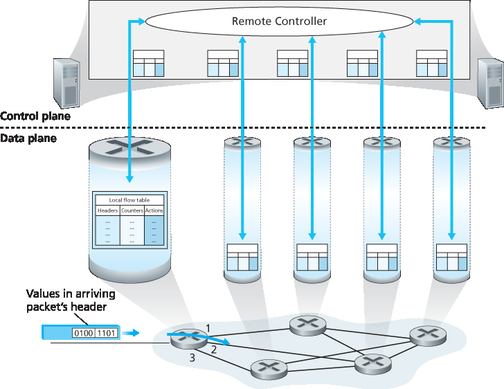
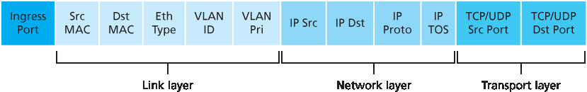
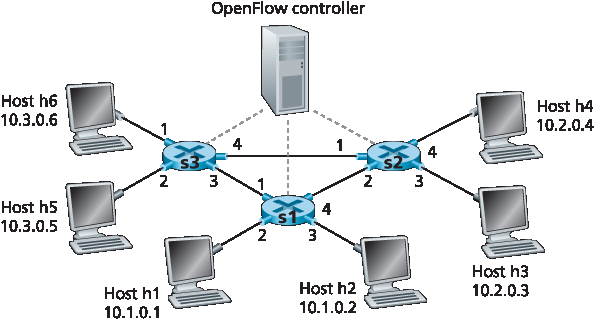

.. _c4.4:

4.4 通用转发与 SDN
====================================
4.4 Generalized Forwarding and SDN

在 :ref:`Section 4.2.1 <c4.2.1>` 中，我们指出，互联网路由器的转发决策传统上仅基于分组的目的地址。然而在上一节中，我们也看到中间盒数量的激增，这些中间盒执行许多第三层功能。NAT 盒会重写报头中的 IP 地址和端口号；防火墙根据报头字段的值阻止流量或将分组重定向以进行附加处理，如深度包检测（DPI）。负载均衡器将请求某项服务（例如 HTTP 请求）的分组转发到提供该服务的一组服务器中的某一个。:ref:`[RFC 3234] <RFC 3234>` 列举了一些常见的中间盒功能。

这种中间盒、第二层交换机和第三层路由器的激增 :ref:`[Qazi 2013] <Qazi 2013>`——每种都有其专用的硬件、软件和管理接口——无疑给许多网络运营商带来了昂贵的困扰。然而，近年来软件定义网络（SDN）的进展已经承诺，并正在实现一种统一的方法，以现代、优雅且集成的方式提供这些网络层功能，以及某些链路层功能。

回想一下 :ref:`[Section 4.2.1] <Section 4.2.1>` 中将基于目的地的转发描述为两个步骤：查找目的 IP 地址（“匹配”），然后将分组送入交换结构以到达指定的输出端口（“动作”）。现在我们来考虑一种更通用的“匹配+动作”范式，其中“匹配”可以基于协议栈中不同层的多个报头字段进行。“动作”可以包括将分组转发到一个或多个输出端口（如基于目的的转发）、将分组在多个通往服务的出口接口之间进行负载均衡（如负载均衡）、重写报头值（如 NAT）、故意阻止/丢弃分组（如防火墙）、将分组发送到特殊服务器以进一步处理（如 DPI）等。

在通用转发中，匹配+动作表是我们在 :ref:`[Section 4.2.1] <Section 4.2.1>` 中遇到的基于目的地的转发表的推广。由于转发决策可能基于网络层和/或链路层的源和目的地址，:ref:`Figure 4.28 <Figure 4.28>` 中所示的转发设备更准确地被称为“分组交换机”，而不是第三层“路由器”或第二层“交换机”。因此，在本节的其余部分以及 :ref:`Section 5.5 <c5.5>` 中，我们将这些设备称为分组交换机，采用 SDN 文献中被广泛采纳的术语。

.. _Figure 4.28:

**图 4.28 通用转发：每个分组交换机包含一个由远程控制器计算并分发的匹配+动作表**

:ref:`Figure 4.28 <Figure 4.28>` 展示了每个分组交换机中的匹配+动作表，该表由远程控制器计算、安装并更新。我们注意到，虽然每个分组交换机中的控制组件可以彼此交互（例如方式类似于 :ref:`Figure 4.2 <Figure 4.2>`），但在实践中，通用的匹配+动作能力是通过一个远程控制器实现的，该控制器计算、安装并更新这些表。你可以花些时间比较 :ref:`Figures 4.2 <Figure 4.2>`、:ref:`4.3 <Figure 4.3>` 和 :ref:`4.28 <Figure 4.28>`——你能注意到 :ref:`Figure 4.2 <Figure 4.2>` 和 :ref:`4.3 <Figure 4.3>` 所示的基于目的的转发与 :ref:`Figure 4.28 <Figure 4.28>` 所示的通用转发之间有哪些相似点和不同点？

我们接下来的通用转发讨论将基于 OpenFlow [:ref:`McKeown 2008 <McKeown 2008>`，:ref:`OpenFlow 2009 <OpenFlow 2009>`，:ref:`Casado 2014 <Casado 2014>`，:ref:`Tourrilhes 2014 <Tourrilhes 2014>`]——这是一个广为人知且成功的标准，它开创了匹配+动作转发抽象与控制器的概念，并推动了 SDN 革命的更广泛发展 :ref:`[Feamster 2013] <Feamster 2013>`。我们主要考虑 OpenFlow 1.0，该版本以特别清晰简洁的方式引入了关键的 SDN 抽象与功能。后续的 OpenFlow 版本根据实现和使用经验引入了附加功能；当前与早期的 OpenFlow 标准版本可在 :ref:`[ONF 2016] <ONF 2016>` 中找到。

每个 **匹配+动作** 转发表项，在 OpenFlow 中称为 **流表**，包括：

- 一组 *报头字段值*，用于与到达分组进行匹配。如同基于目的地转发一样，基于硬件的匹配最快可在 TCAM 内存中完成，可容纳超过一百万个目的地址项 :ref:`[Bosshart 2013] <Bosshart 2013>`。如果分组不匹配任何流表项，则可以被丢弃或发送到远程控制器进行进一步处理。在实践中，出于性能或成本原因，一个流表可以由多个流表实现 :ref:`[Bosshart 2013] <Bosshart 2013>`，但在这里我们聚焦于单一流表的抽象。
- 一组计数器，用于在分组匹配流表项时更新。这些计数器可能包括与该表项匹配的分组数，及该表项最后一次更新以来的时间。
- 一组当分组匹配某流表项时要执行的动作。这些动作可能包括将分组转发到指定输出端口、丢弃分组、复制分组并发送至多个输出端口、重写选定的报头字段等。

我们将在 :ref:`Sections 4.4.1 <c4.4.1>` 和 :ref:`4.4.2 <c4.4.2>` 中进一步探讨匹配和动作。在 :ref:`Section 4.4.3 <c4.4.3>` 中，我们将学习如何利用分组交换机中每个匹配规则的网络范围集合来实现多种功能，包括路由、第二层交换、防火墙、负载均衡、虚拟网络等。最后我们指出，流表本质上是一个 API，是编程单个分组交换机行为的抽象；在 :ref:`Section 4.4.3 <c4.4.3>` 中我们将看到，网络范围的行为也可以通过适当编程/配置这些网络分组交换机的流表来实现 :ref:`[Casado 2014] <Casado 2014>`。

.. toggle::

   In :ref:`Section 4.2.1 <c4.2.1>`, we noted that an Internet router’s forwarding decision has traditionally been based solely on a packet’s destination address. In the previous section, however, we’ve also seen that there has been a proliferation of middleboxes that perform many layer-3 functions. NAT boxes rewrite header IP addresses and port numbers; firewalls block traffic based on header-field values or redirect packets for additional processing, such as deep packet inspection (DPI). Load-balancers forward packets requesting a given service (e.g., an HTTP request) to one of a set of a set of servers that provide that service. :ref:`[RFC 3234] <RFC 3234>` lists a number of common middlebox functions.
   
   This proliferation of middleboxes, layer-2 switches, and layer-3 routers :ref:`[Qazi 2013] <Qazi 2013>`—each with its own specialized hardware, software and management interfaces—has undoubtedly resulted in costly headaches for many network operators. However, recent advances in software-defined networking have promised, and are now delivering, a unified approach towards providing many of these network-layer functions, and certain link-layer functions as well, in a modern, elegant, and integrated manner.
   
   Recall that :ref:`[Section 4.2.1] <Section 4.2.1>` characterized destination-based forwarding as the two steps of looking up a destination IP address (“match”), then sending the packet into the switching fabric to the specified output port (“action”). Let’s now consider a significantly more general “match-plus-action” paradigm, where the “match” can be made over multiple header fields associated with different protocols at different layers in the protocol stack. The “action” can include forwarding the packet to one or more output ports (as in destination-based forwarding), load balancing packets across multiple outgoing interfaces that lead to a service (as in load balancing), rewriting header values (as in NAT), purposefully blocking/dropping a packet (as in a firewall), sending a packet to a special server for further processing and action (as in DPI), and more.
   
   In generalized forwarding, a match-plus-action table generalizes the notion of the destination-based forwarding table that we encountered in :ref:`[Section 4.2.1] <Section 4.2.1>`. Because forwarding decisions may be made using network-layer and/or link-layer source and destination addresses, the forwarding devices shown in :ref:`Figure 4.28 <Figure 4.28>` are more accurately described as “packet switches” rather than layer 3 “routers” or layer 2 “switches.” Thus, in the remainder of this section, and in :ref:`Section 5.5 <c5.5>`, we’ll refer to these devices as packet switches, adopting the terminology that is gaining widespread adoption in SDN literature.
     
   .. figure:: ../img/403-0.png 
       :align: center
   
   **Figure 4.28 Generalized forwarding: Each packet switch contains a match-plus-action table that is computed and distributed by a remote controller**
   
   :ref:`Figure 4.28 <Figure 4.28>` shows a match-plus-action table in each packet switch, with the table being computed, installed, and updated by a remote controller. We note that while it is possible for the control components at the individual packet switch to interact with each other (e.g., in a manner similar to that in :ref:`Figure 4.2 <Figure 4.2>`), in practice generalized match-plus-action capabilities are implemented via a remote controller that computes, installs, and updates these tables. You might take a minute to compare :ref:`Figures 4.2 <Figure 4.2>`, :ref:`4.3 <Figure 4.3>` and :ref:`4.3 <Figure 4.28>`—what similarities and differences do you notice between destination-based forwarding shown in :ref:`Figure 4.2 <Figure 4.2>` and :ref:`4.3 <Figure 4.3>`, and generalized forwarding shown in :ref:`Figure 4.28 <Figure 4.28>`?
   
   Our following discussion of generalized forwarding will be based on OpenFlow [:ref:`McKeown 2008 <McKeown 2008>`, :ref:`OpenFlow 2009 <OpenFlow 2009>`, :ref:`Casado 2014 <Casado 2014>`, :ref:`Tourrilhes 2014 <Tourrilhes 2014>`]—a highly visible and successful standard that has pioneered the notion of the match-plus-action forwarding abstraction and controllers, as well as the SDN revolution more generally :ref:`[Feamster 2013] <Feamster 2013>`. We’ll primarily consider OpenFlow 1.0, which introduced key SDN abstractions and functionality in a particularly clear and concise manner. Later versions of OpenFlow introduced additional capabilities as a result of experience gained through implementation and use; current and earlier versions of the OpenFlow standard can be found at :ref:`[ONF 2016] <ONF 2016>`.
   
   Each entry in the match-plus-action forwarding table, known as a **flow table** in OpenFlow, includes: 
   
   - A set of *header field values* to which an incoming packet will be matched. As in the case of destination-based forwarding, hardware-based matching is most rapidly performed in TCAM memory, with more than a million destination address entries being possible :ref:`[Bosshart 2013] <Bosshart 2013>`. A packet that matches no flow table entry can be dropped or sent to the remote controller for more processing. In practice, a flow table may be implemented by multiple flow tables for performance or cost reasons :ref:`[Bosshart 2013] <Bosshart 2013>`, but we’ll focus here on the abstraction of a single flow table.
   - A set of counters that are updated as packets are matched to flow table entries. These counters might include the number of packets that have been matched by that table entry, and the time since the table entry was last updated.
   - A set of actions to be taken when a packet matches a flow table entry. These actions might be to forward the packet to a given output port, to drop the packet, makes copies of the packet and sent them to multiple output ports, and/or to rewrite selected header fields.
   
   We’ll explore matching and actions in more detail in :ref:`Sections 4.4.1 <c4.4.1>` and :ref:`4.4.2 <c4.4.2>`, respectively. We’ll then study how the network-wide collection of per-packet switch matching rules can be used to implement a wide range of functions including routing, layer-2 switching, firewalling, load-balancing, virtual networks, and more in :ref:`Section 4.4.3 <c4.4.3>`. In closing, we note that the flow table is essentially an API, the abstraction through which an individual packet switch’s behavior can be programmed; we’ll see in :ref:`Section 4.4.3 <c4.4.3>` that network-wide behaviors can similarly be programmed by appropriately programming/configuring these tables in a collection of network packet switches :ref:`[Casado 2014] <Casado 2014>`.
   
.. _c4.4.1:

4.4.1 Match
----------------------------------------------------------

:ref:`图 4.29 <Figure 4.29>` 展示了 OpenFlow 1.0 中 match-plus-action 规则可匹配的十一种分组首部字段以及入端口 ID。回顾 :ref:`第 1.5.2 节 <c1.5.2>`，我们提到一个链路层（第 2 层）帧到达一个分组交换机时，其有效载荷是一个网络层（第 3 层）数据报，而该数据报通常又包含一个传输层（第 4 层）段。我们首先观察到，OpenFlow 的匹配抽象允许在三个协议层的部分首部字段上进行匹配（从而相当公然地违背了我们在 :ref:`第 1.5 节 <c1.5>` 中学习的分层原则）。由于我们尚未涉及链路层，在此仅需知道，:ref:`图 4.29 <Figure 4.29>` 中显示的源和目标 MAC 地址是与该帧的发送和接收接口相关联的链路层地址；通过基于以太网地址而非 IP 地址进行转发，我们可以看到，一个支持 OpenFlow 的设备既可以作为路由器（第 3 层设备）转发数据报，也可以作为交换机（第 2 层设备）转发帧。以太网类型字段对应于该帧的有效载荷将被解复用到的上层协议（如 IP），而 VLAN 字段涉及所谓的虚拟局域网，我们将在 :ref:`第 6 章 <c6>` 中学习。OpenFlow 1.0 规范中可匹配的十二个字段值在更近的 OpenFlow 规范中已扩展为 41 个字段值 :ref:`[Bosshart 2014] <Bosshart 2014>`。

.. _Figure 4.29:
  

**图 4.29 OpenFlow 1.0 流表中的分组匹配字段**

入端口是指分组在分组交换机上接收时的输入端口。分组的 IP 源地址、IP 目标地址、IP 协议字段和 IP 服务类型字段在前面的 :ref:`第 4.3.1 节 <c4.3.1>` 中已讨论过。传输层的源端口号和目标端口号字段也可以用于匹配。

流表项还可以包含通配符。例如，流表中 IP 地址为 128.119.*.* 的项将匹配所有具有以 128.119 为前 16 位地址的对应数据报地址字段。每个流表项也有一个关联的优先级。如果一个分组匹配多个流表项，将选择优先级最高的匹配项及其对应的动作。

最后，我们注意到并非 IP 首部中的所有字段都可用于匹配。例如，OpenFlow 不允许基于 TTL 字段或数据报长度字段进行匹配。为什么某些字段可以用于匹配，而另一些则不可以？答案无疑涉及功能性与复杂性之间的权衡。在选择抽象的“艺术”中，关键在于提供足够的功能来完成任务（在本例中是实现、配置和管理广泛的网络层功能，这些功能此前通过各类网络层设备实现），同时又不因过度细节和泛化使抽象变得臃肿且难以使用。Butler Lampson 曾著名地指出 :ref:`[Lampson 1983] <Lampson 1983>`：

    *一次只做一件事，并把它做好。一个接口应捕捉抽象的最小要素。不要泛化；泛化通常是错误的。*

考虑到 OpenFlow 的成功，我们可以推测其设计者确实很好地选择了他们的抽象。有关 OpenFlow 匹配的更多细节可参见 [:ref:`OpenFlow 2009 <OpenFlow 2009>`，:ref:`ONF 2016 <ONF 2016>`]。

.. toggle::

    :ref:`Figure 4.29 <Figure 4.29>` shows the eleven packet-header fields and the incoming port ID that can be matched in an OpenFlow 1.0 match-plus-action rule. Recall from :ref:`Section 1.5.2 <c1.5.2>` that a link-layer (layer 2) frame arriving to a packet switch will contain a network-layer (layer 3) datagram as its payload, which in turn will typically contain a transport-layer (layer 4) segment. The first observation we make is that OpenFlow’s match abstraction allows for a match to be made on selected fields from three layers of protocol headers (thus rather brazenly defying the layering principle we studied in :ref:`Section 1.5 <c1.5>`). Since we’ve not yet covered the link layer, suffice it to say that the source and destination MAC addresses shown in :ref:`Figure 4.29 <Figure 4.29>` are the link-layer addresses associated with the frame’s sending and receiving interfaces; by forwarding on the basis of Ethernet addresses rather than IP addresses, we can see that an OpenFlow-enabled device can equally perform as a router (layer-3 device) forwarding datagrams as well as a switch (layer-2 device) forwarding frames. The Ethernet type field corresponds to the upper layer protocol (e.g., IP) to which the frame’s payload will be de- multiplexed, and the VLAN fields are concerned with so-called virtual local area networks that we’ll study in :ref:`Chapter 6 <c6>`. The set of twelve values that can be matched in the OpenFlow 1.0 specification has grown to 41 values in more recent OpenFlow specifications :ref:`[Bosshart 2014] <Bosshart 2014>`.
    
    .. figure:: ../img/404-0.png 
        :align: center

    **Figure 4.29 Packet matching fields, OpenFlow 1.0 flow table**

    The ingress port refers to the input port at the packet switch on which a packet is received. The packet’s IP source address, IP destination address, IP protocol field, and IP type of service fields were discussed earlier in :ref:`Section 4.3.1 <c4.3.1>`. The transport-layer source and destination port number fields can also be matched.

    Flow table entries may also have wildcards. For example, an IP address of 128.119.*.* in a flow table will match the corresponding address field of any datagram that has 128.119 as the first 16 bits of its address. Each flow table entry also has an associated priority. If a packet matches multiple flow table entries, the selected match and corresponding action will be that of the highest priority entry with which the packet matches.

    Lastly, we observe that not all fields in an IP header can be matched. For example OpenFlow does not allow matching on the basis of TTL field or datagram length field. Why are some fields allowed for matching, while others are not? Undoubtedly, the answer has to do with the tradeoff between functionality and complexity. The “art” in choosing an abstraction is to provide for enough functionality to accomplish a task (in this case to implement, configure, and manage a wide range of network-layer functions that had previously been implemented through an assortment of network-layer devices), without over-burdening the abstraction with so much detail and generality that it becomes bloated and unusable. Butler Lampson has famously noted :ref:`[Lampson 1983] <Lampson 1983>`:

        *Do one thing at a time, and do it well. An interface should capture the minimum essentials of an abstraction. Don’t generalize; generalizations are generally wrong.*

    Given OpenFlow’s success, one can surmise that its designers indeed chose their abstraction well. Additional details of OpenFlow matching can be found in [:ref:`OpenFlow 2009 <OpenFlow 2009>`, :ref:`ONF 2016 <ONF 2016>`].

.. _c4.4.2:

4.4.2 Action
----------------------------------------------------------

如 :ref:`图 4.28 <Figure 4.28>` 所示，每个流表项都有一个动作列表（可能为空），用于决定对匹配到该流表项的分组所执行的处理。如果有多个动作，它们将按列表中指定的顺序依次执行。

最重要的几个可能动作包括：

- **转发（Forwarding）**。入站分组可以被转发到某个特定的物理输出端口，在所有端口（除了其到达端口）上广播，或者在某个选定的端口集合上多播。该分组也可以被封装并发送至该设备的远程控制器。控制器随后可以（也可能不会）对该分组执行某些操作，包括安装新的流表项，并可将该分组返回至设备以按照更新后的流表规则进行转发。
- **丢弃（Dropping）**。一个无动作的流表项表示匹配到的分组应被丢弃。
- **字段修改（Modify-field）**。在选择的输出端口转发之前，可以重写十个分组首部字段的值（即 :ref:`图 4.29 <Figure 4.29>` 中所有第 2 层、第 3 层和第 4 层字段，除了 IP 协议字段）。

.. toggle::

    As shown in :ref:`Figure 4.28 <Figure 4.28>`, each flow table entry has a list of zero or more actions that determine the processing that is to be applied to a packet that matches a flow table entry. If there are multiple actions, they are performed in the order specified in the list. 

    Among the most important possible actions are:

    - **Forwarding**. An incoming packet may be forwarded to a particular physical output port, broadcast over all ports (except the port on which it arrived) or multicast over a selected set of ports. The packet may be encapsulated and sent to the remote controller for this device. That controller then may (or may not) take some action on that packet, including installing new flow table entries, and may return the packet to the device for forwarding under the updated set of flow table rules.
    - **Dropping**. A flow table entry with no action indicates that a matched packet should be dropped. 
    - **Modify-field**. The values in ten packet header fields (all layer 2, 3, and 4 fields shown in :ref:`Figure 4.29 <Figure 4.29>` except the IP Protocol field) may be re-written before the packet is forwarded to the chosen output port.

.. _c4.4.3:

4.4.3 OpenFlow 中 Match-plus-action 的实际示例
----------------------------------------------------------
4.4.3 OpenFlow Examples of Match-plus-action in Action

在已经考察了通用转发的匹配和动作组成部分之后，我们将把这些概念结合应用到 :ref:`图 4.30 <Figure 4.30>` 所示的示例网络中。该网络包含 6 个主机（h1、h2、h3、h4、h5 和 h6）和三个分组交换机（s1、s2 和 s3），每个交换机有四个本地接口（编号为 1 到 4）。我们将考虑希望实现的一些网络级行为，以及为在 s1、s2 和 s3 中实现这些行为所需的流表项。

.. _Figure 4.30:

**图 4.30 包含三个分组交换机、6 个主机和一个 OpenFlow 控制器的 match-plus-action 网络**

.. toggle::

    Having now considered both the match and action components of generalized forwarding, let’s put these ideas together in the context of the sample network shown in :ref:`Figure 4.30 <Figure 4.30>`. The network has 6 hosts (h1, h2, h3, h4, h5 and h6) and three packet switches (s1, s2 and s3), each with four local interfaces (numbered 1 through 4). We’ll consider a number of network-wide behaviors that we’d like to implement, and the flow table entries in s1, s2 and s3 needed to implement this behavior.

    .. figure:: ../img/406-0.png 
       :align: center

    **Figure 4.30 OpenFlow match-plus-action network with three packet switches, 6 hosts, and an OpenFlow controller**

第一个示例：简单转发
~~~~~~~~~~~~~~~~~~~~~~~~~~~~~~~~~~~~~~
A First Example: Simple Forwarding

作为一个非常简单的示例，假设我们期望的转发行为是：来自 h5 或 h6，目的地为 h3 或 h4 的分组应当从 s3 转发至 s1，再由 s1 转发至 s2（完全避开 s3 和 s2 之间的链路）。s1 中的流表项如下：

+-----------------------------------------------------------+------------+
| s1 流表（示例 1）                                                      |
+-----------------------------------------------------------+------------+
| 匹配条件                                                  |  动作      |
+===========================================================+============+
| 入端口 = 1；IP 源地址 = 10.3.*.*；IP 目标地址 = 10.2.*.*  | Forward(4) |
+-----------------------------------------------------------+------------+
| ...                                                       | ...        |
+-----------------------------------------------------------+------------+

当然，我们还需要在 s3 中配置一个流表项，以便从 h5 或 h6 发送的分组被转发到 s1 的出口接口 3：

+-----------------------------------------------------------+------------+
| s3 流表（示例 1）                                                      |
+-----------------------------------------------------------+------------+
| 匹配条件                                                  |  动作      |
+===========================================================+============+
| IP 源地址 = 10.3.*.*；IP 目标地址 = 10.2.*.*              | Forward(3) |
+-----------------------------------------------------------+------------+
| ...                                                       | ...        |
+-----------------------------------------------------------+------------+

最后，为完成该示例，还需要在 s2 中配置一个流表项，使从 s1 到达的分组能够被转发至其目标主机 h3 或 h4：

+-----------------------------------------------------------+------------+
| s2 流表（示例 1）                                                      |
+-----------------------------------------------------------+------------+
| 匹配条件                                                  |  动作      |
+===========================================================+============+
| 入端口 = 2；IP 目标地址 = 10.2.0.3                        | Forward(3) |
+-----------------------------------------------------------+------------+
| 入端口 = 2；IP 目标地址 = 10.2.0.4                        | Forward(4) |
+-----------------------------------------------------------+------------+
| ...                                                       | ...        |
+-----------------------------------------------------------+------------+

.. toggle::

    As a very simple example, suppose that the desired forwarding behavior is that packets from h5 or h6 destined to h3 or h4 are to be forwarded from s3 to s1, and then from s1 to s2 (thus completely avoiding the use of the link between s3 and s2). The flow table entry in s1 would be:

    +-----------------------------------------------------------+------------+
    | s1 Flow Table (Example 1)                                              |
    +-----------------------------------------------------------+------------+
    | Match                                                     |  Action    |
    +===========================================================+============+
    | Ingress Port = 1 ; IP Src = 10.3.*.* ; IP Dst = 10.2.*.*  | Forward(4) |
    +-----------------------------------------------------------+------------+
    | ...                                                       | ...        |
    +-----------------------------------------------------------+------------+

    Of course, we’ll also need a flow table entry in s3 so that datagrams sent from h5 or h6 are forwarded to s1 over outgoing interface 3:

    +-----------------------------------------------------------+------------+
    | s3 Flow Table (Example 1)                                              |
    +-----------------------------------------------------------+------------+
    | Match                                                     |  Action    |
    +===========================================================+============+
    | IP Src = 10.3.*.* ; IP Dst = 10.2.*.*                     | Forward(3) |
    +-----------------------------------------------------------+------------+
    | ...                                                       | ...        |
    +-----------------------------------------------------------+------------+

    Lastly, we’ll also need a flow table entry in s2 to complete this first example, so that datagrams arriving from s1 are forwarded to their destination, either host h3 or h4:

    +-----------------------------------------------------------+------------+
    | s2 Flow Table (Example 1)                                              |
    +-----------------------------------------------------------+------------+
    | Match                                                     |  Action    |
    +===========================================================+============+
    | Ingress port = 2 ; IP Dst = 10.2.0.3                      | Forward(3) |
    +-----------------------------------------------------------+------------+
    | Ingress port = 2 ; IP Dst = 10.2.0.4                      | Forward(4) |
    +-----------------------------------------------------------+------------+
    | ...                                                       | ...        |
    +-----------------------------------------------------------+------------+

第二个示例：负载均衡
~~~~~~~~~~~~~~~~~~~~~~~~~~~~~~~~~~~
A Second Example: Load Balancing

作为第二个示例，我们考虑一个负载均衡场景，其中 h3 发送的目标地址为 10.1.*.* 的数据报应通过 s2 和 s1 之间的直连链路转发，而 h4 发送的相同目标地址的数据报则通过 s2 到 s3，再由 s3 转发至 s1。请注意，这种行为无法通过 IP 的基于目标地址的转发方式实现。在本例中，s2 的流表如下：

+-----------------------------------------------------------+------------+
| s2 流表（示例 2）                                                      |
+-----------------------------------------------------------+------------+
| 匹配条件                                                  |  动作      |
+===========================================================+============+
| 入端口 = 3；IP 目标地址 = 10.1.*.*                        | Forward(2) |
+-----------------------------------------------------------+------------+
| 入端口 = 4；IP 目标地址 = 10.1.*.*                        | Forward(1) |
+-----------------------------------------------------------+------------+
| ...                                                       | ...        |
+-----------------------------------------------------------+------------+

s1 中也需要配置流表项，用于将从 s2 接收到的数据报转发至 h1 或 h2；s3 中也需要配置流表项，用于将从 s2 接口 4 接收到的数据报通过接口 3 转发至 s1。请尝试推导 s1 和 s3 中所需的流表项。

.. toggle::

    As a second example, let’s consider a load-balancing scenario, where datagrams from h3 destined to 10.1.*.* are to be forwarded over the direct link between s2 and s1, while datagrams from h4 destined to 10.1.*.* are to be forwarded over the link between s2 and s3 (and then from s3 to s1). Note that this behavior couldn’t be achieved with IP’s destination-based forwarding. In this case, the flow table in s2 would be:

    +-----------------------------------------------------------+------------+
    | s2 Flow Table (Example 2)                                              |
    +-----------------------------------------------------------+------------+
    | Match                                                     |  Action    |
    +===========================================================+============+
    | Ingress port = 3; IP Dst = 10.1.*.*                       | Forward(2) |
    +-----------------------------------------------------------+------------+
    | Ingress port = 4; IP Dst = 10.1.*.*                       | Forward(1) |
    +-----------------------------------------------------------+------------+
    | ...                                                       | ...        |
    +-----------------------------------------------------------+------------+

    Flow table entries are also needed at s1 to forward the datagrams received from s2 to either h1 or h2; and flow table entries are needed at s3 to forward datagrams received on interface 4 from s2 over interface 3 towards s1. See if you can figure out these flow table entries at s1 and s3.

第三个示例：防火墙
~~~~~~~~~~~~~~~~~~~~~~~~~~~~~
A Third Example: Firewalling

作为第三个示例，我们考虑一个防火墙场景，其中 s2 希望仅接收（在其任意接口上）从连接在 s3 上的主机发出的流量。

+-----------------------------------------------------------+------------+
| s2 流表（示例 3）                                                      |
+-----------------------------------------------------------+------------+
| 匹配条件                                                  |  动作      |
+===========================================================+============+
| IP 源地址 = 10.3.*.*；IP 目标地址 = 10.2.0.3              | Forward(3) |
+-----------------------------------------------------------+------------+
| IP 源地址 = 10.3.*.*；IP 目标地址 = 10.2.0.4              | Forward(4) |
+-----------------------------------------------------------+------------+
| ...                                                       | ...        |
+-----------------------------------------------------------+------------+

如果 s2 的流表中没有其他条目，则仅允许来自 10.3.*.* 的流量被转发至连接在 s2 上的主机。

尽管我们这里只考虑了一些基本场景，但通用转发的灵活性和优势已经显而易见。在作业问题中，我们将探索如何利用流表创建多种不同的逻辑行为，包括虚拟网络 —— 两个或多个逻辑上独立的网络（各自具有独立且不同的转发行为），共享同一物理的分组交换机和链路。在 :ref:`第 5.5 节 <c5.5>` 中，我们将再次讨论流表，此时将学习 SDN 控制器如何计算并分发流表，以及交换机与控制器之间所使用的通信协议。

.. toggle::

    As a third example, let’s consider a firewall scenario in which s2 wants only to receive (on any of its interfaces) traffic sent from hosts attached to s3.

    +-----------------------------------------------------------+------------+
    | s2 Flow Table (Example 3)                                              |
    +-----------------------------------------------------------+------------+
    | Match                                                     |  Action    |
    +===========================================================+============+
    | IP Src = 10.3.*.* IP Dst = 10.2.0.3                       | Forward(3) |
    +-----------------------------------------------------------+------------+
    | IP Src = 10.3.*.* IP Dst = 10.2.0.4                       | Forward(4) |
    +-----------------------------------------------------------+------------+
    | ...                                                       | ...        |
    +-----------------------------------------------------------+------------+

    If there were no other entries in s2’s flow table, then only traffic from 10.3.*.* would be forwarded to the hosts attached to s2.

    Although we’ve only considered a few basic scenarios here, the versatility and advantages of generalized forwarding are hopefully apparent. In homework problems, we’ll explore how flow tables can be used to create many different logical behaviors, including virtual networks—two or more logically separate networks (each with their own independent and distinct forwarding behavior)—that use the same physical set of packet switches and links. In :ref:`Section 5.5 <c5.5>`, we’ll return to flow tables when we study the SDN controllers that compute and distribute the flow tables, and the protocol used for communicating between a packet switch and its controller.
