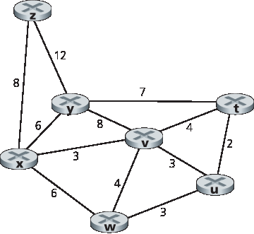
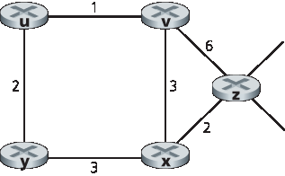
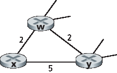
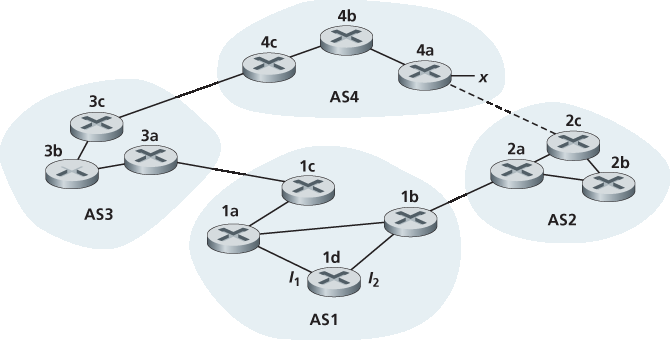
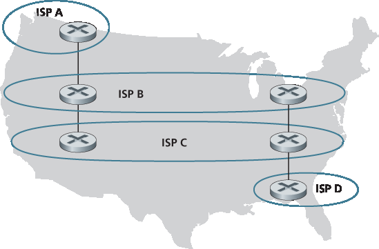
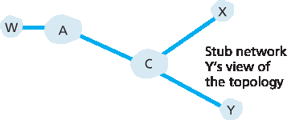
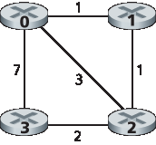

家庭作业问题和疑问
========================================

Homework Problems and Questions

.. tab:: 中文

.. tab:: 英文

SECTION 5.1
    R1. What is meant by a control plane that is based on per-router control? In such cases, when we say the network control and data planes are implemented “monolithically,” what do we mean?
    
    R2. What is meant by a control plane that is based on logically centralized control? In such cases, are the data plane and the control plane implemented within the same device or in separate devices? Explain.

SECTION 5.2
    R3. Compare and contrast the properties of a centralized and a distributed routing algorithm. Give an example of a routing protocol that takes a centralized and a decentralized approach.

    R4. Compare and contrast link-state and distance-vector routing algorithms. R5. What is the “count to infinity” problem in distance vector routing?

    R6. Is it necessary that every autonomous system use the same intra-AS routing algorithm? Why or why not?

SECTIONS 5.3–5.4
    R7. Why are different inter-AS and intra-AS protocols used in the Internet?
    
    R8. True or false: When an OSPF route sends its link state information, it is sent only to those nodes directly attached neighbors. Explain.
    
    R9. What is meant by an area in an OSPF autonomous system? Why was the concept of an area introduced?
    
    R10. Define and contrast the following terms: subnet, prefix, and BGP route.
    
    R11. How does BGP use the NEXT-HOP attribute? How does it use the AS-PATH attribute?
    
    R12. Describe how a network administrator of an upper-tier ISP can implement policy when configuring BGP.
    
    R13. True or false: When a BGP router receives an advertised path from its neighbor, it must add its own identity to the received path and then send that new path on to all of its neighbors. Explain.

SECTION 5.5
    R14. Describe the main role of the communication layer, the network-wide state-­management layer, and the network-control application layer in an SDN controller.
    
    R15. Suppose you wanted to implement a new routing protocol in the SDN control plane. At which layer would you implement that protocol? Explain.
    
    R16. What types of messages flow across an SDN controller’s northbound and southbound APIs? Who is the recipient of these messages sent from the controller across the southbound interface, and who sends messages to the controller across the northbound interface?

    R17. Describe the purpose of two types of OpenFlow messages (of your choosing) that are sent from a controlled device to the controller. Describe the purpose of two types of Openflow messages (of your choosing) that are send from the controller to a controlled device.

    R18. What is the purpose of the service abstraction layer in the OpenDaylight SDN controller?

SECTIONS 5.6–5.7
    R19. Names four different types of ICMP messages
    
    R20. What two types of ICMP messages are received at the sending host executing the Traceroute program?
    
    R21. Define the following terms in the context of SNMP: managing server, ­managed device, network management agent and MIB.
    
    R22. What are the purposes of the SNMP GetRequest and SetRequest messages? R23. What is the purpose of the SNMP trap message?

Problems
----------

P1. Looking at :ref:`Figure 5.3 <Figure 5.3>` , enumerate the paths from y to u that do not contain any loops. 

P2. Repeat Problem P1 for paths from x to z, z to u, and z to w.

P3. Consider the following network. With the indicated link costs, use Dijkstra’s shortest-path algorithm to compute the shortest path from x to all network nodes. Show how the algorithm works by computing a table similar to :ref:`Table 5.1 <Table 5.1>` .

.. figure:: ../img/videonote.png
   :align: center

**Dijkstra’s algorithm: discussion and example**

   
P4. Consider the network shown in Problem P3. Using Dijkstra’s algorithm, and showing your work using a table similar to :ref:`Table 5.1 <Table 5.1>` , do the following:

a. Compute the shortest path from t to all network nodes. 
b. Compute the shortest path from u to all network nodes. 
c. Compute the shortest path from v to all network nodes. 
d. Compute the shortest path from w to all network nodes. 
e. Compute the shortest path from y to all network nodes.
f. Compute the shortest path from z to all network nodes.

P5. Consider the network shown below, and assume that each node initially knows the costs to each of its neighbors. Consider the distance-vector algorithm and show the distance table entries at node z.

P6. Consider a general topology (that is, not the specific network shown above) and a synchronous version of the distance-vector algorithm. Suppose that at each iteration, a node exchanges its distance vectors with its neighbors and receives their distance vectors. Assuming that the algorithm begins with each node knowing only the costs to its immediate neighbors, what is the maximum number of iterations required before the distributed algorithm converges? Justify your answer.

P7. Consider the network fragment shown below. x has only two attached neighbors, w and y. w has a minimum-cost path to destination u (not shown) of 5, and y has a minimum-cost path to u of 6. The complete paths from w and y to u (and between w and y) are not shown. All link costs in the network have strictly positive integer values.

a. Give x’s distance vector for destinations w, y, and u.
b. Give a link-cost change for either c(x, w) or c(x, y) such that x will inform its neighbors of a new minimum-cost path to u as a result of executing the distance-vector algorithm.
c. Give a link-cost change for either c(x, w) or c(x, y) such that x will not inform its neighbors of a new minimum-cost path to u as a result of executing the distance-vector algorithm.

P8. Consider the three-node topology shown in :ref:`Figure 5.6 <Figure 5.6>` . Rather than having the link costs shown in :ref:`Figure 5.6 <Figure 5.6>` , the link costs are c(x,y)=3, c(y,z)=6, c(z,x)=4. Compute the distance tables after the initialization step and after each iteration of a synchronous version of the distance-vector algorithm (as we did in our earlier discussion of :ref:`Figure 5.6 <Figure 5.6>` ).

P9. Consider the count-to-infinity problem in the distance vector routing. Will the count-to-infinity problem occur if we decrease the cost of a link? Why? How about if we connect two nodes which do not have a link?

P10. Argue that for the distance-vector algorithm in Figure 5.6 , each value in the distance vector D(x) is non-increasing and will eventually stabilize in a finite number of steps.

P11. Consider :ref:`Figure 5.7 <Figure 5.7>`. Suppose there is another router w, connected to router y and z. The costs of all links are given as follows: c(x,y)=4, c(x,z)=50, c(y,w)=1, c(z,w)=1, c(y,z)=3. Suppose that poisoned reverse is used in the distance-vector routing algorithm.

a. When the distance vector routing is stabilized, router w, y, and z inform their distances to x to each other. What distance values do they tell each other?
b. Now suppose that the link cost between x and y increases to 60. Will there be a count-to- infinity problem even if poisoned reverse is used? Why or why not? If there is a count-to-infinity problem, then how many iterations are needed for the distance-vector routing to reach a stable state again? Justify your answer.
c. How do you modify c(y, z) such that there is no count-to-infinity problem at all if c(y,x) changes from 4 to 60?

P12. Describe how loops in paths can be detected in BGP.

P13. Will a BGP router always choose the loop-free route with the shortest ASpath length? Justify your answer.

P14. Consider the network shown below. Suppose AS3 and AS2 are running OSPF for their intra-AS routing protocol. Suppose AS1 and AS4 are running RIP for their intra-AS routing protocol. Suppose eBGP and iBGP are used for the inter-AS routing protocol. Initially suppose there is no physical link between AS2 and AS4.

a. Router 3c learns about prefix x from which routing protocol: OSPF, RIP, eBGP, or iBGP? b. Router 3a learns about x from which routing protocol?
c. Router 1c learns about x from which routing protocol?
d. Router 1d learns about x from which routing protocol?

P15. Referring to the previous problem, once router 1d learns about x it will put an entry (x, I) in its forwarding table.

a. Will I be equal to I1 or I2 for this entry? Explain why in one sentence.
b. Now suppose that there is a physical link between AS2 and AS4, shown by the dotted line. Suppose router 1d learns that x is accessible via AS2 as well as via AS3. Will I be set to I1 or I2? Explain why in one sentence.
c. Now suppose there is another AS, called AS5, which lies on the path between AS2 and AS4 (not shown in diagram). Suppose router 1d learns that x is accessible via AS2 AS5 AS4 as well as via AS3 AS4. Will I be set to I1 or I2? Explain why in one sentence.

P16. Consider the following network. ISP B provides national backbone service to regional ISP A. ISP C provides national backbone service to regional ISP D. Each ISP consists of one AS. B and C peer with each other in two places using BGP. Consider traffic going from A to D. B would prefer to hand that traffic over to C on the West Coast (so that C would have to absorb the cost of carrying the traffic cross-country), while C would prefer to get the traffic via its East Coast peering point with B (so that B would have carried the traffic across the country). What BGP mechanism might C use, so that B would hand over A-to-D traffic at its East Coast peering point? To answer this question, you will need to dig into the BGP ­specification.

P17. In :ref:`Figure 5.13 <Figure 5.13>` , consider the path information that reaches stub networks W, X, and Y. Based on the information available at W and X, what are their respective views of the network topology? Justify your answer. The topology view at Y is shown below.

P18. Consider :ref:`Figure 5.13 <Figure 5.13>` . B would never forward traffic destined to Y via X based on BGP routing. But there are some very popular applications for which data packets go to X first and then flow to Y. Identify one such application, and describe how data packets follow a path not given by BGP routing.

P19. In :ref:`Figure 5.13 <Figure 5.13>` , suppose that there is another stub network V that is a customer of ISP A. Suppose that B and C have a peering relationship, and A is a customer of both B and C. Suppose that A would like to have the traffic destined to W to come from B only, and the traffic destined to V from either B or C. How should A advertise its routes to B and C? What AS routes does C receive?

P20. Suppose ASs X and Z are not directly connected but instead are connected by AS Y. Further suppose that X has a peering agreement with Y, and that Y has a peering agreement with Z. Finally, suppose that Z wants to transit all of Y’s traffic but does not want to transit X’s traffic. Does BGP allow Z to ­implement this policy?

P21. Consider the two ways in which communication occurs between a managing entity and a managed device: request-response mode and trapping. What are the pros and cons of these two approaches, in terms of (1) overhead, (2) notification time when exceptional events occur, and (3) robustness with respect to lost messages between the managing entity and the device?

P22. In :ref:`Section 5.7 <c5.7>` we saw that it was preferable to transport SNMP messages in unreliable UDP datagrams. Why do you think the designers of SNMP chose UDP rather than TCP as the transport protocol of choice for SNMP?

Socket Programming Assignment
------------------------------------------

At the end of :ref:`Chapter 2 <c2>`, there are four socket programming assignments. Below, you will find a fifth assignment which employs ICMP, a protocol discussed in this chapter.

Assignment 5: ICMP Ping
-------------------------

Ping is a popular networking application used to test from a remote location whether a particular host is up and reachable. It is also often used to measure latency between the client host and the target host. It works by sending ICMP “echo request” packets (i.e., ping packets) to the target host and listening for ICMP “echo response” replies (i.e., pong packets). Ping measures the RRT, records packet loss, and calculates a statistical summary of multiple ping-pong exchanges (the minimum, mean, max, and standard deviation of the round-trip times).

In this lab, you will write your own Ping application in Python. Your application will use ICMP. But in order to keep your program simple, you will not exactly follow the official specification in RFC 1739. Note that you will only need to write the client side of the program, as the functionality needed on the server side is built into almost all operating systems. You can find full details of this assignment, as well as
important snippets of the Python code, at the Web site http://www.pearsonhighered.com/cs-resources.

Programming Assignment
----------------------

In this programming assignment, you will be writing a “distributed” set of procedures that implements a distributed asynchronous distance-vector routing for the network shown below.

You are to write the following routines that will “execute” asynchronously within the emulated environment provided for this assignment. For node 0, you will write the routines:

- rtinit0(). This routine will be called once at the beginning of the emulation. rtinit0() has no arguments. It should initialize your distance table in node 0 to reflect the direct costs of 1, 3, and 7 to nodes 1, 2, and 3, respectively. In the figure above, all links are bidirectional and the costs in both directions are identical. After initializing the distance table and any other data structures needed by your node 0 routines, it should then send its directly connected neighbors (in this case, 1, 2, and 3) the cost of its minimum-cost paths to all other network nodes. This minimum-cost information is sent to neighboring nodes in a routing update packet by calling the routine tolayer2(), as described in the full assignment. The format of the routing update packet is also described in the full assignment.
- rtupdate0(struct rtpkt *rcvdpkt). This routine will be called when node 0 receives a routing packet that was sent to it by one of its directly connected neighbors. The parameter *rcvdpkt is a pointer to the packet that was received. rtupdate0() is the “heart” of the distance-vector algorithm. The values it receives in a routing update packet from some other node i contain i’s current shortest-path costs to all other network nodes. rtupdate0() uses these received values to update its own distance table (as specified by the distance-vector algorithm). If its own minimum cost to another node changes as a result of the update, node 0 informs its directly connected neighbors of this change in minimum cost by sending them a routing packet. Recall that in the distance-vector algorithm, only directly connected nodes will exchange routing packets. Thus, nodes 1 and 2 will communicate with each other, but nodes 1 and 3 will not communicate with each other.

Similar routines are defined for nodes 1, 2, and 3. Thus, you will write eight procedures in all: rtinit0(), rtinit1(), rtinit2(), rtinit3(), rtupdate0(), rtupdate1(), rtupdate2(), and rtupdate3(). These routines will together implement a distributed, asynchronous computation of the distance tables for the topology and costs shown in the figure on the preceding page.

You can find the full details of the programming assignment, as well as C code that you will need to create the simulated hardware/software environment, at http://www.pearsonhighered.com/cs-resource. A Java version of the assignment is also available.
 