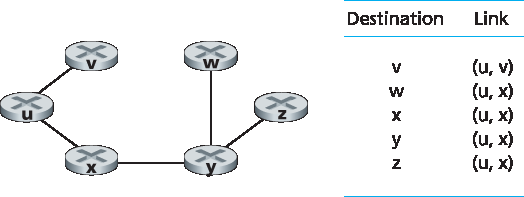
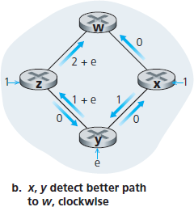
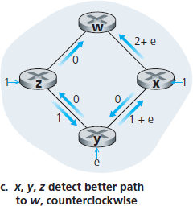
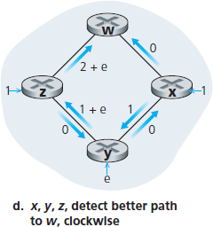
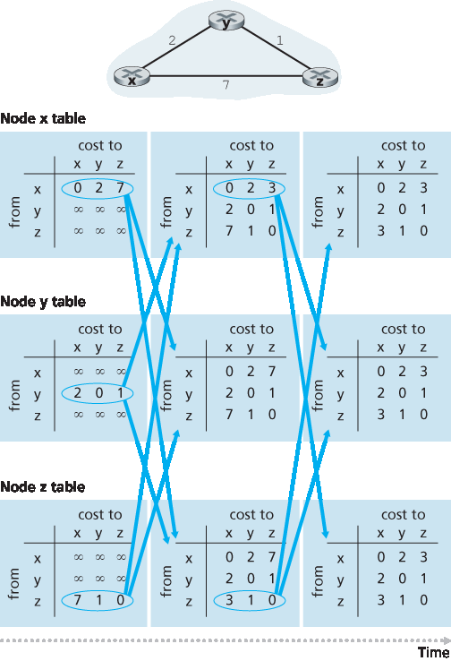

.. _c5.2:

5.2 路由算法
===========================================================
5.2 Routing Algorithms

.. tab:: 中文

.. tab:: 英文

In this section we’ll study **routing algorithms**, whose goal is to determine good paths (equivalently, routes), from senders to receivers, through the network of routers. Typically, a “good” path is one that has the least cost. We’ll see that in practice, however, real-world concerns such as policy issues (for example,
a rule such as “router x, belonging to organization Y, should not forward any packets originating from the network owned by organization Z ”) also come into play. We note that whether the network control plane
adopts a per-router control approach or a logically centralized approach, there must always be a well- defined sequence of routers that a packet will cross in traveling from sending to receiving host. Thus, the routing algorithms that compute these paths are of fundamental importance, and another candidate for our top-10 list of fundamentally important networking concepts.

A graph is used to formulate routing problems. Recall that a **graph** G=(N, E) is a set N of nodes and a collection E of edges, where each edge is a pair of nodes from N. In the context of network-layer routing, the nodes in the graph represent routers—the points at which packet-forwarding decisions are made—and the edges connecting these nodes represent the physical links between these routers. Such a graph abstraction of a computer network is shown in :ref:`Figure 5.3 <Figure 5.3>`. To view some graphs representing real network maps, see [:ref:`Dodge 2016 <Dodge 2016>`, :ref:`Cheswick 2000 <Cheswick 2000>`]; for a discussion of how well different graph-based models model the Internet, see [:ref:`Zegura 1997 <Zegura 1997>`, :ref:`Faloutsos 1999 <Faloutsos 1999>`, :ref:`Li 2004 <Li 2004>`].

As shown in :ref:`Figure 5.3 <Figure 5.3>`, an edge also has a value representing its cost. Typically, an edge’s cost may reflect the physical length of the corresponding link (for example, a transoceanic link might have a higher cost than a short-haul terrestrial link), the link speed, or the monetary cost associated with a link. For our purposes, we’ll simply take the edge costs as a given and won’t worry about how they are determined. For any edge (x, y) in E, we denote c(x, y) as the cost of the edge between nodes x and y. If the pair (x, y) does not belong to E, we set c(x, y)=∞. Also, we’ll only consider undirected graphs (i.e., graphs whose edges do not have a direction) in our discussion here, so that edge (x, y) is the same as edge (y, x) and that c(x, y)=c(y, x); however, the algorithms we’ll study can be easily extended to the case of directed links with a different cost in each direction. Also, a node y is said to be a **neighbor** of node x if (x, y) belongs to E.

Given that costs are assigned to the various edges in the graph abstraction, a natural goal of a routing algorithm is to identify the least costly paths between sources and destinations. To make this problem more precise, recall that a **path** in a graph G=(N, E) is a sequence of nodes (x1,x2,⋯,xp) such that each of the pairs (x1,x2),(x2,x3),⋯,(xp−1,xp) are edges in E. The cost of a path (x1,x2,⋯, xp) is simply the sum of all the edge costs along the path, that is, c(x1,x2)+c(x2,x3)+⋯+c(xp−1,xp). Given any two nodes x and y, there are typically many paths between the two nodes, with each path having a cost. One or more of these paths is a **least-cost path**. The least-cost problem is therefore clear: Find a path between the source and destination that has least cost. In :ref:`Figure 5.3 <Figure 5.3>`, for example, the least-cost path between source node u and destination node w is (u, x, y, w) with a path cost of 3. Note that if all edges in the graph have the same cost, the least-cost path is also the **shortest path** (that is, the path with the smallest number of links between the source and the destination).

As a simple exercise, try finding the least-cost path from node u to z in :ref:`Figure 5.3 <Figure 5.3>` and reflect for a moment on how you calculated that path. If you are like most people, you found the path from u to z by examining :ref:`Figure 5.3 <Figure 5.3>`, tracing a few routes from u to z, and somehow convincing yourself that the path you had chosen had the least cost among all possible paths. (Did you check all of the 17 possible paths between u and z? Probably not!) Such a calculation is an example of a centralized routing algorithm—the routing algorithm was run in one location, your brain, with complete information about the network. Broadly, one way in which we can classify routing algorithms is according to whether they are centralized or decentralized.

- A **centralized routing algorithm** computes the least-cost path between a source and destination using complete, global knowledge about the network. That is, the algorithm takes the connectivity between all nodes and all link costs as inputs. This then requires that the algorithm somehow obtain this information before actually performing the calculation. The calculation itself can be run at one site (e.g., a logically centralized controller as in :ref:`Figure 5.2 <Figure 5.2>`) or could be replicated in the routing component of each and every router (e.g., as in :ref:`Figure 5.1 <Figure 5.1>`). The key distinguishing feature here, however, is that the algorithm has complete information about connectivity and link costs. Algorithms with global state information are often referred to as **link-state (LS) algorithms**, since the algorithm must be aware of the cost of each link in the network. We’ll study LS algorithms in Section 5.2.1.
- In a **decentralized routing algorithm**, the calculation of the least-cost path is carried out in an iterative, distributed manner by the routers. No node has complete information about the costs of all network links. Instead, each node begins with only the knowledge of the costs of its own directly attached links. Then, through an iterative process of calculation and exchange of information with its neighboring nodes, a node gradually calculates the least-cost path to a destination or set of destinations. The decentralized routing algorithm we’ll study below in :ref:`Section 5.2.2 <c5.2.2>` is called a distance-vector (DV) algorithm, because each node maintains a vector of estimates of the costs (distances) to all other nodes in the network. Such decentralized algorithms, with interactive message exchange between neighboring routers is perhaps more naturally suited to control planes where the routers interact directly with each other, as in :ref:`Figure 5.1 <Figure 5.1>`.

A second broad way to classify routing algorithms is according to whether they are static or dynamic. In **static routing algorithms**, routes change very slowly over time, often as a result of human intervention (for example, a human manually editing a link costs). **Dynamic routing algorithms** change the routing paths as the network traffic loads or topology change. A dynamic algorithm can be run either periodically or in direct response to topology or link cost changes. While dynamic algorithms are more responsive to network changes, they are also more susceptible to problems such as routing loops and route oscillation.

A third way to classify routing algorithms is according to whether they are load-sensitive or load- insensitive. In a **load-sensitive algorithm**, link costs vary dynamically to reflect the current level of congestion in the underlying link. If a high cost is associated with a link that is currently congested, a routing algorithm will tend to choose routes around such a congested link. While early ARPAnet routing algorithms were load-sensitive :ref:`[McQuillan 1980] <McQuillan 1980>`, a number of difficulties were encountered :ref:`[Huitema 1998] <Huitema 1998>`. Today’s Internet routing algorithms (such as RIP, OSPF, and BGP) are **load-insensitive**, as a link’s cost does not explicitly reflect its current (or recent past) level of congestion.

.. _c5.2.1:

5.2.1 链路状态 (LS) 路由算法
----------------------------------------------------------------------------
5.2.1 The Link-State (LS) Routing Algorithm

.. tab:: 中文

.. tab:: 英文

Recall that in a link-state algorithm, the network topology and all link costs are known, that is, available as input to the LS algorithm. In practice this is accomplished by having each node broadcast link-state packets to all other nodes in the network, with each link-state packet containing the identities and costs of its attached links. In practice (for example, with the Internet’s OSPF routing protocol, discussed in :ref:`Section 5.3 <c5.3>` ) this is often accomplished by a **link-state broadcast** algorithm ­:ref:`[Perlman 1999] <Perlman 1999>` . The result of the nodes’ broadcast is that all nodes have an identical and complete view of the network. Each node can then run the LS algorithm and compute the same set of least-cost paths as every other node.

The link-state routing algorithm we present below is known as *Dijkstra’s algorithm*, named after its inventor. A closely related algorithm is Prim’s algorithm; see :ref:`[Cormen 2001] <Cormen 2001>` for a general discussion of graph algorithms. Dijkstra’s algorithm computes the least-cost path from one node (the source, which we will refer to as u) to all other nodes in the network. Dijkstra’s algorithm is iterative and has the property that after the kth iteration of the algorithm, the least-cost paths are known to k destination nodes, and among the least-cost paths to all destination nodes, these k paths will have the k smallest costs. Let us define the following notation:

- *D(v)*: cost of the least-cost path from the source node to destination v as of this iteration of the algorithm.
- *p(v)*: previous node (neighbor of v) along the current least-cost path from the source to v. 
- *N′*: subset of nodes; v is in N′ if the least-cost path from the source to v is definitively known.

The centralized routing algorithm consists of an initialization step followed by a loop. The number of times the loop is executed is equal to the number of nodes in the network. Upon termination, the algorithm will have calculated the shortest paths from the source node u to every other node in the network.

.. code-block:: text
   :linenos:
   :caption: Link-State (LS) Algorithm for Source Node u

    Initialization:
        N’ = {u}
        for all nodes v
            if v is a neighbor of u
                then D(v) = c(u, v)
            else D(v) = ∞
    Loop
    find w not in N’ such that D(w) is a minimum
    add w to N’
    update D(v) for each neighbor v of w and not in N’:

        D(v) = min(D(v), D(w)+ c(w, v) )
    
    /* new cost to v is either old cost to v or known
    least path cost to w plus cost from w to v */

As an example, let’s consider the network in :ref:`Figure 5.3 <Figure 5.3>` and compute the least-cost paths from u to all possible destinations. A tabular summary of the algorithm’s computation is shown in :ref:`Table 5.1 <Table 5.1>`, where each line in the table gives the values of the algorithm’s variables at the end of the iteration. Let’s consider the few first steps in detail. 

- In the initialization step, the currently known least-cost paths from u to its directly attached neighbors, v, x, and w, are initialized to 2, 1, and 5, respectively. Note in particular that the cost to w is set to 5 (even though we will soon see that a lesser-cost path does indeed exist) since this is the cost of the direct (one hop) link from u to w. The costs to y and z are set to infinity because they are not directly connected to u.

  .. _Table 5.1:

  **Table 5.1 Running the link-state algorithm on the network in** :ref:`Figure 5.3 <Figure 5.3>`

  +--------+--------+------------+------------+------------+--------------+--------------+
  | step   | N’     | D(v), p(v) | D(w), p(w) | D(x), p(x) | D (y), p (y) | D (z), p (z) |
  +========+========+============+============+============+==============+==============+
  | 0      | u      | 2, u       | 5, u       | 1,u        | ∞            | ∞            |
  +--------+--------+------------+------------+------------+--------------+--------------+
  | 1      | ux     | 2, u       | 4, u       |            | 2, x         | ∞            |
  +--------+--------+------------+------------+------------+--------------+--------------+
  | 2      | uxy    | 2, u       | 3, y       |            | 2, x         | 4, y         |
  +--------+--------+------------+------------+------------+--------------+--------------+
  | 3      | uxyv   |            | 3, y       |            |              | 4, y         |
  +--------+--------+------------+------------+------------+--------------+--------------+
  | 4      | uxyvw  |            |            |            |              | 4, y         |
  +--------+--------+------------+------------+------------+--------------+--------------+
  | 5      | uxyvwz |            |            |            |              |              |
  +--------+--------+------------+------------+------------+--------------+--------------+

- In the first iteration, we look among those nodes not yet added to the set N′ and find that node with the least cost as of the end of the previous iteration. That node is x, with a cost of 1, and thus x is added to the set N′. Line 12 of the LS algorithm is then performed to update D(v) for all nodes v, yielding the results shown in the second line (Step 1) in :ref:`Table 5.1 <Table 5.1>`. The cost of the path to v is unchanged. The cost of the path to w (which was 5 at the end of the initialization) through node x is found to have a cost of 4. Hence this lower-cost path is selected and w’s predecessor along the shortest path from u is set to x. Similarly, the cost to y (through x) is computed to be 2, and the table is updated accordingly.
- In the second iteration, nodes v and y are found to have the least-cost paths (2), and we break the tie arbitrarily and add y to the set N′ so that N′ now contains u, x, and y. The cost to the remaining nodes not yet in N′, that is, nodes v, w, and z, are updated via line 12 of the LS algorithm, yielding the results shown in the third row in :ref:`Table 5.1 <Table 5.1>`.
- And so on . . .

When the LS algorithm terminates, we have, for each node, its predecessor along the least-cost path from the source node. For each predecessor, we also have its predecessor, and so in this manner we can
construct the entire path from the source to all destinations. The forwarding table in a node, say node u, can then be constructed from this information by storing, for each destination, the next-hop node on the
least-cost path from u to the destination. :ref:`Figure 5.4 <Figure 5.4>` shows the resulting least-cost paths and forwarding table in u for the network in :ref:`Figure 5.3 <Figure 5.3>`.

.. _Figure 5.4:

**Figure 5.4 Least cost path and forwarding table for node u**

What is the computational complexity of this algorithm? That is, given n nodes (not counting the source), how much computation must be done in the worst case to find the least-cost paths from the source to all destinations? In the first iteration, we need to search through all n nodes to determine the node, w, not in N′ that has the minimum cost. In the second iteration, we need to check n−1 nodes to determine the minimum cost; in the third iteration n−2 nodes, and so on. Overall, the total number of nodes we need to search through over all the iterations is n(n+1)/2, and thus we say that the preceding implementation of the LS algorithm has worst-case complexity of order n squared: :math:`O(n^2)`. (A more sophisticated implementation of this algorithm, using a data structure known as a heap, can find the minimum in line 9 in logarithmic rather than linear time, thus reducing the complexity.)

Before completing our discussion of the LS algorithm, let us consider a pathology that can arise. :ref:`Figure 5.5 <Figure 5.5>` shows a simple network topology where link costs are equal to the load carried on the link, for
example, reflecting the delay that would be experienced. In this example, link costs are not symmetric; that
is, c(u, v) equals c(v, u) only if the load carried on both directions on the link (u, v) is the same. In this example, node z originates a unit of traffic destined for w, node x also originates a unit of traffic destined for w, and node y injects an amount of traffic equal to e, also destined for w. The initial routing is shown in :ref:`Figure 5.5(a) <Figure 5.5>` with the link costs corresponding to the amount of traffic carried.

When the LS algorithm is next run, node y determines (based on the link costs shown in :ref:`Figure 5.5(a) <Figure 5.5>` ) that the clockwise path to w has a cost of 1, while the counterclockwise path to w (which it had been using) has a cost of 1+e. Hence y’s least-cost path to w is now clockwise. Similarly, x determines that its new least-cost path to w is also clockwise, resulting in costs shown in :ref:`Figure 5.5(b) <Figure 5.5>`. When the LS algorithm is run next, nodes x, y, and z all detect a zero-cost path to w in the counterclockwise direction, and all route their traffic to the counterclockwise routes. The next time the LS algorithm is run, x, y, and z all then route their traffic to the clockwise routes.

.. figure:: ../img/432-0.png 
   :align: left

.. _Figure 5.5:

|

**Figure 5.5 Oscillations with congestion-sensitive routing**

What can be done to prevent such oscillations (which can occur in any algorithm, not just an LS algorithm, that uses a congestion or delay-based link metric)? One solution would be to mandate that link costs not depend on the amount of traffic carried—an unacceptable solution since one goal of routing is to avoid highly congested (for example, high-delay) links. Another solution is to ensure that not all routers run the LS algorithm at the same time. This seems a more reasonable solution, since we would hope that even if routers ran the LS algorithm with the same periodicity, the execution instance of the algorithm would not be the same at each node. Interestingly, researchers have found that routers in the Internet can self-synchronize among themselves :ref:`[Floyd Synchronization 1994] <Floyd Synchronization 1994>`. That is, even though they initially execute the algorithm with the same period but at different instants of time, the algorithm execution instance can eventually become, and remain, synchronized at the routers. One way to avoid such self-synchronization is for each router to randomize the time it sends out a link advertisement.

Having studied the LS algorithm, let’s consider the other major routing algorithm that is used in practice today—the distance-vector routing algorithm.

.. _c5.2.2:

5.2.2 距离矢量 (DV) 路由算法
----------------------------------------------------------------------------
5.2.2 The Distance-Vector (DV) Routing Algorithm

.. tab:: 中文

.. tab:: 英文

Whereas the LS algorithm is an algorithm using global information, the **distance-vector (DV)** algorithm is
iterative, asynchronous, and distributed. It is distributed in that each node receives some information from
one or more of its directly attached neighbors, performs a calculation, and then distributes the results of its
calculation back to its neighbors. It is iterative in that this process continues on until no more information is exchanged between neighbors. (Interestingly, the algorithm is also self-terminating—there is no signal that
the computation should stop; it just stops.) The algorithm is asynchronous in that it does not require all of the nodes to operate in lockstep with each other. We’ll see that an asynchronous, iterative, self-terminating, distributed algorithm is much more interesting and fun than a centralized algorithm!

Before we present the DV algorithm, it will prove beneficial to discuss an important relationship that exists
among the costs of the least-cost paths. Let dx(y) be the cost of the least-cost path from node x to node y. Then the least costs are related by the celebrated Bellman-Ford equation, namely, 

    .. _Equation 5.1:

    dx(y)=minv{c(x,v)+dv(y)},   -- (5.1)

where the minv in the equation is taken over all of x’s neighbors. The Bellman-Ford equation is rather intuitive. Indeed, after traveling from x to v, if we then take the least-cost path from v to y, the path cost will be c(x,v)+dv(y). Since we must begin by traveling to some neighbor v, the least cost from x to y is the minimum of c(x,v)+dv(y) taken over all neighbors v.

But for those who might be skeptical about the validity of the equation, let’s check it for source node u and destination node z in :ref:`Figure 5.3 <Figure 5.3>`. The source node u has three neighbors: nodes v, x, and w. By walking along various paths in the graph, it is easy to see that dv(z)=5, dx(z)=3, and dw(z)=3. Plugging these values into :ref:`Equation 5.1 <Equation 5.1>`, along with the costs c(u,v)=2, c(u,x)=1, and c(u,w)=5, gives du(z)=min{2+5,5+3,1+3}=4, which is obviously true and which is exactly what the Dijskstra algorithm gave us for the same network. This quick verification should help relieve any skepticism you may have. 

The Bellman-Ford equation is not just an intellectual curiosity. It actually has significant practical importance: the solution to the Bellman-Ford equation provides the entries in node x’s forwarding table. To see this, let v* be any neighboring node that achieves the minimum in :ref:`Equation 5.1 <Equation 5.1>`. Then, if node x wants to send a packet to node y along a least-cost path, it should first forward the packet to node v*. Thus, node x’s forwarding table would specify node v* as the next-hop router for the ultimate destination y. Another important practical contribution of the Bellman-Ford equation is that it suggests the form of the neighbor-to-neighbor communication that will take place in the DV algorithm.

The basic idea is as follows. Each node x begins with Dx(y), an estimate of the cost of the least-cost path from itself to node y, for all nodes, y, in N. Let Dx=[Dx(y): y in N] be node x’s distance vector, which is the vector of cost estimates from x to all other nodes, y, in N. With the DV algorithm, each node x maintains the following routing information:

- For each neighbor v, the cost c(x, v) from x to directly attached neighbor, v
- Node x’s distance vector, that is, Dx=[Dx(y): y in N], containing x’s estimate of its cost to all destinations, y, in N
- The distance vectors of each of its neighbors, that is, Dv=[Dv(y): y in N] for each neighbor v of x

In the distributed, asynchronous algorithm, from time to time, each node sends a copy of its distance vector to each of its neighbors. When a node x receives a new distance vector from any of its neighbors w, it saves w’s distance vector, and then uses the Bellman-Ford equation to update its own distance vector as follows:

    Dx(y)=minv{c(x,v)+Dv(y)}      for each node y in N

If node x’s distance vector has changed as a result of this update step, node x will then send its updated
distance vector to each of its neighbors, which can in turn update their own distance vectors. Miraculously enough, as long as all the nodes continue to exchange their distance vectors in an asynchronous fashion, each cost estimate Dx(y) converges to dx(y), the actual cost of the least-cost path from node x to node y :ref:`[Bertsekas 1991] <Bertsekas 1991>`!

    Distance-Vector (DV) Algorithm

At each node, x:

.. code-block:: 
   :linenos:

    Initialization:
        for all destinations y in N:
            Dx(y)= c(x, y)/* if y is not a neighbor then c(x, y)= ∞ */
        for each neighbor w
            Dw(y) = ? for all destinations y in N
        for each neighbor w
            send distance vector Dx = [Dx(y): y in N] to w
        
        loop
            wait (until I see a link cost change to some neighbor w or
                       until I receive a distance vector from some neighbor w)
            for each y in N:
                Dx(y) = minv{c(x, v) + Dv(y)}

            if Dx(y) changed for any destination y
                send distance vector Dx = [Dx(y): y in N] to all neighbors 18
        
        forever

In the DV algorithm, a node x updates its distance-vector estimate when it either sees a cost change in one of its directly attached links or receives a distance-vector update from some neighbor. But to update its own forwarding table for a given destination y, what node x really needs to know is not the shortest-path distance to y but instead the neighboring node v*(y) that is the next-hop router along the shortest path to y. As you might expect, the next-hop router v*(y) is the neighbor v that achieves the minimum in Line 14 of the DV algorithm. (If there are multiple neighbors v that achieve the minimum, then v*(y) can be any of the minimizing neighbors.) Thus, in Lines 13–14, for each destination y, node x also determines v*(y) and updates its forwarding table for destination y.

Recall that the LS algorithm is a centralized algorithm in the sense that it requires each node to first obtain a complete map of the network before running the Dijkstra algorithm. The DV algorithm is decentralized and does not use such global information. Indeed, the only information a node will have is the costs of the links to its directly attached neighbors and information it receives from these neighbors. Each node waits for an update from any neighbor (Lines 10–11), calculates its new distance vector when receiving an update (Line 14), and distributes its new distance vector to its neighbors (Lines 16–17). DV-like algorithms are used in many routing protocols in practice, including the Internet’s RIP and BGP, ISO IDRP, Novell IPX, and the original ARPAnet.

:ref:`Figure 5.6 <Figure 5.6>` illustrates the operation of the DV algorithm for the simple three-node network shown at the top of the figure. The operation of the algorithm is illustrated in a synchronous manner, where all nodes
simultaneously receive distance vectors from their neighbors, compute their new distance vectors, and inform their neighbors if their distance vectors have changed. After studying this example, you should convince yourself that the algorithm operates correctly in an asynchronous manner as well, with node computations and update generation/reception occurring at any time.

The leftmost column of the figure displays three initial routing tables for each of the three nodes. For example, the table in the upper-left corner is node x’s initial routing table. Within a specific routing table, each row is a distance vector— specifically, each node’s routing table includes its own distance vector and that of each of its neighbors. Thus, the first row in node x’s initial routing table is Dx=[Dx(x),Dx(y),Dx(z)]=[0,2,7]. The second and third rows in this table are the most recently received distance vectors from nodes y and z, respectively. Because at initialization node x has not received anything from node y or z, the entries in the second and third rows are initialized to infinity.

After initialization, each node sends its distance vector to each of its two neighbors. This is illustrated in
:ref:`Figure 5.6 <Figure 5.6>` by the arrows from the first column of tables to the second column of tables. For example, node x sends its distance vector Dx = [0, 2, 7] to both nodes y and z. After receiving the updates, each node recomputes its own distance vector. For example, node x computes

Dx(x)=0Dx(y)=min{c(x,y)+Dy(y),c(x,z)+Dz(y)}=min{2+0, 7+1}=2Dx(z)=min{c(x,y)+Dy(z),c(x,z)+Dz(z)}=min{2+1,7+0}=3

The second column therefore displays, for each node, the node’s new distance vector along with distance vectors just received from its neighbors. Note, for example, that node x’s estimate for the least cost to node z, Dx(z), has changed from 7 to 3. Also note that for node x, neighboring node y achieves the minimum in line 14 of the DV algorithm; thus at this stage of the algorithm, we have at node x that v*(y)=y and v*(z)=y.

.. _Figure 5.6:

**Figure 5.6 Distance-vector (DV) algorithm in operation**

After the nodes recompute their distance vectors, they again send their updated distance vectors to their neighbors (if there has been a change). This is illustrated in :ref:`Figure 5.6 <Figure 5.6>` by the arrows from the second column of tables to the third column of tables. Note that only nodes x and z send updates: node y’s distance vector didn’t change so node y doesn’t send an update. After receiving the updates, the nodes then recompute their distance vectors and update their routing tables, which are shown in the third column.

The process of receiving updated distance vectors from neighbors, recomputing routing table entries, and informing neighbors of changed costs of the least-cost path to a destination continues until no update messages are sent. At this point, since no update messages are sent, no further routing table calculations will occur and the algorithm will enter a quiescent state; that is, all nodes will be performing the wait in Lines 10–11 of the DV algorithm. The algorithm remains in the quiescent state until a link cost changes, as discussed next.

Distance-Vector Algorithm: Link-Cost Changes and Link Failure
~~~~~~~~~~~~~~~~~~~~~~~~~~~~~~~~~~~~~~~~~~~~~~~~~~~~~~~~~~~~~~~~~~

When a node running the DV algorithm detects a change in the link cost from itself to a neighbor (Lines 10–11), it updates its distance vector (Lines 13–14) and, if there’s a change in the cost of the least-cost path, informs its neighbors (Lines 16–17) of its new distance vector. :ref:`Figure 5.7(a) <Figure 5.7>` illustrates a scenario where the link cost from y to x changes from 4 to 1. We focus here only on y’ and z’s distance table entries to destination x. The DV algorithm causes the following sequence of events to occur:

- At time t0, y detects the link-cost change (the cost has changed from 4 to 1), updates its distance vector, and informs its neighbors of this change since its distance vector has changed.
- At time t1, z receives the update from y and updates its table. It computes a new least cost to x (it has decreased from a cost of 5 to a cost of 2) and sends its new distance vector to its neighbors.
- At time t2, y receives z’s update and updates its distance table. y’s least costs do not change and hence y does not send any message to z. The algorithm comes to a quiescent state.

Thus, only two iterations are required for the DV algorithm to reach a quiescent state. The good news about the decreased cost between x and y has propagated quickly through the network.

.. figure:: ../img/438-0.png 
   :align: center

.. _Figure 5.7:

**Figure 5.7 Changes in link cost**

Let’s now consider what can happen when a link cost increases. Suppose that the link cost between x and y increases from 4 to 60, as shown in :ref:`Figure 5.7(b) <Figure 5.7>`.

1. Before the link cost changes, Dy(x)=4, Dy(z)=1, Dz(y)=1, and Dz(x)=5. At time t0, y detects the link-cost change (the cost has changed from 4 to 60). y computes its new minimum-cost path to x to have a cost of

   Dy(x)=min{c(y,x)+Dx(x), c(y,z)+Dz(x)}=min{60+0,1+5}=6

   Of course, with our global view of the network, we can see that this new cost via z is wrong. But the only information node y has is that its direct cost to x is 60 and that z has last told y that z could get to x with a cost of 5. So in order to get to x, y would now route through z, fully expecting that z will be able to get to x with a cost of 5. As of t1 we have a **routing loop**—in order to get to x, y routes through z, and z routes through y. A routing loop is like a black hole—a packet destined for x arriving at y or z as of t1 will bounce back and forth between these two nodes forever (or until the forwarding tables are changed).

2. Since node y has computed a new minimum cost to x, it informs z of its new distance vector at time :math:`t_1`.
3. Sometime after t1, z receives y’s new distance vector, which indicates that y’s minimum cost to x is 6. z knows it can get to y with a cost of 1 and hence computes a new least cost to x of Dz(x)=min{50+0,1+6}=7. Since z’s least cost to x has increased, it then informs y of its new distance vector at :math:`t_2`.
4. In a similar manner, after receiving z’s new distance vector, y determines Dy(x)=8 and sends z its distance vector. z then determines Dz(x)=9 and sends y its distance vector, and so on.

How long will the process continue? You should convince yourself that the loop will persist for 44 iterations (message exchanges between y and z)—until z eventually computes the cost of its path via y to be greater than 50. At this point, z will (finally!) determine that its least-cost path to x is via its direct connection to x. y will then route to x via z. The result of the bad news about the increase in link cost has indeed traveled slowly! What would have happened if the link cost c(y, x) had changed from 4 to 10,000 and the cost c(z, x) had been 9,999? Because of such scenarios, the problem we have seen is sometimes referred to as the count-to-infinity ­problem.

Distance-Vector Algorithm: Adding Poisoned Reverse
~~~~~~~~~~~~~~~~~~~~~~~~~~~~~~~~~~~~~~~~~~~~~~~~~~~~~

The specific looping scenario just described can be avoided using a technique known as poisoned reverse. The idea is simple—if z routes through y to get to destination x, then z will advertise to y that its distance to x is infinity, that is, z will advertise to y that Dz(x)=∞ (even though z knows Dz(x)=5 in truth). z will continue telling this little white lie to y as long as it routes to x via y. Since y believes that z has no path to x, y will never attempt to route to x via z, as long as z continues to route to x via y (and lies about doing so).

Let’s now see how poisoned reverse solves the particular looping problem we encountered before in :ref:`Figure 5.5(b) <Figure 5.5>`. As a result of the poisoned reverse, y’s distance table indicates Dz(x)=∞. When the cost of the (x, y) link changes from 4 to 60 at time t0, y updates its table and continues to route directly to x, albeit at a higher cost of 60, and informs z of its new cost to x, that is, Dy(x)=60. After receiving the update at t1, z immediately shifts its route to x to be via the direct (z, x) link at a cost of 50. Since this is a new least-cost path to x, and since the path no longer passes through y, z now informs y that Dz(x)=50 at t2. After receiving the update from z, y updates its distance table with Dy(x)=51. Also, since z is now on y’s least- cost path to x, y poisons the reverse path from z to x by informing z at time t3 that Dy(x)=∞ (even though y knows that Dy(x)=51 in truth).

Does poisoned reverse solve the general count-to-infinity problem? It does not. You should convince yourself that loops involving three or more nodes (rather than simply two immediately neighboring nodes) will not be detected by the poisoned reverse technique.

A Comparison of LS and DV Routing Algorithm
~~~~~~~~~~~~~~~~~~~~~~~~~~~~~~~~~~~~~~~~~~~~~~~~

The DV and LS algorithms take complementary approaches toward computing routing. In the DV
algorithm, each node talks to only its directly connected neighbors, but it provides its neighbors with least-
cost estimates from itself to all the nodes (that it knows about) in the network. The LS algorithm requires
global information. Consequently, when implemented in each and every router, e.g., as in :ref:`Figure 4.2 <Figure 4.2>` and
:ref:`5.1 <Figure 5.1>`, each node would need to communicate with all other nodes (via broadcast), but it tells them only the costs of its directly connected links. Let’s conclude our study of LS and DV algorithms with a quick comparison of some of their attributes. Recall that N is the set of nodes (routers) and E is the set of edges (links).

- **Message complexity**. We have seen that LS requires each node to know the cost of each link in the network. This requires :math:`O(|N| |E|)` messages to be sent. Also, whenever a link cost changes, the new link cost must be sent to all nodes. The DV algorithm requires message exchanges between directly connected neighbors at each iteration. We have seen that the time needed for the algorithm to converge can depend on many factors. When link costs change, the DV algorithm will propagate the results of the changed link cost only if the new link cost results in a changed least-cost path for one of the nodes attached to that link.
- **Speed of convergence**. We have seen that our implementation of LS is an :math:`O(|N|^2)` algorithm requiring :math:`O(|N| |E|)` messages. The DV algorithm can converge slowly and can have routing loops while the algorithm is converging. DV also suffers from the count-to-infinity problem.
- **Robustness**. What can happen if a router fails, misbehaves, or is sabotaged? Under LS, a router could broadcast an incorrect cost for one of its attached links (but no others). A node could also corrupt or drop any packets it received as part of an LS broadcast. But an LS node is computing only its own forwarding tables; other nodes are performing similar calculations for themselves. This means route calculations are somewhat separated under LS, providing a degree of robustness. Under DV, a node can advertise incorrect least-cost paths to any or all destinations. (Indeed, in 1997, a malfunctioning router in a small ISP provided national backbone routers with erroneous routing information. This caused other routers to flood the malfunctioning router with traffic and caused large portions of the Internet to become disconnected for up to several hours :ref:`[Neumann 1997] <Neumann 1997>`.) More generally, we note that, at each iteration, a node’s calculation in DV is passed on to its neighbor and then indirectly to its neighbor’s neighbor on the next iteration. In this sense, an incorrect node calculation can be diffused through the entire network under DV.

In the end, neither algorithm is an obvious winner over the other; indeed, both algorithms are used in the Internet.