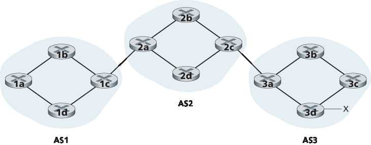
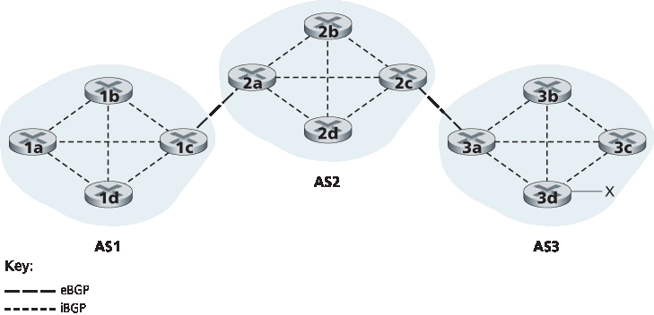
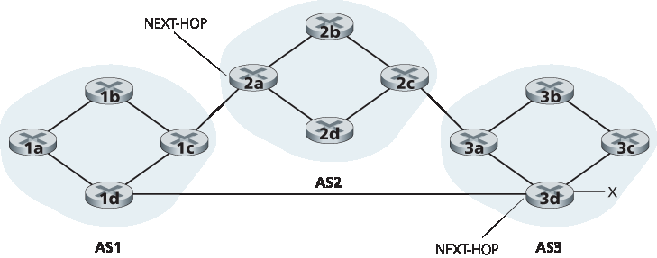
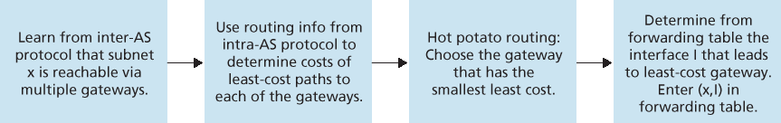
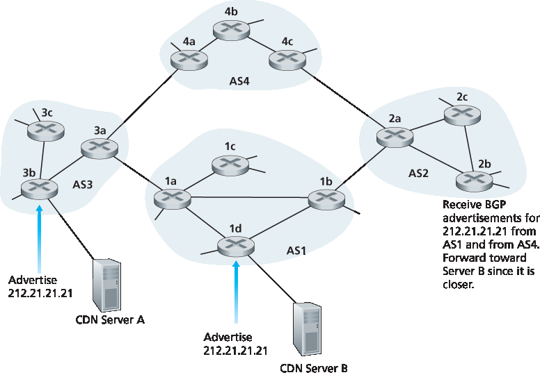
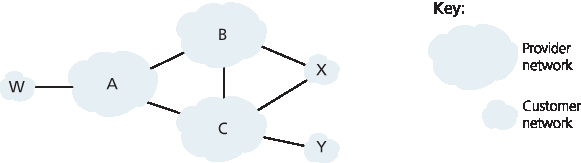

.. _c5.4:

5.4 ISP 之间的路由: BGP
===========================================================
5.4 Routing Among the ISPs: BGP

.. tab:: 中文

.. tab:: 英文

We just learned that OSPF is an example of an intra-AS routing protocol. When routing a packet between a source and destination within the same AS, the route the packet follows is entirely determined by the intra-AS routing protocol. However, to route a packet across multiple ASs, say from a smartphone in Timbuktu to a server in a datacenter in Silicon Valley, we need an **inter-autonomous system routing protocol**. Since an inter-AS routing protocol involves coordination among multiple ASs, communicating ASs must run the same inter-AS routing protocol. In fact, in the Internet, all ASs run the same inter-AS routing protocol, called the Border Gateway Protocol, more commonly known as BGP [:ref:`RFC 4271 <RFC 4271>`; :ref:`Stewart 1999 <Stewart 1999>`].

BGP is arguably the most important of all the Internet protocols (the only other contender would be the IP protocol that we studied in :ref:`Section 4.3 <c4.3>`), as it is the protocol that glues the thousands of ISPs in the Internet together. As we will soon see, BGP is a decentralized and asynchronous protocol in the vein of distance-vector routing described in :ref:`Section 5.2.2 <c5.2.2>`. Although BGP is a complex and challenging protocol, to understand the Internet on a deep level, we need to become familiar with its underpinnings and operation. The time we devote to learning BGP will be well worth the effort.

.. _c5.4.1:

5.4.1 BGP 的作用
----------------------------------------------------------------------------
5.4.1 The Role of BGP

.. tab:: 中文

.. tab:: 英文

To understand the responsibilities of BGP, consider an AS and an arbitrary router in that AS. Recall that every router has a forwarding table, which plays the central role in the process of forwarding arriving packets to outbound router links. As we have learned, for destinations that are within the same AS, the entries in the router’s forwarding table are determined by the AS’s intra-AS routing protocol. But what about destinations that are outside of the AS? This is precisely where BGP comes to the rescue.

In BGP, packets are not routed to a specific destination address, but instead to CIDRized prefixes, with each prefix representing a subnet or a collection of subnets. In the world of BGP, a destination may take the form 138.16.68/22, which for this example includes 1,024 IP addresses. Thus, a router’s forwarding
table will have entries of the form (x, I), where x is a prefix (such as 138.16.68/22) and I is an interface number for one of the router’s interfaces.

As an inter-AS routing protocol, BGP provides each router a means to:

1. **Obtain prefix reachability information from neighboring ASs**. In particular, BGP allows each subnet to advertise its existence to the rest of the Internet. A subnet screams, “I exist and I am here,” and BGP makes sure that all the routers in the Internet know about this subnet. If it weren’t for BGP, each subnet would be an isolated island—alone, unknown and unreachable by the rest of the Internet.
2. **Determine the “best” routes to the prefixes**. A router may learn about two or more different routes to a specific prefix. To determine the best route, the router will locally run a BGP route-selection procedure (using the prefix reachability information it obtained via neighboring routers). The best route will be determined based on policy as well as the reachability information.

Let us now delve into how BGP carries out these two tasks.

++++++++++++++++++++++++++++++++++++++++++++++++++++++++

.. _c5.4.2:

5.4.2 通告 BGP 路由信息
----------------------------------------------------------------------------
5.4.2 Advertising BGP Route Information

.. tab:: 中文

.. tab:: 英文

Consider the network shown in :ref:`Figure 5.8 <Figure 5.8>`. As we can see, this simple network has three autonomous systems: AS1, AS2, and AS3. As shown, AS3 includes a subnet with prefix x. For each AS, each router is either a **gateway router** or an **internal router**. A gateway router is a router on the edge of an AS that directly connects to one or more routers in other ASs. An **internal router** connects only to hosts and routers within its own AS. In AS1, for example, router 1c is a gateway router; routers 1a, 1b, and 1d are internal routers.

Let’s consider the task of advertising reachability information for prefix x to all of the routers shown in :ref:`Figure 5.8 <Figure 5.8>` . At a high level, this is straightforward. First, AS3 sends a BGP message to AS2, saying that x exists and is in AS3; let’s denote this message as “AS3 x”. Then AS2 sends a BGP message to AS1, saying that x exists and that you can get to x by first passing through AS2 and then going to AS3; let’s denote that message as “AS2 AS3 x”. In this manner, each of the autonomous systems will not only learn about the existence of x, but also learn about a path of autonomous systems that leads to x.

Although the discussion in the above paragraph about advertising BGP reachability information should get the general idea across, it is not precise in the sense that autonomous systems do not actually send messages to each other, but instead routers do. To understand this, let’s now re-examine the example
in :ref:`Figure 5.8 <Figure 5.8>`. In BGP, pairs of routers exchange routing information over semi-permanent TCP connections using port 179. Each such TCP connection, along with all the BGP messages sent over the connection, is called a **BGP connection**. Furthermore, a BGP connection that spans two ASs is called an **external BGP (eBGP)** connection, and a BGP session between routers in the same AS is called an **internal BGP (iBGP)**
connection. Examples of BGP connections for the network in :ref:`Figure 5.8 <Figure 5.8>` are shown in :ref:`Figure 5.9 <Figure 5.9>`. There is typically one eBGP connection for each link that directly connects gateway routers in different ASs;
thus, in :ref:`Figure 5.9 <Figure 5.9>` , there is an eBGP connection between gateway routers 1c and 2a and an eBGP connection between gateway routers 2c and 3a.

.. _Figure 5.8:

**Figure 5.8 Network with three autonomous systems. AS3 includes a subnet with prefix x**

There are also iBGP connections between routers within each of the ASs. In particular, :ref:`Figure 5.9 <Figure 5.9>` displays a common configuration of one BGP connection for each pair of routers internal to an AS, creating a mesh of TCP connections within each AS. In :ref:`Figure 5.9 <Figure 5.9>`, the eBGP connections are shown with the long dashes; the iBGP connections are shown with the short dashes. Note that iBGP connections do not always correspond to physical links.

In order to propagate the reachability information, both iBGP and eBGP sessions are used. Consider again advertising the reachability information for prefix x to all routers in AS1 and AS2. In this process, gateway router 3a first sends an eBGP message “AS3 x” to gateway router 2c. Gateway router 2c then sends the iBGP message “AS3 x” to all of the other routers in AS2, including to gateway router 2a. Gateway router 2a then sends the eBGP message “AS2 AS3 x” to gateway router 1c.

.. _Figure 5.9:

**Figure 5.9 eBGP and iBGP connections**

Finally, gateway router 1c uses iBGP to send the message “AS2 AS3 x” to all the routers in AS1. After this process is complete, each router in AS1 and AS2 is aware of the existence of x and is also aware of an AS path that leads to x.

Of course, in a real network, from a given router there may be many different paths to a given destination, each through a different sequence of ASs. For example, consider the network in :ref:`Figure 5.10 <Figure 5.10>`, which is the original network in :ref:`Figure 5.8 <Figure 5.8>`, with an additional physical link from router 1d to router 3d. In this case, there are two paths from AS1 to x: the path “AS2 AS3 x” via router 1c; and the new path
“AS3 x” via the router 1d.

.. _c5.4.3:

5.4.3 确定最佳路由
----------------------------------------------------------------------------
5.4.3 Determining the Best Routes

.. tab:: 中文

.. tab:: 英文

As we have just learned, there may be many paths from a given router to a destination subnet. In fact, in the Internet, routers often receive reachability information about dozens of different possible paths. How does a router choose among these paths (and then configure its forwarding table accordingly)?

Before addressing this critical question, we need to introduce a little more BGP terminology. When a router advertises a prefix across a BGP connection, it includes with the prefix several **BGP attributes**. In BGP jargon, a prefix along with its attributes is called a **route**. Two of the more important attributes are AS-PATH and NEXT-HOP. The AS-PATH attribute contains the list of ASs through which the advertisement has passed, as we’ve seen in our examples above. To generate the AS-PATH value, when a prefix is passed to an AS, the AS adds its ASN to the existing list in the AS-PATH. For example, in :ref:`Figure 5.10 <Figure 5.10>`, there are two routes from AS1 to subnet x: one which uses the AS-PATH “AS2 AS3”; and another that uses the AS-PATH “A3”. BGP routers also use the AS-PATH attribute to detect and prevent looping advertisements; specifically, if a router sees that its own AS is contained in the path list, it will reject the advertisement.

.. _Figure 5.10:

**Figure 5.10 Network augmented with peering link between AS1 and AS3**

Providing the critical link between the inter-AS and intra-AS routing protocols, the NEXT-HOP attribute has a subtle but important use. The NEXT-HOP is the IP address of the router interface that begins the AS-PATH. To gain insight into this attribute, let’s again refer to :ref:`Figure 5.10 <Figure 5.10>`. As indicated in :ref:`Figure 5.10 <Figure 5.10>`, the NEXT-HOP attribute for the route “AS2 AS3 x” from AS1 to x that passes through AS2 is the IP address of the left interface on router 2a. The NEXT-HOP attribute for the route “AS3 x” from AS1 to x that bypasses AS2 is the IP address of the leftmost interface of router 3d. In summary, in this toy example, each router in AS1 becomes aware of two BGP routes to prefix x:

    IP address of leftmost interface for router 2a; AS2 AS3; x

    IP address of leftmost interface of router 3d; AS3; x

Here, each BGP route is written as a list with three components: NEXT-HOP; AS-PATH; destination prefix. In practice, a BGP route includes additional attributes, which we will ignore for the time being. Note that the NEXT-HOP attribute is an IP address of a router that does not belong to AS1; however, the subnet that contains this IP address directly attaches to AS1.

Hot Potato Routing
~~~~~~~~~~~~~~~~~~~

We are now finally in position to talk about BGP routing algorithms in a precise manner. We will begin with one of the simplest routing algorithms, namely, **hot potato routing**.

Consider router 1b in the network in :ref:`Figure 5.10 <Figure 5.10>`. As just described, this router will learn about two possible BGP routes to prefix x. In hot potato routing, the route chosen (from among all possible routes)
is that route with the least cost to the NEXT-HOP router beginning that route. In this example, router 1b will consult its intra-AS routing information to find the least-cost intra-AS path to NEXT-HOP router 2a and the least-cost intra-AS path to NEXT-HOP router 3d, and then select the route with the smallest of these least-cost paths. For example, suppose that cost is defined as the number of links traversed. Then the least cost from router 1b to router 2a is 2, the least cost from router 1b to router 2d is 3, and router 2a would therefore be selected. Router 1b would then consult its forwarding table (configured by its
intra-AS algorithm) and find the interface I that is on the least-cost path to router 2a. It then adds (x, I) to its forwarding table.

The steps for adding an outside-AS prefix in a router’s forwarding table for hot potato routing are summarized in :ref:`Figure 5.11 <Figure 5.11>`. It is important to note that when adding an outside-AS prefix into a forwarding table, both the inter-AS routing protocol (BGP) and the intra-AS routing protocol (e.g., OSPF)
are used.

The idea behind hot-potato routing is for router 1b to get packets out of its AS as quickly as possible (more specifically, with the least cost possible) without worrying about the cost of the remaining portions of the path outside of its AS to the destination. In the name “hot potato routing,” a packet is analogous to a hot potato that is burning in your hands. Because it is burning hot, you want to pass it off to another person (another AS) as quickly as possible. Hot potato routing is thus a selfish ­algorithm—it tries to reduce the cost in its own AS while ignoring the other components of the end-to-end costs outside its AS. Note that with hot potato routing, two routers in the same AS may choose two different AS paths to the same prefix. For example, we just saw that router 1b would send packets through AS2 to reach x. However, router 1d would bypass AS2 and send packets directly to AS3 to reach x.

.. _Figure 5.11:

**Figure 5.11 Steps in adding outside-AS destination in a router’s ­forwarding table**

Route-Selection Algorithm
~~~~~~~~~~~~~~~~~~~~~~~~~~~

In practice, BGP uses an algorithm that is more complicated than hot potato routing, but nevertheless incorporates hot potato routing. For any given destination prefix, the input into BGP’s route-selection algorithm is the set of all routes to that prefix that have been learned and accepted by the router. If there is only one such route, then BGP obviously selects that route. If there are two or more routes to the same prefix, then BGP sequentially invokes the following elimination rules until one route remains:

1. A route is assigned a **local preference** value as one of its attributes (in addition to the AS-PATH and NEXT-HOP attributes). The local preference of a route could have been set by the router or could have been learned from another router in the same AS. The value of the local preference attribute is a policy decision that is left entirely up to the AS’s network administrator. (We will shortly discuss BGP policy issues in some detail.) The routes with the highest local preference values are selected.
2. From the remaining routes (all with the same highest local preference value), the route with the shortest AS-PATH is selected. If this rule were the only rule for route selection, then BGP would be using a DV algorithm for path determination, where the distance metric uses the number of AS hops rather than the number of router hops.
3. From the remaining routes (all with the same highest local preference value and the same AS- PATH length), hot potato routing is used, that is, the route with the closest NEXT-HOP router is selected.
4. If more than one route still remains, the router uses BGP identifiers to select the route; see :ref:`[Stewart 1999] <Stewart 1999>`.

As an example, let’s again consider router 1b in :ref:`Figure 5.10 <Figure 5.10>`. Recall that there are exactly two BGP
routes to prefix x, one that passes through AS2 and one that bypasses AS2. Also recall that if hot potato routing on its own were used, then BGP would route packets through AS2 to prefix x. But in the above route-selection algorithm, rule 2 is applied before rule 3, causing BGP to select the route that bypasses AS2, since that route has a shorter AS PATH. So we see that with the above route-selection algorithm, BGP is no longer a selfish algorithm—it first looks for routes with short AS paths (thereby likely reducing end-to-end delay).

As noted above, BGP is the de facto standard for inter-AS routing for the Internet. To see the contents of various BGP routing tables (large!) extracted from routers in tier-1 ISPs, see http://www.routeviews.org. BGP routing tables often contain over half a million routes (that is, prefixes and corresponding attributes). Statistics about the size and characteristics of BGP routing tables are presented in :ref:`[Potaroo 2016] <Potaroo 2016>`.

.. _c5.4.4:

5.4.4 IP 任播
----------------------------------------------------------------------------
5.4.4 IP-Anycast

.. tab:: 中文

.. tab:: 英文

In addition to being the Internet’s inter-AS routing protocol, BGP is often used to implement the IP-
anycast service [:ref:`RFC 1546 <RFC 1546>`, :ref:`RFC 7094 <RFC 7094>`], which is commonly used in DNS. To motivate IP-anycast, consider that in many applications, we are interested in (1) replicating the same content on different servers in many different dispersed geographical locations, and (2) having each user access the content from the server that is closest. For example, a CDN may replicate videos and other objects on servers in different countries. Similarly, the DNS system can replicate DNS records on DNS servers throughout the world. When a user wants to access this replicated content, it is desirable to point the user to the “nearest” server with the replicated content. BGP’s route-selection algorithm provides an easy and natural mechanism for doing so.

To make our discussion concrete, let’s describe how a CDN might use IP-­anycast. As shown in :ref:`Figure 5.12 <Figure 5.12>`, during the IP-anycast configuration stage, the CDN company assigns the same IP address to each of its servers, and uses standard BGP to advertise this IP address from each of the servers. When a BGP router receives multiple route advertisements for this IP address, it treats these advertisements as providing different paths to the same physical location (when, in fact, the advertisements are for different paths to different physical locations). When configuring its routing table, each router will locally use the BGP route-selection algorithm to pick the “best” (for example, closest, as determined by AS-hop counts) route to that IP address. For example, if one BGP route (corresponding to one location) is only one AS hop away from the router, and all other BGP routes (corresponding to other locations) are two or more AS hops away, then the BGP router would choose to route packets to the location that is one hop away. After this initial BGP address-advertisement phase, the CDN can do its main job of distributing content. When a client requests the video, the CDN returns to the client the common IP address used by the geographically dispersed servers, no matter where the client is located. When the client sends a request to that IP address, Internet routers then forward the request packet to the “closest” server, as defined by the BGP route-selection algorithm.

Although the above CDN example nicely illustrates how IP-anycast can be used, in practice CDNs generally choose not to use IP-anycast because BGP routing changes can result in different packets of the same TCP connection arriving at different instances of the Web server. But IP-anycast is extensively
used by the DNS system to direct DNS queries to the closest root DNS server. Recall from :ref:`Section 2.4 <c2.4>`, there are currently 13 IP addresses for root DNS servers. But corresponding to each of these addresses, there are multiple DNS root servers, with some of these addresses having over 100 DNS root servers scattered over all corners of the world. When a DNS query is sent to one of these 13 IP addresses, IP anycast is used to route the query to the nearest of the DNS root servers that is responsible for that address.

.. _Figure 5.12:

**Figure 5.12 Using IP-anycast to bring users to the closest CDN server**

.. _c5.4.5:

5.4.5 路由策略
----------------------------------------------------------------------------
5.4.5 Routing Policy

.. tab:: 中文

.. tab:: 英文

When a router selects a route to a destination, the AS routing policy can trump all other considerations, such as shortest AS path or hot potato routing. Indeed, in the route-selection algorithm, routes are first selected according to the local-preference attribute, whose value is fixed by the policy of the local AS.

Let’s illustrate some of the basic concepts of BGP routing policy with a simple example. :ref:`Figure 5.13 <Figure 5.13>` shows six interconnected autonomous systems: A, B, C, W, X, and Y. It is important to note that A, B, C, W, X, and Y are ASs, not routers. Let’s assume that autonomous systems W, X, and Y are access ISPs and that A, B, and C are backbone provider networks. We’ll also assume that A, B, and C, directly send traffic to each other, and provide full BGP information to their customer networks. All traffic entering an ISP access network must be destined for that network, and all traffic leaving an ISP access network must have originated in that network. W and Y are clearly access ISPs. X is a **multi-homed access ISP**, since it is connected to the rest of the network via two different providers (a scenario that is becoming increasingly common in practice). However, like W and Y, X itself must be the source/destination of all traffic leaving/entering X. But how will this stub network behavior be implemented and enforced? How will X be prevented from forwarding traffic between B and C? This can easily be accomplished by controlling the manner in which BGP routes are advertised. In particular X will function as an access ISP network if it advertises (to its neighbors B and C) that it has no paths to any other destinations except itself. That is, even though X may know of a path, say XCY, that reaches network Y, it will not advertise this path to B. Since B is unaware that X has a path to Y, B would never forward traffic destined to Y (or C) via X. This simple example illustrates how a selective route advertisement policy can be used to implement customer/provider routing relationships.

.. _Figure 5.13:

**Figure 5.13 A simple BGP policy scenario**

Let’s next focus on a provider network, say AS B. Suppose that B has learned (from A) that A has a path AW to W. B can thus install the route AW into its routing information base. Clearly, B also wants to advertise the path BAW to its customer, X, so that X knows that it can route to W via B. But should B advertise the path BAW to C? If it does so, then C could route traffic to W via BAW. If A, B, and C are all backbone providers, than B might rightly feel that it should not have to shoulder the burden (and cost!) of carrying transit traffic between A and C. B might rightly feel that it is A’s and C’s job (and cost!) to make sure that C can route to/from A’s customers via a direct connection between A and C. There are currently no official standards that govern how backbone ISPs route among themselves. However, a rule of thumb followed by commercial ISPs is that any traffic flowing across an ISP’s backbone network must have either a source or a destination (or both) in a network that is a customer of that ISP; otherwise the traffic would be getting a free ride on the ISP’s network. Individual peering agreements (that would govern questions such as those raised above) are typically negotiated between pairs of ISPs and are often confidential; :ref:`[Huston 1999a] <Huston 1999a>` provides an interesting discussion of peering agreements. For a detailed description of how routing policy reflects commercial relationships among ISPs, see [:ref:`Gao 2001 <Gao 2001>`; :ref:`Dmitiropoulos 2007 <Dmitiropoulos 2007>`]. For a discussion of BGP routing polices from an ISP standpoint, see :ref:`[Caesar 2005b] <Caesar 2005b>`.

.. admonition:: PRINCIPLES IN PRACTICE

    WHY ARE THERE DIFFERENT INTER-AS AND INTRA-AS ROUTING PROTOCOLS?

    Having now studied the details of specific inter-AS and intra-AS routing protocols deployed in today’s Internet, let’s conclude by considering perhaps the most fundamental question we could ask about these protocols in the first place (hopefully, you have been wondering this all along, and have not lost the forest for the trees!): Why are different inter-AS and intra-AS routing protocols used?

    The answer to this question gets at the heart of the differences between the goals of routing within an AS and among ASs:
    
    - **Policy**. Among ASs, policy issues dominate. It may well be important that traffic originating in a given AS not be able to pass through another specific AS. Similarly, a given AS may well want to control what transit traffic it carries between other ASs. We have seen that BGP carries path attributes and provides for controlled distribution of routing information so that such policy-based routing decisions can be made. Within an AS, everything is nominally under the same administrative control, and thus policy issues play a much less important role in choosing routes within the AS.
    - **Scale**. The ability of a routing algorithm and its data structures to scale to handle routing to/among large numbers of networks is a critical issue in inter-AS routing. Within an AS, scalability is less of a concern. For one thing, if a single ISP becomes too large, it is always possible to divide it into two ASs and perform inter-AS routing between the two new ASs. (Recall that OSPF allows such a hierarchy to be built by splitting an AS into areas.)
    - **Performance**. Because inter-AS routing is so policy oriented, the quality (for example, performance) of the routes used is often of secondary concern (that is, a longer or more costly route that satisfies certain policy criteria may well be taken over a route that is shorter but does not meet that criteria). Indeed, we saw that among ASs, there is not even the notion of cost (other than AS hop count) associated with routes. Within a single AS, however, such policy concerns are of less importance, allowing routing to focus more on the level of performance realized on a route.

This completes our brief introduction to BGP. Understanding BGP is important because it plays a central role in the Internet. We encourage you to see the references [:ref:`Griffin 2012 <Griffin 2012>`; :ref:`Stewart 1999 <Stewart 1999>`; :ref:`Labovitz 1997 <Labovitz 1997>`; :ref:`Halabi 2000 <Halabi 2000>`; :ref:`Huitema 1998 <Huitema 1998>`; :ref:`Gao 2001 <Gao 2001>`; :ref:`Feamster 2004 <Feamster 2004>`; :ref:`Caesar 2005b <Caesar 2005b>`; :ref:`Li 2007 <Li 2007>`] to learn more about BGP.

.. _c5.4.6:

5.4.6 拼凑起来：获得 Internet 状态
----------------------------------------------------------------------------
5.4.6 Putting the Pieces Together: Obtaining Internet Presence

.. tab:: 中文

.. tab:: 英文

Although this subsection is not about BGP per se, it brings together many of the protocols and concepts we’ve seen thus far, including IP addressing, DNS, and BGP.

Suppose you have just created a small company that has a number of servers, including a public Web server that describes your company’s products and services, a mail server from which your employees obtain their e-mail messages, and a DNS server. Naturally, you would like the entire world to be able to visit your Web site in order to learn about your exciting products and services. Moreover, you would like your employees to be able to send and receive e-mail to potential customers throughout the world.

To meet these goals, you first need to obtain Internet connectivity, which is done by contracting with, and connecting to, a local ISP. Your company will have a gateway router, which will be connected to a router in your local ISP. This connection might be a DSL connection through the existing telephone infrastructure, a leased line to the ISP’s router, or one of the many other access solutions described in :ref:`Chapter 1 <c1>`. Your local ISP will also provide you with an IP address range, e.g., a /24 address range consisting of 256 addresses. Once you have your physical connectivity and your IP address range, you will assign one of the IP addresses (in your address range) to your Web server, one to your mail server, one to your DNS server, one to your gateway router, and other IP addresses to other servers and networking devices in your company’s network.

In addition to contracting with an ISP, you will also need to contract with an Internet registrar to obtain a domain name for your company, as described in :ref:`Chapter 2 <c2>`. For example, if your company’s name is, say, Xanadu Inc., you will naturally try to obtain the domain name `xanadu.com <https://xanadu.com/>`_. Your company must also obtain presence in the DNS system. Specifically, because outsiders will want to contact your DNS server to obtain the IP addresses of your servers, you will also need to provide your registrar with the IP address of your DNS server. Your registrar will then put an entry for your DNS server (domain name and corresponding IP address) in the .com top-level-domain servers, as described in :ref:`Chapter 2 <c2>`. After this step is completed, any user who knows your domain name (e.g., `xanadu.com <https://xanadu.com/>`_ ) will be able to obtain the IP address of your DNS server via the DNS system.

So that people can discover the IP addresses of your Web server, in your DNS server you will need to include entries that map the host name of your Web server (e.g., `xanadu.com <https://www.xanadu.com>`_) to its IP address. You will want to have similar entries for other publicly available servers in your company, including your mail server. In this manner, if Alice wants to browse your Web server, the DNS system will contact your DNS server, find the IP address of your Web server, and give it to Alice. Alice can then establish a TCP connection directly with your Web server.

However, there still remains one other necessary and crucial step to allow outsiders from around the world to access your Web server. Consider what happens when Alice, who knows the IP address of your Web server, sends an IP datagram (e.g., a TCP SYN segment) to that IP address. This datagram will be routed through the Internet, visiting a series of routers in many different ASs, and eventually reach your Web server. When any one of the routers receives the datagram, it is going to look for an entry in its forwarding table to determine on which outgoing port it should forward the datagram. Therefore, each of the routers needs to know about the existence of your company’s /24 prefix (or some aggregate entry). How does a router become aware of your company’s prefix? As we have just seen, it becomes aware of it from BGP! Specifically, when your company contracts with a local ISP and gets assigned a prefix (i.e., an address range), your local ISP will use BGP to advertise your prefix to the ISPs to which it connects. Those ISPs will then, in turn, use BGP to propagate the advertisement. Eventually, all Internet routers will know about your prefix (or about some aggregate that includes your prefix) and thus be able to appropriately forward datagrams destined to your Web and mail servers.