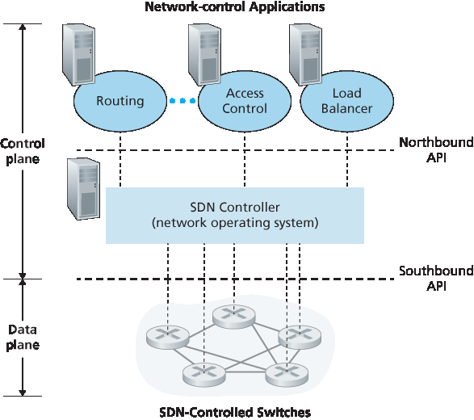
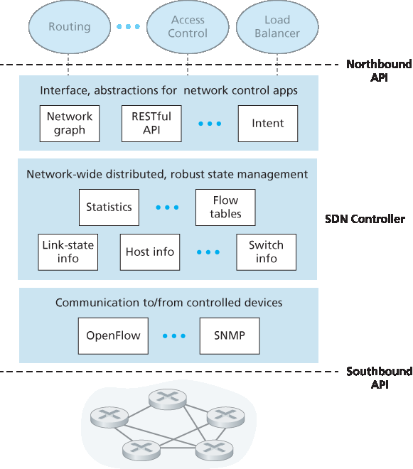
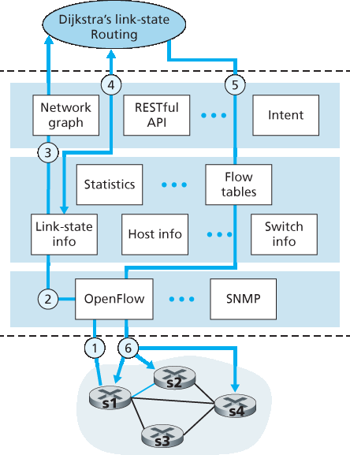

.. _c5.5:

5.5 SDN 控制平面
===========================================================
5.5 The SDN Control Plane

.. tab:: 中文

.. tab:: 英文

In this section, we’ll dive into the SDN control plane—the network-wide logic that controls packet forwarding among a network’s SDN-enabled devices, as well as the configuration and management of these devices and their services. Our study here builds on our earlier discussion of generalized SDN forwarding in :ref:`Section 4.4 <c4.4>`, so you might want to first review that section, as well as :ref:`Section 5.1 <c5.1>` of this chapter, before continuing on. As in :ref:`Section 4.4 <c4.4>`, we’ll again adopt the terminology used in the SDN literature and refer to the network’s forwarding devices as “packet switches” (or just switches, with “packet” being understood), since forwarding decisions can be made on the basis of network-layer source/destination addresses, link-layer source/destination addresses, as well as many other values in transport-, network-, and link-layer packet-header fields.

Four key characteristics of an SDN architecture can be identified :ref:`[Kreutz 2015] <Kreutz 2015>`:

- **Flow-based forwarding**. Packet forwarding by SDN-controlled switches can be based on any number of header field values in the transport-layer, network-layer, or link-layer header. We saw in :ref:`Section 4.4 <c4.4>` that the OpenFlow1.0 abstraction allows forwarding based on eleven different header field values. This contrasts sharply with the traditional approach to router-based forwarding that we studied in :ref:`Sections 5.2 <c5.2>`–:ref:`5.4 <c5.4>`, where forwarding of IP datagrams was based solely on a datagram’s destination IP address. Recall from :ref:`Figure 5.2 <Figure 5.2>` that packet forwarding rules are specified in a switch’s flow table; it is the job of the SDN control plane to compute, manage and install flow table entries in all of the network’s switches.
- **Separation of data plane and control plane**. This separation is shown clearly in :ref:`Figures 5.2 <Figures 5.2>` and :ref:`5.14 <Figure 5.14>`. The data plane consists of the network’s switches— relatively simple (but fast) devices that
execute the “match plus action” rules in their flow tables. The control plane consists of servers and software that determine and manage the switches’ flow tables.
- **Network control functions: external to data-plane switches**. Given that the “S” in SDN is for “software,” it’s perhaps not surprising that the SDN control plane is implemented in software. Unlike
traditional routers, however, this software executes on servers that are both distinct and remote from the network’s switches. As shown in :ref:`Figure 5.14 <Figure 5.14>`, the control plane itself consists of two components
—an SDN controller (or network operating system :ref:`[Gude 2008] <Gude 2008>`) and a set of network-control applications. The controller maintains accurate network state information (e.g., the state of remote
links, switches, and hosts); provides this information to the network-control applications running in the control plane; and provides the means through which these applications can monitor, program,
and control the underlying network devices. Although the controller in :ref:`Figure 5.14 <Figure 5.14>` is shown as a single central server, in practice the controller is only logically centralized; it is typically implemented
on several servers that provide coordinated, scalable performance and high availability.
- **A programmable network**. The network is programmable through the network-control applications running in the control plane. These applications represent the “brains” of the SDN control plane, using the APIs provided by the SDN controller to specify and control the data plane in the network devices. For example, a routing network-control application might determine the end-end paths between sources and destinations (e.g., by executing Dijkstra’s algorithm using the node-state and link-state information maintained by the SDN controller). Another network application might perform access control, i.e., determine which packets are to be blocked at a switch, as in our third example in :ref:`Section 4.4.3 <c4.4.3>`. Yet another application might forward packets in a manner that performs server load balancing (the second example we considered in :ref:`Section 4.4.3 <c4.4.3>`).

From this discussion, we can see that SDN represents a significant “unbundling” of network functionality —data plane switches, SDN controllers, and network-control applications are separate entities that may each be provided by different vendors and organizations. This contrasts with the pre-SDN model in which a switch/router (together with its embedded control plane software and protocol implementations) was monolithic, vertically integrated, and sold by a single vendor. This unbundling of network functionality in SDN has been likened to the earlier evolution from mainframe computers (where hardware, system software, and applications were provided by a single vendor) to personal computers (with their separate hardware, operating systems, and applications). The unbundling of computing hardware, system software, and applications has arguably led to a rich, open ecosystem driven by innovation in all three of these areas; one hope for SDN is that it too will lead to a such rich innovation.

Given our understanding of the SDN architecture of :ref:`Figure 5.14 <Figure 5.14>`, many questions naturally arise. How and where are the flow tables actually computed? How are these tables updated in response to events at SDN-controlled devices (e.g., an attached link going up/down)? And how are the flow table entries at multiple switches coordinated in such a way as to result in orchestrated and consistent network-wide functionality (e.g., end-to-end paths for forwarding packets from sources to destinations, or coordinated distributed firewalls)? It is the role of the SDN control plane to provide these, and many other, capabilities.

.. _Figure 5.14:

**Figure 5.14 Components of the SDN architecture: SDN-controlled switches, the SDN controller, network-control applications**

.. _c5.5.1:

5.5.1 SDN 控制平面: SDN 控制器和 SDN 控制应用程序
----------------------------------------------------------------------------
5.5.1 The SDN Control Plane: SDN Controller and SDN Control Applications

.. tab:: 中文

.. tab:: 英文

Let’s begin our discussion of the SDN control plane in the abstract, by considering the generic capabilities that the control plane must provide. As we’ll see, this abstract, “first principles” approach will lead us to an overall architecture that reflects how SDN control planes have been implemented in practice.

As noted above, the SDN control plane divides broadly into two components—the SDN controller and the SDN network-control applications. Let’s explore the controller first. Many SDN controllers have been developed since the earliest SDN controller :ref:`[Gude 2008] <Gude 2008>`; see :ref:`[Kreutz 2015] <Kreutz 2015>` for an extremely thorough and up-to-date survey. :ref:`Figure 5.15 <Figure 5.15>` provides a more detailed view of a generic SDN controller. A controller’s functionality can be broadly organized into three layers. Let’s consider these layers in an uncharacteristically bottom-up fashion:

- **A communication layer: communicating between the SDN controller and controlled network devices.** Clearly, if an SDN controller is going to control the operation of a remote SDN-enabled switch, host, or other device, a protocol is needed to transfer information between the controller and that device. In addition, a device must be able to communicate locally-observed events to the controller (e.g., a message indicating that an attached link has gone up or down, that a device has just joined the network, or a heartbeat indicating that a device is up and operational). These events provide the SDN controller with an up-to-date view of the network’s state. This protocol constitutes the lowest layer of the controller architecture, as shown in :ref:`Figure 5.15 <Figure 5.15>`. The communication between the controller and the controlled devices cross what has come to be known as the controller’s “southbound” interface. In :ref:`Section 5.5.2 <c5.5.2>` , we’ll study OpenFlow—a specific protocol that provides this communication functionality. OpenFlow is implemented in most, if not all, SDN controllers.
- **A network-wide state-management layer**. The ultimate control decisions made by the SDN control plane—e.g., configuring flow tables in all switches to achieve the desired end-end forwarding, to implement load balancing, or to implement a particular firewalling capability—will require that the controller have up-to-date information about state of the networks’ hosts, links, switches, and other SDN-controlled devices. A switch’s flow table contains counters whose values might also be profitably used by network-control applications; these values should thus be available to the applications. Since the ultimate aim of the control plane is to determine flow tables for the various controlled devices, a controller might also maintain a copy of these tables. These pieces of information all constitute examples of the network-wide “state” maintained by the SDN controller.
- **The interface to the network-control application layer**. The controller interacts with network- control applications through its “northbound” interface. This API allows network-control applications to read/write network state and flow tables within the state- management layer. Applications can register to be notified when state-change events occur, so that they can take actions in response to network event notifications sent from SDN-controlled devices. Different types of APIs may be provided; we’ll see that two popular SDN controllers communicate
with their applications using a REST :ref:`[Fielding 2000] <Fielding 2000>` request-response interface.

.. _Figure 5.15:

**Figure 5.15 Components of an SDN controller**

We have noted several times that an SDN controller can be considered to be ­“logically centralized,” i.e., that the controller may be viewed externally (e.g., from the point of view of SDN-controlled devices and external network-control applications) as a single, monolithic service. However, these services and the databases used to hold state information are implemented in practice by a distributed set of servers for fault tolerance, high availability, or for performance reasons. With controller functions being implemented by a set of servers, the semantics of the controller’s internal operations (e.g., maintaining logical time ordering of events, consistency, consensus, and more) must be considered :ref:`[Panda 2013] <Panda 2013>`.

Such concerns are common across many different distributed systems; see [:ref:`Lamport 1989 <Lamport 1989>`, :ref:`Lampson 1996 <Lampson 1996>`] for elegant solutions to these challenges. Modern controllers such as OpenDaylight :ref:`[OpenDaylight Lithium 2016] <OpenDaylight Lithium 2016>` and ONOS :ref:`[ONOS 2016] <ONOS 2016>` (see sidebar) have placed considerable emphasis on architecting a logically centralized but physically distributed controller platform that provides scalable services and high availability to the controlled devices and network-control applications alike.

The architecture depicted in :ref:`Figure 5.15 <Figure 5.15>` closely resembles the architecture of the originally proposed NOX controller in 2008 :ref:`[Gude 2008] <Gude 2008>`, as well as that of today’s OpenDaylight :ref:`[OpenDaylight Lithium 2016] <OpenDaylight Lithium 2016>` and ONOS :ref:`[ONOS 2016] <ONOS 2016>` SDN controllers (see sidebar). We’ll cover an example of controller operation in :ref:`Section 5.5.3 <c5.5.3>` . First, however, let’s examine the OpenFlow protocol, which lies in the controller’s communication layer.

.. _c5.5.2:

5.5.2 OpenFlow 协议
----------------------------------------------------------------------------
5.5.2 OpenFlow Protocol

.. tab:: 中文

.. tab:: 英文

The OpenFlow protocol [:ref:`OpenFlow 2009 <OpenFlow 2009>`, :ref:`ONF 2016 <ONF 2016>`] operates between an SDN controller and an SDN-controlled switch or other device implementing the OpenFlow API that we studied earlier in :ref:`Section 4.4 <c4.4>`. The OpenFlow protocol operates over TCP, with a default port number of 6653. 

Among the important messages flowing from the controller to the controlled switch are the following:

- **Configuration.** This message allows the controller to query and set a switch’s configuration parameters.
- **Modify-State**. This message is used by a controller to add/delete or modify entries in the switch’s flow table, and to set switch port properties.
- **Read-State**. This message is used by a controller to collect statistics and counter values from the switch’s flow table and ports.
- **Send-Packet**. This message is used by the controller to send a specific packet out of a specified port at the controlled switch. The message itself contains the packet to be sent in its payload.

Among the messages flowing from the SDN-controlled switch to the controller are the following:

- Flow-Removed. This message informs the controller that a flow table entry has been removed, for example by a timeout or as the result of a received *modify-state* message.
- Port-status. This message is used by a switch to inform the controller of a change in port status.
- Packet-in. Recall from :ref:`Section 4.4 <c4.4>` that a packet arriving at a switch port and not matching any flow table entry is sent to the controller for additional processing. Matched packets may also be sent to the controller, as an action to be taken on a match. The packet-in message is used to send such packets to the controller.

Additional OpenFlow messages are defined in [:ref:`OpenFlow 2009 <OpenFlow 2009>`, :ref:`ONF 2016 <ONF 2016>`].

.. admonition:: Principles in Practice

   **Google’s Software-Defined Global Network**

   Recall from the case study in :ref:`Section 2.6 <c2.6>` that Google deploys a dedicated wide-area network (WAN) that interconnects its data centers and server clusters (in IXPs and ISPs). This network, called B4, has a Google-designed SDN control plane built on OpenFlow. Google’s network is able to drive WAN links at near 70% utilization over the long run (a two to three fold increase over typical link utilizations) and split application flows among multiple paths based on application priority and existing flow demands :ref:`[Jain 2013] <Jain 2013>`.

   The Google B4 network is particularly it well-suited for SDN: (i) Google controls all devices from the edge servers in IXPs and ISPs to routers in their network core; (ii) the most bandwidth- intensive applications are large-scale data copies between sites that can defer to higher-priority interactive applications during times of resource congestion; (iii) with only a few dozen data centers being connected, centralized control is feasible.

   Google’s B4 network uses custom-built switches, each implementing a slightly extended version of OpenFlow, with a local Open Flow Agent (OFA) that is similar in spirit to the control agent we encountered in :ref:`Figure 5.2 <Figure 5.2>`. Each OFA in turn connects to an Open Flow Controller (OFC) in the network control server (NCS), using a separate “out of band” network, distinct from the network that carries data-center traffic between data centers. The OFC thus provides the services used by the NCS to communicate with its controlled switches, similar in spirit to the lowest layer in the SDN architecture shown in :ref:`Figure 5.15 <Figure 5.15>`. In B4, the OFC also performs state management functions, keeping node and link status in a Network Information Base (NIB). Google’s implementation of the OFC is based on the ONIX SDN controller :ref:`[Koponen 2010] <Koponen 2010>`. Two routing protocols, BGP (for routing between the data centers) and IS-IS (a close relative of OSPF, for routing within a data center), are implemented. Paxos :ref:`[Chandra 2007] <Chandra 2007>` is used to execute hot replicas of NCS components to protect against failure.

   A traffic engineering network-control application, sitting logically above the set of network control servers, interacts with these servers to provide global, network-wide bandwidth provisioning for groups of application flows. With B4, SDN made an important leap forward into the operational networks of a global network provider. See :ref:`[Jain 2013] <Jain 2013>` for a detailed description of B4.
   

.. _c5.5.3:

5.5.3 数据和控制平面交互：示例
----------------------------------------------------------------------------
5.5.3 Data and Control Plane Interaction: An Example

.. tab:: 中文

.. tab:: 英文

In order to solidify our understanding of the interaction between SDN-controlled switches and the SDN controller, let’s consider the example shown in :ref:`Figure 5.16 <Figure 5.16>`, in which Dijkstra’s algorithm (which we studied in :ref:`Section 5.2 <c5.2>`) is used to determine shortest path routes. The SDN scenario in :ref:`Figure 5.16 <Figure 5.16>` has two important differences from the earlier per-router-control scenario of :ref:`Sections 5.2.1 <c5.2.1>` and :ref:`5.3 <c5.3>`, where Dijkstra’s algorithm was implemented in each and every router and link-state updates were flooded among all network routers:

- Dijkstra’s algorithm is executed as a separate application, outside of the packet switches. 
- Packet switches send link updates to the SDN controller and not to each other.

In this example, let’s assume that the link between switch s1 and s2 goes down; that shortest path routing is implemented, and consequently and that incoming and outgoing flow forwarding rules at s1, s3, and s4 are affected, but that s2’s operation is unchanged. Let’s also assume that OpenFlow is used as the communication layer protocol, and that the control plane performs no other function other than link-state routing.

.. _Figure 5.16:

**Figure 5.16 SDN controller scenario: Link-state change**

1. Switch s1, experiencing a link failure between itself and s2, notifies the SDN controller of the link-state change using the OpenFlow port-status message.
2. The SDN controller receives the OpenFlow message indicating the link-state change, and notifies the link-state manager, which updates a link-state ­database.
3. The network-control application that implements Dijkstra’s link-state routing has previously registered to be notified when link state changes. That application receives the notification of the link-state change.
4. The link-state routing application interacts with the link-state manager to get updated link state; it might also consult other components in the state-­management layer. It then computes the new least-cost paths.
5. The link-state routing application then interacts with the flow table manager, which determines the flow tables to be updated.
6. The flow table manager then uses the OpenFlow protocol to update flow table entries at affected switches—s1 (which will now route packets destined to s2 via s4), s2 (which will now begin receiving packets from s1 via intermediate switch s4), and s4 (which must now forward packets from s1 destined to s2).

This example is simple but illustrates how the SDN control plane provides control-plane services (in this case network-layer routing) that had been previously implemented with per-router control exercised in each and every network router. One can now easily appreciate how an SDN-enabled ISP could easily switch from least-cost path routing to a more hand-tailored approach to routing. Indeed, since the controller can tailor the flow tables as it pleases, it can implement any form of forwarding that it pleases —simply by changing its application-control software. This ease of change should be contrasted to the case of a traditional per-router control plane, where software in all routers (which might be provided to the ISP by multiple independent vendors) must be changed.

.. _c5.5.4:

5.5.4 SDN: 过去与未来
----------------------------------------------------------------------------
5.5.4 SDN: Past and Future

.. tab:: 中文

.. tab:: 英文

Although the intense interest in SDN is a relatively recent phenomenon, the technical roots of SDN, and the separation of the data and control planes in particular, go back considerably further. In 2004, [:ref:`Feamster 2004 <Feamster 2004>`, :ref:`Lakshman 2004 <Lakshman 2004>`, :ref:`RFC 3746 <RFC 3746>`] all argued for the separation of the network’s data and control planes. :ref:`[van der Merwe 1998] <van der Merwe 1998>` describes a control framework for ATM networks :ref:`[Black 1995] <Black 1995>` with multiple controllers, each controlling a number of ATM switches. The Ethane project :ref:`[Casado 2007] <Casado 2007>` pioneered the notion of a network of simple flow-based Ethernet switches with match-plus-action flow tables, a centralized controller that managed flow admission and routing, and the forwarding of unmatched packets from the switch to the controller. A network of more than 300 Ethane switches was operational in 2007. Ethane quickly evolved into the OpenFlow project, and the rest (as the saying goes) is history!

Numerous research efforts are aimed at developing future SDN architectures and capabilities. As we have seen, the SDN revolution is leading to the disruptive replacement of dedicated monolithic switches and routers (with both data and control planes) by simple commodity switching hardware and a sophisticated software control plane. A generalization of SDN known as network functions virtualization (NFV) similarly aims at disruptive replacement of sophisticated middleboxes (such as middleboxes with dedicated hardware and proprietary software for media caching/service) with simple commodity servers, switching, and storage :ref:`[Gember-Jacobson 2014] <Gember-Jacobson 2014>`. A second area of important research seeks to extend SDN concepts from the intra-AS setting to the inter-AS setting :ref:`[Gupta 2014] <Gupta 2014>`.

.. admonition:: PRINCIPLES IN PRACTICE

   **SDN Controller Case Studies: The OpenDaylight and ONOS Controllers**
      In the earliest days of SDN, there was a single SDN protocol (OpenFlow [:ref:`McKeown 2008 <McKeown 2008>`; :ref:`OpenFlow 2009 <OpenFlow 2009>`]) and a single SDN controller (NOX :ref:`Gude 2008 <Gude 2008>`). Since then, the number of SDN controllers in particular has grown significantly :ref:`[Kreutz 2015] <Kreutz 2015>`. Some SDN controllers are company-specific and proprietary, e.g., ONIX :ref:`[Koponen 2010] <Koponen 2010>`, Juniper Networks Contrail :ref:`[Juniper Contrail 2016] <Juniper Contrail 2016>`, and Google’s controller :ref:`[Jain 2013] <Jain 2013>` for its B4 wide-area network. But many more controllers are open-source and implemented in a variety of programming languages :ref:`[Erickson 2013] <Erickson 2013>`. Most recently, the OpenDaylight controller :ref:`[OpenDaylight Lithium 2016] <OpenDaylight Lithium 2016>` and the ONOS controller :ref:`[ONOS 2016] <ONOS 2016>` have found considerable industry support. They are both open-source and are being developed in partnership with the Linux Foundation.

   **The OpenDaylight Controller**
      :ref:`Figure 5.17 <Figure 5.17>` presents a simplified view of the OpenDaylight Lithium SDN controller platform :ref:`[OpenDaylight Lithium 2016] <OpenDaylight Lithium 2016>`. ODL’s main set of controller components correspond closely to those we developed in :ref:`Figure 5.15 <Figure 5.15>`.

      Network-Service Applications are the applications that determine how data-plane forwarding and other services, such as firewalling and load balancing, are accomplished in the controlled switches. Unlike the canonical controller in :ref:`Figure 5.15 <Figure 5.15>`, the ODL controller has two interfaces through which applications may communicate with native controller services and each other: external applications communicate with controller modules using a REST request-response API running over HTTP. Internal applications communicate with each other via the Service Abstraction Layer (SAL). The choice as to whether a controller application is implemented externally or internally is up to the application designer; the particular configuration of applications shown in :ref:`Figure 5.17 <Figure 5.17>` is only meant as an ­example.
   
      .. figure:: ../img/469-0.png 
         :align: center 

      .. _Figure 5.17:

      **Figure 5.17 The OpenDaylight controller**

      ODL’s *Basic Network-Service Functions* are at the heart of the controller, and they correspond closely to the network-wide state management capabilities that we encountered in :ref:`Figure 5.15 <Figure 5.15>`. The SAL is the controller’s nerve center, allowing controller ­components and applications to invoke each other’s services and to subscribe to events they generate. It also provides a uniform abstract interface to the specific *underlying communications protocols* in the communication layer, including OpenFlow and SNMP (the Simple Network Management Protocol—a network management protocol that we will cover in :ref:`Section 5.7 <c5.7>`). OVSDB is a protocol used to manage data center switching, an important application area for SDN technology. We’ll introduce data center networking in :ref:`Chapter 6 <c6>`.

      .. figure:: ../img/470-0.png 
         :align: center 

      .. _Figure 5.18:

      **Figure 5.18 ONOS controller architecture**

   **The ONOS Controller**
      :ref:`Figure 5.18 <Figure 5.18>` presents a simplified view of the ONOS controller :ref:`[ONOS 2016] <ONOS 2016>`. Similar to the canonical controller in :ref:`Figure 5.15 <Figure 5.15>`, three layers can be identified in the ONOS ­controller:

      - **Northbound abstractions and protocols**. A unique feature of ONOS is its intent framework, which allows an application to request a high-level service (e.g., to setup a connection between host A and Host B, or conversely to not allow Host A and host B to communicate) without having to know the details of how this service is performed. State information is provided to network-control applications across the northbound API either synchronously (via query) or asynchronously (via listener callbacks, e.g., when network state changes).
      - **Distributed core**. The state of the network’s links, hosts, and devices is maintained in ONOS’s distributed core. ONOS is deployed as a service on a set of interconnected servers, with each server running an identical copy of the ONOS software; an increased number of servers offers an increased service capacity. The ONOS core provides the mechanisms for service replication and coordination among instances, providing the applications above and the network devices below with the abstraction of logically centralized core services.
      - **Southbound abstractions and protocols**. The southbound abstractions mask the heterogeneity of the underlying hosts, links, switches, and protocols, allowing the distributed core to be both device and protocol agnostic. Because of this abstraction, the southbound interface below the distributed core is logically higher than in our canonical controller in :ref:`Figure 5.14 <Figure 5.14>` or the ODL controller in :ref:`Figure 5.17 <Figure 5.17>`.