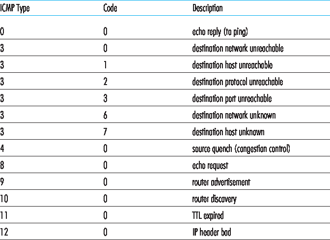

.. _c5.6:

5.6 ICMP：因特网控制报文协议
===========================================================
5.6 ICMP: The Internet Control Message Protocol

因特网控制报文协议（ICMP），在 [:rfc:`792`] 中定义，由主机和路由器用于相互传递网络层信息。ICMP 最典型的用途是错误报告。例如，在运行 HTTP 会话时，你可能遇到过“目标网络不可达”这样的错误信息。这个信息的来源就是 ICMP。某个时刻，某个 IP 路由器无法找到到你在 HTTP 请求中指定主机的路径。该路由器创建并发送了一个 ICMP 报文到你的主机，指示该错误。

ICMP 通常被认为是 IP 的一部分，但从体系结构上来说它位于 IP 之上，因为 ICMP 报文是被封装在 IP 数据报中的。也就是说，ICMP 报文作为 IP 负载被传输，就像 TCP 或 UDP 段作为 IP 负载被传输一样。同样，当主机接收到一个以 ICMP 为上层协议（上层协议号为 1）的 IP 数据报时，它会将该数据报内容解复用至 ICMP，就像将数据报解复用至 TCP 或 UDP 一样。

ICMP 报文包含类型字段和代码字段，并包含引起该 ICMP 报文生成的 IP 数据报的首部和前 8 个字节（以便发送方能确定引发错误的数据报）。部分 ICMP 报文类型如 :ref:`图 5.19 <Figure 5.19>` 所示。注意 ICMP 报文不仅用于错误条件的通知。

众所周知的 ping 程序会向指定主机发送一个 ICMP 类型 8 代码 0 的报文。目的主机在看到该回显请求后，会返回一个类型 0 代码 0 的 ICMP 回显应答报文。大多数 TCP/IP 实现直接在操作系统中支持 ping 服务器；也就是说，服务器并不是一个进程。:ref:`[Stevens 1990] <Stevens 1990>` 第 11 章提供了 ping 客户端程序的源代码。注意，客户端程序需要能够指示操作系统生成类型 8 代码 0 的 ICMP 报文。

另一个有趣的 ICMP 报文是源端抑制（source quench）报文。该报文在实际中很少使用。它的最初目的是执行拥塞控制 —— 允许拥塞路由器向主机发送 ICMP 源端抑制报文，以迫使该主机降低其传输速率。如我们在 :ref:`第 3 章 <c3>` 中所见，TCP 在传输层自身实现了拥塞控制机制，而无需使用如 ICMP 源端抑制报文等网络层反馈。

.. _Figure 5.19:

**图 5.19 ICMP 报文类型**

在 :ref:`第 1 章 <c1>` 中我们介绍了 Traceroute 程序，它可以让我们从一个主机追踪到世界上任意另一个主机的路径。有趣的是，Traceroute 是通过 ICMP 报文实现的。为了确定源和目的地之间路由器的名称和地址，源端的 Traceroute 程序向目的主机发送一系列普通 IP 数据报。这些数据报都携带一个 UDP 段，该段使用一个不太可能存在的 UDP 端口号。第一个数据报的 TTL 为 1，第二个为 2，第三个为 3，依此类推。源端还会为每个数据报启动一个定时器。当第 n 个数据报到达第 n 个路由器时，该路由器发现该数据报的 TTL 已到期。根据 IP 协议规则，该路由器丢弃数据报，并向源端发送一个 ICMP 警告报文（类型 11 代码 0）。该警告报文包含该路由器的名称和 IP 地址。当该 ICMP 报文返回源端时，源端可从定时器获得往返时间，并从该 ICMP 报文中获得第 n 个路由器的名称和 IP 地址。

Traceroute 的源端如何知道何时停止发送 UDP 段？请回忆，源端会为每个数据报增加 TTL 字段。因此，最终会有一个数据报到达目的主机。由于该数据报携带一个不太可能存在的 UDP 端口号，目的主机会向源端发送一个端口不可达的 ICMP 报文（类型 3 代码 3）。当源主机收到这个特定的 ICMP 报文时，它就知道不再需要发送更多的探测报文了。（标准 Traceroute 程序实际上对每个 TTL 值发送三组报文，因此 Traceroute 输出中每个 TTL 都会有三个结果。）

通过这种方式，源主机可以得知它与目的主机之间的路由器数量及其身份，以及它们之间的往返时间。请注意，Traceroute 客户端程序必须能够指示操作系统生成带有特定 TTL 值的 UDP 数据报，并且必须能够在 ICMP 报文到达时接收操作系统的通知。现在你已经理解了 Traceroute 的工作原理，也许你想回去多玩一玩这个工具。

为 IPv6 定义了新的 ICMP 版本，见 :rfc:`4443` 。除了重新组织现有的 ICMP 类型和代码定义外，ICMPv6 还添加了新类型和代码，以支持 IPv6 新增的功能。这些包括“数据包过大”类型和“无法识别的 IPv6 选项”错误代码。

.. toggle::

    The Internet Control Message Protocol (ICMP), specified in [:rfc:`792`], is used by hosts and routers to communicate network-layer information to each other. The most typical use of ICMP is for error reporting. For example, when running an HTTP session, you may have encountered an error message such as “Destination network unreachable.” This message had its origins in ICMP. At some point, an IP router was unable to find a path to the host specified in your HTTP request. That router created and sent an ICMP message to your host indicating the error.

    ICMP is often considered part of IP, but architecturally it lies just above IP, as ICMP messages are carried inside IP datagrams. That is, ICMP messages are carried as IP payload, just as TCP or UDP segments are carried as IP payload. Similarly, when a host receives an IP datagram with ICMP specified as the upper-layer protocol (an upper-layer protocol number of 1), it demultiplexes the datagram’s contents to ICMP, just as it would demultiplex a datagram’s content to TCP or UDP.

    ICMP messages have a type and a code field, and contain the header and the first 8 bytes of the IP datagram that caused the ICMP message to be generated in the first place (so that the sender can determine the datagram that caused the error). Selected ICMP message types are shown in :ref:`Figure 5.19 <Figure 5.19>`. Note that ICMP messages are used not only for signaling error conditions.

    The well-known ping program sends an ICMP type 8 code 0 message to the specified host. The destination host, seeing the echo request, sends back a type 0 code 0 ICMP echo reply. Most TCP/IP implementations support the ping server directly in the operating system; that is, the server is not a process. Chapter 11 of :ref:`[Stevens 1990] <Stevens 1990>` provides the source code for the ping client program. Note that the client program needs to be able to instruct the operating system to generate an ICMP message of type 8 code 0.

    Another interesting ICMP message is the source quench message. This message is seldom used in practice. Its original purpose was to perform congestion control—to allow a congested router to send an ICMP source quench message to a host to force that host to reduce its transmission rate. We have seen in :ref:`Chapter 3 <c3>` that TCP has its own congestion- control mechanism that operates at the transport layer, without the use of network-layer feedback such as the ICMP source quench message.
    
    .. figure:: ../img/473-0.png 
       :align: center 

    **Figure 5.19 ICMP message types**

    In :ref:`Chapter 1 <c1>` we introduced the Traceroute program, which allows us to trace a route from a host to any other host in the world. Interestingly, Traceroute is implemented with ICMP messages. To determine the names and addresses of the routers between source and destination, Traceroute in the source sends a series of ordinary IP datagrams to the destination. Each of these datagrams carries a UDP segment with an unlikely UDP port number. The first of these datagrams has a TTL of 1, the second of 2, the third of 3, and so on. The source also starts timers for each of the datagrams. When the nth datagram arrives at the nth router, the nth router observes that the TTL of the datagram has just expired. According to the rules of the IP protocol, the router discards the datagram and sends an ICMP warning message to the source (type 11 code 0). This warning message includes the name of the router and its IP address. When this ICMP message arrives back at the source, the source obtains the round-trip time from the
    timer and the name and IP address of the nth router from the ICMP message.

    How does a Traceroute source know when to stop sending UDP segments? Recall that the source increments the TTL field for each datagram it sends. Thus, one of the datagrams will eventually make it all the way to the destination host. Because this datagram contains a UDP segment with an unlikely port number, the destination host sends a port unreachable ICMP message (type 3 code 3) back to the source. When the source host receives this particular ICMP message, it knows it does not need to send additional probe packets. (The standard Traceroute program actually sends sets of three packets with the same TTL; thus the Traceroute output provides three results for each TTL.)

    In this manner, the source host learns the number and the identities of routers that lie between it and the destination host and the round-trip time between the two hosts. Note that the Traceroute client program must be able to instruct the operating system to generate UDP datagrams with specific TTL values and must also be able to be notified by its operating system when ICMP messages arrive. Now that you understand how Traceroute works, you may want to go back and play with it some more.

    A new version of ICMP has been defined for IPv6 in :rfc:`4443`. In addition to reorganizing the existing ICMP type and code definitions, ICMPv6 also added new types and codes required by the new IPv6 functionality. These include the “Packet Too Big” type and an “unrecognized IPv6 options” error code.
