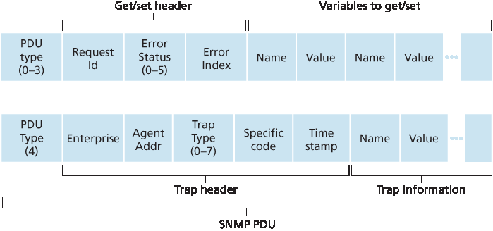

.. _c5.7:

5.7 网络管理与 SNMP
===========================================================
5.7 Network Management and SNMP

现在我们已经完成了对网络层的学习，只剩下链路层的内容了，我们很清楚，一个网络由许多复杂且相互作用的硬件和软件组件构成 —— 从构成网络物理组件的链路、交换机、路由器、主机和其他设备，到控制和协调这些设备的多种协议。当一个组织将成百上千个这样的组件组合在一起构建一个网络时，网络管理员要保持网络“正常运行”无疑是一项挑战。我们在 :ref:`第 5.5 节 <c5.5>` 中看到，逻辑集中式控制器在 SDN 场景中可以帮助实现这一目标。但网络管理的挑战早在 SDN 出现之前就已存在，期间发展出了一整套丰富的网络管理工具和方法，帮助网络管理员监控、管理和控制网络。我们将在本节中学习这些工具和技术。

人们常问的一个问题是：“什么是网络管理？”一个构思良好但句子较长的网络管理定义来自 :ref:`[Saydam 1996] <Saydam 1996>`：

    网络管理包括硬件、软件和人力要素的部署、集成与协调，以监控、测试、轮询、配置、分析、评估和控制网络及其元素资源，从而以合理成本满足实时、操作性能和服务质量（QoS）要求。

考虑到这个广义的定义，我们在本节中仅介绍网络管理的基本知识 —— 网络管理员执行其任务所使用的架构、协议和信息库。我们不涉及管理员的决策过程，例如故障识别 [:ref:`Labovitz 1997 <Labovitz 1997>`; :ref:`Steinder 2002 <Steinder 2002>`; :ref:`Feamster 2005 <Feamster 2005>`; :ref:`Wu 2005 <Wu 2005>`; :ref:`Teixeira 2006 <Teixeira 2006>`]、异常检测 [:ref:`Lakhina 2005 <Lakhina 2005>`; :ref:`Barford 2009 <Barford 2009>`]、满足已签署服务等级协议 (SLA) 的网络设计/工程 :ref:`[Huston 1999a] <Huston 1999a>` 等内容。因此，我们的重点是有意收窄的；感兴趣的读者应参考这些参考文献、Subramanian 所著的优秀网络管理教材 :ref:`[Subramanian 2000] <Subramanian 2000>`，以及本书网站上提供的更详细的网络管理内容。

.. toggle::

    Having now made our way to the end of our study of the network layer, with only the link-layer before us, we’re well aware that a network consists of many complex, interacting pieces of hardware and software —from the links, switches, routers, hosts, and other devices that comprise the physical components of the network to the many protocols that control and coordinate these devices. When hundreds or thousands of such components are brought together by an organization to form a network, the job of the network administrator to keep the network “up and running” is surely a challenge. We saw in :ref:`Section 5.5 <c5.5>` that the logically centralized controller can help with this process in an SDN context. But the challenge of network management has been around long before SDN, with a rich set of network management tools and approaches that help the network administrator monitor, manage, and control the network. We’ll study these tools and techniques in this section.

    An often-asked question is “What is network management?” A well-conceived, single-sentence (albeit a rather long run-on sentence) definition of network management from :ref:`[Saydam 1996] <Saydam 1996>` is:

        Network management includes the deployment, integration, and coordination of the hardware, software, and human elements to monitor, test, poll, configure, analyze, evaluate, and control the network and element resources to meet the real-time, operational performance, and Quality of Service requirements at a reasonable cost.

    Given this broad definition, we’ll cover only the rudiments of network management in this section—the architecture, protocols, and information base used by a network administrator in performing their task. We’ll not cover the administrator’s decision-making processes, where topics such as fault identification [:ref:`Labovitz 1997 <Labovitz 1997>`; :ref:`Steinder 2002 <Steinder 2002>`; :ref:`Feamster 2005 <Feamster 2005>`; :ref:`Wu 2005 <Wu 2005>`; :ref:`Teixeira 2006 <Teixeira 2006>`], anomaly detection [:ref:`Lakhina 2005 <Lakhina 2005>`; :ref:`Barford 2009 <Barford 2009>`], network design/engineering to meet contracted Service Level Agreements (SLA’s) :ref:`[Huston 1999a] <Huston 1999a>`, and more come into consideration. Our focus is thus purposefully narrow; the interested reader should consult these references, the excellent network-management text by Subramanian :ref:`[Subramanian 2000] <Subramanian 2000>`, and the more detailed treatment of network management available on the Web site for this text.

.. _c5.7.1:

5.7.1 网络管理框架
----------------------------------------------------------------------------
5.7.1 The Network Management Framework

:ref:`图 5.20 <Figure 5.20>` 显示了网络管理的关键组件：

- **管理服务器（managing server）** 是一个应用程序，通常配有人类操作员，运行在网络运营中心（NOC）内的集中式网络管理站中。管理服务器是网络管理活动的中心；它控制网络管理信息的收集、处理、分析和/或显示。在这里发起控制网络行为的操作，人类网络管理员也在此与网络设备交互。
- **被管理设备（managed device）** 是驻留在被管理网络中的一台网络设备（包括其软件）。被管理设备可以是主机、路由器、交换机、中间盒、调制解调器、温度计或其他连接网络的设备。一个被管理设备中可能包含若干所谓的 **被管理对象（managed objects）**。这些被管理对象是被管理设备中的实际硬件组件（例如，网络接口卡是主机或路由器的一个组成部分），以及这些硬件和软件组件的配置参数（例如，诸如 OSPF 的内部 AS 路由协议）。
- 每个被管理设备中的被管理对象都关联有信息，这些信息被收集到一个 **管理信息库（MIB, Management Information Base）** 中；我们将看到这些信息的值可以被管理服务器访问（在许多情况下也可以被设置）。一个 MIB 对象可能是一个计数器，例如由于 IP 数据报首部错误而被路由器丢弃的 IP 数据报数量，或者主机接收到的 UDP 段数量；也可能是描述信息，例如运行在 DNS 服务器上的软件版本；状态信息，例如某个设备是否正常工作；或协议相关信息，例如到某个目的地的路由路径。MIB 对象以一种称为 SMI（结构化管理信息）的数据描述语言定义 [:rfc:`2578`; :rfc:`2579`; :rfc:`2580`]。使用形式化定义语言是为了确保网络管理数据的语法和语义定义良好且无歧义。相关的 MIB 对象被组织在 MIB 模块中。截至 2015 年中，已有近 400 个由 RFC 定义的 MIB 模块，以及更多厂商特定（私有）的 MIB 模块。
- 每个被管理设备中还常驻一个 **网络管理代理（network management agent）**，它是运行在被管理设备中的一个进程，用于与管理服务器通信，在管理服务器的指令控制下对被管理设备执行本地操作。网络管理代理类似于我们在 :ref:`图 5.2 <Figure 5.2>` 中看到的路由代理。

  .. _Figure 5.20:
  
  .. figure:: ../img/477-0.png 
      :align: center 

  **图 5.20 网络管理的组成元素：管理服务器、被管理设备、MIB 数据、远程代理、SNMP**

- 网络管理框架的最后一个组成部分是 **网络管理协议（network management protocol）**。该协议在管理服务器与被管理设备之间运行，使得管理服务器可以查询被管理设备的状态，并通过其代理间接在这些设备上执行操作。代理也可以使用网络管理协议向管理服务器报告异常事件（例如组件故障或性能门限违规）。重要的是要注意，网络管理协议本身并不管理网络。相反，它提供了一些功能，使网络管理员能够管理（“监控、测试、轮询、配置、分析、评估和控制”）网络。这是一个微妙但重要的区别。在下一节中，我们将介绍因特网的 SNMP（简单网络管理协议）协议。

.. toggle::

   :ref:`Figure 5.20 <Figure 5.20>` shows the key components of network management:
 
   - The **managing server** is an application, typically with a human in the loop, running in a centralized network management station in the network operations center (NOC). The managing server is the
   locus of activity for network management; it controls the collection, processing, analysis, and/or display of network management information. It is here that actions are initiated to control network behavior and here that the human network administrator interacts with the network’s devices.
   - A **managed device** is a piece of network equipment (including its software) that resides on a managed network. A managed device might be a host, router, switch, middlebox, modem, thermometer, or other network-connected device. There may be several so-called **managed objects** within a managed device. These managed objects are the actual pieces of hardware within the managed device (for example, a network interface card is but one component of a host or router), and configuration parameters for these hardware and software components (for example, an intra- AS routing protocol such as OSPF).
   - Each managed object within a managed device associated information that is collected into a **Management Information Base (MIB)**; we’ll see that the values of these pieces of information are
   available to (and in many cases able to be set by) the managing server. A MIB object might be a counter, such as the number of IP datagrams discarded at a router due to errors in an IP datagram header, or the number of UDP segments received at a host; descriptive information such as the version of the software running on a DNS server; status information such as whether a particular device is functioning correctly; or protocol-specific information such as a routing path to a destination. MIB objects are specified in a data description language known as SMI (Structure of
   Management Information) [:rfc:`2578`; :rfc:`2579`; :rfc:`2580`]. A formal definition language is used to ensure that the syntax and semantics of the network management data are well defined and unambiguous. Related MIB objects are gathered into MIB modules. As of mid-2015, there were nearly 400 MIB modules defined by RFCs, and a much larger number of vendor-specific (private) MIB modules.
   - Also resident in each managed device is a **network management agent**, a process running in the managed device that communicates with the managing server, taking local actions at the managed device under the command and control of the managing server. The network management agent is similar to the routing agent that we saw in :ref:`Figure 5.2 <Figure 5.2>`.
     
     .. figure:: ../img/477-0.png 
         :align: center 
 
     **Figure 5.20 Elements of network management: Managing server, ­managed devices, MIB data, remote agents, SNMP**
 
   - The final component of a network management framework is the **network ­management protocol**. The protocol runs between the managing server and the managed devices, allowing the managing server to query the status of managed devices and indirectly take actions at these devices via its agents. Agents can use the network management protocol to inform the managing server of exceptional events (for example, component failures or violation of performance thresholds). It’s important to note that the network management protocol does not itself manage the network. Instead, it provides capabilities that a network administrator can use to manage (“monitor, test, poll, configure, analyze, evaluate, and control”) the network. This is a subtle, but important, distinction. In the following section, we’ll cover the Internet’s SNMP (Simple Network Management Protocol) protocol.

.. _c5.7.2:

5.7.2 简单网络管理协议（SNMP）
----------------------------------------------------------------------------
5.7.2 The Simple Network Management Protocol (SNMP)

**简单网络管理协议**版本 2（SNMPv2）[:rfc:`3416`] 是一种应用层协议，用于在管理服务器与代表该服务器执行的代理之间传递网络管理控制和信息消息。SNMP 最常见的用法是请求-响应模式，其中 SNMP 管理服务器向 SNMP 代理发送请求，代理接收请求、执行某些操作，并向请求方发送响应。通常，请求用于查询（检索）或修改（设置）与被管理设备关联的 MIB 对象的值。SNMP 的第二种常见用法是代理向管理服务器发送一个未经请求的消息，称为 trap 消息。trap 消息用于通知管理服务器某个异常情况（例如链路接口的上下状态变化），该情况导致 MIB 对象值的变化。

SNMPv2 定义了七种类型的消息，通常称为协议数据单元（PDU），如 :ref:`表 5.2 <Table 5.2>` 所示，描述如下。PDU 的格式如 :ref:`图 5.21 <Figure 5.21>` 所示。

- ``GetRequest``、``GetNextRequest`` 和 ``GetBulkRequest`` PDU 都是由管理服务器发送给代理的，用于请求代理管理设备中一个或多个 MIB 对象的值。所请求值的 MIB 对象在 PDU 的变量绑定部分中指定。``GetRequest``、``GetNextRequest`` 和 ``GetBulkRequest`` 的区别在于数据请求的粒度不同。``GetRequest`` 可请求任意一组 MIB 值；多个 ``GetNextRequest`` 可用于按顺序访问 MIB 对象列表或表格；``GetBulkRequest`` 可一次返回大块数据，从而避免发送多个 ``GetRequest`` 或 ``GetNextRequest`` 所带来的开销。在这三种情况下，代理都会用包含对象标识符及其关联值的 Response PDU 进行响应。

.. _Table 5.2:

**表 5.2 SNMPv2 PDU 类型**

.. list-table::

   * - SNMPv2 PDU 类型
     - 发送方-接收方
     - 描述
   * - ``GetRequest`` 
     - manager-to-agent 
     - 获取一个或多个 MIB 对象实例的值
   * - ``GetNextRequest`` 
     - manager-to-agent 
     - 获取列表或表中下一个 MIB 对象实例的值
   * - ``GetBulkRequest`` 
     - manager-to-agent  
     - 获取大块数据中的值，例如一个大表中的值
   * - ``InformRequest`` 
     - manager-to-agent  
     - 通知远程管理实体无法直接访问的 MIB 值
   * - ``SetRequest`` 
     - manager-to-agent  
     - 设置一个或多个 MIB 对象实例的值
   * - ``Response`` 
     - manager-to-agent  
     - 响应 ``GetRequest``、``GetNextRequest``、``GetBulkRequest``、``SetRequest PDU`` 或 ``InformRequest``
   * - ``SNMPv2-Trap`` 
     - manager-to-agent   
     - 通知管理器发生异常事件

.. _Figure 5.21:

**图 5.21 SNMP PDU 格式**

- ``SetRequest`` PDU 由管理服务器使用，用于设置被管理设备中一个或多个 MIB 对象的值。代理用带有 “noError” 错误状态的 ``Response`` PDU 进行确认响应，表示值确实已被设置。
- ``InformRequest`` PDU 由管理服务器使用，用于通知另一个管理服务器某些该服务器无法直接访问的 MIB 信息。
- ``Response PDU`` 通常是被管理设备响应来自管理服务器的请求消息所发送的，返回请求的信息。
- SNMPv2 的最后一种 PDU 类型是 trap 消息。trap 消息是异步生成的；也就是说，它们不是作为响应某个接收到的请求而生成，而是响应某个事件，为了使管理服务器能够收到通知而生成。 :rfc:`3418` 定义了若干众所周知的 trap 类型，包括设备的冷启动或热启动、链路上下状态、邻居丢失或身份验证失败事件。接收到的 trap 请求不要求管理服务器做出响应。

鉴于 SNMP 的请求-响应特性，这里值得注意的是，虽然 SNMP PDU 可以通过多种传输协议进行传输，但它通常承载于 UDP 数据报的负载中。实际上， :rfc:`3417` 指出 UDP 是“首选传输映射”。然而，由于 UDP 是不可靠的传输协议，因此无法保证请求或其响应一定能被目标接收到。PDU 的请求 ID 字段（见 :ref:`图 5.21 <Figure 5.21>`）由管理服务器用于对其发送给代理的请求进行编号；代理的响应从接收到的请求中继承请求 ID。因此，请求 ID 字段可被管理服务器用于检测丢失的请求或响应。是否在未收到响应的情况下重新发送请求，由管理服务器自行决定。特别地，SNMP 标准并不强制指定任何特定的重传机制，甚至不强制必须进行重传。它只要求管理服务器“在重传的频率和持续时间方面采取负责任的行为”。当然，这也引发了一个问题：一个“负责任”的协议应该如何行为呢？

SNMP 已经历了三个版本的演进。SNMPv3 的设计者表示，“SNMPv3 可以被视为添加了额外安全性和管理能力的 SNMPv2”[:rfc:`3410`]。当然，SNMPv3 相比 SNMPv2 有一些变化，但这些变化最明显的地方在于管理和安全领域。安全性在 SNMPv3 中起到了核心作用，这一点尤其重要，因为缺乏足够的安全性导致 SNMP 主要被用于监控而非控制（例如，在 SNMPv1 中 ``SetRequest`` 很少被使用）。我们再一次看到，安全性 —— 我们将在 :ref:`第 8 章 <c8>` 中详细讨论 —— 是一个至关重要的关注点，但其重要性似乎又是稍晚才被认识，并作为“附加功能”才被加入进来的。

.. toggle::

   The **Simple Network Management Protocol** version 2 (SNMPv2) [:rfc:`3416`] is an application-layer protocol used to convey network-management control and information messages between a managing server and an agent executing on behalf of that managing server. The most common usage of SNMP is in a request-response mode in which an SNMP managing server sends a request to an SNMP agent, who receives the request, performs some action, and sends a reply to the request. Typically, a request will be used to query (retrieve) or modify (set) MIB object values associated with a managed device. A second common usage of SNMP is for an agent to send an unsolicited message, known as a trap message, to a managing server. Trap messages are used to notify a managing server of an exceptional situation (e.g., a link interface going up or down) that has resulted in changes to MIB object values.
   
   SNMPv2 defines seven types of messages, known generically as protocol data units—PDUs—as shown in :ref:`Table 5.2 <Table 5.2>` and described below. The format of the PDU is shown in :ref:`Figure 5.21 <Figure 5.21>`.
   
   - The ``GetRequest``, ``GetNextRequest``, and ``GetBulkRequest`` PDUs are all sent from a managing server to an agent to request the value of one or more MIB objects at the agent’s managed device. The MIB objects whose values are being requested are specified in the variable binding portion of the PDU. ``­GetRequest``, ``GetNextRequest``, and ``GetBulkRequest`` differ in the granularity of their data requests. ``GetRequest`` can request an arbitrary set of MIB values; multiple ``GetNextRequests`` can be used to sequence through a list or table of MIB objects; GetBulkRequest allows a large block of data to be returned, avoiding the overhead incurred if multiple ``GetRequest`` or ``­GetNextRequest`` messages were to be sent. In all three cases, the agent responds with a Response PDU containing the object identifiers and their associated values.
   
     **Table 5.2 SNMPv2 PDU types**
   
     .. list-table::
   
        * - SNMPv2 PDU Type
          - Sender-receiver
          - Description
        * - ``GetRequest`` 
          - manager-to-agent 
          - get value of one or more MIB object instances
        * - ``GetNextRequest`` 
          - manager-to-agent 
          - get value of next MIB object instance in list or table
        * - ``GetBulkRequest`` 
          - manager-to-agent  
          - get values in large block of data, for example, values in a large table
        * - ``InformRequest`` 
          - manager-to-agent  
          - inform remote managing entity of MIB values remote to its access
        * - ``SetRequest`` 
          - manager-to-agent  
          - set value of one or more MIB object instances
        * - ``Response`` 
          - manager-to-agent  
          - generated in response to ``GetRequest`` 、``GetNextRequest`` 、``GetBulkRequest`` 、``SetRequest PDU`` or ``InformRequest``
        * - ``SNMPv2-Trap`` 
          - manager-to-agent   
          - inform manager of an exceptional event #
      
     .. figure:: ../img/479-0.png 
         :align: center 
   
     **Figure 5.21 SNMP PDU format**
   
   - The ``SetRequest`` PDU is used by a managing server to set the value of one or more MIB objects in a managed device. An agent replies with a ``Response`` PDU with the “noError” error status to confirm that the value has indeed been set.
   - The ``InformRequest`` PDU is used by a managing server to notify another managing server of MIB information that is remote to the receiving server.
   - The ``Response PDU`` is typically sent from a managed device to the managing server in response to a request message from that server, returning the requested information.
   - The final type of SNMPv2 PDU is the trap message. Trap messages are generated asynchronously; that is, they are not generated in response to a received request but rather in response to an event for which the managing server requires notification. RFC 3418 defines well-known trap types that include a cold or warm start by a device, a link going up or down, the loss of a neighbor, or an authentication failure event. A received trap request has no required response from a managing server.
   
   Given the request-response nature of SNMP, it is worth noting here that although SNMP PDUs can be carried via many different transport protocols, the SNMP PDU is typically carried in the payload of a UDP datagram. Indeed, RFC 3417 states that UDP is “the ­preferred transport mapping.” However, since UDP is an unreliable transport protocol, there is no guarantee that a request, or its response, will be received at the intended destination. The request ID field of the PDU (see :ref:`Figure 5.21 <Figure 5.21>`) is used by the managing server to number its requests to an agent; the agent’s response takes its request ID from that of the received request. Thus, the request ID field can be used by the managing server to detect lost requests or replies. It is up to the managing server to decide whether to retransmit a request if no corresponding response is received after a given amount of time. In particular, the SNMP standard does not mandate any particular procedure for retransmission, or even if retransmission is to be done in the first place. It only requires that the managing server “needs to act responsibly in respect to the frequency and duration of retransmissions.” This, of course, leads one to wonder how a “responsible” protocol should act!
   
   SNMP has evolved through three versions. The designers of SNMPv3 have said that “SNMPv3 can be thought of as SNMPv2 with additional security and administration capabilities” [:rfc:`3410`]. Certainly, there are changes in SNMPv3 over SNMPv2, but nowhere are those changes more evident than in the area of administration and security. The central role of security in SNMPv3 was particularly important, since the lack of adequate security resulted in SNMP being used primarily for monitoring rather than control (for example, ``SetRequest`` is rarely used in SNMPv1). Once again, we see that security—a topic we’ll cover in detail in :ref:`Chapter 8 <c8>` — is of critical concern, but once again a concern whose importance had been realized perhaps a bit late and only then “added on.”