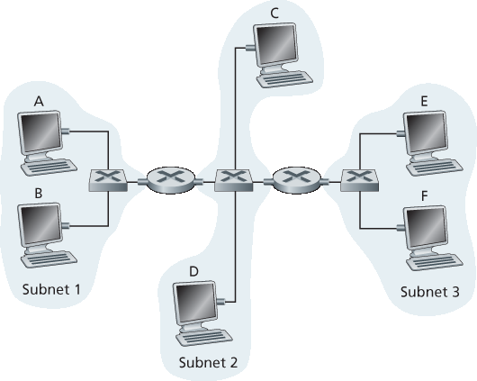

家庭作业问题和疑问
========================================

Homework Problems and Questions

.. tab:: 中文

.. tab:: 英文

SECTIONS 6.1–6.2
    R1. Consider the transportation analogy in :ref:`Section 6.1.1 <c6.1.1>` . If the passenger is analagous to a datagram, what is analogous to the link layer frame?
    
    R2. If all the links in the Internet were to provide reliable delivery service, would the TCP reliable delivery service be redundant? Why or why not?
    
    R3. What are some of the possible services that a link-layer protocol can offer to the network layer? Which of these link-layer services have corresponding services in IP? In TCP?

SECTION 6.3
    R4. Suppose two nodes start to transmit at the same time a packet of length L over a broadcast channel of rate R. Denote the propagation delay between the two nodes as dprop. Will there be a collision if dprop<L/R? Why or why not?

    R5. In :ref:`Section 6.3 <c6.3>` , we listed four desirable characteristics of a broadcast channel. Which of these characteristics does slotted ALOHA have? Which of these characteristics does token passing have?

    R6. In CSMA/CD, after the fifth collision, what is the probability that a node chooses K=4? The result K=4 corresponds to a delay of how many ­seconds on a 10 Mbps Ethernet?

    R7. Describe polling and token-passing protocols using the analogy of cocktail party interactions. R8. Why would the token-ring protocol be inefficient if a LAN had a very large perimeter?

SECTION 6.4
    R9. How big is the MAC address space? The IPv4 address space? The IPv6 address space?

    R10. Suppose nodes A, B, and C each attach to the same broadcast LAN (through their adapters). If A sends thousands of IP datagrams to B with each encapsulating frame addressed to the MAC address of B, will C’s adapter process these frames? If so, will C’s adapter pass the IP datagrams in these frames to the network layer C? How would your answers change if A sends frames with the MAC broadcast address?

    R11. Why is an ARP query sent within a broadcast frame? Why is an ARP response sent within a frame with a specific destination MAC address?

    R12. For the network in :ref:`Figure 6.19 <Figure 6.19>` , the router has two ARP modules, each with its own ARP table. Is it possible that the same MAC address appears in both tables?

    R13. Compare the frame structures for 10BASE-T, 100BASE-T, and Gigabit ­Ethernet. How do they differ?

    R14. Consider :ref:`Figure 6.15 <Figure 6.15>` . How many subnetworks are there, in the addressing sense of :ref:`Section 4.3 <c4.3>` ?

    R15. What is the maximum number of VLANs that can be configured on a switch supporting the 802.1Q protocol? Why?

    R16. Suppose that N switches supporting K VLAN groups are to be connected via a trunking protocol. How many ports are needed to connect the switches? Justify your answer.

Problems
-----------

P1. Suppose the information content of a packet is the bit pattern 1110 0110 1001 1101 and an even parity scheme is being used. What would the value of the field containing the parity bits be for the case of a two-dimensional parity scheme? Your answer should be such that a minimum- length checksum field is used.

P2. Show (give an example other than the one in :ref:`Figure 6.5 <Figure 6.5>` ) that two-dimensional parity checks can correct and detect a single bit error. Show (give an example of) a double-bit error that can be detected but not corrected.

P3. Suppose the information portion of a packet (D in :ref:`Figure 6.3 <Figure 6.3>` ) contains 10 bytes consisting of the 8-bit unsigned binary ASCII representation of string “Networking.” Compute the Internet checksum for this data.

P4. Consider the previous problem, but instead suppose these 10 bytes contain

a. the binary representation of the numbers 1 through 10.
b. the ASCII representation of the letters B through K (uppercase).
c. the ASCII representation of the letters b through k (lowercase). Compute the Internet checksum for this data.

P5. Consider the 5-bit generator, G=10011, and suppose that D has the value 1010101010. What is the value of R?

P6. Consider the previous problem, but suppose that D has the value 

a. ``1001010101``.
b. ``0101101010``. 
c. ``1010100000``.

P7. In this problem, we explore some of the properties of the CRC. For the ­generator G(=1001) given in :ref:`Section 6.2.3 <c6.2.3>` , answer the following questions.

a. Why can it detect any single bit error in data D?
b. Can the above G detect any odd number of bit errors? Why?

P8. In :ref:`Section 6.3 <c6.3>` , we provided an outline of the derivation of the efficiency of slotted ALOHA. In this problem we’ll complete the derivation.

a. Recall that when there are N active nodes, the efficiency of slotted ALOHA is Np(1−p)N−1. Find the value of p that maximizes this expression.
b. Using the value of p found in (a), find the efficiency of slotted ALOHA by letting N approach infinity. Hint: (1−1/N)N approaches 1/e as N approaches infinity.

P9. Show that the maximum efficiency of pure ALOHA is 1/(2e). Note: This problem is easy if you have completed the problem above!

P 10. Consider two nodes, A and B, that use the slotted ALOHA protocol to contend for a channel. Suppose node A has more data to transmit than node B, and node A’s retransmission probability pA is greater than node B’s retransmission probability, pB.

a. Provide a formula for node A’s average throughput. What is the total efficiency of the protocol with these two nodes?
b. If pA=2pB, is node A’s average throughput twice as large as that of node B? Why or why not? If not, how can you choose pA and pB to make that happen?
c. In general, suppose there are N nodes, among which node A has retransmission probability 2p and all other nodes have retransmission probability p. Provide expressions to compute the average throughputs of node A and of any other node.

P11. Suppose four active nodes—nodes A, B, C and D—are competing for access to a channel using slotted ALOHA. Assume each node has an infinite number of packets to send. Each node attempts to transmit in each slot with probability p. The first slot is numbered slot 1, the second slot is numbered slot 2, and so on.

a. What is the probability that node A succeeds for the first time in slot 5?
b. What is the probability that some node (either A, B, C or D) succeeds in slot 4? c. What is the probability that the first success occurs in slot 3?
d. What is the efficiency of this four-node system?

P12. Graph the efficiency of slotted ALOHA and pure ALOHA as a function of p for the following values of N:

a. N=15. 
b. N=25. 
c. N=35.

P13. Consider a broadcast channel with N nodes and a transmission rate of R bps. Suppose the broadcast channel uses polling (with an additional polling node) for multiple access. Suppose the

amount of time from when a node completes transmission until the subsequent node is permitted to transmit (that is, the polling delay) is dpoll. Suppose that within a polling round, a given node is
allowed to transmit at most Q bits. What is the maximum throughput of the broadcast channel? P14. Consider three LANs interconnected by two routers, as shown in :ref:`Figure 6.33 <Figure 6.33>` .

a. Assign IP addresses to all of the interfaces. For Subnet 1 use addresses of the form 192.168.1.xxx; for Subnet 2 uses addresses of the form 192.168.2.xxx; and for Subnet 3 use addresses of the form 192.168.3.xxx.
b. Assign MAC addresses to all of the adapters.
c. Consider sending an IP datagram from Host E to Host B. Suppose all of the ARP tables are up to date. Enumerate all the steps, as done for the single-router example in :ref:`Section 6.4.1 <c6.4.1>` .
d. Repeat (c), now assuming that the ARP table in the sending host is empty (and the other
tables are up to date).

P15. Consider :ref:`Figure 6.33 <Figure 6.33>` . Now we replace the router between subnets 1 and 2 with a switch S1, and label the router between subnets 2 and 3 as R1.

.. _Figure 6.33:

**Figure 6.33 Three subnets, interconnected by routers**

a. Consider sending an IP datagram from Host E to Host F. Will Host E ask router R1 to help forward the datagram? Why? In the Ethernet frame containing the IP datagram, what are the source and destination IP and MAC addresses?
b. Suppose E would like to send an IP datagram to B, and assume that E’s ARP cache does not contain B’s MAC address. Will E perform an ARP query to find B’s MAC address? Why? In the Ethernet frame (containing the IP datagram destined to B) that is delivered to router R1, what are the source and destination IP and MAC addresses?
c. Suppose Host A would like to send an IP datagram to Host B, and neither A’s ARP cache contains B’s MAC address nor does B’s ARP cache contain A’s MAC address. Further suppose that the switch S1’s forwarding table contains entries for Host B and router R1 only. Thus, A will broadcast an ARP request message. What actions will switch S1 perform once it receives the ARP request message? Will router R1 also receive this ARP request message? If so, will R1 forward the message to Subnet 3? Once Host B receives this ARP request message, it will send back to Host A an ARP response message. But will it send an ARP query message to ask for A’s MAC address? Why? What will switch S1 do once it receives an ARP response message from Host B? 

P16. Consider the previous problem, but suppose now that the router between subnets 2 and 3 is replaced by a switch. Answer questions (a)–(c) in the previous problem in this new context.

P17. Recall that with the CSMA/CD protocol, the adapter waits K⋅512 bit times after a collision, where K is drawn randomly. For K=100, how long does the adapter wait until returning to Step 2 for a 10 Mbps broadcast channel? For a 100 Mbps broadcast channel?

P18. Suppose nodes A and B are on the same 10 Mbps broadcast channel, and the propagation delay between the two nodes is 325 bit times. Suppose CSMA/CD and Ethernet packets are used for this broadcast channel. Suppose node A begins transmitting a frame and, before it finishes, node B begins transmitting a frame. Can A finish transmitting before it detects that B has transmitted? Why or why not? If the answer is yes, then A incorrectly believes that its frame was successfully transmitted without a collision. Hint: Suppose at time t=0 bits, A begins transmitting a frame. In the worst case, A transmits a minimum-sized frame of 512+64 bit times. So A would finish transmitting the frame at t=512+64 bit times. Thus, the answer is no, if B’s signal reaches A before bit time t=512+64 bits. In the worst case, when does B’s signal reach A?

P19. Suppose nodes A and B are on the same 10 Mbps broadcast channel, and the propagation delay between the two nodes is 245 bit times. Suppose A and B send Ethernet frames at the same time, the frames collide, and then A and B choose different values of K in the CSMA/CD algorithm. Assuming no other nodes are active, can the retransmissions from A and B collide? For our purposes, it suffices to work out the following example. Suppose A and B begin transmission at t=0 bit times. They both detect collisions at t=245 t bit times. Suppose KA=0 and KB=1. At what time does B schedule its retransmission? At what time does A begin transmission? (Note: The nodes must wait for an idle channel after returning to Step 2—see protocol.) At what time does A’s signal reach B? Does B refrain from transmitting at its scheduled time?

P20. In this problem, you will derive the efficiency of a CSMA/CD-like multiple access protocol. In this protocol, time is slotted and all adapters are synchronized to the slots. Unlike slotted
ALOHA, however, the length of a slot (in seconds) is much less than a frame time (the time to transmit a frame). Let S be the length of a slot. Suppose all frames are of constant length L=kRS, where R is the transmission rate of the channel and k is a large integer. Suppose there are N nodes, each with an infinite number of frames to send. We also assume that dprop<S, so that all nodes can detect a collision before the end of a slot time. The protocol is as follows:

- If, for a given slot, no node has possession of the channel, all nodes contend for the channel; in particular, each node transmits in the slot with probability p. If exactly one node transmits in the slot, that node takes possession of the channel for the subsequent k−1 slots and transmits its entire frame.
- If some node has possession of the channel, all other nodes refrain from transmitting until the node that possesses the channel has finished transmitting its frame. Once this node has transmitted its frame, all nodes contend for the channel.

Note that the channel alternates between two states: the productive state, which lasts exactly k slots, and the nonproductive state, which lasts for a random number of slots. Clearly, the channel efficiency is the ratio of k/(k+x), where x is the expected number of consecutive unproductive slots.

a. For fixed N and p, determine the efficiency of this protocol.
b. For fixed N, determine the p that maximizes the efficiency.
c. Using the p (which is a function of N) found in (b), determine the efficiency as N approaches infinity.
d. Show that this efficiency approaches 1 as the frame length becomes large.

P21. Consider :ref:`Figure 6.33 <Figure 6.33>` in problem P14. Provide MAC addresses and IP addresses for the interfaces at Host A, both routers, and Host F. Suppose Host A sends a datagram to Host F. Give the source and destination MAC addresses in the frame encapsulating this IP datagram as the frame is transmitted (i) from A to the left router, (ii) from the left router to the right router, (iii) from the right router to F. Also give the source and destination IP addresses in the IP datagram encapsulated within the frame at each of these points in time.

P22. Suppose now that the leftmost router in :ref:`Figure 6.33 <Figure 6.33>` is replaced by a switch. Hosts A, B, C, and D and the right router are all star-connected into this switch. Give the source and destination MAC addresses in the frame encapsulating this IP datagram as the frame is transmitted (i) from A to the switch, (ii) from the switch to the right router, (iii) from the right router to F. Also give the source and destination IP addresses in the IP datagram encapsulated within the frame at each of these points in time.

P23. Consider :ref:`Figure 6.15 <Figure 6.15>` . Suppose that all links are 100 Mbps. What is the maximum total aggregate throughput that can be achieved among the 9 hosts and 2 servers in this network? You can assume that any host or server can send to any other host or server. Why?

P24. Suppose the three departmental switches in :ref:`Figure 6.15 <Figure 6.15>` are replaced by hubs. All links are 100 Mbps. Now answer the questions posed in problem P23.

P25. Suppose that all the switches in :ref:`Figure 6.15 <Figure 6.15>` are replaced by hubs. All links are 100 Mbps. Now answer the questions posed in problem P23.
 
P26. Let’s consider the operation of a learning switch in the context of a network in which 6 nodes labeled A through F are star connected into an Ethernet switch. Suppose that (i) B sends a frame to E, (ii) E replies with a frame to B, (iii) A sends a frame to B, (iv) B replies with a frame to A. The switch table is initially empty. Show the state of the switch table before and after each of these events. For each of these events, identify the link(s) on which the transmitted frame will be forwarded, and briefly justify your answers.

P27. In this problem, we explore the use of small packets for Voice-over-IP applications. One of the drawbacks of a small packet size is that a large fraction of link bandwidth is consumed by overhead bytes. To this end, suppose that the packet consists of P bytes and 5 bytes of header.

a. Consider sending a digitally encoded voice source directly. Suppose the source is encoded at a constant rate of 128 kbps. Assume each packet is entirely filled before the source sends the packet into the network. The time required to fill a packet is the **packetization delay**. In terms of L, determine the packetization delay in milliseconds.
b. Packetization delays greater than 20 msec can cause a noticeable and unpleasant echo. Determine the packetization delay for L=1,500 bytes (roughly corresponding to a maximum-sized Ethernet packet) and for L=50 (corresponding to an ATM packet).
c. Calculate the store-and-forward delay at a single switch for a link rate of R=622 Mbps for L=1,500 bytes, and for L=50 bytes.
d. Comment on the advantages of using a small packet size.

P28. Consider the single switch VLAN in :ref:`Figure 6.25 <Figure 6.25>` , and assume an external router is connected to switch port 1. Assign IP addresses to the EE and CS hosts and router interface. Trace the steps taken at both the network layer and the link layer to transfer an IP datagram from an EE host to a CS host (Hint: Reread the discussion of Figure 6.19 in the text).

P29. Consider the MPLS network shown in :ref:`Figure 6.29 <Figure 6.29>` , and suppose that routers R5 and R6 are now MPLS enabled. Suppose that we want to perform traffic engineering so that packets from R6 destined for A are switched to A via R6-R4-R3-R1, and packets from R5 destined for A are switched via R5-R4-R2-R1. Show the MPLS tables in R5 and R6, as well as the modified table in R4, that would make this possible.

P30. Consider again the same scenario as in the previous problem, but suppose that packets from R6 destined for D are switched via R6-R4-R3, while packets from R5 destined to D are switched via R4-R2-R1-R3. Show the MPLS tables in all routers that would make this possible.

P31. In this problem, you will put together much of what you have learned about Internet protocols. Suppose you walk into a room, connect to Ethernet, and want to download a Web page. What are all the protocol steps that take place, starting from powering on your PC to getting the Web page? Assume there is nothing in our DNS or browser caches when you power on your PC. (Hint: The steps include the use of Ethernet, DHCP, ARP, DNS, TCP, and HTTP protocols.) Explicitly indicate in your steps how you obtain the IP and MAC addresses of a gateway router.

P32. Consider the data center network with hierarchical topology in :ref:`Figure 6.30 <Figure 6.30>` . Suppose now there are 80 pairs of flows, with ten flows between the first and ninth rack, ten flows between the second and tenth rack, and so on. Further suppose that all links in the network are 10 Gbps, except for the links between hosts and TOR switches, which are 1 Gbps.

a. Each flow has the same data rate; determine the maximum rate of a flow.
b. For the same traffic pattern, determine the maximum rate of a flow for the highly interconnected topology in :ref:`Figure 6.31 <Figure 6.31>` .
c. Now suppose there is a similar traffic pattern, but involving 20 hosts on each rack and 160 pairs of flows. Determine the maximum flow rates for the two topologies.

P33. Consider the hierarchical network in :ref:`Figure 6.30 <Figure 6.30>` and suppose that the data center needs to support e-mail and video distribution among other applications. Suppose four racks of servers are reserved for e-mail and four racks are reserved for video. For each of the applications, all four racks must lie below a single tier-2 switch since the tier-2 to tier-1 links do not have sufficient bandwidth to support the intra-application traffic. For the e-mail application, suppose that for 99.9 percent of the time only three racks are used, and that the video application has identical usage patterns.

a. For what fraction of time does the e-mail application need to use a fourth rack? How about for the video application?
b. Assuming e-mail usage and video usage are independent, for what fraction of time do (equivalently, what is the probability that) both applications need their fourth rack?
c. Suppose that it is acceptable for an application to have a shortage of servers for 0.001 percent of time or less (causing rare periods of performance degradation for users). Discuss how the topology in :ref:`Figure 6.31 <Figure 6.31>` can be used so that only seven racks are collectively assigned to the two applications (assuming that the topology can support all the traffic).