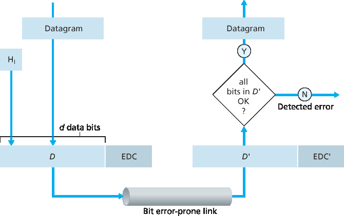
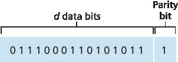
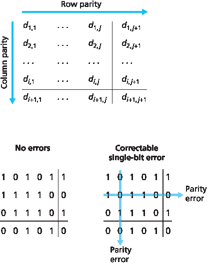
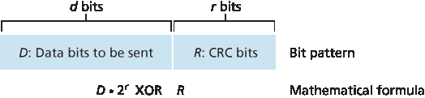
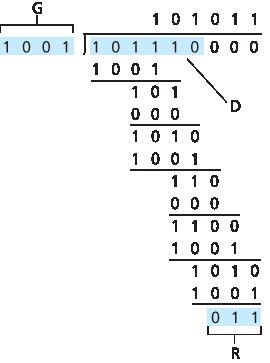

.. _c6.2:

6.2 错误检测和纠正技术
=================================================================
6.2 Error-Detection and -Correction Techniques

.. tab:: 中文

.. tab:: 英文

In the previous section, we noted that **bit-level error detection and correction**—detecting and correcting the corruption of bits in a link-layer frame sent from one node to another physically connected neighboring node—are two services often ­provided by the link layer. We saw in :ref:`Chapter 3 <c3>` that error- detection and -correction services are also often offered at the transport layer as well. In this section, we’ll examine a few of the simplest techniques that can be used to detect and, in some cases, correct such bit errors. A full treatment of the theory and implementation of this topic is itself the topic of many textbooks (for example, :ref:`[Schwartz 1980] <Schwartz 1980>` or :ref:`[Bertsekas 1991] <Bertsekas 1991>`), and our treatment here is necessarily brief. Our goal here is to develop an intuitive feel for the capabilities that error-detection and -correction techniques provide and to see how a few simple techniques work and are used in practice in the link layer.

:ref:`Figure 6.3 <Figure 6.3>` illustrates the setting for our study. At the sending node, data, D, to be protected against bit errors is augmented with error-detection and -correction bits (EDC). Typically, the data to be protected includes not only the datagram passed down from the network layer for transmission across the link, but also link-level addressing information, sequence numbers, and other fields in the link frame header. Both D and EDC are sent to the receiving node in a link-level frame. At the receiving node, a sequence of bits, D′ and EDC′ is received. Note that D′ and EDC′ may differ from the original D and EDC as a result of in-transit bit flips.

The receiver’s challenge is to determine whether or not D′ is the same as the original D, given that it has only received D′ and EDC′. The exact wording of the receiver’s decision in :ref:`Figure 6.3 <Figure 6.3>` (we ask whether an error is detected, not whether an error has occurred!) is important. Error-detection and -correction techniques allow the receiver to sometimes, but not always, detect that bit errors have occurred. Even with the use of error-detection bits there still may be **undetected bit errors**; that is, the receiver may be unaware that the received information contains bit errors. As a consequence, the receiver might deliver a corrupted datagram to the network layer, or be unaware that the contents of a field in the frame’s header has been corrupted. We thus want to choose an error- detection scheme that keeps the probability of such occurrences small. Generally, more sophisticated error-detection and-correction techniques (that is, those that have a smaller probability of allowing undetected bit errors) incur a larger overhead—more computation is needed to compute and transmit a larger number of error-detection and -correction bits.

.. _Figure 6.3:

**Figure 6.3 Error-detection and -correction scenario**

Let’s now examine three techniques for detecting errors in the transmitted data—parity checks (to illustrate the basic ideas behind error detection and correction), checksumming methods (which are more typically used in the transport layer), and cyclic redundancy checks (which are more typically used in the link layer in an adapter).

.. _c6.2.1:

6.2.1 奇偶校验
-----------------------------------------------------------------------
6.2.1 Parity Checks

.. tab:: 中文

.. tab:: 英文

Perhaps the simplest form of error detection is the use of a single **parity bit**. Suppose that the information to be sent, D in :ref:`Figure 6.4 <Figure 6.4>`, has d bits. In an even parity scheme, the sender simply includes one additional bit and chooses its value such that the total number of 1s in the d+1 bits (the original information plus a parity bit) is even. For odd parity schemes, the parity bit value is chosen such that there is an odd number of 1s. :ref:`Figure 6.4 <Figure 6.4>` illustrates an even parity scheme, with the single parity bit being stored in a separate field.

Receiver operation is also simple with a single parity bit. The receiver need only count the number of 1s in the received d+1 bits. If an odd number of 1-valued bits are found with an even parity scheme, the receiver knows that at least one bit error has occurred. More precisely, it knows that some odd number of bit errors have occurred.

But what happens if an even number of bit errors occur? You should convince yourself that this would result in an undetected error. If the probability of bit errors is small and errors can be assumed to occur independently from one bit to the next, the probability of multiple bit errors in a packet would be extremely small. In this case, a single parity bit might suffice. However, measurements have shown that, rather than occurring independently, errors are often clustered together in “bursts.” Under burst error conditions, the probability of undetected errors in a frame protected by single-bit parity can approach 50 percent :ref:`[Spragins 1991] <Spragins 1991>`. Clearly, a more robust error-detection scheme is needed (and, fortunately, is used in practice!). But before examining error-detection schemes that are used in practice, let’s consider a simple generalization of one-bit parity that will provide us with insight into error-correction techniques.

.. _Figure 6.4:

**Figure 6.4 One-bit even parity**

:ref:`Figure 6.5 <Figure 6.5>` shows a two-dimensional generalization of the single-bit parity scheme. Here, the d bits in D
are divided into i rows and j columns. A parity value is computed for each row and for each column. The resulting i+j+1 parity bits comprise the link-layer frame’s error-detection bits.

Suppose now that a single bit error occurs in the original d bits of information. With this **two-dimensional parity** scheme, the parity of both the column and the row containing the flipped bit will be in error. The receiver can thus not only detect the fact that a single bit error has occurred, but can use the column and row indices of the column and row with parity errors to actually identify the bit that was corrupted and correct that error! :ref:`Figure 6.5 <Figure 6.5>` shows an example in which the 1-valued bit in position (2,2) is corrupted and switched to a 0—an error that is both detectable and correctable at the receiver. Although our discussion has focused on the original d bits of information, a single error in the parity bits themselves is also detectable and correctable. Two-dimensional parity can also detect (but not correct!) any combination of two errors in a packet. Other properties of the two-dimensional parity scheme are explored in the problems at the end of the chapter.

.. _Figure 6.5:

**Figure 6.5 Two-dimensional even parity**

The ability of the receiver to both detect and correct errors is known as **forward error correction (FEC)**. These techniques are commonly used in audio storage and playback devices such as audio CDs. In a network setting, FEC techniques can be used by themselves, or in conjunction with link-layer ARQ techniques similar to those we examined in :ref:`Chapter 3 <c3>`. FEC techniques are valuable because they can decrease the number of sender retransmissions required. Perhaps more important, they allow for immediate correction of errors at the receiver. This avoids having to wait for the round-trip propagation delay needed for the sender to receive a NAK packet and for the retransmitted packet to propagate back to the receiver—a potentially important advantage for real-time network applications :ref:`[Rubenstein 1998] <Rubenstein 1998>` or links (such as deep-space links) with long propagation delays. Research examining the use of FEC in error-control protocols includes [:ref:`Biersack 1992 <Biersack 1992>`; :ref:`Nonnenmacher 1998 <Nonnenmacher 1998>`; :ref:`Byers 1998 <Byers 1998>`; :ref:`Shacham 1990 <Shacham 1990>`].

.. _c6.2.2:

6.2.2 校验和方法
-----------------------------------------------------------------------
6.2.2 Checksumming Methods

.. tab:: 中文

.. tab:: 英文

In checksumming techniques, the d bits of data in Figure 6.4 are treated as a sequence of k-bit integers. One simple checksumming method is to simply sum these k-bit integers and use the resulting sum as the error-detection bits. The Internet checksum is based on this approach—bytes of data are treated as 16-bit integers and summed. The 1s complement of this sum then forms the Internet checksum that is carried in the segment header. As discussed in :ref:`Section 3.3 <c3.3>`, the receiver checks the checksum by taking the 1s complement of the sum of the received data (including the checksum) and checking whether the result is all 1 bits. If any of the bits are 0, an error is indicated. RFC 1071 discusses the Internet checksum algorithm and its implementation in detail. In the TCP and UDP protocols, the Internet checksum is computed over all fields (header and data fields included). In IP the checksum is computed over the IP header (since the UDP or TCP segment has its own checksum). In other protocols, for example, XTP :ref:`[Strayer 1992] <Strayer 1992>`, one checksum is computed over the header and another checksum is computed over the entire packet.

Checksumming methods require relatively little packet overhead. For example, the checksums in TCP and UDP use only 16 bits. However, they provide relatively weak protection against errors as compared with cyclic redundancy check, which is discussed below and which is often used in the link layer. A natural question at this point is, Why is checksumming used at the transport layer and cyclic redundancy check used at the link layer? Recall that the transport layer is typically implemented in software in a host as part of the host’s operating system. Because transport-layer error detection is implemented in software, it is important to have a simple and fast error-detection scheme such as checksumming. On the other hand, error detection at the link layer is implemented in dedicated hardware in adapters, which can rapidly perform the more complex CRC operations. Feldmeier :ref:`[Feldmeier 1995] <Feldmeier 1995>` presents fast software implementation techniques for not only weighted checksum codes, but CRC (see below) and other codes as well.

.. _c6.2.3:

6.2.3 循环冗余校验 (CRC)
-----------------------------------------------------------------------
6.2.3 Cyclic Redundancy Check (CRC)

.. tab:: 中文

.. tab:: 英文

An error-detection technique used widely in today’s computer networks is based on **cyclic redundancy check (CRC) codes**. CRC codes are also known as **polynomial codes**, since it is possible to view the bit string to be sent as a polynomial whose coefficients are the 0 and 1 values in the bit string, with operations on the bit string interpreted as polynomial arithmetic.

CRC codes operate as follows. Consider the d-bit piece of data, D, that the sending node wants to send to the receiving node. The sender and receiver must first agree on an r+1 bit pattern, known as a **generator**, which we will denote as G. We will require that the most significant (leftmost) bit of G be a 1. The key idea behind CRC codes is shown in :ref:`Figure 6.6 <Figure 6.6>`. For a given piece of data, D, the sender will choose r additional bits, R, and append them to D such that the resulting d+r bit pattern (interpreted as a binary number) is exactly divisible by G (i.e., has no remainder) using modulo-2 arithmetic. The process of error checking with CRCs is thus simple: The receiver divides the d+r received bits by G. If the remainder is nonzero, the receiver knows that an error has occurred; otherwise the data is accepted as being correct.

All CRC calculations are done in modulo-2 arithmetic without carries in addition or borrows in subtraction. This means that addition and subtraction are identical, and both are equivalent to the bitwise exclusive-or (XOR) of the operands. Thus, for example,

.. code:: text 

    1011 XOR 0101 = 1110
    1001 XOR 1101 = 0100

Also, we similarly have

.. code-block:: text

    1011 - 0101 = 1110
    1001 - 1101 = 0100

Multiplication and division are the same as in base-2 arithmetic, except that any required addition or subtraction is done without carries or borrows. As in regular binary arithmetic, multiplication by :math:`2^k` left shifts a bit pattern by k places. Thus, given D and R, the quantity D⋅2rXOR R yields the d+r bit pattern shown in :ref:`Figure 6.6 <Figure 6.6>`. We’ll use this algebraic characterization of the d+r bit pattern from :ref:`Figure 6.6 <Figure 6.6>` in our discussion below.

.. _Figure 6.6:

**Figure 6.6 CRC**

Let us now turn to the crucial question of how the sender computes R. Recall that we want to find R such that there is an n such that

``D⋅2rXOR R=nG``

That is, we want to choose R such that G divides into D⋅2rXOR R without remainder. If we XOR (that is, add modulo-2, without carry) R to both sides of the above equation, we get

``D⋅2r=nG XOR R``

This equation tells us that if we divide D⋅2r by G, the value of the remainder is precisely R. In other words, we can calculate R as

``R=remainderD⋅2rG``

:ref:`Figure 6.7 <Figure 6.7>` illustrates this calculation for the case of D=101110, d=6, G=1001, and r=3. The 9 bits transmitted in this case are 101 110  011. You should check these calculations for yourself and also check that indeed D⋅2r=101011⋅G XOR R.

.. _Figure 6.7:

**Figure 6.7 A sample CRC calculation**

International standards have been defined for 8-, 12-, 16-, and 32-bit generators, G. The CRC-32 32-bit standard, which has been adopted in a number of link-level IEEE protocols, uses a generator of

``GCRC-32=100000100110000010001110110110111``

Each of the CRC standards can detect burst errors of fewer than r+1 bits. (This means that all consecutive bit errors of r bits or fewer will be detected.) Furthermore, under appropriate assumptions, a burst of length greater than r+1 bits is detected with probability 1−0.5r. Also, each of the CRC standards can detect any odd number of bit errors. See :ref:`[Williams 1993] <Williams 1993>` for a discussion of implementing CRC checks. The theory behind CRC codes and even more powerful codes is beyond the scope of this text. The text :ref:`[Schwartz 1980] <Schwartz 1980>` provides an excellent introduction to this topic.