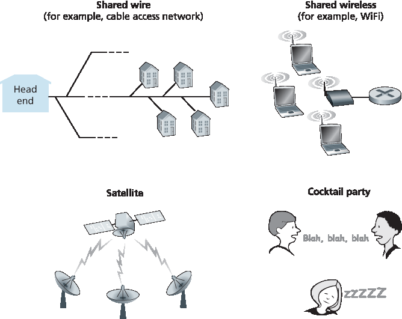
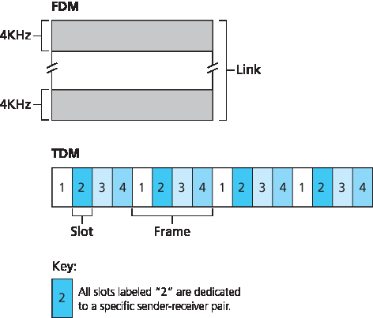
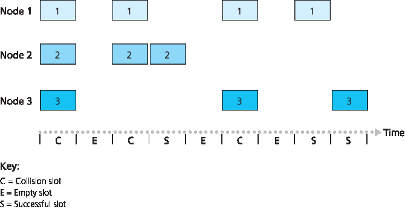
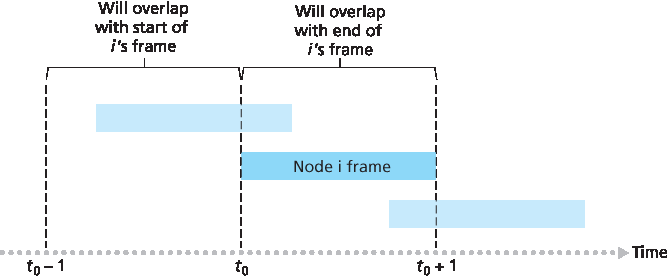
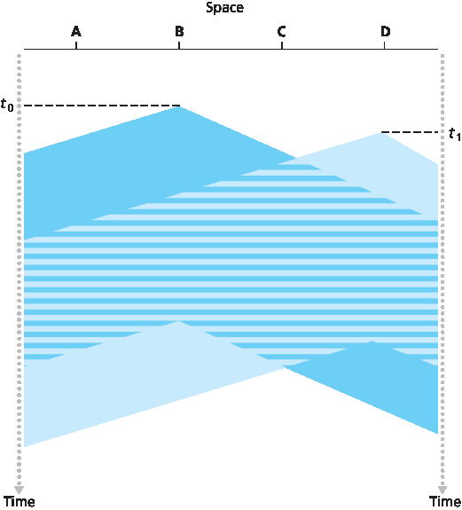
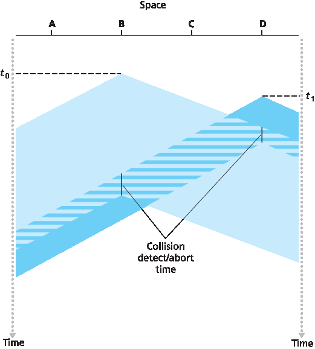
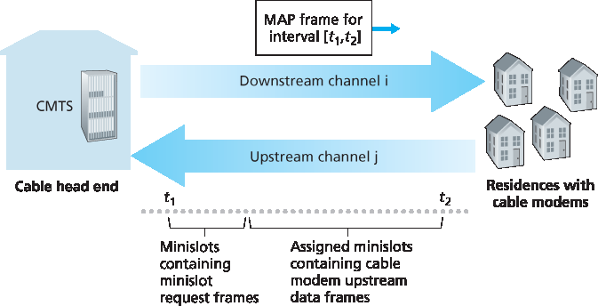

.. _c6.3:

6.3 多路访问链路与协议
=================================================================
6.3 Multiple Access Links and Protocols

在本章的引言中，我们指出网络链路有两种类型：点对点链路和广播链路。一个 **点对点链路** 由链路一端的单一发送方和另一端的单一接收方组成。许多链路层协议都是为点对点链路设计的；点对点协议（PPP）和高级数据链路控制（HDLC）就是这样的两个协议。第二种链路类型是 **广播链路**，它可以有多个发送和接收节点连接到同一个共享的广播信道。这里使用“广播”一词是因为当任一节点发送一个帧时，信道会广播该帧，每个其他节点都会收到一个副本。以太网和无线局域网是广播链路层技术的例子。在本节中，我们将暂时不讨论具体的链路层协议，而是先研究一个对链路层至关重要的问题：如何协调多个发送和接收节点对共享广播信道的访问——即 **多路访问问题**。广播信道通常用于局域网（LAN）中，即那些地理上集中在单一建筑物内（或企业或大学园区内）的网络。因此，在本节最后我们将看看局域网中如何使用多路访问信道。

我们都熟悉广播的概念——自从电视发明以来就已在使用。但传统电视是单向广播（即一个固定节点向多个接收节点发送），而计算机网络中的广播信道上的节点可以同时发送和接收。或许对广播信道更贴切的人类类比是鸡尾酒会场景，在一个大房间里聚集了许多人（空气充当广播媒介）进行交谈和倾听。另一个很好的类比是许多读者都熟悉的课堂——老师和学生也同样共享一个单一的广播媒介。这两种场景中的核心问题是决定谁能发言（即向信道发送）以及何时发言。作为人类，我们发展出一整套精妙的协议用于共享广播信道：

“让每个人都有发言机会。”

“在别人和你说话前不要说话。”

“不要垄断对话。”

“如果你有问题请举手。”

“别人说话时不要打断。”

“别人说话时不要打瞌睡。”

计算机网络同样拥有协议——即所谓的 **多路访问协议**——通过这些协议，节点控制其向共享广播信道的发送。正如 :ref:`图 6.8 <Figure 6.8>` 所示，多路访问协议在各种网络环境中都是必要的，包括有线和无线接入网络以及卫星网络。尽管从技术上说每个节点通过其适配器访问广播信道，但在本节中我们将节点称为发送和接收设备。实际上，数百甚至上千个节点可以在广播信道上直接通信。

.. _Figure 6.8:

**图 6.8 各种多路访问信道**

由于所有节点都能发送帧，因此可能会有多个节点同时发送帧。当这种情况发生时，所有节点会同时接收到多个帧；也就是说，发送的帧在所有接收器处发生了 **碰撞** 。通常，当发生碰撞时，任何接收节点都无法理解任何一个被发送的帧；从某种意义上讲，碰撞帧的信号变得无法分离。因此，所有参与碰撞的帧都会丢失，在碰撞期间广播信道的带宽被浪费。显然，如果许多节点频繁尝试发送帧，则会发生大量碰撞，从而严重浪费广播信道的带宽。

为了确保当多个节点活跃时广播信道仍能执行有用的工作，就必须以某种方式协调这些活跃节点的发送。这项协调工作正是多路访问协议的职责。在过去 40 年中，已有数以千计的论文和数百篇博士论文专门探讨多路访问协议；前 20 年研究工作的综合综述见 :ref:`[Rom 1990] <Rom 1990>`。此外，由于新型链路（尤其是新型无线链路）的不断涌现，关于多路访问协议的研究仍在持续进行。

多年来，已在多种链路层技术中实现了数十种多路访问协议。尽管如此，我们几乎可以将所有多路访问协议归为三大类之一： **信道划分协议**、 **随机访问协议** 和 **轮流访问协议**。我们将在接下来的三个小节中分别介绍这三类多路访问协议。

最后我们用一个理想化目标来总结本概述：一个速率为 R 比特每秒的广播信道所采用的多路访问协议应当具备以下几个理想特性：

1. 当仅有一个节点有数据要发送时，该节点的吞吐量为 R bps。
2. 当有 M 个节点有数据要发送时，每个节点的吞吐量应为 R/M bps。这并不意味着每个节点在每个时刻的传输速率都是 R/M，而是指每个节点在某一合适定义的时间区间内的平均发送速率应为 R/M。
3. 协议应当是去中心化的；即不存在某个单一的主节点，从而避免网络的单点故障。
4. 协议应当简单，以便于低成本实现。

.. toggle::

   In the introduction to this chapter, we noted that there are two types of network links: point-to-point links and broadcast links. A **point-to-point link** consists of a single sender at one end of the link and a single receiver at the other end of the link. Many link-layer protocols have been designed for point-to-point links; the point-to-point protocol (PPP) and high-level data link control (HDLC) are two such protocols. The second type of link, a **broadcast link**, can have multiple sending and receiving nodes all connected to the same, single, shared broadcast channel. The term broadcast is used here because when any one node transmits a frame, the channel broadcasts the frame and each of the other nodes receives a copy. Ethernet and wireless LANs are examples of broadcast link-layer technologies. In this section we’ll take a step back from specific link-layer protocols and first examine a problem of central importance to the link layer: how to coordinate the access of multiple sending and receiving nodes to a shared broadcast channel—the **multiple access problem**. Broadcast channels are often used in LANs, networks that are geographically concentrated in a single building (or on a corporate or university campus). Thus, we’ll look at how multiple access channels are used in LANs at the end of this section.

   We are all familiar with the notion of broadcasting—television has been using it since its invention. But traditional television is a one-way broadcast (that is, one fixed node transmitting to many receiving nodes), while nodes on a computer network broadcast channel can both send and receive. Perhaps a more apt human analogy for a broadcast channel is a cocktail party, where many people gather in a large room (the air providing the broadcast medium) to talk and listen. A second good analogy is something many readers will be familiar with—a classroom—where teacher(s) and student(s) similarly share the same, single, broadcast medium. A central problem in both scenarios is that of determining who gets to talk (that is, transmit into the channel) and when. As humans, we’ve evolved an elaborate set of protocols for sharing the broadcast channel:

   “Give everyone a chance to speak.”

   “Don’t speak until you are spoken to.”

   “Don’t monopolize the conversation.”

   “Raise your hand if you have a question.” 

   “Don’t interrupt when someone is speaking.” 

   “Don’t fall asleep when someone is talking.”

   Computer networks similarly have protocols—so-called **multiple access ­protocols**—by which nodes regulate their transmission into the shared broadcast channel. As shown in :ref:`Figure 6.8 <Figure 6.8>`, multiple access protocols are needed in a wide variety of network settings, including both wired and wireless access networks, and satellite networks. Although technically each node accesses the broadcast channel through its adapter, in this section we will refer to the node as the sending and receiving device. In practice, hundreds or even thousands of nodes can directly communicate over a broadcast channel.

   .. figure:: ../img/508-0.png
      :align: center

   **Figure 6.8 Various multiple access channels**

   Because all nodes are capable of transmitting frames, more than two nodes can transmit frames at the same time. When this happens, all of the nodes receive multiple frames at the same time; that is, the transmitted frames **collide** at all of the receivers. Typically, when there is a collision, none of the receiving nodes can make any sense of any of the frames that were transmitted; in a sense, the signals of the colliding frames become inextricably tangled together. Thus, all the frames involved in the collision are lost, and the broadcast channel is wasted during the collision interval. Clearly, if many nodes want to transmit frames frequently, many transmissions will result in collisions, and much of the bandwidth of the broadcast channel will be wasted.

   In order to ensure that the broadcast channel performs useful work when multiple nodes are active, it is necessary to somehow coordinate the transmissions of the active nodes. This coordination job is the responsibility of the multiple access protocol. Over the past 40 years, thousands of papers and hundreds of PhD dissertations have been written on multiple access protocols; a comprehensive survey of the first 20 years of this body of work is :ref:`[Rom 1990] <Rom 1990>`. Furthermore, active research in multiple access protocols continues due to the continued emergence of new types of links, particularly new wireless links.

   Over the years, dozens of multiple access protocols have been implemented in a variety of link-layer technologies. Nevertheless, we can classify just about any multiple access protocol as belonging to one of three categories: **channel partitioning protocols**, **random access protocols**, and **taking-turns protocols**. We’ll cover these categories of multiple access protocols in the following three subsections.

   Let’s conclude this overview by noting that, ideally, a multiple access protocol for a broadcast channel of rate R bits per second should have the following desirable characteristics:

   1. When only one node has data to send, that node has a throughput of R bps.
   2. When M nodes have data to send, each of these nodes has a throughput of R/M bps. This need not necessarily imply that each of the M nodes always has an instantaneous rate of R/M, but rather that each node should have an average transmission rate of R/M over some suitably defined interval of time.
   3. The protocol is decentralized; that is, there is no master node that represents a single point of failure for the network.
   4. The protocol is simple, so that it is inexpensive to implement.

.. _c6.3.1:

6.3.1 信道划分协议
-----------------------------------------------------------------------
6.3.1 Channel Partitioning Protocols

回忆我们在 :ref:`第 1.3 节 <c1.3>` 中早期的讨论，时分复用（TDM）和频分复用（FDM）是两种可以用于在共享广播信道上的所有节点之间划分带宽的技术。举例来说，假设信道支持 ``N`` 个节点，且信道的传输速率为 ``R bps``。TDM 将时间划分为 **时间帧**，并进一步将每个时间帧划分为 ``N`` 个 **时间片**。（TDM 的时间帧不应与链路层发送方和接收方适配器之间交换的数据单元混淆，后者也称为帧。为了减少混淆，在本小节中我们将链路层交换的数据单元称为数据包。）每个时间片分配给 ``N`` 个节点中的一个。当某个节点有数据包要发送时，它会在循环的 TDM 帧中其分配到的时间片内发送数据包的比特。通常，时间片大小的选择使得在一个时间片内可以传输一个完整的数据包。:ref:`图 6.9 <Figure 6.9>` 展示了一个简单的四节点 TDM 示例。回到我们之前的鸡尾酒会类比，一个由 TDM 管理的鸡尾酒会会允许某位宾客在固定的时间段内发言，然后让另一位宾客在同样的时间段内发言，依此类推。一旦每个人都获得过发言机会，该模式便会重复。

.. _Figure 6.9:

**图 6.9 一个四节点的 TDM 和 FDM 示例**

TDM 的吸引力在于它消除了碰撞，并且完全公平：每个节点在每个帧时间内获得 ``R/N bps`` 的专属传输速率。然而，它有两个主要缺点。首先，即使某个节点是唯一有数据包要发送的节点，它的平均速率仍然受到 ``R/N bps`` 的限制。第二个缺点是，即使某个节点是唯一有帧要发送的节点，它也必须等待轮到自己才能发送。想象一下，一个鸡尾酒会宾客是唯一有话要说的人（而且设想这是一个更罕见的场景——每个人都想听他的话）。显然，对于这种特定的聚会场合，TDM 将是一个糟糕的多路访问协议选择。

TDM 在时间上划分广播信道，而 FDM 则将 ``R bps`` 的信道划分为不同的频率（每个频率带宽为 ``R/N``），并将每个频率分配给 ``N`` 个节点中的一个。因此，FDM 将一个较大的 ``R bps`` 信道划分为 ``N`` 个较小的 `R/N bp`s` 信道。FDM 拥有与 TDM 相同的优点和缺点。它避免了碰撞，并公平地在 ``N`` 个节点之间划分带宽。然而，FDM 与 TDM 也有一个共同的主要缺点——即使某节点是唯一有数据包要发送的节点，其带宽仍然被限制为 ``R/N``。

第三种信道划分协议是 **码分多址（CDMA）**。TDM 和 FDM 分别将时间片和频率分配给各个节点，而 CDMA 则为每个节点分配不同的码。然后每个节点使用其唯一的码对其发送的数据比特进行编码。如果这些码选择得当，CDMA 网络具有一个极好的特性，即不同节点可以同时发送，接收方依然可以在其他节点发送干扰的情况下正确接收来自特定发送方编码的数据比特（前提是接收方知道发送方的码）。CDMA 长期以来被用于军事系统（因其抗干扰特性），如今也广泛用于民用，尤其是在蜂窝通信中。由于 CDMA 的应用与无线信道紧密相关，我们将把其技术细节留到 :ref:`第 7 章 <c7>` 中讨论。目前，只需知道，CDMA 码就像 TDM 中的时间片和 FDM 中的频率一样，也可以被分配给多路访问信道的用户。

.. toggle::

   Recall from our early discussion back in :ref:`Section 1.3 <c1.3>` that time-division ­multiplexing (TDM) and frequency-division multiplexing (FDM) are two techniques that can be used to partition a broadcast channel’s bandwidth among all nodes sharing that channel. As an example, suppose the channel supports N nodes and that the transmission rate of the channel is R bps. TDM divides time into **time frames** and further divides each time frame into N **time slots**. (The TDM time frame should not be confused with the link-layer unit of data exchanged between sending and receiving adapters, which is also called a frame. In order to reduce confusion, in this subsection we’ll refer to the link-layer unit of data exchanged as a packet.) Each time slot is then assigned to one of the N nodes. Whenever a node has a packet to send, it transmits the packet’s bits during its assigned time slot in the revolving TDM frame. Typically, slot sizes are chosen so that a single packet can be transmitted during a slot time. :ref:`Figure 6.9 <Figure 6.9>` shows a simple four-node TDM example. Returning to our cocktail party analogy, a TDM-regulated cocktail party would allow one partygoer to speak for a fixed period of time, then allow another partygoer to speak for the same amount of time, and so on. Once everyone had had a chance to talk, the ­pattern would repeat.

   .. figure:: ../img/510-0.png
      :align: center

   **Figure 6.9 A four-node TDM and FDM example**

   TDM is appealing because it eliminates collisions and is perfectly fair: Each node gets a dedicated transmission rate of R/N bps during each frame time. However, it has two major drawbacks. First, a node is limited to an average rate of R/N bps even when it is the only node with packets to send. A second drawback is that a node must always wait for its turn in the transmission sequence—again, even when it is the only node with a frame to send. Imagine the partygoer who is the only one with anything to say (and imagine that this is the even rarer circumstance where everyone wants to hear what that one person has to say). Clearly, TDM would be a poor choice for a multiple access protocol for this particular party.

   While TDM shares the broadcast channel in time, FDM divides the R bps channel into different frequencies (each with a bandwidth of R/N) and assigns each frequency to one of the N nodes. FDM thus creates N smaller channels of R/N bps out of the single, larger R bps channel. FDM shares both the advantages and drawbacks of TDM. It avoids collisions and divides the bandwidth fairly among the N nodes. However, FDM also shares a principal disadvantage with TDM—a node is limited to a bandwidth of R/N, even when it is the only node with packets to send.

   A third channel partitioning protocol is **code division multiple access (CDMA)**. While TDM and FDM assign time slots and frequencies, respectively, to the nodes, CDMA assigns a different code to each node. Each node then uses its unique code to encode the data bits it sends. If the codes are chosen carefully, CDMA networks have the wonderful property that different nodes can transmit simultaneously and yet have their respective receivers correctly receive a sender’s encoded data bits (assuming the receiver knows the sender’s code) in spite of interfering transmissions by other nodes. CDMA has been used in military systems for some time (due to its anti-jamming properties) and now has widespread civilian use, particularly in cellular telephony. Because CDMA’s use is so tightly tied to wireless channels, we’ll save our discussion of the technical details of CDMA until :ref:`Chapter 7 <c7>`. For now, it will suffice to know that CDMA codes, like time slots in TDM and frequencies in FDM, can be allocated to the multiple access channel users.

.. _c6.3.2:

6.3.2 随机访问协议
-----------------------------------------------------------------------
6.3.2 Random Access Protocols

第二大类多路访问协议是随机访问协议。在随机访问协议中，发送节点始终以信道的全速率（即 ``R bps``）进行传输。当发生碰撞时，每个参与碰撞的节点会不断重传其帧（即数据包），直到该帧未发生碰撞地成功传输为止。但当节点发生碰撞时，并不一定会立即重传帧。相反，它会在重传前等待一个随机延迟。每个参与碰撞的节点会选择独立的随机延迟。由于这些延迟是独立选择的，因此可能某个节点选出的延迟足够小于其他节点的延迟，从而可以在不发生碰撞的情况下成功地将其帧发送到信道中。

在文献中有数十甚至数百种随机访问协议的描述 [:ref:`Rom 1990 <Rom 1990>`; :ref:`Bertsekas 1991 <Bertsekas 1991>`]。本节我们将介绍几种最常用的随机访问协议——ALOHA 协议 [:ref:`Abramson 1970 <Abramson 1970>`; :ref:`Abramson 1985 <Abramson 1985>`; :ref:`Abramson 2009 <Abramson 2009>`] 和载波侦听多路访问（CSMA）协议 [:ref:`Kleinrock 1975b <Kleinrock 1975b>`]。以太网 [:ref:`Metcalfe 1976 <Metcalfe 1976>`] 是一种广泛部署和使用的 CSMA 协议。

.. toggle::

   The second broad class of multiple access protocols are random access protocols. In a random access protocol, a transmitting node always transmits at the full rate of the channel, namely, R bps. When there is a collision, each node involved in the collision repeatedly retransmits its frame (that is, packet) until its frame gets through without a collision. But when a node experiences a collision, it doesn’t necessarily retransmit the frame right away. Instead it waits a random delay before retransmitting the frame. Each node involved in a collision chooses independent random delays. Because the random delays are independently chosen, it is possible that one of the nodes will pick a delay that is sufficiently less than the delays of the other colliding nodes and will therefore be able to sneak its frame into the channel without a collision.

   There are dozens if not hundreds of random access protocols described in the literature [:ref:`Rom 1990 <Rom 1990>`; :ref:`Bertsekas 1991 <Bertsekas 1991>`]. In this section we’ll describe a few of the most commonly used random access protocols—the ALOHA protocols [:ref:`Abramson 1970 <Abramson 1970>`; :ref:`Abramson 1985 <Abramson 1985>`; :ref:`Abramson 2009 <Abramson 2009>`] and the carrier sense multiple access (CSMA) protocols [:ref:`Kleinrock 1975b <Kleinrock 1975b>`]. Ethernet [:ref:`Metcalfe 1976 <Metcalfe 1976>`] is a popular and widely deployed CSMA protocol.

时隙 ALOHA
~~~~~~~~~~~~~~~~~
Slotted ALOHA

我们从最简单的随机访问协议之一——时隙 ALOHA 协议开始研究。在描述时隙 ALOHA 时，我们假设如下条件：

- 所有帧都由恰好 L 位组成。
- 时间被划分为大小为 L/R 秒的时隙（即一个时隙等于发送一个帧所需的时间）。
- 节点仅在时隙开始时才开始传输帧。
- 节点是同步的，即每个节点都知道时隙何时开始。
- 如果在一个时隙内两个或多个帧发生碰撞，则所有节点在该时隙结束前都能检测到碰撞事件。

设 ``p`` 是一个介于 ``0`` 与 ``1`` 之间的概率。每个节点中时隙 ALOHA 的操作很简单：

- 当节点有一个新帧要发送时，它会等待下一个时隙的开始，并在该时隙内传输整个帧。
- 如果未发生碰撞，则该节点成功传输其帧，因此无需重传该帧。（如果该节点还有其他帧可发送，它可以准备一个新帧。）
- 如果发生碰撞，节点会在该时隙结束前检测到碰撞。此后，节点会以概率 ``p`` 在随后的每个时隙中重传其帧，直到该帧成功发送。

我们所谓“以概率 ``p`` 重传”是指该节点实际掷一枚有偏硬币；硬币正面表示“重传”，发生概率为 ``p``；硬币反面表示“跳过该时隙并在下一个时隙再次掷硬币”，发生概率为 (``1-p``)。所有参与碰撞的节点独立地掷硬币。

时隙 ALOHA 似乎有许多优点。与信道划分不同，时隙 ALOHA 允许一个节点在其为唯一活动节点时以全速 ``R`` 连续传输。（若一个节点有帧可发送，则称其为活动节点。）时隙 ALOHA 也高度去中心化，因为每个节点都可以检测碰撞并独立决定何时重传。（不过，时隙 ALOHA 要求节点间的时隙同步；我们稍后会讨论一种无需同步的非时隙版本的 ALOHA 协议以及 CSMA 协议，这些都不需要同步。）时隙 ALOHA 也是一种非常简单的协议。

时隙 ALOHA 在仅有一个活动节点时工作良好，但当有多个活动节点时，它的效率如何？这里有两个潜在的效率问题。首先，如 :ref:`图 6.10 <Figure 6.10>` 所示，当有多个活动节点时，某些时隙会发生碰撞，因此被“浪费”。第二个问题是，另有一部分时隙会空闲，因为所有活动节点因概率传输机制而选择不发送。唯一“未浪费”的时隙是那些恰好只有一个节点发送的时隙。这种恰好只有一个节点发送的时隙称为 **成功时隙**。一个时隙多路访问协议的 **效率** 定义为在大量活动节点、每个节点始终有大量帧可发送的情况下，成功时隙在长期运行中的比例。注意，如果不使用任何形式的访问控制，并且每个节点在发生碰撞后立即重传，则效率将为零。时隙 ALOHA 显然将效率提高到高于零，但提高了多少呢？

.. _Figure 6.10:

**图 6.10 节点 1、2 和 3 在第一个时隙中碰撞。节点 2 在第四个时隙中成功，节点 1 在第八个时隙中成功，节点 3 在第九个时隙中成功**

我们现在开始推导时隙 ALOHA 的最大效率。为了简化推导，我们稍作修改，假设每个节点在每个时隙内以概率 ``p`` 试图发送一个帧。（即，我们假设每个节点总是有帧要发送，并且无论是新帧还是经历过碰撞的帧，该节点以概率 ``p`` 发送。）设共有 ``N`` 个节点。那么某个时隙为成功时隙的概率，是某一个节点发送帧而其他 ``N-1`` 个节点不发送的概率。某节点发送的概率是 ``p``；其余节点不发送的概率是 :math:`(1 - p)^{N-1}`。因此，某节点成功的概率是 :math:`p(1-p)^{N-1}`。因为共有 ``N`` 个节点，所以任一节点成功的概率为 :math:`Np(1-p)^{N-1}`。

因此，当有 ``N`` 个活动节点时，时隙 ALOHA 的效率为 :math:`Np(1-p)^{N-1}`。要获得 ``N`` 个活动节点时的最大效率，我们需要找到使该表达式最大的 :math:`\text{p*}`。（具体推导请参考课后习题。）而要获得大量活动节点时的最大效率，我们取 :math:`\text{Np*}(1-\text{p*})^{N-1}` 在 ``N`` 趋近于无穷时的极限值。（这部分同样在课后习题中详述。）经过这些计算，我们会发现该协议的最大效率为 ``1/e = 0.37``。也就是说，当大量节点有许多帧要发送时，最多只有 37% 的时隙被有效利用。因此，信道的有效传输速率不是 ``R bps``，而是仅为 ``0.37 R bps``！类似分析还显示，37% 的时隙将是空闲的，26% 的时隙会发生碰撞。想象一下，一位网络管理员购买了一套 ``100 Mbps`` 的时隙 ALOHA 系统，期望可以以例如 ``80 Mbps`` 的总速率将数据传输给众多用户！尽管信道在单帧传输时的速率是 ``100 Mbps``，但从长期来看，该信道的成功吞吐率将不到 ``37 Mbps``。

.. toggle::

   Let’s begin our study of random access protocols with one of the simplest random access protocols, the slotted ALOHA protocol. In our description of slotted ALOHA, we assume the following:

   - All frames consist of exactly L bits.
   - Time is divided into slots of size L/R seconds (that is, a slot equals the time to transmit one frame).
   - Nodes start to transmit frames only at the beginnings of slots.
   - The nodes are synchronized so that each node knows when the slots begin.
   - If two or more frames collide in a slot, then all the nodes detect the collision event before the slot ends.

   Let p be a probability, that is, a number between 0 and 1. The operation of slotted ALOHA in each node is simple:

   - When the node has a fresh frame to send, it waits until the beginning of the next slot and transmits the entire frame in the slot.
   - If there isn’t a collision, the node has successfully transmitted its frame and thus need not consider retransmitting the frame. (The node can prepare a new frame for transmission, if it has one.)
   - If there is a collision, the node detects the collision before the end of the slot. The node retransmits its frame in each subsequent slot with probability p until the frame is transmitted without a collision.

   By retransmitting with probability p, we mean that the node effectively tosses a biased coin; the event heads corresponds to “retransmit,” which occurs with probability p. The event tails corresponds to “skip the slot and toss the coin again in the next slot”; this occurs with probability (1−p). All nodes involved in the collision toss their coins independently.

   Slotted ALOHA would appear to have many advantages. Unlike channel partitioning, slotted ALOHA allows a node to transmit continuously at the full rate, R, when that node is the only active node. (A node is said to be active if it has frames to send.) Slotted ALOHA is also highly decentralized, because each node detects collisions and independently decides when to retransmit. (Slotted ALOHA does, however, require the slots to be synchronized in the nodes; shortly we’ll discuss an unslotted version of the ALOHA protocol, as well as CSMA protocols, none of which require such synchronization.) Slotted ALOHA is also an extremely simple protocol.

   Slotted ALOHA works well when there is only one active node, but how ­efficient is it when there are multiple active nodes? There are two possible efficiency concerns here. First, as shown in :ref:`Figure 6.10 <Figure 6.10>`, when there are multiple active nodes, a certain fraction of the slots will have collisions and will therefore be “wasted.” The second concern is that another fraction of the slots will be empty because all active nodes refrain from transmitting as a result of the probabilistic transmission policy. The only “unwasted” slots will be those in which exactly one node transmits. A slot in which exactly one node transmits is said to be a **successful slot**. The **efficiency** of a slotted multiple access protocol is defined to be the long-run fraction of successful slots in the case when there are a large number of active nodes, each always having a large number of frames to send. Note that if no form of access control were used, and each node were to immediately retransmit after each collision, the efficiency would be zero. Slotted ALOHA clearly increases the efficiency beyond zero, but by how much?

   .. figure:: ../img/513-0.png
      :align: center 

   **Figure 6.10 Nodes 1, 2, and 3 collide in the first slot. Node 2 finally succeeds in the fourth slot, node 1 in the eighth slot, and node 3 in the ninth slot**

   We now proceed to outline the derivation of the maximum efficiency of slotted ALOHA. To keep this derivation simple, let’s modify the protocol a little and assume that each node attempts to transmit a frame in each slot with probability p. (That is, we assume that each node always has a frame to send and that the node transmits with probability p for a fresh frame as well as for a frame that has already suffered a collision.) Suppose there are N nodes. Then the probability that a given slot is a successful slot is the probability that one of the nodes transmits and that the remaining N−1 nodes do not transmit. The probability that a given node transmits is p; the probability that the remaining nodes do not transmit is (1−p)N−1. Therefore the probability a given node has a success is p(1−p)N−1. Because there are N nodes, the probability that any one of the N nodes has a success is Np(1−p)N−1.

   Thus, when there are N active nodes, the efficiency of slotted ALOHA is Np(1−p)N−1. To obtain the maximum efficiency for N active nodes, we have to find the p* that maximizes this expression. (See the homework problems for a general outline of this derivation.) And to obtain the maximum efficiency for a large number of active nodes, we take the limit of Np*(1−p*)N−1 as N approaches infinity. (Again, see the homework problems.) After performing these calculations, we’ll find that the maximum efficiency of the protocol is given by 1/e=0.37. That is, when a large number of nodes have many frames to transmit, then (at best) only 37 percent of the slots do useful work. Thus the effective transmission rate of the channel is not R bps but only 0.37 R bps! A similar analysis also shows that 37 percent of the slots go empty and 26 percent of slots have collisions. Imagine the poor network administrator who has purchased a 100-Mbps slotted ALOHA system, expecting to be able to use the network to transmit data among a large number of users at an aggregate rate of, say, 80 Mbps! Although the channel is capable of transmitting a given frame at the full channel rate of 100 Mbps, in the long run, the successful throughput of this channel will be less than 37 Mbps.

ALOHA
~~~~~~~~~

时隙 ALOHA 协议要求所有节点将其传输同步到时隙的开始时刻。而最早的 ALOHA 协议 :ref:`[Abramson 1970] <Abramson 1970>` 实际上是一个非时隙、完全去中心化的协议。在纯 ALOHA 中，当一个帧首次到达（即一个网络层数据报从发送节点的网络层被传递下来）时，节点会立即将该帧完整地发送到广播信道中。如果该帧在传输时与一个或多个其他传输发生碰撞，节点会在将冲突的帧完全传输完成后立即以概率 ``p`` 重传该帧。否则，节点会等待一个帧传输时间，然后以概率 ``p`` 发送该帧，或者以概率 ``1 – p`` 继续等待（保持空闲）一个帧时间。

为了确定纯 ALOHA 的最大效率，我们关注单个节点。我们将采用与时隙 ALOHA 分析中相同的假设，并将帧传输时间作为时间单位。在任意时刻，节点发送帧的概率为 ``p``。假设该帧在时间 :math:`t_0` 开始传输。如 :ref:`图 6.11 <Figure 6.11>` 所示，为了使该帧成功传输，其他节点不能在区间 :math:`[t_0-1, \space t_0]` 内开始传输。否则会与节点 ``i`` 的帧传输起始部分重叠。其他所有节点在该时间段内未开始传输的概率为 :math:`(1-p)^{N-1}`。类似地，在节点 ``i`` 正在传输期间，也不能有其他节点开始传输，否则会与节点 ``i`` 的帧传输后半段重叠。其他所有节点在该期间内未开始传输的概率也是 :math:`(1-p)^{N-1}`。因此，某节点成功传输的概率为 :math:`p(1-p)^{2(N-1)}`。与时隙 ALOHA 情况一样取极限后可知，纯 ALOHA 协议的最大效率只有 ``1/(2e)``，正好是时隙 ALOHA 的一半。这就是为实现完全去中心化的 ALOHA 协议所要付出的代价。

.. _Figure 6.11:

**图 6.11 纯 ALOHA 中的干扰传输**

.. toggle::

   The slotted ALOHA protocol required that all nodes synchronize their transmissions to start at the beginning of a slot. The first ALOHA protocol :ref:`[Abramson 1970] <Abramson 1970>` was actually an unslotted, fully decentralized protocol. In pure ALOHA, when a frame first arrives (that is, a network-layer datagram is passed down from the network layer at the sending node), the node immediately transmits the frame in its entirety into the broadcast channel. If a transmitted frame experiences a collision with one or more other transmissions, the node will then immediately (after completely transmitting its collided frame) retransmit the frame with probability p. Otherwise, the node waits for a frame transmission time. After this wait, it then transmits the frame with probability p, or waits (remaining idle) for another frame time with probability 1 – p. 

   To determine the maximum efficiency of pure ALOHA, we focus on an individual node. We’ll make the same assumptions as in our slotted ALOHA analysis and take the frame transmission time to be the unit of time. At any given time, the probability that a node is transmitting a frame is p. Suppose this frame begins transmission at time t0. As shown in :ref:`Figure 6.11 <Figure 6.11>`, in order for this frame to be successfully transmitted, no other nodes can begin their transmission in the interval of time [ t0−1,t0]. Such a transmission would overlap with the beginning of the transmission of node i’s frame. The probability that all other nodes do not begin a transmission in this interval is (1−p)N−1. Similarly, no other node can begin a transmission while node i is transmitting, as such a transmission would overlap with the latter part of node i’s transmission. The probability that all other nodes do not begin a transmission in this interval is also (1−p)N−1. Thus, the probability that a given node has a successful transmission is p(1−p)2(N−1). By taking limits as in the slotted ALOHA case, we find that the maximum efficiency of the pure ALOHA protocol is only 1/(2e)—exactly half that of slotted ALOHA. This then is the price to be paid for a fully decentralized ALOHA protocol.

   .. figure:: ../img/515-0.png
      :align: center 

   **Figure 6.11 Interfering transmissions in pure ALOHA**

载波侦听多路访问 (CSMA)
~~~~~~~~~~~~~~~~~~~~~~~~~~~~~~~~~~~~~~
Carrier Sense Multiple Access (CSMA)

在时隙和纯 ALOHA 协议中，节点决定是否发送完全不考虑广播信道中其他节点的活动情况。具体来说，一个节点在开始发送时不会关心其他节点是否正在发送，也不会在其他节点开始干扰其传输时停止发送。在我们的鸡尾酒会类比中，ALOHA 协议就像一个粗鲁的宾客，无论其他人是否在说话都不停地喋喋不休。而作为人类，我们有一套“人类协议”，不仅让我们表现得更有礼貌，也能减少彼此交谈时的“碰撞”时间，从而提高我们之间交流的数据量。具体来说，有两条礼貌交谈的重要规则：

- **讲话前先听别人说话**。如果别人正在说话，就等他们说完。在网络世界中，这被称为 **载波侦听** ——节点在发送前监听信道。如果信道中正在传输来自其他节点的帧，节点会等待，直到在短时间内未检测到传输，然后再开始发送。
- **如果有人同时开始说话，就停下来**。在网络中，这被称为 **碰撞检测** ——正在发送的节点在发送过程中监听信道。如果检测到另一个节点正在发送干扰帧，就停止发送，并等待一段随机时间后再重复“侦听-空闲时发送”的循环。

这两条规则体现在 **载波侦听多路访问（CSMA）** 和 **带碰撞检测的 CSMA（CSMA/CD）** 协议中 [:ref:`Kleinrock 1975b <Kleinrock 1975b>`; :ref:`Metcalfe 1976 <Metcalfe 1976>`; :ref:`Lam 1980 <Lam 1980>`; :ref:`Rom 1990 <Rom 1990>`]。CSMA 和 CSMA/CD 有许多变体。在这里，我们将探讨一些最重要和最基本的特性。

.. admonition:: 案例历史

    **诺姆·阿布拉姆森与 ALOHANET**

    诺姆·阿布拉姆森是一位拥有博士学位的工程师，他热爱冲浪并对分组交换感兴趣。这种兴趣的结合使他在 1969 年来到了夏威夷大学。夏威夷由许多多山的岛屿组成，这使得安装和操作陆基网络变得困难。在不冲浪的时候，阿布拉姆森思考如何设计一个通过无线电进行分组交换的网络。他设计的网络有一个中央主机和分布在夏威夷群岛上的几个次级节点。该网络使用两个频道，每个频道使用不同的频段。下行频道从中央主机广播分组到各次级主机；上行频道将分组从次级主机发送到中央主机。除了发送信息分组外，中央主机还在下行频道上为从次级主机成功接收的每个分组发送确认信息。
    
    由于次级主机以去中心化的方式发送分组，因此上行信道不可避免地会发生碰撞。这个观察促使阿布拉姆森设计了本章描述的纯 ALOHA 协议。1970 年，在 ARPA 的持续资助下，阿布拉姆森将 ALOHANET 接入 ARPAnet。阿布拉姆森的工作之所以重要，不仅因为它是第一个无线电分组网络的实例，还因为它启发了鲍勃·梅特卡夫。几年后，梅特卡夫修改了 ALOHA 协议，创造了 CSMA/CD 协议和以太网局域网。

你可能会问的第一个问题是：如果所有节点都执行了载波侦听，为什么还会发生碰撞？毕竟，一个节点在检测到另一个节点正在传输时会避免传输。这个问题的答案可以通过时空图很好地说明 :ref:`[Molle 1987] <Molle 1987>`。:ref:`图 6.12 <Figure 6.12>` 显示了四个节点（A、B、C、D）连接到一条线性广播总线的时空图。横轴表示每个节点在空间中的位置；纵轴表示时间。

在时间 :math:`t_0`，节点 B 检测到信道空闲，因为没有其他节点正在发送。因此，节点 B 开始发送，其比特沿广播媒介双向传播。如 :ref:`图 6.12 <Figure 6.12>` 所示，B 的比特随着时间增加向下传播，表示 B 的比特在广播媒介上传播需要非零时间（尽管传播速度接近光速）。在时间 :math:`t_1（_1 > t_0）` ，节点 D 有一个帧要发送。虽然在 :math:`t_1` 时刻节点 B 正在发送，但其传输的比特尚未到达 D，因此 D 在 :math:`t_1` 时刻检测到信道为空闲。根据 CSMA 协议，D 随即开始发送其帧。不久后，B 的传输开始在 D 处干扰 D 的传输。从 :ref:`图 6.12 <Figure 6.12>` 可以明显看出，广播信道的端到端 **信道传播延迟** ——即信号从一个节点传播到另一个节点所需的时间 —— 在决定其性能方面起着关键作用。传播延迟越长，载波侦听节点未能检测到其他节点已开始传输的可能性就越大。

.. _Figure 6.12:

**图 6.12 两个 CSMA 节点碰撞传输的时空图**

.. toggle::

   In both slotted and pure ALOHA, a node’s decision to transmit is made independently of the activity of the other nodes attached to the broadcast channel. In particular, a node neither pays attention to whether another node happens to be transmitting when it begins to transmit, nor stops transmitting if another node begins to interfere with its transmission. In our cocktail party analogy, ALOHA protocols are quite like a boorish partygoer who continues to chatter away regardless of whether other people are talking. As humans, we have human protocols that allow us not only to behave with more civility, but also to decrease the amount of time spent “colliding” with each other in conversation and, consequently, to increase the amount of data we exchange in our conversations. Specifically, there are two important rules for polite human conversation:

   - **Listen before speaking**. If someone else is speaking, wait until they are finished. In the networking world, this is called **carrier sensing**—a node listens to the channel before transmitting. If a frame from another node is currently being transmitted into the channel, a node then waits until it detects no transmissions for a short amount of time and then begins transmission.
   - **If someone else begins talking at the same time, stop talking**. In the networking world, this is called **collision detection**—a transmitting node listens to the channel while it is transmitting. If it detects that another node is transmitting an interfering frame, it stops transmitting and waits a random amount of time before repeating the sense-and-transmit-when-idle cycle.

   These two rules are embodied in the family of **carrier sense multiple access (CSMA)** and **CSMA with collision detection (CSMA/CD)** protocols [:re:`Kleinrock 1975b <Kleinrock 1975b>`; :ref:`Metcalfe 1976 <Metcalfe 1976>`; :ref:`Lam 1980 <Lam 1980>`; :ref:`Rom 1990 <Rom 1990>`]. Many variations on CSMA and CSMA/CD have been proposed. Here, we’ll consider a few of the most important, and fundamental, characteristics of CSMA and CSMA/CD.

   .. admonition:: CASE HISTORY

      **NORM ABRAMSON AND ALOHANET**

      Norm Abramson, a PhD engineer, had a passion for surfing and an interest in packet switching. This combination of interests brought him to the University of Hawaii in 1969. Hawaii consists of many mountainous islands, making it difficult to install and operate land-based networks. When not surfing, Abramson thought about how to design a network that does packet switching over radio. The network he designed had one central host and several secondary nodes scattered over the Hawaiian Islands. The network had two channels, each using a different frequency band. The downlink channel broadcasted packets from the central host to the secondary hosts; and the upstream channel sent packets from the secondary hosts to the central host. In addition to sending informational packets, the central host also sent on the downstream channel an acknowledgment for each packet successfully received from the secondary hosts.
      
      Because the secondary hosts transmitted packets in a decentralized fashion, collisions on the upstream channel inevitably occurred. This observation led Abramson to devise the pure ALOHA protocol, as described in this chapter. In 1970, with continued funding from ARPA, Abramson connected his ALOHAnet to the ARPAnet. Abramson’s work is important not only because it was the first example of a radio packet network, but also because it inspired Bob Metcalfe. A few years later, Metcalfe modified the ALOHA protocol to create the CSMA/CD protocol and the Ethernet LAN.

   The first question that you might ask about CSMA is why, if all nodes perform carrier sensing, do collisions occur in the first place? After all, a node will refrain from transmitting whenever it senses that another node is transmitting. The answer to the question can best be illustrated using space-time diagrams :ref:`[Molle 1987] <Molle 1987>`. :ref:`­Figure 6.12 <­Figure 6.12>` shows a space-time diagram of four nodes (A, B, C, D) attached to a linear broadcast bus. The horizontal axis shows the position of each node in space; the vertical axis represents time.

   At time t0, node B senses the channel is idle, as no other nodes are currently transmitting. Node B thus begins transmitting, with its bits propagating in both directions along the broadcast medium. The downward propagation of B’s bits in :ref:`Figure 6.12 <Figure 6.12>` with increasing time indicates that a nonzero amount of time is needed for B’s bits actually to propagate (albeit at near the speed of light) along the broadcast medium. At time t1(t1>t0), node D has a frame to send. Although node B is currently transmitting at time t1, the bits being transmitted by B have yet to reach D, and thus D senses the channel idle at t1. In accordance with the CSMA protocol, D thus begins transmitting its frame. A short time later, B’s transmission begins to interfere with D’s transmission at D. From :ref:`Figure 6.12 <Figure 6.12>`, it is evident that the end-to-end **channel propagation delay** of a broadcast channel—the time it takes for a signal to propagate from one of the nodes to another—will play a crucial role in determining its performance. The longer this propagation delay, the larger the chance that a carrier-sensing node is not yet able to sense a transmission that has already begun at another node in the network.

   .. figure:: ../img/517-0.png
      :align: center 

   **Figure 6.12 Space-time diagram of two CSMA nodes with colliding transmissions**

带碰撞检测的载波侦听多路访问 (CSMA/CD)
~~~~~~~~~~~~~~~~~~~~~~~~~~~~~~~~~~~~~~~~~~~~~~~~~~~~~~~~~~~~~~~~~~
Carrier Sense Multiple Access with Collision Detection (CSMA/CD)

在 :ref:`图 6.12 <Figure 6.12>` 中，节点没有执行碰撞检测；尽管发生了碰撞，B 和 D 都继续完整地传输它们的帧。当节点执行碰撞检测时，一旦检测到碰撞就会停止传输。:ref:`图 6.13 <Figure 6.13>` 展示了与 :ref:`图 6.12 <Figure 6.12>` 相同的场景，不同的是两个节点在检测到碰撞后不久都中止了传输。显然，在多路访问协议中加入碰撞检测可以提高协议性能，因为可以避免完整地传输无用且已损坏（因与其他节点帧干扰）帧。

.. _Figure 6.13:

**图 6.13 具有碰撞检测的 CSMA**

在分析 CSMA/CD 协议之前，我们从连接到广播信道的适配器（节点中的）视角总结其操作流程：

1. 适配器从网络层获取一个数据报，准备一个链路层帧，并将该帧放入适配器缓冲区。
2. 如果适配器检测到信道空闲（即信道中没有信号能量进入适配器），则开始发送该帧。另一方面，如果适配器检测到信道忙碌，则等待直到未检测到信号能量后再开始发送。
3. 在发送期间，适配器监听来自使用该广播信道的其他适配器的信号能量。
4. 如果适配器在整个帧传输期间未检测到其他适配器的信号能量，则该帧传输完成。否则，如果在传输期间检测到来自其他适配器的信号能量，则中止传输（即停止发送帧）。
5. 中止后，适配器等待一个随机时间，然后返回步骤 2。

之所以需要等待一个随机（而非固定）时间，这一点应该是显而易见的——如果两个节点同时发送帧并且都等待相同的固定时间，它们将永远持续碰撞。但什么样的时间间隔适合作为随机退避时间的选择范围呢？如果间隔很大而碰撞节点数量很少，节点可能会在重复“侦听-空闲时发送”步骤前等待很长时间（此时信道处于空闲状态）；反之，如果间隔很小而碰撞节点数量很多，那么所选随机值很可能接近，导致发送节点再次碰撞。理想情况下，我们希望当碰撞节点数量较少时选择的时间间隔短，当碰撞节点数量较多时间隔长。

以太网及 DOCSIS 有线网络多路访问协议中采用的 **二进制指数退避（binary exponential backoff）** 算法优雅地解决了这个问题 :ref:`[DOCSIS 2011] <DOCSIS 2011>`。具体地说，当某个帧已经经历了 ``n`` 次碰撞后，节点从集合 :math:`\left \{ 0,1,2, \dots ,2^n-1 \right \}` 中随机选择一个 ``K`` 值。因此，帧经历的碰撞次数越多， ``K`` 的选择范围就越大。对于以太网，节点等待的实际时间为 ``Kx512`` 比特时间（即发送 ``512`` 比特所需时间的 ``K`` 倍），并且 ``n`` 的最大值限制为 ``10``。

我们来看一个例子。假设节点首次尝试发送帧，并在发送过程中检测到碰撞。该节点随后以 ``0.5`` 的概率选择 ``K=0``，或以 ``0.5`` 的概率选择 ``K=1``。如果节点选择 ``K=0``，则立即开始检测信道；如果选择 ``K=1``，则等待 ``512`` 比特时间（例如，对于 ``100 Mbps`` 以太网为 ``5.12`` 微秒）后再开始“侦听-空闲时发送”的循环。发生第二次碰撞后， ``K`` 将从 ``{0, 1, 2, 3}`` 中等概率选择；发生第三次碰撞后，从 ``{0, 1, 2, 3, 4, 5, 6, 7}`` 中等概率选择；发生 ``10`` 次或更多碰撞后，从 ``{0, 1, 2, ..., 1023}`` 中等概率选择。因此，``K`` 的取值集合大小随着碰撞次数呈指数增长；因此该算法被称为二进制指数退避。

我们还需注意，每次节点准备一个新帧进行发送时，都会重新运行 CSMA/CD 算法，而不会考虑最近是否发生过碰撞。因此，有可能一个节点在其他节点处于指数退避状态时，可以立即抢占信道成功发送新帧。

.. toggle::

   In :ref:`Figure 6.12 <Figure 6.12>`, nodes do not perform collision detection; both B and D continue to transmit their frames in their entirety even though a collision has occurred. When a node performs collision detection, it
   ceases transmission as soon as it detects a collision. :ref:`Figure 6.13 <Figure 6.13>` shows the same scenario as in :ref:`Figure 6.12 <Figure 6.12>`, except that the two nodes each abort their transmission a short time after detecting a collision. Clearly, adding collision detection to a multiple access protocol will help protocol performance by not transmitting a useless, damaged (by interference with a frame from another node) frame in its entirety.

   .. figure:: ../img/518-0.png
      :align: center 

   **Figure 6.13 CSMA with collision detection**

   Before analyzing the CSMA/CD protocol, let us now summarize its operation from the perspective of an adapter (in a node) attached to a broadcast channel:

   1. The adapter obtains a datagram from the network layer, prepares a link-layer frame, and puts the frame adapter buffer.
   2. If the adapter senses that the channel is idle (that is, there is no signal energy entering the adapter from the channel), it starts to transmit the frame. If, on the other hand, the adapter senses that the channel is busy, it waits until it senses no signal energy and then starts to transmit the frame.
   3. While transmitting, the adapter monitors for the presence of signal energy coming from other adapters using the broadcast channel.
   4. If the adapter transmits the entire frame without detecting signal energy from other adapters, the adapter is finished with the frame. If, on the other hand, the adapter detects signal energy from other adapters while transmitting, it aborts the transmission (that is, it stops transmitting its frame).
   5. After aborting, the adapter waits a random amount of time and then returns to step 2.

   The need to wait a random (rather than fixed) amount of time is hopefully clear—if two nodes transmitted frames at the same time and then both waited the same fixed amount of time, they’d continue colliding forever. But what is a good interval of time from which to choose the random backoff time? If the interval is large and the number of colliding nodes is small, nodes are likely to wait a large amount of time (with the channel remaining idle) before repeating the sense-and-transmit-when-idle step. On the other hand, if the interval is small and the number of colliding nodes is large, it’s likely that the chosen random values will be nearly the same, and transmitting nodes will again collide. What we’d like is an interval that is short when the number of colliding nodes is small, and long when the number of colliding nodes is large.

   The **binary exponential backoff** algorithm, used in Ethernet as well as in DOCSIS cable network
   multiple access protocols :ref:`[DOCSIS 2011] <DOCSIS 2011>`, elegantly solves this problem. Specifically, when transmitting
   a frame that has already experienced n collisions, a node chooses the value of K at random from {
   0,1,2,...2n−1}. Thus, the more collisions experienced by a frame, the larger the interval from which K is
   chosen. For Ethernet, the actual amount of time a node waits is K⋅512 bit times (i.e., K times the amount
   of time needed to send 512 bits into the Ethernet) and the maximum value that n can take is capped at 10.

   Let’s look at an example. Suppose that a node attempts to transmit a frame for the first time and while transmitting it detects a collision. The node then chooses K=0 with probability 0.5 or chooses K=1 with probability 0.5. If the node chooses K=0, then it immediately begins sensing the channel. If the node chooses K=1, it waits 512 bit times (e.g., 5.12 microseconds for a 100 Mbps Ethernet) before beginning the sense-and-transmit-when-idle cycle. After a second collision, K is chosen with equal probability from {0,1,2,3}. After three collisions, K is chosen with equal probability from {0,1,2,3,4,5,6,7}. After 10 or more collisions, K is chosen with equal probability from {0,1,2,..., 1023}. Thus, the size of the sets from which K is chosen grows exponentially with the number of collisions; for this reason this algorithm is referred to as binary exponential backoff.

   We also note here that each time a node prepares a new frame for transmission, it runs the CSMA/CD algorithm, not taking into account any collisions that may have occurred in the recent past. So it is possible that a node with a new frame will immediately be able to sneak in a successful transmission while several other nodes are in the exponential backoff state.

CSMA/CD 效率
~~~~~~~~~~~~~~~~~~~
CSMA/CD Efficiency

当只有一个节点有帧要发送时，该节点可以以信道的全速率进行发送（例如，以太网的典型速率为 10 Mbps、100 Mbps 或 1 Gbps）。然而，如果有很多节点有帧要发送，信道的有效传输速率可能会低很多。我们将 **CSMA/CD 的效率** 定义为在有大量活跃节点、每个节点都有大量帧要发送的情况下，在信道上无碰撞地发送帧的长期时间比例。为了给出以太网效率的封闭形式近似，我们令 :math:`d_{prop}` 表示信号能量在任意两个适配器之间传播所需的最大时间，令 :math:`d_{trans}` 表示发送一个最大长度帧所需的时间（对于 ``10 Mbps`` 以太网约为 1.2 毫秒）。CSMA/CD 效率的推导超出了本书的范围（参见 :ref:`[Lam 1980] <Lam 1980>` 和 :ref:`[Bertsekas 1991] <Bertsekas 1991>`）。在此我们仅给出如下近似：

.. math::

   \text{效率(Efficiency)} = \frac{1}{1 + 5d_{prop} / d_{trans}}

从这个公式我们可以看到，当 :math:`d_{prop}` 趋近于 0 时，效率趋近于 1。这符合我们的直觉：如果传播延迟为零，碰撞节点会立即中止发送，从而不会浪费信道资源。同时，随着 :math:`d_{trans}` 越来越大，效率也趋近于 ``1``。这同样合理，因为当一个帧抢占了信道时，它会占用信道很长时间；因此，大多数时间信道都在进行有意义的工作。

.. toggle::

   When only one node has a frame to send, the node can transmit at the full channel rate (e.g., for Ethernet typical rates are 10 Mbps, 100 Mbps, or 1 Gbps). However, if many nodes have frames to transmit, the effective transmission rate of the channel can be much less. We define the **efficiency of CSMA/CD** to be the long-run fraction of time during which frames are being transmitted on the channel without collisions when there is a large number of active nodes, with each node having a large number of frames to send. In order to present a closed-form approximation of the efficiency of Ethernet, let dprop denote the maximum time it takes signal energy to propagate between any two adapters. Let dtrans be the time to transmit a maximum-size frame (approximately 1.2 msecs for a 10 Mbps Ethernet). A derivation of the efficiency of CSMA/CD is beyond the scope of this book (see :ref:`[Lam 1980] <Lam 1980>` and :ref:`[Bertsekas 1991] <Bertsekas 1991>`). Here we simply state the following approximation:

   Efficiency=11+5dprop/dtrans

   We see from this formula that as :math:`d_{prop}` approaches 0, the efficiency approaches 1. This matches our intuition that if the propagation delay is zero, colliding nodes will abort immediately without wasting the channel. Also, as dtrans becomes very large, efficiency approaches 1. This is also intuitive because when a frame grabs the channel, it will hold on to the channel for a very long time; thus, the channel will be doing productive work most of the time.

.. _c6.3.3:

6.3.3 轮流访问协议
-----------------------------------------------------------------------
6.3.3 Taking-Turns Protocols

回想一下，一个多路访问协议的两个理想特性是：(1) 当只有一个节点处于活跃状态时，该活跃节点的吞吐量为 ``R bps``；(2) 当 M 个节点处于活跃状态时，每个活跃节点的吞吐量接近 ``R/M bps``。ALOHA 和 CSMA 协议具有第一个特性，但不具备第二个特性。这促使研究人员设计了另一类协议 —— **轮流协议（taking-turns protocols）**。与随机访问协议一样，轮流协议也有数十种变体，每种协议又有许多版本。我们将在此讨论两个较为重要的协议。第一个是轮询协议。 **轮询协议（polling protocol）** 要求将其中一个节点指定为主节点。主节点以轮询方式轮流“轮询”每个节点。具体来说，主节点首先向节点1发送一条消息，告知其可以传输最多一定数量的帧。在节点1发送若干帧后，主节点再通知节点2其可以传输最多数量的帧。（主节点可以通过监听信道上是否无信号来判断某个节点是否已完成传输。）该过程按此方式持续进行，主节点以循环方式轮询每个节点。

轮询协议消除了困扰随机访问协议的碰撞和空时隙问题，从而实现了更高的效率。但它也存在一些缺点。第一个缺点是协议引入了轮询延迟 —— 即通知一个节点其可以发送所需的时间。例如，如果只有一个节点活跃，则该节点的发送速率将小于 R bps，因为主节点每次在该节点完成其最大帧数的发送后仍需轮询所有非活跃节点。第二个可能更严重的缺点是，如果主节点失效，整个信道将无法工作。我们将在 :ref:`第 6.3 节 <c6.3>` 中研究的 802.15 协议和蓝牙协议就是轮询协议的例子。

第二种轮流协议是 **令牌传递协议（token-passing protocol）**。在这种协议中，不存在主节点。一个称为 **令牌（token）** 的小型专用帧在节点之间按固定顺序传递。例如，节点1总是将令牌传递给节点2，节点2总是将令牌传递给节点3，节点N总是将令牌传递给节点1。当某个节点接收到令牌时，若该节点有帧要传输，则保留令牌；否则立即将令牌转发给下一个节点。如果节点在接收到令牌时有帧要发送，它可以发送最多一定数量的帧，然后将令牌转发给下一个节点。令牌传递是一种去中心化且效率极高的协议。但它也存在问题。例如，一个节点的故障可能会使整个信道瘫痪；或者某个节点因意外未释放令牌，则必须执行恢复过程使令牌重新进入循环。多年来已经开发了许多令牌传递协议，包括光纤分布式数据接口（FDDI）协议 :ref:`[Jain 1994] <Jain 1994>` 和 IEEE 802.5 令牌环协议 :ref:`[IEEE 802.5 2012] <IEEE 802.5 2012>`，它们都必须解决这些和其他一些棘手的问题。

.. toggle::

   Recall that two desirable properties of a multiple access protocol are (1) when only one node is active, the active node has a throughput of R bps, and (2) when M nodes are active, then each active node has a throughput of nearly R/M bps. The ALOHA and CSMA protocols have this first property but not the second. This has motivated researchers to create another class of protocols—the **taking-turns protocols**. As with random access protocols, there are dozens of taking-turns protocols, and each one of these protocols has many variations. We’ll discuss two of the more important protocols here. The first one is the polling protocol. The **polling protocol** requires one of the nodes to be designated as a master node. The master node **polls** each of the nodes in a round-robin fashion. In particular, the master node first sends a message to node 1, saying that it (node 1) can transmit up to some maximum number of frames. After node 1 transmits some frames, the master node tells node 2 it (node 2) can transmit up to the maximum number of frames. (The master node can determine when a node has finished sending its frames by observing the lack of a signal on the channel.) The procedure continues in this manner, with the master node polling each of the nodes in a cyclic manner.

   The polling protocol eliminates the collisions and empty slots that plague random access protocols. This allows polling to achieve a much higher efficiency. But it also has a few drawbacks. The first drawback is that the protocol introduces a polling delay—the amount of time required to notify a node that it can transmit. If, for example, only one node is active, then the node will transmit at a rate less than R bps, as the master node must poll each of the inactive nodes in turn each time the active node has sent its maximum number of frames. The second drawback, which is potentially more serious, is that if the master node fails, the entire channel becomes inoperative. The 802.15 protocol and the Bluetooth protocol we will study in :ref:`Section 6.3 <c6.3>` are examples of polling protocols.

   The second taking-turns protocol is the **token-passing protocol**. In this protocol there is no master node. A small, special-purpose frame known as a **token** is exchanged among the nodes in some fixed order. For example, node 1 might always send the token to node 2, node 2 might always send the token to node 3, and node N might always send the token to node 1. When a node receives a token, it holds onto the token only if it has some frames to transmit; otherwise, it immediately forwards the token to the
   next node. If a node does have frames to transmit when it receives the token, it sends up to a maximum number of frames and then forwards the token to the next node. Token passing is decentralized and highly efficient. But it has its problems as well. For example, the failure of one node can crash the entire channel. Or if a node accidentally neglects to release the token, then some recovery procedure must be invoked to get the token back in circulation. Over the years many token-passing protocols have been
   developed, including the fiber distributed data interface (FDDI) protocol :ref:`[Jain 1994] <Jain 1994>` and the IEEE 802.5 token ring protocol :ref:`[IEEE 802.5 2012] <IEEE 802.5 2012>`, and each one had to address these as well as other sticky issues.

.. _c6.3.4:

6.3.4 DOCSIS：有线互联网接入的链路层协议
-----------------------------------------------------------------------
6.3.4 DOCSIS: The Link-Layer Protocol for Cable Internet Access

在前面三个小节中，我们学习了三大类多路访问协议：信道划分协议、随机访问协议和轮流协议。有线接入网络是一个极好的案例研究对象，因为我们将在其中看到这三类多路访问协议的各种特点！

回顾 :ref:`第 1.2.1 节 <c1.2.1>`，一个典型的有线接入网络会将几千个住宅有线调制解调器连接到有线网络端点处的电缆调制解调器终端系统（CMTS）。数据通过电缆服务接口规范（DOCSIS） :ref:`[DOCSIS 2011] <DOCSIS 2011>` 规定了电缆数据网络的架构及其协议。DOCSIS 使用频分复用（FDM）将下行（CMTS 到调制解调器）和上行（调制解调器到 CMTS）网络段划分为多个频率信道。每个下行信道宽 6 MHz，最大吞吐量约为 40 Mbps（尽管实际调制解调器通常达不到此速率）；每个上行信道最大信道宽度为 6.4 MHz，最大上行吞吐量约为 30 Mbps。每个上行和下行信道都是广播信道。CMTS 在下行信道上传输的帧会被接收该信道的所有有线调制解调器接收；由于只有一个 CMTS 在下行信道上传输，因此不存在多路访问问题。然而上行方向则更具挑战性，因为多个有线调制解调器共用同一个上行信道（频率）向 CMTS 发送数据，因此可能会发生碰撞。

.. _Figure 6.14:

**图 6.14 CMTS 与有线调制解调器之间的上行和下行信道**

如 :ref:`图 6.14 <Figure 6.14>` 所示，每个上行信道被划分为一系列时间区间（类似 TDM），每个区间包含若干个微时隙（mini-slot），调制解调器可以在这些时隙中向 CMTS 发送数据。CMTS 通过下行信道发送一个称为 MAP 的控制消息，显式地授权各个调制解调器在特定时间区间的特定微时隙中发送数据。由于微时隙是明确分配给调制解调器的，CMTS 能够确保在每个微时隙中不会发生碰撞传输。

那么 CMTS 是如何知道哪些调制解调器有数据要发送的呢？调制解调器会在专门保留的一组微时隙中以随机访问方式向 CMTS 发送微时隙请求帧，如 :ref:`图 6.14 <Figure 6.14>` 所示。这些请求帧可能会彼此碰撞。调制解调器既无法侦听上行信道是否正忙，也无法检测碰撞。相反，调制解调器通过判断在下一次下行控制消息中是否接收到所请求的分配来推断是否发生碰撞。如果没有接收到响应，就认为发生了碰撞。碰撞发生后，调制解调器会使用二进制指数退避机制，将请求帧的重传推迟到未来的某个时隙中。当上行信道流量较低时，调制解调器甚至可以在原本用于请求帧的时隙中直接发送数据帧，从而避免等待微时隙分配。

因此，有线接入网络是多路访问协议在现实中的绝佳实例 —— 在一个网络中同时包含了 FDM、TDM、随机访问以及中心分配时隙机制！

.. toggle::

   In the previous three subsections, we’ve learned about three broad classes of multiple access protocols: channel partitioning protocols, random access protocols, and taking turns protocols. A cable access network will make for an excellent case study here, as we’ll find aspects of each of these three classes of multiple access protocols with the cable access network!

   Recall from :ref:`Section 1.2.1 <c1.2.1>` that a cable access network typically connects several thousand residential cable modems to a cable modem termination system (CMTS) at the cable network headend. The Data-Over-Cable Service Interface Specifications (DOCSIS) :ref:`[DOCSIS 2011] <DOCSIS 2011>` specifies the cable data network architecture and its protocols. DOCSIS uses FDM to divide the downstream (CMTS to modem) and upstream (modem to CMTS) network segments into multiple frequency channels. Each downstream channel is 6 MHz wide, with a maximum throughput of approximately 40 Mbps per channel (although this data rate is seldom seen at a cable modem in practice); each upstream channel has a maximum channel width of 6.4 MHz, and a maximum upstream throughput of approximately 30 Mbps. Each upstream and downstream channel is a broadcast channel. Frames transmitted on the downstream channel by the CMTS are received by all cable modems receiving that channel; since there is just a single CMTS transmitting into the downstream channel, however, there is no multiple access problem. The upstream direction, however, is more interesting and technically challenging, since multiple cable modems share the same upstream channel (frequency) to the CMTS, and thus collisions can potentially occur.

   .. figure:: ../img/522-0.png
      :align: center 

   **Figure 6.14 Upstream and downstream channels between CMTS and cable modems**

   As illustrated in :ref:`Figure 6.14 <Figure 6.14>`, each upstream channel is divided into intervals of time (TDM-like), each containing a sequence of mini-slots during which cable modems can transmit to the CMTS. The CMTS explicitly grants permission to individual cable modems to transmit during specific mini-slots. The CMTS accomplishes this by sending a control message known as a MAP message on a downstream channel to specify which cable modem (with data to send) can transmit during which mini-slot for the interval of time specified in the control message. Since mini-slots are explicitly allocated to cable modems, the CMTS can ensure there are no colliding transmissions during a mini-slot.

   But how does the CMTS know which cable modems have data to send in the first place? This is accomplished by having cable modems send mini-slot-request frames to the CMTS during a special set of interval mini-slots that are dedicated for this purpose, as shown in :ref:`Figure 6.14 <Figure 6.14>`. These mini-slot- request frames are transmitted in a random access manner and so may collide with each other. A cable modem can neither sense whether the upstream channel is busy nor detect collisions. Instead, the cable modem infers that its mini-slot-request frame experienced a collision if it does not receive a response to the requested allocation in the next downstream control message. When a collision is inferred, a cable modem uses binary exponential backoff to defer the retransmission of its mini-slot-request frame to a future time slot. When there is little traffic on the upstream channel, a cable modem may actually transmit data frames during slots nominally assigned for mini-slot-request frames (and thus avoid having to wait for a mini-slot assignment).

   A cable access network thus serves as a terrific example of multiple access protocols in action—FDM, TDM, random access, and centrally allocated time slots all within one network!