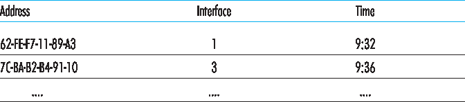

.. _c6.4:

6.4 交换式局域网
=================================================================
6.4 Switched Local Area Networks

在上一节中介绍了广播网络和多路访问协议后，接下来我们将关注交换式局域网。:ref:`图 6.15 <Figure 6.15>` 展示了一个使用四个交换机连接三个部门、两台服务器和一个路由器的交换式局域网。由于这些交换机在链路层工作，它们转发的是链路层帧（而非网络层数据报），不识别网络层地址，也不会像 RIP 或 OSPF 那样使用路由算法来确定穿越链路层交换网络的路径。我们很快会看到，这些交换机不是使用 IP 地址，而是使用链路层地址来转发链路层帧。我们将从链路层寻址开始学习交换式 LAN（:ref:`第 6.4.1 节 <c6.4.1>`）。随后我们将介绍著名的以太网协议（:ref:`第 6.4.2 节 <c6.4.2>`）。在了解链路层寻址和以太网后，我们将学习链路层交换机的工作原理（:ref:`第 6.4.3 节 <c6.4.3>`），然后进一步了解（:ref:`第 6.4.4 节 <c6.4.4>`）这些交换机如何用于构建大规模 LAN。

.. _Figure 6.15:

**图 6.15 一个由四个交换机连接构成的机构网络**

.. toggle::

   Having covered broadcast networks and multiple access protocols in the previous section, let’s turn our attention next to switched local networks. :ref:`Figure 6.15 <Figure 6.15>` shows a switched local network connecting three departments, two servers and a router with four switches. Because these switches operate at the link layer, they switch link-layer frames (rather than network-layer datagrams), don’t recognize network-layer addresses, and don’t use routing algorithms like RIP or OSPF to determine paths through the network of layer-2 switches. Instead of using IP addresses, we will soon see that they use link-layer addresses to forward link-layer frames through the network of switches. We’ll begin our study of switched LANs by first covering link-layer addressing (:ref:`Section 6.4.1 <c6.4.1>`). We then examine the celebrated Ethernet protocol (:ref:`Section 6.4.2 <c6.4.2>`). After examining link-layer addressing and Ethernet, we’ll look at how link-layer switches operate (:ref:`Section 6.4.3 <c6.4.3>`), and then see (:ref:`Section 6.4.4 <c6.4.4>`) how these switches are often used to build large-scale LANs.

   .. figure:: ../img/524-0.png
      :align: center 

   **Figure 6.15 An institutional network connected together by four switches**

.. _c6.4.1:

6.4.1 链路层寻址与 ARP
-----------------------------------------------------------------------
6.4.1 Link-Layer Addressing and ARP

主机和路由器都有链路层地址。你可能会感到惊讶，回想 :ref:`第 4 章 <c4>` 中提到主机和路由器也有网络层地址。你可能会问：为什么我们需要在网络层和链路层都使用地址？除了描述链路层地址的语法和功能外，本节还希望解释为何这两个层次的地址是有用的，事实上也是不可或缺的。我们还将介绍地址解析协议（ARP），它提供了一种将 IP 地址转换为链路层地址的机制。

.. toggle::

   Hosts and routers have link-layer addresses. Now you might find this surprising, recalling from :ref:`Chapter 4 <c4>` that hosts and routers have network-layer addresses as well. You might be asking, why in the world do we need to have addresses at both the network and link layers? In addition to describing the syntax and function of the link-layer addresses, in this section we hope to shed some light on why the two layers of addresses are useful and, in fact, indispensable. We’ll also cover the Address Resolution Protocol (ARP), which provides a mechanism to translate IP addresses to link-layer addresses.

MAC 地址
~~~~~~~~~~~~~~~~
MAC Addresses

实际上，拥有链路层地址的不是主机和路由器本身，而是它们的适配器（即网络接口）。因此，一个具有多个网络接口的主机或路由器将拥有多个与之相关联的链路层地址，就像它也会拥有多个 IP 地址一样。值得注意的是，链路层交换机的接口并不具有关联的链路层地址。这是因为链路层交换机的任务是将数据报在主机与路由器之间转发；交换机是透明地执行此任务的，即主机或路由器无需显式地将帧地址指向中间交换机。如 :ref:`图 6.16 <Figure 6.16>` 所示。链路层地址又被称为 **LAN 地址**、 **物理地址** 或 **MAC 地址**。由于 MAC 地址是最常见的术语，接下来我们将使用 MAC 地址来指代链路层地址。对于大多数 LAN（包括以太网和 802.11 无线局域网），MAC 地址长度为 6 字节，因此可能的 MAC 地址数为 :math:`2^{48}` 个。如 :ref:`图 6.16 <Figure 6.16>` 所示，这些 6 字节的地址通常使用十六进制表示，每个字节用两位十六进制数字表示。尽管 MAC 地址最初被设计为永久性的，但现在可以通过软件修改适配器的 MAC 地址。然而在本节余下部分中，我们假设适配器的 MAC 地址是固定不变的。

MAC 地址的一个有趣特性是，不会有两个适配器拥有相同的地址。考虑到适配器在许多国家由许多公司制造，这似乎令人惊讶。那么，一个在台湾制造适配器的公司如何确保其使用的地址与比利时制造商不同？答案是 IEEE 负责管理 MAC 地址空间。具体而言，当一个公司想要制造适配器时，它可以通过支付一定费用购买一段地址空间，共包含 :math:`2^{24}` 个地址。IEEE 通过固定 MAC 地址的前 24 位来分配地址段，然后允许公司为每个适配器设置唯一的后 24 位组合。

.. _Figure 6.16:

**图 6.16 连接到 LAN 的每个接口都有唯一的 MAC 地址**

适配器的 MAC 地址具有扁平结构（而非分层结构），且无论适配器移动到哪里都不会改变。一个带有以太网接口的笔记本无论在何处使用，其 MAC 地址始终相同。一个带有 802.11 接口的智能手机也是如此。相比之下，请记住 IP 地址具有分层结构（即网络部分与主机部分），并且当主机移动、即连接到不同网络时，其 IP 地址必须发生变化。适配器的 MAC 地址类似于一个人的社会保障号码（Social Security Number），它也具有扁平的地址结构，而且无论此人身处何地都不改变。而 IP 地址则类似于一个人的邮政地址，它是分层的，并且每次搬家时都必须更改。正如一个人拥有邮政地址和社会保障号码都是有用的，一个主机或路由器接口同时具有网络层地址和 MAC 地址也是非常有用的。

当一个适配器想要将帧发送到目标适配器时，发送方适配器会将目标适配器的 MAC 地址插入帧中，然后将帧发送到 LAN。如我们将会看到的，交换机有时会将接收到的帧广播到所有接口。我们还将在 :ref:`第 7 章 <Chapter 7>` 中看到 802.11 也会广播帧。因此，一个适配器有可能接收到不是发给它的帧。当适配器接收到一个帧时，它会检查帧中的目标 MAC 地址是否与自身的 MAC 地址匹配。如果匹配，适配器就会提取出封装的数据报，并将其向上传递至协议栈；如果不匹配，适配器就会丢弃该帧，而不会将该网络层数据报向上传递。因此，只有目标适配器会因接收帧而中断处理。

然而，有时发送适配器确实希望 LAN 上的所有其他适配器都接收并处理它即将发送的帧。在这种情况下，发送方适配器会在帧的目标地址字段中插入一个特殊的 MAC **广播地址**。对于使用 6 字节地址的 LAN（如以太网和 802.11），广播地址是一串连续的 48 个 1（即十六进制表示为 FF-FF-FF-FF-FF-FF）。

.. toggle::

   In truth, it is not hosts and routers that have link-layer addresses but rather their adapters (that is, network interfaces) that have link-layer addresses. A host or router with multiple network interfaces will thus have multiple link-layer addresses associated with it, just as it would also have multiple IP addresses associated with it. It's important to note, however, that link-layer switches do not have link- layer addresses associated with their interfaces that connect to hosts and routers. This is because the job of the link-layer switch is to carry datagrams between hosts and routers; a switch does this job transparently, that is, without the host or router having to explicitly address the frame to the intervening switch. This is illustrated in :ref:`Figure 6.16 <Figure 6.16>`. A link-layer address is variously called a **LAN address**, a **physical address**, or a **MAC address**. Because MAC address seems to be the most popular term, we’ll henceforth refer to link-layer addresses as MAC addresses. For most LANs (including Ethernet and 802.11 wireless LANs), the MAC address is 6 bytes long, giving 248 possible MAC addresses. As shown in :ref:`Figure 6.16 <Figure 6.16>`, these 6-byte addresses are typically expressed in hexadecimal notation, with each byte of the address expressed as a pair of hexadecimal numbers. Although MAC addresses were designed to be permanent, it is now possible to change an adapter’s MAC address via software. For the rest of this section, however, we’ll assume that an adapter’s MAC address is fixed.

   One interesting property of MAC addresses is that no two adapters have the same address. This might seem surprising given that adapters are manufactured in many countries by many companies. How does a company manufacturing adapters in Taiwan make sure that it is using different addresses from a company manufacturing adapters in Belgium? The answer is that the IEEE manages the MAC address space. In particular, when a company wants to manufacture adapters, it purchases a chunk of the address space consisting of 224 addresses for a nominal fee. IEEE allocates the chunk of 224 addresses by fixing the first 24 bits of a MAC address and letting the company create unique combinations of the last 24 bits for each adapter.

   .. figure:: ../img/526-0.png
      :align: center 

   **Figure 6.16 Each interface connected to a LAN has a unique MAC address**

   An adapter’s MAC address has a flat structure (as opposed to a hierarchical structure) and doesn’t change no matter where the adapter goes. A laptop with an Ethernet interface always has the same MAC address, no matter where the computer goes. A smartphone with an 802.11 interface always has the same MAC address, no matter where the smartphone goes. Recall that, in contrast, IP addresses have a hierarchical structure (that is, a network part and a host part), and a host’s IP addresses needs to be changed when the host moves, i.e., changes the network to which it is attached. An adapter’s MAC address is analogous to a person’s social security number, which also has a flat addressing structure and which doesn’t change no matter where the person goes. An IP address is analogous to a person’s postal address, which is hierarchical and which must be changed whenever a person moves. Just as a person may find it useful to have both a postal address and a social security number, it is useful for a host and router interfaces to have both a network-layer address and a MAC address.

   When an adapter wants to send a frame to some destination adapter, the sending adapter inserts the destination adapter’s MAC address into the frame and then sends the frame into the LAN. As we will soon see, a switch occasionally broadcasts an incoming frame onto all of its interfaces. We’ll see in :ref:`Chapter 7 <Chapter 7>` that 802.11 also broadcasts frames. Thus, an adapter may receive a frame that isn’t addressed to it. Thus, when an adapter receives a frame, it will check to see whether the destination MAC address in the frame matches its own MAC address. If there is a match, the adapter extracts the enclosed datagram and passes the datagram up the protocol stack. If there isn’t a match, the adapter discards the frame, without passing the network-layer datagram up. Thus, the destination only will be interrupted when the frame is received.

   However, sometimes a sending adapter does want all the other adapters on the LAN to receive and process the frame it is about to send. In this case, the sending adapter inserts a special MAC **broadcast address** into the destination address field of the frame. For LANs that use 6-byte addresses (such as Ethernet and 802.11), the broadcast address is a string of 48 consecutive 1s (that is, FF-FF-FF-FF-FF- FF in hexadecimal notation).

地址解析协议（ARP）
~~~~~~~~~~~~~~~~~~~~~~~~~~~~~~~~~~~
Address Resolution Protocol (ARP)

由于同时存在网络层地址（例如，互联网 IP 地址）和链路层地址（即 MAC 地址），因此需要在它们之间进行转换。对于互联网而言，这正是 **地址解析协议（ARP）** [:rfc:`826`] 的职责。

为了理解为何需要像 ARP 这样的协议，请参考 :ref:`图 6.17 <Figure 6.17>` 所示的网络。在这个简单的示例中，每个主机和路由器都有一个 IP 地址和一个 MAC 地址。像往常一样，IP 地址以点分十进制表示，MAC 地址以十六进制表示。

.. admonition:: 实践中的原理

   保持各层独立

   主机和路由器接口除了网络层地址之外，还拥有 MAC 地址，这背后有多个原因。首先，LAN 是为任意的网络层协议设计的，而不仅限于 IP 和互联网。如果适配器被分配的是 IP 地址而非“中性”的 MAC 地址，那么这些适配器将无法轻松支持其他网络层协议（例如 IPX 或 DECnet）。其次，如果适配器使用的是网络层地址而不是 MAC 地址，那么网络层地址就必须存储在适配器 RAM 中，并且每次适配器被移动（或重新上电）时都要重新配置。另一个方案是不在适配器中使用任何地址，而是让每个适配器将其接收到的每个帧中的数据（通常是 IP 数据报）都向上传递给协议栈。这样网络层可以检查是否存在匹配的网络层地址。但这种方法的一个问题是主机会被 LAN 上发送的每个帧打扰，包括发送给同一广播 LAN 上其他主机的帧。总之，为了使各层能够作为网络架构中基本上相互独立的构建块，不同的层需要拥有各自的地址机制。我们目前已看到三种类型的地址：应用层使用的主机名，网络层使用的 IP 地址，以及链路层使用的 MAC 地址。

在本节的讨论中，我们假设交换机会广播所有帧；也就是说，每当交换机在一个接口上接收到帧时，它就会将帧转发到其所有其他接口。在下一节中，我们将更准确地说明交换机是如何工作的。

.. _Figure 6.17:

**图 6.17 LAN 中的每个接口都有一个 IP 地址和一个 MAC 地址**

现在假设 IP 地址为 222.222.222.220 的主机希望向 IP 地址为 222.222.222.222 的主机发送一个 IP 数据报。在这个例子中，源主机和目标主机位于同一个子网中，其地址含义遵循 :ref:`第 4.3.3 节 <c4.3.3>` 中的描述。为了发送数据报，源主机除了需要提供 IP 数据报外，还必须提供目标主机 222.222.222.222 的 MAC 地址给其适配器。然后，发送适配器将构造一个包含目标 MAC 地址的链路层帧，并将该帧发送到 LAN 中。

本节要解决的重要问题是，发送主机如何确定 IP 地址为 222.222.222.222 的目标主机的 MAC 地址？正如你所猜测的，它使用 ARP。发送主机中的 ARP 模块将同一 LAN 上的任意 IP 地址作为输入，并返回对应的 MAC 地址。在当前示例中，发送主机 222.222.222.220 将 IP 地址 222.222.222.222 提供给其 ARP 模块，该模块返回相应的 MAC 地址 49-BD-D2-C7-56-2A。

由此可见，ARP 将 IP 地址解析为 MAC 地址。从某种角度来说，它类似于 :ref:`第 2.5 节 <c2.5>` 中学习的 DNS，后者将主机名解析为 IP 地址。然而，两者之间有一个重要的区别：DNS 可以解析整个互联网中主机的主机名，而 ARP 只能解析同一子网上的主机和路由器接口的 IP 地址。如果加利福尼亚的一个节点试图使用 ARP 解析密西西比的一个节点的 IP 地址，ARP 将返回错误。

.. _Figure 6.18:

**图 6.18 主机 222.222.222.220 中可能的 ARP 表**

现在我们已经说明了 ARP 的作用，接下来看看它是如何工作的。每个主机和路由器在其内存中都有一个 **ARP 表**，其中包含 IP 地址到 MAC 地址的映射。:ref:`图 6.18 <Figure 6.18>` 显示了主机 222.222.222.220 的 ARP 表可能是什么样子。ARP 表还包含一个生存时间（TTL）值，用于指示每条映射何时将被从表中删除。请注意，该表不一定包含子网上所有主机和路由器的条目；有些可能从未被加入表中，另一些则可能已过期。一个典型的条目过期时间是从插入 ARP 表起计的 20 分钟。

现在假设主机 222.222.222.220 希望向同一子网上的另一台主机或路由器发送一个 IP 数据报。发送主机需要根据 IP 地址获取目标的 MAC 地址。如果发送方的 ARP 表中已有目标节点的条目，这项任务就很容易完成。但如果 ARP 表当前没有该目标的条目呢？特别地，假设 222.222.222.220 想要向 222.222.222.222 发送数据报。在这种情况下，发送方使用 ARP 协议解析地址。首先，发送方构造一个称为 **ARP 报文** 的特殊数据包。ARP 报文包含多个字段，包括发送和接收的 IP 地址与 MAC 地址。ARP 查询和响应报文格式相同。ARP 查询报文的目的是向子网上所有其他主机和路由器广播，以确定与被解析的 IP 地址对应的 MAC 地址。

回到我们的示例，222.222.222.220 将 ARP 查询报文传递给其适配器，并指示适配器将该报文发送至 MAC 广播地址，即 FF-FF-FF-FF-FF-FF。适配器将 ARP 报文封装在链路层帧中，使用广播地址作为帧的目标地址，并将该帧发送到子网中。回想我们的社会保障号码/邮政地址的类比，ARP 查询就类似于某人站在一间隔间拥挤的办公室（例如 AnyCorp）中大声喊道：“谁是住在加州帕洛阿尔托 AnyCorp 112 室第 13 号隔间的人？他/她的社会保障号码是多少？”包含 ARP 查询的帧被子网上的所有其他适配器接收，并且（由于广播地址）每个适配器都会将帧中的 ARP 报文向上传递到其 ARP 模块。每个 ARP 模块检查其 IP 地址是否与 ARP 报文中的目标 IP 地址匹配。匹配的那个主机会向查询主机发送一份响应的 ARP 报文，内含所需的映射信息。查询主机 222.222.222.220 随后可以更新其 ARP 表，并将其 IP 数据报封装在以响应主机或路由器的 MAC 地址为目标地址的链路层帧中进行发送。

关于 ARP 协议，还有几点值得注意。首先，ARP 查询消息是通过广播帧发送的，而 ARP 响应消息则是通过标准帧发送的。在继续阅读之前，请思考为什么会这样。其次，ARP 是即插即用的；也就是说，ARP 表是自动构建的——不需要系统管理员手动配置。如果某主机从子网中断开连接，其条目最终会从该子网上的其他 ARP 表中被删除。

学生们常常疑惑 ARP 是链路层协议还是网络层协议。正如我们所见，ARP 报文是封装在链路层帧中的，因此在架构上位于链路层之上。然而，ARP 报文中包含链路层地址字段，因此它可以被认为是链路层协议；同时它还包含网络层地址，因此也可以被认为是网络层协议。最终来看，ARP 最好被认为是一个跨越链路层和网络层边界的协议——并不完全适合我们在 :ref:`第 1 章 <c1>` 中学习的简化分层协议栈结构。这就是现实世界协议的复杂性！

.. toggle::

   Because there are both network-layer addresses (for example, Internet IP addresses) and link-layer addresses (that is, MAC addresses), there is a need to translate between them. For the Internet, this is the job of the **Address Resolution Protocol (ARP)** [:rfc:`826`].

   To understand the need for a protocol such as ARP, consider the network shown in :ref:`Figure 6.17 <Figure 6.17>`. In this simple example, each host and router has a single IP address and single MAC address. As usual, IP addresses are shown in dotted-decimal

   .. admonition:: PRINCIPLES IN PRACTICE

      KEEPING THE LAYERS INDEPENDENT

      There are several reasons why hosts and router interfaces have MAC addresses in ­addition to network-layer addresses. First, LANs are designed for arbitrary network-layer protocols, not just for IP and the Internet. If adapters were assigned IP addresses rather than “neutral” MAC addresses, then adapters would not easily be able to support other network-layer protocols (for example, IPX or DECnet). Second, if adapters were to use network-layer addresses instead of MAC addresses, the network-layer address would have to be stored in the adapter RAM and reconfigured every time the adapter was moved (or powered up). Another option is to not use any addresses in the adapters and have each adapter pass the data (typically, an IP datagram) of each frame it receives up the protocol stack. The network layer could then check for a matching network-layer address. One problem with this option is that the host would be interrupted by every frame sent on the LAN, including by frames that were destined for other hosts on the same broadcast LAN. In summary, in order for the layers to be largely independent building blocks in a network architecture, different layers need to have their own addressing scheme. We have now seen three types of addresses: host names for the application layer, IP addresses for the network layer, and MAC addresses for the link layer.
   
      notation and MAC addresses are shown in hexadecimal notation. For the purposes of this discussion, we will assume in this section that the switch broadcasts all frames; that is, whenever a switch receives a frame on one interface, it forwards the frame on all of its other interfaces. In the next section, we will provide a more accurate explanation of how switches operate.

      .. figure:: ../img/528-0.png
         :align: center 

      **Figure 6.17 Each interface on a LAN has an IP address and a MAC address**

      Now suppose that the host with IP address 222.222.222.220 wants to send an IP datagram to host 222.222.222.222. In this example, both the source and destination are in the same subnet, in the addressing sense of :ref:`Section 4.3.3 <c4.3.3>`. To send a datagram, the source must give its adapter not only the IP datagram but also the MAC address for destination 222.222.222.222. The sending adapter will then construct a link-layer frame containing the destination’s MAC address and send the frame into the LAN.

      The important question addressed in this section is, How does the sending host determine the MAC address for the destination host with IP address 222.222.222.222? As you might have guessed, it uses ARP. An ARP module in the sending host takes any IP address on the same LAN as input, and returns the corresponding MAC address. In the example at hand, sending host 222.222.222.220 provides its ARP module the IP address 222.222.222.222, and the ARP module returns the corresponding MAC address 49-BD-D2-C7-56-2A.

      So we see that ARP resolves an IP address to a MAC address. In many ways it is analogous to DNS (studied in :ref:`Section 2.5 <c2.5>`), which resolves host names to IP addresses. However, one important difference between the two resolvers is that DNS resolves host names for hosts anywhere in the Internet, whereas ARP resolves IP addresses only for hosts and router interfaces on the same subnet. If a node in California were to try to use ARP to resolve the IP address for a node in Mississippi, ARP would return with an error.

      .. figure:: ../img/529-0.png
         :align: center 

      **Figure 6.18 A possible ARP table in 222.222.222.220**

   Now that we have explained what ARP does, let’s look at how it works. Each host and router has an **ARP table** in its memory, which contains mappings of IP addresses to MAC addresses. :ref:`Figure 6.18 <Figure 6.18>` shows what an ARP table in host 222.222.222.220 might look like. The ARP table also contains a time-to-live (TTL) value, which indicates when each mapping will be deleted from the table. Note that a table does not necessarily contain an entry for every host and router on the subnet; some may have never been entered into the table, and others may have expired. A typical expiration time for an entry is 20 minutes from when an entry is placed in an ARP table.

   Now suppose that host 222.222.222.220 wants to send a datagram that is IP-addressed to another host or router on that subnet. The sending host needs to obtain the MAC address of the destination given the IP address. This task is easy if the sender’s ARP table has an entry for the destination node. But what if the ARP table doesn’t currently have an entry for the destination? In particular, suppose 222.222.222.220 wants to send a datagram to 222.222.222.222. In this case, the sender uses the ARP protocol to resolve the address. First, the sender constructs a special packet called an **ARP packet**. An ARP packet has several fields, including the sending and receiving IP and MAC addresses. Both ARP query and response packets have the same format. The purpose of the ARP query packet is to query all the other hosts and routers on the subnet to determine the MAC address corresponding to the IP address that is being resolved.

   Returning to our example, 222.222.222.220 passes an ARP query packet to the adapter along with an indication that the adapter should send the packet to the MAC broadcast address, namely, FF-FF-FF- FF-FF-FF. The adapter encapsulates the ARP packet in a link-layer frame, uses the broadcast address for the frame’s destination address, and transmits the frame into the subnet. Recalling our social security ­number/postal address analogy, an ARP query is equivalent to a person shouting out in a crowded room of cubicles in some company (say, AnyCorp): “What is the social security number of the person whose postal address is Cubicle 13, Room 112, AnyCorp, Palo Alto, California?” The frame containing the ARP query is received by all the other adapters on the subnet, and (because of the broadcast address) each adapter passes the ARP packet within the frame up to its ARP module. Each of these ARP modules checks to see if its IP address matches the destination IP address in the ARP packet. The one with a match sends back to the querying host a response ARP packet with the desired mapping. The querying host 222.222.222.220 can then update its ARP table and send its IP datagram, encapsulated in a link-layer frame whose destination MAC is that of the host or router responding to the earlier ARP query.

   There are a couple of interesting things to note about the ARP protocol. First, the query ARP message is sent within a broadcast frame, whereas the response ARP message is sent within a standard frame. Before reading on you should think about why this is so. Second, ARP is plug-and-play; that is, an ARP table gets built ­automatically—it doesn’t have to be configured by a system administrator. And if a host becomes disconnected from the subnet, its entry is eventually deleted from the other ARP tables in the subnet.

   Students often wonder if ARP is a link-layer protocol or a network-layer protocol. As we’ve seen, an ARP packet is encapsulated within a link-layer frame and thus lies architecturally above the link layer. However, an ARP packet has fields containing link-layer addresses and thus is arguably a link-layer protocol, but it also contains network-layer addresses and thus is also arguably a network-layer protocol. In the end, ARP is probably best considered a protocol that straddles the boundary between the link and network layers—not fitting neatly into the simple layered protocol stack we studied in :ref:`Chapter 1 <c1>`. Such are the complexities of real-world protocols!

将数据报发送到子网外
~~~~~~~~~~~~~~~~~~~~~~~~~~~~~~~~~~~
Sending a Datagram off the Subnet

现在我们已经清楚当主机想要向同一子网上的另一主机发送数据报时 ARP 是如何工作的了。但现在我们来看一个更复杂的情况：当一个子网上的主机想要将一个网络层数据报发送到子网外的另一主机（即，通过路由器到另一个子网）时该怎么办。我们将在 :ref:`图 6.19 <Figure 6.19>` 的上下文中讨论这个问题，该图展示了由一个路由器互连的两个子网组成的简单网络。

关于 :ref:`图 6.19 <Figure 6.19>` 有几个有趣的点需要注意。每个主机恰好有一个 IP 地址和一个适配器。但如 :ref:`第 4 章 <c4>` 所讨论的，一个路由器对其每个接口都有一个 IP 地址。对于每个路由器接口，路由器中还有一个 ARP 模块和一个适配器。因为 :ref:`图 6.19 <Figure 6.19>` 中的路由器有两个接口，所以它有两个 IP 地址、两个 ARP 模块和两个适配器。当然，网络中的每个适配器都有其自己的 MAC 地址。

.. _Figure 6.19:

**图 6.19 通过路由器互连的两个子网**

还要注意的是，子网 1 的网络地址是 111.111.111/24，子网 2 的网络地址是 222.222.222/24。因此，连接到子网 1 的所有接口地址都以 111.111.111.xxx 的形式出现，而连接到子网 2 的所有接口地址都以 222.222.222.xxx 的形式出现。

现在我们来看看子网 1 上的主机如何向子网 2 上的主机发送数据报。具体来说，假设主机 111.111.111.111 想要将一个 IP 数据报发送到主机 222.222.222.222。像往常一样，发送主机会将数据报传递给其适配器。但发送主机还必须向其适配器指明一个合适的目标 MAC 地址。适配器应该使用哪个 MAC 地址呢？有人可能会猜测应该使用主机 222.222.222.222 的适配器的 MAC 地址，也就是 49-BD-D2-C7-56-2A。然而，这个猜测是错误的！如果发送适配器使用了这个 MAC 地址，那么子网 1 上的任何适配器都不会将该 IP 数据报向上传递到其网络层，因为该帧的目标地址与子网 1 上任何适配器的 MAC 地址都不匹配。这个数据报将会被“打回天堂”。

如果我们仔细观察 :ref:`图 6.19 <Figure 6.19>`，可以看到为了将数据报从 111.111.111.111 发送到子网 2 的某个主机，数据报必须首先被发送到路由器接口 111.111.111.110，也就是通向最终目的地的第一跳路由器的 IP 地址。因此，帧的合适 MAC 地址是路由器接口 111.111.111.110 的适配器地址，即 E6-E9-00-17-BB-4B。发送主机是如何获取 111.111.111.110 的 MAC 地址的呢？当然是通过 ARP！一旦发送适配器获得了这个 MAC 地址，它就会创建一个帧（其中包含目标为 222.222.222.222 的数据报）并将该帧发送到子网 1。子网 1 上的路由器适配器看到链路层帧是发给它的，因此会将该帧传递给路由器的网络层。太好了——IP 数据报已经成功地从源主机传送到了路由器！但我们还没有完成任务。我们仍然需要将数据报从路由器传送到目的主机。现在路由器必须确定数据报应被转发的正确接口。如 :ref:`第 4 章 <c4>` 所讨论的，这通过查阅路由器中的转发表来完成。转发表告诉路由器该数据报应通过路由器接口 222.222.222.220 转发。然后该接口将数据报传递给其适配器，该适配器将数据报封装到一个新的帧中并将该帧发送到子网 2。这一次，帧的目标 MAC 地址确实是最终目的主机的 MAC 地址。而路由器是如何获得这个目标 MAC 地址的呢？当然还是通过 ARP！

以太网的 ARP 定义在 :rfc:`826` 中。一个关于 ARP 的很好的介绍可见于 TCP/IP 教程 :rfc:`1180` 。我们将在课后习题中更深入地探索 ARP。

.. toggle::

   It should now be clear how ARP operates when a host wants to send a datagram to another host on the same subnet. But now let’s look at the more complicated situation when a host on a subnet wants to send a network-layer datagram to a host off the subnet (that is, across a router onto another subnet). Let’s discuss this issue in the context of :ref:`Figure 6.19 <Figure 6.19>`, which shows a simple network consisting of two subnets interconnected by a router.

   There are several interesting things to note about :ref:`Figure 6.19 <Figure 6.19>`. Each host has exactly one IP address and one adapter. But, as discussed in :ref:`Chapter 4 <c4>`, a router has an IP address for each of its interfaces. For each router interface there is also an ARP module (in the router) and an adapter. Because the router in :ref:`Figure 6.19 <Figure 6.19>` has two interfaces, it has two IP addresses, two ARP modules, and two adapters. Of course, each adapter in the network has its own MAC address.

   .. figure:: ../img/530-0.png
      :align: center

   **Figure 6.19 Two subnets interconnected by a router**

   Also note that Subnet 1 has the network address 111.111.111/24 and that Subnet 2 has the network address 222.222.222/24. Thus all of the interfaces connected to Subnet 1 have addresses of the form 111.111.111.xxx and all of the interfaces connected to Subnet 2 have addresses of the form 222.222.222.xxx.

   Now let’s examine how a host on Subnet 1 would send a datagram to a host on Subnet 2. Specifically, suppose that host 111.111.111.111 wants to send an IP datagram to a host 222.222.222.222. The sending host passes the datagram to its adapter, as usual. But the sending host must also indicate to its adapter an appropriate destination MAC address. What MAC address should the adapter use? One might be tempted to guess that the appropriate MAC address is that of the adapter for host 222.222.222.222, namely, 49-BD-D2-C7-56-2A. This guess, however, would be wrong! If the sending adapter were to use that MAC address, then none of the ­adapters on Subnet 1 would bother to pass the IP datagram up to its network layer, since the frame’s destination address would not match the MAC address of any adapter on Subnet 1. The datagram would just die and go to datagram heaven.

   If we look carefully at :ref:`Figure 6.19 <Figure 6.19>`, we see that in order for a datagram to go from 111.111.111.111 to a host on Subnet 2, the datagram must first be sent to the router interface 111.111.111.110, which is the IP address of the first-hop router on the path to the final destination. Thus, the appropriate MAC address for the frame is the address of the adapter for router interface 111.111.111.110, namely, E6-E9-00-17- BB-4B. How does the sending host acquire the MAC address for 111.111.111.110? By using ARP, of course! Once the sending adapter has this MAC address, it creates a frame (containing the datagram addressed to 222.222.222.222) and sends the frame into Subnet 1. The router adapter on Subnet 1 sees that the link-layer frame is addressed to it, and therefore passes the frame to the network layer of the router. Hooray—the IP datagram has successfully been moved from source host to the router! But we are not finished. We still have to move the datagram from the router to the destination. The router now has to determine the correct interface on which the datagram is to be forwarded. As discussed in :ref:`Chapter 4 <c4>`, this is done by consulting a forwarding table in the router. The forwarding table tells the router that the datagram is to be forwarded via router interface 222.222.222.220. This interface then passes the datagram to its adapter, which encapsulates the datagram in a new frame and sends the frame into Subnet 2. This time, the destination MAC address of the frame is indeed the MAC address of the ultimate destination. And how does the router obtain this destination MAC address? From ARP, of course!

   ARP for Ethernet is defined in RFC 826. A nice introduction to ARP is given in the TCP/IP tutorial, RFC 1180. We’ll explore ARP in more detail in the homework problems.

.. _c6.4.2:

6.4.2 以太网
-----------------------------------------------------------------------
6.4.2 Ethernet

以太网几乎已经完全主导了有线局域网市场。在 1980 年代和 1990 年代初期，以太网曾面临来自其他局域网技术的许多挑战，包括令牌环、FDDI 和 ATM。其中一些其他技术曾在几年间占据了局域网市场的一部分。但自 1970 年代中期发明以来，以太网不断发展壮大，并始终保持其主导地位。如今，以太网无疑是最普遍的有线局域网技术，并且在可预见的未来仍将如此。可以说，以太之于局域网，如同互联网之于全球网络。

以太网成功的原因有很多。首先，以太网是第一个被广泛部署的高速局域网。由于部署较早，网络管理员对以太网非常熟悉——无论是其优势还是缺点——这也使得他们在新技术出现时不愿切换。其次，令牌环、FDDI 和 ATM 相比以太网更复杂、更昂贵，这也进一步劝退了网络管理员放弃以太网。第三，促使人们切换到其他局域网技术（如 FDDI 或 ATM）的主要原因通常是新技术的数据速率更高；然而，以太网总能迎头赶上，推出数据速率相同或更高的版本。1990 年代初期还引入了交换式以太网，进一步提高了其有效数据速率。最后，由于以太网极其流行，以太网硬件（特别是适配器和交换机）已经成为一种商品，其价格非常低廉。

最早的以太网局域网是由 Bob Metcalfe 和 David Boggs 于 1970 年代中期发明的。最初的以太网局域网使用同轴电缆总线来连接各个节点。实际上，这种总线拓扑的以太网一直持续到 1980 年代并延续到 1990 年代中期。采用总线拓扑的以太网是一个广播局域网——所有发送的帧都会传送到总线上，并被连接到总线上的所有适配器处理。回顾一下，我们在 :ref:`第 6.3.2 节 <c6.3.2>` 中介绍了以太网的 CSMA/CD 多路访问协议及其二进制指数退避算法。

到了 1990 年代末，大多数公司和大学已经用基于集线器的星型拓扑的以太网取代了旧有的局域网。在这种部署中，主机（和路由器）通过双绞铜线直接连接到集线器。**集线器（hub）** 是一个物理层设备，处理的是单个位而非整个帧。当一个代表 0 或 1 的位从一个接口到达时，集线器只是简单地重新生成这个位，增强其信号强度，并将其发送到所有其他接口上。因此，基于集线器星型拓扑的以太网同样是一个广播局域网——每当集线器从某个接口接收到一个位时，它都会将该位的副本发送到所有其他接口。尤其是当集线器同时从两个不同接口接收到帧时，会发生冲突，发送这些帧的节点必须重新传输。

进入 2000 年代初，以太网再次经历了一个重要的演进变化。以太网部署仍使用星型拓扑，但中心的集线器被一个 **交换机（switch）** 取代。我们将在本章后面深入研究交换式以太网。此处我们仅指出，交换机不仅“无冲突”，而且是真正的存储-转发型分组交换设备；但与运行至第 3 层的路由器不同，交换机仅运行至第 2 层。

.. _Figure 6.20:

**图 6.20 以太网帧结构**

.. toggle::

   Ethernet has pretty much taken over the wired LAN market. In the 1980s and the early 1990s, Ethernet faced many challenges from other LAN technologies, ­including token ring, FDDI, and ATM. Some of these other technologies succeeded in capturing a part of the LAN market for a few years. But since its invention in the mid-1970s, Ethernet has continued to evolve and grow and has held on to its dominant position. Today, Ethernet is by far the most prevalent wired LAN technology, and it is likely to remain so for the foreseeable future. One might say that Ethernet has been to local area networking what the Internet has been to global networking.

   There are many reasons for Ethernet’s success. First, Ethernet was the first widely deployed high-speed LAN. Because it was deployed early, network administrators became intimately familiar with Ethernet— its wonders and its quirks—and were reluctant to switch over to other LAN technologies when they came on the scene. Second, token ring, FDDI, and ATM were more complex and expensive than Ethernet, which further discouraged network administrators from switching over. Third, the most compelling reason to switch to another LAN technology (such as FDDI or ATM) was usually the higher data rate of the new technology; however, Ethernet always fought back, producing versions that operated at equal data rates or higher. Switched Ethernet was also introduced in the early 1990s, which further increased its effective data rates. Finally, because Ethernet has been so popular, Ethernet hardware (in particular, adapters and switches) has become a commodity and is remarkably cheap.

   The original Ethernet LAN was invented in the mid-1970s by Bob Metcalfe and David Boggs. The original Ethernet LAN used a coaxial bus to interconnect the nodes. Bus topologies for Ethernet actually persisted throughout the 1980s and into the mid-1990s. Ethernet with a bus topology is a broadcast LAN
   —all transmitted frames travel to and are processed by all adapters connected to the bus. Recall that we covered Ethernet’s CSMA/CD multiple access protocol with binary exponential backoff in :ref:`Section 6.3.2 <c6.3.2>`.

   By the late 1990s, most companies and universities had replaced their LANs with Ethernet installations using a hub-based star topology. In such an installation the hosts (and routers) are directly connected to a hub with twisted-pair copper wire. A **hub** is a physical-layer device that acts on individual bits rather than frames. When a bit, representing a zero or a one, arrives from one interface, the hub simply re-creates the bit, boosts its energy strength, and transmits the bit onto all the other interfaces. Thus, Ethernet with a hub-based star topology is also a broadcast LAN—whenever a hub receives a bit from one of its interfaces, it sends a copy out on all of its other interfaces. In particular, if a hub receives frames from two different interfaces at the same time, a collision occurs and the nodes that created the frames must retransmit.

   In the early 2000s Ethernet experienced yet another major evolutionary change. Ethernet installations continued to use a star topology, but the hub at the center was replaced with a **switch**. We’ll be examining switched Ethernet in depth later in this chapter. For now, we only mention that a switch is not only “collision-less” but is also a bona-fide store-and-forward packet switch; but unlike routers, which operate up through layer 3, a switch operates only up through layer 2.

   .. figure:: ../img/533-0.png
      :align: center 

   **Figure 6.20 Ethernet frame structure**

以太网帧结构
~~~~~~~~~~~~~~~~~~~~~~~~~
Ethernet Frame Structure

通过检查以太网帧，我们可以学到很多关于以太网的知识，如 :ref:`图 6.20 <Figure 6.20>` 所示。为了让本节关于以太网帧的讨论更具实际背景，让我们考虑一个场景：从一个主机向同一以太网 LAN 上的另一个主机发送 IP 数据报（例如，:ref:`图 6.17 <Figure 6.17>` 中的以太网 LAN）。虽然我们以 IP 数据报作为以太网帧的有效载荷，但需要注意的是，以太网帧也可以承载其他网络层的数据包。设发送适配器 A 的 MAC 地址为 AA-AA-AA-AA-AA-AA，接收适配器 B 的 MAC 地址为 BB-BB-BB-BB-BB-BB。发送适配器将 IP 数据报封装进以太网帧并将该帧传递给物理层。接收适配器从物理层接收到帧，提取出 IP 数据报，并将其传递给网络层。在这一背景下，让我们现在来查看如 :ref:`图 6.20 <Figure 6.20>` 所示的以太网帧的六个字段。

- **数据字段（46 到 1,500 字节）**。该字段承载 IP 数据报。以太网的最大传输单元（MTU）为 1,500 字节。这意味着如果 IP 数据报超过 1,500 字节，主机必须对其进行分片，如第 4.3.2 节中所述。数据字段的最小长度为 46 字节。这意味着如果 IP 数据报小于 46 字节，必须对该字段进行“填充”以扩展至 46 字节。当使用填充时，传递给网络层的数据将包含填充值以及 IP 数据报。网络层使用 IP 数据报头中的长度字段来移除填充值。

- **目的地址（6 字节）**。该字段包含目标适配器的 MAC 地址，即 BB-BB-BB-BB-BB-BB。当适配器 B 接收到一个目标地址为 BB-BB-BB-BB-BB-BB 或 MAC 广播地址的以太网帧时，它会将帧中数据字段的内容传递给网络层；如果接收到的帧具有其他 MAC 地址，则丢弃该帧。

- **源地址（6 字节）**。该字段包含发送帧到 LAN 的适配器的 MAC 地址，本例中为 AA-AA-AA-AA-AA-AA。

- **类型字段（2 字节）**。类型字段允许以太网复用多个网络层协议。理解这一点时需记住，主机除了 IP 之外，还可以使用其他网络层协议。事实上，一个主机可能支持多个网络层协议，并在不同应用中使用不同协议。因此，当以太网帧到达适配器 B 时，适配器 B 需要知道应将数据字段的内容传递（即解复用）给哪个网络层协议。IP 和其他网络层协议（例如 Novell IPX 或 AppleTalk）各自有标准化的类型编号。此外，ARP 协议（上一节讨论）也有自己的类型编号，如果接收到的帧包含一个 ARP 数据包（即类型字段为十六进制的 0806），该数据包将被解复用给 ARP 协议。注意，类型字段类似于网络层数据报中的协议字段和传输层段中的端口号字段；这些字段的作用都是将某一层的协议与上一层的协议连接起来。

- **循环冗余校验（CRC）（4 字节）**。如 :ref:`第 6.2.3 节 <c6.2.3>` 所述，CRC 字段用于允许接收适配器 B 检测帧中的比特错误。

- **前导码（8 字节）**。以太网帧以一个 8 字节的前导码字段开始。前 7 个字节的取值为 10101010，最后一个字节为 10101011。前 7 个字节用于“唤醒”接收适配器并使其时钟与发送方的时钟同步。为什么时钟会不同步？请记住，适配器 A 以 10 Mbps、100 Mbps 或 1 Gbps 的速率发送帧，具体取决于以太网 LAN 的类型。然而，由于没有绝对完美的设备，适配器 A 发送帧的速率并不总是完全符合目标速率，总会存在某种漂移，这种漂移对 LAN 上的其他适配器而言是未知的。接收适配器可以通过锁定前导码前 7 个字节中的比特来同步到 A 的时钟。第 8 个字节的最后两个比特（即连续的两个 1）会提醒适配器 B：“重要内容”即将到来。

所有以太网技术都为网络层提供无连接服务。也就是说，当适配器 A 想要向适配器 B 发送数据报时，它会将该数据报封装在以太网帧中并直接发送到 LAN 中，而无需事先与适配器 B 进行握手。这种第 2 层的无连接服务类似于 IP 的第 3 层数据报服务和 UDP 的第 4 层无连接服务。

以太网技术为网络层提供的是不可靠服务。具体来说，当适配器 B 从适配器 A 接收到帧后，会对其进行 CRC 检查，但不会在帧通过 CRC 检查时发送确认，也不会在帧未通过 CRC 检查时发送否定确认。如果帧未通过 CRC 检查，适配器 B 就直接丢弃该帧。因此，适配器 A 无法知道其发送的帧是否到达了 B 并通过了 CRC 检查。这种在链路层缺乏可靠传输的特性，使以太网得以保持简单和低成本。但它也意味着传递给网络层的数据报流可能会存在缺失。

.. admonition:: 案例回顾

    **BOB METCALFE 与以太网**

    1970 年代初，Bob Metcalfe 还是哈佛大学的博士生时，在 MIT 参与了 ARPAnet 的工作。在学习期间，他也接触到了 Abramson 关于 ALOHA 和随机访问协议的研究。在完成博士学位并即将加入施乐帕洛阿尔托研究中心（Xerox PARC）工作之前，他曾访问 Abramson 和夏威夷大学的同事三个月，亲眼见识了 ALOHAnet。在 Xerox PARC，Metcalfe 接触到了 Alto 计算机，这些计算机在很多方面是 1980 年代个人电脑的先驱。Metcalfe 意识到需要一种廉价的方式来连接这些计算机。于是，他凭借对 ARPAnet、ALOHA 和随机访问协议的知识，联合同事 David Boggs 发明了以太网。

    Metcalfe 和 Boggs 最初的以太网速率为 2.94 Mbps，可连接多达 256 台主机，最大距离可达一英里。他们成功地使 Xerox PARC 的大部分研究人员通过 Alto 计算机进行通信。之后，Metcalfe 促成了 Xerox、Digital 和 Intel 三方联盟，共同将以太网确立为 10 Mbps 的 IEEE 标准。Xerox 对商业化以太网兴趣不大。1979 年，Metcalfe 创办了自己的公司 3Com，该公司开发并商业化了包括以太网在内的网络技术。特别是，3Com 在 1980 年代初为当时非常流行的 IBM PC 开发并销售以太网卡。

如果由于丢弃以太网帧而产生数据缺口，Host B 上的应用是否也会看到这些缺口？正如我们在 :ref:`第 3 章 <c3>` 中学到的，这取决于应用是使用 UDP 还是 TCP。如果应用使用 UDP，那么 Host B 中的应用确实会看到数据缺口。另一方面，如果应用使用 TCP，那么 Host B 中的 TCP 不会确认包含丢弃帧中的数据，导致 Host A 中的 TCP 重新传输。需要注意的是，当 TCP 重新传输数据时，这些数据最终会再次返回到原来被丢弃的以太网适配器。因此，从这个意义上讲，以太网实现了数据的重传，尽管它并不知道它所传输的数据报是全新的，还是已经传输过至少一次的数据。

.. toggle::

   We can learn a lot about Ethernet by examining the Ethernet frame, which is shown in :ref:`Figure 6.20 <Figure 6.20>`. To give this discussion about Ethernet frames a tangible context, let’s consider sending an IP datagram from one host to another host, with both hosts on the same Ethernet LAN (for example, the Ethernet LAN in :ref:`Figure 6.17 <Figure 6.17>`.) (Although the payload of our Ethernet frame is an IP datagram, we note that an Ethernet frame can carry other network-layer packets as well.) Let the sending adapter, adapter A, have the MAC address AA-AA-AA-AA-AA-AA and the receiving adapter, adapter B, have the MAC address BB-BB-BB-BB-BB-BB. The sending adapter encapsulates the IP datagram within an Ethernet frame and passes the frame to the physical layer. The receiving adapter receives the frame from the physical layer, extracts the IP datagram, and passes the IP datagram to the network layer. In this context, let’s now examine the six fields of the Ethernet frame, as shown in :ref:`Figure 6.20 <Figure 6.20>`.

   - **Data field (46 to 1,500 bytes)**. This field carries the IP datagram. The maximum transmission unit (MTU) of Ethernet is 1,500 bytes. This means that if the IP datagram exceeds 1,500 bytes, then the host has to fragment the datagram, as discussed in Section 4.3.2. The minimum size of the data field is 46 bytes. This means that if the IP datagram is less than 46 bytes, the data field has to be “stuffed” to fill it out to 46 bytes. When stuffing is used, the data passed to the network layer contains the stuffing as well as an IP datagram. The network layer uses the length field in the IP datagram header to remove the stuffing.
   - **Destination address (6 bytes)**. This field contains the MAC address of the destination adapter, BB- BB-BB-BB-BB-BB. When adapter B receives an Ethernet frame whose destination address is either BB-BB-BB-BB-BB-BB or the MAC broadcast address, it passes the contents of the frame’s data field to the network layer; if it receives a frame with any other MAC address, it discards the frame.
   - **Source address (6 bytes)**. This field contains the MAC address of the adapter that transmits the frame onto the LAN, in this example, AA-AA-AA-AA-AA-AA.
   - **Type field (2 bytes)**. The type field permits Ethernet to multiplex network-layer protocols. To understand this, we need to keep in mind that hosts can use other network-layer protocols besides IP. In fact, a given host may support multiple network-layer protocols using different protocols for different applications. For this reason, when the Ethernet frame arrives at adapter B, adapter B needs to know to which network-layer protocol it should pass (that is, demultiplex) the contents of the data field. IP and other network-layer protocols (for example, Novell IPX or AppleTalk) each have their own, standardized type number. Furthermore, the ARP protocol (discussed in the previous section) has its own type number, and if the arriving frame contains an ARP packet (i.e., has a type field of 0806 hexadecimal), the ARP packet will be demultiplexed up to the ARP protocol. Note that the type field is analogous to the protocol field in the network-layer datagram and the port-number fields in the transport-layer segment; all of these fields serve to glue a protocol at one layer to a protocol at the layer above.
   - **Cyclic redundancy check (CRC) (4 bytes)**. As discussed in :ref:`Section 6.2.3 <c6.2.3>`, the purpose of the CRC field is to allow the receiving adapter, adapter B, to detect bit errors in the frame.
   - **Preamble (8 bytes)**. The Ethernet frame begins with an 8-byte preamble field. Each of the first 7 bytes of the preamble has a value of 10101010; the last byte is 10101011. The first 7 bytes of the preamble serve to “wake up” the receiving adapters and to synchronize their clocks to that of the sender’s clock. Why should the clocks be out of synchronization? Keep in mind that adapter A aims to transmit the frame at 10 Mbps, 100 Mbps, or 1 Gbps, depending on the type of Ethernet LAN. However, because nothing is absolutely perfect, adapter A will not transmit the frame at exactly the target rate; there will always be some drift from the target rate, a drift which is not known a priori by the other adapters on the LAN. A receiving adapter can lock onto adapter A’s clock simply by locking onto the bits in the first 7 bytes of the preamble. The last 2 bits of the eighth byte of the preamble (the first two consecutive 1s) alert adapter B that the “important stuff” is about to come.

   All of the Ethernet technologies provide connectionless service to the network layer. That is, when adapter A wants to send a datagram to adapter B, adapter A encapsulates the datagram in an Ethernet frame and sends the frame into the LAN, without first handshaking with adapter B. This layer-2 connectionless service is analogous to IP’s layer-3 datagram service and UDP’s layer-4 connectionless service.

   Ethernet technologies provide an unreliable service to the network layer. Specifically, when adapter B receives a frame from adapter A, it runs the frame through a CRC check, but neither sends an acknowledgment when a frame passes the CRC check nor sends a negative acknowledgment when a frame fails the CRC check. When a frame fails the CRC check, adapter B simply discards the frame. Thus, adapter A has no idea whether its transmitted frame reached adapter B and passed the CRC check. This lack of reliable transport (at the link layer) helps to make Ethernet simple and cheap. But it also means that the stream of datagrams passed to the network layer can have gaps.

   .. admonition:: CASE HISTORY

      **BOB METCALFE AND ETHERNET**

      As a PhD student at Harvard University in the early 1970s, Bob Metcalfe worked on the ARPAnet at MIT. During his studies, he also became exposed to Abramson’s work on ALOHA and random access protocols. After completing his PhD and just before beginning a job at Xerox Palo Alto Research Center (Xerox PARC), he visited Abramson and his University of Hawaii colleagues for three months, getting a firsthand look at ALOHAnet. At Xerox PARC, Metcalfe became exposed to Alto computers, which in many ways were the forerunners of the personal computers of the 1980s. Metcalfe saw the need to network these computers in an inexpensive manner. So armed with his knowledge about ARPAnet, ALOHAnet, and random access protocols, Metcalfe—along with colleague David Boggs—invented Ethernet.

      Metcalfe and Boggs’s original Ethernet ran at 2.94 Mbps and linked up to 256 hosts separated by up to one mile. Metcalfe and Boggs succeeded at getting most of the researchers at Xerox PARC to communicate through their Alto computers. Metcalfe then forged an alliance between Xerox, Digital, and Intel to establish Ethernet as a 10 Mbps Ethernet standard, ratified by the IEEE. Xerox did not show much interest in commercializing Ethernet. In 1979, Metcalfe formed his own company, 3Com, which developed and commercialized networking technology, including Ethernet technology. In particular, 3Com developed and marketed Ethernet cards in the early 1980s for the immensely popular IBM PCs.

   If there are gaps due to discarded Ethernet frames, does the application at Host B see gaps as well? As we learned in :ref:`Chapter 3 <c3>`, this depends on whether the application is using UDP or TCP. If the application is using UDP, then the application in Host B will indeed see gaps in the data. On the other hand, if the application is using TCP, then TCP in Host B will not acknowledge the data contained in discarded frames, causing TCP in Host A to retransmit. Note that when TCP retransmits data, the data will eventually return to the Ethernet adapter at which it was discarded. Thus, in this sense, Ethernet does retransmit data, although Ethernet is unaware of whether it is transmitting a brand-new datagram with brand-new data, or a datagram that contains data that has already been transmitted at least once.

以太网技术
~~~~~~~~~~~~~~~~~~~~~~~
Ethernet Technologies

在上面的讨论中，我们将以太网视为一个单一的协议标准。但实际上，以太网有许多不同的版本，带有一些令人眼花缭乱的缩写，例如 10BASE-T、10BASE-2、100BASE-T、1000BASE-LX、10GBASE-T 和 40GBASE-T。这些以及其他许多以太网技术多年来由 IEEE 802.3 CSMA/CD（以太网）工作组标准化 :ref:`[IEEE 802.3 2012] <IEEE 802.3 2012>`。虽然这些缩写看起来令人困惑，但实际上是有规律可循的。缩写的第一部分表示标准的速率：10、100、1000 或 10G，分别代表 10 兆比特（每秒）、100 兆比特、千兆、10 千兆和 40 千兆以太网。“BASE”表示基带以太网，意思是物理介质仅承载以太网流量；几乎所有的 802.3 标准都用于基带以太网。缩写的最后一部分表示物理介质本身；以太网既是链路层规范，也是物理层规范，并可通过多种物理介质承载，包括同轴电缆、铜线和光纤。通常，“T”指的是双绞铜线。

历史上，以太网最初被设想为一段同轴电缆。早期的 10BASE-2 和 10BASE-5 标准规定了在两种类型的同轴电缆上运行的 10 Mbps 以太网，每种都限制在 500 米以内。通过使用中继器（一个物理层设备，用于在输出端重新生成输入端收到的信号）可以实现更长距离。以太网中的同轴电缆非常适合我们对其作为广播媒介的理解——一个接口发送的所有帧都会被其他接口接收，以太网的 CDMA/CD 协议很好地解决了多路访问问题。节点只需连接到电缆上，我们就有了一个局域网！

多年来，以太网经历了一系列的演进步骤，而如今的以太网与最初使用同轴电缆总线拓扑的设计截然不同。在今天的大多数安装中，节点通过由双绞铜线或光纤组成的点对点链路连接到一个交换机，如 :ref:`图 6.15 <Figures 6.15>`–:ref:`6.17 <Figures 6.17>` 所示。

在 1990 年代中期，以太网被标准化为 100 Mbps，比 10 Mbps 以太网快 10 倍。原始的以太网 MAC 协议和帧格式得以保留，但为铜线（100BASE-T）和光纤（100BASE-FX、100BASE-SX、100BASE-BX）定义了更高速的物理层。:ref:`图 6.21 <Figure 6.21>` 展示了这些不同的标准以及通用的以太网 MAC 协议和帧格式。100 Mbps 以太网在双绞线上被限制为 100 米，在光纤上传输距离可达数公里，允许将不同建筑物内的以太网交换机连接起来。

.. _Figure 6.21:

**图 6.21 100 Mbps 以太网标准：一个通用的链路层，不同的物理层**

千兆以太网是对 10 Mbps 和 100 Mbps 以太网标准的成功扩展。提供 40,000 Mbps 的原始数据速率，40 千兆以太网保持与大量现有以太网设备的完全兼容性。千兆以太网的标准称为 IEEE 802.3z，其内容包括：

- 使用标准的以太网帧格式（:ref:`图 6.20 <Figure 6.20>`）并向后兼容 10BASE-T 和 100BASE-T 技术。这使得千兆以太网可以轻松集成到现有的以太网设备中。
- 支持点对点链路以及共享广播信道。点对点链路使用交换机，而广播信道使用集线器，如前所述。在千兆以太网术语中，集线器称为缓冲分配器（buffered distributors）。
- 对于共享广播信道，使用 CSMA/CD 协议。为了达到可接受的效率，节点之间的最大距离必须被严格限制。
- 对于点对点信道，支持双向全双工 40 Gbps 操作。

最初在光纤上运行的千兆以太网，如今也能够在五类非屏蔽双绞线（UTP）电缆上传输。

让我们通过一个可能已经让你感到困扰的问题来结束对以太网技术的讨论。在总线拓扑和基于集线器的星型拓扑盛行的年代，以太网显然是一种广播链路（如 :ref:`第 6.3 节 <c6.3>` 中定义），当多个节点同时发送时会发生帧碰撞。为了处理这些碰撞，以太网标准包含了 CSMA/CD 协议，这在覆盖地理区域较小的有线广播 LAN 中特别有效。但是如果当今广泛使用的是基于交换机的星型拓扑，并采用存储转发分组交换，那么是否仍然需要以太网 MAC 协议呢？正如我们马上会看到的，交换机会协调其发送，从不在同一接口上同时转发多个帧。此外，现代交换机是全双工的，因此交换机与节点之间可以同时双向发送帧而不会发生干扰。换句话说，在基于交换机的以太网 LAN 中不存在碰撞，因此也不再需要 MAC 协议！

正如我们所见，如今的以太网与 Metcalfe 和 Boggs 在 30 多年前构想的以太网大不相同——速率已提高三个数量级，以太网帧可通过多种介质传输，交换式以太网已占据主导地位，现在甚至连 MAC 协议通常也是多余的！那这一切仍算是以太网吗？答案当然是“是的，按定义而言”。然而，有趣的是，在所有这些变化中，确实有一个恒久不变的核心——以太网的帧格式。也许这正是以太网标准中唯一真正永恒不变的核心内容。

.. toggle::

   In our discussion above, we’ve referred to Ethernet as if it were a single protocol standard. But in fact, Ethernet comes in many different flavors, with somewhat bewildering acronyms such as 10BASE-T, 10BASE-2, 100BASE-T, 1000BASE-LX, 10GBASE-T and 40GBASE-T. These and many other Ethernet technologies have been standardized over the years by the IEEE 802.3 CSMA/CD (Ethernet) working group :ref:`[IEEE 802.3 2012] <IEEE 802.3 2012>`. While these acronyms may appear bewildering, there is actually considerable order here. The first part of the acronym refers to the speed of the standard: 10, 100, 1000, or 10G, for 10 Megabit (per second), 100 Megabit, Gigabit, 10 Gigabit and 40 Gigibit Ethernet, respectively. “BASE” refers to baseband Ethernet, meaning that the physical media only carries Ethernet traffic; almost all of the 802.3 standards are for baseband Ethernet. The final part of the acronym refers to the physical media itself; Ethernet is both a link-layer and a physical-layer specification and is carried over a variety of physical media including coaxial cable, copper wire, and fiber. Generally, a “T” refers to twisted-pair copper wires.

   Historically, an Ethernet was initially conceived of as a segment of coaxial cable. The early 10BASE-2 and 10BASE-5 standards specify 10 Mbps Ethernet over two types of coaxial cable, each limited in length to 500 meters. Longer runs could be obtained by using a repeater—a physical-layer device that receives a signal on the input side, and regenerates the signal on the output side. A coaxial cable corresponds nicely to our view of Ethernet as a broadcast medium—all frames transmitted by one interface are received at other interfaces, and Ethernet’s CDMA/CD protocol nicely solves the multiple access problem. Nodes simply attach to the cable, and voila, we have a local area network!

   Ethernet has passed through a series of evolutionary steps over the years, and today’s Ethernet is very different from the original bus-topology designs using coaxial cable. In most installations today, nodes are connected to a switch via point-to-point segments made of twisted-pair copper wires or fiber-optic cables, as shown in :ref:`Figures 6.15 <Figures 6.15>`–:ref:`6.17 <Figures 6.17>`.

   In the mid-1990s, Ethernet was standardized at 100 Mbps, 10 times faster than 10 Mbps Ethernet. The original Ethernet MAC protocol and frame format were preserved, but higher-speed physical layers were defined for copper wire (100BASE-T) and fiber (100BASE-FX, 100BASE-SX, 100BASE-BX). :ref:`Figure 6.21 <Figure 6.21>` shows these different standards and the common Ethernet MAC protocol and frame format. 100 Mbps Ethernet is limited to a 100-meter distance over twisted pair, and to several kilometers over fiber, allowing Ethernet switches in different buildings to be connected.

   .. figure:: ../img/536-0.png
      :align: center 

   **Figure 6.21 100 Mbps Ethernet standards: A common link layer, ­different physical layers**

   Gigabit Ethernet is an extension to the highly successful 10 Mbps and 100 Mbps Ethernet standards. Offering a raw data rate of 40,000 Mbps, 40 Gigabit Ethernet maintains full compatibility with the huge installed base of Ethernet equipment. The standard for Gigabit Ethernet, referred to as IEEE 802.3z, does the following:

   - Uses the standard Ethernet frame format (:ref:`Figure 6.20 <Figure 6.20>`) and is backward compatible with 10BASE-T and 100BASE-T technologies. This allows for easy integration of Gigabit Ethernet with the existing installed base of Ethernet equipment.
   - Allows for point-to-point links as well as shared broadcast channels. Point-to-point links use switches while broadcast channels use hubs, as described earlier. In Gigabit Ethernet jargon, hubs are called buffered distributors.
   - Uses CSMA/CD for shared broadcast channels. In order to have acceptable efficiency, the maximum distance between nodes must be severely restricted.
   - Allows for full-duplex operation at 40 Gbps in both directions for point-to-point channels.

   Initially operating over optical fiber, Gigabit Ethernet is now able to run over category 5 UTP cabling.
   
   Let’s conclude our discussion of Ethernet technology by posing a question that may have begun troubling you. In the days of bus topologies and hub-based star topologies, Ethernet was clearly a broadcast link (as defined in :ref:`Section 6.3 <c6.3>`) in which frame collisions occurred when nodes transmitted at the same time. To deal with these collisions, the Ethernet standard included the CSMA/CD protocol, which is particularly effective for a wired broadcast LAN spanning a small geographical region. But if the prevalent use of Ethernet today is a switch-based star topology, using store-and-forward packet switching, is there really a need anymore for an Ethernet MAC protocol? As we’ll see shortly, a switch coordinates its transmissions and never forwards more than one frame onto the same interface at any time. Furthermore, modern switches are full-duplex, so that a switch and a node can each send frames to each other at the same time without interference. In other words, in a switch-based Ethernet LAN there are no collisions and, therefore, there is no need for a MAC protocol!

   As we’ve seen, today’s Ethernets are very different from the original Ethernet conceived by Metcalfe and Boggs more than 30 years ago—speeds have increased by three orders of magnitude, Ethernet frames are carried over a variety of media, switched-Ethernets have become dominant, and now even the MAC protocol is often unnecessary! Is all of this really still Ethernet? The answer, of course, is “yes, by definition.” It is interesting to note, however, that through all of these changes, there has indeed been one enduring constant that has remained unchanged over 30 years—Ethernet’s frame format. Perhaps this then is the one true and timeless centerpiece of the Ethernet standard.

.. _c6.4.3:

6.4.3 链路层交换机
-----------------------------------------------------------------------
6.4.3 Link-Layer Switches

到目前为止，我们有意对交换机的具体功能和工作方式保持了模糊。交换机的作用是接收输入的链路层帧并将其转发到输出链路；我们将在本小节中详细研究这一转发功能。我们将看到，交换机对子网中的主机和路由器来说是 **透明** 的；也就是说，主机/路由器将帧的目的地址设置为另一个主机/路由器（而不是交换机），并放心地将帧发送到局域网中，而不必关心将由交换机接收和转发帧。到达交换机任一输出接口的帧的速率可能会暂时超过该接口的链路容量。为了解决这个问题，交换机的输出接口配备了缓冲区，类似于路由器输出接口为数据报设置的缓冲区。现在让我们更仔细地看看交换机是如何工作的。

.. toggle::

   Up until this point, we have been purposefully vague about what a switch actually does and how it works. The role of the switch is to receive incoming link-layer frames and forward them onto outgoing links; we’ll study this forwarding function in detail in this subsection. We’ll see that the switch itself is **transparent** to the hosts and routers in the subnet; that is, a host/router addresses a frame to another host/router (rather than addressing the frame to the switch) and happily sends the frame into the LAN, unaware that a switch will be receiving the frame and forwarding it. The rate at which frames arrive to any one of the switch’s output interfaces may temporarily exceed the link capacity of that interface. To accommodate this problem, switch output interfaces have buffers, in much the same way that router output interfaces have buffers for datagrams. Let’s now take a closer look at how switches operate.

转发与过滤
~~~~~~~~~~~~~~~~~~~~~~~~~~
Forwarding and Filtering

**过滤（Filtering）** 是交换机的功能之一，用于决定一个帧是否应该被转发到某个接口，或应被丢弃。 **转发（Forwarding）** 是交换机的另一项功能，用于确定一个帧应被定向到哪些接口，然后将该帧移动到这些接口。交换机的过滤和转发操作是通过一个 **交换表（switch table）** 完成的。交换表中包含了一些（但不一定是全部）局域网中主机和路由器的条目。交换表中的每个条目包含：(1) 一个 MAC 地址，(2) 指向该 MAC 地址的交换机接口，以及 (3) 该条目被放入表中的时间。:ref:`图 6.22 <Figure 6.22>` 展示了 :ref:`图 6.15 <Figure 6.15>` 中最上方交换机的一个示例交换表。这个帧转发的描述听起来可能与我们在 :ref:`第 4 章 <c4>` 中对数据报转发的讨论类似。确实，在 :ref:`第 4.4 节 <c4.4>` 中关于广义转发的讨论中，我们了解到许多现代分组交换机可以配置为根据第 2 层的目的 MAC 地址进行转发（即作为第 2 层交换机），或者根据第 3 层的 IP 目的地址进行转发（即作为第 3 层路由器）。尽管如此，我们还是要做出重要区分：交换机根据 MAC 地址而非 IP 地址转发分组。我们还将看到，传统的（即非 SDN 环境下的）交换表的构建方式与路由器的转发表非常不同。

.. _Figure 6.22:

**图 6.22** :ref:`图 6.15 <Figure 6.15>` **中最上方交换机的部分交换表**

为了理解交换机的过滤和转发是如何工作的，假设一个目的地址为 DD-DD-DD-DD-DD-DD 的帧从接口 x 到达交换机。交换机使用 MAC 地址 DD-DD-DD-DD-DD-DD 在其表中进行索引。会出现三种可能的情况：

- 表中没有 DD-DD-DD-DD-DD-DD 的条目。在这种情况下，交换机将该帧的副本转发到除接口 x 之外的所有接口的输出缓冲区。换句话说，如果目的地址没有对应的条目，交换机会广播该帧。
- 表中有一个条目，将 DD-DD-DD-DD-DD-DD 与接口 x 关联起来。在这种情况下，帧来自包含适配器 DD-DD-DD-DD-DD-DD 的 LAN 段。由于没有必要将帧转发到其他接口，交换机通过丢弃该帧执行过滤功能。
- 表中有一个条目，将 DD-DD-DD-DD-DD-DD 与接口 y≠x 关联。在这种情况下，帧需要被转发到连接至接口 y 的 LAN 段。交换机通过将帧放入接口 y 前的输出缓冲区来执行其转发功能。

让我们根据 :ref:`图 6.15 <Figure 6.15>` 中最上方的交换机及其 :ref:`图 6.22 <Figure 6.22>` 中的交换表来演示这些规则。假设一个目的地址为 62-FE-F7-11-89-A3 的帧从接口 1 到达交换机。交换机检查其表，发现该目的地址位于连接到接口 1 的 LAN 段（即电子工程系）。这意味着该帧已经在包含目的地址的 LAN 段中被广播过了。因此，交换机过滤（即丢弃）该帧。现在，假设一个具有相同目的地址的帧从接口 2 到达。交换机再次检查其表，发现目的地址指向接口 1；于是，它将帧转发到接口 1 前的输出缓冲区。从这个例子可以清楚看出，只要交换表是完整且准确的，交换机就能够将帧转发到目的地而无需进行广播。

从这个意义上说，交换机比集线器“更智能”。但这个交换表最初是如何配置的呢？是否存在与网络层路由协议类似的链路层协议？还是必须由繁忙的管理员手动配置交换表？

.. toggle::

   **Filtering** is the switch function that determines whether a frame should be forwarded to some interface or should just be dropped. **Forwarding** is the switch function that determines the interfaces to which a frame should be directed, and then moves the frame to those interfaces. Switch filtering and forwarding are done with a **switch table**. The switch table contains entries for some, but not necessarily all, of the hosts and routers on a LAN. An entry in the switch table contains (1) a MAC address, (2) the switch interface that leads toward that MAC address, and (3) the time at which the entry was placed in the table. An example switch table for the uppermost switch in :ref:`Figure 6.15 <Figure 6.15>` is shown in :ref:`Figure 6.22 <Figure 6.22>`. This description of frame forwarding may sound similar to our discussion of datagram forwarding in :ref:`Chapter 4 <c4>`. Indeed, in our discussion of generalized forwarding in :ref:`Section 4.4 <c4.4>`, we learned that many modern packet switches can be configured to forward on the basis of layer-2 destination MAC addresses (i.e., function as a layer-2 switch) or layer-3 IP destination addresses (i.e., function as a layer-3 router). Nonetheless, we’ll make the important distinction that switches forward packets based on MAC addresses rather than on IP addresses. We will also see that a traditional (i.e., in a non-SDN context) switch table is constructed in a very different manner from a router’s forwarding table.

   .. figure:: ../img/538-0.png
      :align: center 

   **Figure 6.22 Portion of a switch table for the uppermost switch in** :ref:`Figure 6.15 <Figure 6.15>`

   To understand how switch filtering and forwarding work, suppose a frame with destination address DD-DD-DD-DD-DD-DD arrives at the switch on interface x. The switch indexes its table with the MAC address DD-DD-DD-DD-DD-DD. There are three possible cases:

   - There is no entry in the table for DD-DD-DD-DD-DD-DD. In this case, the switch forwards copies of the frame to the output buffers preceding all interfaces except for interface x. In other words, if there is no entry for the destination address, the switch broadcasts the frame.
   - There is an entry in the table, associating DD-DD-DD-DD-DD-DD with interface x. In this case, the frame is coming from a LAN segment that contains adapter DD-DD-DD-DD-DD-DD. There being no need to forward the frame to any of the other interfaces, the switch performs the filtering function by discarding the frame.
   - There is an entry in the table, associating DD-DD-DD-DD-DD-DD with interface y≠x. In this case, the frame needs to be forwarded to the LAN segment attached to interface y. The switch performs its forwarding function by putting the frame in an output buffer that precedes interface y.

   Let’s walk through these rules for the uppermost switch in :ref:`Figure 6.15 <Figure 6.15>` and its switch table in :ref:`Figure 6.22 <Figure 6.22>`. Suppose that a frame with destination address 62-FE-F7-11-89-A3 arrives at the switch from interface 1. The switch examines its table and sees that the destination is on the LAN segment connected to interface 1 (that is, Electrical Engineering). This means that the frame has already been broadcast on the LAN segment that contains the destination. The switch therefore filters (that is, discards) the frame. Now suppose a frame with the same destination address arrives from interface 2. The switch again examines its table and sees that the destination is in the direction of interface 1; it therefore forwards the frame to the output buffer preceding interface 1. It should be clear from this example that as long as the switch table is complete and accurate, the switch forwards frames toward destinations without any broadcasting.

   In this sense, a switch is “smarter” than a hub. But how does this switch table get configured in the first place? Are there link-layer equivalents to network-layer routing protocols? Or must an overworked manager manually configure the switch table?

自我学习
~~~~~~~~~~~~~~~
Self-Learning

交换机具有一个极好的特性（尤其对于已经工作过度的网络管理员来说），即其表是自动、动态和自主构建的——无需网络管理员的干预或配置协议的参与。换句话说，交换机是 **自我学习的（self-learning）**。这种能力通过如下方式实现：

1. 交换表最初为空。
2. 对于从某个接口接收到的每个帧，交换机会在其表中存储：(1) 帧中源地址字段的 MAC 地址，(2) 帧到达的接口，以及 (3) 当前时间。通过这种方式，交换机会在其表中记录发送方所在的 LAN 段。如果局域网中的每台主机最终都发送了帧，那么每台主机最终都会被记录在表中。
3. 如果在一段时间（即 **老化时间 aging time** ）内未收到以该地址为源地址的任何帧，交换机会将该地址从表中删除。通过这种方式，如果一台 PC 被另一台（具有不同适配器的）PC 替换，原始 PC 的 MAC 地址最终将从交换表中清除。

让我们以 :ref:`图 6.15 <Figure 6.15>` 中最上方的交换机及其对应的 :ref:`图 6.22 <Figure 6.22>` 交换表为例说明自学习特性。假设在 9:39 时，一个源地址为 01-12-23-34-45-56 的帧从接口 2 到达。假设该地址不在交换表中。然后交换机会如 :ref:`图 6.23 <Figure 6.23>` 所示向表中添加一个新条目。

继续这个例子，假设该交换机的老化时间为 60 分钟，并且在 9:32 到 10:32 之间没有接收到源地址为 62-FE-F7-11-89-A3 的帧。那么在 10:32，交换机会将该地址从其表中删除。

.. _Figure 6.23:

**图 6.23 交换机学习到地址为 01-12-23-34-45-56 的适配器位置**

交换机是 **即插即用设备（plug-and-play devices）** ，因为它们不需要网络管理员或用户的干预。想要安装交换机的网络管理员所需做的就是将 LAN 段连接到交换机接口。管理员不需要在安装时或当主机从某个 LAN 段中移除时配置交换表。交换机也是全双工的，意味着任何交换机接口都可以同时发送和接收。

.. toggle::

   A switch has the wonderful property (particularly for the already-overworked network administrator) that its table is built automatically, dynamically, and autonomously—without any intervention from a network administrator or from a configuration protocol. In other words, switches are **self-learning**. This capability is accomplished as follows:

   1. The switch table is initially empty.
   2. For each incoming frame received on an interface, the switch stores in its table (1) the MAC address in the frame’s source address field, (2) the interface from which the frame arrived, and (3) the current time. In this manner the switch records in its table the LAN segment on which the sender resides. If every host in the LAN eventually sends a frame, then every host will eventually get recorded in the table.
   3. The switch deletes an address in the table if no frames are received with that address as the source address after some period of time (the **aging time**). In this manner, if a PC is replaced by another PC (with a different adapter), the MAC address of the original PC will eventually be purged from the switch table.

   Let’s walk through the self-learning property for the uppermost switch in :ref:`Figure 6.15 <Figure 6.15>` and its corresponding switch table in :ref:`Figure 6.22 <Figure 6.22>`. Suppose at time 9:39 a frame with source address 01-12-23-34-45-56 arrives from interface 2. Suppose that this address is not in the switch table. Then the switch adds a new entry to the table, as shown in :ref:`Figure 6.23 <Figure 6.23>`.

   Continuing with this same example, suppose that the aging time for this switch is 60 minutes, and no frames with source address 62-FE-F7-11-89-A3 arrive to the switch between 9:32 and 10:32. Then at time 10:32, the switch removes this address from its table.

   .. figure:: ../img/540-0.png
      :align: center 

   **Figure 6.23 Switch learns about the location of an adapter with address 01-12-23-34-45-56**

   Switches are **plug-and-play devices** because they require no intervention from a network administrator or user. A network administrator wanting to install a switch need do nothing more than connect the LAN segments to the switch interfaces. The administrator need not configure the switch tables at the time of installation or when a host is removed from one of the LAN segments. Switches are also full-duplex, meaning any switch interface can send and receive at the same time.

链路层交换的特性
~~~~~~~~~~~~~~~~~~~~~~~~~~~~~~~~~~~~~~
Properties of Link-Layer Switching

在描述了链路层交换机的基本操作后，让我们来看看它们的特点和属性。与总线或基于集线器的星型拓扑等广播链路相比，使用交换机有几个优势：

- **消除冲突**。在使用交换机（不使用集线器）构建的 LAN 中，不会因为冲突而浪费带宽！交换机对帧进行缓冲，且在任意时间只会在某段上传输一帧。与路由器类似，交换机的最大聚合吞吐量是其所有接口速率的总和。因此，交换机在性能上相对于广播链路 LAN 有显著提升。
- **异构链路**。由于交换机将一条链路与另一条链路隔离，LAN 中的不同链路可以以不同速率运行，并可基于不同的物理介质。例如，:ref:`图 6.15 <Figure 6.15>` 中最上方的交换机可能有三个 1 Gbps 的 1000BASE-T 铜缆链路，两个 100 Mbps 的 100BASE-FX 光纤链路，以及一个 100BASE-T 铜缆链路。因此，交换机非常适合将旧设备与新设备混合使用。
- **管理**。除了提供增强的安全性（见下方“安全聚焦”侧边栏）之外，交换机还简化了网络管理。例如，如果某个适配器发生故障并持续发送以太网帧（称为“唠叨适配器 jabbering adapter”），交换机可以检测到该问题并在内部断开该故障适配器。借助这一功能，网络管理员无需从床上爬起来、驱车回公司来处理问题。同样，如果电缆断裂，只有使用该断裂电缆连接到交换机的主机会被断开。在同轴电缆时代，很多网络管理员需要花数小时“沿线巡视”（或更确切地说，“在地板上爬行”）来找出导致整个网络瘫痪的电缆断点。交换机还会收集带宽使用率、冲突率和流量类型的统计信息，并将这些信息提供给网络管理员。这些信息可用于调试和解决问题，并用于规划 LAN 的未来发展方向。研究人员正在探索在原型部署中向以太网 LAN 添加更多管理功能 [:ref:`Casado 2007 <Casado 2007>`；:ref:`Koponen 2011 <Koponen 2011>`]。

.. admonition:: 安全聚焦

    **嗅探交换式 LAN：交换机投毒**

    当主机连接到交换机时，通常只会接收到发给它自己的帧。例如，考虑 :ref:`图 6.17 <Figure 6.17>` 中的一个交换式 LAN。当主机 A 向主机 B 发送帧，并且交换表中存在 B 的条目时，交换机只会将该帧转发给主机 B。如果主机 C 正在运行一个嗅探器，C 将无法嗅探到这条从 A 到 B 的帧。因此，在交换式 LAN 环境中（与如 802.11 LAN 或基于集线器的以太网 LAN 的广播链路环境相比），攻击者要嗅探帧更加困难。然而，由于交换机会广播目的地址不在其交换表中的帧，C 处的嗅探器仍然可以嗅探到一些并非发给 C 的帧。此外，嗅探器仍能嗅探到所有目的地址为广播地址 FF–FF–FF–FF–FF–FF 的以太网广播帧。一种众所周知的针对交换机的攻击称为 **交换机投毒（switch poisoning）**，即向交换机发送大量具有不同伪造源 MAC 地址的数据包，从而用伪造条目填满交换表，使合法主机的 MAC 地址无处存放。这将导致交换机广播大多数帧，进而可被嗅探器捕获 :ref:`[Skoudis 2006] <Skoudis 2006>`。由于这种攻击即便对熟练攻击者来说也较为复杂，因此交换机比集线器和无线 LAN 更不容易被嗅探。

.. toggle::

   Having described the basic operation of a link-layer switch, let’s now consider their features and properties. We can identify several advantages of using switches, rather than broadcast links such as buses or hub-based star topologies:

   - **Elimination of collisions**. In a LAN built from switches (and without hubs), there is no wasted bandwidth due to collisions! The switches buffer frames and never transmit more than one frame on a segment at any one time. As with a router, the maximum aggregate throughput of a switch is the sum of all the switch interface rates. Thus, switches provide a significant performance improvement over LANs with broadcast links.
   - **Heterogeneous links**. Because a switch isolates one link from another, the different links in the LAN can operate at different speeds and can run over different media. For example, the uppermost switch in :ref:`Figure 6.15 <Figure 6.15>` might have three1 Gbps 1000BASE-T copper links, two 100 Mbps 100BASE- FX fiber links, and one 100BASE-T copper link. Thus, a switch is ideal for mixing legacy equipment with new equipment.
   - **Management**. In addition to providing enhanced security (see sidebar on Focus on Security), a switch also eases network management. For example, if an adapter malfunctions and continually
   sends Ethernet frames (called a jabbering adapter), a switch can detect the problem and internally disconnect the malfunctioning adapter. With this feature, the network administrator need not get out of bed and drive back to work in order to correct the problem. Similarly, a cable cut disconnects only that host that was using the cut cable to connect to the switch. In the days of coaxial cable, many a network manager spent hours “walking the line” (or more accurately, “crawling the floor”) to find the cable break that brought down the entire network. Switches also gather statistics on bandwidth usage, collision rates, and traffic types, and make this information available to the network manager. This information can be used to debug and correct problems, and to plan how the LAN should evolve in the future. Researchers are exploring adding yet more management functionality into Ethernet LANs in prototype deployments [:ref:`Casado 2007 <Casado 2007>`; :ref:`Koponen 2011 <Koponen 2011>`].

   .. admonition:: FOCUS ON SECURITY

      **SNIFFING A SWITCHED LAN: SWITCH POISONING**

      When a host is connected to a switch, it typically only receives frames that are intended for it. For example, consider a switched LAN in :ref:`Figure 6.17 <Figure 6.17>`. When host A sends a frame to host B, and there is an entry for host B in the switch table, then the switch will forward the frame only to host B. If host C happens to be running a sniffer, host C will not be able to sniff this A-to-B frame. Thus, in a switched-LAN environment (in contrast to a broadcast link environment such as 802.11 LANs or hub–based Ethernet LANs), it is more difficult for an attacker to sniff frames. However, because the switch broadcasts frames that have destination addresses that are not in the switch table, the sniffer at C can still sniff some frames that are not intended for C. Furthermore, a sniffer will be able sniff all Ethernet broadcast frames with broadcast destination address FF–FF–FF–FF–FF–FF. A well-known attack against a switch, called **switch poisoning**, is to send tons of packets to the switch with many different bogus source MAC addresses, thereby filling the switch table with bogus entries and leaving no room for the MAC addresses of the legitimate hosts. This causes the switch to broadcast most frames, which can then be picked up by the sniffer :ref:`[Skoudis 2006] <Skoudis 2006>`. As this attack is rather involved even for a sophisticated attacker, switches are significantly less vulnerable to sniffing than are hubs and wireless LANs.

交换机与路由器
~~~~~~~~~~~~~~~~~~~~~~~~~~
Switches Versus Routers

正如我们在 :ref:`第4章 <c4>` 中所学习的，路由器是存储转发的数据包交换设备，使用网络层地址来转发数据包。尽管交换机也是一种存储转发的数据包交换设备，但它与路由器在本质上不同，因为它使用 MAC 地址来转发数据包。路由器是三层（第3层）数据包交换设备，而交换机是二层（第2层）数据包交换设备。然而，请回想我们在 :ref:`第4.4节 <c4.4>` 中学到的，现代交换机使用“匹配加动作”的操作方式，既可以基于帧的目的 MAC 地址转发二层帧，也可以基于数据报的目的 IP 地址转发三层数据报。事实上，我们看到基于 OpenFlow 标准的交换机可以根据多达 11 个不同的帧、数据报和传输层报头字段执行通用的数据包转发。

尽管交换机和路由器在本质上是不同的，但网络管理员在部署互联设备时常常需要在两者之间进行选择。例如，在 :ref:`图 6.15 <Figure 6.15>` 所示的网络中，网络管理员本可以使用路由器而非交换机来连接各个系的 LAN、服务器和互联网网关路由器。事实上，使用路由器也能实现系间通信而不会产生冲突。既然交换机和路由器都可以作为互联设备的候选选择，那这两种方式各有哪些优劣呢？

.. _Figure 6.24:

**图 6.24 交换机、路由器和主机中的数据包处理**

首先来看交换机的优缺点。如上所述，交换机是即插即用的，这一点深受全球过劳网络管理员的喜爱。交换机还可以具有相对较高的过滤与转发速率——如 :ref:`图 6.24 <Figure 6.24>` 所示，交换机仅需处理至第2层的帧，而路由器则需处理至第3层的数据报。另一方面，为了防止广播帧形成循环，交换网络的有效拓扑受限于生成树结构。此外，在一个大型交换网络中，主机和路由器将需要维护大型 ARP 表，并会产生大量 ARP 流量和处理负担。此外，交换机容易受到广播风暴的影响——如果某台主机发生故障并持续发送以太网广播帧，交换机将转发所有这些帧，可能导致整个网络瘫痪。

接着来看路由器的优缺点。由于网络地址通常是分层的（而不是如 MAC 地址那样是平坦的），即使网络中存在冗余路径，数据包也不会在路由器之间循环。（不过当路由表配置错误时，数据包仍可能循环；但如我们在 :ref:`第4章 <c4>` 中学习的，IP 使用一个特殊的数据报首部字段来限制循环。）因此，数据包的传输不受限于生成树，可以选择源与目的之间的最优路径。因为路由器不受生成树限制，互联网才能构建出丰富的拓扑结构，例如在欧洲与北美之间存在多个活动链路。路由器的另一个特点是可以提供对第2层广播风暴的防火墙保护。然而，也许路由器最大的缺点是它们并非即插即用——它们以及与之连接的主机都需要配置 IP 地址。此外，由于必须处理第3层字段，路由器往往每个数据包的处理时间也比交换机更长。最后，“router” 这个词有两种发音方式：“rootor” 或 “rowter”，人们常常浪费大量时间争论哪种发音更正确 :ref:`[Perlman 1999] <Perlman 1999>`。

鉴于交换机和路由器都有优缺点（如 :ref:`表6.1 <Table 6.1>` 所总结的），那么一个机构网络（例如大学校园网或企业园区网）应在何时使用交换机，何时使用路由器呢？通常，由数百台主机组成的小型网络仅包含少量 LAN 段。交换机足以胜任这类小型网络，因为它们可以实现本地化通信并提升总吞吐量，而无需配置 IP 地址。但由数千台主机构成的大型网络通常会在网络内部（除了交换机外）包含路由器。路由器提供更稳健的通信隔离、控制广播风暴，并在主机间采用更“智能”的路由路径。

.. _Table 6.1:

**表 6.1 常见互联设备典型特性的比较**

.. list-table::

   * -  
     - 集线器
     - 路由器 
     - 交换机
   * - 流量隔离 
     - 否
     - 是 
     - 是
   * - 即插即用 
     - 是
     - 否 
     - 是
   * - 最优路由 
     - 否
     - 是 
     - 否

关于交换式网络与路由式网络的更多优劣讨论，以及如何扩展交换式 LAN 技术以支持比当前以太网多两个数量级的主机，请参见 [:ref:`Meyers 2004 <Meyers 2004>`；:ref:`Kim 2008 <Kim 2008>`]。

.. toggle::

   As we learned in :ref:`Chapter 4 <c4>`, routers are store-and-forward packet switches that forward packets using network-layer addresses. Although a switch is also a store-and-forward packet switch, it is fundamentally different from a router in that it forwards packets using MAC addresses. Whereas a router is a layer-3 packet switch, a switch is a layer-2 packet switch. Recall, however, that we learned in :ref:`Section 4.4 <c4.4>` that modern switches using the “match plus action” operation can be used to forward a layer-2 frame based on the frame's destination MAC address, as well as a layer-3 datagram using the datagram's destination IP address. Indeed, we saw that switches using the OpenFlow standard can perform generalized packet forwarding based on any of eleven different frame, datagram, and transport- layer header fields.

   Even though switches and routers are fundamentally different, network administrators must often choose between them when installing an interconnection device. For example, for the network in :ref:`Figure 6.15 <Figure 6.15>`, the network administrator could just as easily have used a router instead of a switch to connect the department LANs, servers, and internet gateway router. Indeed, a router would permit interdepartmental communication without creating collisions. Given that both switches and routers are candidates for interconnection devices, what are the pros and cons of the two approaches?

   .. figure:: ../img/542-0.png
      :align: center 

   **Figure 6.24 Packet processing in switches, routers, and hosts**

   First consider the pros and cons of switches. As mentioned above, switches are plug-and-play, a property that is cherished by all the overworked network administrators of the world. Switches can also have relatively high filtering and forwarding rates—as shown in :ref:`Figure 6.24 <Figure 6.24>`, switches have to process frames only up through layer 2, whereas routers have to process datagrams up through layer 3. On the other hand, to prevent the cycling of broadcast frames, the active topology of a switched network is restricted to a spanning tree. Also, a large switched network would require large ARP tables in the hosts and routers and would generate substantial ARP traffic and processing. Furthermore, switches are susceptible to broadcast storms—if one host goes haywire and transmits an endless stream of Ethernet broadcast frames, the switches will forward all of these frames, causing the entire network to collapse.

   Now consider the pros and cons of routers. Because network addressing is often hierarchical (and not flat, as is MAC addressing), packets do not normally cycle through routers even when the network has redundant paths. (However, packets can cycle when router tables are misconfigured; but as we learned in :ref:`Chapter 4 <c4>`, IP uses a special datagram header field to limit the cycling.) Thus, packets are not restricted to a spanning tree and can use the best path between source and destination. Because routers do not have the spanning tree restriction, they have allowed the Internet to be built with a rich topology that includes, for example, multiple active links between Europe and North America. Another feature of routers is that they provide firewall protection against layer-2 broadcast storms. Perhaps the most significant drawback of routers, though, is that they are not plug-and-play—they and the hosts that connect to them need their IP addresses to be configured. Also, routers often have a larger per-packet processing time than switches, because they have to process up through the layer-3 fields. Finally, there are two different ways to pronounce the word router, either as “rootor” or as “rowter,” and people waste a lot of time arguing over the proper pronunciation :ref:`[Perlman 1999] <Perlman 1999>`.

   Given that both switches and routers have their pros and cons (as summarized in :ref:`Table 6.1 <Table 6.1>`), when should an institutional network (for example, a university campus network or a corporate campus network) use switches, and when should it use routers? Typically, small networks consisting of a few hundred hosts have a few LAN segments. Switches suffice for these small networks, as they localize traffic and increase aggregate throughput without requiring any configuration of IP addresses. But larger networks consisting of thousands of hosts typically include routers within the network (in addition to switches). The routers provide a more robust isolation of traffic, control broadcast storms, and use more “intelligent” routes among the hosts in the network.

   **Table 6.1 Comparison of the typical features of popular interconnection devices**

   .. list-table::

      * -  
        - Hubs
        - Routers 
        - Switches
      * - Traffic isolation 
        - No
        - Yes 
        - Yes
      * - Plug and play 
        - Yes
        - No 
        - Yes
      * - Optimal routing 
        - No
        - Yes 
        - No

   For more discussion of the pros and cons of switched versus routed networks, as well as a discussion of how switched LAN technology can be extended to accommodate two orders of magnitude more hosts than today’s Ethernets, see [:ref:`Meyers 2004 <Meyers 2004>`; :ref:`Kim 2008 <Kim 2008>`].

.. _c6.4.4:

6.4.4 虚拟局域网（VLANs）
-----------------------------------------------------------------------
6.4.4 Virtual Local Area Networks (VLANs)

在我们之前关于 :ref:`图 6.15 <Figure 6.15>` 的讨论中，我们指出现代机构的局域网通常是分层配置的，每个工作组（部门）拥有自己的交换式局域网，通过交换机层次结构连接到其他组的交换式局域网。虽然这样的配置在理想情况下运行良好，但现实情况往往远非理想。在 :ref:`图 6.15 <Figure 6.15>` 中的配置可以识别出三个缺点：

- **缺乏流量隔离**。尽管层次结构将组内流量局限于单个交换机内，但广播流量（例如，携带 ARP 和 DHCP 消息的帧，或目的地址尚未被自学习交换机学习的帧）仍然必须遍历整个机构网络。限制此类广播流量的范围将提升局域网性能。也许更重要的是，从安全/隐私角度来看，限制局域网广播流量也是必要的。例如，如果一个组包含公司的执行管理团队，另一个组包含运行 Wireshark 抓包工具的不满员工，网络管理员可能更希望执行团队的流量根本不被员工主机接收到。这种隔离可以通过用路由器替换 :ref:`图 6.15 <Figure 6.15>` 中的中心交换机来实现。我们稍后会看到，这种隔离也可以通过交换式（二层）解决方案实现。
- 交换机的低效使用。如果机构不是三个组，而是十个组，那么就需要十个一级交换机。如果每个组很小，比如少于 10 人，那么单个 96 端口的交换机很可能足够容纳所有人，但这个单交换机无法提供流量隔离。
- 用户管理。如果员工在组之间调动，必须更改物理布线以将员工连接到 :ref:`图 6.15 <Figure 6.15>` 中的另一个交换机。属于两个组的员工会使问题更加复杂。

幸运的是，这些困难都可以通过支持 **虚拟局域网（VLANs）** 的交换机来解决。顾名思义，支持 VLAN 的交换机允许在单一物理局域网基础设施上定义多个虚拟局域网。VLAN 内的主机相互通信，仿佛它们（而不是其他主机）连接在交换机上一样。在基于端口的 VLAN 中，交换机的端口（接口）由网络管理员划分为多个组。每组构成一个 VLAN，该 VLAN 内的端口形成一个广播域（即来自某一端口的广播流量只能达到组内其他端口）。:ref:`图 6.25 <Figure 6.25>` 显示了一个拥有16个端口的单交换机。端口 2 到 8 属于 EE VLAN，端口 9 到 15 属于 CS VLAN（端口 1 和 16 未分配）。这个 VLAN 解决了上述所有困难——EE 和 CS VLAN 互相隔离，:ref:`图 6.15 <Figure 6.15>` 中的两个交换机被一个交换机替代，如果交换机端口 8 的用户加入 CS 部门，网络操作员只需重新配置 VLAN 软件，使端口 8 现在归属 CS VLAN。可以很容易想象 VLAN 交换机的配置和运行方式——网络管理员使用交换机管理软件声明某个端口属于指定 VLAN（未声明的端口归属默认 VLAN），交换机内部维护端口与 VLAN 的映射表；交换机硬件只在同一 VLAN 的端口间传递帧。

.. _Figure 6.25:

**图 6.25 单交换机上的两个配置好的 VLAN**

但完全隔离两个 VLAN 会引入新难题！如何将 EE 部门的流量发送到 CS 部门？一种处理方式是将 VLAN 交换机的某个端口（例如 :ref:`图 6.25 <Figure 6.25>` 中的端口 1）连接到外部路由器，并将该端口配置为同时属于 EE 和 CS VLAN。在这种情况下，尽管 EE 和 CS 部门共享同一物理交换机，逻辑配置看起来就像 EE 和 CS 部门有各自独立的交换机，并通过路由器连接。一个从 EE 到 CS 的 IP 数据报首先通过 EE VLAN 到达路由器，然后由路由器再通过 CS VLAN 转发到 CS 主机。幸运的是，交换机厂商为网络管理员简化了此类配置，将 VLAN 交换机和路由器集成到单一设备中，因此无需单独外接路由器。本章末的习题将更详细探讨此场景。

再回到 :ref:`图 6.15 <Figure 6.15>`，假设没有独立的计算机工程系，而一些 EE 和 CS 教员被安排在另一栋建筑物中，他们当然需要网络访问，并且想要加入自己系的 VLAN。:ref:`图 6.26 <Figure 6.26>` 显示了第二个 8 端口交换机，其端口根据需要被定义为属于 EE 或 CS VLAN。但这两个交换机应如何互联？一种简单的解决方案是在每个交换机上定义一个属于 CS VLAN 的端口（EE VLAN 同理），并将这些端口互连，如 :ref:`图 6.26(a) <Figure 6.26>` 所示。然而，这种方案扩展性差，因为 N 个 VLAN 需要每个交换机配备 N 个端口来实现互连。

更具扩展性的 VLAN 交换机互连方法称为 **VLAN 干线（VLAN trunking）**。如 :ref:`图 6.26(b) <Figure 6.26>` 所示，两个交换机上的特殊端口（左侧交换机的端口 16 和右侧交换机的端口 1）被配置为干线端口以连接两个 VLAN 交换机。干线端口属于所有 VLAN，发送到任一 VLAN 的帧都会通过干线链路转发到另一交换机。但这又引出了新问题：交换机如何知道干线端口接收到的帧属于哪个 VLAN？IEEE 定义了一个扩展的以太网帧格式 802.1Q，用于通过 VLAN 干线传输的帧。如 :ref:`图 6.27 <Figure 6.27>` 所示，802.1Q 帧是在标准以太网帧头中增加了四字节的 **VLAN 标签**，携带该帧所属 VLAN 的标识。发送侧交换机在 VLAN 干线上添加 VLAN 标签，接收侧交换机解析并去除该标签。VLAN 标签由 2 字节的标签协议标识符（TPID，固定十六进制值为 81-00）、2 字节的标签控制信息字段（包含 12 位 VLAN 标识符）以及类似 IP 数据报 TOS 字段意图的 3 位优先级字段组成。

.. _Figure 6.26:

**图 6.26 连接两个 VLAN 交换机的两种方式：（a）两根线缆 （b）干线连接**

.. _Figure 6.27:

**图 6.27 原始以太网帧（上），802.1Q 标签以太网 VLAN 帧（下）**

在本讨论中，我们仅简要介绍了 VLAN，并重点讲解了基于端口的 VLAN。还应提及，VLAN 也可以通过其他方式定义。在基于 MAC 的 VLAN 中，网络管理员指定属于每个 VLAN 的 MAC 地址集合；每当设备连接到端口时，该端口根据设备的 MAC 地址被接入相应 VLAN。VLAN 也可以基于网络层协议（如 IPv4、IPv6 或 Appletalk）及其他标准来定义。VLAN 甚至可以跨越 IP 路由器延伸，使得分散的局域网群岛连接成一个可能遍布全球的单一 VLAN :ref:`[Yu 2011] <Yu 2011>`。更多细节请参见 802.1Q 标准 :ref:`[IEEE 802.1q 2005] <IEEE 802.1q 2005>`。

.. toggle::

   In our earlier discussion of :ref:`Figure 6.15 <Figure 6.15>`, we noted that modern institutional LANs are often configured hierarchically, with each workgroup (department) having its own switched LAN connected to the switched LANs of other groups via a switch hierarchy. While such a configuration works well in an ideal world, the real world is often far from ideal. Three drawbacks can be identified in the configuration in :ref:`Figure 6.15 <Figure 6.15>`:

   - **Lack of traffic isolation**. Although the hierarchy localizes group traffic to within a single switch, broadcast traffic (e.g., frames carrying ARP and DHCP messages or frames whose destination has not yet been learned by a self-learning switch) must still traverse the entire institutional network. Limiting the scope of such broadcast traffic would improve LAN performance. Perhaps more importantly, it also may be desirable to limit LAN broadcast traffic for security/privacy reasons. For example, if one group contains the company’s executive management team and another group contains disgruntled employees running Wireshark packet sniffers, the network manager may well prefer that the executives’ traffic never even reaches employee hosts. This type of isolation could be provided by replacing the center switch in :ref:`Figure 6.15 <Figure 6.15>` with a router. We’ll see shortly that this isolation also can be achieved via a switched (layer 2) solution.
   - Inefficient use of switches. If instead of three groups, the institution had 10 groups, then 10 first- level switches would be required. If each group were small, say less than 10 people, then a single 96-port switch would likely be large enough to accommodate everyone, but this single switch would not provide traffic isolation.
   - Managing users. If an employee moves between groups, the physical cabling must be changed to connect the employee to a different switch in :ref:`Figure 6.15 <Figure 6.15>`. Employees belonging to two groups make the problem even harder.

   Fortunately, each of these difficulties can be handled by a switch that supports **virtual local area networks (VLANs)**. As the name suggests, a switch that supports VLANs allows multiple virtual local area networks to be defined over a single physical local area network infrastructure. Hosts within a VLAN communicate with each other as if they (and no other hosts) were connected to the switch. In a port-based VLAN, the switch’s ports (interfaces) are divided into groups by the network manager. Each group constitutes a VLAN, with the ports in each VLAN forming a broadcast domain (i.e., broadcast traffic from one port can only reach other ports in the group). :ref:`Figure 6.25 <Figure 6.25>` shows a single switch with 16 ports. Ports 2 to 8 belong to the EE VLAN, while ports 9 to 15 belong to the CS VLAN (ports 1 and 16 are unassigned). This VLAN solves all of the difficulties noted above—EE and CS VLAN frames are isolated from each other, the two switches in :ref:`Figure 6.15 <Figure 6.15>` have been replaced by a single switch, and if the user at switch port 8 joins the CS Department, the network operator simply reconfigures the VLAN software so that port 8 is now associated with the CS VLAN. One can easily imagine how the VLAN switch is configured and operates—the network manager declares a port to belong to a given VLAN (with undeclared ports belonging to a default VLAN) using switch management software, a table of port-to-VLAN mappings is maintained within the switch; and switch hardware only delivers frames between ports belonging to the same VLAN.

   .. figure:: ../img/544-0.png
      :align: center 

   **Figure 6.25 A single switch with two configured VLANs**

   But by completely isolating the two VLANs, we have introduced a new difficulty! How can traffic from the EE Department be sent to the CS Department? One way to handle this would be to connect a VLAN switch port (e.g., port 1 in :ref:`Figure 6.25 <Figure 6.25>`) to an external router and configure that port to belong both the EE and CS VLANs. In this case, even though the EE and CS departments share the same physical switch, the logical configuration would look as if the EE and CS departments had separate switches connected via a router. An IP datagram going from the EE to the CS department would first cross the EE VLAN to reach the router and then be forwarded by the router back over the CS VLAN to the CS host. Fortunately, switch vendors make such configurations easy for the network manager by building a single device that contains both a VLAN switch and a router, so a separate external router is not needed. A homework problem at the end of the chapter explores this scenario in more detail.

   Returning again to :ref:`Figure 6.15 <Figure 6.15>`, let’s now suppose that rather than having a separate Computer Engineering department, some EE and CS faculty are housed in a separate building, where (of course!) they need network access, and (of course!) they’d like to be part of their department’s VLAN. :ref:`Figure 6.26 <Figure 6.26>` shows a second 8-port switch, where the switch ports have been defined as belonging to the EE or the CS VLAN, as needed. But how should these two switches be interconnected? One easy solution would be to define a port belonging to the CS VLAN on each switch (similarly for the EE VLAN) and to connect these ports to each other, as shown in :ref:`Figure 6.26(a) <Figure 6.26>`. This solution doesn’t scale, however, since N VLANS would require N ports on each switch simply to interconnect the two switches.

   A more scalable approach to interconnecting VLAN switches is known as **VLAN trunking**. In the VLAN trunking approach shown in :ref:`Figure 6.26(b) <Figure 6.26>`, a special port on each switch (port 16 on the left switch and port 1 on the right switch) is configured as a trunk port to interconnect the two VLAN switches. The trunk port belongs to all VLANs, and frames sent to any VLAN are forwarded over the trunk link to the other switch. But this raises yet another question: How does a switch know that a frame arriving on a trunk port belongs to a particular VLAN? The IEEE has defined an extended Ethernet frame format, 802.1Q, for frames crossing a VLAN trunk. As shown in :ref:`Figure 6.27 <Figure 6.27>`, the 802.1Q frame consists of the standard Ethernet frame with a four-byte **VLAN tag** added into the header that carries the identity of the VLAN to which the frame belongs. The VLAN tag is added into a frame by the switch at the sending side of a VLAN trunk, parsed, and removed by the switch at the receiving side of the trunk. The VLAN tag itself consists of a 2-byte Tag Protocol Identifier (TPID) field (with a fixed hexadecimal value of 81-00), a 2- byte Tag Control Information field that contains a 12-bit VLAN identifier field, and a 3-bit priority field that is similar in intent to the IP datagram TOS field. 

   .. figure:: ../img/546-0.png
      :align: center 

   .. figure:: ../img/546-1.png
      :align: center 

   **Figure 6.26 Connecting two VLAN switches with two VLANs: (a) two cables (b) trunked**

   .. figure:: ../img/546-2.png
      :align: center 

   **Figure 6.27 Original Ethernet frame (top), 802.1Q-tagged Ethernet VLAN frame (below)**

   In this discussion, we’ve only briefly touched on VLANs and have focused on port-based VLANs. We should also mention that VLANs can be defined in several other ways. In MAC-based VLANs, the network manager specifies the set of MAC addresses that belong to each VLAN; whenever a device attaches to a port, the port is connected into the appropriate VLAN based on the MAC address of the device. VLANs can also be defined based on network-layer protocols (e.g., IPv4, IPv6, or Appletalk) and other criteria. It is also possible for VLANs to be extended across IP routers, allowing islands of LANs to be connected together to form a single VLAN that could span the globe :ref:`[Yu 2011] <Yu 2011>`. See the 802.1Q standard :ref:`[IEEE 802.1q 2005] <IEEE 802.1q 2005>` for more details.

