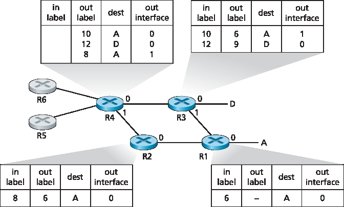

.. _c6.5:

6.5 链路虚拟化：作为链路层的网络
=================================================================
6.5 Link Virtualization: A Network as a Link Layer

由于本章涉及链路层协议，并且我们已接近本章的结尾，因此我们来回顾一下我们对术语“链路”的理解是如何演变的。我们在本章开始时将链路视为连接两个通信主机的物理导线。在研究多路访问协议时，我们看到多个主机可以通过一根共享导线连接，而连接主机的“导线”可以是无线频谱或其他介质。这促使我们将链路更抽象地视为信道，而不是一根导线。在我们对以太网局域网的研究中（:ref:`图 6.15 <Figure 6.15>`），我们看到互联介质实际上可能是相当复杂的交换基础设施。然而，在这一演变过程中，主机始终将互联介质视为连接两个或多个主机的链路层信道。例如，我们看到，以太网主机可以完全不知晓自己是通过一个短的 LAN 段（:ref:`图 6.17 <Figure 6.17>`）、一个地理分散的交换式 LAN（:ref:`图 6.15 <Figure 6.15>`）还是一个 VLAN（:ref:`图 6.26 <Figure 6.26>`）与其他 LAN 主机连接的。

在两个主机之间使用拨号调制解调器连接的情况下，连接两个主机的链路实际上是电话网络——一个逻辑上独立的、拥有自身交换机、链路和用于数据传输和信令的协议栈的全球电信网络。然而，从互联网链路层的角度来看，通过电话网络的拨号连接被视为一根简单的“导线”。从这个意义上讲，互联网对电话网络进行了虚拟化，将其视为提供链路层连接的链路层技术。你可能还记得我们在 :ref:`第 2 章 <c2>` 关于叠加网络的讨论中，叠加网络也以类似的方式将互联网视为叠加节点之间提供连接的手段，试图以互联网叠加电话网络的方式对互联网进行叠加。

在本节中，我们将讨论多协议标签交换（MPLS）网络。与电路交换的电话网络不同，MPLS 本身就是一个分组交换的虚拟电路网络。它有自己的分组格式和转发行为。因此，从教学角度看，MPLS 既可以归入网络层的学习内容，也可以归入链路层的学习内容。然而，从互联网的角度来看，我们可以将 MPLS（像电话网络和交换式以太网）视为一种用于互联 IP 设备的链路层技术。因此，我们将在链路层的讨论中研究 MPLS。帧中继和 ATM 网络也可以用来互联 IP 设备，尽管它们代表稍微早期（但仍在使用）的技术，这里不作介绍；详情请参考极易阅读的书籍 :ref:`[Goralski 1999] <Goralski 1999>`。我们对 MPLS 的处理将不可避免地简略，因为已有整本书专门论述此类网络。我们推荐 :ref:`[Davie 2000] <Davie 2000>` 了解 MPLS 的详细内容。我们在这里将主要关注 MPLS 服务器如何与 IP 设备互联，尽管我们也会稍微深入探讨其底层技术。

.. toggle::

   Because this chapter concerns link-layer protocols, and given that we’re now nearing the chapter’s end, let’s reflect on how our understanding of the term link has evolved. We began this chapter by viewing the link as a physical wire connecting two communicating hosts. In studying multiple access protocols, we saw that multiple hosts could be connected by a shared wire and that the “wire” connecting the hosts could be radio spectra or other media. This led us to consider the link a bit more abstractly as a channel, rather than as a wire. In our study of Ethernet LANs (:ref:`Figure 6.15 <Figure 6.15>`) we saw that the interconnecting media could actually be a rather complex switched infrastructure. Throughout this evolution, however, the hosts themselves maintained the view that the interconnecting medium was simply a link-layer channel connecting two or more hosts. We saw, for example, that an Ethernet host can be blissfully unaware of whether it is connected to other LAN hosts by a single short LAN segment (:ref:`Figure 6.17 <Figure 6.17>`) or by a geographically dispersed switched LAN (:ref:`Figure 6.15 <Figure 6.15>`) or by a VLAN (:ref:`Figure 6.26 <Figure 6.26>`).

   In the case of a dialup modem connection between two hosts, the link connecting the two hosts is actually the telephone network—a logically separate, global telecommunications network with its own switches, links, and protocol stacks for data transfer and signaling. From the Internet link-layer point of view, however, the dial-up connection through the telephone network is viewed as a simple “wire.” In this sense, the Internet virtualizes the telephone network, viewing the telephone network as a link-layer technology providing link-layer connectivity between two Internet hosts. You may recall from our discussion of overlay networks in :ref:`Chapter 2 <c2>` that an overlay network similarly views the Internet as a means for providing connectivity between overlay nodes, seeking to overlay the Internet in the same way that the Internet overlays the telephone network.

   In this section, we’ll consider Multiprotocol Label Switching (MPLS) networks. Unlike the circuit-switched telephone network, MPLS is a packet-switched, virtual-circuit network in its own right. It has its own packet formats and forwarding behaviors. Thus, from a pedagogical viewpoint, a discussion of MPLS fits well into a study of either the network layer or the link layer. From an Internet viewpoint, however, we can consider MPLS, like the telephone network and switched-­Ethernets, as a link-layer technology that serves to interconnect IP devices. Thus, we’ll consider MPLS in our discussion of the link layer. Frame- relay and ATM networks can also be used to interconnect IP devices, though they represent a slightly older (but still deployed) technology and will not be covered here; see the very readable book :ref:`[Goralski 1999] <Goralski 1999>` for details. Our treatment of MPLS will be necessarily brief, as entire books could be (and have been) written on these networks. We recommend :ref:`[Davie 2000] <Davie 2000>` for details on MPLS. We’ll focus here primarily on how MPLS ­servers interconnect to IP devices, although we’ll dive a bit deeper into the underlying technologies as well.

.. _c6.5.1:

6.5.1 多协议标签交换（MPLS）
-----------------------------------------------------------------------
6.5.1 Multiprotocol Label Switching (MPLS)

多协议标签交换（MPLS）起源于 1990 年代中后期多个业界努力，其目标是通过采用虚拟电路网络的一个关键概念——定长标签——来提高 IP 路由器的转发速度。目标并不是要放弃基于目标地址的 IP 数据报转发架构，转而使用基于定长标签和虚电路的架构，而是在可能的情况下通过选择性地对数据报进行标签化，使路由器可以基于定长标签（而不是目标 IP 地址）进行转发。重要的是，这些技术与 IP 密切配合，仍然使用 IP 地址和路由机制。IETF 在 MPLS 协议中统一了这些努力 [:rfc:`3031`, :rfc:`3032`]，将虚电路技术有效地融合进了路由数据报网络中。

让我们从处理 MPLS 的路由器所使用的链路层帧格式入手学习 MPLS。:ref:`图 6.28 <Figure 6.28>` 显示，在 MPLS 能力设备之间传输的链路层帧在第 2 层（如以太网）报头和第 3 层（即 IP）报头之间加入了一个小的 MPLS 报头。RFC 3032 定义了此类链路上 MPLS 报头的格式；ATM 和帧中继网络中的报头格式在其他 RFC 中也有定义。MPLS 报头字段包括标签、3 位保留用于实验用途的字段、一个用于指示“堆叠” MPLS 报头系列结尾的单独 S 位（本书不涉及的高级主题）以及 TTL 字段。

.. _Figure 6.28:

.. figure:: ../img/549-0.png
   :align: center 

**图 6.28 MPLS 报头：位于链路层和网络层报头之间**

从 :ref:`图 6.28 <Figure 6.28>` 中可以立即看出，MPLS 增强的帧只能在都支持 MPLS 的路由器之间传输（因为不支持 MPLS 的路由器在本应看到 IP 报头的位置遇到 MPLS 报头会感到非常困惑）。支持 MPLS 的路由器通常被称为 **标签交换路由器（label-switched router）**，因为它通过查找 MPLS 标签并立即将数据报转发到适当的输出接口来处理 MPLS 帧。因此，MPLS 路由器无需提取目标 IP 地址并在转发表中执行最长前缀匹配查找。但路由器如何知道其邻居是否支持 MPLS？又如何知道应将哪个标签与特定的 IP 目标地址关联？为回答这些问题，我们需要看看一组 MPLS 路由器之间的交互。

在 :ref:`图 6.29 <Figure 6.29>` 的示例中，路由器 R1 至 R4 支持 MPLS，R5 和 R6 是标准 IP 路由器。R1 向 R2 和 R3 宣布它可以路由到目的地 A，接收到带有 MPLS 标签 6 的帧将被转发到 A。路由器 R3 向 R4 宣布它可以路由到 A 和 D，接收到分别带有标签 10 和 12 的帧将被转发到这些目标。R2 也向 R4 宣布它可以到达 A，接收到带有标签 8 的帧将被转发到 A。注意，R4 现在处于一个有趣的位置：它有两条到达 A 的 MPLS 路径：一条通过接口 0，标签为 10，另一条通过接口 1，标签为 8。:ref:`图 6.29 <Figure 6.29>` 所描述的大致图景是，IP 设备 R5、R6、A 和 D 通过一个 MPLS 基础设施（支持 MPLS 的路由器 R1 至 R4）相互连接，这种连接方式与交换式 LAN 或 ATM 网络连接 IP 设备类似。而且，就像交换式 LAN 或 ATM 网络一样，MPLS 路由器 R1 至 R4 在此过程中从不触及分组的 IP 报头。

.. _Figure 6.29:

**图 6.29 MPLS 增强的转发**

在上面的讨论中，我们没有说明用于在 MPLS 路由器之间分发标签的具体协议，因为该信令细节远超本书范围。然而我们指出，IETF 的 MPLS 工作组在 [:rfc:`3468`] 中指出，将以 RSVP 协议的扩展版本 RSVP-TE [:rfc:`3209`] 为其 MPLS 信令工作的重点。我们也未讨论 MPLS 实际如何在支持 MPLS 的路由器之间计算路径，也未涉及如何收集用于路径计算的链路状态信息（例如，尚未被 MPLS 保留的链路带宽）。现有链路状态路由算法（如 OSPF）已被扩展以将这些信息广播到 MPLS 路由器。值得注意的是，实际的路径计算算法并未标准化，目前是供应商特定的。

到目前为止，我们讨论 MPLS 的重点在于它基于标签进行转发，而无需考虑分组的 IP 地址。然而 MPLS 的真正优势及当前受到关注的原因，并不在于其可能提高的交换速度，而在于它所启用的新型流量管理能力。如上所述，R4 有两条到达 A 的 MPLS 路径。如果基于 IP 地址在 IP 层进行转发，那么我们在 :ref:`第 5 章 <c5>` 中学习的 IP 路由协议将仅指定一条到达 A 的最短路径。因此，MPLS 提供了沿标准 IP 路由协议无法实现的路径转发分组的能力。这是 MPLS 的一种简单形式的 **流量工程（traffic engineering）** [:rfc:`3346`; :rfc:`3272`; :rfc:`2702`; :ref:`Xiao 2000 <Xiao 2000>`]，网络运营商可以绕过常规 IP 路由，将一部分前往某个目标的流量沿一条路径转发，而将其他流量沿另一条路径转发（无论是出于策略、性能或其他原因）。

MPLS 还可以用于许多其他用途。例如，它可以用于实现 MPLS 转发路径的快速恢复，例如在链路故障时将流量重路由到预先计算的故障转移路径上 [:ref:`Kar 2000 <Kar 2000>`; :ref:`Huang 2002 <Huang 2002>`; :rfc:`3469`]。最后，我们指出 MPLS 已被用于实现所谓的虚拟专用网络（VPN）。在为客户实现 VPN 时，ISP 使用其支持 MPLS 的网络将客户的多个网络连接起来。MPLS 可用于将客户 VPN 的资源和地址与穿越 ISP 网络的其他用户隔离；详见 :ref:`[DeClercq 2002] <DeClercq 2002>`。

我们对 MPLS 的讨论非常简略，建议你查阅我们提到的参考文献。我们指出，MPLS 有如此多的可能用途，看来它正迅速成为互联网流量工程领域的瑞士军刀！

.. toggle::

   Multiprotocol Label Switching (MPLS) evolved from a number of industry efforts in the mid-to-late 1990s to improve the forwarding speed of IP routers by adopting a key concept from the world of virtual-circuit networks: a fixed-length label. The goal was not to abandon the destination-based IP datagram- forwarding infrastructure for one based on fixed-length labels and virtual circuits, but to augment it by selectively labeling datagrams and allowing routers to forward datagrams based on fixed-length labels (rather than destination IP addresses) when possible. Importantly, these techniques work hand-in-hand with IP, using IP addressing and routing. The IETF unified these efforts in the MPLS protocol [:rfc:`3031`, :rfc:`3032`], effectively blending VC techniques into a routed datagram network.

   Let’s begin our study of MPLS by considering the format of a link-layer frame that is handled by an MPLS-capable router. :ref:`Figure 6.28 <Figure 6.28>` shows that a link-layer frame transmitted between MPLS-capable devices has a small MPLS header added between the layer-2 (e.g., Ethernet) header and layer-3 (i.e., IP) header. RFC 3032 defines the format of the MPLS header for such links; headers are defined for ATM and frame-relayed networks as well in other RFCs. Among the fields in the MPLS header are the label, 3 bits reserved for experimental use, a single S bit, which is used to indicate the end of a series of “stacked” MPLS headers (an advanced topic that we’ll not cover here), and a time-to- live field.

   .. figure:: ../img/549-0.png
      :align: center 

   **Figure 6.28 MPLS header: Located between link- and network-layer headers**

   It’s immediately evident from :ref:`Figure 6.28 <Figure 6.28>` that an MPLS-enhanced frame can only be sent between routers that are both MPLS capable (since a non-MPLS-capable router would be quite confused when it found an MPLS header where it had expected to find the IP header!). An MPLS-capable router is often referred to as a **label-switched router**, since it forwards an MPLS frame by looking up the MPLS label in its forwarding table and then immediately passing the datagram to the appropriate output interface. Thus, the MPLS-capable router need not extract the destination IP address and perform a lookup of the longest prefix match in the forwarding table. But how does a router know if its neighbor is indeed MPLS capable, and how does a router know what label to associate with the given IP destination? To answer these questions, we’ll need to take a look at the interaction among a group of MPLS-capable routers.

   In the example in :ref:`Figure 6.29 <Figure 6.29>`, routers R1 through R4 are MPLS capable. R5 and R6 are standard IP routers. R1 has advertised to R2 and R3 that it (R1) can route to destination A, and that a received frame with MPLS label 6 will be forwarded to destination A. Router R3 has advertised to router R4 that it can route to destinations A and D, and that incoming frames with MPLS labels 10 and 12, respectively, will be switched toward those destinations. Router R2 has also advertised to router R4 that it (R2) can reach destination A, and that a received frame with MPLS label 8 will be switched toward A. Note that router R4 is now in the interesting position of having two MPLS paths to reach A: via interface 0 with outbound MPLS label 10, and via interface 1 with an MPLS label of 8. The broad picture painted in :ref:`Figure 6.29 <Figure 6.29>` is that IP devices R5, R6, A, and D are connected together via an MPLS infrastructure (MPLS-capable routers R1, R2, R3, and R4) in much the same way that a switched LAN or an ATM network can connect together IP devices. And like a switched LAN or ATM network, the MPLS-capable routers R1 through R4 do so without ever touching the IP header of a packet.

   .. figure:: ../img/550-0.png
      :align: center 

   **Figure 6.29 MPLS-enhanced forwarding**

   In our discussion above, we’ve not specified the specific protocol used to distribute labels among the
   MPLS-capable routers, as the details of this signaling are well beyond the scope of this book. We note, however, that the IETF working group on MPLS has specified in [:rfc:`3468`] that an extension of the RSVP protocol, known as RSVP-TE [:rfc:`3209`], will be the focus of its efforts for MPLS signaling. We’ve also not discussed how MPLS actually computes the paths for packets among MPLS capable routers, nor how it gathers link-state information (e.g., amount of link bandwidth unreserved by MPLS) to use in these path computations. Existing link-state routing algorithms (e.g., OSPF) have been extended to flood this information to MPLS-capable routers. Interestingly, the actual path computation algorithms are not standardized, and are currently vendor-specific.

   Thus far, the emphasis of our discussion of MPLS has been on the fact that MPLS performs switching based on labels, without needing to consider the IP address of a packet. The true advantages of MPLS and the reason for current interest in MPLS, however, lie not in the potential increases in switching speeds, but rather in the new traffic management capabilities that MPLS enables. As noted above, R4 has two MPLS paths to A. If forwarding were performed up at the IP layer on the basis of IP address, the IP routing protocols we studied in :ref:`Chapter 5 <c5>` would specify only a single, least-cost path to A. Thus, MPLS provides the ability to forward packets along routes that would not be possible using standard IP routing protocols. This is one simple form of **traffic engineering** using MPLS [:rfc:`3346`; :rfc:`3272`; :rfc:`2702`; :ref:`Xiao 2000 <Xiao 2000>`], in which a network operator can override normal IP routing and force some of the traffic headed toward a given destination along one path, and other traffic destined toward the same destination along another path (whether for policy, performance, or some other reason).

   It is also possible to use MPLS for many other purposes as well. It can be used to perform fast restoration of MPLS forwarding paths, e.g., to reroute traffic over a precomputed failover path in response to link failure [:ref:`Kar 2000 <Kar 2000>`; :ref:`Huang 2002 <Huang 2002>`; :rfc:`3469`]. Finally, we note that MPLS can, and has, been used to implement so-called ­virtual private networks (VPNs). In implementing a VPN for a customer, an ISP uses its MPLS-enabled network to connect together the customer’s various networks. MPLS can be used to isolate both the resources and addressing used by the customer’s VPN from that of other users crossing the ISP’s network; see :ref:`[DeClercq 2002] <DeClercq 2002>` for details.

   Our discussion of MPLS has been brief, and we encourage you to consult the references we’ve mentioned. We note that with so many possible uses for MPLS, it appears that it is rapidly becoming the Swiss Army knife of Internet traffic engineering!
