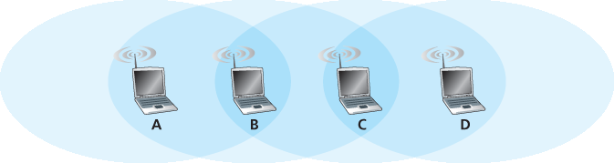

家庭作业问题和疑问
========================================
Homework Problems and Questions

第7.1节
-----------

R1. 无线网络以“基础设施模式”运行意味着什么？如果网络不是以基础设施模式运行，它处于哪种运行模式？该模式与基础设施模式之间有什么区别？

R2. 在我们于 :ref:`第7.1节 <c7.1>` 中定义的分类法中，识别出了哪四种类型的无线网络？你使用过这些无线网络中的哪几种？

.. toggle::

    R1. What does it mean for a wireless network to be operating in “infrastructure mode”? If the network is not in infrastructure mode, what mode of operation is it in, and what is the difference between that mode of operation and infrastructure mode?

    R2. What are the four types of wireless networks identified in our taxonomy in :ref:`Section 7.1 <c7.1>` ? Which of these types of wireless networks have you used? 

第7.2节
-----------

R3. 以下几种无线信道损伤类型之间有什么区别：路径损耗、多径传播、来自其他源的干扰？

R4. 当一个移动节点离基站越来越远时，基站可以采取哪两种措施来确保所传输帧的丢失概率不增加？

.. toggle::

    R3. What are the differences between the following types of wireless channel impairments: path loss, multipath propagation, interference from other sources?

    R4. As a mobile node gets farther and farther away from a base station, what are two actions that a base station could take to ensure that the loss probability of a transmitted frame does not increase?

第7.3节与第7.4节
-----------

R5. 请描述802.11中信标帧的作用。

R6. 判断正误：在一个802.11站点发送数据帧之前，它必须先发送RTS帧并接收到相应的CTS帧。

R7. 为什么在802.11中使用确认帧，而在有线以太网中不使用？

R8. 判断正误：以太网和802.11使用相同的帧结构。

R9. 请描述RTS阈值是如何工作的。

R10. 假设IEEE 802.11中的RTS和CTS帧与标准的DATA和ACK帧一样长，那么使用CTS和RTS帧还有优势吗？为什么？

R11. :ref:`第7.3.4节 <c7.3.4>` 讨论了802.11的移动性，其中一个无线站点在同一子网内从一个BSS移动到另一个。当AP之间通过交换机互连时，AP可能需要发送一个带有伪造MAC地址的帧，以使交换机正确转发该帧。这是为什么？

R12. 蓝牙网络中的主设备与802.11网络中的基站之间有什么区别？

R13. 在802.15.4 Zigbee标准中，所谓的超级帧（super frame）是什么意思？

R14. 在3G蜂窝数据架构中，“核心网络”的作用是什么？

R15. RNC在3G蜂窝数据网络架构中扮演什么角色？RNC在蜂窝语音网络中扮演什么角色？

R16. 在4G架构中，eNodeB、MME、P-GW和S-GW分别扮演什么角色？

R17. 3G与4G蜂窝架构之间有哪三项重要的差异？

.. toggle::

    R5. Describe the role of the beacon frames in 802.11.

    R6. True or false: Before an 802.11 station transmits a data frame, it must first send an RTS frame and receive a corresponding CTS frame.

    R7. Why are acknowledgments used in 802.11 but not in wired Ethernet?

    R8. True or false: Ethernet and 802.11 use the same frame structure.

    R9. Describe how the RTS threshold works.

    R10. Suppose the IEEE 802.11 RTS and CTS frames were as long as the standard DATA and ACK frames. Would there be any advantage to using the CTS and RTS frames? Why or why not?

    R11. :ref:`Section 7.3.4 <c7.3.4>` discusses 802.11 mobility, in which a wireless station moves from one BSS to another within the same subnet. When the APs are interconnected with a switch, an AP may need to send a frame with a spoofed MAC address to get the switch to forward the frame properly. Why?

    R12. What are the differences between a master device in a Bluetooth network and a base station in an 802.11 network?

    R13. What is meant by a super frame in the 802.15.4 Zigbee standard?

    R14. What is the role of the “core network” in the 3G cellular data architecture?

    R15. What is the role of the RNC in the 3G cellular data network architecture? What role does the RNC play in the cellular voice network?

    R16. What is the role of the eNodeB, MME, P-GW, and S-GW in 4G architecture?

    R17. What are three important differences between the 3G and 4G cellular ­architectures?

第7.5节与第7.6节
----------------------

R18. 如果一个节点通过无线连接接入因特网，该节点是否必须是移动的？请解释。假设一位用户拿着笔记本电脑在家中走动，并始终通过同一个接入点访问因特网。从网络角度看，这位用户是移动的吗？请解释。

R19. 永久地址与转交地址之间有什么区别？谁负责分配转交地址？

R20. 考虑一个通过移动IP建立的TCP连接。判断正误：从通信对应方到移动主机的TCP连接阶段通过移动主机的归属网络，但数据传输阶段是直接在通信对应方与移动主机之间进行的，绕过了归属网络。

.. toggle::

    R18. If a node has a wireless connection to the Internet, does that node have to be mobile? Explain. Suppose that a user with a laptop walks around her house with her laptop, and always accesses the Internet through the same access point. Is this user mobile from a network standpoint? Explain.

    R19. What is the difference between a permanent address and a care-of address? Who assigns a care-of address?

    R20. Consider a TCP connection going over Mobile IP. True or false: The TCP connection phase between the correspondent and the mobile host goes through the mobile’s home network, but the data transfer phase is directly between the correspondent and the mobile host, bypassing the home network.

第7.7节
-----------

R21. HLR与VLR在GSM网络中的作用分别是什么？在移动IP中有哪些元素与HLR和VLR类似？

R22. 锚定MSC在GSM网络中扮演什么角色？

.. toggle::

    R21. What are the purposes of the HLR and VLR in GSM networks? What elements of mobile IP are similar to the HLR and VLR?

    R22. What is the role of the anchor MSC in GSM networks?

第7.8节
-----------

R23. 可以采取哪三种方法避免单一的无线链路影响端到端传输层TCP连接的性能？

.. toggle::

    R23. What are three approaches that can be taken to avoid having a single ­wireless link degrade the performance of an end-to-end transport-layer TCP ­connection?

问题
----------
Problems

P1. 考虑 :ref:`图7.5 <Figure 7.5>` 中的单发送者CDMA示例。如果发送者的CDMA码为 (1,−1,1,−1,1,−1,1,−1)，那么发送者的输出（对应图中显示的2个数据位）会是什么？

P2. 考虑 :ref:`图7.6 <Figure 7.6>` 中的发送者2。发送者发送到信道的输出（在与发送者1的信号相加之前），即 Zi,m2 是什么？

P3. 假设 :ref:`图7.6 <Figure 7.6>` 中的接收者希望接收发送者2发送的数据。通过计算证明接收者确实能够利用发送者2的码从汇总的信道信号中恢复发送者2的数据。

P4. 对于两个发送者、两个接收者的示例，举例说明两组包含1和-1值的CDMA码，这些码不能使两个接收者从两个CDMA发送者中提取出原始的传输比特。

P5. 假设某咖啡馆内有两个ISP提供WiFi接入，每个ISP运行自己的AP并拥有自己的IP地址段。

a. 假设两个ISP不小心都将其AP配置在了频道11上。802.11协议在这种情况下会完全失效吗？请讨论当两个分别连接到不同ISP的站点尝试同时发送时会发生什么。

b. 如果一个AP运行在频道1，另一个AP运行在频道11，你的答案有何变化？

P6. 在CSMA/CA协议的第4步中，一个成功发送帧的站点在进行第二个帧的CSMA/CA流程时，从第2步开始而不是第1步开始。设计者为什么要让这样的站点在信道空闲时不立即发送第二个帧？

P7. 假设一个802.11b站点配置为总是通过RTS/CTS序列保留信道。假设此站点突然要发送1000字节数据，并且此时其他站点均空闲。忽略传播延迟且假设无比特错误，基于SIFS和DIFS计算发送该帧并接收确认所需的时间。

P8. 考虑 :ref:`图7.34 <Figure 7.34>` 中的场景，有四个无线节点A、B、C和D。四个节点的无线覆盖范围由阴影椭圆表示；所有节点共享同一频率。当A发送时，只有B能听到/接收；B发送时，A和C能听到/接收；C发送时，B和D能听到/接收；D发送时，只有C能听到/接收。

.. _Figure 7.34:

**图7.34 问题P8的场景**

假设每个节点都有无限的消息想发送给其他所有节点。如果消息的目的地不是直接邻居，则该消息必须中继。例如，若A想发送给D，则消息必须先从A发送到B，B再转发给C，C再转发给D。时间被划分为时隙，每条消息发送恰好占用一个时隙（例如时隙ALOHA）。在一个时隙内，节点可以执行以下操作之一：(i)发送消息，(ii)接收消息（前提是恰好有一个消息发送给它），(iii)保持静默。与往常一样，如果节点听到两个或更多同时发送的消息，则发生碰撞，所有消息均未成功接收。此处假设无比特错误，因此如果仅有一条消息发送，处于发送半径内的节点将正确接收该消息。

a. 现假设一个全知控制器（即能够了解网络中每个节点状态的控制器）可以指挥每个节点做任何它想做的事情，即发送消息、接收消息或保持静默。假设网络中没有其他消息往返于其他源-目的对，在该全知控制器的指挥下，数据从C传输到A的最大速率是多少？

b. 现假设A向B发送消息，D向C发送消息。在此情况下，数据从A到B和从D到C的总最大传输速率是多少？

c. 现假设A向B发送消息，C向D发送消息。在此情况下，数据从A到B和从C到D的总最大传输速率是多少？

d. 现假设无线链路被有线链路替代。请在该有线场景下重新回答（a）到（c）的问题。

e. 现假设我们又回到无线场景，并且对于每条从源发送到目的地的数据消息，目的地都会发送一个ACK消息回源（例如TCP中的情况）。并且假设每条ACK消息占用一个时隙。请在此情景下重复回答（a）到（c）的问题。

P9. 描述802.15.1蓝牙帧的格式。你需要在课外查阅相关资料以获得此信息。帧格式中是否存在某种机制固有限制802.15.1网络中最多只能有八个活动节点？请解释。

P10. 考虑下列理想化的LTE场景。下行信道（见 :ref:`图7.21 <Figure 7.21>`）在时间上被划分为时隙，跨F个频率。基站可覆盖四个节点A、B、C和D，在下行信道上的可达速率分别为10 Mbps、5 Mbps、2.5 Mbps和1 Mbps。假设基站在所有F个频率上利用所有可用时隙向单一节点发送数据。基站有无限量数据要发送给各节点，可以在任意下行子帧的任意时隙使用任意频率向任一节点发送。

a. 假设基站可在每个时隙选择向任一节点发送数据，其最大发送速率是多少？你的方案公平吗？请解释并定义你所说的“公平”。

b. 若公平性要求每个节点在每秒内必须接收相同数量的数据，则基站在下行子帧期间的平均发送速率是多少？请说明你的推导过程。

c. 假设公平性准则变为任一节点接收的数据最多是任一其他节点的两倍。则基站在下行子帧期间的平均发送速率是多少？请说明你的推导过程。

P11. 在 :ref:`第7.5节 <c7.5>` 中，提出的一种解决方案允许移动用户在不同外网间移动时保持其IP地址不变，该方案为外网发布一个针对移动用户的高度具体化路由，并利用现有路由基础设施传播该信息。我们指出了可扩展性问题。假设当移动用户从一个网络移动到另一个网络时，新外网发布一个具体路由给移动用户，旧外网撤销其路由。考虑距离矢量算法中路由信息的传播（特别是跨全球网络的域间路由）。

a. 当外网开始发布其路由时，其他路由器能否立即将数据报路由到新外网？

b. 是否可能不同路由器认为移动用户存在于不同的外网？

c. 讨论其他路由器最终获知移动用户路径的时间尺度。

P12. 假设 :ref:`图7.23 <Figure 7.23>` 中的通信对应方也是移动的。请绘制为了将数据报从原移动用户路由到（现已移动的）通信对应方所需的额外网络层基础设施。请像 :ref:`图7.24 <Figure 7.24>` 那样展示原移动用户与（现已移动的）通信对应方间数据报的结构。

P13. 在移动IP中，移动性对源与目的地间数据报的端到端延迟有什么影响？

P14. 考虑 :ref:`第7.7.2节 <c7.7.2>` 末尾讨论的链式示例。假设移动用户访问外网A、B和C，并且通信对应方在移动用户处于外网A时开始连接。列出移动用户从网络A移动到网络B再到网络C时，外代理之间以及外代理与归属代理之间消息的序列。接着，假设不执行链式转发，且通信对应方及归属代理必须被明确通知移动用户的转交地址变化。列出第二种情景下需要交换的消息序列。

P15. 考虑两个位于同一外网且有外代理的移动节点。这两个移动节点能否使用相同的移动IP转交地址？请说明你的答案。

P16. 在讨论VLR如何将移动当前位置信息更新至HLR时，向HLR提供MSRN与提供VLR地址各有什么优缺点？

.. toggle::

   P1. Consider the single-sender CDMA example in :ref:`Figure 7.5 <Figure 7.5>` . What would be the sender’s output (for the 2 data bits shown) if the sender’s CDMA code were (1,−1,1,−1,1,−1,1,−1)?
   
   P2. Consider sender 2 in :ref:`Figure 7.6 <Figure 7.6>` . What is the sender’s output to the channel (before it is added to the signal from sender 1), Zi,m2?
   
   P3. Suppose that the receiver in :ref:`Figure 7.6 <Figure 7.6>` wanted to receive the data being sent by sender 2. Show (by calculation) that the receiver is indeed able to recover sender 2’s data from the aggregate channel signal by using sender 2’s code.
   
   P4. For the two-sender, two-receiver example, give an example of two CDMA codes containing 1 and 21 values that do not allow the two receivers to extract the original transmitted bits from the two CDMA senders.
   
   P5. Suppose there are two ISPs providing WiFi access in a particular café, with each ISP operating its own AP and having its own IP address block.
   
   a. Further suppose that by accident, each ISP has configured its AP to operate over channel 11. Will the 802.11 protocol completely break down in this situation? Discuss what happens when two stations, each associated with a different ISP, attempt to transmit at the same time.
   b. Now suppose that one AP operates over channel 1 and the other over channel 11. How do your answers change?
   
   P6. In step 4 of the CSMA/CA protocol, a station that successfully transmits a frame begins the CSMA/CA protocol for a second frame at step 2, rather than at step 1. What rationale might the designers of CSMA/CA have had in mind by having such a station not transmit the second frame immediately (if the channel is sensed idle)?
   
   P7. Suppose an 802.11b station is configured to always reserve the channel with the RTS/CTS sequence. Suppose this station suddenly wants to ­transmit 1,000 bytes of data, and all other stations are idle at this time. As a ­function of SIFS and DIFS, and ignoring propagation delay and assuming no bit errors, calculate the time required to transmit the frame and receive the acknowledgment.
   
   P8. Consider the scenario shown in :ref:`Figure 7.34 <Figure 7.34>` , in which there are four wireless nodes, A, B, C, and D. The radio coverage of the four nodes is shown via the shaded ovals; all nodes share the same frequency. When A transmits, it can only be heard/received by B; when B transmits, both A and C can hear/receive from B; when C transmits, both B and D can hear/receive from C; when D transmits, only C can hear/receive from D.
   
   .. figure:: ../img/649-0.png 
       :align: center
   
   **Figure 7.34 Scenario for problem P8**
   
   Suppose now that each node has an infinite supply of messages that it wants to send to each of the other nodes. If a message’s destination is not an immediate neighbor, then the message must be relayed. For example, if A wants to send to D, a message from A must first be sent to B, which then sends the message to C, which then sends the message to D. Time is slotted, with a message transmission time taking exactly one time slot, e.g., as in slotted Aloha. During a slot, a node can do one of the following: (i) send a message, (ii) receive a message (if exactly one message is being sent to it), (iii) remain silent. As always, if a node hears two or more simultaneous transmissions, a collision occurs and none of the transmitted messages are received successfully. You can assume here that there are no bit-level errors, and thus if exactly one message is sent, it will be received correctly by those within the transmission radius of the sender.
   
   a. Suppose now that an omniscient controller (i.e., a controller that knows the state of every node in the network) can command each node to do whatever it (the omniscient controller) wishes, i.e., to send a message, to receive a message, or to remain silent. Given this omniscient controller, what is the maximum rate at which a data message can be transferred from C to A, given that there are no other messages between any other source/destination pairs?
   b. Suppose now that A sends messages to B, and D sends messages to C. What is the combined maximum rate at which data messages can flow from A to B and from D to C?
   c. Suppose now that A sends messages to B, and C sends messages to D. What is the combined maximum rate at which data messages can flow from A to B and from C to D?
   d. Suppose now that the wireless links are replaced by wired links. Repeat questions (a) through (c) again in this wired scenario.
   e. Now suppose we are again in the wireless scenario, and that for every data message sent from source to destination, the destination will send an ACK message back to the source (e.g., as in TCP). Also suppose that each ACK message takes up one slot. Repeat questions (a)–(c) above for this scenario.
   
   P9. Describe the format of the 802.15.1 Bluetooth frame. You will have to do some reading outside of the text to find this information. Is there anything in the frame format that inherently limits the number of active nodes in an 802.15.1 network to eight active nodes? Explain.
   
   P10. Consider the following idealized LTE scenario. The downstream channel (see :ref:`Figure 7.21 <Figure 7.21>` ) is slotted in time, across F frequencies. There are four nodes, A, B, C, and D, reachable from the base station at rates of 10 Mbps, 5 Mbps, 2.5 Mbps, and 1 Mbps, respectively, on the downstream channel. These rates assume that the base station utilizes all time slots available on all F frequencies to send to just one station. The base station has an infinite amount of data to send to each of the nodes, and can send to any one of these four nodes using any of the F frequencies during any time slot in the ­downstream sub-frame.
   
   a. What is the maximum rate at which the base station can send to the nodes, assuming it can send to any node it chooses during each time slot? Is your solution fair? Explain and define what you mean by “fair.”
   b. If there is a fairness requirement that each node must receive an equal amount of data during each one second interval, what is the average transmission rate by the base station (to all nodes) during the downstream sub-frame? Explain how you arrived at your answer.
   c. Suppose that the fairness criterion is that any node can receive at most twice as much data as any other node during the sub-frame. What is the average transmission rate by the base station (to all nodes) during the sub-frame? Explain how you arrived at your answer.
   
   P11. In :ref:`Section 7.5 <c7.5>` , one proposed solution that allowed mobile users to maintain their IP addresses as they moved among foreign networks was to have a foreign network advertise a highly specific route to the mobile user and use the existing routing infrastructure to propagate this information throughout the network. We identified scalability as one concern. Suppose that when a mobile user moves from one network to another, the new foreign network advertises a specific route to the mobile user, and the old foreign network withdraws its route. Consider how routing information propagates in a distance-vector algorithm (particularly for the case of interdomain routing among networks that span the globe).
   
   a. Will other routers be able to route datagrams immediately to the new foreign network as soon as the foreign network begins advertising its route?
   b. Is it possible for different routers to believe that different foreign networks contain the mobile user?
   c. Discuss the timescale over which other routers in the network will eventually learn the path to the mobile users.
   
   P12. Suppose the correspondent in :ref:`Figure 7.23 <Figure 7.23>` were mobile. Sketch the additional network- layer infrastructure that would be needed to route the datagram from the original mobile user to the (now mobile) correspondent. Show the structure of the datagram(s) between the original mobile user and the (now mobile) correspondent, as in :ref:`Figure 7.24 <Figure 7.24>` .
   
   P13. In mobile IP, what effect will mobility have on end-to-end delays of datagrams between the source and destination?
   
   P14. Consider the chaining example discussed at the end of :ref:`Section 7.7.2 <c7.7.2>` . Suppose a mobile user visits foreign networks A, B, and C, and that a correspondent begins a connection to the mobile user when it is resident in foreign ­network A. List the sequence of messages between foreign agents, and between foreign agents and the home agent as the mobile user moves from network A to network B to network C. Next, suppose chaining is not performed, and the correspondent (as well as the home agent) must be explicitly notified of the changes in the mobile user’s care-of address. List the sequence of messages that would need to be exchanged in this second scenario.
   
   P15. Consider two mobile nodes in a foreign network having a foreign agent. Is it possible for the two mobile nodes to use the same care-of address in mobile IP? Explain your answer.
   
   P16. In our discussion of how the VLR updated the HLR with information about the mobile’s current location, what are the advantages and disadvantages of providing the MSRN as opposed to the address of the VLR to the HLR?
