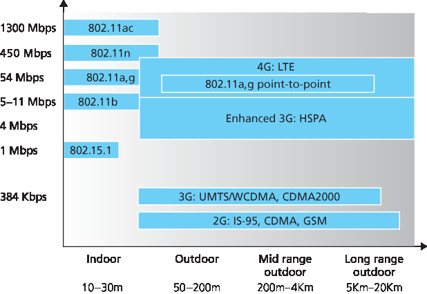

.. _c7.1:

7.1 介绍
===================================================================
7.1 Introduction

.. tab:: 中文

.. tab:: 英文

:ref:`Figure 7.1 <Figure 7.1>` shows the setting in which we’ll consider the topics of wireless data communication and mobility. We’ll begin by keeping our discussion general enough to cover a wide range of networks, including both wireless LANs such as IEEE 802.11 and cellular networks such as a 4G network; we’ll drill down into a more detailed discussion of specific wireless architectures in later sections. We can identify the following elements in a wireless network:

- **Wireless hosts**. As in the case of wired networks, hosts are the end-system devices that run applications. A **wireless host** might be a laptop, tablet, smartphone, or desktop computer. The hosts themselves may or may not be mobile.

  .. figure:: ../img/579-0.png 
     :align: center
  
  .. _Figure 7.1:
  
  **Figure 7.1 Elements of a wireless network**

- **Wireless links**. A host connects to a base station (defined below) or to another wireless host through a **wireless communication link**. Different wireless link technologies have different transmission rates and can transmit over different distances. :ref:`Figure 7.2 <Figure 7.2>` shows two key characteristics (coverage area and link rate) of the more popular wireless network standards. (The figure is only meant to provide a rough idea of these characteristics. For example, some of these types of networks are only now being deployed, and some link rates can increase or decrease beyond the values shown depending on distance, channel conditions, and the number of users in the wireless network.) We’ll cover these standards later in the first half of this chapter; we’ll also consider other wireless link characteristics (such as their bit error rates and the causes of bit errors) in :ref:`Section 7.2 <c7.2>`.

In :ref:`Figure 7.1 <Figure 7.1>`, wireless links connect wireless hosts located at the edge of the network into the larger network infrastructure. We hasten to add that wireless links are also sometimes used within a network to connect routers, switches, and other network equipment. However, our focus in this chapter will be on the use of wireless communication at the network edge, as it is here that many of the most exciting technical challenges, and most of the growth, are occurring.

.. _Figure 7.2:

**Figure 7.2 Link characteristics of selected wireless network standards**

- **Base station**. The **base station** is a key part of the wireless network infrastructure. Unlike the wireless host and wireless link, a base station has no obvious counterpart in a wired network. A base station is responsible for sending and receiving data (e.g., packets) to and from a wireless host that is associated with that base station. A base station will often be responsible for coordinating the transmission of multiple wireless hosts with which it is associated. When we say a wireless host is “associated” with a base station, we mean that (1) the host is within the wireless communication distance of the base station, and (2) the host uses that base station to relay data between it (the host) and the larger network. **Cell towers** in cellular networks and **access points** in 802.11 wireless LANs are examples of base stations.

  In :ref:`Figure 7.1 <Figure 7.1>`, the base station is connected to the larger network (e.g., the ­Internet, corporate or home network, or telephone network), thus functioning as a link-layer relay between the wireless host and the rest of the world with which the host communicates.
  
  Hosts associated with a base station are often referred to as operating in ­infrastructure mode, since all traditional network services (e.g., address assignment and routing) are provided by the network to which a host is connected via the base station. In **ad hoc networks**, wireless hosts have no such infrastructure with which to connect. In the absence of such infrastructure, the hosts themselves must provide for services such as routing, address assignment, DNS-like name translation, and more.

  .. admonition:: CASE HISTORY
  
      **PUBLIC WIFI ACCESS: COMING SOON TO A LAMP POST NEAR YOU?**
  
      WiFi hotspots—public locations where users can find 802.11 wireless access—are becoming increasingly common in hotels, airports, and cafés around the world. Most college campuses offer ubiquitous wireless access, and it’s hard to find a hotel that doesn’t offer wireless Internet access.
  
      Over the past decade a number of cities have designed, deployed, and operated municipal WiFi networks. The vision of providing ubiquitous WiFi access to the community as a public service (much like streetlights)—helping to bridge the digital divide by providing Internet access to all citizens and to promote economic development—is compelling. Many cities around the world, including Philadelphia, Toronto, Hong Kong, Minneapolis, London, and Auckland, have plans to provide ubiquitous wireless within the city, or have already done so to varying degrees. The goal in Philadelphia was to “turn Philadelphia into the nation’s largest WiFi hotspot and help to improve education, bridge the digital divide, enhance neighborhood development, and reduce the costs of government.” The ambitious program— an agreement between the city, Wireless Philadelphia (a nonprofit entity), and the Internet Service Provider Earthlink—built an operational network of 802.11b hotspots on streetlamp pole arms and traffic control devices that covered 80 percent of the city. But financial and operational concerns caused the network to be sold to a group of private investors in 2008, who later sold the network back to the city in 2010. Other cities, such as Minneapolis, Toronto, Hong Kong, and Auckland, have had success with smaller-scale efforts.
  
      The fact that 802.11 networks operate in the unlicensed spectrum (and hence can be deployed without purchasing expensive spectrum use rights) would seem to make them financially attractive. However, 802.11 access points (see :ref:`Section 7.3 <c7.3>`) have much shorter ranges than 4G cellular base stations (see :ref:`Section 7.4 <c7.4>`), requiring a larger number of deployed endpoints to cover the same geographic region. Cellular data networks providing Internet access, on the other hand, operate in the licensed spectrum. Cellular providers pay billions of dollars for spectrum access rights for their networks, making cellular data networks a business rather than municipal undertaking.

  When a mobile host moves beyond the range of one base station and into the range of another, it will change its point of attachment into the larger network (i.e., change the base station with which it is associated)—a process referred to as **handoff**. Such mobility raises many challenging questions. If a host can move, how does one find the mobile host’s current location in the network so that data can be forwarded to that mobile host? How is addressing performed, given that a host can be in one of many possible locations? If the host moves during a TCP connection or phone call, how is data routed so that the connection continues uninterrupted? These and many (many!) other questions make wireless and mobile networking an area of exciting networking research.

- **Network infrastructure**. This is the larger network with which a wireless host may wish to communicate.

Having discussed the “pieces” of a wireless network, we note that these pieces can be combined in many different ways to form different types of wireless networks. You may find a taxonomy of these types of wireless networks useful as you read on in this chapter, or read/learn more about wireless networks beyond this book. At the highest level we can classify wireless networks according to two criteria: (i) whether a packet in the wireless network crosses exactly one wireless hop or multiple wireless hops, and (ii) whether there is infrastructure such as a base station in the network:

- **Single-hop, infrastructure-based**. These networks have a base station that is connected to a larger wired network (e.g., the Internet). Furthermore, all communication is between this base station and a wireless host over a single wireless hop. The 802.11 networks you use in the classroom, café, or library; and the 4G LTE data networks that we will learn about shortly all fall in this category. The vast majority of our daily interactions are with single-hop, infrastructure-based ­wireless networks.
- **Single-hop, infrastructure-less**. In these networks, there is no base station that is connected to a wireless network. However, as we will see, one of the nodes in this single-hop network may coordinate the transmissions of the other nodes. ­Bluetooth networks (that connect small wireless devices such as keyboards, speakers, and headsets, and which we will study in :ref:`Section 7.3.6 <c7.3.6>`) and 802.11 networks in ad hoc mode are single-hop, infrastructure-less networks.
- **Multi-hop, infrastructure-based**. In these networks, a base station is present that is wired to the larger network. However, some wireless nodes may have to relay their communication through other wireless nodes in order to communicate via the base station. Some wireless sensor networks and so-called **wireless mesh networks** fall in this category.
- **Multi-hop, infrastructure-less**. There is no base station in these networks, and nodes may have to relay messages among several other nodes in order to reach a destination. Nodes may also be mobile, with connectivity changing among nodes—a class of networks known as **mobile ad hoc networks (MANETs)**. If the mobile nodes are vehicles, the network is a **vehicular ad hoc network (VANET)**. As you might imagine, the development of protocols for such networks is challenging and is the subject of much ongoing research.
 
In this chapter, we’ll mostly confine ourselves to single-hop networks, and then mostly to infrastructure-based networks.

Let’s now dig deeper into the technical challenges that arise in wireless and mobile networks. We’ll begin by first considering the individual wireless link, deferring our discussion of mobility until later in this chapter.