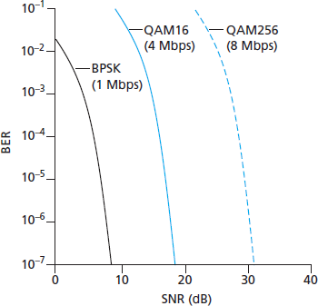
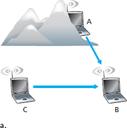
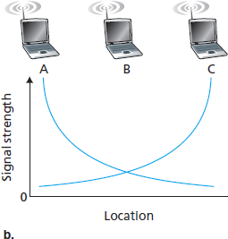
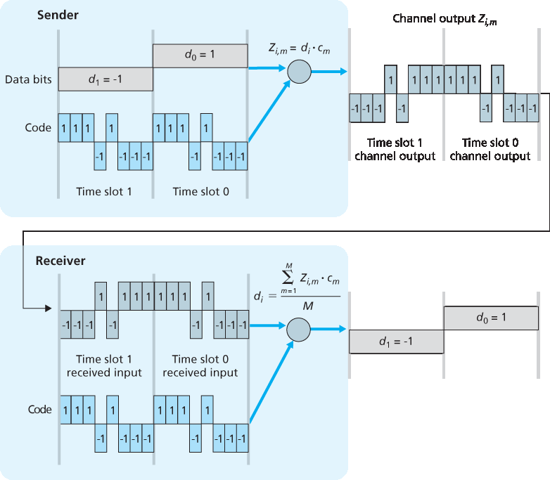
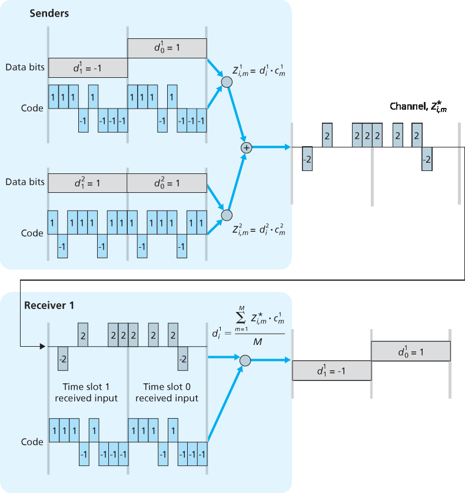

.. _c7.2:

7.2 无线链接和网络特性
===================================================================
7.2 Wireless Links and Network Characteristics

7.2 无线链路与网络特性

让我们从一个简单的有线网络开始考虑，比如一个家庭网络，主机之间通过有线以太网交换机互连（见 :ref:`第 6.4 节 <c6.4>`）。如果我们将有线以太网替换为无线 802.11 网络，那么无线网络接口将取代主机的有线以太网接口，接入点将取代以太网交换机，但在网络层及以上几乎不需要做任何修改。这说明在比较有线网络和无线网络的重要差异时，我们应将注意力集中在链路层。实际上，我们可以发现有线链路和无线链路之间存在许多重要的差异：

- **信号强度衰减**。电磁波在穿越物体（例如，无线电信号穿越墙壁）时会发生衰减。即使在自由空间中，信号也会扩散，导致信号强度降低（有时称为 **路径损耗** ），并随着发送方与接收方之间距离的增加而下降。
- **来自其他信号源的干扰**。在同一频段中传输的无线电信号会互相干扰。例如， ``2.4 GHz`` 无线电话和 802.11b 无线局域网使用相同的频段。因此，在使用 ``2.4 GHz`` 无线电话通话的同时使用 ``802.11b`` 无线局域网，既不能指望网络表现良好，也不能指望电话通信良好。除了来自其他发射源的干扰之外，环境中的电磁噪声（例如附近的电机、微波炉）也可能引起干扰。
- **多路径传播**。当电磁波的一部分反射到物体和地面上，导致发送方与接收方之间信号经过不同路径传播时，就会发生多路径传播。这会导致接收方接收到的信号模糊。发送方与接收方之间的物体移动还会导致多路径传播随时间变化。

关于无线信道特性、模型和测量的详细讨论，参见 :ref:`[Anderson 1995] <Anderson 1995>`。

上述讨论表明，相较于有线链路，无线链路更容易发生比特错误。因此，无线链路协议（如我们将在下一节研究的 802.11 协议）不仅采用强大的 CRC 错误检测码，还使用链路层可靠数据传输协议来重传损坏的帧，这并不令人意外。

在了解了无线信道可能出现的问题之后，我们将注意力转向接收无线信号的主机。该主机接收到的电磁信号，是发送方原始信号（由于上述的衰减和多路径传播等原因而退化）与环境中的背景噪声的组合。 **信噪比（SNR）** 是接收信号强度（即传输信息）与噪声强度的相对度量。SNR 通常以分贝（dB）为单位进行测量，这种单位被一些人认为是电气工程师用来让计算机科学家困惑的。SNR 的单位 dB 是接收信号幅度与噪声幅度的以 10 为底的对数比值的 20 倍。对我们而言，仅需知道更高的 SNR 值可以使接收方更容易从背景噪声中提取出所传输的信号。

:ref:`图 7.3 <Figure 7.3>`（改编自 :ref:`[Holland 2001] <Holland 2001>`）展示了三种不同调制技术在理想化无线信道上传输信息时的比特错误率（BER，即传输的比特在接收端出错的概率）与 SNR 的关系。关于调制与编码的理论，以及信号提取和比特错误率的内容，超出了本教材的范围（可参考 :ref:`[Schwartz 1980] <Schwartz 1980>` 进行深入了解）。尽管如此，:ref:`图 7.3 <Figure 7.3>` 展示了几个有助于理解高层无线通信协议的重要物理层特性：

.. _Figure 7.3:

**图 7.3 比特错误率、传输速率与信噪比的关系**

.. _Figure 7.4:

**图 7.4 由障碍物 (a) 和衰落 (b) 引起的隐藏终端问题**

- **对于给定的调制方案，SNR 越高，BER 越低**。由于发送方可以通过增加发射功率来提高 SNR，因此发送方可以通过增加功率来降低帧被错误接收的概率。然而，值得注意的是，将功率提升至超过某一阈值（例如将 BER 从 :math:`10^{-12}` 降低到 :math:`10^{-13}` ）在实际中可能并没有多少益处。与此同时，提升发射功率也带来了缺点：发送方需要消耗更多能量（对于电池供电的移动用户尤其重要），而且发送方的信号更有可能干扰其他发送方的传输（见 :ref:`图 7.4(b) <Figure 7.4>`）。
- **对于给定的 SNR，传输速率较高的调制方式（无论是否出错）具有更高的 BER**。例如，在 :ref:`图 7.3 <Figure 7.3>` 中，当 SNR 为 ``10 dB`` 时，使用 BPSK 调制、传输速率为 ``1 Mbps`` 时的 BER 小于 :math:`10^{-7}` ，而使用 QAM16 调制、传输速率为 ``4 Mbps`` 时的 BER 为 :math:`10^{-1}` ，这在实际中是完全不可接受的。然而，当 SNR 为 ``20 dB`` 时，QAM16 的 BER 降至 :math:`10^{-7}`，而传输速率仍为 4 Mbps；此时 BPSK 的 BER 低到几乎“超出了图表显示范围”，但其传输速率仅为 ``1 Mbps``。如果系统可以容忍 BER 为 :math:`10^{-7}`，那么 QAM16 所提供的更高传输速率会使其成为该场景下的首选调制方案。这些考虑引出了下一个特性：
- **动态选择物理层调制方案可以根据信道条件自适应选择调制方式**。SNR（进而 BER）可能因移动性或环境变化而变化。蜂窝数据系统、802.11 WiFi 和 4G 蜂窝数据网络中均使用了自适应调制与编码机制（我们将在 :ref:`第 7.3 节 <c7.3>` 和 :ref:`第 7.4 节 <c7.4>` 中学习）。例如，这使得系统可以根据 BER 的约束和信道特性选择具有最高可能传输速率的调制方式。

更高且随时间变化的比特错误率并不是有线链路与无线链路之间的唯一差异。还记得在有线广播链路中，所有节点都能接收到来自所有其他节点的传输。而在无线链路中，情况并不如此简单，详见 :ref:`图 7.4 <Figure 7.4>`。假设站点 A 向站点 B 发送数据，同时站点 C 也向站点 B 发送数据。在所谓的 **隐藏终端问题** 中，环境中的物理障碍物（如山体或建筑物）可能使 A 和 C 无法接收到彼此的信号，尽管它们的信号实际上在目标 B 处发生了干扰，这在 :ref:`图 7.4(a) <Figure 7.4>` 中有所展示。另一种在接收端无法检测的冲突场景来自于信号在无线介质中传播过程中 **衰落** 。:ref:`图 7.4(b) <Figure 7.4>` 展示了 A 与 C 位置安排使其信号不足以相互检测，但却足以在站点 B 处互相干扰的情况。正如我们将在 :ref:`第 7.3 节 <c7.3>` 看到的那样，隐藏终端问题与信号衰落使得无线网络中的多路访问远比有线网络复杂得多。

.. toggle::

   Let’s begin by considering a simple wired network, say a home network, with a wired Ethernet switch (see :ref:`Section 6.4 <c6.4>`) interconnecting the hosts. If we replace the wired Ethernet with a wireless 802.11 network, a wireless network interface would replace the host’s wired Ethernet interface, and an access point would replace the Ethernet switch, but virtually no changes would be needed at the network layer or above. This suggests that we focus our attention on the link layer when looking for important differences between wired and wireless networks. Indeed, we can find a number of important differences between a wired link and a wireless link:
   
   - **Decreasing signal strength**. Electromagnetic radiation attenuates as it passes through matter (e.g., a radio signal passing through a wall). Even in free space, the signal will disperse, resulting in decreased signal strength (sometimes referred to as **path loss**) as the distance between sender and receiver increases.
   - **Interference from other sources**. Radio sources transmitting in the same frequency band will interfere with each other. For example, 2.4 GHz wireless phones and 802.11b wireless LANs transmit in the same frequency band. Thus, the 802.11b wireless LAN user talking on a 2.4 GHz wireless phone can expect that neither the network nor the phone will perform particularly well. In addition to interference from transmitting sources, electromagnetic noise within the environment (e.g., a nearby motor, a microwave) can result in interference.
   - **Multipath propagation**. Multipath propagation occurs when portions of the electromagnetic wave reflect off objects and the ground, taking paths of different lengths between a sender and receiver. This results in the blurring of the received signal at the receiver. Moving objects between the sender and receiver can cause multipath propagation to change over time.
   
   For a detailed discussion of wireless channel characteristics, models, and measurements, see :ref:`[Anderson 1995] <Anderson 1995>`.
   
   The discussion above suggests that bit errors will be more common in wireless links than in wired links. For this reason, it is perhaps not surprising that wireless link protocols (such as the 802.11 protocol we’ll examine in the following section) employ not only powerful CRC error detection codes, but also link-level reliable-data-transfer protocols that retransmit corrupted frames.
   
   Having considered the impairments that can occur on a wireless channel, let’s next turn our attention to the host receiving the wireless signal. This host receives an electromagnetic signal that is a combination of a degraded form of the original signal transmitted by the sender (degraded due to the attenuation and multipath propagation effects that we discussed above, among others) and background noise in the environment. The **signal-to-noise ratio (SNR)** is a relative measure of the strength of the received signal (i.e., the information being transmitted) and this noise. The SNR is typically measured in units of decibels (dB), a unit of measure that some think is used by electrical engineers primarily to confuse computer scientists. The SNR, measured in dB, is twenty times the ratio of the base-10 logarithm of the amplitude of the received signal to the amplitude of the noise. For our purposes here, we need only know that a larger SNR makes it easier for the receiver to extract the transmitted signal from the background noise.
   
   :ref:`Figure 7.3 <Figure 7.3>` (adapted from :ref:`[Holland 2001] <Holland 2001>`) shows the bit error rate (BER)—roughly speaking, the probability that a transmitted bit is received in error at the receiver—versus the SNR for three different modulation techniques for encoding information for transmission on an idealized wireless channel. The theory of modulation and coding, as well as signal extraction and BER, is well beyond the scope of this text (see :ref:`[Schwartz 1980] <Schwartz 1980>` for a discussion of these topics). Nonetheless, :ref:`Figure 7.3 <Figure 7.3>` illustrates several physical-layer characteristics that are important in understanding higher-layer wireless communication protocols:
   
   .. figure:: ../img/585-0.png 
       :align: center

   **Figure 7.3 Bit error rate, transmission rate, and SNR**
   
   .. figure:: ../img/585-1.png 
       :align: center
   
   .. figure:: ../img/586-0.png 
       :align: center
   
   **Figure 7.4 Hidden terminal problem caused by obstacle (a) and fading (b)**
   
   - **For a given modulation scheme, the higher the SNR, the lower the BER**. Since a sender can increase the SNR by increasing its transmission power, a sender can decrease the probability that a frame is received in error by increasing its transmission power. Note, however, that there is arguably little practical gain in increasing the power beyond a certain threshold, say to decrease the BER from 10-12 to 10-13. There are also disadvantages associated with increasing the transmission power: More energy must be expended by the sender (an important concern for battery-powered mobile users), and the sender’s transmissions are more likely to interfere with the transmissions of another sender (see :ref:`Figure 7.4(b) <Figure 7.4>`).
   - **For a given SNR, a modulation technique with a higher bit transmission rate (whether in error or not) will have a higher BER**. For example, in :ref:`Figure 7.3 <Figure 7.3>`, with an SNR of 10 dB, BPSK modulation with a transmission rate of 1 Mbps has a BER of less than 10-7, while with QAM16 modulation with a transmission rate of 4 Mbps, the BER is 10-1, far too high to be practically useful. However, with an SNR of 20 dB, QAM16 modulation has a transmission rate of 4 Mbps and a BER of 10-7, while BPSK modulation has a transmission rate of only 1 Mbps and a BER that is so low as to be (literally) “off the charts.” If one can tolerate a BER of 10-7, the higher transmission rate offered by QAM16 would make it the preferred modulation technique in this situation. These considerations give rise to the final characteristic, described next.
   - **Dynamic selection of the physical-layer modulation technique can be used to adapt the modulation technique to channel conditions**. The SNR (and hence the BER) may change as a result of mobility or due to changes in the environment. Adaptive modulation and coding are used in cellular data systems and in the 802.11 WiFi and 4G cellular data networks that we’ll study in :ref:`Sections 7.3 <c7.3>` and :ref:`7.4 <c7.4>`. This allows, for example, the selection of a modulation technique that provides the highest transmission rate possible subject to a constraint on the BER, for given channel characteristics.
   
   A higher and time-varying bit error rate is not the only difference between a wired and wireless link. Recall that in the case of wired broadcast links, all nodes receive the transmissions from all other nodes. In the case of wireless links, the situation is not as simple, as shown in :ref:`Figure 7.4 <Figure 7.4>`. Suppose that Station A is transmitting to Station B. Suppose also that Station C is transmitting to Station B. With the so-called **hidden terminal problem**, physical obstructions in the environment (for example, a mountain or a building) may prevent A and C from hearing each other’s transmissions, even though A’s and C’s transmissions are indeed interfering at the destination, B. This is shown in :ref:`Figure 7.4(a) <Figure 7.4>`. A second scenario that results in undetectable collisions at the receiver results from the **fading** of a signal’s strength as it propagates through the wireless medium. :ref:`Figure 7.4(b) <Figure 7.4>` illustrates the case where A and C are placed such that their signals are not strong enough to detect each other’s transmissions, yet their signals are strong enough to interfere with each other at station B. As we’ll see in :ref:`Section 7.3 <c7.3>`, the hidden terminal problem and fading make multiple access in a wireless network considerably more complex than in a wired network.

.. _c7.2.1:

7.2.1 CDMA
--------------------------------------------------------------------------------------

回顾 :ref:`第 6 章 <c6>` 中的内容，当主机在共享介质上通信时，需要一种协议以避免多个发送方的信号在接收端发生干扰。在 :ref:`第 6 章 <c6>` 中，我们介绍了三类介质访问协议：信道划分、随机访问以及轮流访问。码分多址（Code Division Multiple Access，CDMA）属于信道划分协议家族。它在无线局域网和蜂窝网络技术中非常常见。由于 CDMA 在无线世界中具有重要地位，我们将在后续介绍具体的无线接入技术之前，先简要介绍 CDMA。

在 CDMA 协议中，每个要发送的比特都通过与变化速度远高于原始数据比特序列的信号（即 **编码** ）相乘进行编码，这种变化速率称为 **码片率（chipping rate）**。:ref:`图 7.5 <Figure 7.5>` 展示了一个简单的理想化 CDMA 编码/解码场景。假设原始数据比特进入 CDMA 编码器的速率定义了时间单位；也就是说，每个原始数据比特的传输占用一个比特时间槽。设第 ``i`` 个比特槽的数据比特为 :math:`d_i`。为了数学上的方便，我们将值为 ``0`` 的比特表示为 ``-1`` 。每个比特槽进一步被划分为 ``M`` 个迷你时间槽；在 :ref:`图 7.5 <Figure 7.5>` 中， ``M=8``，尽管在实际中 ``M`` 要大得多。发送方使用的 CDMA 编码由 ``M`` 个值组成，即 :math:`c_m`， ``m=1`` , ..., ``M``，每个值为 ``+1`` 或 ``-1``。在 :ref:`图 7.5 <Figure 7.5>` 中，发送方使用的 ``M`` 比特 CDMA 编码为 ``(1, 1, 1, -1, 1, -1, -1, -1)``。

.. _Figure 7.5:

**图 7.5 一个简单的 CDMA 示例：发送方编码，接收方解码**

为了说明 CDMA 的工作原理，我们聚焦于第 ``i`` 个数据比特 :math:`d_i`。在 :math:`d_i` 的比特传输时间中的第 ``m`` 个迷你槽中，CDMA 编码器的输出 :math:`Z_{i,m}` 是 :math:`d_i` 与第 `m` 个 CDMA 编码比特 :math:`c_{m}` 的乘积：

**公式 (7.1)**

.. _Equation 7.1:

.. math::
   :label: 公式 7.1

    Z_{i,m} = d_i ⋅ c_m

在一个没有干扰发送方的理想世界中，接收方接收到编码后的比特 :math:`Z_{i,m}`，然后通过计算以下公式恢复原始数据比特 :math:`d_i`：

**公式 (7.2)**

.. _Equation 7.2:

.. math::
   :label: 公式 7.2

    d_i = \frac{1}{M} \sum_{m=1}^{M} Z_{i,m} ⋅ c_m

读者可以结合 :ref:`图 7.5 <Figure 7.5>` 中的例子，手动推导验证接收方确实可以通过 :eq:`公式 7.2` 正确恢复原始数据比特。

但现实世界远非理想，如前所述，CDMA 必须能在存在使用不同编码发送和传输数据的干扰发送方的情况下工作。那么，在这些数据比特被其他发送方的比特“缠绕”的情况下，CDMA 接收方如何恢复某个发送方的原始数据比特呢？CDMA 的原理是假设干扰的已发送比特信号是可加性的。例如，如果有三个发送方在同一个迷你槽中发送值为 ``1`` 的比特，而第四个发送方发送值为 ``-1`` 的比特，那么该迷你槽中所有接收方接收到的信号值就是 ``2``（因为 ``1+1+1-1=2``）。在存在多个发送方的情况下，发送方 s 按照 :eq:`公式 7.1` 的方式计算其编码发送比特 :math:`Z_{i,m}^s`。不过，在第 i 个比特槽的第 m 个迷你槽中，接收方接收到的值现在是所有 N 个发送方在该迷你槽中所发送比特的总和：

.. math::

    Z_{i,m}^* = \sum_{s=1}^{N} Z_{i,m}^s

令人惊奇的是，如果发送方所使用的编码选择得当，接收方就能仅使用发送方的编码，按与 :eq:`公式 7.2` 相同的方式，从总信号中恢复该发送方传输的数据：

**公式 (7.3)**

.. math:: 
   :label: 公式 7.3
    
    d_i = \frac{1}{M} \sum_{m=1}^{M} Z_{i,m}^* ⋅ c_m

这一过程可见于 :ref:`图 7.6 <Figure 7.6>` 中的一个两个发送方的 CDMA 示例。上方发送方使用的 ``M`` 比特 CDMA 编码为 ``(1,1,1,-1,1,-1,-1,-1)``，而下方发送方使用的编码为 ``(1,-1,1,1,1,-1,1,1)``。:ref:`图 7.6 <Figure 7.6>` 展示了接收方如何从上方发送方恢复原始数据比特。注意，即便存在下方发送方的干扰传输，接收方依然能够从发送方 ``1`` 提取出数据。

回顾我们在 :ref:`第 6 章 <c6>` 中提到的鸡尾酒会类比。CDMA 协议就像是一群聚会者使用不同语言交谈；在这种情境下，人类实际上非常擅长专注于自己懂的语言对话，同时屏蔽其他语言的谈话内容。我们可以看到，CDMA 是一种划分协议，它不是划分时间或频率，而是划分码空间，并为每个节点分配码空间的一部分。

.. _Figure 7.6:

**图 7.6 一个两个发送方的 CDMA 示例**

我们在此对 CDMA 的讨论必然是简略的；在实际应用中，还需处理许多困难问题。首先，为了使 CDMA 接收方能够提取特定发送方的信号，CDMA 编码必须被精心设计。其次，我们的讨论假设来自不同发送方的接收信号强度是相同的，而在现实中这很难保证。有关这些以及其他 CDMA 相关问题的详尽研究，请参阅 [:ref:`Pickholtz 1982 <Pickholtz 1982>`；:ref:`Viterbi 1995 <Viterbi 1995>`]。

.. toggle::

   Recall from :ref:`Chapter 6 <c6>` that when hosts communicate over a shared medium, a protocol is needed so that the signals sent by multiple senders do not interfere at the receivers. In :ref:`Chapter 6 <c6>` we described three classes of medium access protocols: channel partitioning, random access, and taking turns. Code division multiple access (CDMA) belongs to the family of channel partitioning protocols. It is prevalent in wireless LAN and cellular technologies. Because CDMA is so important in the wireless world, we’ll take a quick look at CDMA now, before getting into specific wireless access technologies in the subsequent sections.
   
   In a CDMA protocol, each bit being sent is encoded by multiplying the bit by a signal (the code) that changes at a much faster rate (known as the **chipping rate**) than the original sequence of data bits. :ref:`Figure 7.5 <Figure 7.5>` shows a simple, idealized CDMA encoding/decoding scenario. Suppose that the rate at which original data bits reach the CDMA encoder defines the unit of time; that is, each original data bit to be transmitted requires a one-bit slot time. Let di be the value of the data bit for the ith bit slot. For mathematical convenience, we represent a data bit with a 0 value as -1. Each bit slot is further subdivided into M mini-slots; in :ref:`Figure 7.5 <Figure 7.5>`, M=8, although in practice M is much larger. The CDMA code used by the sender consists of a sequence of M values, cm, m=1,..., M, each taking a+1 or -1 value. In the example in :ref:`Figure 7.5 <Figure 7.5>`, the M-bit CDMA code being used by the sender is (1,1,1,-1,1,-1,-1,-1).
   
   .. figure:: ../img/588-0.png 
       :align: center
   
   **Figure 7.5 A simple CDMA example: Sender encoding, receiver decoding**
   
   To illustrate how CDMA works, let us focus on the ith data bit, di. For the mth mini-slot of the bit-transmission time of :math:`d_{i}`, the output of the CDMA encoder, :math:`Z_{i,m}`, is the value of di multiplied by the mth bit in the assigned CDMA code, :math:`c_{m}`:
   
   **Equation (7.1)**
   
   .. _Equation 7.1:
   
   .. code-block:: math
   
       Zi,m=di⋅cm
   
   In a simple world, with no interfering senders, the receiver would receive the encoded bits, :math:`Z_{i,m}`, and recover the original data bit, :math:`d_{i}`, by computing:
   
   **Equation (7.2)**
   
   .. _Equation 7.2:
   
   .. code:: text
   
       di=1M∑m=1MZi,m⋅cm
   
   The reader might want to work through the details of the example in :ref:`Figure 7.5 <Figure 7.5>` to see that the original data bits are indeed correctly recovered at the receiver using :ref:`Equation 7.2 <Equation 7.2>`.
   
   The world is far from ideal, however, and as noted above, CDMA must work in the presence of interfering senders that are encoding and transmitting their data using a different assigned code. But how can a CDMA receiver recover a sender’s original data bits when those data bits are being tangled with bits being transmitted by other senders? CDMA works under the assumption that the interfering transmitted bit signals are additive. This means, for example, that if three senders send a 1 value, and a fourth sender sends a -1 value during the same mini-slot, then the received signal at all receivers during that mini-slot is a 2 (since 1+1+1-1=2). In the presence of multiple senders, sender s computes its encoded transmissions, Zi,ms, in exactly the same manner as in :ref:`Equation 7.1 <Equation 7.1>`. The value received at a receiver during the mth mini-slot of the ith bit slot, however, is now the sum of the transmitted bits from all N senders during that mini-slot:
   
   .. code-block:: text
   
       Zi,m*=∑s=1NZi,ms
   
   Amazingly, if the senders’ codes are chosen carefully, each receiver can recover the data sent by a given sender out of the aggregate signal simply by using the sender’s code in exactly the same manner as in :ref:`Equation 7.2 <Equation 7.2>`:
   
   .. code:: text 
       
       di=1M∑m=1MZi,m*⋅cm
   
   as shown in :ref:`Figure 7.6 <Figure 7.6>`, for a two-sender CDMA example. The M-bit CDMA code being used by the upper sender is (1,1,1,-1,1,-1,-1,-1), while the CDMA code being used by the lower sender is (1,-1,1,1,1,-1,1,1). :ref:`Figure 7.6 <Figure 7.6>` illustrates a receiver recovering the original data bits from the upper sender. Note that the receiver is able to extract the data from sender 1 in spite of the interfering transmission from sender 2.
   
   Recall our cocktail analogy from :ref:`Chapter 6 <c6>`. A CDMA protocol is similar to having partygoers speaking in multiple languages; in such circumstances humans are actually quite good at locking into the conversation in the language they understand, while filtering out the remaining conversations. We see here that CDMA is a partitioning protocol in that it partitions the codespace (as opposed to time or frequency) and assigns each node a dedicated piece of the codespace.
   
   .. figure:: ../img/590-0.png 
       :align: center
   
   **Figure 7.6 A two-sender CDMA example**
   
   Our discussion here of CDMA is necessarily brief; in practice a number of difficult issues must be addressed. First, in order for the CDMA receivers to be able to extract a particular sender’s signal, the CDMA codes must be carefully chosen. ­Second, our discussion has assumed that the received signal strengths from various senders are the same; in reality this can be difficult to achieve. There is a considerable body of literature addressing these and other issues related to CDMA; see ­[:ref:`Pickholtz 1982 <Pickholtz 1982>`; :ref:`Viterbi 1995 <Viterbi 1995>`] for details.