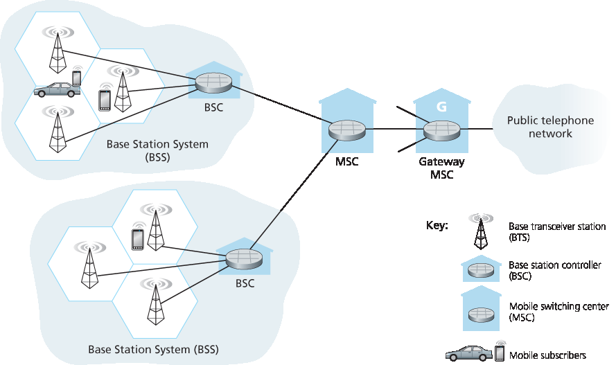
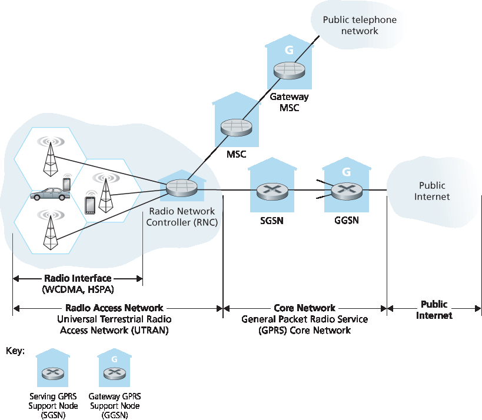
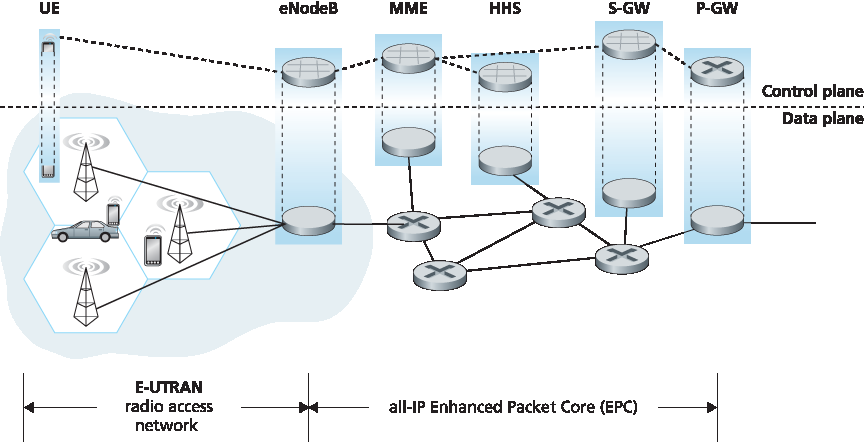
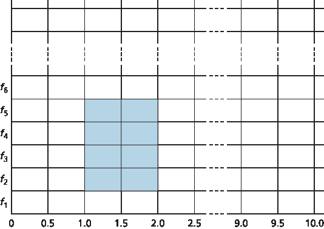

.. _c7.4:

7.4 蜂窝互联网接入
==================================
7.4 Cellular Internet Access

.. tab:: 中文

.. tab:: 英文

In the previous section we examined how an Internet host can access the Internet when inside a WiFi hotspot—that is, when it is within the vicinity of an 802.11 access point. But most WiFi hotspots have a small coverage area of between 10 and 100 meters in diameter. What do we do then when we have a desperate need for wireless Internet access and we cannot access a WiFi hotspot?

Given that cellular telephony is now ubiquitous in many areas throughout the world, a natural strategy is to extend cellular networks so that they support not only voice telephony but wireless Internet access as well. Ideally, this Internet access would be at a reasonably high speed and would provide for seamless mobility, allowing users to maintain their TCP sessions while traveling, for example, on a bus or a train. With sufficiently high upstream and downstream bit rates, the user could even maintain video- conferencing sessions while roaming about. This scenario is not that far-fetched. Data rates of several megabits per second are becoming available as broadband data services such as those we will cover here become more widely deployed.

In this section, we provide a brief overview of current and emerging cellular Internet access technologies. Our focus here will be on both the wireless first hop as well as the network that connects the wireless first hop into the larger telephone network and/or the Internet; in :ref:`Section 7.7 <c7.7>` we’ll consider how calls are routed to a user moving between base stations. Our brief discussion will necessarily provide only a simplified and high-level description of cellular technologies. Modern cellular communications, of course, has great breadth and depth, with many universities offering several courses on the topic. Readers seeking a deeper understanding are encouraged to see [:ref:`Goodman 1997 <Goodman 1997>`; :ref:`Kaaranen 2001 <Kaaranen 2001>`; :ref:`Lin 2001 <Lin 2001>`; :ref:`Korhonen 2003 <Korhonen 2003>`; :ref:`Schiller 2003 <Schiller 2003>`; :ref:`Palat 2009 <Palat 2009>`; :ref:`Scourias 2012 <Scourias 2012>`; :ref:`Turner 2012 <Turner 2012>`; :ref:`Akyildiz 2010 <Akyildiz 2010>`], as well as the particularly excellent and exhaustive references [:ref:`Mouly 1992 <Mouly 1992>`; :ref:`Sauter 2014 <Sauter 2014>`].

.. _c7.4.1:

7.4.1 蜂窝网络体系结构概述
--------------------------------------------------------
7.4.1 An Overview of Cellular Network Architecture

.. tab:: 中文

.. tab:: 英文

In our description of cellular network architecture in this section, we’ll adopt the terminology of the Global System for Mobile Communications (**GSM**) standards. (For history buffs, the GSM acronym was originally derived from Groupe Spécial Mobile, until the more anglicized name was adopted, preserving the original acronym letters.) In the 1980s, Europeans recognized the need for a pan-European digital cellular telephony system that would replace the numerous incompatible analog cellular telephony systems, leading to the GSM standard :ref:`[Mouly 1992] <Mouly 1992>`. Europeans deployed GSM technology with great success in the early 1990s, and since then GSM has grown to be the 800-pound gorilla of the cellular telephone world, with more than 80% of all cellular subscribers worldwide using GSM.

.. admonition:: CASE HISTORY

    **4G Cellular Mobile Versus Wireless LANs**

    Many cellular mobile phone operators are deploying 4G cellular mobile systems. In some countries (e.g., Korea and Japan), 4G LTE coverage is higher than 90%—nearly ubiquitous. In 2015, average download rates over deployed LTE systems range from 10Mbps in the US and India to close to 40 Mbps in New Zealand. These 4G systems are being deployed in licensed radio-frequency bands, with some operators paying considerable sums to governments for spectrum-use licenses. 4G systems allow users to access the Internet from remote outdoor locations while on the move, in a manner similar to today’s cellular phone-only access. In many cases, a user may have simultaneous access to both wireless LANs and 4G. With the capacity of 4G systems being both more constrained and more expensive, many mobile devices default to the use of WiFi rather than 4G, when both are avilable. The question of whether wireless edge network access will be primarily over wireless LANs or cellular systems remains an open question:

    - The emerging wireless LAN infrastructure may become nearly ubiquitous. IEEE 802.11 wireless LANs, operating at 54 Mbps and higher, are enjoying widespread deployment. Essentially all laptops, tablets and smartphones are factory-equipped with 802.11 LAN capabilities. Furthermore, emerging Internet appliances—such as wireless cameras and picture frames—also have low-powered wireless LAN capabilities.
    - Wireless LAN base stations can also handle mobile phone appliances. Many phones are already capable of connecting to the cellular phone network or to an IP network either natively or using a Skype-like Voice-over-IP service, thus bypassing the operator’s cellular voice and 4G data services.

    Of course, many other experts believe that 4G not only will be a major ­success, but will also dramatically revolutionize the way we work and live. Most likely, both WiFi and 4G will both become prevalent wireless technologies, with roaming ­wireless devices automatically selecting the access technology that provides the best service at their current physical location.

When people talk about cellular technology, they often classify the technology as belonging to one of several “generations.” The earliest generations were designed primarily for voice traffic. First generation (1G) systems were analog FDMA systems designed exclusively for voice-only communication. These 1G systems are almost extinct now, having been replaced by digital 2G systems. The original 2G systems were also designed for voice, but later extended (2.5G) to support data (i.e., Internet) as well as voice service. 3G systems also support voice and data, but with an emphasis on data capabilities and higher-speed radio access links. The 4G systems being deployed today are based on LTE technology, feature an all-IP core network, and provide integrated voice and data at multi-Megabit speeds.

Cellular Network Architecture, 2G: Voice Connections to the ­Telephone Network
~~~~~~~~~~~~~~~~~~~~~~~~~~~~~~~~~~~~~~~~~~~~~~~~~~~~~~~~~~~~~~~~~~~~~~~~~~~~~~~~

The term cellular refers to the fact that the region covered by a cellular network is partitioned into a number of geographic coverage areas, known as **cells**, shown as hexagons on the left side of :ref:`Figure 7.18 <Figure 7.18>`. As with the 802.11WiFi standard we ­studied in :ref:`Section 7.3.1 <c7.3.1>`, GSM has its own particular nomenclature. Each cell contains a **base transceiver station (BTS)** that transmits signals to and receives signals from the mobile stations in its cell. The coverage area of a cell depends on many factors, including the transmitting power of the BTS, the transmitting power of the user devices, obstructing buildings in the cell, and the height of base station antennas. Although :ref:`Figure 7.18 <Figure 7.18>` shows each cell containing one base transceiver station residing in the middle of the cell, many systems today place the BTS at corners where three cells intersect, so that a single BTS with directional antennas can service three cells.

.. _Figure 7.18:

**Figure 7.18 Components of the GSM 2G cellular network architecture**

The GSM standard for 2G cellular systems uses combined FDM/TDM (radio) for the air interface. Recall from :ref:`Chapter 1 <c1>` that, with pure FDM, the channel is partitioned into a number of frequency bands with each band devoted to a call. Also recall from :ref:`Chapter 1 <c1>` that, with pure TDM, time is partitioned into frames with each frame further partitioned into slots and each call being assigned the use of a particular slot in the revolving frame. In combined FDM/TDM systems, the channel is partitioned into a number of frequency sub-bands; within each sub-band, time is partitioned into frames and slots. Thus, for a combined FDM/TDM system, if the channel is partitioned into F sub-bands and time is partitioned into T slots, then the channel will be able to support F.T simultaneous calls. Recall that we saw in :ref:`Section 6.3.4 <c6.3.4>` that cable access networks also use a combined FDM/TDM approach. GSM systems consist of 200-kHz frequency bands with each band supporting eight TDM calls. GSM encodes speech at 13 kbps and 12.2 kbps.

A GSM network’s **base station controller (BSC)** will typically service several tens of base transceiver stations. The role of the BSC is to allocate BTS radio channels to mobile subscribers, perform **paging** (finding the cell in which a mobile user is resident), and perform handoff of mobile users—a topic we’ll cover shortly in :ref:`Section 7.7.2 <c7.7.2>`. The base station controller and its controlled base transceiver stations collectively constitute a GSM **base station subsystem (BSS)**.

As we’ll see in :ref:`Section 7.7 <c7.7>`, the **mobile switching center (MSC)** plays the central role in user authorization and accounting (e.g., determining whether a mobile device is allowed to connect to the cellular network), call establishment and teardown, and handoff. A single MSC will typically contain up to five BSCs, resulting in approximately 200K subscribers per MSC. A cellular provider’s network will have a number of MSCs, with special MSCs known as gateway MSCs connecting the provider’s cellular network to the larger public telephone network.

.. _c7.4.2:

7.4.2 3G 蜂窝移动数据网络：将 Internet 扩展到蜂窝移动用户
--------------------------------------------------------------------------------------
7.4.2 3G Cellular Data Networks: Extending the Internet to Cellular Subscribers

.. tab:: 中文

Our discussion in :ref:`Section 7.4.1 <c7.4.1>` focused on connecting cellular voice users to the public telephone network. But, of course, when we’re on the go, we’d also like to read e-mail, access the Web, get location-dependent services (e.g., maps and restaurant recommendations) and perhaps even watch streaming video. To do this, our smartphone will need to run a full TCP/IP protocol stack (including the physical link, network, transport, and application layers) and connect into the Internet via the cellular data network. The topic of cellular data networks is a rather bewildering collection of competing and ever-evolving standards as one generation (and half-generation) succeeds the former and introduces new technologies and services with new acronyms. To make matters worse, there’s no single official body that sets requirements for 2.5G, 3G, 3.5G, or 4G technologies, making it hard to sort out the differences among competing standards. In our discussion below, we’ll focus on the UMTS (Universal Mobile Telecommunications Service) 3G and 4G standards developed by the 3rd Generation Partnership project (3GPP) :ref:`[3GPP 2016] <3GPP 2016>`.

Let’s first take a top-down look at 3G cellular data network architecture shown in :ref:`Figure 7.19 <Figure 7.19>`.

.. _Figure 7.19:

**Figure 7.19 3G system architecture**

3G Core Network
~~~~~~~~~~~~~~~~~~

The 3G core cellular data network connects radio access networks to the public Internet. The core network interoperates with components of the existing cellular voice network (in particular, the MSC) that we previously encountered in :ref:`Figure 7.18 <Figure 7.18>`. Given the considerable amount of existing infrastructure (and profitable services!) in the existing cellular voice network, the approach taken by the designers of 3G data services is clear: leave the existing core GSM cellular voice network untouched, adding additional cellular data functionality in parallel to the existing cellular voice network. The alternative— integrating new data services directly into the core of the existing cellular voice network—would have raised the same challenges encountered in :ref:`Section 4.3 <c4.3>`, where we discussed integrating new (IPv6) and legacy (IPv4) technologies in the Internet.

There are two types of nodes in the 3G core network: **Serving GPRS Support Nodes (SGSNs)** and **Gateway GPRS Support Nodes (GGSNs)**. (GPRS stands for Generalized Packet Radio Service, an early cellular data service in 2G networks; here we discuss the evolved version of GPRS in 3G networks). An SGSN is responsible for delivering datagrams to/from the mobile nodes in the radio access network to which the SGSN is attached. The SGSN interacts with the cellular voice network’s MSC for that area, providing user authorization and handoff, maintaining location (cell) information about active mobile nodes, and performing datagram forwarding between mobile nodes in the radio access network and a GGSN. The GGSN acts as a gateway, connecting multiple SGSNs into the larger Internet. A GGSN is thus the last piece of 3G infrastructure that a datagram originating at a mobile node encounters before entering the larger Internet. To the outside world, the GGSN looks like any other gateway router; the mobility of the 3G nodes within the GGSN’s network is hidden from the outside world behind the GGSN.

3G Radio Access Network: The Wireless Edge
~~~~~~~~~~~~~~~~~~~~~~~~~~~~~~~~~~~~~~~~~~~

The 3G **radio access network** is the wireless first-hop network that we see as a 3G user. The **Radio Network Controller (RNC)** typically controls several cell base transceiver stations similar to the base stations that we encountered in 2G systems (but officially known in 3G UMTS parlance as a “Node Bs”—a rather non-descriptive name!). Each cell’s wireless link operates between the mobile nodes and a base transceiver station, just as in 2G networks. The RNC connects to both the circuit-switched cellular voice network via an MSC, and to the packet-switched Internet via an SGSN. Thus, while 3G cellular voice and cellular data services use different core networks, they share a common first/last-hop radio access network.

A significant change in 3G UMTS over 2G networks is that rather than using GSM’s FDMA/TDMA scheme, UMTS uses a CDMA technique known as Direct Sequence Wideband CDMA (DS-WCDMA) :ref:`[Dahlman 1998] <Dahlman 1998>` within TDMA slots; TDMA slots, in turn, are available on multiple frequencies—an interesting use of all three dedicated channel-sharing approaches that we earlier identified in :ref:`Chapter 6 <c6>` and similar to the approach taken in wired cable access networks (see :ref:`Section 6.3.4 <c6.3.4>`). This change requires a new 3G cellular wireless-access network operating in parallel with the 2G BSS radio network shown in :ref:`Figure 7.19 <Figure 7.19>`. The data service associated with the WCDMA specification is known as HSPA (High Speed Packet Access) and promises downlink data rates of up to 14 Mbps. Details regarding 3G networks can be found at the 3rd Generation Partnership Project (3GPP) Web site :ref:`[3GPP 2016] <3GPP 2016>`.

.. tab:: 英文

.. _c7.4.3:

7.4.3 进入 4G：LTE
--------------------------
7.4.3 On to 4G: LTE

.. tab:: 中文

.. tab:: 英文

Fourth generation (4G) cellular systems are becoming widely deployed. In 2015, more than 50 countries had 4G coverage exceeding 50%. The 4G Long-Term ­Evolution (LTE) standard :ref:`[Sauter 2014] <Sauter 2014>` put forward by the 3GPP has two important innovations over 3G systems an all-IP core network and an enhanced radio access network, as discussed below.

4G System Architecture: An All-IP Core Network
~~~~~~~~~~~~~~~~~~~~~~~~~~~~~~~~~~~~~~~~~~~~~~~~~

:ref:`Figure 7.20 <Figure 7.20>` shows the overall 4G network architecture, which (unfortunately) introduces yet another (rather impenetrable) new vocabulary and set of acronyms for ­network ­components. But let’s not get lost in these acronyms! There are two important high-level observations about the 4G architecture:

.. _Figure 7.20:

**Figure 7.20 4G network architecture**

- **A unified, all-IP network architecture**. Unlike the 3G network shown in :ref:`Figure 7.19 <Figure 7.19>`, which has separate network components and paths for voice and data traffic, the 4G architecture shown in :ref:`Figure 7.20 <Figure 7.20>` is “all-IP”—both voice and data are carried in IP datagrams to/from the wireless device (the User Equipment, UE in 4G parlance) to the gateway to the packet gateway (P-GW) that connects the 4G edge network to the rest of the network. With 4G, the last vestiges of cellular networks’ roots in the telephony have disappeared, giving way to universal IP service!
- **A clear separation of the 4G data plane and 4G control plane**. Mirroring our distinction between the data and control planes for IP’s network layer in :ref:`Chapters 4 <c4>` and :ref:`5 <c5>` respectively, the 4G network architecture also clearly separates the data and control planes. We’ll discuss their functionality below.
- **A clear separation between the radio access network, and the all-IP-core ­network**. IP datagrams carrying user data are forwarded between the user (UE) and the gateway (P-GW in :ref:`Figure 7.20 <Figure 7.20>`) over a 4G-internal IP network to the external Internet. Control packets are exchanged over this same internal network among the 4G’s control services components, whose roles are described below.

The principal components of the 4G architecture are as follows.

- The eNodeB is the logical descendant of the 2G base station and the 3G Radio Network Controller (a.k.a Node B) and again plays a central role here. Its data-plane role is to forward datagrams between UE (over the LTE radio access ­network) and the P-GW.
  UE datagrams are encapsulated at the eNodeB and tunneled to the P-GW through the 4G network’s all-IP enhanced packet core (EPC). This tunneling between the eNodeB and P-GW is similar the tunneling we saw in :ref:`Section 4.3 <c4.3>` of IPv6 datagrams between two IPv6 endpoints through a network of IPv4 routers. These tunnels may have associated quality of service (QoS) guarantees. For example, a 4G network may guarantee that voice traffic experiences no more than a 100 msec delay between UE and P-GW, and has a packet loss rate of less than 1%; TCP traffic might have a guarantee of 300 msec and a packet loss rate of less than .0001% :ref:`[Palat 2009] <Palat 2009>`. We’ll cover QoS in :ref:`Chapter 9 <c9>`.

  In the control plane, the eNodeB handles registration and mobility signaling traffic on behalf of the UE.

- The **Packet Data Network Gateway (P-GW)** allocates IP addresses to the UEs and performs QoS enforcement. As a tunnel endpoint it also performs datagram encapsulation/decapsulation when forwarding a datagram to/from a UE.
- The **Serving Gateway (S-GW)** is the data-plane mobility anchor point—all UE traffic will pass through the S-GW. The S-GW also performs charging/billing functions and lawful traffic interception.
- The **Mobility Management Entity (MME)** performs connection and mobility management on behalf of the UEs resident in the cell it controls. It receives UE subscription information from the HHS. We cover mobility in cellular networks in detail in :ref:`Section 7.7 <c7.7>`.
- The **Home Subscriber Server (HSS)** contains UE information including roaming access capabilities, quality of service profiles, and authentication information. As we’ll see in :ref:`Section 7.7 <c7.7>`, the HSS obtains this information from the UE’s home cellular provider.

Very readable introductions to 4G network architecture and its EPC are [:ref:`Motorola 2007 <Motorola 2007>`; :ref:`Palat 2009 <Palat 2009>`; :ref:`Sauter 2014 <Sauter 2014>`].

LTE Radio Access Network
~~~~~~~~~~~~~~~~~~~~~~~~~~

LTE uses a combination of frequency division multiplexing and time division multiplexing on the downstream channel, known as orthogonal frequency division multiplexing (OFDM) [:ref:`Rohde 2008 <Rohde 2008>`; :ref:`Ericsson 2011 <Ericsson 2011>`]. (The term “orthogonal” comes from the fact the signals being sent on different frequency
channels are created so that they interfere very little with each other, even when channel frequencies are tightly spaced). In LTE, each active mobile node is allocated one or more 0.5 ms time slots in one or more of the channel frequencies. :ref:`Figure 7.21 <Figure 7.21>` shows an allocation of eight time slots over four frequencies. By being allocated increasingly more time slots (whether on the same frequency or on different frequencies), a mobile node is able to achieve increasingly higher transmission rates. Slot (re)allocation among mobile nodes can be performed as often as once every millisecond. Different modulation schemes can also be used to change the transmission rate; see our earlier discussion of :ref:`Figure 7.3 <Figure 7.3>` and dynamic selection of modulation schemes in WiFi networks.

.. _Figure 7.21:

**Figure 7.21 Twenty 0.5 ms slots organized into 10 ms frames at each frequency. An eight-slot allocation is shown shaded.**

The particular allocation of time slots to mobile nodes is not mandated by the LTE standard. Instead, the decision of which mobile nodes will be allowed to transmit in a given time slot on a given frequency is determined by the scheduling algorithms provided by the LTE equipment vendor and/or the network operator. With opportunistic scheduling [:ref:`Bender 2000 <Bender 2000>`; :ref:`Kolding 2003 <Kolding 2003>`; :ref:`Kulkarni 2005 <Kulkarni 2005>`], matching the physical-layer protocol to the channel conditions between the sender and receiver and choosing the receivers to which packets will be sent based on channel conditions allow the radio network controller to make best use of the wireless medium. In addition, user priorities and contracted levels of service (e.g., silver, gold, or platinum) can be used in scheduling downstream packet transmissions. In addition to the LTE capabilities described above, LTE-Advanced allows for downstream bandwidths of hundreds of Mbps by allocating aggregated channels to a mobile node :ref:`[Akyildiz 2010] <Akyildiz 2010>`.

An additional 4G wireless technology—WiMAX (World Interoperability for Microwave Access)—is a family of IEEE 802.16 standards that differ significantly from LTE. WiMAX has not yet been able to enjoy the widespread deployment of LTE. A detailed discussion of WiMAX can be found on this book’s Web site.