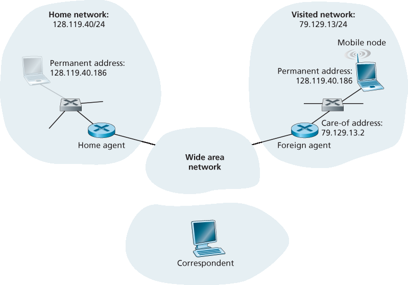
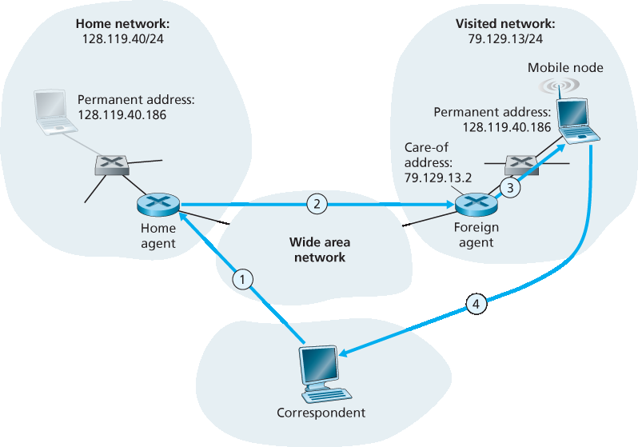
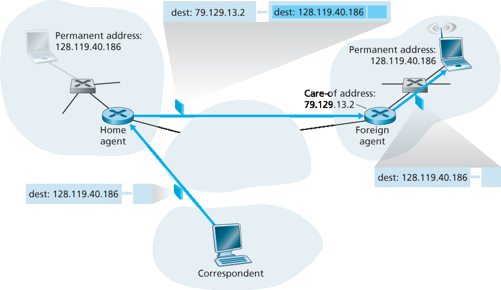
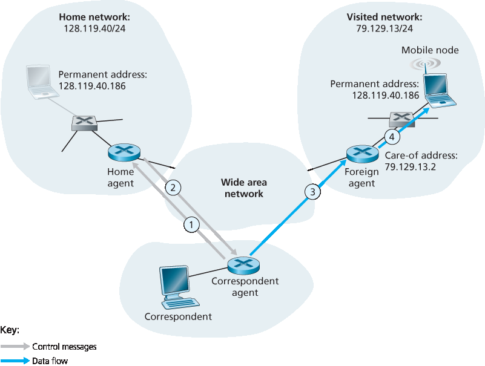
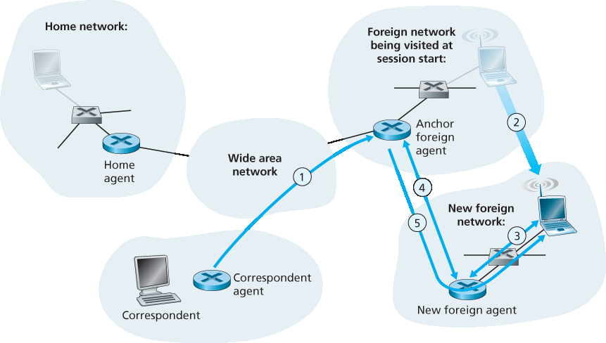

.. _c7.5:

7.5 移动性管理：原则
===================================================================
7.5 Mobility Management: Principles

.. tab:: 中文

.. tab:: 英文

Having covered the wireless nature of the communication links in a wireless network, it’s now time to turn our attention to the mobility that these wireless links enable. In the broadest sense, a mobile node is one that changes its point of attachment into the network over time. Because the term mobility has taken on many meanings in both the computer and telephony worlds, it will serve us well first to consider several dimensions of mobility in some detail.

- **From the network layer’s standpoint, how mobile is a user**? A physically mobile user will present a very different set of challenges to the network layer, depending on how he or she moves between points of attachment to the network. At one end of the spectrum in :ref:`Figure 7.22 <Figure 7.22>`, a user may carry a laptop with a wireless network interface card around in a building. As we saw in :ref:`Section 7.3.4 <c7.3.4>`, this user is not mobile from a network-layer perspective. Moreover, if the user associates with the same access point regardless of location, the user is not even mobile from the perspective of the link layer.
  At the other end of the spectrum, consider the user zooming along the autobahn in a BMW or Tesla at 150 kilometers per hour, passing through multiple wireless access networks and wanting to maintain an uninterrupted TCP connection to a remote application throughout the trip. This user is definitely mobile! In between these extremes is a user who takes a laptop from one location (e.g., office or dormitory) into another (e.g., coffeeshop, classroom) and wants to connect into the-network in the new location. This user is also mobile (although less so than the BMW driver!) but does not need to maintain an ongoing connection while moving between points of attachment to the network. :ref:`Figure 7.22 <Figure 7.22>` illustrates this spectrum of user mobility from the network layer’s perspective.

  .. figure:: ../img/622-0.png 
      :align: center
  
  .. _Figure 7.22:

  **Figure 7.22 Various degrees of mobility, from the network layer’s point of view**

- **How important is it for the mobile node’s address to always remain the same**? With mobile telephony, your phone number—essentially the network-layer address of your phone—remains the same as you travel from one provider’s mobile phone network to another. Must a laptop similarly maintain the same IP address while moving between IP networks?
  
  The answer to this question will depend strongly on the applications being run. For the BMW or Tesla driver who wants to maintain an uninterrupted TCP connection to a remote application while zipping along the autobahn, it would be convenient to maintain the same IP address. Recall from :ref:`Chapter 3 <c3>` that an Internet application needs to know the IP address and port number of the remote entity with which it is communicating. If a mobile entity is able to maintain its IP address as it moves, mobility becomes invisible from the application standpoint. There is great value to this transparency —an application need not be concerned with a potentially changing IP address, and the same application code serves mobile and nonmobile connections alike. We’ll see in the following section that mobile IP provides this transparency, allowing a mobile node to maintain its permanent IP address while moving among networks.

  On the other hand, a less glamorous mobile user might simply want to turn off an office laptop, bring that laptop home, power up, and work from home. If the laptop functions primarily as a client in client-server applications (e.g., send/read e-mail, browse the Web, Telnet to a remote host) from home, the particular IP address used by the laptop is not that important. In particular, one could get by fine with an address that is temporarily allocated to the laptop by the ISP serving the home. We saw in :ref:`Section 4.3 <c4.3>` that DHCP already provides this functionality.

- **What supporting wired infrastructure is available**? In all of our scenarios above, we’ve implicitly assumed that there is a fixed infrastructure to which the mobile user can connect—for example, the home’s ISP network, the wireless access network in the office, or the wireless access networks lining the autobahn. What if no such infrastructure exists? If two users are within communication proximity of each other, can they establish a network connection in the absence of any other network-layer infrastructure? Ad hoc networking provides precisely these capabilities. This rapidly developing area is at the cutting edge of mobile networking research and is beyond the scope of this book. :ref:`[Perkins 2000] <Perkins 2000>` and the IETF Mobile Ad Hoc Network (manet) working group Web pages [manet 2016] provide thorough treatments of the subject.

In order to illustrate the issues involved in allowing a mobile user to maintain ongoing connections while moving between networks, let’s consider a human analogy. A twenty-something adult moving out of the family home becomes mobile, living in a series of dormitories and/or apartments, and often changing addresses. If an old friend wants to get in touch, how can that friend find the address of her mobile friend? One common way is to contact the family, since a mobile adult will often register his or her current address with the family (if for no other reason than so that the parents can send money to help pay the rent!). The family home, with its permanent address, becomes that one place that others can go as a first step in communicating with the mobile adult. Later communication from the friend may be either indirect (for example, with mail being sent first to the parents’ home and then forwarded to the mobile adult) or direct (for example, with the friend using the address obtained from the parents to send mail directly to her mobile friend).

In a network setting, the permanent home of a mobile node (such as a laptop or smartphone) is known as the **home network**, and the entity within the home network that performs the mobility management functions discussed below on behalf of the mobile node is known as the **home agent**. The network in which the mobile node is currently residing is known as the foreign (or visited) network, and the entity within the foreign network that helps the mobile node with the mobility management functions discussed below is known as a **foreign agent**. For mobile professionals, their home network might likely be their company network, while the visited network might be the network of a colleague they are visiting. A **correspondent** is the entity wishing to communicate with the mobile node. :ref:`Figure 7.23 <Figure 7.23>` illustrates these concepts, as well as addressing concepts considered below. In :ref:`Figure 7.23 <Figure 7.23>`, note that agents are shown as being collocated with routers (e.g., as processes running on routers), but alternatively they could be executing on other hosts or servers in the network.

.. _c7.5.1:

7.5.1 寻址
--------------------------------------------------------------------------------------
7.5.1 Addressing

.. tab:: 中文

.. tab:: 英文

We noted above that in order for user mobility to be transparent to network applications, it is desirable for a mobile node to keep its address as it moves from one network to another. When a mobile node is resident in a foreign network, all traffic addressed to the node’s permanent address now needs to be routed to the foreign network. How can this be done? One option is for the foreign network to advertise to all other networks that the mobile node is resident in its network. This could be via the usual exchange of intradomain and interdomain routing information and would require few changes to the existing routing infrastructure. The foreign network could simply advertise to its neighbors that it has a highly specific route to the mobile node’s permanent address (that is, essentially inform other networks that it has the correct path for routing datagrams to the mobile node’s permanent address; see :ref:`Section 4.3 <c4.3>`). These neighbors would then propagate this routing information throughout the network as part of the normal procedure of updating routing information and forwarding tables. When the mobile node leaves one foreign network and joins another, the new foreign network would advertise a new, highly specific route to the mobile node, and the old foreign network would withdraw its routing information regarding the mobile node.

.. _Figure 7.23:

**Figure 7.23 Initial elements of a mobile network architecture**

This solves two problems at once, and it does so without making significant changes to the network- layer infrastructure. Other networks know the location of the mobile node, and it is easy to route datagrams to the mobile node, since the forwarding tables will direct datagrams to the foreign network. A significant drawback, however, is that of scalability. If mobility management were to be the responsibility of network routers, the routers would have to maintain forwarding table entries for potentially millions of mobile nodes, and update these entries as nodes move. Some additional drawbacks are explored in the problems at the end of this chapter.

An alternative approach (and one that has been adopted in practice) is to push mobility functionality from the network core to the network edge—a recurring theme in our study of Internet architecture. A natural way to do this is via the mobile node’s home network. In much the same way that parents of the mobile twenty-something track their child’s location, the home agent in the mobile node’s home network can track the foreign network in which the mobile node resides. A protocol between the mobile node (or a foreign agent representing the mobile node) and the home agent will certainly be needed to update the mobile node’s location.

Let’s now consider the foreign agent in more detail. The conceptually simplest approach, shown in :ref:`Figure 7.23 <Figure 7.23>`, is to locate foreign agents at the edge routers in the foreign network. One role of the foreign agent is to create a so-called **care-of address (COA)** for the mobile node, with the network portion of the COA matching that of the foreign network. There are thus two addresses associated with a mobile node, its **permanent address** (analogous to our mobile youth’s family’s home address) and its COA, sometimes known as a foreign address (analogous to the address of the house in which our mobile youth is currently residing). In the example in :ref:`Figure 7.23 <Figure 7.23>`, the permanent address of the mobile node is 128.119.40.186. When visiting network 79.129.13/24, the mobile node has a COA of 79.129.13.2. A second role of the foreign agent is to inform the home agent that the mobile node is resident in its (the foreign agent’s) network and has the given COA. We’ll see shortly that the COA will be used to “reroute” datagrams to the mobile node via its foreign agent.

Although we have separated the functionality of the mobile node and the foreign agent, it is worth noting that the mobile node can also assume the responsibilities of the foreign agent. For example, the mobile node could obtain a COA in the foreign network (for example, using a protocol such as DHCP) and itself inform the home agent of its COA.

.. _c7.5.2:

7.5.2 路由到移动节点
--------------------------------------------------------------------------------------
7.5.2 Routing to a Mobile Node

.. tab:: 中文

.. tab:: 英文

We have now seen how a mobile node obtains a COA and how the home agent can be informed of that address. But having the home agent know the COA solves only part of the problem. How should datagrams be addressed and forwarded to the mobile node? Since only the home agent (and not network-wide routers) knows the location of the mobile node, it will no longer suffice to simply address a datagram to the mobile node’s permanent address and send it into the network-layer infrastructure. Something more must be done. Two approaches can be identified, which we will refer to as indirect and direct routing.

Indirect Routing to a Mobile Node
~~~~~~~~~~~~~~~~~~~~~~~~~~~~~~~~~~~~

Let’s first consider a correspondent that wants to send a datagram to a mobile node. In the **indirect routing** approach, the correspondent simply addresses the datagram to the mobile node’s permanent address and sends the datagram into the network, blissfully unaware of whether the mobile node is resident in its home network or is visiting a foreign network; mobility is thus completely transparent to the correspondent. Such datagrams are first routed, as usual, to the mobile node’s home network. This is illustrated in step 1 in :ref:`Figure 7.24 <Figure 7.24>`.

Let’s now turn our attention to the home agent. In addition to being responsible for interacting with a foreign agent to track the mobile node’s COA, the home agent has another very important function. Its second job is to be on the lookout for arriving datagrams addressed to nodes whose home network is that of the home agent but that are currently resident in a foreign network. The home agent intercepts these datagrams and then forwards them to a mobile node in a two-step process. The datagram is first forwarded to the foreign agent, using the mobile node’s COA (step 2 in :ref:`Figure 7.24 <Figure 7.24>`), and then forwarded from the foreign agent to the mobile node (step 3 in :ref:`Figure 7.24 <Figure 7.24>`).

.. _Figure 7.24:

**Figure 7.24 Indirect routing to a mobile node**

It is instructive to consider this rerouting in more detail. The home agent will need to address the datagram using the mobile node’s COA, so that the network layer will route the datagram to the foreign network. On the other hand, it is desirable to leave the correspondent’s datagram intact, since the application receiving the datagram should be unaware that the datagram was forwarded via the home agent. Both goals can be satisfied by having the home agent **encapsulate** the correspondent’s original complete datagram within a new (larger) datagram. This larger datagram is addressed and delivered to the mobile node’s COA. The foreign agent, who “owns” the COA, will receive and decapsulate the datagram—that is, remove the correspondent’s original datagram from within the larger encapsulating datagram and forward (step 3 in :ref:`Figure 7.24 <Figure 7.24>`) the original datagram to the mobile node. :ref:`Figure 7.25 <Figure 7.25>` shows a correspondent’s original datagram being sent to the home network, an encapsulated datagram being sent to the foreign agent, and the original datagram being delivered to the mobile node. The sharp reader will note that the encapsulation/decapsulation described here is identical to the notion of tunneling, discussed in :ref:`Section 4.3 <c4.3>` in the context of IP multicast and IPv6.

Let’s next consider how a mobile node sends datagrams to a correspondent. This is quite simple, as the mobile node can address its datagram directly to the correspondent (using its own permanent address as the source address, and the correspondent’s address as the destination address). Since the mobile node knows the correspondent’s address, there is no need to route the datagram back through the home agent. This is shown as step 4 in :ref:`Figure 7.24 <Figure 7.24>`.

.. _Figure 7.25:

**Figure 7.25 Encapsulation and decapsulation**

Let’s summarize our discussion of indirect routing by listing the new network-layer functionality required to support mobility.

- **A mobile-node–to–foreign-agent protocol**. The mobile node will register with the foreign agent when attaching to the foreign network. Similarly, a mobile node will deregister with the foreign agent when it leaves the foreign network.
- **A foreign-agent–to–home-agent registration protocol**. The foreign agent will register the mobile node’s COA with the home agent. A foreign agent need not explicitly deregister a COA when a
mobile node leaves its network, because the subsequent registration of a new COA, when the mobile node moves to a new network, will take care of this.
- **A home-agent datagram encapsulation protocol**. Encapsulation and forwarding of the correspondent’s original datagram within a datagram addressed to the COA.
- **A foreign-agent decapsulation protocol**. Extraction of the correspondent’s original datagram from the encapsulating datagram, and the forwarding of the original datagram to the mobile node.

The previous discussion provides all the pieces—foreign agents, the home agent, and indirect forwarding—needed for a mobile node to maintain an ongoing connection while moving among networks. As an example of how these pieces fit together, assume the mobile node is attached to foreign network A, has registered a COA in network A with its home agent, and is receiving datagrams that are being indirectly routed through its home agent. The mobile node now moves to foreign network B and registers with the foreign agent in network B, which informs the home agent of the mobile node’s new COA. From this point on, the home agent will reroute datagrams to foreign network B. As far as a correspondent is concerned, mobility is transparent—datagrams are routed via the same home agent both before and after the move. As far as the home agent is concerned, there is no disruption in the flow of datagrams—arriving datagrams are first forwarded to foreign network A; after the change in COA, datagrams are forwarded to foreign network B. But will the mobile node see an interrupted flow of datagrams as it moves between networks? As long as the time between the mobile node’s disconnection from network A (at which point it can no longer receive datagrams via A) and its attachment to network B (at which point it will register a new COA with its home agent) is small, few datagrams will be lost. Recall from :ref:`Chapter 3 <c3>` that end-to-end connections can suffer datagram loss due to network congestion. Hence occasional datagram loss within a connection when a node moves between networks is by no means a catastrophic problem. If loss-free communication is required, upper- layer mechanisms will recover from datagram loss, whether such loss results from network congestion or from user mobility.

An indirect routing approach is used in the mobile IP standard [:rfc:`5944`], as discussed in :ref:`Section 7.6 <c7.6>`.

Direct Routing to a Mobile Node
~~~~~~~~~~~~~~~~~~~~~~~~~~~~~~~~~

The indirect routing approach illustrated in :ref:`Figure 7.24 <Figure 7.24>` suffers from an inefficiency known as the **triangle routing problem**—datagrams addressed to the mobile node must be routed first to the home agent and then to the foreign network, even when a much more efficient route exists between the correspondent and the mobile node. In the worst case, imagine a mobile user who is visiting the foreign network of a colleague. The two are sitting side by side and exchanging data over the network. Datagrams from the correspondent (in this case the colleague of the visitor) are routed to the mobile user’s home agent and then back again to the foreign network!

**Direct routing** overcomes the inefficiency of triangle routing, but does so at the cost of additional complexity. In the direct routing approach, a **correspondent agent** in the correspondent’s network first learns the COA of the mobile node. This can be done by having the correspondent agent query the home agent, assuming that (as in the case of indirect routing) the mobile node has an up-to-date value for its COA registered with its home agent. It is also possible for the correspondent itself to perform the function of the correspondent agent, just as a mobile node could perform the function of the foreign agent. This is shown as steps 1 and 2 in :ref:`Figure 7.26 <Figure 7.26>`. The correspondent agent then tunnels datagrams directly to the mobile node’s COA, in a manner analogous to the tunneling performed by the home agent, steps 3 and 4 in :ref:`Figure 7.26 <Figure 7.26>`.

While direct routing overcomes the triangle routing problem, it introduces two important additional challenges:

- **A mobile-user location protocol** is needed for the correspondent agent to query the home agent to obtain the mobile node’s COA (steps 1 and 2 in :ref:`Figure 7.26 <Figure 7.26>`).
- When the mobile node moves from one foreign network to another, how will data now be forwarded to the new foreign network? In the case of indirect routing, this problem was easily solved by
updating the COA maintained by the home agent. However, with direct routing, the home agent is queried for the COA by the correspondent agent only once, at the beginning of the session. Thus, updating the COA at the home agent, while necessary, will not be enough to solve the problem of routing data to the mobile node’s new foreign network.

One solution would be to create a new protocol to notify the correspondent of the changing COA. An alternate solution, and one that we’ll see adopted in practice in GSM networks, works as follows. Suppose data is currently being forwarded to the mobile node in the foreign network where the mobile node was located when the session first started (step 1 in :ref:`Figure 7.27 <Figure 7.27>`). We’ll identify the foreign agent in that foreign network where the mobile node was first found as the **anchor ­foreign agent**. When the mobile node moves to a new foreign network (step 2 in :ref:`Figure 7.27 <Figure 7.27>`), the mobile node registers with the new foreign agent (step 3), and the new foreign agent provides the anchor foreign agent with the mobile node’s new COA (step 4). When the anchor foreign agent receives an encapsulated datagram for a departed mobile node, it can then re-encapsulate the datagram and forward it to the mobile node (step 5) using the new COA. If the mobile node later moves yet again to a new foreign network, the foreign agent in that new visited network would then contact the anchor foreign agent in order to set up forwarding to this new foreign network.

.. _Figure 7.26:

**Figure 7.26 Direct routing to a mobile user**

.. _Figure 7.27:

**Figure 7.27 Mobile transfer between networks with direct routing**

