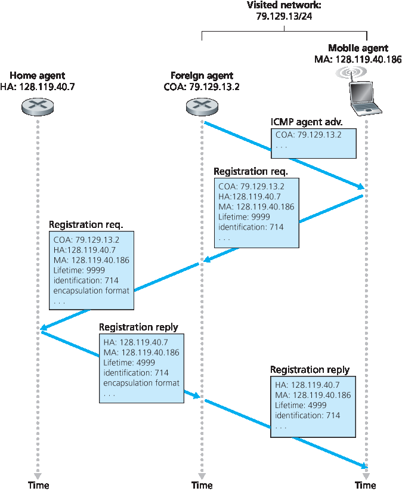

.. _c7.6:

7.6 移动 IP
===================================================================
7.6 Mobile IP

用于支持移动性的互联网架构和协议统称为移动IP，其主要在RFC 5944（适用于IPv4）中定义。移动IP是一个灵活的标准，支持多种不同的操作模式（例如，使用或不使用外部代理的操作），支持代理和移动节点之间多种发现方式，支持使用一个或多个关联系地址（COA），并支持多种封装形式。因此，移动IP是一个复杂的标准，需要整本书来详细描述；实际上，已有一本这样的书是 :ref:`[Perkins 1998b] <Perkins 1998b>`。我们在此的目标是简要概述移动IP最重要的方面，并通过几个常见情形展示其使用方式。

移动IP架构包含我们前面讨论的许多元素，包括归属代理、外部代理、关联系地址（COA）以及封装/解封装的概念。当前标准 [:rfc:`5944`] 指定使用间接路由将数据报转发给移动节点。

移动IP标准由三个主要部分组成：

- **代理发现**。移动IP定义了归属代理或外部代理用于向移动节点通告其服务的协议，以及移动节点用于请求归属或外部代理服务的协议。
- **向归属代理注册**。移动IP定义了移动节点和/或外部代理用于向移动节点的归属代理注册和注销COA的协议。
- **数据报的间接路由**。该标准还定义了归属代理向移动节点转发数据报的方式，包括转发规则、错误处理规则和多种封装形式 [:rfc:`2003`, :rfc:`2004`]。

安全性在整个移动IP标准中占据重要地位。例如，必须验证移动节点的身份，以确保恶意用户不会向归属代理注册伪造的COA，从而导致发送至某IP地址的所有数据报被重定向到该恶意用户。移动IP通过许多将在 :ref:`第8章 <c8>` 中讨论的机制实现安全，因此我们在下文中不再赘述安全问题。

.. toggle::

   The Internet architecture and protocols for supporting mobility, collectively known as mobile IP, are defined primarily in RFC 5944 for IPv4. Mobile IP is a flexible standard, supporting many different modes of operation (for example, operation with or without a foreign agent), multiple ways for agents and mobile nodes to discover each other, use of single or multiple COAs, and multiple forms of encapsulation. As such, mobile IP is a complex standard, and would require an entire book to describe in detail; indeed one such book is :ref:`[Perkins 1998b] <Perkins 1998b>`. Our modest goal here is to provide an overview of the most important aspects of mobile IP and to illustrate its use in a few common-case scenarios.
   
   The mobile IP architecture contains many of the elements we have considered above, including the concepts of home agents, foreign agents, care-of addresses, and encapsulation/decapsulation. The current standard [:rfc:`5944`] specifies the use of indirect routing to the mobile node. 
   
   The mobile IP standard consists of three main pieces:
   
   - **Agent discovery**. Mobile IP defines the protocols used by a home or foreign agent to advertise its services to mobile nodes, and protocols for mobile nodes to solicit the services of a foreign or home agent.
   - **Registration with the home agent**. Mobile IP defines the protocols used by the mobile node and/or foreign agent to register and deregister COAs with a mobile node’s home agent.
   - **Indirect routing of datagrams**. The standard also defines the manner in which datagrams are forwarded to mobile nodes by a home agent, including rules for forwarding datagrams, rules for handling error conditions, and several forms of encapsulation [:rfc:`2003`, :rfc:`2004`].
   
   Security considerations are prominent throughout the mobile IP standard. For example, authentication of a mobile node is clearly needed to ensure that a ­malicious user does not register a bogus care-of address with a home agent, which could cause all datagrams addressed to an IP address to be redirected to the malicious user. Mobile IP achieves security using many of the mechanisms that we will examine in :ref:`Chapter 8 <c8>`, so we will not address security considerations in our discussion below.

代理发现
~~~~~~~~~~~~~~~~~~
Agent Discovery

移动IP节点连接到一个新网络时，无论是进入外部网络还是返回归属网络，都必须获知相应外部或归属代理的身份。实际上，正是通过发现新的外部代理（拥有新网络地址），移动节点的网络层才能得知其已进入新的外部网络。该过程被称为代理发现。代理发现可通过两种方式完成：代理通告或代理请求。

通过 **代理通告**，外部代理或归属代理使用对现有路由器发现协议的扩展来通告其服务 [:rfc:`1256`]。代理会周期性地在其连接的所有链路上广播类型字段为9（路由器发现）的ICMP消息。该路由器发现消息包含路由器的IP地址（即代理的地址），从而允许移动节点获知代理的IP地址。该路由器发现消息还包含一个移动代理通告扩展字段，其中包含移动节点所需的附加信息。扩展字段中较重要的字段包括：

- **归属代理位（H）**。指示该代理是其所在网络的归属代理。
- **外部代理位（F）**。指示该代理是其所在网络的外部代理。
- **需要注册位（R）**。指示该网络中的移动用户必须向外部代理注册。特别地，移动用户不能在外部网络中（例如，使用DHCP）获取一个COA并自行承担外部代理的功能，而不向外部代理注册。

  .. _Figure 7.28:

  .. figure:: ../img/633-0.png 
      :align: center

  **图 7.28 包含移动代理通告扩展字段的ICMP路由器发现消息**

- **M, G封装位**。指示是否将使用除IP-in-IP封装以外的封装形式。
- **COA字段**。由外部代理提供的一个或多个关联系地址的列表。在下方示例中，COA将与外部代理相关联，外部代理将接收发送至该COA的数据报并将其转发给适当的移动节点。移动用户在向其归属代理注册时将从中选择一个地址作为自己的COA。

:ref:`图7.28 <Figure 7.28>` 展示了代理通告消息中的一些关键字段。

通过 **代理请求**，一个希望了解代理信息而不愿等待代理通告的移动节点可以广播代理请求消息，该消息仅是类型值为10的ICMP消息。接收到请求的代理将向该移动节点单播一个代理通告，该移动节点随后即可如同接收到非请求通告一样继续操作。

.. toggle::
   
   A mobile IP node arriving to a new network, whether attaching to a foreign network or returning to its home network, must learn the identity of the corresponding foreign or home agent. Indeed it is the discovery of a new foreign agent, with a new network address, that allows the network layer in a mobile node to learn that it has moved into a new foreign network. This process is known as agent discovery. Agent discovery can be accomplished in one of two ways: via agent advertisement or via agent solicitation.
   
   With **agent advertisement**, a foreign or home agent advertises its services using an extension to the existing router discovery protocol [:rfc:`1256`]. The agent periodically broadcasts an ICMP message with a type field of 9 (router discovery) on all links to which it is connected. The router discovery message contains the IP address of the router (that is, the agent), thus allowing a mobile node to learn the agent’s IP address. The router discovery message also contains a mobility agent advertisement extension that contains additional information needed by the mobile node. Among the more important fields in the extension are the following:
   
   - **Home agent bit (H)**. Indicates that the agent is a home agent for the network in which it resides. 
   - **Foreign agent bit (F)**. Indicates that the agent is a foreign agent for the network in which it resides.
   - **Registration required bit (R)**. Indicates that a mobile user in this network must register with a foreign agent. In particular, a mobile user cannot obtain a care-of address in the foreign network (for example, using DHCP) and assume the functionality of the foreign agent for itself, without registering with the foreign agent.
   
     .. figure:: ../img/633-0.png 
         :align: center
     
     .. _Figure 7.28:
   
     **Figure 7.28 ICMP router discovery message with mobility agent ­advertisement extension**
   
   - **M, G encapsulation bits**. Indicate whether a form of encapsulation other than IP-in-IP encapsulation will be used.
   - **Care-of address (COA) fields**. A list of one or more care-of addresses provided by the foreign agent. In our example below, the COA will be associated with the foreign agent, who will receive datagrams sent to the COA and then forward them to the appropriate mobile node. The mobile user will select one of these addresses as its COA when registering with its home agent.
   
   :ref:`Figure 7.28 <Figure 7.28>` illustrates some of the key fields in the agent advertisement message.
   
   With **agent solicitation**, a mobile node wanting to learn about agents without waiting to receive an agent advertisement can broadcast an agent solicitation message, which is simply an ICMP message with type value 10. An agent receiving the solicitation will unicast an agent advertisement directly to the mobile node, which can then proceed as if it had received an unsolicited advertisement.

向归属代理注册
~~~~~~~~~~~~~~~~~~~~~~~~~~~~~~~~~~
Registration with the Home Agent

一旦移动IP节点获取了一个COA，该地址必须向归属代理注册。这可以通过外部代理完成（由其将COA注册至归属代理），也可以由移动IP节点直接完成。我们在下文考虑前一种情况。该过程包括四个步骤：

1. 在接收到外部代理通告之后，移动节点向外部代理发送一个移动IP注册消息。注册消息包含在一个UDP数据报中，并发送至端口434。该注册消息携带由外部代理通告的COA、归属代理（HA）的地址、移动节点的永久地址（MA）、请求的注册生存期，以及一个64位注册标识。所请求的注册生存期是指该注册有效的秒数。如果注册在规定的生存期内未在归属代理处续期，则注册将失效。注册标识类似于序列号，用于将接收到的注册应答与注册请求对应起来，详见下文。
2. 外部代理接收到注册消息后记录移动节点的永久IP地址。此时外部代理知道需要查找那些封装数据报，其目的地址与移动节点永久地址匹配。外部代理随后向归属代理发送一个移动IP注册消息（同样封装在UDP数据报中），发送至端口434。该消息包含COA、HA、MA、请求的封装格式、请求的注册生存期以及注册标识。
3. 归属代理接收到注册请求后，检查其有效性和真实性。归属代理将移动节点的永久IP地址与COA绑定；今后，所有到达归属代理并以该移动节点为目的地址的数据报都将被封装并通过隧道转发至该COA。归属代理随后发送一个移动IP注册应答，包含HA、MA、实际注册生存期和满足该请求的注册标识。
4. 外部代理接收到注册应答后将其转发给移动节点。

此时，注册完成，移动节点可接收发送至其永久地址的数据报。:ref:`图7.29` 展示了这一系列步骤。注意，归属代理所指定的注册生存期小于移动节点请求的生存期。

当移动节点离开外部网络时，外部代理不必显式注销COA。当移动节点迁移到新的网络（无论是另一个外部网络还是其归属网络）并注册新的COA时，这一过程将自动完成。

除了上述内容，移动IP标准还支持许多其他情形与功能。感兴趣的读者可参阅 [:ref:`Perkins 1998b <Perkins 1998b>`; :rfc:`5944`]。

.. _Figure 7.29:

**图 7.29 代理通告与移动IP注册**

.. toggle::

   Once a mobile IP node has received a COA, that address must be registered with the home agent. This can be done either via the foreign agent (who then registers the COA with the home agent) or directly by the mobile IP node itself. We consider the former case below. Four steps are involved.
   
   1. Following the receipt of a foreign agent advertisement, a mobile node sends a mobile IP registration message to the foreign agent. The registration message is carried within a UDP datagram and sent to port 434. The registration message carries a COA advertised by the foreign agent, the address of the home agent (HA), the permanent address of the mobile node (MA), the requested lifetime of the registration, and a 64-bit registration identification. The requested registration lifetime is the number of seconds that the registration is to be valid. If the registration is not renewed at the home agent within the specified lifetime, the registration will become invalid. The registration identifier acts like a sequence number and serves to match a received registration reply with a registration request, as discussed below.
   2. The foreign agent receives the registration message and records the mobile node’s permanent IP address. The foreign agent now knows that it should be looking for datagrams containing an encapsulated datagram whose destination address matches the permanent address of the mobile node. The foreign agent then sends a mobile IP registration message (again, within a UDP datagram) to port 434 of the home agent. The message contains the COA, HA, MA, encapsulation format requested, requested registration lifetime, and registration identification.
   3. The home agent receives the registration request and checks for authenticity and correctness. The home agent binds the mobile node’s permanent IP address with the COA; in the future, datagrams arriving at the home agent and addressed to the mobile node will now be encapsulated and tunneled to the COA. The home agent sends a mobile IP registration reply containing the HA, MA, actual registration lifetime, and the registration identification of the request that is being satisfied with this reply.
   4. The foreign agent receives the registration reply and then forwards it to the mobile node.
   
   At this point, registration is complete, and the mobile node can receive datagrams sent to its permanent address. :ref:`Figure 7.29` illustrates these steps. Note that the home agent specifies a lifetime that is smaller than the lifetime requested by the mobile node.
   
   A foreign agent need not explicitly deregister a COA when a mobile node leaves its network. This will occur automatically, when the mobile node moves to a new network (whether another foreign network or its home network) and registers a new COA.
   
   The mobile IP standard allows many additional scenarios and capabilities in addition to those described previously. The interested reader should consult [:ref:`Perkins 1998b <Perkins 1998b>`; :rfc:`5944`].
   
   .. figure:: ../img/635-0.png 
       :align: center
   
   **Figure 7.29 Agent advertisement and mobile IP registration**
