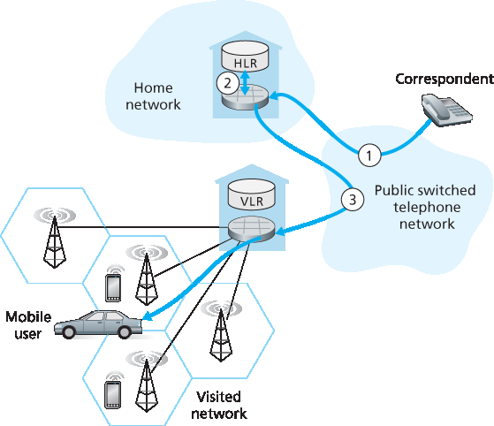

.. _c7.7:

7.7 管理蜂窝网络中的移动性
===================================================================
7.7 Managing Mobility in Cellular Networks

.. tab:: 中文

.. tab:: 英文

Having examined how mobility is managed in IP networks, let’s now turn our attention to networks with an even longer history of supporting mobility—cellular telephony networks. Whereas we focused on the first-hop wireless link in cellular networks in :ref:`Section 7.4 <c7.4>`, we’ll focus here on mobility, using the GSM cellular network [:ref:`Goodman 1997 <Goodman 1997>`; :ref:`Mouly 1992 <Mouly 1992>`; :ref:`Scourias 2012 <Scourias 2012>`; :ref:`Kaaranen 2001 <Kaaranen 2001>`; :ref:`Korhonen 2003 <Korhonen 2003>`; :ref:`Turner 2012 <Turner 2012>`] as our case study, since it is a mature and widely deployed technology. Mobility in 3G and 4G networks is similar in principle to that used in GSM. As in the case of mobile IP, we’ll see that a number of the fundamental principles we identified in :ref:`Section 7.5 <c7.5>` are embodied in GSM’s network architecture.

Like mobile IP, GSM adopts an indirect routing approach (see :ref:`Section 7.5.2 <c7.5.2>`), first routing the correspondent’s call to the mobile user’s home network and from there to the visited network. In GSM terminology, the mobile users’s home network is referred to as the mobile user’s **home public land mobile network (home PLMN)**. Since the PLMN acronym is a bit of a mouthful, and mindful of our quest to avoid an alphabet soup of acronyms, we’ll refer to the GSM home PLMN simply as the home network. The home network is the cellular provider with which the mobile user has a subscription (i.e., the provider that bills the user for monthly cellular service). The visited PLMN, which we’ll refer to simply as the **visited network**, is the network in which the mobile user is currently residing.

As in the case of mobile IP, the responsibilities of the home and visited networks are quite different.

- The home network maintains a database known as the **home location register (HLR)**, which contains the permanent cell phone number and subscriber profile information for each of its subscribers. Importantly, the HLR also contains information about the current locations of these subscribers. That is, if a mobile user is currently roaming in another provider’s cellular network, the HLR contains enough information to obtain (via a process we’ll describe shortly) an address in the visited network to which a call to the mobile user should be routed. As we’ll see, a special switch in the home network, known as the **Gateway Mobile services Switching Center (GMSC)** is contacted by a correspondent when a call is placed to a mobile user. Again, in our quest to avoid an alphabet soup of acronyms, we’ll refer to the GMSC here by a more descriptive term, **home MSC**.
- The visited network maintains a database known as the **visitor location register (VLR)**. The VLR contains an entry for each mobile user that is currently in the portion of the network served by the VLR. VLR entries thus come and go as mobile users enter and leave the network. A VLR is usually co-located with the mobile switching center (MSC) that coordinates the setup of a call to and from the visited network.

In practice, a provider’s cellular network will serve as a home network for its subscribers and as a visited network for mobile users whose subscription is with a different cellular provider.

.. _Figure 7.30:

**Figure 7.30 Placing a call to a mobile user: Indirect routing**

.. _c7.7.1:

7.7.1 将呼叫路由到移动用户
--------------------------------------------------------------------------------------
7.7.1 Routing Calls to a Mobile User

.. tab:: 中文

.. tab:: 英文

We’re now in a position to describe how a call is placed to a mobile GSM user in a visited network. We’ll consider a simple example below; more complex scenarios are described in :ref:`[Mouly 1992] <Mouly 1992>`. The steps, as illustrated in :ref:`Figure 7.30 <Figure 7.30>`, are as follows:

1. The correspondent dials the mobile user’s phone number. This number itself does not refer to a particular telephone line or location (after all, the phone number is fixed and the user is mobile!). The leading digits in the number are sufficient to globally identify the mobile’s home network. The call is routed from the correspondent through the PSTN to the home MSC in the mobile’s home network. This is the first leg of the call.
2. The home MSC receives the call and interrogates the HLR to determine the location of the mobile user. In the simplest case, the HLR returns the **mobile station roaming number (MSRN)**, which we will refer to as the **roaming number**. Note that this number is different from the mobile’s permanent phone number, which is associated with the mobile’s home network. The roaming number is ephemeral: It is temporarily assigned to a mobile when it enters a visited network. The roaming number serves a role similar to that of the care-of address in mobile IP and, like the COA, is invisible to the correspondent and the mobile. If HLR does not have the roaming number, it returns the address of the VLR in the visited network. In this case (not shown in :ref:`Figure 7.30 <Figure 7.30>`), the home MSC will need to query the VLR to obtain the roaming number of the mobile node. But how does the HLR get the roaming number or the VLR address in the first place? What happens to these values when the mobile user moves to another visited network? We’ll consider these important questions shortly.
3. Given the roaming number, the home MSC sets up the second leg of the call through the network to the MSC in the visited network. The call is completed, being routed from the correspondent to the home MSC, and from there to the visited MSC, and from there to the base station serving the mobile user.

An unresolved question in step 2 is how the HLR obtains information about the location of the mobile user. When a mobile telephone is switched on or enters a part of a visited network that is covered by a new VLR, the mobile must register with the visited network. This is done through the exchange of signaling messages between the mobile and the VLR. The visited VLR, in turn, sends a location update request message to the mobile’s HLR. This message informs the HLR of either the roaming number at which the mobile can be contacted, or the address of the VLR (which can then later be queried to obtain the mobile number). As part of this exchange, the VLR also obtains subscriber information from the HLR about the mobile and determines what services (if any) should be accorded the mobile user by the visited network.

.. _c7.7.2:

7.7.2 GSM 中的切换
--------------------------------------------------------------------------------------
7.7.2 Handoffs in GSM

.. tab:: 中文

.. tab:: 英文

A **handoff** occurs when a mobile station changes its association from one base station to another during a call. As shown in :ref:`Figure 7.31 <Figure 7.31>`, a mobile’s call is initially (before handoff) routed to the mobile through one base station (which we’ll refer to as the old base station), and after handoff is routed to the mobile through another base station (which we’ll refer to as the new base station). Note that a handoff between base stations results not only in the mobile transmitting/receiving to/from a new base station, but also in the rerouting of the ongoing call from a switching point within the network to the new base station. Let’s initially assume that the old and new base stations share the same MSC, and that the rerouting occurs at this MSC.

.. figure:: ../img/639-0.png 
    :align: center

.. _Figure 7.31:

**Figure 7.31 Handoff scenario between base stations with a common MSC**

There may be several reasons for handoff to occur, including (1) the signal between the current base station and the mobile may have deteriorated to such an extent that the call is in danger of being dropped, and (2) a cell may have become overloaded, handling a large number of calls. This congestion may be alleviated by handing off mobiles to less congested nearby cells.

While it is associated with a base station, a mobile periodically measures the strength of a beacon signal from its current base station as well as beacon signals from nearby base stations that it can “hear.” These measurements are reported once or twice a second to the mobile’s current base station. Handoff in GSM is initiated by the old base station based on these measurements, the current loads of mobiles in nearby cells, and other factors :ref:`[Mouly 1992] <Mouly 1992>`. The GSM standard does not specify the specific algorithm to be used by a base station to determine whether or not to perform handoff.

:ref:`Figure 7.32 <Figure 7.32>` illustrates the steps involved when a base station does decide to hand off a mobile user:

1. The old base station (BS) informs the visited MSC that a handoff is to be performed and the BS (or possible set of BSs) to which the mobile is to be handed off.
2. The visited MSC initiates path setup to the new BS, allocating the resources needed to carry the rerouted call, and signaling the new BS that a handoff is about to occur.
3. The new BS allocates and activates a radio channel for use by the mobile.
4. The new BS signals back to the visited MSC and the old BS that the visited-MSC-to-new-BS path has been established and that the mobile should beinformed of the impending handoff. The new BS provides all of the information that the mobile will need to associate with the new BS.

   .. figure:: ../img/640-0.png 
       :align: center
   
   .. _Figure 7.32:
   
   **Figure 7.32 Steps in accomplishing a handoff between base stations with a common MSC**

5. The mobile is informed that it should perform a handoff. Note that up until this point, the mobile has been blissfully unaware that the network has been laying the groundwork (e.g., allocating a channel in the new BS and allocating a path from the visited MSC to the new BS) for a handoff.
6. The mobile and the new BS exchange one or more messages to fully activate the new channel in the new BS.
7. The mobile sends a handoff complete message to the new BS, which is forwarded up to the visited MSC. The visited MSC then reroutes the ongoing call to the mobile via the new BS.
8. The resources allocated along the path to the old BS are then released.

Let’s conclude our discussion of handoff by considering what happens when the mobile moves to a BS that is associated with a different MSC than the old BS, and what happens when this inter-MSC handoff occurs more than once. As shown in :ref:`Figure 7.33 <Figure 7.33>`, GSM defines the notion of an **anchor MSC**. The anchor MSC is the MSC visited by the mobile when a call first begins; the anchor MSC thus remains unchanged during the call. Throughout the call’s duration and regardless of the number of inter-MSC transfers performed by the mobile, the call is routed from the home MSC to the anchor MSC, and then from the anchor MSC to the visited MSC where the mobile is currently located. When a mobile moves from the coverage area of one MSC to another, the ongoing call is rerouted from the anchor MSC to the new visited MSC containing the new base station. Thus, at all times there are at most three MSCs (the home MSC, the anchor MSC, and the visited MSC) between the correspondent and the mobile. :ref:`Figure 7.33 <Figure 7.33>` illustrates the routing of a call among the MSCs visited by a mobile user.

.. figure:: ../img/641-0.png 
    :align: center

.. figure:: ../img/642-0.png 
    :align: center

.. _Figure 7.33:

**Figure 7.33 Rerouting via the anchor MSC**

**Table 7.2 Commonalities between mobile IP and GSM mobility**

.. _Table 7.2:

.. list-table::

    * - **GSM element**
      - **Comment on GSM element**
      - **Mobile IP element**
    * - Home system
      - Network to which the mobile user's permanent phone number belongs.
      - Home network
    * - Gateway mobile switching center or simply home MSC, Home location register (HLR)
      - Home MSC: point of contact to obtain routable address of mobile user. HLR: database in home system containing permanent phone number, profile information, current location of mobile user, subscription information.
      - Home agent
    * - Visited system
      - Network other than home system where mobile user is currently residing.
      - Visited network
    * - Visited mobile services switching center, Visitor location register (VLR)
      - Visited MSC: responsible for setting up calls to/from mobile nodes in cells associated with MSC. VLR: temporary database entry in visited system, containing subscription information for each visiting mobile user.
      - Foreign agent
    * - Mobile station roaming number (MSRN) or simply roaming number
      - Routable address for telephone call segment between home MSC and visited MSC, visible to neither the mobile nor the correspondent.
      - Care-of addressed

Rather than maintaining a single MSC hop from the anchor MSC to the current MSC, an alternative approach would have been to simply chain the MSCs visited by the mobile, having an old MSC forward the ongoing call to the new MSC each time the mobile moves to a new MSC. Such MSC chaining can in fact occur in IS-41 cellular networks, with an optional path minimization step to remove MSCs between the anchor MSC and the current visited MSC :ref:`[Lin 2001] <Lin 2001>`.

Let’s wrap up our discussion of GSM mobility management with a comparison of mobility management in GSM and Mobile IP. The comparison in :ref:`Table 7.2 <Table 7.2>` indicates that although IP and cellular networks are fundamentally different in many ways, they share a surprising number of common functional elements and overall approaches in handling mobility.

