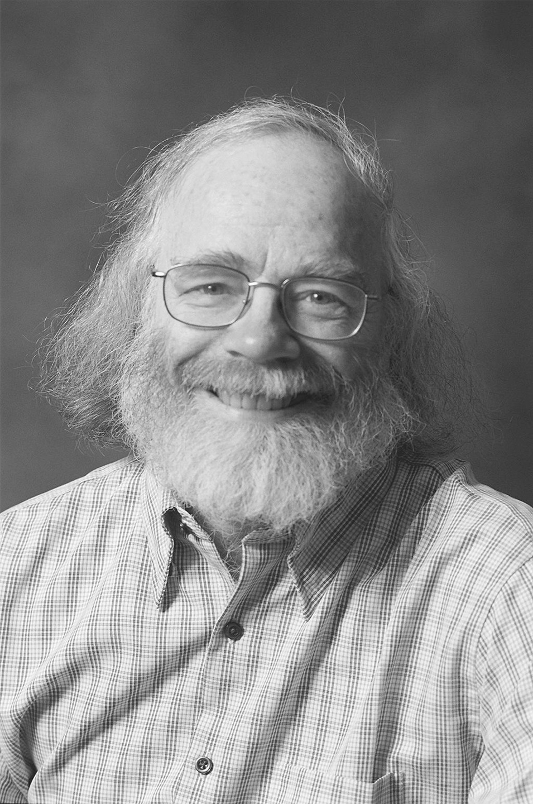

访谈：Steven M. Bellovin
===================================
Interview: Steven M. Bellovin

Steven M. Bellovin 在新泽西州弗洛勒姆帕克 AT&T 实验室的网络服务研究实验室工作多年后，加入了哥伦比亚大学任教。他的研究重点是网络、安全，以及为什么这两者不兼容。1995 年，他因参与创建 Usenet 而获得了 Usenix 终身成就奖。Usenet 是第一个将两台或多台计算机连接起来的新组交换网络，允许用户共享信息并参与讨论。Steve 也是美国国家工程院的当选院士。他在哥伦比亚大学获得学士学位，在北卡罗来纳大学教堂山分校获得博士学位。

.. toggle::

   Steven M. Bellovin joined the faculty at Columbia University after many years at the Network Services Research Lab at AT&T Labs Research in Florham Park, New Jersey. His focus is on networks, security, and why the two are incompatible. In 1995, he was awarded the Usenix Lifetime Achievement Award for his work in the creation of Usenet, the first newsgroup exchange network that linked two or more computers and allowed users to share information and join in discussions. Steve is also an elected member of the National Academy of Engineering. He received his BA from Columbia University and his PhD from the University of North Carolina at Chapel Hill.

   .. figure:: ../img/744-0.png 
      :align: center
      :scale: 20%

是什么促使您专注于网络安全领域？
------------------------------------------------------------
What led you to specialize in the networking security area?

这听起来可能很奇怪，但答案很简单：这很有趣。我的背景是系统编程和系统管理，这很自然地引向了安全领域。而且我一直对通信感兴趣，这可以追溯到我大学时期做的兼职系统编程工作。

我对安全的研究仍然受到两个因素的驱动——一个是希望计算机保持有用性，这意味着它们的功能不能被攻击者破坏；另一个是希望保护隐私。

.. toggle::

   This is going to sound odd, but the answer is simple: It was fun. My background was in systems programming and systems administration, which leads fairly naturally to security. And I’ve always been interested in communications, ranging back to part-time systems programming jobs when I was in college.

   My work on security continues to be motivated by two things—a desire to keep computers useful, which means that their function can’t be corrupted by attackers, and a desire to protect privacy.

在您开发 Usenet 时，您对它的愿景是什么？而现在呢？
-------------------------------------------------------------------------------------------
What was your vision for Usenet at the time that you were developing it? And now?

我们最初将其视为一种在全国范围内讨论计算机科学和计算机编程的方式，同时在本地也用于管理事务、待售广告等等。事实上，我最初的预测是每天一到两条消息，最多来自 50–100 个站点——永远如此。但实际增长是在与人相关的话题上，包括但不限于人与计算机的互动。多年来我最喜欢的新组有 rec.woodworking 以及 sci.crypt 等。

在某种程度上，网络新闻已被 Web 取代。如果我现在重新设计它，它会看起来非常不同。但它仍然非常擅长吸引对特定话题感兴趣的广泛受众，而不必依赖特定的网站。

.. toggle::

   We originally viewed it as a way to talk about computer science and computer programming around the country, with a lot of local use for administrative matters, for-sale ads, and so on. In fact, my original prediction was one to two messages per day, from 50–100 sites at the most— ever. But the real growth was in people-related topics, including—but not limited to—human interactions with computers. My favorite newsgroups, over the years, have been things like rec.woodworking, as well as sci.crypt.

   To some extent, netnews has been displaced by the Web. Were I to start designing it today, it would look very different. But it still excels as a way to reach a very broad audience that is interested in the topic, without having to rely on particular Web sites.

有没有人在职业上激励过您？以何种方式？
----------------------------------------------------------------
Has anyone inspired you professionally? In what ways?

Fred Brooks 教授——北卡罗来纳大学教堂山分校计算机科学系的创始人和首任系主任，IBM S/360 和 OS/360 项目的管理者，以及《神秘的人月神话》的作者——对我的职业生涯产生了巨大影响。最重要的是，他教会了我如何看待问题和权衡取舍——如何在现实世界的背景下看待问题（以及现实世界比理论家想象的要混乱得多），以及如何在设计解决方案时平衡相互冲突的目标。大多数计算机工作都是工程——是一种在众多矛盾目标之间做出正确权衡的艺术。

.. toggle::

   Professor Fred Brooks—the founder and original chair of the computer science department at the University of North Carolina at Chapel Hill, the manager of the team that developed the IBM S/360 and OS/360, and the author of The Mythical Man-Month—was a tremendous influence on my career. More than anything else, he taught outlook and trade-offs—how to look at problems in the context of the real world (and how much messier the real world is than a theorist would like), and how to balance competing interests in designing a solution. Most computer work is engineering—the art of making the right trade-offs to satisfy many contradictory objectives.

您对网络和安全的未来有何愿景？
--------------------------------------------------------------------------
What is your vision for the future of networking and security?

迄今为止，我们拥有的大多数安全性都来自隔离。例如，防火墙通过切断对某些机器和服务的访问来发挥作用。但我们正处于一个连接性日益增强的时代——想要隔离事物变得越来越难。更糟的是，我们的生产系统需要更多独立组件通过网络互联。保护这一切是我们面临的最大挑战之一。

.. toggle::

   Thus far, much of the security we have has come from isolation. A firewall, for example, works by cutting off access to certain machines and services. But we’re in an era of increasing connectivity—it’s gotten harder to isolate things. Worse yet, our production systems require far more separate pieces, interconnected by networks. Securing all that is one of our biggest challenges.

您认为安全领域迄今为止最大的进展是什么？我们还需要走多远？
--------------------------------------------------------------------------------------------------------------------
What would you say have been the greatest advances in security? How much further do we have to go?

至少从科学角度来看，我们已经知道如何进行加密了。这是一个很大的帮助。但大多数安全问题都是由存在漏洞的代码引起的，这是一个更难的问题。事实上，这是计算机科学中最古老但尚未解决的问题，我认为它将继续如此。挑战在于，当我们必须用不安全的组件构建系统时，如何保障其安全性。我们已经知道如何在硬件故障的情况下实现系统的可靠性；那我们能否对安全性做到同样的事情？

.. toggle::

   At least scientifically, we know how to do cryptography. That’s been a big help. But most security problems are due to buggy code, and that’s a much harder problem. In fact, it’s the oldest unsolved problem in computer science, and I think it will remain that way. The challenge is figuring out how to secure systems when we have to build them out of insecure components. We can already do that for reliability in the face of hardware failures; can we do the same for security?

您对学习互联网和网络安全的学生有什么建议？
------------------------------------------------------------------------------------
Do you have any advice for students about the Internet and networking security?

掌握技术机制是容易的部分。更难的是学会“疑心病式地思考”。你必须记住概率分布不适用——攻击者会找到并利用那些不太可能的情况。而细节也非常重要。

.. toggle::

   Learning the mechanisms is the easy part. Learning how to “think paranoid” is harder. You have to remember that probability distributions don’t apply—the attackers can and will find improbable conditions. And the details matter—a lot.
 