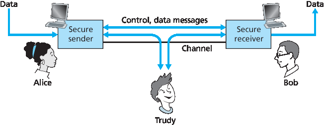

.. _c8.1:

8.1 什么是网络安全？
==========================================================================
8.1 What Is Network Security?

.. tab:: 中文

.. tab:: 英文

Let’s begin our study of network security by returning to our lovers, Alice and Bob, who want to communicate “securely.” What precisely does this mean? Certainly, Alice wants only Bob to be able to understand a message that she has sent, even though they are communicating over an insecure medium where an intruder (Trudy, the intruder) may intercept whatever is transmitted from Alice to Bob. Bob also wants to be sure that the message he receives from Alice was indeed sent by Alice, and Alice wants to make sure that the person with whom she is communicating is indeed Bob. Alice and Bob also want to make sure that the contents of their messages have not been altered in transit. They also want to be assured that they can communicate in the first place (i.e., that no one denies them access to the resources needed to communicate). Given these considerations, we can identify the following desirable properties of **secure communication**.

- **Confidentiality**. Only the sender and intended receiver should be able to understand the contents of the transmitted message. Because eavesdroppers may intercept the message, this necessarily requires that the message be somehow **encrypted** so that an intercepted message cannot be understood by an interceptor. This aspect of confidentiality is probably the most commonly perceived meaning of the term secure communication. We’ll study cryptographic techniques for encrypting and decrypting data in :ref:`Section 8.2 <c8.2>`.
- **Message integrity**. Alice and Bob want to ensure that the content of their ­communication is not altered, either maliciously or by accident, in transit. Extensions to the checksumming techniques that we encountered in reliable transport and data link protocols can be used to provide such message integrity. We will study message integrity in :ref:`Section 8.3 <c8.3>`.
- **End-point authentication**. Both the sender and receiver should be able to confirm the identity of the other party involved in the communication—to confirm that the other party is indeed who or what they claim to be. Face-to-face human communication solves this problem easily by visual recognition. When communicating entities exchange messages over a medium where they cannot see the other party, authentication is not so simple. When a user wants to access an inbox, how does the mail server verify that the user is the person he or she claims to be? We study end-point
authentication in :ref:`Section 8.4 <c8.4>`.
- **Operational security**. Almost all organizations (companies, universities, and so on) today have networks that are attached to the public Internet. These networks therefore can potentially be compromised. Attackers can attempt to deposit worms into the hosts in the network, obtain corporate secrets, map the internal network configurations, and launch DoS attacks. We’ll see in :ref:`Section 8.9 <c8.9>` that operational devices such as firewalls and intrusion detection systems are used to counter attacks against an organization’s network. A firewall sits between the organization’s network and the public network, controlling packet access to and from the network. An intrusion detection system performs “deep packet ­inspection,” ­alerting the network administrators about suspicious activity.

Having established what we mean by network security, let’s next consider exactly what information an intruder may have access to, and what actions can be taken by the intruder. :ref:`Figure 8.1 <Figure 8.1>` illustrates the scenario. Alice, the sender, wants to send data to Bob, the receiver. In order to exchange data securely, while meeting the requirements of confidentiality, end-point authentication, and message integrity, Alice and Bob will exchange control messages and data messages (in much the same way that TCP senders and receivers exchange control segments and data segments).

.. _Figure 8.1:

**Figure 8.1 Sender, receiver, and intruder (Alice, Bob, and Trudy)**

All or some of these messages will typically be encrypted. As discussed in :ref:`Section 1.6 <c1.6>`, an intruder can potentially perform

- eavesdropping—sniffing and recording control and data messages on the ­channel. 
- modification, insertion, or deletion of messages or message content.

As we’ll see, unless appropriate countermeasures are taken, these capabilities allow an intruder to mount a wide variety of security attacks: snooping on communication (possibly stealing passwords and data), impersonating another entity, hijacking an ongoing session, denying service to legitimate network users by overloading system resources, and so on. A summary of reported attacks is maintained at the CERT Coordination Center :ref:`[CERT 2016] <CERT 2016>`.

Having established that there are indeed real threats loose in the Internet, what are the Internet equivalents of Alice and Bob, our friends who need to communicate securely? Certainly, Bob and Alice might be human users at two end systems, for example, a real Alice and a real Bob who really do want to exchange secure e-mail. They might also be participants in an electronic commerce transaction. For example, a real Bob might want to transfer his credit card number securely to a Web server to purchase an item online. Similarly, a real Alice might want to interact with her bank online. The parties needing secure communication might themselves also be part of the network infrastructure. Recall that the domain name system (DNS, see :ref:`Section 2.4 <c2.4>`) or routing daemons that exchange routing information (see :ref:`Chapter 5 <c5>`) require secure communication between two parties. The same is true for network management applications, a topic we examined in :ref:`Chapter 5 <c5>`). An intruder that could actively interfere with DNS lookups (as discussed in :ref:`Section 2.4 <c2.4>`), routing computations [:rfc:`4272`], or network management functions [:rfc:`3414`] could wreak havoc in the Internet.

Having now established the framework, a few of the most important definitions, and the need for network security, let us next delve into cryptography. While the use of cryptography in providing confidentiality is self-evident, we’ll see shortly that it is also central to providing end-point authentication and message integrity—making cryptography a cornerstone of network security.

