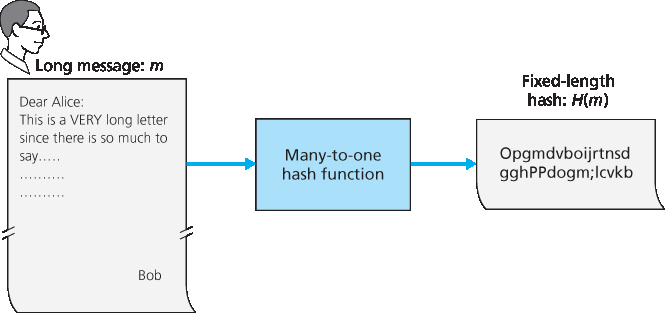
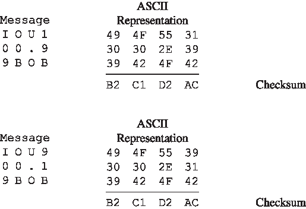
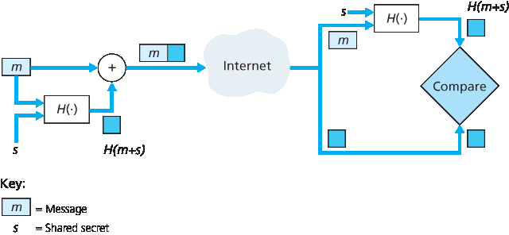
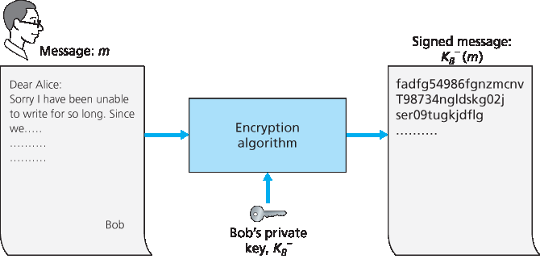
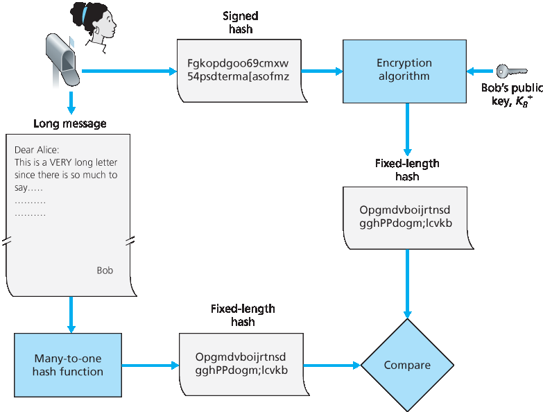
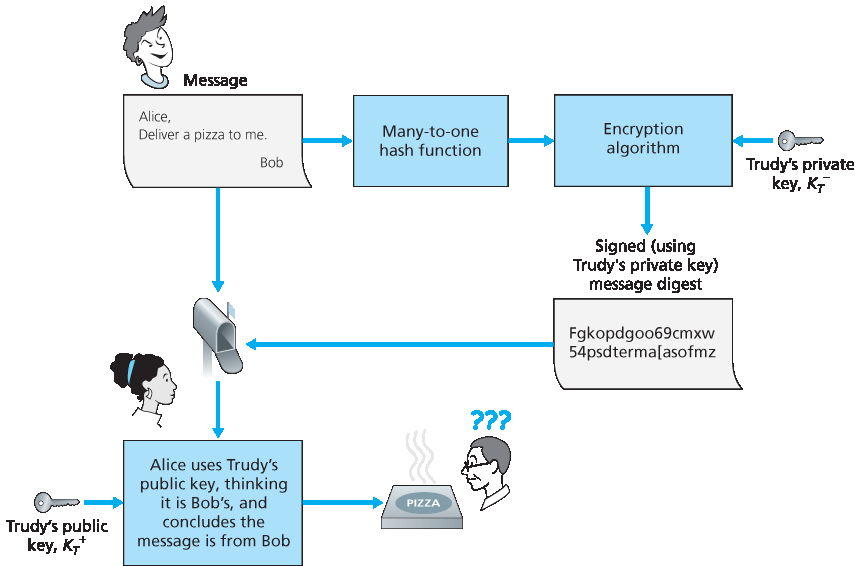

.. _c8.3:

8.3 消息完整性和数字签名
==========================================================================
8.3 Message Integrity and Digital Signatures

在上一节中，我们看到加密如何用于为两个通信实体提供保密性。本节我们转向密码学中同样重要的一个主题：提供 **消息完整性** （也称为消息认证）。在讨论消息完整性的同时，我们还将介绍两个相关主题：数字签名和端点认证。

我们再次以 Alice 和 Bob 为例来定义消息完整性问题。假设 Bob 收到了一条消息（可能是加密的，也可能是明文的），他相信这条消息是 Alice 发送的。为了验证该消息的真实性，Bob 需要确认以下两点：

1. 该消息确实来源于 Alice；
2. 在传送过程中，该消息没有被篡改。

我们将在 :ref:`Sections 8.4 <c8.4>` 到 :ref:`8.7 <c8.7>` 中看到，消息完整性问题几乎在所有安全网络协议中都是一个关键问题。

举一个具体的例子，考虑一个计算机网络使用链路状态路由算法（例如 OSPF）来确定网络中每对路由器之间的路由（见 :ref:`Chapter 5 <c5>`）。在链路状态算法中，每个路由器需要向网络中的所有其他路由器广播一条链路状态消息。一个路由器的链路状态消息包含其直接连接的邻居列表以及到这些邻居的直达代价。一旦某个路由器收到了所有其他路由器的链路状态消息，它就可以创建出整个网络的完整图，运行最短路径路由算法，并配置其转发表。对该路由算法的一种相对简单的攻击是，Trudy 发布伪造的链路状态消息，包含错误的链路状态信息。因此需要消息完整性机制 —— 当路由器 B 接收到来自路由器 A 的链路状态消息时，路由器 B 应该验证该消息确实是由路由器 A 创建的，并且在传输过程中没有被篡改。

在本节中，我们将介绍一种在许多安全网络协议中广泛使用的消息完整性技术。但在此之前，我们需要先介绍密码学中的另一个重要主题 —— 密码哈希函数。

.. toggle::

   In the previous section we saw how encryption can be used to provide confidentiality to two communicating entities. In this section we turn to the equally important cryptography topic of providing **message integrity** (also known as message ­authentication). Along with message integrity, we will discuss two related topics in this section: digital signatures and end-point authentication.
   
   We define the message integrity problem using, once again, Alice and Bob. Suppose Bob receives a message (which may be encrypted or may be in plaintext) and he believes this message was sent by Alice. To authenticate this message, Bob needs to verify:
   
   1. The message indeed originated from Alice.
   2. The message was not tampered with on its way to Bob.
   
   We’ll see in :ref:`Sections 8.4 <c8.4>` through :ref:`8.7 <c8.7>` that this problem of message integrity is a critical concern in just about all secure networking protocols.
   
   As a specific example, consider a computer network using a link-state routing algorithm (such as OSPF) for determining routes between each pair of routers in the network (see :ref:`Chapter 5 <c5>`). In a link-state algorithm, each router needs to broadcast a link-state message to all other routers in the network. A router’s link-state message includes a list of its directly connected neighbors and the direct costs to these neighbors. Once a router receives link-state messages from all of the other routers, it can create a complete map of the network, run its least-cost routing algorithm, and configure its forwarding table. One relatively easy attack on the routing algorithm is for Trudy to distribute bogus link-state messages with incorrect link-state information. Thus the need for message integrity—when router B receives a link- state message from router A, router B should verify that router A actually created the message and, further, that no one tampered with the message in transit. 
   
   In this section, we describe a popular message integrity technique that is used by many secure networking protocols. But before doing so, we need to cover another important topic in cryptography— cryptographic hash functions.

.. _c8.3.1:

8.3.1 加密哈希函数
----------------------------------------------------------------------------------
8.3.1 Cryptographic Hash Functions

如 :ref:`Figure 8.7 <Figure 8.7>` 所示，哈希函数接受一个输入 m，并计算出一个固定长度的字符串 H(m)，称为哈希值。Internet 校验和（:ref:`Chapter 3 <c3>`）和 CRC（:ref:`Chapter 6 <c6>`）都符合这个定义。密码哈希函数还需要满足以下附加性质：

- 计算上无法找到任意两个不同的消息 x 和 y，使得 H(x)=H(y)。

非正式地说，这个性质意味着攻击者在计算上无法通过替换另一条消息来伪造一个具有相同哈希值的消息。也就是说，如果（m, H(m)）是一条由发送方生成的消息及其哈希值，那么攻击者无法伪造另一条消息 y，使得 H(y)=H(m)。

.. _Figure 8.7:

**图 8.7 哈希函数**

.. _Figure 8.8:

**图 8.8 原始消息和伪造消息具有相同的校验和！**

让我们来验证一下，一个简单的校验和（如 Internet 校验和）为何不适合作为密码哈希函数。我们不使用一补码运算（如 Internet 校验和所用），而是将每个字符视为一个字节，并每次使用 4 字节块将这些字节相加来计算校验和。假设 Bob 欠 Alice 100.99 美元，并发送一条 IOU 消息给 Alice，内容为字符串 “IOU100.99BOB”。该字符串的 ASCII 表示（十六进制）为：49、4F、55、31、30、30、2E、39、39、42、4F、42。

:ref:`Figure 8.8 <Figure 8.8>`（顶部）显示该消息的 4 字节校验和为 B2 C1 D2 AC。而另一条稍有不同的消息（对 Bob 来说代价大得多）显示在 :ref:`Figure 8.8 <Figure 8.8>` 的底部。消息 “IOU100.99BOB” 和 “IOU900.19BOB” 拥有相同的校验和。因此，这个简单的校验和算法违反了上述的要求。给定原始数据，很容易找出另一组具有相同校验和的数据。显然，在安全方面，我们需要比校验和更强大的哈希函数。

Ron Rivest 的 MD5 哈希算法 [:rfc:`1321`] 是目前广泛使用的算法。它以四步过程计算 128 位哈希值，这四步包括填充（添加一个 1 后跟足够的 0，以满足消息长度的特定要求）、附加（在填充前附加消息长度的 64 位表示）、初始化累加器，以及最终循环步骤，在该步骤中消息的 16 个字块在四轮中被处理（混乱变形）。有关 MD5 的描述（包括 C 源码实现）请参见 [:rfc:`1321`]。

当前使用的第二个主要哈希算法是安全哈希算法（SHA-1）:ref:`[FIPS 1995] <FIPS 1995>`。该算法基于与其前身 MD4 [:rfc:`1320`] 设计中类似的原理。SHA-1 是美国联邦标准，在联邦应用中需要使用密码哈希算法时必须采用。它生成一个 160 位的消息摘要。更长的输出长度使 SHA-1 更加安全。

.. toggle::

   As shown in :ref:`Figure 8.7 <Figure 8.7>`, a hash function takes an input, m, and computes a fixed-size string H(m) known as a hash. The Internet checksum (:ref:`Chapter 3 <c3>`) and CRCs (:ref:`Chapter 6 <c6>`) meet this definition. A cryptographic hash function is required to have the following additional property:
   
   - It is computationally infeasible to find any two different messages x and y such that H(x)=H(y).
   
   Informally, this property means that it is computationally infeasible for an intruder to substitute one message for another message that is protected by the hash function. That is, if (m, H(m)) are the message and the hash of the message created by the sender, then an intruder cannot forge the contents of another message, y, that has the same hash value as the original message.
   
   .. figure:: ../img/675-0.png
      :align: center
   
   .. _Figure 8.7:
   
   **Figure 8.7 Hash functions**
   
   
   .. figure:: ../img/675-1.png
      :align: center 
   
   **Figure 8.8 Initial message and fraudulent message have the same ­checksum!**
      
   Let’s convince ourselves that a simple checksum, such as the Internet checksum, would make a poor cryptographic hash function. Rather than performing 1s complement arithmetic (as in the Internet checksum), let us compute a checksum by treating each character as a byte and adding the bytes together using 4-byte chunks at a time. Suppose Bob owes Alice $100.99 and sends an IOU to Alice consisting of the text string “IOU100.99BOB.” The ASCII representation (in hexadecimal notation) for these letters is 49, 4F, 55, 31, 30, 30, 2E, 39, 39, 42, 4F, 42.
   
   :ref:`Figure 8.8 <Figure 8.8>` (top) shows that the 4-byte checksum for this message is B2 C1 D2 AC. A slightly different message (and a much more costly one for Bob) is shown in the bottom half of :ref:`Figure 8.8 <Figure 8.8>`. The messages “IOU100.99BOB” and “IOU900.19BOB” have the same checksum. Thus, this simple checksum algorithm violates the requirement above. Given the original data, it is simple to find another set of data with the same checksum. Clearly, for security purposes, we are going to need a more powerful hash function than a checksum.
   
   The MD5 hash algorithm of Ron Rivest [:rfc:`1321`] is in wide use today. It computes a 128-bit hash in a four-step process consisting of a padding step (adding a one followed by enough zeros so that the length of the message satisfies certain conditions), an append step (appending a 64-bit representation of the message length before padding), an initialization of an accumulator, and a final looping step in which the message’s 16-word blocks are processed (mangled) in four rounds. For a description of MD5 (including a C source code implementation) see [:rfc:`1321`].
   
   The second major hash algorithm in use today is the Secure Hash Algorithm (SHA-1) :ref:`[FIPS 1995] <FIPS 1995>`. This algorithm is based on principles similar to those used in the design of MD4 [:rfc:`1320`], the predecessor to MD5. SHA-1, a US federal standard, is required for use whenever a cryptographic hash algorithm is needed for federal applications. It produces a 160-bit message digest. The longer output length makes SHA-1 more secure.

.. _c8.3.2:

8.3.2 消息认证码
----------------------------------------------------------------------------------
8.3.2 Message Authentication Code

现在我们回到消息完整性的问题上。既然我们已经理解了哈希函数，那么我们可以初步尝试如何实现消息完整性：

1. Alice 创建消息 m，并计算其哈希值 H(m)（例如使用 SHA-1）。
2. 然后 Alice 将 H(m) 添加到消息 m 后面，形成扩展消息 (m, H(m))，并将扩展消息发送给 Bob。
3. Bob 接收到扩展消息 (m, h) 后计算 H(m)。如果 H(m)=h，Bob 就认为一切正常。

这种方法显然是有缺陷的。Trudy 可以伪造一条消息 ḿ，声称她是 Alice，然后计算 H(ḿ)，再将 (ḿ, H(ḿ)) 发送给 Bob。当 Bob 收到该消息时，第三步中一切看起来都没问题，因此 Bob 不会怀疑有问题。

为了实现消息完整性，除了使用密码哈希函数外，Alice 和 Bob 还需要共享一个秘密 s。这个共享的秘密（只是一串比特）称为 **认证密钥（authentication key）**。使用这个共享秘密，可以按如下方式实现消息完整性：

1. Alice 创建消息 m，将 s 与 m 拼接形成 m+s，并计算哈希值 H(m+s)（例如使用 SHA-1）。H(m+s) 被称为 **消息认证码（message authentication code, MAC）**。
2. 然后 Alice 将 MAC 添加到消息 m 后面，形成扩展消息 (m, H(m+s))，并将扩展消息发送给 Bob。
3. Bob 接收到扩展消息 (m, h) 后，知道 s，于是计算 MAC 值 H(m+s)。如果 H(m+s)=h，Bob 就认为一切正常。

该过程的总结如 :ref:`Figure 8.9 <Figure 8.9>` 所示。读者应注意，这里的 MAC（意为“消息认证码”）不同于链路层协议中所使用的 MAC（意为“媒体访问控制”）！

.. _Figure 8.9:

**图 8.9 消息认证码（MAC）**

MAC 的一个好处是它不需要加密算法。事实上，在许多应用中，包括前面提到的链路状态路由算法，通信实体只关心消息的完整性，而不关心消息的保密性。使用 MAC，通信双方可以在不将复杂的加密算法集成到完整性过程中的情况下，对彼此发送的消息进行认证。

正如你可能预期的，多年来已经提出了多种不同的 MAC 标准。目前最流行的标准是 HMAC，它可以与 MD5 或 SHA-1 一起使用。HMAC 实际上是将数据和认证密钥两次传递给哈希函数 [:ref:`Kaufman 1995 <Kaufman 1995>`; :rfc:`2104`]。

还有一个重要的问题尚未解决。我们如何将共享的认证密钥分发给通信实体？例如，在链路状态路由算法中，我们需要以某种方式将秘密认证密钥分发给自治系统中的每一个路由器。（注意，所有路由器可以使用相同的认证密钥。）网络管理员可以通过亲自访问每一个路由器来完成这项工作。或者，如果网络管理员是个懒人，而且每个路由器都有自己的公钥，网络管理员也可以用某个路由器的公钥对认证密钥进行加密，然后通过网络将加密后的密钥发送给该路由器。

.. toggle::

   Let’s now return to the problem of message integrity. Now that we understand hash functions, let’s take a first stab at how we might perform message integrity:
   
   1. Alice creates message m and calculates the hash H(m) (for example with SHA-1).
   2. Alice then appends H(m) to the message m, creating an extended message (m, H(m)), and sends the extended message to Bob.
   3. Bob receives an extended message (m, h) and calculates H(m). If H(m)=h, Bob concludes that everything is fine.
   
   This approach is obviously flawed. Trudy can create a bogus message m ́ in which she says she is Alice, calculate H(m ́), and send Bob (m ́, H(m ́)). When Bob receives the message, everything checks out in step 3, so Bob doesn’t suspect any funny ­business.
   
   To perform message integrity, in addition to using cryptographic hash functions, Alice and Bob will need a shared secret s. This shared secret, which is nothing more than a string of bits, is called the **authentication key**. Using this shared secret, message integrity can be performed as follows:
   
   1. Alice creates message m, concatenates s with m to create m+s, and calculates the hash H(m+s) (for example with SHA-1). H(m+s) is called the **message authentication code (MAC)**.
   2. Alice then appends the MAC to the message m, creating an extended message (m, H(m+s)), and sends the extended message to Bob.
   3. Bob receives an extended message (m, h) and knowing s, calculates the MAC H(m+s). If H(m+s)=h, Bob concludes that everything is fine.
   A summary of the procedure is shown in :ref:`Figure 8.9 <Figure 8.9>`. Readers should note that the MAC here (standing for “message authentication code”) is not the same MAC used in link-layer protocols (standing for “medium access control”)!
   
   
   .. figure:: ../img/677-0.png
      :align: center 
   
   **Figure 8.9 Message authentication code (MAC)**
   
   One nice feature of a MAC is that it does not require an encryption algorithm. Indeed, in many applications, including the link-state routing algorithm described earlier, communicating entities are only concerned with message integrity and are not concerned with message confidentiality. Using a MAC, the entities can authenticate the messages they send to each other without having to integrate complex encryption algorithms into the integrity process.
   
   
   As you might expect, a number of different standards for MACs have been proposed over the years. The most popular standard today is HMAC, which can be used either with MD5 or SHA-1. HMAC actually runs data and the authentication key through the hash function twice [:ref:`Kaufman 1995 <Kaufman 1995>`; :rfc:`2104`].
   
   There still remains an important issue. How do we distribute the shared authentication key to the communicating entities? For example, in the link-state routing algorithm, we would somehow need to distribute the secret authentication key to each of the routers in the autonomous system. (Note that the routers can all use the same authentication key.) A network administrator could actually accomplish this by physically visiting each of the routers. Or, if the network administrator is a lazy guy, and if each router has its own public key, the network administrator could distribute the authentication key to any one of the routers by encrypting it with the router’s public key and then sending the encrypted key over the network to the router.
   
.. _c8.3.3:
   
8.3.3 数字签名
----------------------------------------------------------------------------------
8.3.3 Digital Signatures

想想你上周在纸上签过多少次名。你会签支票、信用卡收据、法律文件和信件。你的签名证明是你本人（而非其他人）认可和/或同意了文件的内容。在数字世界中，人们常常希望标示文件的所有者或创建者，或表示自己同意文件的内容。 **数字签名** 是一种在数字世界中实现这些目标的加密技术。

就像手写签名一样，数字签名应当是可验证的且不可伪造的。也就是说，必须能够证明某个文件确实是由某个人签署的（签名是可验证的），并且只有该人能够签署该文件（签名是不可伪造的）。

我们现在来考虑如何设计一个数字签名方案。注意，当 Bob 签署一条消息时，Bob 必须在消息上添加一些独属于他的信息。Bob 可以考虑为签名附加一个 MAC，其中 MAC 是将他的密钥（他独有的）附加到消息后再进行哈希计算得到的。但如果 Alice 要验证签名，她也必须拥有这把密钥，在这种情况下密钥就不再是 Bob 独有的了。因此，MAC 在这里无法满足需求。

回忆一下公钥加密，Bob 拥有一对公钥和私钥，这两把钥匙都是 Bob 独有的。因此，公钥加密是实现数字签名的极好候选方案。我们现在来看它是如何实现的。

假设 Bob 想要对一个文档 m 进行数字签名。我们可以把这个文档看作是一个文件或消息，Bob 将对其签名并发送出去。如 :ref:`Figure 8.10 <Figure 8.10>` 所示，为了签署该文档，Bob 只需使用他的私钥 KB− 计算 KB−(m)。起初，这可能看起来有些奇怪，因为我们在 :ref:`Section 8.2 <c8.2>` 中看到 Bob 是用私钥对用公钥加密的消息进行解密的。但要记住，加密和解密不过是数学运算（例如 RSA 中是对 e 或 d 次方的幂运算；见 :ref:`Section 8.2 <c8.2>`），而 Bob 的目标并不是对文档内容进行加密或混淆，而是以一种可验证且不可伪造的方式对文档进行签名。Bob 的数字签名是 KB−(m)。

.. _Figure 8.10:

**图 8.10 为文档创建数字签名**

这个数字签名 KB−(m) 是否满足可验证且不可伪造的要求？假设 Alice 拥有 m 和 KB−(m)。她希望在法庭上（她是个喜欢打官司的人）证明该文档确实是 Bob 签署的，并且只有 Bob 才可能签署该文档。Alice 使用 Bob 的公钥 KB+ 应用于该文档相关的数字签名 KB−(m)，也就是说，她计算 KB+(KB−(m))，然后哗啦一声，她得到了 m，这正好与原始文档完全一致！于是 Alice 便可以论证只有 Bob 才能签署该文档，理由如下：

- 签署该消息的人必须使用了私钥 KB− 来计算签名 KB−(m)，使得 KB+(KB−(m))=m。
- 唯一可能知道私钥 KB− 的人是 Bob。回忆我们在 :ref:`Section 8.2 <c8.2>` 中对 RSA 的讨论，知道公钥 KB+ 并不能帮助推导出私钥 KB−。因此，唯一可能知道 KB− 的人是最初生成该密钥对 (KB+, KB−) 的人，也就是 Bob。（注意，这里假设 Bob 没有将 KB− 提供给任何人，也没有人从他那里窃取过 KB−。）

还需要指出的是，如果原始文档 m 被修改成某个替代形式 ḿ，那么 Bob 为 m 创建的签名对 ḿ 是无效的，因为 KB+(KB−(m)) 不等于 ḿ。因此我们可以看到，数字签名也提供了消息完整性，使接收方能够验证消息是否未被篡改以及消息的来源。

使用加密对数据进行签名的一个问题是，加密和解密的计算代价很高。考虑到加密/解密的开销，使用完整加密/解密来签名数据可能过于繁重。一个更高效的方法是将哈希函数引入数字签名。回忆 :ref:`Section 8.3.2 <c8.3.2>` 中所述，哈希算法接收一个任意长度的消息 m，并计算出固定长度的“指纹”，记作 H(m)。使用哈希函数，Bob 对消息的哈希值进行签名，而不是消息本身，即 Bob 计算 KB−(H(m))。由于 H(m) 通常远小于原始消息 m，生成数字签名所需的计算量大大降低。

在 Bob 向 Alice 发送消息的场景中，:ref:`Figure 8.11 <Figure 8.11>` 总结了创建数字签名的操作过程。Bob 将原始的长消息输入哈希函数，然后用他的私钥对生成的哈希值进行数字签名。原始消息（明文）和数字签名后的消息摘要（下文简称为数字签名）一并发送给 Alice。:ref:`Figure 8.12 <Figure 8.12>` 总结了验证签名的操作过程。Alice 使用发送者的公钥对签名进行解密，得到哈希值；然后 Alice 对明文消息进行哈希计算，得到第二个哈希值。如果两个哈希值相等，那么 Alice 就可以确信消息的完整性和来源。

在继续之前，让我们简要比较一下数字签名和 MAC，因为它们有相似之处，但也存在重要的细微差别。数字签名和 MAC 都从一条消息（或一个文档）开始。为了从消息创建 MAC，我们将认证密钥附加到消息后，然后对结果进行哈希。注意，创建 MAC 时既不涉及公钥加密，也不涉及对称加密。而创建数字签名时，我们先对消息进行哈希，然后用我们的私钥加密该哈希值（使用公钥加密技术）。因此，数字签名是一种“更重”的技术，因为它需要一个包含证书颁发机构的公钥基础设施（PKI）。我们将在 :ref:`Section 8.4 <c8.4>` 中看到，PGP——一个流行的安全电子邮件系统——使用数字签名来实现消息完整性。而我们已经看到 OSPF 使用 MAC 实现消息完整性。在 :ref:`Sections 8.5 <c8.5>` 和 :ref:`8.6 <c8.6>` 中我们将看到，MAC 也被用于流行的传输层和网络层安全协议中。

.. toggle::

   Think of the number of the times you’ve signed your name to a piece of paper during the last week. You sign checks, credit card receipts, legal documents, and letters. Your signature attests to the fact that you (as opposed to someone else) have acknowledged and/or agreed with the document’s contents. In a digital world, one often wants to indicate the owner or creator of a document, or to signify one’s agreement with a document’s content. A **digital signature** is a cryptographic technique for achieving these goals in a digital world.
   
   Just as with handwritten signatures, digital signing should be done in a way that is verifiable and nonforgeable. That is, it must be possible to prove that a document signed by an individual was indeed signed by that individual (the signature must be verifiable) and that only that individual could have signed the document (the signature cannot be forged).
   
   Let’s now consider how we might design a digital signature scheme. Observe that when Bob signs a message, Bob must put something on the message that is unique to him. Bob could consider attaching a MAC for the signature, where the MAC is created by appending his key (unique to him) to the message, and then taking the hash. But for Alice to verify the signature, she must also have a copy of the key, in which case the key would not be unique to Bob. Thus, MACs are not going to get the job done here.
   
   Recall that with public-key cryptography, Bob has both a public and private key, with both of these keys being unique to Bob. Thus, public-key cryptography is an excellent candidate for providing digital signatures. Let us now examine how it is done.
   
   Suppose that Bob wants to digitally sign a document, m. We can think of the document as a file or a message that Bob is going to sign and send. As shown in :ref:`Figure 8.10 <Figure 8.10>`, to sign this document, Bob simply uses his private key, KB−, to compute KB−(m). At first, it might seem odd that Bob is using his private key (which, as we saw in :ref:`Section 8.2 <c8.2>`, was used to decrypt a message that had been encrypted with his public key) to sign a document. But recall that encryption and decryption are nothing more than mathematical operations (exponentiation to the power of e or d in RSA; see :ref:`Section 8.2 <c8.2>`) and recall that Bob’s goal is not to scramble or obscure the contents of the document, but rather to sign the document in a manner that is verifiable and nonforgeable. Bob’s digital signature of the document is KB−(m).
   
   .. figure:: ../img/679-0.png
      :align: center
   
   **Figure 8.10 Creating a digital signature for a document**
   
   Does the digital signature KB−(m) meet our requirements of being verifiable and nonforgeable? Suppose Alice has m and KB−(m). She wants to prove in court (being litigious) that Bob had indeed signed the document and was the only person who could have possibly signed the document. Alice takes Bob’s public key, KB+, and applies it to the digital signature, KB−(m), associated with the document, m. That is, she computes KB+(KB−(m)), and voilà, with a dramatic flurry, she produces m, which exactly matches the original document! Alice then argues that only Bob could have signed the document, for the following reasons:
   
   - Whoever signed the message must have used the private key, KB−, in computing the signature KB−(m), such that KB+(KB−(m))=m.
   - The only person who could have known the private key, KB−, is Bob. Recall from our discussion of RSA in :ref:`Section 8.2 <c8.2>` that knowing the public key, KB+, is of no help in learning the private key, KB−. Therefore, the only person who could know KB− is the person who generated the pair of keys, (KB+, KB−), in the first place, Bob. (Note that this assumes, though, that Bob has not given KB− to anyone, nor has anyone stolen KB− from Bob.)
   
   It is also important to note that if the original document, m, is ever modified to some alternate form, m ́, the signature that Bob created for m will not be valid for m ́, since KB+(KB−(m)) does not equal m ́. Thus we see that digital signatures also provide message integrity, allowing the receiver to verify that the message was unaltered as well as the source of the message.
   
   One concern with signing data by encryption is that encryption and decryption are computationally expensive. Given the overheads of encryption and decryption, signing data via complete encryption/decryption can be overkill. A more efficient approach is to introduce hash functions into the digital signature. Recall from :ref:`­Section 8.3.2 <c8.3.2>` that a hash algorithm takes a message, m, of arbitrary length and computes a fixed-length “fingerprint” of the message, denoted by H(m). Using a hash function, Bob signs the hash of a message rather than the message itself, that is, Bob calculates KB−(H(m)). Since H(m) is generally much smaller than the original message m, the computational effort required to create the digital signature is substantially reduced.
   
   In the context of Bob sending a message to Alice, :ref:`Figure 8.11 <Figure 8.11>` provides a summary of the operational procedure of creating a digital signature. Bob puts his original long message through a hash function. He then digitally signs the resulting hash with his private key. The original message (in cleartext) along with the digitally signed message digest (henceforth referred to as the digital signature) is then sent to
   Alice. :ref:`Figure 8.12 <Figure 8.12>` provides a summary of the operational procedure of the signature. Alice applies the sender’s public key to the message to obtain a hash result. Alice also applies the hash function to the cleartext message to obtain a second hash result. If the two hashes match, then Alice can be sure about the integrity and author of the message.
   
   Before moving on, let’s briefly compare digital signatures with MACs, since they have parallels, but also have important subtle differences. Both digital signatures and MACs start with a message (or a document). To create a MAC out of the message, we append an authentication key to the message, and then take the hash of the result. Note that neither public key nor symmetric key encryption is involved in creating the MAC. To create a digital signature, we first take the hash of the message and then encrypt the message with our private key (using public key cryptography). Thus, a digital signature is a “heavier” technique, since it requires an underlying Public Key Infrastructure (PKI) with certification authorities as described below. We’ll see in :ref:`Section 8.4 <c8.4>` that PGP—a popular secure e-mail system—uses digital signatures for message integrity. We’ve seen already that OSPF uses MACs for message integrity. We’ll see in :ref:`Sections 8.5 <c8.5>` and :ref:`8.6 <c8.6>` that MACs are also used for popular transport-layer and network-layer security protocols.
   
公钥认证
~~~~~~~~~~~~~~~~~~~~~~~~~
Public Key Certification

数字签名的一个重要应用是 **公钥认证**，也就是认证某个公钥确实属于某个特定实体。公钥认证被应用在许多流行的安全网络协议中，包括 IPsec 和 SSL。

为了更好地理解这个问题，我们来看一个关于互联网商业的“披萨恶作剧”经典案例。Alice 从事披萨外卖生意，并接受通过互联网下的订单。Bob 是个披萨爱好者，他给 Alice 发送了一条明文消息，包含了他的家庭地址和他想要的披萨种类。在这条消息中，Bob 还附加了一个数字签名（即对原始明文消息的哈希值进行签名），以此向 Alice 证明该消息确实来自他本人。为了验证签名，Alice 获取 Bob 的公钥（可能从公钥服务器或邮件中获得），然后验证该数字签名。通过这种方式，她可以确认是 Bob 下的订单，而不是某个调皮捣蛋的青少年。

.. _Figure 8.12:

**图 8.12 验证带签名的消息**

这一切听起来都不错，直到聪明的 Trudy 出场。如 :ref:`Figure 8.13 <Figure 8.13>` 所示，Trudy 正在进行一场恶作剧。她向 Alice 发送了一条消息，自称是 Bob，提供了 Bob 的家庭地址，并订购了一份披萨。在这条消息中，她还附上了她自己的（Trudy 的）公钥，尽管 Alice 自然地认为这就是 Bob 的公钥。Trudy 还附加了一个数字签名，这个签名是用她自己的（Trudy 的）私钥生成的。收到消息后，Alice 使用 Trudy 的公钥（以为这是 Bob 的）验证数字签名，并得出该明文消息确实是由 Bob 创建的结论。当外卖员将一份有香肠和凤尾鱼的披萨送到 Bob 家时，Bob 会非常吃惊！

.. _Figure 8.13:

**图 8.13 Trudy 使用公钥加密伪装成 Bob**

从这个例子可以看出，要使公钥加密有用，你必须能够验证你所拥有的公钥确实属于你想要通信的实体（人、路由器、浏览器等）。例如，当 Alice 想要与 Bob 使用公钥加密通信时，她需要验证该公钥确实属于 Bob。

将公钥绑定到特定实体通常由 **认证机构（CA）** 完成，其职责是验证身份并颁发证书。CA 的角色包括：

1. CA 验证某个实体（人、路由器等）的身份是否属实。认证的具体过程并没有统一的规定。在与 CA 打交道时，人们必须信任 CA 已经执行了足够严格的身份验证。例如，如果 Trudy 能走进 Fly-by-Night

   .. _Figure 8.14:

   .. figure:: ../img/684-0.png 
      :align: center 

   **图 8.14 Bob 由 CA 认证其公钥**

   CA 并直接宣称“我是 Alice”，然后就获得了与 Alice 身份相关的证书，那么就不应太过信任由该 Fly-by-Night CA 所认证的公钥。另一方面，人们可能（也可能不会！）更愿意信任隶属于联邦或州政府项目的 CA。你对某个公钥所关联身份的信任程度，仅能达到你对该 CA 及其身份验证方法的信任程度。我们所编织的是一张错综复杂的信任之网！

2. 一旦 CA 验证了实体的身份，CA 就会创建一个 **证书**，将该实体的公钥绑定到该身份。该证书包含公钥及其所有者的全局唯一标识信息（例如人名或 IP 地址）。该证书由 CA 进行数字签名。这些步骤如 :ref:`Figure 8.14 <Figure 8.14>` 所示。

现在我们来看看如何使用证书来对抗像 Trudy 那样的订披萨恶作剧者以及其他不良行为者。当 Bob 下订单时，他同时发送由 CA 签发的证书。Alice 使用 CA 的公钥来验证 Bob 的证书有效性并提取出 Bob 的公钥。

国际电信联盟（ITU）和 IETF 都制定了 CA 的相关标准。ITU 的 X.509 :ref:`[ITU 2005a] <ITU 2005a>` 规范定义了认证服务以及证书的特定语法。[:rfc:`1422`] 描述了用于安全电子邮件的基于 CA 的密钥管理方式。它兼容 X.509，并通过建立密钥管理架构的过程与惯例扩展了 X.509。:ref:`Table 8.4 <Table 8.4>` 描述了证书中的一些重要字段。

.. _Table 8.4:

**表 8.4 X.509 和 RFC 1422 公钥证书中的字段**

.. list-table::

   * - **字段名**
     - **描述**
   * - Version 
     - X.509 规范的版本号
   * - Serial number 
     - CA 为证书分配的唯一标识符
   * - Signature 
     - CA 用于签署该证书的算法
   * - Issuer name 
     - 签发该证书的 CA 的身份信息，采用 DN（可分辨名称）格式 [:rfc:`4514`]
   * - Validity period 
     - 证书的有效期起始与结束时间
   * - Subject name 
     - 与此证书相关联的公钥所有者的身份，采用 DN 格式
   * - Subject public key 
     - 该主体的公钥，以及用于该公钥的公钥算法及参数

.. toggle::

   An important application of digital signatures is **public key certification**, that is, certifying that a public key belongs to a specific entity. Public key certification is used in many popular secure networking protocols, including IPsec and SSL.
   
   To gain insight into this problem, let’s consider an Internet-commerce version of the classic “pizza prank.” Alice is in the pizza delivery business and accepts orders over the Internet. Bob, a pizza lover, sends Alice a plaintext message that includes his home address and the type of pizza he wants. In this message, Bob also includes a digital signature (that is, a signed hash of the original plaintext message) to prove to Alice that he is the true source of the message. To verify the signature, Alice obtains Bob’s public key (perhaps from a public key server or from the e-mail message) and checks the digital signature. In this manner she makes sure that Bob, rather than some adolescent prankster, placed the order.
   
   .. figure:: ../img/682-0.png 
      :align: center 
      
   **Figure 8.12 Verifying a signed message**
   
   This all sounds fine until clever Trudy comes along. As shown in :ref:`Figure 8.13 <Figure 8.13>`, Trudy is indulging in a prank. She sends a message to Alice in which she says she is Bob, gives Bob’s home address, and orders a pizza. In this message she also includes her (Trudy’s) public key, although Alice naturally assumes it is Bob’s public key. Trudy also attaches a digital signature, which was created with her own (Trudy’s) private key. After receiving the message, Alice applies Trudy’s public key (thinking that it is Bob’s) to the digital signature and concludes that the plaintext message was indeed created by Bob. Bob will be very surprised when the delivery person brings a pizza with pepperoni and anchovies to his home!
   
   .. figure:: ../img/683-0.png 
      :align: center 
      
   **Figure 8.13 Trudy masquerades as Bob using public key cryptography**
   
   We see from this example that for public key cryptography to be useful, you need to be able to verify that you have the actual public key of the entity (person, router, browser, and so on) with whom you want to communicate. For example, when Alice wants to communicate with Bob using public key cryptography, she needs to verify that the public key that is supposed to be Bob’s is indeed Bob’s.
   
   Binding a public key to a particular entity is typically done by a **Certification Authority (CA)**, whose job is to validate identities and issue certificates. A CA has the following roles:
   
   1. A CA verifies that an entity (a person, a router, and so on) is who it says it is. There are no mandated procedures for how certification is done. When dealing with a CA, one must trust the CA to have performed a suitably rigorous identity verification. For example, if Trudy were able to walk into the Fly-by-Night
   
      .. figure:: ../img/684-0.png 
         :align: center 
         
      **Figure 8.14  Bob has his public key certified by the CA**
   
      CA and simply announce “I am Alice” and receive certificates associated with the identity of Alice, then one shouldn’t put much faith in public keys certified by the Fly-by-Night CA. On the other hand, one might (or might not!) be more willing to trust a CA that is part of a federal or state program. You can trust the identity associated with a public key only to the extent to which you can trust a CA and its identity verification techniques. What a tangled web of trust we spin!
   
   2. Once the CA verifies the identity of the entity, the CA creates a **certificate** that binds the public key of the entity to the identity. The certificate contains the public key and globally unique identifying information about the owner of the public key (for example, a human name or an IP address). The certificate is digitally signed by the CA. These steps are shown in :ref:`Figure 8.14 <Figure 8.14>`.
   
   Let us now see how certificates can be used to combat pizza-ordering pranksters, like Trudy, and other undesirables. When Bob places his order he also sends his CA-signed certificate. Alice uses the CA’s public key to check the validity of Bob’s certificate and extract Bob’s public key.
   
   Both the International Telecommunication Union (ITU) and the IETF have developed standards for CAs. ITU X.509 :ref:`[ITU 2005a] <ITU 2005a>` specifies an authentication service as well as a specific syntax for certificates. [:rfc:`1422`] describes CA-based key management for use with secure Internet e-mail. It is compatible with X.509 but goes beyond X.509 by establishing procedures and conventions for a key management architecture. :ref:`Table 8.4 <Table 8.4>` describes some of the important fields in a certificate.
   
   **Table 8.4 Selected fields in an X.509 and RFC 1422 public key**
   
   .. list-table::
      
      * - **Field Name**
        - **Description**
      * - Version 
        - Version number of X.509 specification
      * - Serial number 
        - CA-issued unique identifier for a certificate
      * - Signature 
        - Specifies the algorithm used by CA to sign this certificate
      * - Issuer name 
        - Identity of CA issuing this certificate, in distinguished name (DN) [:rfc:`4514`] format
      * - Validity period 
        - Start and end of period of validity for certificate
      * - Subject name 
        - Identity of entity whose public key is associated with this certificate, in DN format
      * - Subject public key 
        - The subject’s public key as well indication of the public key algorithm (and algorithm parameters) to be used with this key
