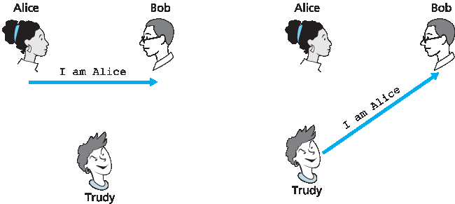
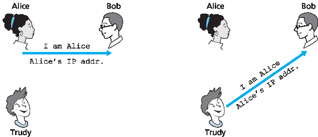
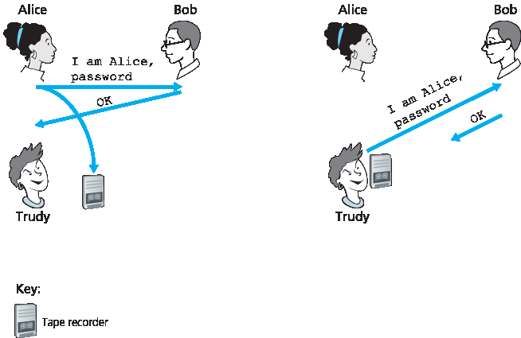
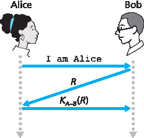

.. _c8.4:

8.4 端点身份验证
==========================================================================
8.4 End-Point Authentication

.. tab:: 中文

.. tab:: 英文

**End-point authentication** is the process of one entity proving its identity to another entity over a computer network, for example, a user proving its identity to an e-mail server. As humans, we authenticate each other in many ways: We recognize each ­other’s faces when we meet, we recognize each other’s voices on the telephone, we are authenticated by the customs official who checks us against the picture on our passport.

In this section, we consider how one party can authenticate another party when the two are communicating over a network. We focus here on authenticating a “live” party, at the point in time when communication is actually occurring. A concrete example is a user authenticating him or herself to an e- mail server. This is a subtly different problem from proving that a message received at some point in the past did indeed come from that claimed sender, as studied in :ref:`Section 8.3 <c8.3>`.

When performing authentication over the network, the communicating parties cannot rely on biometric information, such as a visual appearance or a voiceprint. Indeed, we will see in our later case studies that it is often network elements such as routers and client/server processes that must authenticate each other. Here, authentication must be done solely on the basis of messages and data exchanged as part of an **authentication protocol**. Typically, an authentication protocol would run before the two communicating parties run some other protocol (for example, a reliable data transfer protocol, a routing information exchange protocol, or an e-mail protocol). The authentication protocol first establishes the identities of the parties to each other’s satisfaction; only after authentication do the parties get down to the work at hand.

As in the case of our development of a reliable data transfer (rdt) protocol in :ref:`Chapter 3 <c3>`, we will find it instructive here to develop various versions of an authentication protocol, which we will call **ap** (authentication protocol), and poke holes in each version as we proceed. (If you enjoy this stepwise evolution of a design, you might also enjoy :ref:`[Bryant 1988] <Bryant 1988>`, which recounts a fictitious narrative between designers of an open-network authentication system, and their discovery of the many subtle issues involved.)

.. _Figure 8.15:
    
**Figure 8.15 Protocol ap1.0 and a failure scenario**

Let’s assume that Alice needs to authenticate herself to Bob.

.. _c8.4.1:

8.4.1 鉴权协议 ap1.0
----------------------------------------------------------------------------------
8.4.1 Authentication Protocol ap1.0

.. tab:: 中文

.. tab:: 英文

Perhaps the simplest authentication protocol we can imagine is one where Alice simply sends a message to Bob saying she is Alice. This protocol is shown in :ref:`Figure 8.15 <Figure 8.15>`. The flaw here is obvious— there is no way for Bob actually to know that the person sending the message “I am Alice” is indeed Alice. For example, Trudy (the intruder) could just as well send such a message.

.. _c8.4.2:

8.4.2 认证协议 ap2.0
----------------------------------------------------------------------------------
8.4.2 Authentication Protocol ap2.0

.. tab:: 中文

.. tab:: 英文

If Alice has a well-known network address (e.g., an IP address) from which she always communicates, Bob could attempt to authenticate Alice by verifying that the source address on the IP datagram carrying the authentication message matches Alice’s well-known address. In this case, Alice would be authenticated. This might stop a very network-naive intruder from impersonating Alice, but it wouldn’t stop the determined student studying this book, or many others!

From our study of the network and data link layers, we know that it is not that hard (for example, if one had access to the operating system code and could build one’s own operating system kernel, as is the case with Linux and several other freely available operating systems) to create an IP datagram, put whatever IP source address we want (for example, Alice’s well-known IP address) into the IP datagram, and send the datagram over the link-layer protocol to the first-hop router. From then on, the incorrectly source-addressed datagram would be dutifully forwarded to Bob. This approach,
shown in :ref:`Figure 8.16 <Figure 8.16>`, is a form of IP spoofing. IP spoofing can be avoided if Trudy’s first-hop router is configured to forward only datagrams containing Trudy’s IP source address [:rfc:`2827`]. However, this
capability is not universally deployed or enforced. Bob would thus be foolish to assume that Trudy’s network manager (who might be Trudy herself) had configured Trudy’s first-hop router to forward only appropriately addressed datagrams.

.. _Figure 8.16:

**Figure 8.16 Protocol ap2.0 and a failure scenario**

.. _c8.4.3:

8.4.3 鉴权协议 ap3.0
----------------------------------------------------------------------------------
8.4.3 Authentication Protocol ap3.0

.. tab:: 中文

.. tab:: 英文

One classic approach to authentication is to use a secret password. The password is a shared secret between the authenticator and the person being authenticated. Gmail, Facebook, telnet, FTP, and many other services use password authentication. In protocol ap3.0, Alice thus sends her secret password to Bob, as shown in :ref:`Figure 8.17 <Figure 8.17>`.

Since passwords are so widely used, we might suspect that protocol ap3.0 is fairly secure. If so, we’d be wrong! The security flaw here is clear. If Trudy eavesdrops on Alice’s communication, then she can learn Alice’s password. Lest you think this is unlikely, consider the fact that when you Telnet to another machine and log in, the login password is sent unencrypted to the Telnet server. Someone connected to the Telnet client or server’s LAN can possibly sniff (read and store) all packets transmitted on the LAN and thus steal the login password. In fact, this is a well-known approach for stealing passwords (see, for example, :ref:`[Jimenez 1997] <Jimenez 1997>`). Such a threat is obviously very real, so ap3.0 clearly won’t do.

.. _c8.4.4:

8.4.4 鉴权协议 ap3.1
----------------------------------------------------------------------------------
8.4.4 Authentication Protocol ap3.1

.. tab:: 中文

.. tab:: 英文

Our next idea for fixing ap3.0 is naturally to encrypt the password. By encrypting the password, we can prevent Trudy from learning Alice’s password. If we assume that Alice and Bob share a symmetric secret key, KA−B, then Alice can encrypt the password and send her identification message, “I am Alice,” and her encrypted password to Bob. Bob then decrypts the password and, assuming the password is correct, authenticates Alice. Bob feels comfortable in authenticating Alice since Alice not only knows the password, but also knows the shared secret key value needed to encrypt the password. Let’s call this protocol ap3.1.

.. _Figure 8.17:

**Figure 8.17 Protocol ap3.0 and a failure scenario**

While it is true that ap3.1 prevents Trudy from learning Alice’s password, the use of cryptography here does not solve the authentication problem. Bob is subject to a **playback attack**: Trudy need only eavesdrop on Alice’s communication, record the encrypted version of the password, and play back the encrypted version of the password to Bob to pretend that she is Alice. The use of an encrypted password in ap3.1 doesn’t make the situation manifestly different from that of protocol ap3.0 in :ref:`Figure 8.17 <Figure 8.17>`.

.. _c8.4.5:

8.4.5 鉴权协议 ap4.0
----------------------------------------------------------------------------------
8.4.5 Authentication Protocol ap4.0

.. tab:: 中文

.. tab:: 英文

The failure scenario in :ref:`Figure 8.17 <Figure 8.17>` resulted from the fact that Bob could not distinguish between the original authentication of Alice and the later playback of Alice’s original authentication. That is, Bob could not tell if Alice was live (that is, was currently really on the other end of the connection) or whether the messages he was receiving were a recorded playback of a previous authentication of Alice. The very (very) observant reader will recall that the three-way TCP handshake protocol needed to address the same problem—the server side of a TCP connection did not want to accept a connection if the received SYN segment was an old copy (retransmission) of a SYN segment from an earlier connection. How did the TCP server side solve the problem of determining whether the client was really live? It chose an initial sequence number that had not been used in a very long time, sent that number to the client, and then waited for the client to respond with an ACK segment containing that number. We can adopt the same idea here for authentication purposes.

A **nonce** is a number that a protocol will use only once in a lifetime. That is, once a protocol uses a nonce, it will never use that number again. Our ap4.0 protocol uses a nonce as follows:

1. Alice sends the message “I am Alice” to Bob.
2. Bob chooses a nonce, R, and sends it to Alice.
3. Alice encrypts the nonce using Alice and Bob’s symmetric secret key, KA−B, and sends the encrypted nonce, KA−B (R), back to Bob. As in protocol ap3.1, it is the fact that Alice knows KA−B and uses it to encrypt a value that lets Bob know that the message he receives was generated by Alice. The nonce is used to ensure that Alice is live.
4. Bob decrypts the received message. If the decrypted nonce equals the nonce he sent Alice, then Alice is authenticated.

Protocol ap4.0 is illustrated in :ref:`Figure 8.18 <Figure 8.18>`. By using the once-in-a-lifetime value, R, and then checking the returned value, KA−B (R), Bob can be sure that Alice is both who she says she is (since she knows the secret key value needed to encrypt R) and live (since she has encrypted the nonce, R, that Bob just created).

The use of a nonce and symmetric key cryptography forms the basis of ap4.0. A natural question is whether we can use a nonce and public key cryptography (rather than symmetric key cryptography) to solve the authentication problem. This issue is explored in the problems at the end of the chapter.

.. _Figure 8.18:

**Figure 8.18 Protocol ap4.0 and a failure scenario**