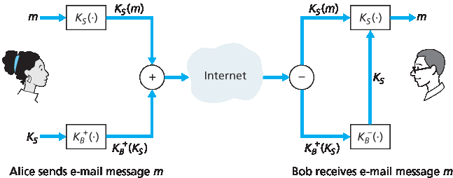
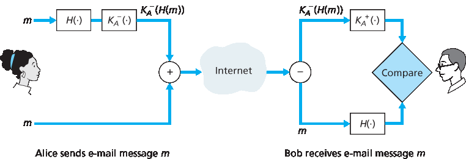
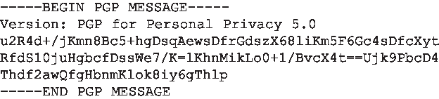

.. _c8.5:

8.5 电子邮件安全
==========================================================================
8.5 Securing E-Mail

在前面的章节中，我们探讨了网络安全的基本问题，包括对称密钥和公钥密码学、端点认证、密钥分发、消息完整性和数字签名。现在，我们将考察这些工具如何被用来为互联网提供安全保障。

有趣的是，可以在互联网协议栈的任何前四层中提供安全服务。当为特定的应用层协议提供安全性时，使用该协议的应用程序将享有一种或多种安全服务，如机密性、认证或完整性。当为传输层协议提供安全时，所有使用该协议的应用都享有传输协议的安全服务。当在主机到主机的网络层提供安全时，所有传输层段（因此所有应用层数据）都享有网络层的安全服务。当在链路层提供安全时，所有在该链路上传输的帧中的数据都获得链路的安全服务。

在 :ref:`第8.5节 <c8.5>` 至 :ref:`第8.8节 <c8.8>` 中，我们将分别考察安全工具在应用层、传输层、网络层和链路层的应用。与本书的一贯结构保持一致，我们从协议栈的顶层开始，讨论应用层的安全。我们的方式是以特定应用——电子邮件，作为应用层安全的案例研究。随后我们将逐层向下，考察提供传输层安全的 SSL 协议、提供网络层安全的 IPsec 以及 IEEE 802.11 无线局域网协议的安全性。

你可能会疑惑，为什么互联网中要在多个层提供安全功能。难道只在网络层提供安全功能不就足够了吗？对此有两个答案。首先，虽然网络层安全可以通过加密数据报中的所有数据（即所有传输层段）和认证所有源 IP 地址来提供“全方位覆盖”，但它不能提供用户级别的安全性。例如，一个商业网站不能依赖 IP 层安全来认证正在购买商品的客户。因此，除了低层的全覆盖外，高层也需要安全功能。其次，在协议栈的高层部署新互联网服务（包括安全服务）通常更容易。在等待网络层安全被广泛部署（这可能还需要许多年）期间，许多应用开发者“干脆动手”，在其喜爱的应用中引入安全功能。一个经典例子是 Pretty Good Privacy（PGP），提供了安全电子邮件（将在本节后面讨论）。PGP 仅需客户端和服务器的应用程序代码，是最早被广泛使用的互联网安全技术之一。

.. toggle::

    In previous sections, we examined fundamental issues in network security, including symmetric key and public key cryptography, end-point authentication, key distribution, message integrity, and digital signatures. We are now going to examine how these tools are being used to provide security in the Internet.

    Interestingly, it is possible to provide security services in any of the top four layers of the Internet protocol stack. When security is provided for a specific application-layer protocol, the application using the protocol will enjoy one or more security services, such as confidentiality, authentication, or integrity. When security is provided for a transport-layer protocol, all applications that use that protocol enjoy the security services of the transport protocol. When security is provided at the network layer on a host-to- host basis, all transport-layer segments (and hence all application-layer data) enjoy the security services of the network layer. When security is provided on a link basis, then the data in all frames traveling over the link receive the security services of the link.

    In :ref:`Sections 8.5 <c8.5>` through :ref:`8.8 <c8.8>`, we examine how security tools are being used in the application, transport, network, and link layers. Being consistent with the general structure of this book, we begin at the top of the protocol stack and discuss security at the application layer. Our approach is to use a specific application, e-mail, as a case study for application-layer security. We then move down the protocol stack. We’ll examine the SSL protocol (which provides security at the transport layer), IPsec (which provides security at the network layer), and the security of the IEEE 802.11 wireless LAN protocol.

    You might be wondering why security functionality is being provided at more than one layer in the Internet. Wouldn’t it suffice simply to provide the security functionality at the network layer and be done with it? There are two answers to this question. First, although security at the network layer can offer “blanket coverage” by encrypting all the data in the datagrams (that is, all the transport-layer segments) and by authenticating all the source IP addresses, it can’t provide user-level security. For example, a commerce site cannot rely on IP-layer security to authenticate a customer who is purchasing goods at the commerce site. Thus, there is a need for security functionality at higher layers as well as blanket coverage at lower layers. Second, it is generally easier to deploy new Internet services, including security services, at the higher layers of the protocol stack. While waiting for security to be broadly deployed at the network layer, which is probably still many years in the future, many application developers “just do it” and introduce security functionality into their favorite applications. A classic example is Pretty Good Privacy (PGP), which provides secure e-mail (discussed later in this section). Requiring only client and server application code, PGP was one of the first security technologies to be broadly used in the Internet.

.. _c8.5.1:

8.5.1 安全电子邮件
----------------------------------------------------------------------------------
8.5.1 Secure E-Mail

我们现在利用 :ref:`第8.2节 <c8.2>` 至 :ref:`第8.3节 <c8.3>` 中的密码学原理，创建一个安全电子邮件系统。我们以增量方式进行高层设计，每一步引入新的安全服务。设计安全电子邮件系统时，记住第8.1节介绍的激情故事——Alice 和 Bob 之间的爱情故事。想象 Alice 想给 Bob 发一封电子邮件，而 Trudy 想要入侵。

在设计 Alice 和 Bob 的安全电子邮件系统之前，我们应考虑哪些安全特性是他们最需要的。首先是机密性。正如 :ref:`第8.1节 <c8.1>` 讨论的，Alice 和 Bob 都不希望 Trudy 阅读 Alice 的邮件。第二个 Alice 和 Bob 很可能希望看到的是发件人认证。特别是当 Bob 收到消息“我不再爱你了，我再也不想见你了，曾经属于你的 Alice”时，他自然想确定消息确实来自 Alice 而非 Trudy。第三个受欢迎的特性是消息完整性，也就是确保 Alice 发送的消息在传输途中未被篡改。最后，邮件系统还应提供收件人认证，也就是说，Alice 希望确认她发送的信确实是给 Bob，而不是冒充 Bob 的其他人（比如 Trudy）。

首先解决最重要的问题——机密性。提供机密性最直接的方法是 Alice 用对称密钥技术（如 DES 或 AES）加密消息，Bob 收到后解密。如 :ref:`第8.2节 <c8.2>` 所述，如果对称密钥足够长，且只有 Alice 和 Bob 拥有密钥，那么除 Trudy 外的任何人都极难读懂消息。尽管此法直接，但正如 :ref:`第8.2节 <c8.2>` 中讨论的，它存在根本难题——如何分发对称密钥，使得只有 Alice 和 Bob 拥有副本。因此，我们自然考虑另一种方法——公钥密码学（例如使用 RSA）。在公钥方案中，Bob 将他的公钥公开（如放在公钥服务器或个人网页上），Alice 用 Bob 的公钥加密消息，然后发送加密消息到 Bob 的邮箱。Bob 收到消息后，用私钥解密。假设 Alice 确认公钥确实是 Bob 的公钥，这种方法是提供机密性的绝佳手段。但问题是公钥加密效率相对较低，尤其是处理长消息时。

为解决效率问题，我们引入会话密钥（详见 :ref:`第8.2.2节 <c8.2.2>`）。具体做法是，Alice (1) 选择一个随机的对称会话密钥 KS，(2) 用该对称密钥加密消息 m，(3) 用 Bob 的公钥 KB+ 加密该对称密钥，(4) 将加密后的消息和加密后的对称密钥串联成一个“包”，(5) 发送该包到 Bob 的邮箱。步骤如 :ref:`图 8.19 <c8.19>` 所示。（图中带圈的“+”代表串联，带圈的“−”代表拆分。）Bob 收到包后，(1) 用私钥 KB− 解密出对称密钥 KS，(2) 用 KS 解密消息 m。

.. _Figure 8.19:

**图 8.19 Alice 使用对称会话密钥 KS 向 Bob 发送加密邮件**

在设计了提供机密性的安全电子邮件系统后，接下来设计一个同时提供发件人认证和消息完整性的系统。暂且假设 Alice 和 Bob 不再关心机密性（他们想让所有人都知道他们的感情！），只关心发件人认证和消息完整性。为实现该目标，我们使用数字签名和消息摘要，如 :ref:`第8.3节 <c8.3>` 所述。具体做法是，Alice (1) 对消息 m 应用哈希函数 H（例如 MD5），得到消息摘要，(2) 用她的私钥 KA− 对摘要进行签名，生成数字签名，(3) 将原始（未加密）消息和签名串联成包，(4) 发送包到 Bob 的邮箱。Bob 收到包后，(1) 用 Alice 的公钥 KA+ 验证签名，(2) 将结果与自己对消息计算的哈希值 H 比较。步骤见 :ref:`图 8.20 <Figure 8.20>`。如 :ref:`第8.3节 <c8.3>` 所述，如果两者一致，Bob 可以相当肯定消息来自 Alice 且未被篡改。

现在考虑设计一个同时提供机密性、发件人认证和消息完整性的电子邮件系统。可以将 :ref:`图 8.19 <Figures 8.19>` 和 :ref:`图 8.20 <Figures 8.20>` 中的步骤结合起来。Alice 首先创建一个初步包，内容如 :ref:`图 8.20 <Figure 8.20>`，包含原始消息和数字签名的消息摘要。然后她将此初步包视为消息本身，通过 :ref:`图 8.19 <Figure 8.19>` 中的发件人步骤加密，生成一个新的包发送给 Bob。Alice 的操作见 :ref:`图 8.21 <Figure 8.21>`。Bob 收到包后，先执行 :ref:`图 8.19 <Figure 8.19>` 中的接收步骤，再执行 :ref:`图 8.20 <Figure 8.20>` 中的接收步骤。显然，该设计实现了机密性、发件人认证和消息完整性的目标。注意，在此方案中，Alice 两次使用公钥密码学：一次用自己的私钥，一次用 Bob 的公钥。Bob 也两次使用公钥密码学：一次用自己的私钥，一次用 Alice 的公钥。

.. _Figure 8.20:

**图 8.20 使用哈希函数和数字签名实现发件人认证和消息完整性**

:ref:`图 8.21 <Figure 8.21>` 所示的安全电子邮件设计可能为大多数邮件用户提供了大多数情况下满意的安全性。但仍有一重要问题需解决。该设计要求 Alice 获得 Bob 的公钥，Bob 也获得 Alice 的公钥。公钥的分发并非易事。例如，Trudy 可能冒充 Bob，向 Alice 提供自己的公钥，声称是 Bob 的公钥，从而获得发给 Bob 的消息。正如 :ref:`第8.3节 <c8.3>` 所学，安全分发公钥的一个常用方法是通过 CA 认证公钥。

.. _Figure 8.21:

.. figure:: ../img/695-1.png 
    :align: center 

**图 8.21 Alice 使用对称密钥密码学、公钥密码学、哈希函数和数字签名，实现保密性、发件人认证和消息完整性**

.. toggle::

    We now use the cryptographic principles of :ref:`Sections 8.2 <c8.2>` through :ref:`8.3 <c8.3>` to create a secure e-mail system. We create this high-level design in an incremental manner, at each step introducing new security services. When designing a secure e-mail system, let us keep in mind the racy example introduced in Section 8.1—the love affair between Alice and Bob. Imagine that Alice wants to send an e-mail message to Bob, and Trudy wants to intrude.

    Before plowing ahead and designing a secure e-mail system for Alice and Bob, we should consider which security features would be most desirable for them. First and foremost is confidentiality. As discussed in :ref:`Section 8.1 <c8.1>`, neither Alice nor Bob wants Trudy to read Alice’s e-mail message. The second feature that Alice and Bob would most likely want to see in the secure e-mail system is sender authentication. In particular, when Bob receives the message “I don’t love you anymore. I never want to see you again. Formerly yours, Alice, ” he would naturally want to be sure that the message came from Alice and not from Trudy. Another feature that the two lovers would appreciate is message integrity, that is, assurance that the message Alice sends is not modified while en route to Bob. Finally, the e-mail system should provide receiver authentication; that is, Alice wants to make sure that she is indeed sending the letter to Bob and not to someone else (for example, Trudy) who is impersonating Bob.

    So let’s begin by addressing the foremost concern, confidentiality. The most straightforward way to provide confidentiality is for Alice to encrypt the message with symmetric key technology (such as DES or AES) and for Bob to decrypt the message on receipt. As discussed in :ref:`Section 8.2 <c8.2>`, if the symmetric key is long enough, and if only Alice and Bob have the key, then it is extremely difficult for anyone else (including Trudy) to read the message. Although this approach is straightforward, it has the fundamental difficulty that we discussed in :ref:`Section 8.2 <c8.2>`—distributing a symmetric key so that only Alice and Bob have copies of it. So we naturally consider an alternative approach—public key cryptography (using, for example, RSA). In the public key approach, Bob makes his public key publicly available (e.g., in a public key server or on his personal Web page), Alice encrypts her message with Bob’s public key, and she sends the encrypted message to Bob’s e-mail address. When Bob receives the message, he simply decrypts it with his private key. Assuming that Alice knows for sure that the public key is Bob’s public key, this approach is an excellent means to provide the desired confidentiality. One problem, however, is that public key encryption is relatively inefficient, particularly for long messages.

    To overcome the efficiency problem, let’s make use of a session key (discussed in :ref:`Section 8.2.2 <c8.2.2>`). In particular, Alice (1) selects a random symmetric session key, KS, (2) encrypts her message, m, with the symmetric key, (3) encrypts the symmetric key with Bob’s public key, KB+, (4) concatenates the encrypted message and the encrypted symmetric key to form a “package,” and (5) sends the package to Bob’s e-mail address. The steps are illustrated in :ref:`Figure 8.19 <c8.19>`. (In this and the subsequent figures, the circled “+” represents concatenation and the circled “−” represents deconcatenation.) When Bob receives the package, he (1) uses his private key, KB−, to obtain the symmetric key, KS, and (2) uses the symmetric key KS to decrypt the message m.

    .. figure:: ../img/694-0.png 
        :align: center 

    **Figure 8.19 Alice used a symmetric session key, KS, to send a secret e-mail to Bob**

    Having designed a secure e-mail system that provides confidentiality, let’s now design another system that provides both sender authentication and message integrity. We’ll suppose, for the moment, that Alice and Bob are no longer concerned with confidentiality (they want to share their feelings with everyone!), and are concerned only about sender authentication and message integrity. To accomplish this task, we use digital signatures and message digests, as described in :ref:`Section 8.3 <c8.3>`. Specifically, Alice (1) applies a hash function, H (for example, MD5), to her message, m, to obtain a message digest, (2) signs the result of the hash function with her private key, KA−, to create a digital signature, (3) concatenates the original (unencrypted) message with the signature to create a package, and (4) sends the package to Bob’s e-mail address. When Bob receives the package, he (1) applies Alice’s public key, KA+, to the signed message digest and (2) compares the result of this operation with his own hash, H, of the message. The steps are illustrated in :ref:`Figure 8.20 <Figure 8.20>`. As discussed in :ref:`Section 8.3 <c8.3>`, if the two results are the same, Bob can be pretty confident that the message came from Alice and is unaltered.

    Now let’s consider designing an e-mail system that provides confidentiality, sender authentication, and message integrity. This can be done by combining the procedures in :ref:`Figures 8.19 <Figures 8.19>` and :ref:`8.20 <Figures 8.20>`. Alice first creates a preliminary package, exactly as in :ref:`Figure 8.20 <Figure 8.20>`, that consists of her original message along with a digitally signed hash of the message. She then treats this preliminary package as a message in itself and sends this new message through the sender steps in :ref:`Figure 8.19 <Figure 8.19>`, creating a new package that is sent to Bob. The steps applied by Alice are shown in :ref:`Figure 8.21 <Figure 8.21>`. When Bob receives the package, he first applies his side of :ref:`Figure 8.19 <Figure 8.19>` and then his side of :ref:`Figure 8.20 <Figure 8.20>`. It should be clear that this design achieves the goal of providing confidentiality, sender authentication, and message integrity. Note that, in this scheme, Alice uses public key cryptography twice: once with her own private key and once with Bob’s public key. Similarly, Bob also uses public key cryptography twice—once with his private key and once with Alice’s public key.

    .. figure:: ../img/695-0.png 
        :align: center 

    **Figure 8.20 Using hash functions and digital signatures to provide ­sender authentication and message integrity**

    The secure e-mail design outlined in :ref:`Figure 8.21 <Figure 8.21>` probably provides satisfactory security for most e-mail users for most occasions. But there is still one important issue that remains to be addressed. The design in :ref:`Figure 8.21 <Figure 8.21>` requires Alice to obtain Bob’s public key, and requires Bob to obtain Alice’s public key. The distribution of these public keys is a nontrivial problem. For example, Trudy might masquerade as Bob and give Alice her own public key while saying that it is Bob’s public key, enabling her to receive the message meant for Bob. As we learned in :ref:`Section 8.3 <c8.3>`, a popular approach for securely distributing public keys is to certify the public keys using a CA.

    .. figure:: ../img/695-1.png 
        :align: center 

    **Figure 8.21 Alice uses symmetric key cyptography, public key cryptography, a hash function, and a digital signature to ­provide secrecy, sender authentication, and message integrity**

.. _c8.5.2:

8.5.2 PGP
----------------------------------------------------------------------------------

由 Phil Zimmermann 于1991年编写的 **Pretty Good Privacy (PGP)** 是电子邮件加密方案的一个典型例子 :ref:`[PGPI 2016] <PGPI 2016>`。PGP 有多个公开版本，例如你可以在国际 PGP 主页上找到适合你平台的 PGP 软件及大量有趣的阅读材料 :ref:`[PGPI 2016] <PGPI 2016>`。PGP 设计本质上与 :ref:`图 8.21 <Figure 8.21>` 的设计相同。不同版本的 PGP 软件使用 MD5 或 SHA 计算消息摘要；采用 CAST、三重 DES 或 IDEA 进行对称加密；用 RSA 实现公钥加密。

安装 PGP 后，软件为用户生成一对公钥。公钥可以发布在用户网站或公钥服务器上。私钥则由密码保护。用户每次访问私钥时必须输入密码。PGP 允许用户选择数字签名、消息加密，或同时进行数字签名和加密。:ref:`图 8.22 <Figure 8.22>` 显示了一个 PGP 签名消息。该消息位于 MIME 头之后。消息中的编码数据是 KA−(H(m))，即数字签名的消息摘要。正如上述讨论，为了让 Bob 验证消息完整性，他需要访问 Alice 的公钥。

:ref:`图 8.23 <Figure 8.23>` 显示了一个秘密的 PGP 消息。该消息也位于 MIME 头之后。显然，明文消息不包含在秘密邮件消息中。当发送者（如 Alice）既想保证机密性又想保证完整性时，PGP 会将 :ref:`图 8.23 <Figure 8.23>` 中的消息包含在 :ref:`图 8.22 <Figure 8.22>` 的消息中。

PGP 还提供公钥认证机制，但机制与传统的 CA 大相径庭。PGP 公钥通过信任网络认证。当 Alice 认为某个密钥/用户名对确实对应时，她可以认证该对。此外，PGP 允许 Alice 表示她信任另一用户为更多密钥的真实性背书。一些 PGP 用户通过举办密钥签名聚会彼此签署密钥。用户们聚集交换公钥，并用私钥签署认证彼此的密钥。

.. _Figure 8.22:

.. figure:: ../img/696-0.png 
    :align: center 

**图 8.22 一个 PGP 签名消息**

.. _Figure 8.23:

**图 8.23 一个秘密的 PGP 消息**

.. toggle::

    Written by Phil Zimmermann in 1991, **Pretty Good Privacy (PGP)** is a nice example of an e-mail encryption scheme :ref:`[PGPI 2016] <PGPI 2016>`. Versions of PGP are available in the public domain; for example, you can find the PGP software for your favorite platform as well as lots of interesting reading at the International PGP Home Page :ref:`[PGPI 2016] <PGPI 2016>`. The PGP design is, in essence, the same as the design shown in :ref:`Figure 8.21 <Figure 8.21>`. Depending on the version, the PGP software uses MD5 or SHA for calculating the message digest; CAST, triple-DES, or IDEA for symmetric key encryption; and RSA for the public key encryption.

    When PGP is installed, the software creates a public key pair for the user. The public key can be posted on the user’s Web site or placed in a public key server. The private key is protected by the use of a password. The password has to be entered every time the user accesses the private key. PGP gives the user the option of digitally signing the message, encrypting the message, or both digitally signing and
    encrypting. :ref:`Figure 8.22 <Figure 8.22>` shows a PGP signed message. This message appears after the MIME header. The encoded data in the message is KA−(H(m)), that is, the digitally signed message digest. As we discussed above, in order for Bob to verify the integrity of the message, he needs to have access to Alice’s public key.

    :ref:`Figure 8.23 <Figure 8.23>` shows a secret PGP message. This message also appears after the MIME header. Of course, the plaintext message is not included within the secret e-mail message. When a sender (such as Alice) wants both confidentiality and integrity, PGP contains a message like that of :ref:`Figure 8.23 <Figure 8.23>` within the message of :ref:`Figure 8.22 <Figure 8.22>`.

    PGP also provides a mechanism for public key certification, but the mechanism is quite different from the more conventional CA. PGP public keys are certified by a web of trust. Alice herself can certify any key/username pair when she believes the pair really belong together. In addition, PGP permits Alice to say that she trusts another user to vouch for the authenticity of more keys. Some PGP users sign each other’s keys by holding key-signing parties. Users physically gather, exchange ­public keys, and certify each other’s keys by signing them with their private keys.

    .. figure:: ../img/696-0.png 
        :align: center 

    **Figure 8.22 A PGP signed message**

    .. figure:: ../img/697-0.png 
        :align: center 

    **Figure 8.23 A secret PGP message**
